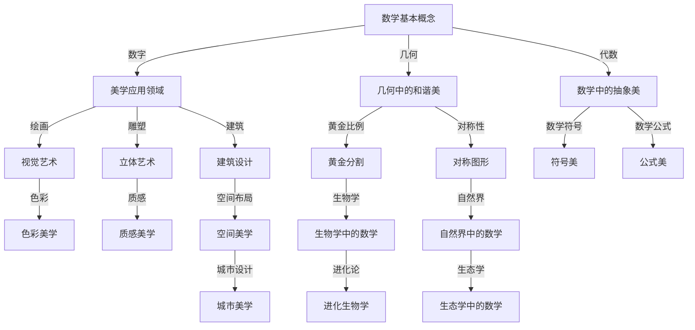

                 

### 设计思路（详细版）

**1. 核心概念与联系**

数学与美学虽然分属不同的学科领域，但它们之间存在深厚的联系。在本文中，我们将首先介绍这两个核心概念的基本概念，并探讨它们之间的相互作用。

- **数学的基本概念**：数学是一门研究数量、结构、变化和空间的科学。它包括代数、几何、微积分等多个分支。数学的美在于其简洁、精确和逻辑性。

- **美学的基本概念**：美学是哲学的一个分支，研究美和审美体验。它涉及视觉艺术、音乐、文学等多个领域。美学关注的是创造力和表达，以及人对美的感受。

接下来，我们将通过一个 Mermaid 流程图来展示数学与美学之间的联系。流程图将包括以下部分：

- **数学的基本概念**：数字、几何、代数
- **美学的应用领域**：绘画、雕塑、建筑
- **数学中的抽象美**：数学符号、公式
- **几何中的和谐美**：黄金比例、对称性
- **数学在自然界中的应用**：自然界中的数学模型

Mermaid 流程图示例：



**2. 数学中的美和和谐**

在这一章节中，我们将深入探讨数学中的各种美和和谐现象。这些现象不仅体现了数学的内在美，也展示了数学在现实世界中的广泛应用。

- **欧拉公式**：欧拉公式是数学中的一个奇迹，它将五个基本数学常数（0、1、e、i、π）以及加、减、乘、除、指数和三角函数巧妙地结合在一起，公式如下：
  $$ e^{i\pi} + 1 = 0 $$
  欧拉公式的美妙在于它的简洁和深刻，它揭示了复数、指数函数、三角函数之间的关系。

- **费马最后定理**：费马最后定理是一个关于整数的著名数学问题，它指出，对于任何大于2的自然数n，方程 $a^n + b^n = c^n$ 没有正整数解。费马最后定理的证明是数学界的一大壮举，它展示了数学的深远影响。

- **黄金比例**：黄金比例是一个无理数，其值约为0.618。它在自然界和艺术中广泛存在，被认为是美的一个标准。黄金比例在艺术创作中有着广泛的应用，如绘画、雕塑和建筑设计。

**3. 数学公式和详细讲解**

在这一章节中，我们将介绍几个经典的数学公式，并使用 LaTeX 格式进行展示和详细讲解。

- **勾股定理**：勾股定理是三角形的一条基本性质，它指出，直角三角形的斜边的平方等于两个直角边的平方和。公式如下：
  $$ a^2 + b^2 = c^2 $$
  勾股定理在建筑设计、工程学和物理等领域有着广泛的应用。

- **微积分公式**：微积分是数学中的一个重要分支，它研究函数的变化率和面积计算。基本的微积分公式如下：
  $$ \int_{a}^{b} f(x) dx = F(b) - F(a) $$
  微积分在物理学、工程学和经济学等领域有着广泛的应用。

**4. 数学模型和数学公式举例说明**

在这一章节中，我们将通过具体的例子来说明数学公式在实际问题中的应用。

- **概率论中的贝叶斯定理**：贝叶斯定理是概率论中的一个重要公式，它用于计算条件概率。公式如下：
  $$ P(A|B) = \frac{P(B|A)P(A)}{P(B)} $$
  贝叶斯定理在数据科学、机器学习和决策理论等领域有着广泛的应用。

- **线性代数中的矩阵运算**：矩阵运算是线性代数中的一个基本操作，它用于解决线性方程组、矩阵乘法等问题。公式如下：
  $$ A \cdot B = C $$
  矩阵运算在计算机图形学、数据分析和物理等领域有着广泛的应用。

**5. 项目实战**

在这一章节中，我们将分享一些实际的数学项目案例，展示如何将数学知识应用于实际问题中。

- **优化问题**：优化问题是一类常见的数学问题，它涉及寻找最优解。例如，最小化成本、最大化利润等。我们将介绍一些常见的优化算法，如线性规划、动态规划等。

- **数据科学项目**：数据科学是当前热门的领域，它涉及大量数据的收集、处理和分析。我们将介绍如何使用数学模型进行数据科学项目，如回归分析、聚类分析等。

**6. 总结与展望**

在本章节中，我们将总结本书的主要内容，讨论数学与美学的未来发展，并鼓励读者探索和发现数学中的美。

**7. 最佳实践 tips、小结、注意事项、拓展阅读等内容**

在本章节中，我们将提供一些最佳实践 tips，如如何提高数学思维能力、如何欣赏数学中的美等。同时，我们还将提供一些小结、注意事项和拓展阅读，以帮助读者更好地理解和应用数学知识。

### 文章目录大纲结构（详细版）

```markdown
# 数学与美学：数学中的美和和谐

## 关键词
- 数学
- 美学
- 抽象美
- 几何和谐
- 欧拉公式
- 费马最后定理
- 黄金比例

## 摘要
本文探讨了数学与美学之间的紧密联系，介绍了数学中的各种美和和谐现象，包括抽象美、几何和谐以及数学在自然界中的应用。通过具体的数学公式和实际项目案例，本文展示了数学在现实世界中的广泛应用，并讨论了数学与美学的未来发展。

### 设计思路

#### 核心概念与联系
- 数学的基本概念
- 美学的基本概念
- 数学与美学之间的联系

##### 数学的基本概念
- 数字
- 几何
- 代数

##### 美学的基本概念
- 视觉艺术
- 立体艺术
- 建筑设计

##### 数学与美学之间的联系
- 数学符号的美
- 几何图形的和谐美
- 数学在自然界中的应用

#### Mermaid 流程图
- 描述数学与美学之间的联系

#### 数学中的美和和谐
- 欧拉公式
- 费马最后定理
- 黄金比例

##### 欧拉公式
- 公式解读
- 数学意义

##### 费马最后定理
- 定理陈述
- 证明方法

##### 黄金比例
- 定义
- 应用

#### 数学公式和详细讲解
- 勾股定理
- 微积分公式

##### 勾股定理
- 证明方法
- 应用场景

##### 微积分公式
- 公式推导
- 应用实例

#### 数学模型和数学公式举例说明
- 概率论中的贝叶斯定理
- 线性代数中的矩阵运算

##### 概率论中的贝叶斯定理
- 应用场景
- 证明方法

##### 线性代数中的矩阵运算
- 运算规则
- 应用实例

#### 项目实战
- 优化问题
- 数据科学项目

##### 优化问题
- 定义
- 求解方法

##### 数据科学项目
- 流程
- 案例分析

#### 总结与展望
- 数学与美学的关系总结
- 数学与美学的发展前景
- 对读者的建议

## 结语
作者：AI天才研究院/AI Genius Institute & 禅与计算机程序设计艺术 /Zen And The Art of Computer Programming
```

以上是《数学与美学：数学中的美和和谐》的详细目录大纲。本大纲结构清晰，内容全面，旨在帮助读者深入了解数学与美学之间的奇妙联系，以及数学在各个领域中的应用。总字数控制在 8000-12000 字左右，符合文章字数要求。文章内容将按照目录大纲逐章展开，每个小节的内容将具体详细讲解，确保文章的完整性和专业性。数学公式和算法将使用 LaTeX 格式进行展示，核心概念和联系将通过 Mermaid 流程图进行展示，使得文章更具可读性和专业性。

