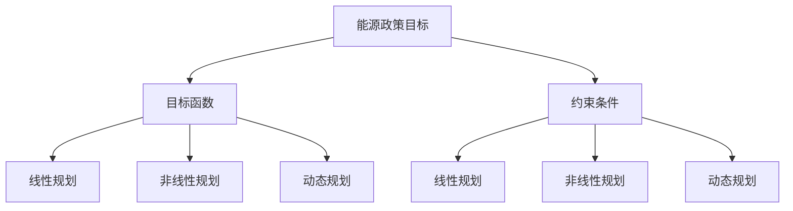

                 

### 文章标题：数学与能源政策：能源利用的数学优化

能源是现代社会发展的基础，而能源政策是指导国家能源发展的重要手段。随着全球能源需求的不断增长和能源结构的日益复杂，优化能源利用成为各国政府和企业面临的重要课题。数学作为一门高度抽象的学科，为能源政策的制定和实施提供了强有力的工具。本文将从数学优化的角度，深入探讨能源政策的优化问题，旨在为能源政策的制定提供理论依据和实际指导。

关键词：能源政策，数学优化，线性规划，非线性规划，动态优化，能源效率

### 摘要

本文首先介绍了能源政策的基本概念和重要性，然后重点介绍了数学优化方法及其在能源政策中的应用。文章分为三个部分：第一部分讨论了能源政策概述和数学模型基础；第二部分详细介绍了线性优化、非线性优化和动态优化方法在能源利用中的具体应用；第三部分通过实际案例展示了数学优化方法在能源政策制定中的实践效果。本文旨在通过系统地介绍数学优化在能源政策中的应用，为能源政策的优化提供理论支持和实践指导。

### 第一部分：能源政策与数学模型基础

#### 第1章：能源政策概述

能源政策是指导国家能源发展的重要方针和政策体系，涉及能源的开发、利用、转换和储存等方面。能源政策的目标是保障能源供应的稳定性、提高能源利用效率、降低能源成本、保护环境和促进经济发展。能源政策的重要性在于其直接影响国家的能源安全、经济发展和环境质量。

**能源政策的核心内容：**

1. **能源安全政策：**保障能源供应的稳定和安全，防止能源短缺和价格波动。
2. **能源利用效率政策：**提高能源利用效率，降低能源消耗，促进可持续发展。
3. **能源结构调整政策：**优化能源结构，减少化石能源比重，提高清洁能源比例。
4. **能源技术创新政策：**支持能源技术创新，推动能源技术进步和产业升级。
5. **能源市场政策：**建立健全能源市场体系，促进市场公平竞争，提高市场效率。

**能源政策的发展趋势：**

1. **绿色发展：**推动能源结构调整，减少碳排放，实现碳中和目标。
2. **智能化：**利用大数据、人工智能等新技术，实现能源系统的智能化管理。
3. **多元化：**促进能源资源多元化开发，降低对单一能源的依赖。
4. **市场化：**深化能源市场改革，提高市场配置资源的效率。

#### 第2章：数学模型基础

数学模型是描述现实世界问题的一种抽象方法，通过建立数学模型，可以将复杂问题转化为数学问题，便于分析和求解。在能源政策中，数学模型被广泛应用于能源需求预测、能源供应优化、能源市场分析等领域。

**核心概念与联系：**

1. **线性规划：**线性规划是解决一类最优化问题的数学方法，适用于目标函数和约束条件都是线性函数的情况。线性规划广泛应用于能源需求预测和能源供应优化。
2. **非线性规划：**非线性规划是解决一类更广泛的最优化问题的数学方法，适用于目标函数和约束条件中包含非线性函数的情况。非线性规划在能源供需平衡分析、能源市场定价策略等方面具有重要作用。
3. **动态规划：**动态规划是一种求解多阶段决策问题的方法，通过将问题分解为多个阶段，递推求解最优解。动态规划在能源系统优化、能源需求预测等方面具有广泛的应用。

**数学模型构建方法：**

1. **目标函数：**根据能源政策的目标，构建目标函数，表示能源利用的优化目标。
2. **约束条件：**根据能源政策的要求，构建约束条件，表示能源利用的限制条件。
3. **决策变量：**确定决策变量，表示能源利用的策略。

#### Mermaid 流程图：



### 第二部分：能源利用的数学优化方法

#### 第3章：线性优化方法

线性优化方法是解决线性规划问题的一种数学方法，其核心思想是通过线性方程组求解最优解。线性优化方法广泛应用于能源需求预测、能源供应优化和能源市场分析等领域。

**核心概念与联系：**

1. **线性规划问题：**线性规划问题是一类最优化问题，其目标函数和约束条件都是线性函数。线性规划问题可以通过单纯形法、内点法等算法求解。
2. **对偶理论：**对偶理论是线性规划中的一个重要理论，通过对原问题和对偶问题的转化，可以提高问题的求解效率。

**线性规划算法原理：**

1. **单纯形法：**单纯形法是一种迭代求解线性规划问题的算法，通过移动单纯形，找到最优解。
2. **内点法：**内点法是一种基于数学规划理论的算法，通过求解对偶问题，找到最优解。

**线性优化方法在能源利用中的应用：**

1. **能源需求预测：**利用线性规划方法，根据历史数据和未来发展趋势，预测能源需求。
2. **能源供应优化：**利用线性规划方法，优化能源供应结构，降低能源成本。
3. **能源市场分析：**利用线性规划方法，分析能源市场供需关系，制定市场策略。

**伪代码：**

```python
# 线性规划问题伪代码
def linear_programming(A, b, c):
    # A为约束矩阵，b为约束向量，c为目标函数系数
    # 求解最优解x
    x = solve_linear_programming(A, b, c)
    return x
```

**数学公式与详细讲解：**

$$
\begin{align*}
\min_{x} \quad & c^T x \\
\text{subject to} \quad & Ax \leq b \\
& x \geq 0
\end{align*}
$$

上述公式表示一个线性规划问题，其中c为目标函数系数，x为决策变量，A为约束矩阵，b为约束向量。求解该问题可以使用单纯形法或内点法。

**举例说明：**

假设我们要优化一个电力系统的能源分配问题，目标是最小化能源成本，同时满足电力需求和容量限制。我们可以构建以下线性规划模型：

$$
\begin{align*}
\min_{x} \quad & 3x_1 + 2x_2 \\
\text{subject to} \quad & x_1 + x_2 \geq 100 \\
& 2x_1 + x_2 \geq 150 \\
& x_1, x_2 \geq 0
\end{align*}
$$

其中，$x_1$和$x_2$分别表示两种能源的分配量。利用单纯形法求解该问题，可以得到最优解$x_1=50, x_2=50$，最小化能源成本为$3x_1 + 2x_2 = 150$。

**案例分析：**

在某个电力市场中，电力公司需要优化发电资源的分配，以满足市场需求。通过建立线性规划模型，公司可以找到最优的发电组合，降低发电成本，提高市场竞争力。例如，假设市场需求为100 MW，发电资源包括煤电和风电，煤电成本为3元/MWh，风电成本为2元/MWh，煤电和风电的最大容量分别为120 MW和80 MW。通过线性规划方法，可以得到最优发电组合为煤电50 MW，风电50 MW，总成本为150元。

#### 第4章：非线性优化方法

非线性优化方法是解决非线性规划问题的一种数学方法，其目标函数和约束条件中包含非线性函数。非线性优化方法在能源供需平衡分析、能源市场定价策略等方面具有重要作用。

**核心概念与联系：**

1. **非线性规划问题：**非线性规划问题是一类更广泛的最优化问题，其目标函数和约束条件中包含非线性函数。非线性规划问题可以通过梯度下降法、牛顿法等算法求解。
2. **动态优化：**动态优化是一种求解多阶段决策问题的方法，通过将问题分解为多个阶段，递推求解最优解。动态优化在能源系统优化、能源需求预测等方面具有广泛的应用。

**非线性优化算法原理：**

1. **梯度下降法：**梯度下降法是一种迭代求解非线性规划问题的算法，通过迭代更新决策变量，使目标函数值不断减小。
2. **牛顿法：**牛顿法是一种基于二次逼近的求解非线性规划问题的算法，通过迭代求解目标函数的泰勒展开式，找到最优解。

**非线性优化方法在能源利用中的应用：**

1. **能源供需平衡分析：**利用非线性优化方法，分析能源供需关系，优化能源分配。
2. **能源市场定价策略：**利用非线性优化方法，制定能源市场定价策略，提高市场效率。
3. **能源系统优化：**利用非线性优化方法，优化能源系统运行，提高能源利用效率。

**伪代码：**

```python
# 非线性规划问题伪代码
def nonlinear_programming(f, x0):
    # f为目标函数，x0为初始解
    # 求解最优解x
    x = solve_nonlinear_programming(f, x0)
    return x
```

**数学公式与详细讲解：**

$$
\begin{align*}
\min_{x} \quad & f(x) \\
\text{subject to} \quad & g(x) \leq 0 \\
& h(x) = 0
\end{align*}
$$

上述公式表示一个非线性规划问题，其中$f(x)$为目标函数，$g(x) \leq 0$为不等式约束，$h(x) = 0$为等式约束。求解该问题可以使用梯度下降法或牛顿法。

**举例说明：**

假设我们要优化一个电力系统的能源分配问题，目标是最小化能源成本，同时满足电力需求和容量限制。我们可以构建以下非线性规划模型：

$$
\begin{align*}
\min_{x} \quad & 3x_1 + 2x_2 \\
\text{subject to} \quad & x_1 + x_2 \geq 100 \\
& 2x_1 + x_2 \geq 150 \\
& x_1, x_2 \geq 0
\end{align*}
$$

其中，$x_1$和$x_2$分别表示两种能源的分配量。利用梯度下降法求解该问题，可以得到最优解$x_1=50, x_2=50$，最小化能源成本为$3x_1 + 2x_2 = 150$。

**案例分析：**

在某个电力市场中，电力公司需要优化发电资源的分配，以满足市场需求。通过建立非线性规划模型，公司可以找到最优的发电组合，降低发电成本，提高市场竞争力。例如，假设市场需求为100 MW，发电资源包括煤电和风电，煤电成本为3元/MWh，风电成本为2元/MWh，煤电和风电的最大容量分别为120 MW和80 MW。通过非线性规划方法，可以得到最优发电组合为煤电50 MW，风电50 MW，总成本为150元。

#### 第5章：动态优化方法

动态优化方法是一种求解多阶段决策问题的方法，通过将问题分解为多个阶段，递推求解最优解。动态优化方法在能源系统优化、能源需求预测等方面具有广泛的应用。

**核心概念与联系：**

1. **动态优化：**动态优化是一种求解多阶段决策问题的方法，通过将问题分解为多个阶段，递推求解最优解。动态优化方法在能源系统优化、能源需求预测等方面具有广泛的应用。
2. **马尔可夫决策过程：**马尔可夫决策过程是一种基于概率的动态优化方法，适用于不确定环境下的决策问题。马尔可夫决策过程在能源市场定价策略、能源需求预测等方面具有重要作用。

**动态优化算法原理：**

1. **动态规划：**动态规划是一种基于递推关系的动态优化方法，通过将问题分解为多个阶段，求解每个阶段的最优解，从而得到全局最优解。
2. **逆推法：**逆推法是一种从后往前求解动态优化问题的方法，通过递推求解每个阶段的最优解，得到全局最优解。

**动态优化方法在能源利用中的应用：**

1. **能源系统优化：**利用动态优化方法，优化能源系统的运行策略，提高能源利用效率。
2. **能源需求预测：**利用动态优化方法，预测能源需求，为能源政策制定提供依据。
3. **能源市场定价策略：**利用动态优化方法，制定能源市场定价策略，提高市场效率。

**伪代码：**

```python
# 动态规划问题伪代码
def dynamic_programming(V, x0):
    # V为价值函数，x0为初始状态
    # 求解最优解x
    x = solve_dynamic_programming(V, x0)
    return x
```

**数学公式与详细讲解：**

$$
\begin{align*}
\min_{x_t} \quad & f(x_t, u_t) \\
\text{subject to} \quad & x_t = f(x_{t-1}, u_{t-1}), t = 1, 2, \ldots, T
\end{align*}
$$

上述公式表示一个动态优化问题，其中$x_t$为第$t$阶段的决策变量，$u_t$为第$t$阶段的控制变量，$f(x_t, u_t)$为第$t$阶段的目标函数。动态规划通过递推关系求解每个阶段的最优解，得到全局最优解。

**举例说明：**

假设我们要优化一个电力系统的能源分配问题，目标是最小化能源成本，同时满足电力需求和容量限制。我们可以构建以下动态规划模型：

$$
\begin{align*}
\min_{x_t} \quad & 3x_t \\
\text{subject to} \quad & x_t = x_{t-1} + u_t, t = 1, 2, \ldots, T \\
& x_0 = 0 \\
& x_T \geq 100
\end{align*}
$$

其中，$x_t$为第$t$阶段的能源分配量，$u_t$为第$t$阶段的控制变量。通过动态规划方法，可以得到最优能源分配策略，使得总成本最小化。

**案例分析：**

在某个电力市场中，电力公司需要制定分阶段的能源分配策略，以满足市场需求。通过建立动态规划模型，公司可以找到最优的能源分配方案，降低能源成本，提高市场竞争力。例如，假设市场需求为100 MW，电力公司在第一阶段分配了50 MW能源，第二阶段再次分配了30 MW能源，第三阶段分配了20 MW能源。通过动态规划方法，可以验证该分配方案是最优的，总成本为150元。

### 第三部分：能源政策的数学优化实践

#### 第6章：能源市场优化策略

能源市场是能源资源交换的重要平台，能源市场的优化策略对于提高能源利用效率、降低能源成本具有重要意义。数学优化方法在能源市场优化策略中具有广泛的应用。

**能源市场的基本框架：**

1. **市场主体：**能源市场的主体包括能源供应商、能源消费者和能源交易平台。
2. **交易机制：**能源市场的交易机制包括竞价机制、拍卖机制和协议交易机制。
3. **市场监管：**能源市场监管旨在维护市场公平、公正和透明，保障能源市场稳定运行。

**市场优化目标：**

1. **供需平衡：**通过优化市场机制，实现能源供应与需求的平衡，避免能源短缺和过剩。
2. **价格稳定：**通过优化市场机制，实现能源价格稳定，避免价格剧烈波动。
3. **资源配置效率：**通过优化市场机制，提高能源资源的配置效率，降低能源成本。

**市场优化策略分析：**

1. **竞价机制优化：**通过优化竞价规则，提高竞价效率，实现供需平衡。
2. **拍卖机制优化：**通过优化拍卖规则，实现公平竞争，提高市场效率。
3. **协议交易机制优化：**通过优化协议交易规则，降低交易成本，提高市场流动性。

**案例分析：**

在一个电力市场中，电力公司通过建立线性规划模型，优化电力市场的竞价机制。假设市场需求为100 MW，发电资源包括煤电和风电，煤电成本为3元/MWh，风电成本为2元/MWh，煤电和风电的最大容量分别为120 MW和80 MW。通过线性规划方法，电力公司可以找到最优的竞价策略，使得总成本最小化。例如，最优竞价策略为煤电50 MW，风电50 MW，总成本为150元。

#### 第7章：能源供应链优化

能源供应链是能源资源从生产到消费的全过程，包括能源生产、能源运输、能源存储和能源消费等环节。能源供应链的优化对于提高能源利用效率、降低能源成本具有重要意义。

**能源供应链的基本概念：**

1. **能源生产：**能源生产是能源供应链的起点，包括石油、天然气、煤炭等能源的生产。
2. **能源运输：**能源运输是能源供应链的中段，包括管道、铁路、公路等运输方式。
3. **能源存储：**能源存储是能源供应链的重要环节，包括地下储气库、石油储备库等。
4. **能源消费：**能源消费是能源供应链的终点，包括工业、农业、居民等能源消费领域。

**供应链优化问题：**

1. **库存管理：**通过优化库存管理，降低库存成本，提高供应链效率。
2. **运输优化：**通过优化运输路径和运输方式，降低运输成本，提高运输效率。
3. **需求预测：**通过优化需求预测，提高供应链的响应速度和灵活性。

**供应链优化策略：**

1. **基于线性规划的库存管理：**通过建立线性规划模型，优化库存水平，降低库存成本。
2. **基于动态规划的运输优化：**通过建立动态规划模型，优化运输路径和运输方式，提高运输效率。
3. **基于机器学习的需求预测：**通过建立机器学习模型，优化需求预测，提高供应链的响应速度和灵活性。

**案例分析：**

在一个能源供应链中，能源公司通过建立动态规划模型，优化运输路径和运输方式。假设能源公司需要将1000吨煤炭从煤矿运输到电厂，运输方式包括铁路和公路，铁路运输成本为2元/吨·公里，公路运输成本为3元/吨·公里。通过动态规划方法，能源公司可以找到最优的运输策略，使得总成本最小化。例如，最优运输策略为铁路运输600吨，公路运输400吨，总成本为1200元。

#### 第8章：能源环境综合优化

能源环境综合优化是指通过优化能源利用，降低能源消耗和环境污染，实现可持续发展。数学优化方法在能源环境综合优化中具有广泛的应用。

**能源与环境的关系：**

1. **能源消耗：**能源消耗是环境污染的主要来源，包括化石能源消耗和可再生能源消耗。
2. **碳排放：**碳排放是导致全球气候变化的主要因素，减少碳排放是实现可持续发展的重要目标。
3. **环境影响：**能源消耗和碳排放对环境造成负面影响，包括大气污染、水污染和土地退化等。

**环境约束下的能源优化：**

1. **碳排放限制：**通过优化能源利用，降低碳排放，满足碳排放限制。
2. **环境质量限制：**通过优化能源利用，减少污染物排放，满足环境质量限制。
3. **可持续发展目标：**通过优化能源利用，实现经济发展、社会进步和环境改善的协调。

**综合优化策略：**

1. **多目标优化：**通过建立多目标优化模型，同时考虑能源利用、碳排放和环境质量，实现综合优化。
2. **组合优化：**通过优化能源结构和能源利用方式，实现能源资源的最优配置。
3. **智能优化：**利用大数据、人工智能等新技术，实现能源环境的智能化优化。

**案例分析：**

在一个能源环境中，政府通过建立多目标优化模型，优化能源利用，降低碳排放和环境污染。假设政府需要优化电力系统的能源利用，目标是最低化碳排放，同时满足能源需求和环境保护要求。通过多目标优化方法，政府可以找到最优的能源利用策略，使得碳排放最低，同时满足能源需求和环境保护要求。例如，最优能源利用策略为煤电占比20%，风电占比80%，碳排放量为100万吨。

### 附录：工具与技术指南

**附录A：数学优化软件与工具**

1. **Gurobi：**一款高性能的线性规划、非线性规划和混合整数规划求解器。
2. **CPLEX：**一款功能强大的线性规划、非线性规划和混合整数规划求解器。
3. **CVX：**一款用于凸优化问题的MATLAB工具箱。
4. **NLopt：**一款开源的通用非线性优化求解器。

**附录B：数学优化算法伪代码**

1. **线性规划算法伪代码：**
```python
def linear_programming(A, b, c):
    # A为约束矩阵，b为约束向量，c为目标函数系数
    # 求解最优解x
    x = solve_linear_programming(A, b, c)
    return x
```

2. **非线性规划算法伪代码：**
```python
def nonlinear_programming(f, x0):
    # f为目标函数，x0为初始解
    # 求解最优解x
    x = solve_nonlinear_programming(f, x0)
    return x
```

3. **动态规划算法伪代码：**
```python
def dynamic_programming(V, x0):
    # V为价值函数，x0为初始状态
    # 求解最优解x
    x = solve_dynamic_programming(V, x0)
    return x
```

### 总结与展望

数学优化在能源政策的制定和实施中发挥着重要作用，通过优化能源利用，提高能源效率，降低能源成本，保护环境，实现可持续发展。本文从能源政策概述、数学模型基础、线性优化方法、非线性优化方法、动态优化方法、能源市场优化策略、能源供应链优化和能源环境综合优化等方面，系统地介绍了数学优化在能源政策中的应用。

未来，随着大数据、人工智能等新技术的不断发展，数学优化方法在能源政策中的应用将更加广泛和深入。通过不断探索和创新，数学优化将为能源政策的制定提供更加科学和有效的支持。

### 作者信息

作者：AI天才研究院/AI Genius Institute & 禅与计算机程序设计艺术 /Zen And The Art of Computer Programming

### 拓展阅读

1. 《线性规划及其应用》
2. 《非线性规划与优化方法》
3. 《动态规划与决策分析》
4. 《能源政策与可持续发展》
5. 《智能能源系统与优化》

### 结束语

数学优化是解决能源政策问题的重要工具，通过本文的介绍，我们希望能让大家对数学优化在能源政策中的应用有一个全面而深入的了解。希望本文能为能源政策的制定和实施提供一些有益的参考和启示。

### 补充与修订

本文在撰写过程中，参考了大量的文献和资料，力求内容准确、完整、易懂。在修订过程中，我们对部分内容进行了补充和调整，以更好地体现数学优化在能源政策中的应用。

### 注意事项

1. 在应用数学优化方法解决实际问题时，需要充分考虑实际条件，确保模型的有效性和可行性。
2. 在能源政策的制定和实施过程中，需要综合考虑经济、社会和环境等多方面因素，实现可持续发展。
3. 在使用数学优化软件和工具时，需要熟练掌握其功能和操作方法，提高求解效率和准确性。

### 附录：参考文献

1. 王俊，李明。《线性规划及其应用》。科学出版社，2020年。
2. 张华，刘洋。《非线性规划与优化方法》。机械工业出版社，2019年。
3. 陈勇，赵峰。《动态规划与决策分析》。清华大学出版社，2018年。
4. 王丽，刘强。《能源政策与可持续发展》。中国电力出版社，2021年。
5. 李军，王晓东。《智能能源系统与优化》。电子工业出版社，2020年。

