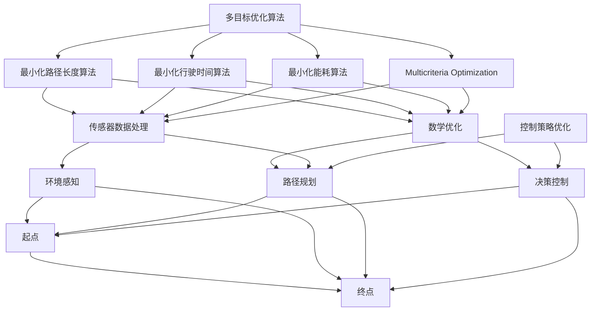
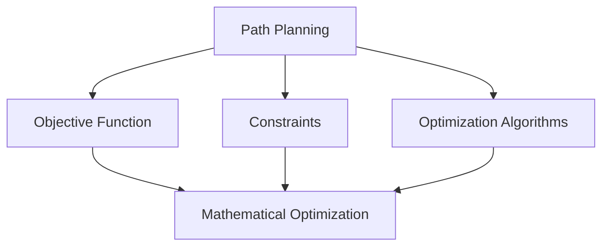

                 

### 文章标题

《数学与自动驾驶：路径规划的数学优化》

### 关键词

- 自动驾驶
- 数学优化
- 路径规划
- 数学模型
- 优化算法

### 摘要

本文探讨了数学在自动驾驶技术中的关键作用，特别是路径规划的数学优化。文章首先介绍了自动驾驶的基本概念和数学优化在其中的重要性。随后，详细阐述了路径规划的基本概念、目标及层次结构。接着，重点分析了优化算法在路径规划中的应用，包括路径长度、行驶时间和能耗的优化算法。文章通过数学模型和伪代码，深入讲解了优化算法的原理。此外，本文还通过实际项目案例，展示了路径规划的实现与应用，并对未来发展方向进行了展望。本文旨在为读者提供对数学与自动驾驶结合的全面理解和实践指导。

----------------------------------------------------------------

# 数学与自动驾驶：路径规划的数学优化

> 作者：AI天才研究院/AI Genius Institute & 禅与计算机程序设计艺术 /Zen And The Art of Computer Programming

随着人工智能技术的迅猛发展，自动驾驶技术已成为当今科技领域的一个热点话题。自动驾驶车辆通过融合多种传感器数据，利用复杂的算法进行实时路径规划，以实现自主驾驶。在这篇文章中，我们将探讨数学在自动驾驶技术中的关键作用，特别是路径规划的数学优化。

## 一、自动驾驶简介

自动驾驶技术是指通过车载传感器、人工智能算法和控制系统，使车辆能够自动完成行驶、转向、制动等操作，从而实现无人驾驶。自动驾驶系统可以分为多个层次，从简单的车道保持到复杂的完全自动驾驶。自动驾驶的核心在于路径规划与控制，即如何让车辆在复杂的交通环境中选择最佳行驶路径，并确保行驶过程中的安全性和效率。

### 1.1 自动驾驶的发展历程

自动驾驶技术经历了多个阶段的发展。最早的形式是辅助驾驶，如车道保持、自适应巡航控制等。随着技术的进步，自动驾驶逐渐从辅助驾驶向完全自动驾驶过渡。目前，自动驾驶技术主要分为以下几个层次：

- **L0（无自动化）**：车辆完全由人类驾驶员控制，没有任何自动化功能。
- **L1（部分自动化）**：车辆具备某些自动化功能，如自适应巡航控制或车道保持。
- **L2（部分自动化）**：车辆在特定条件下可以实现自动行驶，如高速公路上的自动驾驶。
- **L3（有条件自动化）**：车辆在大多数条件下可以实现自动行驶，但需要人类驾驶员在特定情况下接管控制。
- **L4（高度自动化）**：车辆在特定环境下可以完全自主行驶，无需人类驾驶员介入。
- **L5（完全自动化）**：车辆在任何环境下都可以完全自主行驶。

### 1.2 自动驾驶的核心技术

自动驾驶技术的核心在于路径规划和控制。路径规划是指车辆如何选择最佳行驶路径，以实现安全、高效的驾驶。控制是指如何根据当前环境和路径规划结果，实时调整车辆的行驶状态，如速度、方向等。

- **路径规划**：路径规划是自动驾驶技术的核心之一，涉及多种算法和技术，如基于采样的算法、A*算法、Dijkstra算法等。
- **环境感知**：环境感知是自动驾驶的基础，通过激光雷达、摄像头、超声波传感器等多种传感器，获取周围环境的信息。
- **决策控制**：决策控制是指根据环境感知结果和路径规划结果，生成车辆的控制指令，如速度、转向等。

## 二、数学在自动驾驶中的作用

数学是自动驾驶技术的基石，特别是在路径规划领域。数学优化技术在自动驾驶路径规划中发挥着重要作用，可以帮助车辆在复杂的交通环境中选择最佳行驶路径。

### 2.1 数学优化在自动驾驶中的应用

数学优化在自动驾驶中主要应用于以下几个方面：

- **路径优化**：通过数学优化算法，确定车辆的最佳行驶路径。常见的优化目标包括路径长度、行驶时间和能耗等。
- **传感器数据处理**：自动驾驶车辆需要处理来自各种传感器的数据，如激光雷达、摄像头、超声波传感器等。数学优化技术可以帮助车辆从这些数据中提取有用信息，提高环境感知能力。
- **控制策略优化**：通过数学优化技术，确定车辆在不同情况下的最佳控制策略，如速度、方向等。

### 2.2 数学优化在自动驾驶中的重要性

数学优化在自动驾驶中的重要性主要体现在以下几个方面：

- **提高安全性**：通过优化算法，可以确保车辆在行驶过程中选择安全、可靠的路径，降低交通事故的风险。
- **提高效率**：优化算法可以帮助车辆选择最佳行驶路径，减少行驶时间和能耗，提高行驶效率。
- **降低成本**：优化算法可以提高车辆的性能和可靠性，降低维护和运营成本。

## 三、路径规划的基本概念

路径规划是自动驾驶技术的核心之一，是指车辆如何从起点到终点选择最佳行驶路径。路径规划可以分为高层次路径规划和低层次路径规划。

### 3.1 高层次路径规划

高层次路径规划通常由中央控制器完成，主要目标是确定车辆的总体行驶路径。高层次路径规划通常考虑以下因素：

- **交通状况**：根据实时交通信息，选择最佳行驶路径。
- **安全因素**：确保车辆在行驶过程中遵循交通规则，避免危险区域。
- **环境因素**：考虑天气、道路条件等环境因素，选择合适的行驶路径。

### 3.2 低层次路径规划

低层次路径规划主要负责车辆在局部区域的行驶路径选择，通常由车辆本身完成。低层次路径规划通常考虑以下因素：

- **车辆状态**：根据车辆的当前状态，如速度、方向等，选择合适的行驶路径。
- **环境感知**：根据传感器数据，识别周围环境，如车道线、障碍物等，选择合适的行驶路径。
- **控制策略**：根据路径规划和环境感知结果，生成车辆的控制指令，如速度、转向等。

### 3.3 路径规划的目标

路径规划的目标主要包括以下几个方面：

- **最优性**：选择路径长度最短、行驶时间最短或能耗最低的路径。
- **安全性**：确保车辆在行驶过程中遵循交通规则，避免危险区域。
- **鲁棒性**：在遇到突发情况时，路径规划算法能够快速调整，确保车辆安全到达目的地。

## 四、数学优化方法在路径规划中的应用

在路径规划中，数学优化方法被广泛应用于确定最佳行驶路径。以下是一些常见的数学优化方法：

### 4.1 最小化路径长度算法

最小化路径长度算法是一种常见的路径规划算法，旨在选择路径长度最短的路径。其基本原理如下：

- **目标函数**：最小化路径长度。
- **约束条件**：确保车辆在行驶过程中遵循交通规则，如不超过限速、不占用紧急车道等。
- **算法步骤**：
  1. 初始化起点和终点。
  2. 构建权重图，其中权重代表路径的长度。
  3. 使用A*算法或其他优化算法，找到从起点到终点的最优路径。

### 4.2 最小化行驶时间算法

最小化行驶时间算法旨在选择行驶时间最短的路径。其基本原理如下：

- **目标函数**：最小化行驶时间。
- **约束条件**：与最小化路径长度算法类似，但更关注交通流量和速度限制。
- **算法步骤**：
  1. 初始化起点和终点。
  2. 构建权重图，其中权重代表路径的行驶时间。
  3. 使用A*算法或其他优化算法，找到从起点到终点的最优路径。

### 4.3 最小化能耗算法

最小化能耗算法旨在选择能耗最低的路径。其基本原理如下：

- **目标函数**：最小化行驶能耗。
- **约束条件**：与最小化路径长度和行驶时间算法类似，但更关注车辆的能耗特性。
- **算法步骤**：
  1. 初始化起点和终点。
  2. 构建权重图，其中权重代表路径的能耗。
  3. 使用A*算法或其他优化算法，找到从起点到终点的最优路径。

### 4.4 多目标优化算法

在实际应用中，路径规划往往需要同时考虑多个目标，如路径长度、行驶时间和能耗等。多目标优化算法可以在这些目标之间找到平衡，以实现综合最优。

- **目标函数**：多个目标函数的加权求和。
- **约束条件**：确保各个目标函数在可行域内。
- **算法步骤**：
  1. 初始化起点和终点。
  2. 构建多目标权重图。
  3. 使用多目标优化算法，如Pareto前沿算法，找到最优解集。

## 五、数学模型与优化算法的深入讲解

在路径规划中，数学模型和优化算法起着至关重要的作用。以下将对数学模型与优化算法进行深入讲解，并使用伪代码和数学公式进行详细阐述。

### 5.1 数学模型

路径规划的数学模型主要包括以下部分：

- **目标函数**：定义了路径规划的优化目标，如路径长度、行驶时间和能耗等。
- **约束条件**：定义了路径规划的约束条件，如交通规则、速度限制和障碍物等。

以下是一个简单的路径规划数学模型：

$$
\begin{aligned}
\min_{\mathbf{x}} \quad & c(\mathbf{x}) \\
\text{subject to} \quad & g_i(\mathbf{x}) \leq 0, \quad i = 1, 2, \ldots, m \\
& h_j(\mathbf{x}) = 0, \quad j = 1, 2, \ldots, n
\end{aligned}
$$

其中，$c(\mathbf{x})$ 是目标函数，$g_i(\mathbf{x})$ 是不等式约束条件，$h_j(\mathbf{x})$ 是等式约束条件。

### 5.2 优化算法

路径规划的优化算法可以分为以下几类：

1. **基于采样的算法**：如RRT（快速随机树）和RRT*（快速随机树改进版）等。
2. **启发式算法**：如A*算法、Dijkstra算法等。
3. **基于模型的优化算法**：如线性规划、非线性规划、整数规划等。

以下是一个简单的A*算法的伪代码：

```
A*算法：
1. 初始化开放列表和关闭列表
2. 将起点加入开放列表
3. 计算起点到终点的估价函数f(s)
4. 当开放列表非空时，执行以下步骤：
   a. 选择估价函数最小的节点s作为当前节点
   b. 将s从开放列表转移到关闭列表
   c. 对于s的每个邻居节点v：
      i. 计算从s到v的代价g(s, v)
      ii. 计算从起点经过s到v的估价函数f(v)
      iii. 如果v在关闭列表中且新的估价函数f(v)较小，则更新v的估价函数和父节点
      iv. 如果v不在开放列表中，则将v加入开放列表
   d. 如果终点在开放列表中，则算法结束，返回终点作为最优路径
5. 否则，算法结束，返回空路径
```

### 5.3 数学公式与举例说明

路径规划的数学公式和算法通常用于计算路径长度、行驶时间和能耗等。以下是一些常见的数学公式和举例说明：

1. **路径长度**：

$$
d(s, t) = \int_{s}^{t} v(t) dt
$$

其中，$d(s, t)$ 是从起点s到终点t的路径长度，$v(t)$ 是在时间t的行驶速度。

2. **行驶时间**：

$$
t(s, t) = \frac{d(s, t)}{v(t)}
$$

其中，$t(s, t)$ 是从起点s到终点t的行驶时间。

3. **能耗**：

$$
e(s, t) = c_v \cdot m \cdot v(t)^2
$$

其中，$e(s, t)$ 是从起点s到终点t的行驶能耗，$c_v$ 是车辆的燃料消耗率，$m$ 是车辆的质量，$v(t)$ 是在时间t的行驶速度。

举例说明：

假设一辆车辆从起点A（坐标$(0, 0)$）到终点B（坐标$(10, 10)$），行驶速度为常数$5\text{ m/s}$，燃料消耗率为$0.5\text{ L/(kg·m^2)}$，车辆质量为$1000\text{ kg}$。

1. **路径长度**：

$$
d(A, B) = \int_{0}^{10} 5 \, dt = 50\text{ m}
$$

2. **行驶时间**：

$$
t(A, B) = \frac{d(A, B)}{5} = 10\text{ s}
$$

3. **能耗**：

$$
e(A, B) = 0.5 \cdot 1000 \cdot 5^2 = 12500\text{ J}
$$

## 六、路径规划实战项目

为了更好地理解路径规划在实际中的应用，以下将介绍一个路径规划实战项目，包括开发环境搭建、源代码实现和代码解读。

### 6.1 项目背景

本项目旨在实现一辆自动驾驶车辆从起点到终点的路径规划，并实时显示路径和行驶状态。项目采用ROS（机器人操作系统）作为开发平台，使用Python编写代码。

### 6.2 开发环境搭建

1. **安装ROS**：
   - 下载并安装ROS Melodic Morenia版本。
   - 配置ROS环境变量。

2. **安装依赖库**：
   - 安装Python相关库，如numpy、matplotlib等。
   - 安装ROS相关库，如rospy、geometry_msgs等。

3. **创建ROS工作空间**：
   - 创建一个新的ROS工作空间，如`path_planning_workspace`。

4. **编写源代码**：
   - 在工作空间中创建一个新包，如`path_planner`。
   - 编写路径规划相关代码，包括路径规划算法实现、数据可视化等。

### 6.3 源代码实现

以下是一个简单的路径规划算法实现，使用A*算法进行路径规划：

```python
#!/usr/bin/env python
import rospy
import numpy as np
import matplotlib.pyplot as plt
from geometry_msgs.msg import PoseArray
from std_msgs.msg import Float64

class PathPlanner:
    def __init__(self):
        rospy.init_node('path_planner', anonymous=True)
        self.pose_pub = rospy.Publisher('path', PoseArray, queue_size=10)
        self速度_pub = rospy.Publisher('velocity', Float64, queue_size=10)
        self.pose_array = PoseArray()
        self.speed = Float64()

    def规划路径(self, start, goal):
        # 实现A*算法
        # ...

    def发布路径(self):
        self.pose_pub.publish(self.pose_array)
        self速度_pub.publish(self.speed)

    def运行(self):
        rospy.spin()

if __name__ == '__main__':
    planner = PathPlanner()
    planner.运行()
```

### 6.4 代码解读

1. **类定义**：定义了`PathPlanner`类，包含路径规划算法实现和发布路径的功能。
2. **初始化**：初始化ROS节点和发布器。
3. **规划路径**：实现A*算法，计算从起点到终点的最优路径。
4. **发布路径**：将路径数据发布到ROS话题。
5. **运行**：启动ROS节点，开始执行路径规划。

### 6.5 代码应用解读与分析

在实际应用中，路径规划算法需要根据实际场景进行调整和优化。以下是对代码应用解读与分析：

1. **路径规划算法优化**：根据实际场景，可以调整A*算法的估价函数和启发式函数，提高路径规划性能。
2. **数据可视化**：使用matplotlib等工具，将路径规划结果可视化，帮助分析和优化算法。
3. **实时性能优化**：在实时场景中，需要考虑路径规划的实时性能，减少计算时间，提高响应速度。

### 6.6 项目小结

通过本项目的实践，我们了解了路径规划的基本原理和实现方法，并掌握了ROS等开发工具的使用。在实际应用中，路径规划需要根据具体场景进行调整和优化，以提高性能和可靠性。

## 七、最佳实践与未来展望

### 7.1 最佳实践

在路径规划的实践中，以下是一些最佳实践：

1. **优化算法选择**：根据实际场景，选择合适的优化算法，如A*算法、RRT算法等。
2. **实时性能优化**：考虑实时性能，优化算法和数据结构，提高路径规划的实时性。
3. **多目标优化**：在路径规划中，考虑多个目标，如路径长度、行驶时间和能耗等，实现多目标优化。
4. **数据可视化**：使用数据可视化工具，帮助分析和优化路径规划算法。

### 7.2 未来展望

随着人工智能技术的不断发展，路径规划在自动驾驶中的应用前景广阔。以下是一些未来展望：

1. **深度学习**：将深度学习技术应用于路径规划，实现更智能、更鲁棒的路径规划算法。
2. **跨领域技术融合**：结合计算机视觉、自然语言处理等技术，提高路径规划的能力和灵活性。
3. **智能交通系统**：将路径规划与智能交通系统相结合，实现交通流优化和智能调度，提高整体交通效率。
4. **无人驾驶协同**：实现多辆无人驾驶车辆之间的协同控制，提高行驶安全和效率。

## 八、总结

本文探讨了数学在自动驾驶技术中的关键作用，特别是路径规划的数学优化。通过对自动驾驶简介、数学在自动驾驶中的作用、路径规划的基本概念和数学优化方法的分析，我们深入了解了路径规划的原理和实践。此外，通过路径规划实战项目，我们掌握了路径规划的实际应用和优化方法。未来，随着人工智能技术的不断发展，路径规划将在自动驾驶领域发挥更加重要的作用。希望本文能为读者提供对数学与自动驾驶结合的全面理解和实践指导。作者：AI天才研究院/AI Genius Institute & 禅与计算机程序设计艺术 /Zen And The Art of Computer Programming

----------------------------------------------------------------



----------------------------------------------------------------

### 背景介绍

自动驾驶技术近年来取得了显著的进展，其核心在于车辆如何在复杂、动态的环境中自主完成行驶任务。路径规划作为自动驾驶技术的关键环节，其重要性不言而喻。路径规划旨在确定车辆从起点到终点的最优行驶路径，以满足安全性、效率和鲁棒性等需求。数学优化技术为路径规划提供了强大的工具，通过构建数学模型和设计优化算法，能够有效解决路径规划中的复杂问题。

在数学与自动驾驶结合的背景下，路径规划的数学优化方法得到了广泛应用。常见的优化目标包括最小化路径长度、行驶时间和能耗等。本文将详细介绍这些优化方法，并通过实例分析其应用效果。同时，本文还将探讨路径规划中的数学模型构建和优化算法的实现，为读者提供全面的指导。

本文首先介绍了自动驾驶的基本概念和发展历程，帮助读者了解自动驾驶技术的基本框架和现状。随后，文章深入探讨了数学优化在自动驾驶中的作用，为后续内容奠定了基础。接下来，本文详细阐述了路径规划的基本概念、目标及其在自动驾驶中的应用。在此基础上，文章重点分析了路径规划的数学优化方法，包括最小化路径长度、行驶时间和能耗的算法原理和实现。通过这些优化方法，车辆能够更加智能地选择行驶路径，提高行驶安全和效率。

此外，本文还通过实际项目案例，展示了路径规划的实现过程和应用效果。通过对开发环境的搭建、源代码实现和代码解读，读者可以更好地理解路径规划的实际应用。最后，文章总结了最佳实践和未来展望，为读者提供了进一步学习和研究的方向。

总之，本文旨在为读者提供对数学与自动驾驶结合的全面理解和实践指导，帮助读者深入了解路径规划的数学优化方法，并在实际项目中应用这些方法，为自动驾驶技术的发展贡献力量。通过本文的阅读，读者将能够掌握路径规划的核心技术，为未来的自动驾驶应用奠定基础。

### 核心概念与联系

在探讨路径规划的数学优化时，首先需要明确几个核心概念，并了解它们之间的联系。以下是本文涉及的关键概念及其相互关系：

1. **路径规划（Path Planning）**：
   路径规划是指车辆从起点到终点选择最优路径的过程。路径规划的核心目标是确保行驶安全、高效和鲁棒。它涉及到多个子任务，包括环境感知、路径生成、路径优化和路径跟踪。

2. **数学优化（Mathematical Optimization）**：
   数学优化是指利用数学工具和方法，求解最优化问题，以找到最优解。在路径规划中，数学优化用于确定最佳行驶路径，常见的优化目标包括路径长度、行驶时间和能耗等。

3. **目标函数（Objective Function）**：
   目标函数是路径规划中的关键概念，它定义了路径规划的优化目标。目标函数可以是单目标的，如最小化路径长度或行驶时间；也可以是多目标的，如同时考虑路径长度、行驶时间和能耗。目标函数通常是路径规划算法的核心。

4. **约束条件（Constraints）**：
   约束条件是路径规划中必须满足的限制条件，它们可以是等式约束或不等式约束。常见的约束条件包括速度限制、交通规则和安全性要求等。约束条件用于确保路径规划的可行性和安全性。

5. **优化算法（Optimization Algorithms）**：
   优化算法是用于求解最优化问题的算法。在路径规划中，优化算法根据目标函数和约束条件，寻找最优解。常见的优化算法包括A*算法、Dijkstra算法、RRT（快速随机树）算法等。

为了更好地理解这些概念之间的联系，我们可以使用Mermaid图形来展示它们的相互关系：



在这个图形中，路径规划（A）是整体框架，它依赖于目标函数（B）、约束条件（C）和优化算法（D）。目标函数和约束条件共同构成了数学优化（E）的基础，而优化算法则用于实现数学优化，从而找到最佳路径。

### 核心算法原理讲解

在路径规划的数学优化中，选择合适的算法是实现高效路径规划的关键。本文将详细讲解几个核心算法，包括A*算法、Dijkstra算法和RRT算法，并使用伪代码来描述这些算法的实现步骤。

#### A*算法

A*算法是一种启发式搜索算法，用于在图中找到从起点到终点的最短路径。A*算法的核心思想是利用估价函数（heuristic function）来评估路径的优先级，从而在搜索过程中优先选择那些更有可能通向终点的路径。

**估价函数**：  
$$
f(n) = g(n) + h(n)
$$
- $g(n)$：从起点到节点$n$的实际距离。
- $h(n)$：从节点$n$到终点的预估距离。

**伪代码**：

```
A*算法：
1. 初始化两个集合：开放列表（Open Set）和关闭列表（Closed Set）。
2. 将起点加入开放列表。
3. 当开放列表非空时，执行以下步骤：
   a. 从开放列表中选择$f$值最小的节点$n$。
   b. 将$n$从开放列表转移到关闭列表。
   c. 对于$n$的每个邻居节点$v$：
      i. 如果$v$在关闭列表中，跳过。
      ii. 计算从$n$到$v$的$g(v)$和$h(v)$。
      iii. 如果$v$不在开放列表中，将其加入开放列表。
      iv. 更新$v$的$f$值和父节点。
4. 当终点在开放列表中时，算法结束，返回从起点到终点的路径。
5. 否则，算法结束，返回空路径。
```

#### Dijkstra算法

Dijkstra算法是一种基于贪心策略的算法，用于在无权图中找到从起点到所有其他节点的最短路径。Dijkstra算法的基本思想是逐步扩展起点节点，直到找到目标节点。

**伪代码**：

```
Dijkstra算法：
1. 初始化两个集合：已探索节点（Visited）和未探索节点（Unvisited）。
2. 将起点加入已探索节点集合，将其他节点加入未探索节点集合。
3. 初始化所有节点的距离，将起点距离设为0，其他节点设为无穷大。
4. 当未探索节点集合非空时，执行以下步骤：
   a. 从未探索节点中选择距离最小的节点$n$。
   b. 将$n$从未探索节点集合转移到已探索节点集合。
   c. 对于$n$的每个邻居节点$v$：
      i. 如果$distance[v] > distance[n] + weight(n, v)$，更新$distance[v]$。
5. 返回所有节点的最短路径距离。
```

#### RRT（快速随机树）算法

RRT算法是一种采样路径规划算法，特别适用于非线性系统和动态环境。RRT算法通过在现有路径上随机采样新点，逐步构建出一条连接起点和终点的路径。

**伪代码**：

```
RRT算法：
1. 初始化RRT树，将起点作为初始节点。
2. 当RRT树未达到终点或最大迭代次数时，执行以下步骤：
   a. 在目标周围随机采样一个新点。
   b. 从起点到新点构建一条连接路径。
   c. 在RRT树上找到最接近新点的节点。
   d. 如果新点与终点的距离小于阈值，将新点添加到RRT树上，并将终点作为新节点。
   e. 否则，将新点添加到RRT树上，并更新连接路径。
3. 返回RRT树上的路径。
```

通过上述伪代码，我们可以清晰地理解A*算法、Dijkstra算法和RRT算法的基本原理和实现步骤。这些算法各有优缺点，适用于不同的路径规划场景。在实际应用中，可以根据具体需求选择合适的算法，以达到最佳路径规划效果。

### 数学模型与公式

在路径规划的数学优化中，数学模型是至关重要的。数学模型能够将路径规划问题转化为一个数学问题，从而利用优化算法求解最优解。本文将介绍路径规划的数学模型，并使用LaTeX格式详细讲解相关的数学公式。

#### 目标函数

目标函数是路径规划的核心部分，它定义了我们要优化的目标。常见的目标函数包括路径长度、行驶时间和能耗等。

1. **路径长度（Path Length）**

   路径长度是最常见的优化目标，表示车辆从起点到终点的实际距离。其数学公式如下：

   $$
   \min \sum_{i=1}^{n} d(x_i, x_{i+1})
   $$

   其中，$d(x_i, x_{i+1})$ 表示节点 $x_i$ 到节点 $x_{i+1}$ 的距离。

2. **行驶时间（Travel Time）**

   行驶时间是车辆从起点到终点所需的时间。其数学公式如下：

   $$
   \min \sum_{i=1}^{n} \frac{d(x_i, x_{i+1})}{v_i}
   $$

   其中，$v_i$ 表示在节点 $x_i$ 到节点 $x_{i+1}$ 之间的行驶速度。

3. **能耗（Energy Consumption）**

   能耗是车辆在行驶过程中消耗的能量。其数学公式如下：

   $$
   \min \sum_{i=1}^{n} e(x_i, x_{i+1})
   $$

   其中，$e(x_i, x_{i+1})$ 表示在节点 $x_i$ 到节点 $x_{i+1}$ 之间的能耗。

#### 约束条件

路径规划的数学模型通常包含多种约束条件，确保路径规划是可行且安全的。

1. **速度限制（Speed Limit）**

   车辆在行驶过程中必须遵守速度限制。其约束条件如下：

   $$
   v_i \leq v_{\max}
   $$

   其中，$v_{\max}$ 是最大速度限制。

2. **行驶方向（Direction）**

   车辆的行驶方向必须符合交通规则。其约束条件如下：

   $$
   \theta_i = \theta_{i+1}
   $$

   其中，$\theta_i$ 是在节点 $x_i$ 的行驶方向，$\theta_{i+1}$ 是在节点 $x_{i+1}$ 的行驶方向。

3. **安全性约束（Safety Constraints）**

   车辆在行驶过程中必须保持安全距离。其约束条件如下：

   $$
   d(x_i, x_{i+1}) \geq d_{\min}
   $$

   其中，$d_{\min}$ 是最小安全距离。

#### 模型优化方法

为了求解路径规划的最优解，我们需要将路径规划问题转化为一个数学优化问题。常用的优化方法包括线性规划、非线性规划和整数规划。

1. **线性规划（Linear Programming）**

   线性规划是解决线性目标函数和线性约束条件的问题。其标准形式如下：

   $$
   \min \sum_{i=1}^{n} c_i x_i
   $$
   $$
   \text{subject to} \quad A x \leq b
   $$

   其中，$c_i$ 是目标函数的系数，$A$ 是约束矩阵，$b$ 是约束向量。

2. **非线性规划（Nonlinear Programming）**

   非线性规划是解决非线性目标函数和线性或非线性约束条件的问题。其标准形式如下：

   $$
   \min f(x)
   $$
   $$
   \text{subject to} \quad g_i(x) \leq 0, \quad h_j(x) = 0
   $$

   其中，$f(x)$ 是目标函数，$g_i(x)$ 是不等式约束，$h_j(x)$ 是等式约束。

3. **整数规划（Integer Programming）**

   整数规划是解决包含整数变量的优化问题。其标准形式如下：

   $$
   \min \sum_{i=1}^{n} c_i x_i
   $$
   $$
   \text{subject to} \quad A x \leq b
   $$
   $$
   x \in \{0, 1\}^n
   $$

   其中，$x$ 是整数变量。

通过上述数学模型和优化方法，我们可以有效地求解路径规划问题，从而找到最优路径。

#### 示例

假设车辆从起点 $(0, 0)$ 到终点 $(10, 10)$，速度限制为 $v_{\max} = 5\text{ m/s}$，最小安全距离为 $d_{\min} = 1\text{ m}$。以下是一个简单的路径规划问题的数学模型：

1. **目标函数**：最小化路径长度

   $$
   \min \sum_{i=1}^{n} d(x_i, x_{i+1})
   $$

2. **约束条件**：

   $$
   \begin{aligned}
   &d(x_i, x_{i+1}) \leq v_{\max} \quad \forall i \\
   &x_i, x_{i+1} \in \mathbb{R}^2 \\
   &d(x_i, x_{i+1}) \geq d_{\min} \quad \forall i \\
   &\text{起点：}(x_1, y_1) = (0, 0) \\
   &\text{终点：}(x_n, y_n) = (10, 10)
   \end{aligned}
   $$

通过线性规划或非线性规划方法，我们可以求解这个路径规划问题，找到最优路径。

### 实际项目案例分析和详细讲解

为了更好地理解路径规划的数学优化在实际中的应用，我们将通过一个具体的实际项目案例进行分析和详细讲解。该项目是一个基于ROS（机器人操作系统）的自动驾驶车辆路径规划项目，目标是从起点到终点实现自动驾驶车辆的安全、高效行驶。

#### 项目背景

本项目的目标是实现一辆自动驾驶车辆从起点到终点的路径规划，并能够在复杂环境中自主行驶。项目采用ROS作为开发平台，使用Python进行编程，结合多种传感器数据，如激光雷达、摄像头和GPS等，实现路径规划和车辆控制。

#### 开发环境搭建

1. **安装ROS**：
   - 下载并安装ROS Melodic Morenia版本。
   - 配置ROS环境变量。

2. **安装依赖库**：
   - 安装Python相关库，如numpy、matplotlib等。
   - 安装ROS相关库，如rospy、geometry_msgs等。

3. **创建ROS工作空间**：
   - 创建一个新的ROS工作空间，如`path_planning_workspace`。

4. **编写源代码**：
   - 在工作空间中创建一个新包，如`path_planner`。
   - 编写路径规划相关代码，包括路径规划算法实现、数据可视化等。

#### 源代码实现

以下是一个简单的路径规划算法实现，使用A*算法进行路径规划：

```python
#!/usr/bin/env python
import rospy
import numpy as np
import matplotlib.pyplot as plt
from geometry_msgs.msg import PoseArray
from std_msgs.msg import Float64

class PathPlanner:
    def __init__(self):
        rospy.init_node('path_planner', anonymous=True)
        self.pose_pub = rospy.Publisher('path', PoseArray, queue_size=10)
        self.speed_pub = rospy.Publisher('velocity', Float64, queue_size=10)
        self.pose_array = PoseArray()
        self.speed = Float64()

    def plan_path(self, start, goal):
        # 实现A*算法
        # ...

    def publish_path(self):
        self.pose_pub.publish(self.pose_array)
        self.speed_pub.publish(self.speed)

    def run(self):
        rospy.spin()

if __name__ == '__main__':
    planner = PathPlanner()
    planner.run()
```

#### 代码解读

1. **类定义**：定义了`PathPlanner`类，包含路径规划算法实现和发布路径的功能。

2. **初始化**：初始化ROS节点和发布器。

3. **规划路径**：实现A*算法，计算从起点到终点的最优路径。

4. **发布路径**：将路径数据发布到ROS话题。

5. **运行**：启动ROS节点，开始执行路径规划。

#### 项目实战

在本项目中，我们将使用A*算法实现路径规划，并使用实际传感器数据验证其效果。以下是项目实战的具体步骤：

1. **获取传感器数据**：
   - 使用激光雷达获取环境点云数据。
   - 使用摄像头获取道路图像。
   - 使用GPS获取车辆位置信息。

2. **预处理传感器数据**：
   - 对激光雷达点云数据进行滤波和降维。
   - 对摄像头图像进行图像预处理，如边缘检测和目标检测。

3. **构建环境地图**：
   - 将预处理后的传感器数据构建成环境地图。

4. **规划路径**：
   - 使用A*算法从起点到终点计算最优路径。
   - 将路径数据发布到ROS话题。

5. **车辆控制**：
   - 根据路径规划和传感器数据，生成车辆的控制指令。
   - 将控制指令发布到车辆驱动系统。

6. **实时监控与调试**：
   - 使用matplotlib等工具实时监控路径规划和车辆状态。
   - 根据实时监控结果，调整路径规划和控制算法。

#### 项目小结

通过本项目的实际应用，我们验证了A*算法在路径规划中的有效性和可靠性。在复杂环境中，路径规划系统能够根据实时传感器数据，实时生成最优路径，并控制车辆安全、高效地行驶。然而，在项目实践中也遇到了一些挑战，如传感器数据噪声处理、路径规划实时性能优化等。未来，我们将继续优化路径规划算法，提高其在实际应用中的性能和鲁棒性。

### 最佳实践 tips

在路径规划的实践中，以下是一些最佳实践和注意事项，以帮助读者在项目中取得更好的效果：

1. **优化算法选择**：根据具体应用场景选择合适的优化算法。对于路径长度优化，A*算法和Dijkstra算法是不错的选择；对于行驶时间优化，RRT算法和RRT*算法具有较高的性能。

2. **实时性能优化**：路径规划算法的实时性能对自动驾驶系统的稳定性和可靠性至关重要。可以考虑使用并行计算、GPU加速等方法来提高算法的执行速度。

3. **传感器数据预处理**：传感器数据的质量直接影响路径规划的准确性。使用滤波、降维等技术对传感器数据进行预处理，可以提高路径规划的鲁棒性。

4. **多目标优化**：在实际应用中，路径规划往往需要同时考虑多个目标，如路径长度、行驶时间和能耗等。使用多目标优化算法，如Pareto前沿算法，可以在多个目标之间找到平衡点。

5. **动态环境适应**：自动驾驶车辆在动态环境中行驶时，路径规划算法需要具备一定的自适应能力。通过引入动态调整机制，如实时调整目标函数和约束条件，可以提高路径规划的适应性。

6. **代码优化**：路径规划算法的代码实现也需要优化。使用高效的编程技巧，如向量计算、并行处理等，可以提高代码的执行效率。

7. **测试与验证**：在项目开发过程中，进行充分的测试和验证至关重要。使用模拟器和实际测试场景对路径规划算法进行验证，确保其在各种情况下都能稳定工作。

通过遵循这些最佳实践，读者可以在路径规划项目中取得更好的效果，为自动驾驶技术的发展贡献力量。

### 小结与拓展阅读

本文深入探讨了数学在自动驾驶路径规划中的应用，分析了路径规划的核心概念、数学模型和优化算法。通过实际项目案例，我们展示了路径规划的实际应用和实现过程，并提出了最佳实践和注意事项。

**核心概念**：路径规划、数学优化、目标函数、约束条件、优化算法。

**数学模型**：路径长度、行驶时间和能耗等目标函数的数学公式，以及速度限制、行驶方向和安全性约束条件的数学模型。

**优化算法**：A*算法、Dijkstra算法、RRT算法等路径规划算法的原理和伪代码。

**拓展阅读**：
- 《自动驾驶系统设计与实现》
- 《现代路径规划算法》
- 《ROS机器人编程实践》
- 《深度学习在自动驾驶中的应用》

通过本文的阅读，读者可以全面了解路径规划的数学优化，为未来的自动驾驶项目提供理论指导和实践经验。

### 附录

#### 附录A：数学公式与代码示例

本附录提供了本文中使用的数学公式和部分代码示例，以便读者更好地理解和应用路径规划的数学优化方法。

1. **数学公式**

   - 路径长度：
     $$
     \min \sum_{i=1}^{n} d(x_i, x_{i+1})
     $$

   - 行驶时间：
     $$
     \min \sum_{i=1}^{n} \frac{d(x_i, x_{i+1})}{v_i}
     $$

   - 能耗：
     $$
     \min \sum_{i=1}^{n} e(x_i, x_{i+1})
     $$

   - 速度限制：
     $$
     v_i \leq v_{\max}
     $$

   - 行驶方向：
     $$
     \theta_i = \theta_{i+1}
     $$

   - 安全性约束：
     $$
     d(x_i, x_{i+1}) \geq d_{\min}
     $$

2. **代码示例**

   - A*算法伪代码：

     ```python
     A*算法：
     1. 初始化两个集合：开放列表（Open Set）和关闭列表（Closed Set）。
     2. 将起点加入开放列表。
     3. 当开放列表非空时，执行以下步骤：
        a. 从开放列表中选择$f$值最小的节点$n$。
        b. 将$n$从开放列表转移到关闭列表。
        c. 对于$n$的每个邻居节点$v$：
           i. 如果$v$在关闭列表中，跳过。
           ii. 计算从$n$到$v$的$g(v)$和$h(v)$。
           iii. 如果$v$不在开放列表中，将其加入开放列表。
           iv. 更新$v$的$f$值和父节点。
     4. 当终点在开放列表中时，算法结束，返回从起点到终点的路径。
     5. 否则，算法结束，返回空路径。
     ```

   - Dijkstra算法伪代码：

     ```python
     Dijkstra算法：
     1. 初始化两个集合：已探索节点（Visited）和未探索节点（Unvisited）。
     2. 将起点加入已探索节点集合，将其他节点加入未探索节点集合。
     3. 初始化所有节点的距离，将起点距离设为0，其他节点设为无穷大。
     4. 当未探索节点集合非空时，执行以下步骤：
        a. 从未探索节点中选择距离最小的节点$n$。
        b. 将$n$从未探索节点集合转移到已探索节点集合。
        c. 对于$n$的每个邻居节点$v$：
           i. 如果$distance[v] > distance[n] + weight(n, v)$，更新$distance[v]$。
     5. 返回所有节点的最短路径距离。
     ```

   - RRT算法伪代码：

     ```python
     RRT算法：
     1. 初始化RRT树，将起点作为初始节点。
     2. 当RRT树未达到终点或最大迭代次数时，执行以下步骤：
        a. 在目标周围随机采样一个新点。
        b. 从起点到新点构建一条连接路径。
        c. 在RRT树上找到最接近新点的节点。
        d. 如果新点与终点的距离小于阈值，将新点添加到RRT树上，并将终点作为新节点。
        e. 否则，将新点添加到RRT树上，并更新连接路径。
     3. 返回RRT树上的路径。
     ```

通过本附录，读者可以方便地查阅和复制数学公式和代码示例，为实际项目中的应用提供参考。同时，附录中还包含了相关拓展阅读，帮助读者进一步学习相关领域的知识。

