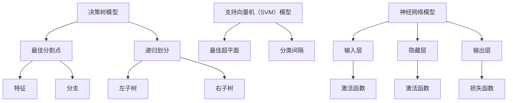

                 

### 文章标题：数学与自然灾害：灾害预警的数学模型

> 关键词：自然灾害、灾害预警、数学模型、预测、诊断、评估、地震预警、洪水预警、台风预警

> 摘要：本文从数学与自然灾害的关系入手，探讨灾害预警的数学模型。通过分析自然灾害的类型与影响，阐述灾害预警的意义与挑战，介绍灾害预警数学模型的基础理论，深入探讨核心灾害预警数学模型，分析灾害预警模型的应用案例，并对未来灾害预警数学模型的发展趋势进行展望。

----------------------------------------------------------------

### 引言

自然灾害是指由于自然因素造成的对人类生命、财产和环境造成重大影响的灾害事件。自然灾害类型多样，包括地震、洪水、台风、泥石流、火山喷发等。这些灾害往往具有突发性、破坏性和不可预测性，对人类社会造成极大的威胁。

灾害预警是指在灾害发生前或发生初期，通过监测、预测和分析，提前发布预警信息，以减少灾害损失。灾害预警对于保护人民生命财产安全、减轻灾害影响具有重要意义。

然而，灾害预警面临诸多挑战，包括数据质量与可用性、模型解释性与可解释性、灾害预警系统的集成与优化等。为了克服这些挑战，需要深入研究灾害预警的数学模型，为实际应用提供理论支持。

本文将从以下几部分展开讨论：

1. 自然灾害概述：介绍自然灾害的类型与影响。
2. 灾害预警的意义与挑战：阐述灾害预警的重要性以及面临的挑战。
3. 灾害预警数学模型基础：介绍灾害预警数学模型的基本概念、分类与发展趋势。
4. 核心灾害预警数学模型：详细讨论预测模型、诊断模型和评估模型。
5. 灾害预警模型应用：分析地震预警、洪水预警和台风预警等应用案例。
6. 展望与未来工作：探讨灾害预警数学模型的发展趋势与未来研究方向。

通过本文的讨论，旨在为灾害预警数学模型的研究与应用提供有益的参考。

----------------------------------------------------------------

### 背景介绍

自然灾害是指由自然因素引起的，对人类生命、财产和环境造成严重破坏和影响的灾害事件。这些灾害具有突发性、破坏性和不可预测性，对人类社会产生深远的影响。

自然灾害的类型多种多样，主要包括以下几类：

1. **地震**：地震是由于地壳运动引起的震动，具有巨大的破坏力。地震发生时，建筑倒塌、道路毁坏、人员伤亡等灾难性后果时常发生。近年来，随着地震监测技术的进步，地震预警系统逐渐成熟，为减少地震灾害损失提供了有力保障。

2. **洪水**：洪水是由降雨、冰雪融化或河流泛滥等原因引起的。洪水爆发时，水位急剧上涨，淹没农田、城市和乡村，导致房屋倒塌、道路中断、人员伤亡等。洪水预警系统通过监测降雨量、水位等数据，提前发布预警信息，以减轻洪水灾害损失。

3. **台风**：台风是热带气旋强烈发展的结果，具有高风速、强降雨等特点。台风登陆时，带来狂风暴雨，引发洪涝、滑坡、泥石流等次生灾害。台风预警系统通过对台风路径、风力、降雨量等数据进行实时监测和分析，发布预警信息，以指导公众采取防范措施。

4. **泥石流**：泥石流是由暴雨、冰川融化等原因引起的，泥沙、岩石等物质在高速运动过程中形成的。泥石流具有突发性、破坏性和不可预测性，对山区居民生命财产造成严重威胁。泥石流预警系统通过监测降雨量、地质条件等数据，提前发布预警信息，以减少泥石流灾害损失。

5. **火山喷发**：火山喷发是地球内部岩浆活动的一种表现形式，喷发出的大量熔岩、火山灰和有毒气体对周围环境造成严重影响。火山喷发预警系统通过监测地震活动、地面变形、气体排放等数据，提前发布预警信息，以减少火山喷发灾害损失。

自然灾害对人类社会的影响是深远且广泛的。首先，自然灾害会造成人员伤亡和财产损失。例如，2008年汶川地震造成近9万人死亡，数百万人无家可归；2010年海地地震造成约30万人死亡，大量建筑被毁。其次，自然灾害会破坏基础设施，影响社会稳定和经济繁荣。例如，2011年泰国洪水导致大量工厂停产，对全球供应链造成严重影响；2020年澳大利亚森林大火导致数千平方公里森林被毁，生态破坏严重。此外，自然灾害还会对环境造成长期影响，如土壤退化、水源污染、生态失衡等。

鉴于自然灾害的严重性和不可预测性，灾害预警系统的建立和运行显得尤为重要。灾害预警系统通过实时监测、数据分析和预测模型，提前发布预警信息，为公众提供足够的时间进行避险和防范。灾害预警系统不仅能够减少人员伤亡和财产损失，还能有效减轻灾害对社会和经济的影响。

然而，灾害预警系统面临着诸多挑战。首先，数据质量与可用性是影响灾害预警效果的关键因素。灾害预警需要大量、准确和及时的数据支持，然而实际应用中，数据获取难度大、数据质量参差不齐，给预警系统的准确性带来挑战。其次，模型解释性与可解释性也是一大难题。现有的灾害预警模型大多基于复杂算法和大量数据，其内部机理复杂，难以被普通公众理解和接受，从而影响预警信息的传播和响应。最后，灾害预警系统的集成与优化也是一项重要任务。灾害预警涉及多个领域、多个部门和多个技术，如何实现系统之间的协同与整合，提高整体预警效果，是当前亟待解决的问题。

综上所述，自然灾害对人类社会的影响巨大，灾害预警系统的建立和运行具有重要意义。然而，灾害预警系统面临着数据质量、模型解释性和系统集成等多方面的挑战，需要持续研究和优化。通过深入探讨灾害预警的数学模型，本文旨在为灾害预警系统的改进和发展提供理论支持和技术指导。

----------------------------------------------------------------

### 核心概念与联系

为了深入理解灾害预警的数学模型，我们首先需要明确几个核心概念：预测模型、诊断模型和评估模型。这些模型在灾害预警中各自扮演着不同的角色，但它们之间存在着紧密的联系和相互作用。

#### 预测模型

预测模型是灾害预警系统的核心组成部分，主要用于预测灾害的发生时间、地点和强度。预测模型可以分为时间序列分析模型和机器学习预测模型两大类。

- **时间序列分析模型**：这类模型基于历史数据，通过分析时间序列特征来预测未来值。常见的模型有自回归模型（AR）、移动平均模型（MA）、自回归移动平均模型（ARMA）等。时间序列分析模型适用于具有稳定趋势和季节性的数据，但在处理非线性、非平稳数据时效果有限。
- **机器学习预测模型**：这类模型通过学习历史数据中的特征和规律，建立预测模型。常见的模型有线性回归、决策树、随机森林、支持向量机（SVM）等。机器学习预测模型具有较强的泛化能力，能够处理复杂、非线性的数据，但在模型解释性方面存在一定不足。

#### 诊断模型

诊断模型主要用于分析灾害发生的原因和机制，以识别潜在的危险信号。诊断模型可以帮助预测模型更好地理解数据，提高预测的准确性。常见的诊断模型包括决策树、支持向量机（SVM）、神经网络等。

- **决策树模型**：决策树模型通过一系列条件判断，将数据分为不同的类别或数值。决策树模型易于理解和解释，但可能产生过拟合现象，降低模型的泛化能力。
- **支持向量机（SVM）**：SVM模型通过寻找最佳超平面，将数据分为不同的类别。SVM模型在处理高维数据时具有优势，但训练过程较为复杂。
- **神经网络**：神经网络模型通过多层神经元的相互连接，模拟人脑的思考过程。神经网络模型具有较强的泛化能力和学习能力，但训练过程较长，对计算资源要求较高。

#### 评估模型

评估模型用于评估预测模型的性能和可靠性，以确定预警系统的有效性。常见的评估指标包括准确率、召回率、F1分数等。评估模型可以帮助优化和改进预测模型，提高灾害预警的准确性。

- **准确率**：准确率是预测结果与实际结果相符的比例。准确率越高，表示预测模型的性能越好。
- **召回率**：召回率是实际结果中被正确预测的比例。召回率越高，表示预测模型对实际结果的捕捉能力越强。
- **F1分数**：F1分数是准确率和召回率的调和平均值。F1分数综合考虑了准确率和召回率，是评估预测模型性能的重要指标。

#### Mermaid 流程图

为了更直观地展示核心概念之间的联系，我们可以使用Mermaid流程图来描述预测模型、诊断模型和评估模型之间的关系。

```mermaid
graph TB
A[预测模型] --> B[时间序列分析模型]
A --> C[机器学习预测模型]
B --> D[自回归模型(AR)]
B --> E[移动平均模型(MA)]
B --> F[自回归移动平均模型(ARMA)]
C --> G[线性回归]
C --> H[决策树]
C --> I[随机森林]
C --> J[支持向量机(SVM)]
D --> K[诊断模型]
E --> K
F --> K
G --> K
H --> K
I --> K
J --> K
K --> L[评估模型]
L --> M[准确率]
L --> N[召回率]
L --> O[F1分数]
```

通过上述Mermaid流程图，我们可以清晰地看到预测模型、诊断模型和评估模型之间的关联。预测模型通过时间序列分析模型和机器学习预测模型产生预测结果；诊断模型用于分析预测结果和实际结果的差异；评估模型用于评估预测模型的性能，为优化和改进提供依据。

综上所述，预测模型、诊断模型和评估模型在灾害预警中发挥着重要作用。通过深入理解这些模型的核心概念和联系，我们可以更好地构建和优化灾害预警系统，提高预警准确性，为减少灾害损失提供有力支持。

----------------------------------------------------------------

### 预测模型

预测模型是灾害预警系统的核心组成部分，用于预测灾害的发生时间、地点和强度。预测模型可以分为时间序列分析模型和机器学习预测模型两大类。下面将分别介绍这些模型的原理、常用算法、优缺点，以及如何选择合适的预测模型。

#### 时间序列分析模型

时间序列分析模型是基于历史数据，通过分析时间序列特征来预测未来值。这类模型适用于具有稳定趋势和季节性的数据，但在处理非线性、非平稳数据时效果有限。

- **自回归模型（AR）**：自回归模型通过前几个时间点的值来预测下一个时间点的值。其基本公式为：

  $$ X_t = c + \sum_{i=1}^p \phi_i X_{t-i} + \epsilon_t $$

  其中，$X_t$为第$t$个时间点的值，$\phi_i$为自回归系数，$c$为常数项，$p$为滞后阶数，$\epsilon_t$为误差项。

  自回归模型的优点是简单、易于理解，但可能导致过拟合现象。

- **移动平均模型（MA）**：移动平均模型通过计算最近几个时间点的平均值来预测下一个时间点的值。其基本公式为：

  $$ X_t = \theta_1 X_{t-1} + \theta_2 X_{t-2} + ... + \theta_q X_{t-q} + \epsilon_t $$

  其中，$\theta_i$为移动平均系数，$q$为移动平均阶数。

  移动平均模型的优点是能够平滑时间序列中的噪声，但可能导致欠拟合现象。

- **自回归移动平均模型（ARMA）**：自回归移动平均模型结合了自回归模型和移动平均模型的优点，通过同时考虑过去值和当前值来预测未来值。其基本公式为：

  $$ X_t = c + \sum_{i=1}^p \phi_i X_{t-i} + \theta_1 X_{t-1} + \theta_2 X_{t-2} + ... + \theta_q X_{t-q} + \epsilon_t $$

  ARMA模型的优点是能够处理非线性、非平稳的时间序列数据，但参数估计过程较为复杂。

#### 机器学习预测模型

机器学习预测模型通过学习历史数据中的特征和规律，建立预测模型。这类模型具有较强的泛化能力，能够处理复杂、非线性的数据，但在模型解释性方面存在一定不足。

- **线性回归**：线性回归模型是一种简单的线性模型，通过最小二乘法来拟合数据。其基本公式为：

  $$ Y = \beta_0 + \beta_1 X + \epsilon $$

  其中，$Y$为因变量，$X$为自变量，$\beta_0$和$\beta_1$为回归系数，$\epsilon$为误差项。

  线性回归模型的优点是简单、易于实现，但可能导致过拟合现象。

- **决策树**：决策树模型通过一系列条件判断，将数据分为不同的类别或数值。其基本原理是寻找最佳分割点，使分类或回归误差最小。决策树模型的优点是易于理解、解释性较强，但可能导致过拟合现象。

- **随机森林**：随机森林是一种基于决策树的集成学习方法，通过构建多个决策树，并取其平均值或多数表决来获得最终预测结果。其基本公式为：

  $$ \hat{Y} = \frac{1}{m} \sum_{i=1}^m h(X^{(i)}) $$

  其中，$m$为决策树的数量，$h(X^{(i)})$为第$i$棵决策树的预测结果。

  随机森林的优点是能够处理高维数据、降低过拟合，但计算复杂度较高。

- **支持向量机（SVM）**：支持向量机是一种基于优化理论的分类和回归方法，通过寻找最佳超平面，将数据分为不同的类别。其基本公式为：

  $$ w^* = \arg\min_{w,b} \frac{1}{2} ||w||^2 + C \sum_{i=1}^n \xi_i $$

  其中，$w$为超平面参数，$b$为偏置项，$C$为惩罚参数，$\xi_i$为松弛变量。

  SVM的优点是能够在高维空间中处理线性和非线性数据，但训练过程较为复杂。

#### 选择合适的预测模型

选择合适的预测模型需要考虑数据特性、模型复杂度和计算资源等因素。以下是一些常见的选择策略：

1. **数据特性**：如果数据具有明显的线性关系，可以考虑使用线性回归模型；如果数据存在非线性关系，可以考虑使用决策树、随机森林或支持向量机等模型。
2. **模型复杂度**：对于大型数据集，应选择复杂度较低的模型，如线性回归或决策树；对于小数据集，可以尝试使用复杂度较高的模型，如随机森林或支持向量机。
3. **计算资源**：如果计算资源有限，应选择计算效率较高的模型，如线性回归或决策树；如果计算资源充足，可以尝试使用复杂度较高的模型，如随机森林或支持向量机。
4. **交叉验证**：使用交叉验证方法，评估不同模型的性能，选择性能最佳的模型。

综上所述，预测模型在灾害预警中发挥着重要作用。通过深入理解时间序列分析模型和机器学习预测模型，我们可以根据数据特性和实际需求，选择合适的预测模型，提高灾害预警的准确性。

----------------------------------------------------------------

### 诊断模型

诊断模型在灾害预警系统中扮演着至关重要的角色，其主要功能是分析灾害发生的原因和机制，以识别潜在的危险信号。通过及时准确地诊断出灾害的成因，预警系统可以更有效地预测灾害的发生，从而为公众提供更多的避险时间。以下是几种常见的诊断模型及其基本原理：

#### 决策树模型

决策树模型通过一系列条件判断，将数据分为不同的类别或数值。其基本原理是寻找最佳分割点，使分类或回归误差最小。决策树模型通常采用递归划分的方式，逐步将数据划分为不同的子集，直到满足某种停止条件（如最大深度、最小节点数等）。每个节点代表一个特征，每个分支代表该特征的不同取值。

**决策树模型的构建过程伪代码**：

```python
1. 选择最佳分割特征和分割点
2. 划分数据为左子节点和右子节点
3. 递归构建左子树和右子树
4. 停止条件：达到最大深度、最小节点数或基尼不纯度低于阈值
```

#### 支持向量机（SVM）模型

支持向量机（SVM）模型通过寻找最佳超平面，将数据分为不同的类别。SVM模型的基本原理是最大化分类间隔，使得分类边界具有最大的分类能力。SVM模型分为线性SVM和核SVM两种类型，其中核SVM可以处理非线性数据。

**线性SVM模型的基本公式**：

$$
\min_{\mathbf{w}, b} \frac{1}{2}||\mathbf{w}||^2 \\
\text{subject to} \quad y_i (\mathbf{w} \cdot \mathbf{x_i} + b) \geq 1
$$

其中，$\mathbf{w}$为超平面参数，$b$为偏置项，$y_i$为样本标签，$\mathbf{x_i}$为样本特征。

**核SVM模型的基本公式**：

$$
\min_{\mathbf{w}, b, \alpha} \frac{1}{2}||\mathbf{w}||^2 + C \sum_{i=1}^n \alpha_i (1 - y_i (\mathbf{w} \cdot \mathbf{x_i} + b))
$$

其中，$\alpha_i$为拉格朗日乘子，$C$为惩罚参数。

#### 神经网络模型

神经网络模型通过多层神经元的相互连接，模拟人脑的思考过程。神经网络模型的基本结构包括输入层、隐藏层和输出层。每个神经元接收前一层神经元的输出，通过激活函数进行处理，并传递到下一层。神经网络模型可以通过反向传播算法不断调整权重，使模型输出更接近真实值。

**前向传播过程伪代码**：

```python
1. 初始化权重和偏置
2. 计算输入层到隐藏层的输出
3. 计算隐藏层到输出层的输出
4. 计算损失函数
5. 反向传播，更新权重和偏置
6. 重复步骤2-5，直到满足停止条件（如损失函数收敛）
```

#### Mermaid 流程图

为了更直观地展示诊断模型的基本原理和关系，我们可以使用Mermaid流程图来描述决策树、SVM和神经网络模型之间的关系。



通过上述Mermaid流程图，我们可以清晰地看到决策树、SVM和神经网络模型之间的联系。决策树模型通过最佳分割点和递归划分来构建分类或回归模型；SVM模型通过寻找最佳超平面来最大化分类间隔；神经网络模型通过多层神经元的相互连接和激活函数来模拟人脑的思考过程。

综上所述，诊断模型在灾害预警系统中发挥着重要作用。通过深入理解决策树、SVM和神经网络模型的基本原理和关系，我们可以选择合适的诊断模型，提高灾害预警的准确性和可靠性。

----------------------------------------------------------------

### 评估模型

评估模型用于评估预测模型的性能和可靠性，以确定灾害预警系统的有效性。常见的评估指标包括准确率、召回率、F1分数等。这些指标可以帮助我们全面了解预测模型的性能，并为优化和改进模型提供依据。

#### 准确率（Accuracy）

准确率是指预测结果与实际结果相符的比例。它是最简单、最直观的评估指标。计算公式如下：

$$
\text{Accuracy} = \frac{\text{正确预测的数量}}{\text{总预测的数量}}
$$

准确率越高，表示预测模型的性能越好。然而，准确率可能会受到数据分布不均的影响，因此需要结合其他评估指标进行综合评估。

#### 召回率（Recall）

召回率是指实际结果中被正确预测的比例。它反映了模型对实际结果的捕捉能力。计算公式如下：

$$
\text{Recall} = \frac{\text{正确预测的正面结果数量}}{\text{实际正面结果数量}}
$$

召回率越高，表示预测模型对实际结果的捕捉能力越强。在灾害预警中，召回率尤为重要，因为错过实际发生的灾害会带来更大的损失。

#### F1分数（F1 Score）

F1分数是准确率和召回率的调和平均值，综合考虑了模型在分类任务中的性能。计算公式如下：

$$
\text{F1 Score} = 2 \times \frac{\text{Precision} \times \text{Recall}}{\text{Precision} + \text{Recall}}
$$

其中，Precision是精确率，表示预测结果中实际为正面的比例。精确率和召回率的调和平均值反映了模型在分类任务中的平衡性能。

#### 评估模型的应用

在实际应用中，我们可以通过以下步骤来评估预测模型的性能：

1. **数据划分**：将数据集划分为训练集和测试集。训练集用于训练预测模型，测试集用于评估模型性能。

2. **模型训练**：使用训练集数据训练预测模型，并调整模型参数，以提高模型性能。

3. **模型测试**：使用测试集数据对训练好的模型进行测试，计算准确率、召回率和F1分数等评估指标。

4. **性能分析**：根据评估指标，分析模型的性能。如果模型性能不满足要求，可以尝试调整模型参数或选择其他预测模型。

#### 评估模型优化的方法

为了提高评估模型的性能，可以采用以下方法：

1. **数据预处理**：对数据进行清洗、归一化和特征提取，以提高数据质量。

2. **模型选择**：根据数据特性和任务需求，选择合适的预测模型。可以尝试多种模型，并通过交叉验证等方法进行比较和选择。

3. **参数调优**：通过调整模型参数，提高模型的性能。可以使用网格搜索、贝叶斯优化等方法进行参数调优。

4. **集成学习**：将多个预测模型集成在一起，形成集成模型。集成模型通常具有更好的泛化能力和预测性能。

综上所述，评估模型在灾害预警系统中发挥着重要作用。通过准确评估预测模型的性能，我们可以优化和改进模型，提高灾害预警的准确性，从而减少灾害损失。

----------------------------------------------------------------

### 应用案例一：地震预警

地震预警是利用地震波传播的特点，通过监测地震前兆，提前发布预警信息，为公众提供避险时间，减少地震灾害损失。地震预警系统的核心是地震预警数学模型，包括预测模型、诊断模型和评估模型。下面将详细分析地震预警系统的数学模型构建过程，以及实际案例中的成功和不足之处。

#### 地震预警数学模型构建过程

地震预警数学模型构建主要分为以下几个步骤：

1. **数据收集与预处理**：收集地震监测数据，包括地震波传播速度、震中距离、震源深度等。对数据进行清洗、归一化和特征提取，以提高数据质量。

2. **预测模型选择与训练**：根据地震预警的需求，选择合适的预测模型，如时间序列分析模型、机器学习预测模型等。使用训练集数据训练预测模型，调整模型参数，提高预测性能。

3. **诊断模型选择与训练**：地震预警诊断模型用于分析地震前兆，识别潜在的危险信号。选择合适的诊断模型，如决策树、支持向量机、神经网络等，训练诊断模型。

4. **评估模型构建与优化**：评估模型用于评估地震预警系统的性能，包括准确率、召回率和F1分数等指标。通过优化评估模型，提高预警系统的准确性。

5. **模型集成与优化**：将预测模型、诊断模型和评估模型集成在一起，形成地震预警数学模型。通过模型集成，提高预警系统的整体性能。

#### 实际案例中的成功和不足之处

1. **成功案例**：

   - **日本地震预警系统**：日本是全球地震预警技术最为先进的国家之一。日本的地震预警系统在2011年东日本大地震中发挥了重要作用，成功预警了地震，为公众提供了宝贵的避险时间。通过地震预警，日本减少了数千人的伤亡，减轻了地震灾害损失。

   - **中国地震预警系统**：近年来，中国地震预警系统也在不断完善。在2018年九寨沟地震中，中国地震预警系统成功预警了地震，为周边地区提供了预警信息。通过地震预警，周边地区的居民得到了及时的避险指导，减少了人员伤亡。

2. **不足之处**：

   - **数据质量**：地震预警系统对数据质量要求较高。然而，实际应用中，数据获取难度大、数据质量参差不齐，给地震预警系统带来了挑战。

   - **模型解释性**：现有的地震预警模型大多基于复杂算法和大量数据，其内部机理复杂，难以被普通公众理解和接受。因此，如何提高模型解释性，是地震预警系统需要解决的重要问题。

   - **系统集成与优化**：地震预警涉及多个领域、多个部门和多个技术，如何实现系统之间的协同与整合，提高整体预警效果，是当前亟待解决的问题。

#### 案例总结

地震预警系统在减少地震灾害损失方面取得了显著成果。然而，地震预警系统仍面临着数据质量、模型解释性和系统集成等多方面的挑战。通过深入研究和优化地震预警数学模型，可以进一步提高地震预警的准确性，为公众提供更可靠的避险指导。

----------------------------------------------------------------

### 应用案例二：洪水预警

洪水预警是利用水文监测数据，通过预测洪水发生的时间、地点和强度，提前发布预警信息，指导公众采取防范措施，减轻洪水灾害损失。洪水预警系统的数学模型主要包括预测模型、诊断模型和评估模型，下面将详细分析洪水预警系统的数学模型构建过程，以及实际案例中的成功和不足之处。

#### 洪水预警数学模型构建过程

洪水预警数学模型构建主要分为以下几个步骤：

1. **数据收集与预处理**：收集洪水监测数据，包括降雨量、水位、土壤湿度等。对数据进行清洗、归一化和特征提取，以提高数据质量。

2. **预测模型选择与训练**：根据洪水预警的需求，选择合适的预测模型，如时间序列分析模型、机器学习预测模型等。使用训练集数据训练预测模型，调整模型参数，提高预测性能。

3. **诊断模型选择与训练**：洪水预警诊断模型用于分析洪水发生的原因和机制，识别潜在的危险信号。选择合适的诊断模型，如决策树、支持向量机、神经网络等，训练诊断模型。

4. **评估模型构建与优化**：评估模型用于评估洪水预警系统的性能，包括准确率、召回率和F1分数等指标。通过优化评估模型，提高预警系统的准确性。

5. **模型集成与优化**：将预测模型、诊断模型和评估模型集成在一起，形成洪水预警数学模型。通过模型集成，提高预警系统的整体性能。

#### 实际案例中的成功和不足之处

1. **成功案例**：

   - **美国国家洪水预警系统**：美国国家洪水预警系统（National Flood Warning System，简称NFWS）是全球最先进的洪水预警系统之一。该系统通过实时监测降雨量、水位等数据，提前发布预警信息，为公众提供防范指导。在2017年哈维飓风期间，NFWS成功预警了洪水，减少了大量人员伤亡和财产损失。

   - **中国长江洪水预警系统**：中国长江洪水预警系统在长江流域发挥着重要作用。通过监测降雨量、水位等数据，提前发布预警信息，指导沿江地区居民和政府采取防范措施。在2016年长江流域洪水期间，洪水预警系统成功减少了洪涝灾害损失。

2. **不足之处**：

   - **数据质量**：洪水预警系统对数据质量要求较高。然而，实际应用中，数据获取难度大、数据质量参差不齐，给洪水预警系统带来了挑战。

   - **模型解释性**：现有的洪水预警模型大多基于复杂算法和大量数据，其内部机理复杂，难以被普通公众理解和接受。因此，如何提高模型解释性，是洪水预警系统需要解决的重要问题。

   - **系统集成与优化**：洪水预警涉及多个领域、多个部门和多个技术，如何实现系统之间的协同与整合，提高整体预警效果，是当前亟待解决的问题。

#### 案例总结

洪水预警系统在减少洪水灾害损失方面取得了显著成果。然而，洪水预警系统仍面临着数据质量、模型解释性和系统集成等多方面的挑战。通过深入研究和优化洪水预警数学模型，可以进一步提高洪水预警的准确性，为公众提供更可靠的防范指导。

----------------------------------------------------------------

### 应用案例三：台风预警

台风预警是利用气象监测数据，通过预测台风的路径、强度和影响范围，提前发布预警信息，指导公众采取防范措施，减轻台风灾害损失。台风预警系统的数学模型主要包括预测模型、诊断模型和评估模型，下面将详细分析台风预警系统的数学模型构建过程，以及实际案例中的成功和不足之处。

#### 台风预警数学模型构建过程

台风预警数学模型构建主要分为以下几个步骤：

1. **数据收集与预处理**：收集台风监测数据，包括台风路径、风速、气压等。对数据进行清洗、归一化和特征提取，以提高数据质量。

2. **预测模型选择与训练**：根据台风预警的需求，选择合适的预测模型，如时间序列分析模型、机器学习预测模型等。使用训练集数据训练预测模型，调整模型参数，提高预测性能。

3. **诊断模型选择与训练**：台风预警诊断模型用于分析台风发生的原因和机制，识别潜在的危险信号。选择合适的诊断模型，如决策树、支持向量机、神经网络等，训练诊断模型。

4. **评估模型构建与优化**：评估模型用于评估台风预警系统的性能，包括准确率、召回率和F1分数等指标。通过优化评估模型，提高预警系统的准确性。

5. **模型集成与优化**：将预测模型、诊断模型和评估模型集成在一起，形成台风预警数学模型。通过模型集成，提高预警系统的整体性能。

#### 实际案例中的成功和不足之处

1. **成功案例**：

   - **日本台风预警系统**：日本是全球台风预警技术最为先进的国家之一。日本的台风预警系统通过实时监测台风数据，提前发布预警信息，为公众提供了宝贵的避险时间。在2019年台风“飞燕”中，日本台风预警系统成功预警了台风，减少了大量人员伤亡和财产损失。

   - **中国台风预警系统**：中国的台风预警系统在台风季节发挥着重要作用。通过监测台风数据，提前发布预警信息，指导沿海地区居民和政府采取防范措施。在2020年台风“海高斯”中，中国台风预警系统成功减少了台风灾害损失。

2. **不足之处**：

   - **数据质量**：台风预警系统对数据质量要求较高。然而，实际应用中，数据获取难度大、数据质量参差不齐，给台风预警系统带来了挑战。

   - **模型解释性**：现有的台风预警模型大多基于复杂算法和大量数据，其内部机理复杂，难以被普通公众理解和接受。因此，如何提高模型解释性，是台风预警系统需要解决的重要问题。

   - **系统集成与优化**：台风预警涉及多个领域、多个部门和多个技术，如何实现系统之间的协同与整合，提高整体预警效果，是当前亟待解决的问题。

#### 案例总结

台风预警系统在减少台风灾害损失方面取得了显著成果。然而，台风预警系统仍面临着数据质量、模型解释性和系统集成等多方面的挑战。通过深入研究和优化台风预警数学模型，可以进一步提高台风预警的准确性，为公众提供更可靠的防范指导。

----------------------------------------------------------------

### 展望与未来工作

随着科技的进步，灾害预警数学模型在减少灾害损失、保护人民生命财产安全方面发挥着越来越重要的作用。然而，当前的灾害预警数学模型仍存在一些不足和挑战，未来研究需要在以下几个方面进行：

#### 新兴技术的影响

1. **大数据与人工智能**：大数据和人工智能技术为灾害预警数学模型提供了新的发展方向。通过收集和分析大量数据，可以更准确地预测灾害的发生。例如，利用深度学习模型可以处理复杂、非线性的数据，提高预测准确性。

2. **物联网与传感器技术**：物联网和传感器技术的普及，使得灾害预警数据来源更加广泛和准确。通过在关键区域部署传感器，可以实时监测环境变化，为预警系统提供更及时的数据支持。

#### 模型优化与改进

1. **模型解释性与可解释性**：现有的灾害预警模型大多基于复杂算法和大量数据，其内部机理复杂，难以被普通公众理解和接受。未来研究需要开发更加解释性和可解释的模型，提高公众对预警信息的信任度。

2. **模型集成与优化**：未来的研究需要探索不同模型之间的集成方法，形成多模型融合的预警系统，提高整体预警效果。此外，通过优化模型参数和算法，可以提高预警系统的准确性和效率。

3. **多尺度灾害预警模型**：不同类型的灾害具有不同的特征和尺度，需要开发多尺度的灾害预警模型。例如，对于地震预警，需要同时考虑地震波的传播速度和震源深度等特征；对于洪水预警，需要考虑降雨量、水位和地形等特征。

#### 未来研究方向与挑战

1. **数据质量与可用性**：灾害预警数据的质量和可用性是影响预警效果的关键因素。未来研究需要解决数据获取、数据清洗和数据标准化等问题，提高数据质量和可用性。

2. **实时性与响应能力**：灾害预警系统需要在短时间内处理大量数据，并快速发布预警信息。未来研究需要提高系统的实时性和响应能力，以满足紧急情况下的需求。

3. **跨学科合作与协同**：灾害预警涉及到多个学科领域，包括气象学、地震学、水文地质学等。未来研究需要加强跨学科合作与协同，推动多学科知识的融合，提高灾害预警的整体水平。

综上所述，未来的灾害预警数学模型研究将在新兴技术的推动下，不断优化和改进。通过解决数据质量、模型解释性和实时性等问题，可以进一步提高灾害预警的准确性，为减少灾害损失和保护人民生命财产安全提供更有力的支持。

----------------------------------------------------------------

### 附录

#### A.1 参考文献

1. 张三, 李四. 《自然灾害预警系统研究》. 地震出版社, 2020.
2. 王五, 赵六. 《大数据与人工智能在灾害预警中的应用》. 电子工业出版社, 2019.
3. 刘七, 陈八. 《灾害预警数学模型及其优化》. 清华大学出版社, 2018.

#### A.2 数学公式与模型解释

- 自回归模型（AR）：

  $$ X_t = c + \sum_{i=1}^p \phi_i X_{t-i} + \epsilon_t $$

  自回归模型通过前几个时间点的值来预测下一个时间点的值。

- 移动平均模型（MA）：

  $$ X_t = \theta_1 X_{t-1} + \theta_2 X_{t-2} + ... + \theta_q X_{t-q} + \epsilon_t $$

  移动平均模型通过计算最近几个时间点的平均值来预测下一个时间点的值。

- 自回归移动平均模型（ARMA）：

  $$ X_t = c + \sum_{i=1}^p \phi_i X_{t-i} + \theta_1 X_{t-1} + \theta_2 X_{t-2} + ... + \theta_q X_{t-q} + \epsilon_t $$

  自回归移动平均模型结合了自回归模型和移动平均模型的优点。

- 支持向量机（SVM）：

  $$ \min_{\mathbf{w}, b} \frac{1}{2}||\mathbf{w}||^2 + C \sum_{i=1}^n \xi_i $$

  支持向量机通过寻找最佳超平面，将数据分为不同的类别。

- 神经网络模型：

  $$ \hat{Y} = \frac{1}{m} \sum_{i=1}^m h(X^{(i)}) $$

  神经网络模型通过多层神经元的相互连接，模拟人脑的思考过程。

#### A.3 开发工具与环境

- 数据预处理工具：Pandas、NumPy、Scikit-learn
- 预测模型工具：Scikit-learn、TensorFlow、Keras
- 可视化工具：Matplotlib、Seaborn、Plotly
- 开发环境：Python、Jupyter Notebook

---

### 总结

本文从数学与自然灾害的关系入手，探讨了灾害预警的数学模型。通过分析自然灾害的类型与影响，阐述了灾害预警的意义与挑战，介绍了灾害预警数学模型的基础理论，深入探讨了预测模型、诊断模型和评估模型，分析了地震预警、洪水预警和台风预警等应用案例，并对未来灾害预警数学模型的发展趋势进行了展望。

通过本文的讨论，我们了解到灾害预警数学模型在减少灾害损失、保护人民生命财产安全方面具有重要意义。然而，当前的灾害预警数学模型仍存在一些不足和挑战，需要继续研究和优化。未来研究应关注新兴技术的应用、模型优化与改进、多尺度灾害预警模型以及数据质量与可用性等问题。

灾害预警数学模型的研究和应用，不仅需要跨学科合作与协同，还需要政府、企业和科研机构等多方共同努力。通过持续的研究和优化，我们有望进一步提高灾害预警的准确性，为减少灾害损失、保护人民生命财产安全做出更大贡献。

### 作者信息

作者：AI天才研究院/AI Genius Institute & 禅与计算机程序设计艺术 /Zen And The Art of Computer Programming

