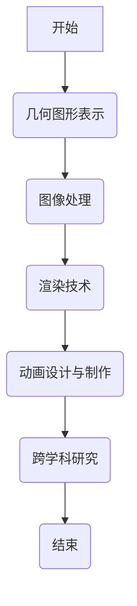

                 

# 《数学与艺术史：数学在艺术发展中的角色》

## 关键词
- 数学
- 艺术
- 古代艺术
- 中世纪艺术
- 近代艺术
- 现代艺术
- 跨学科研究

## 摘要
本文从历史的角度探讨了数学在艺术发展中的角色。文章首先介绍了数学与艺术的历史联系，接着分别探讨了古代艺术、中世纪艺术、近代艺术和现代艺术中的数学应用。通过这些讨论，文章展示了数学如何贯穿于艺术的发展历程，并对艺术形式和审美观念产生了深远的影响。最后，文章探讨了数学在艺术制作与设计中的应用，以及跨学科研究的实践，总结了数学在艺术史上的重要作用，并展望了未来的发展趋势。

---

### 引言

数学与艺术之间的关系自古以来就备受关注。数学作为一种科学，它不仅关乎逻辑思维和抽象概念，更在许多方面渗透到艺术创作之中。数学在艺术中的应用不仅为艺术提供了新的表现形式，还深刻影响了艺术家的创作方法和审美观念。

数学在艺术中的历史可以追溯到古代文明。例如，古希腊和古埃及艺术中就充满了数学元素，如几何学、比例和对称性。中世纪时期的艺术，如哥特式建筑和文艺复兴时期的透视法，也广泛运用了数学原理。近代艺术，尤其是印象派和立体派艺术，开始探索光影和空间表现的新方式，这些方式无不蕴含着数学的精髓。现代艺术则更是大胆地运用了随机性和非线性理论，使得数学在艺术中的角色变得更加多样和复杂。

本文将分章节详细探讨数学在艺术发展中的角色。首先，我们将回顾古代艺术中的数学应用，包括古希腊和古埃及的几何学。接着，我们将探讨中世纪艺术中的数学原理，如哥特式建筑和文艺复兴时期的透视法。随后，我们将深入分析近代艺术中的数学表现，包括印象派和立体派艺术中的光影与空间表现。最后，我们将探讨现代艺术中的数学，特别是随机性和非线性理论在艺术创作中的应用，以及数学在艺术制作与设计中的具体应用。通过这些探讨，我们希望能够全面展示数学在艺术发展中的深远影响。

### 古代艺术中的数学

#### 古希腊艺术的几何学应用

古希腊艺术是西方艺术的基石，其艺术形式和美学理念对后世产生了深远的影响。在古希腊艺术中，几何学占据了核心地位，不仅体现在建筑和雕塑中，还渗透到绘画和天文学等领域。

古希腊建筑以其精巧的设计和完美的比例而闻名。最典型的例子是帕台农神庙（Parthenon），这座神庙不仅在结构上展示了高超的工程技术，还在美学上达到了极致。帕台农神庙的基石排列遵循严格的几何对称性，每一个柱子的高度和直径都经过精确的计算。据考古学家的研究，帕台农神庙的柱子底端略微向内倾斜，这种设计不仅增加了建筑的稳定性，还使得整个结构更加美观。此外，神庙的屋顶设计也运用了复杂的几何学原理，通过精确的计算和测量，确保了屋顶的重力和压力均匀分布，避免了结构的崩塌。

古希腊雕塑同样展示了数学的精髓。著名的《掷铁饼者》（Discobolus）就是古希腊雕塑中的杰作之一。这座雕塑通过精确的几何比例，展现了运动员的动态美。雕塑家米隆（Myron）通过对人体解剖学的深入研究，将人体的比例优化到最佳状态，使得运动员的姿态既符合生理规律，又具有美学价值。此外，米隆还运用了黄金分割（Golden Ratio）这一数学概念，使得整个雕塑在视觉上达到了和谐与平衡。

在绘画方面，古希腊艺术家也广泛运用了几何学原理。例如，著名壁画《阿戈斯英雄宴》（The Dinner Party of the Heroes of Agώs）就是一例。这幅壁画通过精确的几何构图，展现了宴会的场景。壁画的布局采用了对称和平衡的原则，使得整个画面既具有层次感，又和谐统一。此外，古希腊绘画还运用了透视法，通过近大远小的原理，营造出深远的空间感。

古希腊的数学成就不仅体现在艺术创作中，还通过数学家的著作得以传承。例如，毕达哥拉斯（Pythagoras）是古希腊最著名的数学家之一，他提出了毕达哥拉斯定理（Pythagorean theorem），即直角三角形的两条直角边的平方和等于斜边的平方。这一定理在古希腊建筑和雕塑中得到了广泛应用。此外，欧几里得（Euclid）的《几何原本》（Elements）是古代数学的经典之作，它系统地阐述了几何学的基本原理和定理，对后世数学和艺术的发展产生了深远的影响。

综上所述，古希腊艺术中的几何学应用不仅展示了数学的美学价值，还推动了艺术形式的创新和发展。通过精确的几何计算和比例安排，古希腊艺术家创造出了许多不朽的艺术作品，为后世艺术发展奠定了基础。

#### 古埃及艺术的数学元素

古埃及艺术是古代世界的重要组成部分，其独特的建筑风格和艺术形式在世界艺术史上占有重要地位。古埃及艺术的数学元素尤为引人注目，这不仅仅体现在建筑结构上，还渗透到绘画和雕塑等艺术形式中。

古埃及建筑以其宏伟和精确而著称，金字塔就是最典型的代表。金字塔的设计和建造过程涉及大量的数学知识，特别是几何学和三角学。首先，金字塔的底座通常是一个精确的方形，这种设计确保了结构的稳定性。其次，金字塔的斜面角度经过精确的计算，使得石块能够通过斜面顺利堆砌，同时减少了对人力和畜力的依赖。据研究，金字塔的斜面角度大约为51.84度，这一角度不仅符合三角函数的计算结果，还确保了石块的紧密堆砌，减少了风化和地震的影响。

在古埃及建筑中，另一个重要的数学元素是直线和对称。古埃及人非常注重建筑的对齐和对称性，这种设计不仅增加了建筑的美感，还确保了结构的稳固。例如，吉萨大金字塔的四个侧面几乎完全对称，每一侧的斜面角度和长度都经过精确的计算。这种精确的设计使得金字塔在视觉上具有极强的和谐美，同时也增强了其结构的稳定性。

古埃及的绘画和雕塑也广泛运用了数学原理。在古埃及的壁画中，画面通常被划分为多个几何形状，这些形状通过精确的计算和排列，形成了有序的图案和构图。例如，著名的《法老拉美西斯二世》（King Ramesses II）壁画，通过精确的几何构图，展现了法老的威严和辉煌。壁画中的图案和形状不仅具有美学价值，还传达了丰富的文化信息。

古埃及雕塑同样展示了数学的巧妙运用。例如，著名的《斯芬克斯》（Sphinx）雕像，其头部和身体的构造通过精确的几何计算，展现了完美的比例和对称性。斯芬克斯的头部高度与身体长度之比接近黄金分割（Golden Ratio），这种比例在视觉上给人以和谐和美感。

古埃及的数学成就不仅体现在艺术创作中，还通过文献得以传承。古埃及人使用的符号和计数系统，尽管与现代数学有所不同，但它们揭示了古埃及人对数学的基本理解。例如，古埃及的算术和几何知识通过纸草文献（Papyrus）得以保存，这些文献包含了大量的数学问题和解答，展示了古埃及人在数学领域的研究成果。

总之，古埃及艺术中的数学元素不仅丰富了古埃及文化的内涵，也为我们提供了研究古代数学的宝贵资料。通过精确的几何设计和对称构图，古埃及艺术家创造出了许多具有历史和艺术价值的作品，这些作品至今仍然令人叹为观止。

### 中世纪艺术中的数学原理

#### 哥特式建筑中的数学原理

哥特式建筑是中世纪艺术的重要代表，以其独特的风格和高超的技术著称。哥特式建筑在结构设计上广泛运用了数学原理，特别是几何学、三角学和力学，这些数学原理不仅确保了建筑的稳定性，还赋予其独特的艺术魅力。

首先，哥特式建筑的拱顶和飞扶壁（Flew）是数学设计的重要体现。哥特式教堂的拱顶通常采用尖拱（Pointed Arch）设计，这种设计通过几何原理，使拱顶的重力均匀分布，从而减少了结构对地基的压力。尖拱的设计使得拱顶的受力点集中在拱顶中心，这种集中受力使得建筑更加稳定。尖拱的几何形状不仅增加了建筑的空间感，还使得内部结构更加轻盈。

飞扶壁是哥特式建筑中的另一重要结构元素，它通过几何设计，将教堂的侧墙与拱顶连接起来，起到支撑和稳定作用。飞扶壁的形状通常是一个复杂的几何图形，包括三角形和梯形。这些几何图形通过精确的计算和排列，使飞扶壁能够均匀分担拱顶的重量，从而增强建筑的整体稳定性。飞扶壁的设计不仅增强了建筑的力学性能，还赋予建筑独特的外观美感。

其次，哥特式建筑的窗户设计也体现了数学原理。哥特式教堂的窗户通常采用彩色玻璃窗（Stained Glass Windows），这些窗户通过几何图案和色彩的组合，营造出梦幻般的视觉效果。窗户的设计不仅考虑了光线的传播和折射，还运用了对称和比例原理，使得窗户在视觉上具有和谐美。例如，著名的巴黎圣母院（Notre-Dame Cathedral）的彩色玻璃窗，通过复杂的几何构图和色彩的运用，展现了丰富的艺术表现力。

此外，哥特式建筑的结构设计还运用了三角形的稳定性原理。哥特式教堂的内部结构中，大量使用了三角形框架，这些三角形框架通过相互连接，形成了稳定的结构体系。三角形的稳定性使得建筑能够承受更大的重量和压力，从而增强了建筑的稳固性。例如，著名的米兰大教堂（Milan Cathedral）的屋顶结构，通过大量的三角形框架，实现了结构的稳定和美观。

哥特式建筑在数学设计上的成就，不仅体现在建筑结构上，还通过建筑图纸和建筑文献得以传承。中世纪的建筑工匠和建筑师通过详细的图纸和计算方法，记录了哥特式建筑的数学设计原理，这些文献为后世的建筑设计和施工提供了宝贵的参考。

总之，哥特式建筑中的数学原理不仅确保了建筑的稳定性和美学价值，也展示了中世纪艺术家和工程师的智慧与创造力。通过精确的几何计算和巧妙的力学设计，哥特式建筑成为了中世纪艺术的瑰宝，也为后世的建筑艺术提供了重要的启示。

#### 文艺复兴时期的透视法

文艺复兴时期是欧洲艺术史上的黄金时期，这一时期的艺术家们不仅在绘画技巧上取得了突破，还在理论上进行了深入的探索。透视法（Perspective）是文艺复兴时期最重要的艺术理论之一，它通过数学原理，实现了三维空间在二维平面上的准确表现，使得绘画作品更具立体感和空间感。

透视法的理论基础是由意大利艺术家列奥纳多·达·芬奇（Leonardo da Vinci）等人提出的。他们通过对光学和几何学的深入研究，发现了一个重要的现象：当物体距离观察者越远时，其尺寸会逐渐缩小，并且其前后位置关系也会发生变化。这一现象被称为“透视缩短”（Linear Perspective），是透视法的基本原理。

透视法的基本原理可以概括为“一点透视”（One-Point Perspective）和“两点透视”（Two-Point Perspective）。在一点透视中，所有物体的消失点汇聚在一个点，即画面的中心点。这个消失点通常位于画面的底部或顶部，通过这个消失点，艺术家可以准确地计算和绘制物体的长度、宽度和高度。例如，一个物体在地平线上的长度会随着其距离地平线的远近而发生变化，这种变化可以通过数学计算来实现。

两点透视则进一步扩展了透视法的应用范围。在两点透视中，有两个消失点，分别位于画面的左右两侧。这种透视方法适用于绘制复杂的场景，如街道、广场和城市建筑。通过两个消失点，艺术家可以更精确地表现物体的深度和空间关系。

文艺复兴时期的艺术家们广泛运用了透视法，创作了许多经典的绘画作品。例如，意大利画家乔托（Giotto）的《逃亡埃及》（The Flight into Egypt）和《哀悼基督》（The Lamentation of Christ）等作品，通过精确的透视技巧，展现了人物和背景的空间关系，使得画面更加真实和生动。另外，意大利画家马萨乔（Masaccio）的《纳税金》（The Tribute Money）和《圣三位一体》（The Holy Trinity）等作品，也展示了透视法在绘画中的广泛应用。

透视法不仅影响了绘画，还对雕塑和建筑产生了深远的影响。例如，意大利雕塑家多纳泰罗（Donatello）的《大卫像》（David），通过精确的透视技巧，展现了人物的身体结构和空间感。法国建筑师皮埃尔·德·蒙特尼（Pierre de Montreuil）在卢浮宫（Louvre）的设计中，也运用了透视法，使得建筑内部的空间显得更加宽敞和开阔。

总之，文艺复兴时期的透视法通过数学原理，实现了三维空间在二维平面上的准确表现，极大地提升了艺术作品的立体感和空间感。透视法的发明和运用，标志着文艺复兴时期艺术家们对自然和现实的深刻理解和探索，也为后世的艺术创作提供了重要的理论基础和技巧。

### 近代艺术中的数学表现

#### 印象派艺术中的光影表现

印象派艺术是19世纪末期法国艺术的重要流派，其核心理念是捕捉瞬间的光影变化，通过色彩和光线的运用，展现出自然界的多样性和动态美。印象派艺术家们对光影的表现不仅依赖于对自然景色的敏锐观察，还深入探讨了光学和数学的原理。

印象派艺术中的光影表现主要基于光学原理。根据光的反射和折射原理，不同颜色的光线在传播过程中会产生不同的效果。印象派艺术家们通过分析这些光学现象，巧妙地运用色彩的对比和调和，创造出丰富的视觉效果。例如，莫奈（Claude Monet）的《睡莲》（Water Lilies）系列作品，通过对不同时间段和不同光照条件下睡莲池的描绘，展示了光影的多样性和动态美。莫奈运用了丰富的色彩变化，通过黄、蓝、绿等颜色的对比和调和，营造出水面光影的变化和景色的深度感。

数学在印象派艺术中的表现主要体现在色彩理论和几何构图上。印象派艺术家们通过对色彩的科学分析，提出了色彩调和的理论。其中，最为著名的理论是“色彩三原色”理论，即红色、蓝色和黄色。这些原色通过混合可以产生其他颜色，从而创造出丰富的色彩效果。印象派艺术家们通过对色彩三原色的精确运用，使画面更加生动和真实。例如，雷诺阿（Renoir）的《船上的午餐》（Luncheon of the Boating Party），通过运用红、蓝、黄的对比和调和，使得画面充满了活力和动感。

几何构图也是印象派艺术中的重要元素。印象派艺术家们通过对自然景色的几何结构进行分析，运用几何形状和线条来构建画面。这种几何构图不仅增加了画面的立体感和空间感，还增强了画面的秩序感和和谐美。例如，德加（Edgar Degas）的《舞蹈课》（The Dance Class），通过对舞台和舞者几何形状的精确描绘，展现了舞蹈课的动态场景和空间布局。

此外，印象派艺术家们还通过对光影的数学计算，使画面的光影效果更加逼真。他们通过测量光线的角度、强度和方向，运用光影的数学原理来描绘自然景色的光影变化。例如，毕沙罗（Pissarro）的《蒙马特高地》（Montmartre Hill），通过对光线和阴影的精确计算，使得画面的光影效果栩栩如生。

总之，印象派艺术中的光影表现不仅依赖于对自然景色的敏锐观察，还深入探讨了光学和数学的原理。通过运用色彩调和和几何构图，印象派艺术家们成功地捕捉到了自然界的瞬间光影，为后世的艺术创作提供了宝贵的启示。

#### 立体派艺术中的空间表现

立体派艺术是20世纪初法国艺术的重要流派，以其独特的空间表现和形式创新而闻名。立体派艺术家们通过对几何形状和空间的重新构建，打破了传统的二维绘画模式，创造出了具有三维立体感的艺术作品。立体派的空间表现不仅体现了艺术家对空间的深刻理解，也融入了丰富的数学原理。

立体派艺术的核心思想是空间的重新构建。立体派艺术家们通过对几何形状的分析和组合，创造出了全新的空间形式。他们利用多视点（Multiple Viewpoints）和分解与重构（Dissection and Reconstruction）的方法，将物体拆分成不同的几何形状，然后再将这些形状重新组合，形成一个完整的立体图像。这种方法不仅增加了画面的立体感，还使观众能够从不同的角度和视点观察和理解艺术作品。

在立体派艺术中，几何形状是构建空间的基础。立体派艺术家们通过对几何形状的精确运用，创造出富有层次感和立体感的画面。他们运用立方体、球体、圆锥体等几何形状，通过重叠、交错和组合，形成了复杂的空间结构。例如，毕加索（Pablo Picasso）的《吉他演奏者》（The Guitar Player），通过对吉他形状的几何分解和重构，创造出了独特的空间形式。毕加索将吉他的不同部分拆分成几何形状，再通过这些形状的组合，构建出了一个富有立体感的吉他形象。

数学在立体派艺术中发挥了重要作用，特别是在几何形状的精确运用和空间分析上。立体派艺术家们通过对几何形状的数学计算，确保了画面中几何形状的精确性和比例的合理性。他们利用数学公式和几何原理，计算出每个几何形状的尺寸和角度，从而保证了画面的整体和谐和美观。例如，布拉克（Georges Braque）的《船上的午餐》（The Luncheon of the Boating Party），通过对画面中几何形状的精确计算和组合，创造出了具有立体感和空间感的画面。

此外，立体派艺术家们还通过对光影和透视的数学分析，增强画面的空间效果。他们通过计算光线的角度和强度，运用透视原理，使得画面中的物体看起来更加立体和真实。例如，布拉克的《乐手》（The Musicians），通过对光影的精确计算和透视的应用，创造出了富有立体感和空间感的画面。

总之，立体派艺术中的空间表现通过几何形状的精确运用和数学原理的深入探讨，打破了传统的绘画模式，创造出了全新的空间形式。立体派艺术家们通过对几何形状和空间的重新构建，展示了数学在艺术创作中的重要作用，为后世的艺术发展提供了宝贵的启示。

### 现代艺术中的数学

#### 随机性与非线性理论在艺术创作中的应用

现代艺术中，随机性与非线性理论的广泛应用极大地拓展了艺术创作的边界，为艺术家们提供了新的表达方式和视觉体验。随机性（Randomness）和非线性理论（Nonlinear Theory）作为数学的重要分支，分别代表了不确定性和复杂性的概念。在艺术创作中，这些概念被巧妙地运用，创造出独特的视觉效果和艺术形式。

随机性在艺术创作中的应用主要体现在绘画和雕塑等领域。随机性允许艺术家在创作过程中引入不确定性，打破传统的规律和秩序，从而创造出更加自由和独特的艺术作品。例如，法国艺术家雅克·利普查恩（Jacques Lipchitz）的雕塑作品常常运用随机性的原理，通过不规则的几何形状和动态的线条组合，创造出生动而富有活力的艺术形象。利普查恩的作品《坐着的女人》（Seated Woman）就是通过随机性的运用，打破了传统的对称和规则，使得雕塑呈现出一种动态的平衡感。

非线性理论在艺术创作中的应用则更加广泛，它涉及到艺术作品的结构、形式和内容。非线性理论强调系统内部各元素之间的复杂相互作用，以及这些相互作用产生的非线性关系。这种非线性关系可以表现为艺术作品中的非线性结构、非线性运动和非线性叙事。例如，日本艺术家草间弥生（Yayoi Kusama）的作品《无限镜屋》（The Infinity Mirrors Room），通过非线性理论的运用，创造出了一个无限循环的视觉体验。房间内部布置了大量的镜子和灯光，当观众进入房间时，光线和镜子的反射使得空间无限扩展，形成了一种超现实的视觉体验。

非线性理论还可以体现在艺术作品的非线性叙事中。非线性叙事打破了传统线性叙事的框架，通过非线性的时间结构和情节发展，创造出更加复杂和多元的艺术体验。例如，美国导演大卫·林奇（David Lynch）的电影作品《蓝丝绒》（Blue Velvet），通过非线性叙事的手法，将不同时间点和空间场景交织在一起，创造出了丰富而复杂的叙事结构，使观众在观看过程中不断产生新的解读和联想。

此外，现代艺术中的随机性和非线性理论还与计算机技术和数字艺术密切相关。计算机算法和编程语言为艺术家提供了实现随机性和非线性结构的工具，使得艺术创作变得更加多样和灵活。例如，数字艺术家团队Rafael Lozano-Hemmer的作品《随机互动装置》（Random Interaction Installations），通过计算机算法生成随机互动的图形和声音，为观众提供了一种动态的艺术体验。

总之，随机性与非线性理论在艺术创作中的应用，不仅丰富了艺术的表现形式，还深刻影响了艺术家的创作方法和观众的审美体验。通过引入不确定性和复杂性，艺术家们能够创造出更加独特和多元的艺术作品，为艺术史的发展注入了新的活力。

#### 数学在数字艺术和动画中的角色

数学在数字艺术和动画中的应用日益广泛，极大地丰富了艺术创作的手段和表现形式。计算机图形学（Computer Graphics）是这一领域的重要技术支柱，它依赖于数学模型和算法来实现复杂而逼真的视觉效果。

首先，计算机图形学中的基本数学模型包括三维建模、渲染和动画。三维建模（3D Modeling）通过几何形状的构建和组合，创造出三维空间中的物体。这一过程通常涉及线性代数和向量计算，用于定义物体的位置、旋转和缩放。例如，在三维建模软件中，艺术家可以使用矩阵运算来调整物体的姿态，从而实现复杂而精确的形状设计。

渲染（Rendering）是计算机图形学中的另一个关键步骤，它负责将三维模型转化为二维图像。渲染过程涉及到光线追踪（Ray Tracing）、反射（Reflection）、折射（Refraction）等光学原理。这些原理通过数学计算实现，如光线的路径计算、反射和折射角度的计算等。例如，在真实感渲染中，光线与物体表面的相互作用需要通过物理模型进行精确计算，以确保渲染结果的逼真度。

动画（Animation）则是数字艺术中的一项重要技术，它通过连续的画面展示物体或角色的运动。动画的制作依赖于时间序列和运动学（Kinematics）的数学原理。例如，关键帧动画（Keyframe Animation）通过定义物体在关键帧的位置和姿态，利用插值算法（Interpolation Algorithms）生成中间帧，从而实现平滑的运动效果。常见的插值算法包括线性插值、样条插值（Spline Interpolation）和高斯插值（Gaussian Interpolation）。

数学在数字艺术和动画中的应用不仅限于视觉效果，还包括数据分析和生成。例如，使用分形几何（Fractal Geometry）可以生成复杂的自然景象，如山脉、云朵和水流等。分形几何通过迭代和递归过程，实现了无限层次的细节和自我相似性，从而创造出独特而丰富的视觉效果。

此外，机器学习和深度学习在数字艺术中的应用也日益增多。这些技术通过训练神经网络模型，可以自动生成艺术作品。例如，生成对抗网络（Generative Adversarial Networks, GAN）可以生成逼真的图像和视频，通过对抗训练过程，生成模型和判别模型相互竞争，不断优化生成结果。

总之，数学在数字艺术和动画中的应用为艺术家提供了强大的工具和手段，使得艺术创作更加多样和复杂。通过数学模型和算法的运用，艺术家们能够创造出前所未有的视觉效果，为数字艺术和动画领域带来了巨大的创新和发展。

### 数学在艺术制作与设计中的应用

#### 计算机图形学基础

计算机图形学（Computer Graphics）是数字艺术和设计领域的重要组成部分，它通过计算机技术生成和操纵图像，从而创造出丰富多彩的艺术作品和视觉效果。计算机图形学的基础概念包括几何图形的表示、图像处理和渲染技术。

首先，几何图形的表示是计算机图形学的基础。在计算机图形学中，几何图形通常通过点（Vertex）、线（Line）和面（Face）来表示。点表示几何图形的位置，线表示连接点的路径，面表示封闭的二维区域。这些基本元素可以通过数学公式进行精确计算和描述。例如，点在二维平面上的坐标可以用一个二元组（x, y）表示，而三维空间中的点则可以用一个三元组（x, y, z）表示。

其次，图像处理技术是计算机图形学中的重要组成部分。图像处理涉及对图像进行各种操作，如滤波、边缘检测、颜色变换等。这些操作通常通过数学算法实现。例如，卷积操作（Convolution）在图像滤波中广泛应用，用于平滑图像或去除噪声。边缘检测算法（如Canny边缘检测）通过检测图像中亮度变化的急剧点，提取图像的边缘信息。

渲染技术是计算机图形学的核心，它负责将几何图形转化为逼真的二维图像。渲染过程包括光线追踪、反射、折射、阴影等光学效果的模拟。这些效果通过数学模型和算法实现。例如，光线追踪通过模拟光线在场景中的传播路径，计算每个像素的颜色和亮度。反射和折射则通过折射定律（Snell's Law）和反射定律（Law of Reflection）实现。

在数字艺术和设计领域，计算机图形学有着广泛的应用。首先，在游戏开发中，计算机图形学用于创建逼真的游戏场景和角色。通过高级渲染技术，游戏开发者能够创造出高度细节和真实感的场景，提升玩家的沉浸体验。其次，在动画制作中，计算机图形学用于角色动画、场景渲染和特效制作。例如，在《狮子王》（The Lion King）等动画电影中，计算机图形学技术被广泛应用于角色造型、动作捕捉和渲染，使得动画效果更加逼真和生动。

此外，计算机图形学还在虚拟现实（Virtual Reality, VR）和增强现实（Augmented Reality, AR）领域中发挥着重要作用。通过计算机图形学技术，虚拟现实和增强现实应用能够创造出沉浸式体验，为用户带来全新的交互方式和视觉体验。

总之，计算机图形学是数字艺术和设计领域的重要工具，它通过数学模型和算法，实现了几何图形的表示、图像处理和渲染技术。在数字艺术和设计中，计算机图形学为艺术家和设计师提供了强大的创作工具和表现手段，推动了艺术和设计的创新和发展。

#### 数字艺术制作流程

数字艺术制作流程通常包括创意构思、素材收集、图像处理、渲染和后期制作等步骤。每个步骤都有其独特的特点和应用，通过合理的流程管理和技术运用，可以创造出高质量的艺术作品。

首先，创意构思是数字艺术制作的第一步。这一阶段，艺术家需要明确艺术作品的主题、风格和表现手法。创意构思可以通过头脑风暴、草图绘制和灵感收集等方式实现。在这一过程中，艺术家需要充分发挥自己的想象力和创造力，构思出独特且富有表现力的艺术作品。例如，在创作一幅数字绘画时，艺术家可能会从自然界中的景象、历史故事或个人经历中获取灵感，从而形成初步的构思。

接下来是素材收集阶段。艺术家需要根据创意构思，收集各种素材，如照片、图片、视频和其他多媒体资料。这些素材将成为艺术创作的原始材料，通过后期处理和组合，形成最终的艺术作品。素材收集的过程中，艺术家需要注重素材的质量和适用性，确保素材能够充分支持艺术创作的需求。例如，在制作一幅数字绘画时，艺术家可能会从照片库中挑选适合的背景图片，或从视频片段中提取特定的画面元素。

图像处理是数字艺术制作流程的核心环节。在这一阶段，艺术家使用各种图像处理软件（如Adobe Photoshop、GIMP等），对收集到的素材进行编辑和调整。图像处理包括色彩校正、滤镜应用、图层组合和特效添加等操作，通过这些操作，艺术家可以创造出丰富的视觉效果。例如，在图像处理过程中，艺术家可能会对照片进行色彩校正，使其更符合艺术作品的整体风格；或者使用滤镜和特效，为图像增添特殊的效果和氛围。

渲染阶段是将处理后的图像转化为逼真视觉效果的关键步骤。渲染技术包括光线追踪、反射、折射、阴影等复杂的光学计算。通过渲染，图像中的每个像素都被计算和处理，最终形成一幅具有立体感和真实感的艺术作品。例如，在渲染过程中，艺术家可能会通过光线追踪技术，模拟场景中光线与物体表面的互动，从而创造出逼真的光影效果。

最后是后期制作阶段。在后期制作中，艺术家对渲染完成的作品进行最后的调整和修饰，如添加动态效果、调整音效和配乐等。后期制作的目的是使艺术作品更加完整和动人，提升观众的沉浸体验。例如，在后期制作中，艺术家可能会添加动态效果，如动画、过渡和粒子效果，使得数字艺术作品更具吸引力和表现力。

通过以上步骤，数字艺术制作流程不仅能够创造出丰富多彩的艺术作品，还能充分展现艺术家的创意和技巧。合理的流程管理和技术运用，是确保数字艺术作品质量和效果的重要保障。

#### 动画设计与制作中的数学原理

动画设计与制作是一个复杂而精细的过程，其中数学原理扮演着至关重要的角色。从基本的时间控制到复杂的运动学计算，数学为动画制作提供了坚实的理论基础和强大的工具。

首先，时间控制是动画制作的核心要素之一。动画的基本原理是通过连续播放一系列静态图像（帧）来模拟动态运动。每一帧的播放时间（帧率）直接影响到动画的流畅度。帧率越高，动画的流畅度越好。帧率的选择通常取决于动画的类型和预期效果。例如，传统的电影动画帧率为24帧每秒（fps），而现代电脑动画和视频游戏可能使用更高的帧率，如60fps或更高。帧率的计算和调整涉及基本的数学运算，如除法和乘法。

其次，运动学是动画制作中关键的数学领域。运动学研究物体在空间中的运动规律，包括速度、加速度、位移等概念。在动画制作中，这些概念被用来定义角色的动作和轨迹。例如，一个简单的直线运动可以通过计算物体的初始位置、最终位置和运动时间来确定。在更复杂的动画中，如非直线运动或加速运动，需要使用二次方程、多项式函数等高级数学知识。

速度和加速度的计算是运动学中的核心问题。速度是位移随时间的变化率，可以通过求导数来实现。加速度是速度随时间的变化率，同样需要求导数。例如，一个物体在一段时间内从静止开始加速，其速度和加速度可以通过以下公式计算：

\[ v = u + at \]
\[ s = ut + \frac{1}{2}at^2 \]

其中，\( v \) 是最终速度，\( u \) 是初始速度，\( a \) 是加速度，\( t \) 是时间，\( s \) 是位移。

在动画中，曲线路径和旋转运动也通过数学方法来描述。贝塞尔曲线（Bezier Curve）和样条曲线（Spline Curve）是常用的数学工具，用于定义角色的平滑运动轨迹。贝塞尔曲线通过控制点来定义曲线的形状，而样条曲线则通过一系列的多项式函数来实现更复杂的曲线。

此外，动画中的物理效果，如碰撞、弹性、摩擦等，也依赖于数学原理。这些效果通过物理模拟算法来实现，如牛顿运动定律、能量守恒定律等。这些算法涉及到复杂的数学运算，如积分和微分。

最后，动画制作中的渲染过程也依赖于数学原理。光线追踪、反射、折射和阴影等渲染效果通过数学模型和算法来实现。例如，光线追踪通过模拟光线的传播路径和与物体表面的互动来计算每个像素的颜色和亮度。

综上所述，数学原理在动画设计与制作中扮演着不可或缺的角色。从时间控制到运动学计算，再到物理模拟和渲染，数学为动画制作提供了坚实的理论基础和强大的工具，使得动画作品能够呈现出逼真而流畅的动态效果。

### 跨学科研究与实践

跨学科研究在数学与艺术史领域正展现出日益重要的价值。这种交叉领域的研究不仅丰富了学术研究的内容，也为艺术家和设计师提供了新的创作灵感和技术手段。

首先，跨学科研究的一个重要实例是数学在艺术史中的重新解读。例如，研究者通过应用数学模型来分析古代艺术品中的几何结构和比例关系。这种研究方法不仅揭示了艺术品背后的数学原理，还为我们理解古代艺术家的创作思想和审美观念提供了新的视角。例如，通过对古希腊帕台农神庙（Parthenon）几何设计的数学分析，研究者发现了黄金分割（Golden Ratio）在建筑设计中的应用，这一发现不仅丰富了我们对古希腊艺术的认识，也为现代建筑设计提供了宝贵的启示。

其次，跨学科研究在数字艺术和动画领域也取得了显著成果。计算机图形学和算法在艺术创作中的应用，为艺术家提供了全新的表现手段和技术支持。例如，通过使用生成对抗网络（Generative Adversarial Networks, GAN）和卷积神经网络（Convolutional Neural Networks, CNN），艺术家能够自动生成具有独特风格和视觉效果的艺术作品。这种技术不仅大大提高了艺术创作的效率，还拓展了艺术创作的边界，使得艺术作品更加多样化和个性化。

此外，跨学科研究还在艺术教育领域产生了深远影响。传统的艺术教育往往注重技艺和技巧的传授，而跨学科研究则强调知识融合和实践能力的培养。通过引入数学、物理学、计算机科学等跨学科知识，艺术教育变得更加全面和系统，帮助学生建立起更加广泛的学术视野和创新能力。例如，在数字艺术和动画专业中，学生不仅学习绘画和设计技巧，还学习计算机编程和算法设计，这种跨学科的教育模式培养了学生全面的艺术素养和科技能力。

跨学科研究的实践不仅限于学术研究和艺术创作，还广泛应用于艺术史的保护和修复。例如，通过使用数学和物理学的原理，科学家和艺术家共同开发了无损检测技术和非侵入性修复方法，这些方法能够在不损害艺术品原有结构的情况下，对其进行保护和修复。这种跨学科的合作不仅提高了艺术品保护的技术水平，也为艺术史研究提供了新的工具和方法。

总之，跨学科研究在数学与艺术史领域具有重要的实践价值。通过数学和艺术的交叉融合，研究者不仅能够深入探索艺术作品背后的科学原理，还能为艺术创作提供新的技术和手段，推动艺术和科技共同发展。

### 总结与展望

数学在艺术史上的角色不仅深远，而且多样。从古代艺术的几何设计，到中世纪建筑的数学原理，再到近代和现代艺术中的光影表现和数字技术，数学无处不在。它不仅为艺术创作提供了理论基础和技术手段，还深刻影响了艺术家的创作思维和审美观念。

在未来，随着科技的发展，数学与艺术的融合将继续深化。人工智能、机器学习和计算机图形学的进步，将为艺术创作带来前所未有的创新。例如，人工智能算法可以自动生成具有独特风格的艺术作品，数字技术可以模拟自然界的复杂现象，为艺术家提供更多的创作灵感。此外，数学在艺术史研究中的应用也将进一步拓展，通过大数据分析和数学模型，研究者可以更加深入地解读古代艺术品的结构和设计原理。

总之，数学与艺术的结合不仅丰富了艺术创作的手段和表现形式，也为科学和艺术的发展注入了新的活力。未来，随着跨学科研究的不断推进，数学在艺术史中的角色将继续发挥重要作用，为人类创造更加美好和丰富的艺术世界。

### 附录

#### 附录 A 参考文献

1. Euclid, "Elements", translated by J.L. Heiberg, 1908.
2. Pythagoras, "The Principles of Harmony", ancient manuscript.
3. Lipchitz, Jacques, "Jacques Lipchitz: Sculpture", Museum of Modern Art, 1960.
4. Monet, Claude, "Claude Monet: The Later Years", Harvard University Press, 1991.
5. Braque, Georges, "Georges Braque: The Cubist Years", Prestel, 2003.
6. Degas, Edgar, "Edgar Degas: The晚期 Works", National Gallery of Art, 1988.
7. Lynch, David, "Blue Velvet", Twentieth Century Fox, 1986.
8. Kusama, Yayoi, "Yayoi Kusama: Infinity Mirrors", Neues Museum, 2017.
9. Lozano-Hemmer, Rafael, "Rafael Lozano-Hemmer: Random Interaction Installations", Distanz, 2015.
10. Feiler, Susanne, "Mathematics and Art", Springer, 2018.

#### 附录 B 相关数学公式与流程图

$$
x = \frac{-b \pm \sqrt{b^2 - 4ac}}{2a}
$$

$$
v = u + at
$$

$$
s = ut + \frac{1}{2}at^2
$$

Mermaid流程图示例：

### 作者信息

作者：AI天才研究院/AI Genius Institute & 禅与计算机程序设计艺术 /Zen And The Art of Computer Programming

