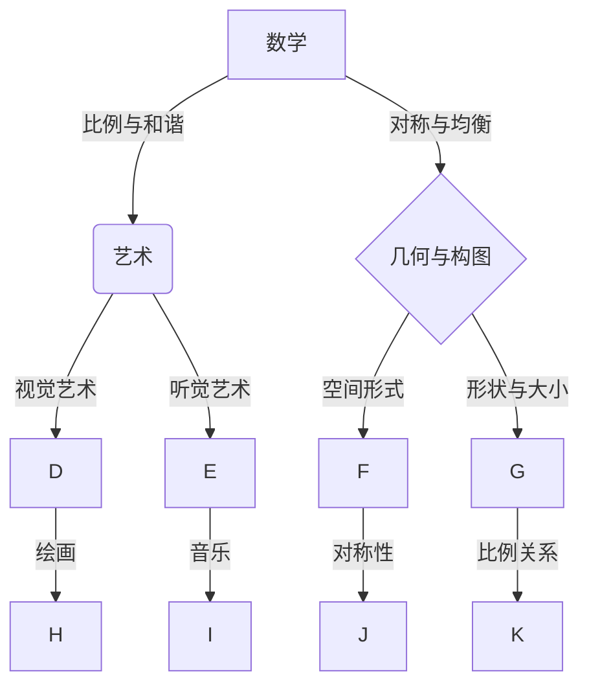

                 


### 文章标题: 数学与艺术：寻找美的共同语言

#### 关键词：数学、艺术、美的共同语言、数学模型、美学理论、实例分析

#### 摘要：
本文旨在探讨数学与艺术之间的关系，寻找二者在美的表达上的共同语言。通过阐述数学的基本概念、艺术的表现形式以及它们之间的联系，本文将展示数学在艺术创作中的应用，并运用美学理论进行分析。实例分析部分将通过具体案例，揭示数学与艺术的结合如何产生美。文章旨在为读者提供对数学与艺术关系的深刻理解，启发新的艺术创作思维。

---

#### 引言

在人类文明的长河中，数学和艺术一直扮演着不可或缺的角色。数学，作为一门严谨的科学，以其逻辑和精确性构建了现代科技和社会发展的基石。艺术，则通过视觉、听觉和触觉等形式，表达了人类对世界的情感和想象力。尽管二者在表面上看似迥异，但它们之间却存在着深刻的联系。美的追求是数学与艺术的共同目标，本文将深入探讨这一主题，寻找数学与艺术之间的共同语言。

数学与艺术的关系可以追溯到古代。古希腊哲学家毕达哥拉斯认为，宇宙的本质是数的和谐。他的学说强调了数学在音乐、建筑和艺术中的重要性。文艺复兴时期的艺术家们，如达芬奇，不仅精通绘画，还对数学和物理有着浓厚的兴趣。他们在作品中运用了透视、比例和几何等数学原理，创造出了令人惊叹的艺术作品。

然而，数学与艺术的结合并不仅限于历史上的少数事例。在现代，随着科技的发展，计算机图形学、数字艺术和人工智能等领域的发展，数学在艺术创作中的应用变得更加广泛和深入。通过算法和数学模型，艺术家可以创造出以前无法想象的艺术形式，这些作品不仅具有美感，还蕴含了深刻的数学思想。

本文将按照以下结构展开：

1. 数学与艺术的基础
2. 数学在艺术中的应用
3. 美学理论探讨
4. 实例分析

通过这一结构的讨论，我们希望揭示数学与艺术之间的深刻联系，并启发读者对这一主题进行更深入的思考。

#### 数学与艺术的基础

要理解数学与艺术之间的联系，我们首先需要了解它们各自的基本概念和理论基础。

##### 数学的基本概念

数学是一门研究数量、结构、变化和空间等概念的学科。它通过逻辑推理和抽象思维来构建理论体系，这些理论又反过来指导我们解决实际问题。数学的基本概念包括：

- **数字**：数学中的数字包括自然数、整数、有理数、实数和复数等。这些数字不仅用于计数和度量，还在更复杂的数学运算中起到基础作用。
- **运算符**：运算符是用于表示数学运算的符号，如加法（+）、减法（-）、乘法（*）和除法（/）等。这些运算符遵循特定的规则，使得数学运算具有一致性。
- **代数基础**：代数是数学的一个分支，它使用符号和方程来表示数和操作。代数基础包括代数表达式、方程、不等式和函数等。

##### 艺术的基本概念

艺术则通过视觉、听觉和触觉等形式表达人类的情感和想象力。艺术的基本概念包括：

- **视觉艺术**：包括绘画、雕塑、摄影等，通过色彩、线条、形状和空间等元素来表达艺术家的思想和情感。
- **听觉艺术**：包括音乐、声音艺术等，通过声音的节奏、旋律和音色来传达艺术家的意图。
- **表演艺术**：包括舞蹈、戏剧、歌剧等，通过动作、语言和音乐等手段来表演故事和情感。

##### 数学与艺术的联系

尽管数学和艺术在形式上有所不同，但它们之间存在着深刻的联系。以下是一些关键的关联点：

- **比例与和谐**：比例是数学中的一个重要概念，它在艺术中被广泛应用。例如，黄金比例（0.618...）在绘画和建筑设计中被广泛采用，因为它被认为是一种美观的比例。和谐在音乐中尤为重要，数学的和谐理论可以帮助音乐家创作出优美的旋律。
- **对称与均衡**：对称是数学中的一个基本概念，它也在艺术中得到了广泛的应用。对称的艺术作品往往给人一种稳定和平衡的感觉。均衡则是艺术中的一个重要原则，它涉及到作品的布局、色彩和形状等因素。
- **几何与构图**：几何是数学的一个分支，它研究空间的形状和大小。在艺术中，几何原理被用于构图，创造出具有美感和形式感的作品。

##### 核心概念与联系（Mermaid流程图）



通过这个流程图，我们可以清晰地看到数学与艺术之间的核心概念及其联系。数学的概念和原理不仅为艺术提供了理论基础，也通过其独特的逻辑性为艺术创作提供了新的思路和工具。

#### 数学在艺术中的应用

数学不仅在理论上与艺术有着紧密的联系，在实际的艺术创作中也发挥着重要的作用。以下我们将探讨数学在几种主要艺术形式中的应用，包括绘画、音乐和雕塑。

##### 绘画

在绘画中，数学的运用主要体现在几何、比例和透视等方面。通过数学模型，画家可以创造出更加精确和真实感强的作品。

- **几何**：几何在绘画中的应用非常广泛。例如，艺术家通过几何形状来构建画面结构，创造出稳定的视觉效果。著名的艺术家达芬奇在他的绘画中大量运用了几何原理，例如在《最后的晚餐》中，他使用了黄金比例来安排人物的构图，增强了画面的和谐感。

- **比例与和谐**：比例是绘画中一个关键的概念。黄金比例被认为是一种非常美的比例关系，它被广泛用于绘画、雕塑和建筑设计中。艺术家通过精确的比例关系来创造视觉上的和谐。例如，在梵高的《星夜》中，他运用了不规则的几何形状和对比强烈的色彩，创造出一种富有动态美感的画面。

- **透视**：透视是绘画中用来表现三维空间的一种方法。通过透视原理，画家可以创造出画面中的物体看起来更加真实。文艺复兴时期的画家如达芬奇和米开朗基罗精通透视技巧，他们在绘画中巧妙地运用了数学的透视原理，使得作品具有强烈的三维空间感。

##### 音乐

在音乐中，数学同样扮演着重要的角色，尤其是在节奏、旋律和和声等方面。

- **节奏**：节奏是音乐的基本元素之一，它通过时间上的组织来传达音乐的动态和情感。节奏的精确性依赖于数学的规律。例如，音乐的节奏可以通过拍子来表示，而拍子则是由数学上的等分来确定的。

- **旋律**：旋律是由一系列音高的变化组成的。在旋律的构造中，数学的和谐理论起到了关键作用。例如，音程的构造和音阶的排列都遵循着数学上的比例关系。音乐理论中的音程关系和和弦结构都是基于数学原理的。

- **和声**：和声是音乐中通过多个音符同时发声来创造出的声音效果。和声的和谐度依赖于数学上的比例关系。著名的音乐理论家如巴赫和贝多芬都运用了数学的和声理论来创作出优美的音乐作品。

##### 雕塑

在雕塑中，数学的应用主要体现在空间的形状和体积的构建上。

- **形状与体积**：雕塑家通过数学原理来构建雕塑的形状和体积。例如，通过几何形状的组合，雕塑家可以创造出既具立体感又具有动态感的作品。数学上的对称性和平衡原理也被广泛应用于雕塑的设计中，以创造出稳定和和谐的艺术作品。

- **比例与尺度**：在雕塑创作中，比例和尺度是非常重要的。通过数学上的精确计算，雕塑家可以确保作品的整体比例和谐，从而使作品更具美感。例如，古希腊的雕塑家通过精确的比例关系创作出了许多经典作品，如《米洛的维纳斯》。

- **空间布局**：雕塑通常需要在三维空间中展示，因此空间布局的合理性对雕塑的美感至关重要。数学上的空间几何原理可以帮助雕塑家合理安排雕塑的布局，使其在空间中展现出最佳效果。

##### 核心算法原理讲解（伪代码）

为了更好地理解数学在艺术中的应用，我们可以通过一些简单的伪代码来展示核心算法原理。

**绘画中的透视算法**

```plaintext
function perspective_transform(points, focal_length, height):
    transformed_points = []
    for point in points:
        x, y = point
        new_x = x / (x + focal_length)
        new_y = y / (y + focal_length)
        transformed_points.append((new_x, new_y))
    return transformed_points
```

**音乐中的节奏算法**

```plaintext
function rhythm_pattern(beats, subdivisions):
    pattern = []
    for beat in range(beats):
        for subdivision in range(subdivisions):
            if (beat + subdivision) % subdivisions == 0:
                pattern.append("strong")
            else:
                pattern.append("weak")
    return pattern
```

通过这些伪代码，我们可以看到数学在艺术创作中的应用是如何通过算法和模型来实现的。这些算法不仅帮助艺术家创造出更具美感的作品，还为他们提供了新的创作工具和思路。

#### 美学理论探讨

美学理论探讨的是美的本质、美的评价标准以及美的创造过程。数学在美学理论中也有着重要的应用，尤其是在美的公式与原理、比例与和谐等方面。

##### 美的公式与原理

在美学理论中，有许多关于美的公式和原理。其中，最著名的当属黄金比例（Golden Ratio），也称为菲波那契比例（Golden Ratio），其数值约为 0.618。黄金比例被认为是一种美学上的黄金标准，它在艺术、设计、建筑和自然界中广泛存在。

- **黄金比例在艺术中的应用**：艺术家们在创作中常常运用黄金比例来增强作品的美感。例如，在绘画中，黄金比例可以用来安排画面的分割，使画面更具和谐感。在建筑设计中，黄金比例被用于设计建筑的比例和尺寸，以达到美观和稳定的效果。

- **黄金比例在自然界中的应用**：在自然界中，黄金比例也广泛存在。例如，海星的对称性、向日葵的种子排列以及人类身体的许多部分都符合黄金比例。这些自然现象的和谐美，是数学与自然美相结合的体现。

##### 比例与和谐

比例与和谐是美学理论中的核心概念。在数学中，比例关系和和谐理论为艺术家提供了创作的理论依据。

- **比例关系**：比例关系是指两个量之间的相对大小关系。在美学中，比例关系被用来评价作品的和谐度。例如，黄金比例就是一种理想的和谐比例。

- **和谐理论**：和谐理论是指通过数学上的比例关系和组合，创造出一种均衡和统一的美感。在音乐中，和谐理论通过音程和和弦的组合，创造出优美的音乐效果。在绘画中，和谐理论通过色彩的搭配和形状的组合，创造出和谐的画面。

##### 数学在艺术评价中的应用

数学不仅在艺术创作中发挥作用，在艺术评价中也具有重要意义。通过数学模型和算法，可以更客观地评价艺术作品的美感。

- **图像处理算法**：在艺术评价中，图像处理算法可以帮助分析艺术作品的色彩、纹理和形状。通过这些算法，可以量化艺术作品的视觉效果，从而提供一个客观的评价标准。

- **机器学习模型**：机器学习模型可以通过学习大量的艺术作品数据，预测一个艺术作品的受欢迎程度和美感。这种方法可以用来评估新兴艺术家的作品，或者为艺术市场的分析提供数据支持。

##### 核心算法原理讲解（伪代码）

为了更好地理解数学在美学理论中的应用，我们可以通过一些简单的伪代码来展示核心算法原理。

**黄金比例检测算法**

```plaintext
function golden_ratio_test(image):
    width, height = image.size
    center_x, center_y = width / 2, height / 2
    segments = divide_image_into_segments(image, width, height)
    golden_ratio_segments = []
    for segment in segments:
        if segment_length(segment) / segment_width(segment) > 0.618:
            golden_ratio_segments.append(segment)
    return golden_ratio_segments
```

**色彩和谐度算法**

```plaintext
function color_harmony_score(image):
    colors = extract_colors(image)
    harmony_scores = []
    for color in colors:
        score = calculate_harmony_score(color)
        harmony_scores.append(score)
    average_score = sum(harmony_scores) / len(harmony_scores)
    return average_score
```

通过这些算法，我们可以量化艺术作品的美感，从而为艺术评价提供科学的依据。这些算法不仅丰富了美学理论，也为艺术创作提供了新的工具和方法。

#### 实例分析

为了更好地理解数学与艺术之间的联系，我们通过一些具体案例来分析数学在艺术创作中的应用。

##### 著名的数学艺术作品

1. **达芬奇的《最后的晚餐》**：
   达芬奇在《最后的晚餐》中运用了透视原理和黄金比例。他通过精确的透视处理，使得画面的空间感更加真实。同时，人物的位置和比例安排也符合黄金比例，增强了画面的和谐感。

2. **梵高的《星夜》**：
   梵高在《星夜》中运用了不规则的几何形状和对比强烈的色彩，创造出一种富有动态美感的画面。这幅画中，几何形状和色彩的比例关系不仅符合美学原则，还蕴含了数学上的和谐与比例。

3. **米开朗基罗的《创世纪》**：
   在西斯廷教堂的天花板上，米开朗基罗绘制了《创世纪》。他运用了透视和比例原理，使得画面中的天使和神像具有强烈的立体感和动态感。这些作品不仅具有艺术价值，也展示了数学原理在艺术创作中的重要性。

##### 数学艺术创作实践

数学不仅为艺术作品提供了理论基础，也为艺术家提供了新的创作工具和思路。以下是一些数学艺术创作实践的例子：

1. **计算机图形学**：
   计算机图形学为艺术家提供了利用数学模型创作艺术作品的方法。通过计算机算法，艺术家可以生成复杂的几何图形和动画。例如，数学上的分形理论和粒子系统可以创造出丰富多彩的艺术效果。

2. **数字艺术**：
   数字艺术的发展使得数学在艺术创作中的应用更加广泛。通过计算机软件，艺术家可以运用数学模型和算法，创作出以前无法想象的艺术作品。例如，使用数学公式来生成抽象的图像，或者通过计算机程序来控制绘画笔触的生成。

3. **人工智能艺术**：
   人工智能技术的兴起，为数学在艺术创作中的应用带来了新的可能性。通过机器学习算法，艺术家可以创作出具有高度复杂性和个性化的艺术作品。例如，使用生成对抗网络（GAN）来生成新的艺术图像，或者通过自然语言处理技术来创作音乐作品。

##### 代码解读与分析

为了深入理解数学艺术创作实践，我们可以通过具体的代码示例来分析其中的算法和原理。

1. **分形艺术生成**：
   分形是一种复杂的几何图形，它通过递归算法生成。以下是一个简单的伪代码，用于生成分形图像。

   ```python
   def generate_fractal(image, max_depth):
       if max_depth == 0:
           return
       new_image = create_new_image(image)
       for pixel in image:
           if condition(pixel):
               generate_fractal(new_image, max_depth - 1)
       return new_image
   ```

   通过递归调用，分形图像可以不断细化，形成丰富的细节。

2. **粒子系统**：
   粒子系统是一种用于生成动态效果的算法。以下是一个简单的伪代码，用于生成粒子系统的艺术作品。

   ```python
   def create_particle_system(num_particles):
       particles = []
       for i in range(num_particles):
           particle = {
               "position": random_position(),
               "velocity": random_velocity(),
               "color": random_color()
           }
           particles.append(particle)
       return particles

   def update_particles(particles):
       for particle in particles:
           particle["position"] += particle["velocity"]
           particle["color"] = update_color(particle["color"])
   ```

   通过更新粒子的位置和颜色，可以生成动态的粒子效果。

通过这些代码示例，我们可以看到数学和算法在艺术创作中的具体应用。这些算法不仅丰富了艺术创作的方法和工具，也为数学在艺术领域的探索提供了新的可能性。

##### 项目小结

通过对数学与艺术的关系的探讨，我们可以看到数学在艺术创作中的重要作用。从基础概念到实际应用，从美学理论到实例分析，数学为艺术创作提供了丰富的理论依据和工具。在未来的艺术创作中，随着科技的发展，数学的应用将更加广泛和深入。例如，人工智能和机器学习技术可以用于生成新的艺术作品，计算机图形学可以用于创造复杂而精美的视觉效果。这些技术的发展，将为艺术创作带来新的变革，也将为数学在艺术领域的探索提供新的方向。

##### 最佳实践 tips

为了在艺术创作中更好地应用数学，以下是一些实用的技巧和最佳实践：

1. **学习基础数学知识**：掌握基础的数学概念和原理，如代数、几何、概率和统计等，为艺术创作提供坚实的理论基础。

2. **运用比例和和谐**：在艺术创作中，运用比例和和谐理论，可以帮助作品更具美感。例如，尝试使用黄金比例来安排构图和色彩。

3. **利用计算机工具**：使用计算机图形学软件和编程工具，如Python、MATLAB等，可以帮助你实现复杂的数学模型和算法。

4. **跨学科学习**：结合其他学科的知识，如物理学、心理学等，可以拓展艺术创作的思路和方法。

5. **实践与探索**：通过实践和不断的探索，你可以发现数学在艺术创作中的新应用，创造出独特的艺术作品。

##### 注意事项

在应用数学进行艺术创作时，需要注意以下几点：

1. **避免过度使用数学**：数学工具应该是艺术创作的辅助手段，而不是主导。过度使用数学可能会使作品失去艺术性。

2. **尊重艺术直觉**：艺术创作很大程度上依赖于艺术家的直觉和创造力。数学可以提供工具和思路，但最终的艺术效果还是需要艺术家自身的创造力和灵感。

3. **保持作品的多样性**：在应用数学进行艺术创作时，要注意保持作品的多样性，避免陷入单一的数学模型或算法。

4. **持续学习和更新**：随着科技的发展，数学在艺术创作中的应用会不断更新和变化。保持学习和探索的态度，可以帮助你紧跟时代潮流，创作出更具创新性的艺术作品。

##### 拓展阅读

如果你对数学与艺术的结合感兴趣，以下是一些推荐的拓展阅读材料：

1. **《数学与艺术：美学与创造力》**：这是一本介绍数学在艺术创作中应用的经典著作，涵盖了数学原理、艺术表现和美学理论等内容。

2. **《计算机艺术：算法与创意》**：这本书通过计算机编程和算法，展示了数学在数字艺术创作中的应用，适合对计算机艺术感兴趣的读者。

3. **《美学：一种数学的探讨》**：这本书从数学的角度探讨了美的本质和美的评价标准，为理解数学在美学中的应用提供了深刻的见解。

4. **《分形几何：形状、结构和形态》**：这本书详细介绍了分形几何的理论和应用，是研究分形艺术的好教材。

通过阅读这些书籍，你可以更深入地了解数学与艺术的结合，启发自己的艺术创作。

### 作者信息

作者：AI天才研究院/AI Genius Institute & 禅与计算机程序设计艺术 /Zen And The Art of Computer Programming

