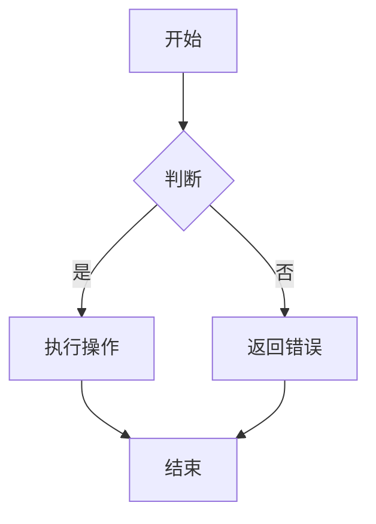

                 

### 文章标题：数学与范畴论：数学结构间关系的抽象

### 关键词：范畴论、数学结构、抽象、关系、应用

### 摘要：
本文旨在探讨数学中的范畴论，作为一种抽象工具，它如何帮助我们理解不同数学结构间的关系。文章首先介绍数学与范畴论的基本概念，随后深入探讨范畴与函子、自然变换等核心内容，并通过实例讲解范畴论在数学和计算机科学中的应用。最后，文章展望范畴论的未来发展趋势，并总结最佳实践和注意事项。

## 第1章 范畴论基础

### 1.1 数学结构概述

#### 1.1.1 数学基本概念

数学是一门研究数量、结构、变化和空间的科学。在数学中，我们使用符号、公式和定理来描述世界的基本规律。数学的各个分支，如算术、代数、几何、微积分、拓扑等，都有其独特的研究对象和方法。

#### 1.1.2 数学结构间的关系

数学中的结构通常指的是一组元素及其间的运算关系。例如，在数论中，整数集合构成了一个具有加法和乘法运算的结构；在代数中，向量空间由向量及其间的加法和标量乘法构成。

#### 1.1.3 范畴论引入的目的

传统的数学研究往往关注特定领域的结构，如集合论、代数或几何。然而，随着数学的发展，人们开始意识到不同数学结构之间存在深刻的相似性和联系。范畴论作为一种抽象工具，旨在捕捉这些结构间的关系，提供一个统一的框架来研究数学的不同领域。

### 1.2 范畴的基本概念

#### 1.2.1 范畴的定义

范畴是由对象和箭头组成的集合，其中箭头表示对象之间的某种关系。范畴中的对象通常表示数学结构中的元素，而箭头表示这些元素之间的运算或映射。

形式化定义如下：

- **对象集合**：设C为对象集合。
- **箭头集合**：设A为箭头集合，每个箭头是一个有序对(a, b)，表示从对象a到对象b的映射。
- **合成**：对于任意箭头f: a → b和g: b → c，存在一个合成箭头g ∘ f: a → c。
- **单位元**：对于每个对象a，存在一个单位箭头id\_a: a → a，使得对于任意箭头f: a → b，都有id\_b ∘ f = f = g ∘ id\_a。

#### 1.2.2 对象与箭头

在范畴论中，对象和箭头是基本的构建块。对象通常表示数学结构中的元素，而箭头表示元素之间的运算或映射。例如，在整数范畴中，对象是整数，箭头是加法和乘法运算。

#### 1.2.3 子范畴与全范畴

子范畴是指从某个范畴中提取出来的一部分对象和箭头。全范畴是指包含某个范畴的所有对象和箭头的范畴。

形式化定义如下：

- **子范畴**：设D是范畴C的一个子范畴，如果D中的对象是C中的对象的一个子集，且D中的箭头是C中具有相同起点和终点的箭头的子集。
- **全范畴**：设C是一个范畴，如果C本身就是C的子范畴，则称C为全范畴。

### 1.3 函子的概念

#### 1.3.1 函子的定义

函子是从一个范畴到另一个范畴的映射，它保持了范畴的结构。具体来说，函子是将一个范畴中的对象映射到另一个范畴中的对象，将箭头映射到箭头，并且保持合成和单位元的性质。

形式化定义如下：

- **函子**：设F是从范畴C到范畴D的一个函子，如果：
  - 对于每个对象a ∈ C，存在一个对象Fa ∈ D，使得F将a映射到Fa。
  - 对于每个箭头f: a → b ∈ C，存在一个箭头Ff: Fa → Fb ∈ D，使得F将f映射到Ff。
  - 对于每个合成g ∘ f ∈ C，有(Fg) ∘ (Ff) = F(g ∘ f) ∈ D。
  - 对于每个单位元id\_a ∈ C，有F(id\_a) = id\_{Fa} ∈ D。

#### 1.3.2 函子的性质

- **保持合成**：如上述定义，函子保持了范畴中的合成关系。
- **保持单位元**：函子将每个范畴的单位元映射到另一个范畴的单位元。
- **全射性**：函子是全射的，即如果F(f) = F(g)，则f = g。
- **单射性**：函子是单射的，即如果f = g，则F(f) = F(g)。

#### 1.3.3 函子的例子

在数学中，很多函子是常见的。例如，实数范畴到整数范畴的映射，将每个实数映射到它的整数部分；向量空间到其双线性映射的范畴的映射，将每个向量映射到其对应的线性映射。

### 1.4 范畴论与集合论的对比

#### 1.4.1 集合论中的数学结构

集合论是现代数学的基石，它使用集合作为基本元素来构造各种数学结构。集合论中的数学结构包括集合、集合的子集、集合的并集、交集和补集等。

#### 1.4.2 范畴论中的数学结构

范畴论中的数学结构则是基于对象和箭头。范畴论中的对象可以看作是集合的推广，而箭头可以看作是函数的推广。范畴论关注的是不同数学结构之间的相似性和关系，而不仅仅是集合论中的元素操作。

#### 1.4.3 两种视角的比较

集合论和范畴论都是数学的基础理论，但它们的视角不同。集合论关注的是元素和元素之间的关系，而范畴论关注的是结构之间的关系。范畴论通过抽象化和泛化，提供了一种更广泛和更深入的数学研究方法。

## 第2章 范畴与函子

### 2.1 范畴与函子的关系

#### 2.1.1 函子作为范畴的映射

函子是范畴论中的一个核心概念，它是从范畴C到范畴D的一个映射，它保持了范畴的结构。具体来说，函子将范畴C中的对象映射到范畴D中的对象，将箭头映射到箭头，并且保持合成和单位元的性质。

#### 2.1.2 函子的性质

函子具有以下几个重要性质：

- **保持合成**：对于任意的箭头f: a → b和g: b → c，函子F保持合成，即F(g ∘ f) = F(g) ∘ F(f)。
- **保持单位元**：对于任意的对象a，函子F保持单位元，即F(id\_a) = id\_{Fa}。
- **全射性**：函子是全射的，即如果F(f) = F(g)，则f = g。
- **单射性**：函子是单射的，即如果f = g，则F(f) = F(g)。

#### 2.1.3 范畴论中的等价性

在范畴论中，两个范畴是等价的，如果存在一个函子F，它既是全射的也是单射的。等价性是范畴论中的一个重要概念，它表明了两个范畴在结构上的相似性。

### 2.2 自然变换

#### 2.2.1 自然变换的定义

自然变换是范畴论中的一个基本概念，它描述了不同函子之间的关联。具体来说，自然变换是一个从范畴C到范畴D的函子F到另一个函子G的映射，它满足特定的条件。

形式化定义如下：

- **自然变换**：设F和G是从范畴C到范畴D的两个函子，一个自然变换α是从范畴C到范畴D的函子，它满足以下条件：
  - 对于任意箭头f: a → b ∈ C，有α(f) = G(F(f))。
  - 对于任意合成g ∘ f ∈ C，有α(g ∘ f) = G(F(g)) ∘ α(f)。

#### 2.2.2 自然变换的性质

自然变换具有以下几个重要性质：

- **保持合成**：对于任意的箭头f: a → b和g: b → c，有α(g ∘ f) = G(F(g)) ∘ α(f)。
- **保持单位元**：对于任意的对象a，有α(id\_a) = G(id\_{Fa})。
- **自然性**：自然变换α满足自然性条件，即对于任意的箭头f: a → b，有α(f) = G(F(f))。

#### 2.2.3 自然变换的例子

在数学中，自然变换的例子包括群到其线性表示的映射，环到其模的映射等。这些自然变换在数学和物理中都有广泛的应用。

### 2.3 范畴合成

#### 2.3.1 范畴合成的基本概念

范畴合成是指将两个范畴合并成一个更大的范畴。范畴合成可以看作是函子的扩展，它允许我们在更大的范畴中研究更复杂的结构。

形式化定义如下：

- **范畴合成**：设C和D是两个范畴，一个范畴合成是从范畴C到范畴D的一个函子，它满足以下条件：
  - 对于每个对象a ∈ C，存在一个对象Fa ∈ D。
  - 对于每个箭头f: a → b ∈ C，存在一个箭头Ff: Fa → Fb ∈ D。
  - 对于每个合成g ∘ f ∈ C，有(Fg) ∘ Ff = F(g ∘ f)。

#### 2.3.2 范畴合成的性质

范畴合成具有以下几个重要性质：

- **保持合成**：对于任意的箭头f: a → b和g: b → c，有(Fg) ∘ Ff = F(g ∘ f)。
- **保持单位元**：对于任意的对象a，有F(id\_a) = id\_{Fa}。
- **全射性和单射性**：范畴合成是全射的和单射的。

#### 2.3.3 范畴合成的例子

范畴合成的例子包括将整数范畴与实数范畴合并成实数范畴，将群范畴与线性空间范畴合并成线性群范畴等。

### 2.4 大范畴与小范畴

#### 2.4.1 大范畴与小范畴的定义

在范畴论中，大范畴和小范畴是相对的概念。大范畴是指包含小范畴的所有对象和箭头的范畴，而小范畴是指从大范畴中提取出来的一部分对象和箭头。

形式化定义如下：

- **小范畴**：设D是大范畴C的一个子范畴，如果D中的对象是C中的对象的一个子集，且D中的箭头是C中具有相同起点和终点的箭头的子集。
- **大范畴**：设C是一个范畴，如果C本身就是C的子范畴，则称C为大范畴。

#### 2.4.2 大范畴与小范畴的关系

大范畴与小范畴之间存在紧密的关系。具体来说，大范畴包含小范畴的所有对象和箭头，而小范畴是大范畴的一部分。范畴论通过研究大范畴和小范畴之间的关系，揭示了不同数学结构之间的深层联系。

## 第3章 范畴论应用

### 3.1 范畴论在其他数学分支中的应用

#### 3.1.1 代数学中的应用

在代数学中，范畴论被广泛应用于研究代数结构之间的相似性和关系。例如，群范畴和环范畴是代数学中两个重要的范畴，它们描述了不同的代数结构，如群、环、域等。通过范畴论，我们可以研究这些结构之间的同态、同构等关系，从而更深入地理解代数的本质。

#### 3.1.2 拓扑学中的应用

在拓扑学中，范畴论也被广泛应用。拓扑范畴描述了不同的拓扑空间和连续映射，通过范畴论，我们可以研究拓扑空间的性质和分类，如同伦型、同调型等。此外，范畴论还提供了研究拓扑空间的几何和代数性质的工具，如K理论、同调代数等。

#### 3.1.3 计算机科学中的应用

在计算机科学中，范畴论被广泛应用于程序设计、算法设计、软件工程等领域。范畴论提供了一种抽象的框架来描述程序的结构和语义，帮助我们更好地理解和设计复杂的软件系统。例如，范畴论在函数式编程、依赖注入、接口设计等方面都有广泛的应用。

### 3.2 范畴论在物理学中的应用

#### 3.2.1 场论中的范畴论应用

在物理学中，范畴论被广泛应用于场论的研究。场论描述了物理量在空间中的分布和变化，通过范畴论，我们可以将场论中的不同物理量（如矢量场、标量场等）统一到一个范畴框架下。这有助于我们更好地理解物理现象，并研究它们之间的相互作用。

#### 3.2.2 量子力学中的范畴论应用

在量子力学中，范畴论也被广泛应用于研究量子态和量子演化的性质。量子态可以看作是一个范畴中的对象，量子演化可以看作是一个范畴中的箭头。通过范畴论，我们可以研究量子态的叠加、纠缠等性质，并探索量子信息处理的潜在应用。

#### 3.2.3 相对论中的范畴论应用

在相对论中，范畴论也被广泛应用于研究时空结构。相对论中的时空可以看作是一个范畴，通过范畴论，我们可以研究时空的性质和变换，如洛伦兹变换等。这有助于我们更好地理解相对论的基本原理，并探索宇宙的奥秘。

### 3.3 范畴论在计算机科学中的应用案例

#### 3.3.1 程序设计中的范畴论

在程序设计中，范畴论提供了一种抽象的框架来描述程序的结构和语义。通过范畴论，我们可以将程序设计中的各种概念（如函数、类型、接口等）统一到一个范畴框架下。这有助于我们更好地理解和设计复杂的程序系统。

#### 3.3.2 数据结构与算法中的范畴论

在数据结构和算法设计中，范畴论也发挥着重要作用。通过范畴论，我们可以将不同的数据结构和算法抽象为范畴中的对象和箭头，研究它们之间的相似性和关系。这有助于我们更好地理解数据结构和算法的本质，并设计更高效的算法。

#### 3.3.3 软件工程中的范畴论

在软件工程中，范畴论被广泛应用于软件设计和架构。通过范畴论，我们可以将软件系统抽象为范畴中的对象和箭头，研究它们之间的相互作用和依赖关系。这有助于我们更好地设计和维护复杂的软件系统，提高软件的可靠性和可维护性。

## 第4章 范畴论扩展

### 4.1 范畴论与拓扑学的结合

#### 4.1.1 拓扑范畴的定义

在范畴论中，拓扑范畴是一个重要的概念。它描述了拓扑空间和连续映射的集合，通过范畴论，我们可以研究拓扑空间的基本性质和分类。

形式化定义如下：

- **拓扑范畴**：设Top是所有拓扑空间的集合，一个拓扑范畴是由对象（拓扑空间）和箭头（连续映射）组成的集合，它满足范畴的基本性质，如合成、单位元等。

#### 4.1.2 拓扑范畴的性质

拓扑范畴具有以下几个重要性质：

- **保持合成**：对于任意的连续映射f: X → Y和g: Y → Z，复合映射g ∘ f也是连续的。
- **保持单位元**：对于任意的拓扑空间X，恒等映射id\_X是连续的。
- **全射性和单射性**：拓扑范畴是全射的和单射的。

#### 4.1.3 拓扑范畴的应用

拓扑范畴在数学和物理学中都有广泛的应用。例如，在代数拓扑中，我们可以使用拓扑范畴来研究拓扑空间的同伦型；在物理科学中，我们可以使用拓扑范畴来研究时空的性质和变换。

### 4.2 范畴论与代数学的结合

#### 4.2.1 代数范畴的定义

在范畴论中，代数范畴是一个重要的概念。它描述了代数结构的集合，通过范畴论，我们可以研究代数结构之间的相似性和关系。

形式化定义如下：

- **代数范畴**：设Algebra是所有代数结构的集合，一个代数范畴是由对象（代数结构）和箭头（同态）组成的集合，它满足范畴的基本性质，如合成、单位元等。

#### 4.2.2 代数范畴的性质

代数范畴具有以下几个重要性质：

- **保持合成**：对于任意的同态f: A → B和g: B → C，复合同态g ∘ f也是同态。
- **保持单位元**：对于任意的代数结构A，恒等同态id\_A是同态。
- **全射性和单射性**：代数范畴是全射的和单射的。

#### 4.2.3 代数范畴的应用

代数范畴在数学和计算机科学中都有广泛的应用。例如，在代数学中，我们可以使用代数范畴来研究不同的代数结构，如群、环、域等；在计算机科学中，我们可以使用代数范畴来研究程序设计中的各种概念，如函数、类型等。

### 4.3 范畴论在其他领域的应用

#### 4.3.1 逻辑学中的应用

在逻辑学中，范畴论被广泛应用于研究命题逻辑、谓词逻辑等。通过范畴论，我们可以将逻辑命题抽象为范畴中的对象和箭头，研究它们之间的逻辑关系和推理规则。这有助于我们更好地理解和应用逻辑学的基本原理。

#### 4.3.2 形式语言与自动机理论中的应用

在形式语言与自动机理论中，范畴论也被广泛应用于研究语言和自动机的性质。通过范畴论，我们可以将形式语言和自动机抽象为范畴中的对象和箭头，研究它们之间的相似性和关系。这有助于我们更好地理解和设计复杂的形式语言和自动机。

#### 4.3.3 系统科学与控制理论中的应用

在系统科学与控制理论中，范畴论被广泛应用于研究系统模型、系统行为和系统控制。通过范畴论，我们可以将系统抽象为范畴中的对象和箭头，研究系统的动态特性和控制策略。这有助于我们更好地理解和设计复杂的系统。

## 第5章 范畴论方法论

### 5.1 范畴论的研究方法

#### 5.1.1 范畴论的基本定理

范畴论中存在一些基本定理，这些定理描述了范畴之间的关系和性质。例如：

- **函子定理**：函子是保持范畴结构的映射。
- **自然变换定理**：自然变换是保持函子之间关系的映射。
- **范畴合成定理**：范畴合成是范畴之间的组合。

这些基本定理为范畴论的研究提供了理论基础。

#### 5.1.2 范畴论的证明技巧

在范畴论中，证明技巧是非常重要的。范畴论的证明通常涉及以下几个步骤：

- **构造函子**：构造一个函子，它将一个范畴映射到另一个范畴。
- **证明函子保持结构**：证明函子保持了范畴的基本性质，如合成、单位元等。
- **构造自然变换**：构造一个自然变换，它连接不同的函子。
- **证明自然变换满足条件**：证明自然变换满足自然性条件。

通过这些步骤，我们可以证明范畴论中的各种定理和命题。

#### 5.1.3 范畴论的研究方向

范畴论的研究方向非常广泛，包括以下几个方面：

- **范畴论与代数学的关系**：研究代数结构在范畴论框架下的性质和分类。
- **范畴论与拓扑学的结合**：研究拓扑空间在范畴论框架下的性质和分类。
- **范畴论在计算机科学中的应用**：研究范畴论在程序设计、算法设计、软件工程等领域的应用。
- **范畴论与其他数学领域的关系**：研究范畴论与其他数学分支（如几何、微积分、逻辑等）的关系。

### 5.2 范畴论的学习方法

#### 5.2.1 学习范畴论的基本步骤

学习范畴论可以分为以下几个步骤：

- **理解基础概念**：首先需要理解范畴论中的基本概念，如对象、箭头、函子、自然变换等。
- **学习基本定理**：掌握范畴论中的基本定理，如函子定理、自然变换定理、范畴合成定理等。
- **阅读经典教材**：阅读一些经典的范畴论教材，如《范畴论入门》、《范畴论基础》等。
- **解决实际问题**：通过解决实际问题来加深对范畴论的理解和应用。

#### 5.2.2 范畴论的实例分析

通过分析具体的范畴论实例，可以更好地理解范畴论的概念和应用。以下是一些范畴论的实例：

- **整数范畴与实数范畴**：研究整数范畴和实数范畴之间的相似性和关系。
- **群范畴与环范畴**：研究群范畴和环范畴之间的相似性和关系。
- **拓扑范畴与代数范畴**：研究拓扑范畴和代数范畴之间的相似性和关系。

#### 5.2.3 范畴论的学习资源

学习范畴论可以参考以下资源：

- **书籍**：《范畴论入门》、《范畴论基础》、《范畴论与应用》等。
- **在线课程**：Coursera、edX等在线平台上有很多关于范畴论的免费课程。
- **研究论文**：阅读一些范畴论的研究论文，了解最新的研究进展。

## 第6章 范畴论的未来

### 6.1 范畴论的发展趋势

范畴论作为数学的一个重要分支，其发展具有以下几个趋势：

- **与其他数学领域的融合**：范畴论正在与其他数学领域（如代数学、拓扑学、逻辑学等）进行深度融合，形成新的数学理论体系。
- **在计算机科学中的应用**：范畴论在计算机科学中的应用越来越广泛，如程序设计、算法设计、软件工程等。
- **在物理学中的应用**：范畴论在物理学中的应用正在逐步展开，如量子场论、相对论等。

### 6.2 范畴论的挑战与机遇

范畴论的发展面临以下几个挑战：

- **抽象化与具体化的平衡**：范畴论的抽象化程度很高，如何在保持抽象的同时，保持具体问题的可操作性，是一个重要的挑战。
- **应用领域的拓展**：虽然范畴论在数学和计算机科学中应用广泛，但在其他领域（如生物学、经济学等）的应用还不够深入。
- **人才短缺**：范畴论是一门高深的数学理论，需要具备一定的数学基础和逻辑思维能力。当前，从事范畴论研究和教学的人才相对较少。

### 6.3 范畴论的未来发展

范畴论的未来发展具有以下几个方向：

- **数学领域**：范畴论将继续与其他数学领域进行深度融合，形成新的数学理论体系。
- **计算机科学领域**：范畴论在计算机科学中的应用将更加广泛，如程序设计、算法设计、软件工程等。
- **物理学领域**：范畴论在物理学中的应用将逐步深入，如量子场论、相对论等。
- **跨学科研究**：范畴论将在跨学科研究中发挥重要作用，如生物学、经济学、社会学等。

## 附录

### 附录 A 范畴论相关资源

#### A.1 范畴论经典书籍推荐

- 《范畴论入门》（Category Theory for the Sciences） by Emily Riehl
- 《范畴论基础》（Basic Category Theory） by Tom Leinster
- 《范畴论》（Categories for the Working Mathematician） by Saunders Mac Lane

#### A.2 范畴论在线课程推荐

- Coursera上的“Categories and Computer Science”
- edX上的“Introduction to Category Theory”
- Khan Academy上的“Category Theory”课程

#### A.3 范畴论研究机构与学术会议

- 美国数学学会（AMS）
- 英国数学学会（IMA）
- 国际范畴论会议（ICM）

### 附录 B 范畴论实用工具

#### B.1 Mermaid 图

Mermaid 是一种基于文本的图表绘制工具，可以方便地绘制 Mermaid 流程图。

示例：



#### B.2 LaTeX

LaTeX 是一种高质量的排版系统，可以用于编写和格式化数学公式。

示例：

```latex
$$
E = mc^2
$$

$x < 2$
```

通过上述示例，我们可以看到范畴论作为一种抽象工具，在数学和计算机科学中具有广泛的应用。它不仅帮助我们理解不同数学结构间的关系，还为解决实际问题提供了有力的工具。随着范畴论与其他领域的深度融合，其应用前景将更加广阔。希望本文能够对您理解范畴论有所帮助，并激发您对这一领域的研究兴趣。最后，感谢您阅读本文，希望您在数学与范畴论的探索之旅中取得丰硕的成果。作者：AI天才研究院/AI Genius Institute & 禅与计算机程序设计艺术 /Zen And The Art of Computer Programming。如果您有任何问题或建议，欢迎随时与我们联系。谢谢！

