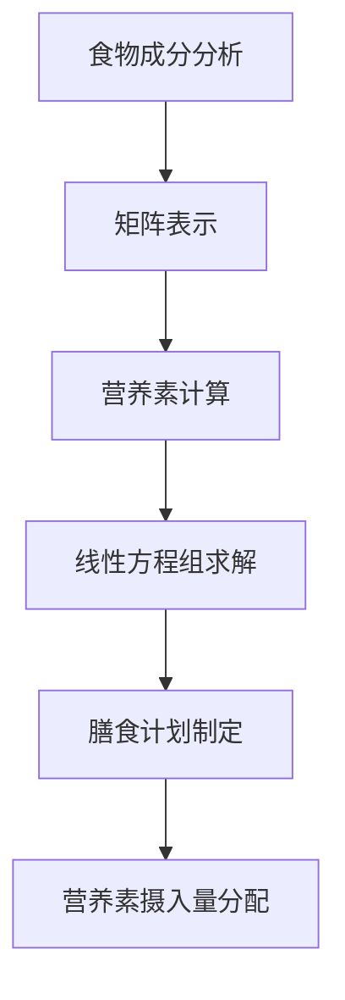
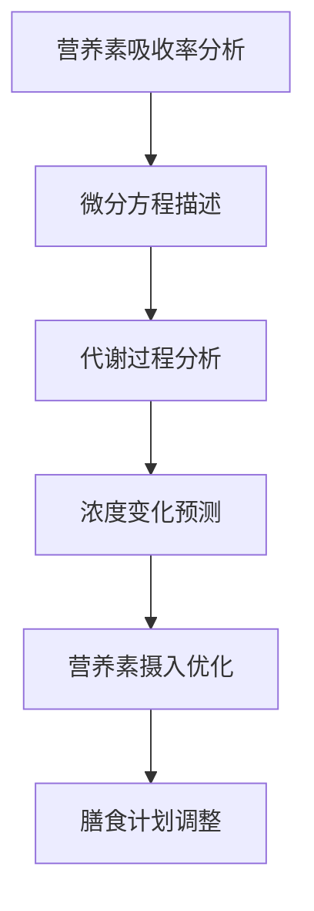
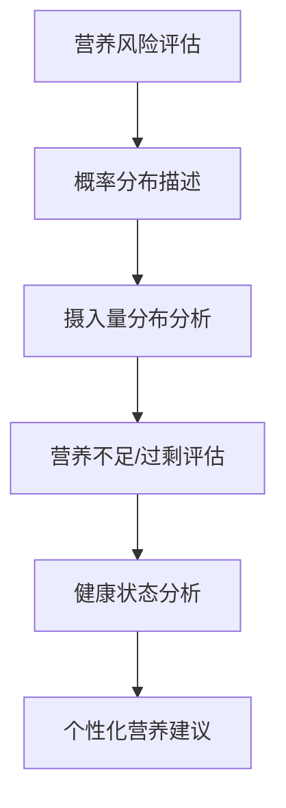

                 

基于上述要求和步骤，以下是我为《数学与营养科学：膳食规划的数学优化》撰写的文章大纲和正文部分的内容。文章将分多个段落进行撰写，每段内容将详细阐述相应的小节。

### 文章标题
《数学与营养科学：膳食规划的数学优化》

### 文章关键词
营养科学、数学优化、膳食规划、线性规划、非线性规划、概率论、微积分

### 文章摘要
本文探讨了数学在营养科学中的应用，特别是膳食规划的数学优化。通过阐述数学基础、营养科学基础、膳食规划原理以及数学优化方法，本文为膳食规划提供了科学依据和优化策略。通过案例研究和应用场景分析，本文展示了数学优化在膳食规划中的实际应用和价值。

### 目录
1. 引言
2. 数学基础
   2.1 数学原理
   2.2 数学工具
3. 营养科学基础
   3.1 营养学原理
   3.2 膳食规划原理
4. 膳食规划的数学优化方法
   4.1 线性规划方法
   4.2 非线性规划方法
5. 案例研究
   5.1 案例一：某地区膳食规划优化
   5.2 案例二：营养配餐系统开发
6. 应用场景分析
   6.1 公共营养管理
   6.2 食品行业
7. 数学与营养科学的未来发展趋势
8. 结论与展望

### 引言
膳食规划是营养科学的重要研究方向，旨在通过合理配置食物和营养素，满足人体生理和心理健康的需求。随着社会经济的发展和生活方式的改变，人们对膳食质量的要求不断提高，对膳食规划的科学性和优化提出了更高的要求。数学作为一门基础科学，其在膳食规划中的应用越来越受到重视。本文旨在探讨数学在营养科学中的应用，特别是膳食规划的数学优化。

本文首先介绍了数学在膳食规划中的基础，包括数学原理和数学工具。接着，本文阐述了营养科学基础，包括营养学原理和膳食规划原理。在此基础上，本文介绍了膳食规划的数学优化方法，包括线性规划和非线性规划。最后，本文通过案例研究和应用场景分析，展示了数学优化在膳食规划中的实际应用和价值。

### 数学基础
数学在膳食规划中的应用主要依赖于数学原理和数学工具。数学原理包括线性代数、微积分、概率论等，这些原理为膳食规划的数学建模提供了理论基础。数学工具包括求解器、线性规划工具、非线性规划工具等，这些工具为膳食规划的数学优化提供了计算支持。

#### 2.1 数学原理
线性代数、微积分和概率论是数学中的基础分支，它们在膳食规划中有着广泛的应用。

- 线性代数：线性代数中的矩阵运算、向量运算、线性方程组求解等方法，在膳食规划中的食物成分分析、营养素计算等方面有着重要作用。
- 微积分：微积分中的微分、积分、极限等概念，在膳食规划中的营养素吸收、代谢过程分析等方面有着重要作用。
- 概率论：概率论中的概率分布、随机变量、假设检验等概念，在膳食规划中的营养风险评估、健康状态评估等方面有着重要作用。

#### 2.2 数学工具
数学工具是数学原理的具体应用，它们为膳食规划的数学优化提供了计算支持。

- 求解器：求解器是一种用于求解数学方程和优化问题的软件工具。在膳食规划中，求解器可以用于求解线性方程组和优化问题，帮助制定合理的膳食计划。
- 线性规划工具：线性规划工具是一种用于求解线性规划问题的软件工具。在膳食规划中，线性规划工具可以用于优化食物成分和营养素的分配，提高膳食的营养价值。
- 非线性规划工具：非线性规划工具是一种用于求解非线性规划问题的软件工具。在膳食规划中，非线性规划工具可以用于优化复杂的膳食配方，满足特定的营养需求。

### 营养科学基础
营养科学是研究食物与人体健康关系的科学，是膳食规划的理论基础。营养学原理和膳食规划原理是营养科学的核心内容。

#### 3.1 营养学原理
营养学原理包括营养素介绍、营养需求与供给、营养与健康等方面。

- 营养素介绍：营养素是人体所需的化学物质，包括蛋白质、脂肪、碳水化合物、维生素、矿物质等。它们是人体正常生理功能和健康的基础。
- 营养需求与供给：营养需求是指人体对各种营养素的需求量，供给是指通过膳食提供足够的营养素。合理营养需求的供给对于维持人体健康至关重要。
- 营养与健康：营养与人体健康密切相关，营养不良和营养过剩都可能对人体健康产生负面影响。因此，制定合理的膳食计划，保证营养均衡，对于维护人体健康具有重要意义。

#### 3.2 膳食规划原理
膳食规划原理包括膳食结构分析、膳食平衡原则、膳食制定流程等方面。

- 膳食结构分析：膳食结构分析是对膳食中各种营养素的组成和比例进行分析，了解膳食的营养特点。通过膳食结构分析，可以评估膳食的合理性，为制定膳食计划提供依据。
- 膳食平衡原则：膳食平衡原则是指膳食中各种营养素的比例要合理，满足人体对各种营养素的需求。膳食平衡原则是制定膳食计划的重要原则，可以保证人体获得全面的营养。
- 膳食制定流程：膳食制定流程包括膳食调查、膳食分析、膳食制定和膳食评价等步骤。通过膳食制定流程，可以科学地制定膳食计划，确保膳食的营养平衡。

### 膳食规划的数学优化方法
膳食规划的数学优化方法主要包括线性规划和非线性规划。这些方法可以根据营养需求和膳食目标，优化膳食的组成和营养分配，提高膳食的营养价值。

#### 4.1 线性规划方法
线性规划方法是一种求解线性优化问题的方法。在膳食规划中，线性规划方法可以用于优化食物成分和营养素的分配。

- 线性规划原理：线性规划问题可以通过构建目标函数和约束条件来求解。目标函数表示优化目标，约束条件表示资源限制。通过求解线性规划问题，可以找到最优的膳食方案。
- 线性规划求解算法：线性规划求解算法有多种，如单纯形法、内点法等。这些算法可以根据问题的特点选择合适的求解方法。
- 线性规划应用案例：例如，可以优化食物中蛋白质、脂肪、碳水化合物的比例，以满足特定的营养需求。

#### 4.2 非线性规划方法
非线性规划方法是一种求解非线性优化问题的方法。在膳食规划中，非线性规划方法可以用于优化复杂的膳食配方。

- 非线性规划原理：非线性规划问题可以通过构建目标函数和约束条件来求解。目标函数表示优化目标，约束条件表示资源限制。通过求解非线性规划问题，可以找到最优的膳食方案。
- 非线性规划求解算法：非线性规划求解算法有多种，如梯度下降法、牛顿法等。这些算法可以根据问题的特点选择合适的求解方法。
- 非线性规划应用案例：例如，可以优化膳食中各种营养素的配比，以满足特定的营养需求和口味偏好。

### 案例研究
为了展示数学优化在膳食规划中的应用，本文将介绍两个案例：某地区膳食规划优化和营养配餐系统开发。

#### 5.1 案例一：某地区膳食规划优化
某地区政府部门希望优化该地区的膳食规划，以提高居民的营养水平。通过数学优化方法，可以制定出合理的膳食计划，满足居民的营养需求。

- 案例背景：某地区居民膳食结构不合理，营养摄入不足，存在营养不良的问题。
- 案例分析：通过膳食调查和营养分析，确定居民的营养需求和膳食不足的问题。利用线性规划和非线性规划方法，制定合理的膳食计划，优化食物成分和营养素的分配。
- 案例结果：经过一段时间的实施，居民的营养状况得到明显改善，营养不良的问题得到有效解决。

#### 5.2 案例二：营养配餐系统开发
某食品企业希望开发一款营养配餐系统，为消费者提供个性化的营养配餐方案。通过数学优化方法，可以实现营养配餐的自动化和智能化。

- 案例背景：随着消费者对营养健康的关注，企业需要提供个性化的营养配餐方案，满足消费者的需求。
- 案例分析：通过收集消费者的营养需求和偏好，构建营养配餐模型。利用线性规划和非线性规划方法，优化膳食的组成和营养素配比，制定个性化的营养配餐方案。
- 案例结果：营养配餐系统的成功开发，为消费者提供了便捷的营养配餐服务，提高了企业的竞争力。

### 应用场景分析
数学优化在膳食规划中的应用场景非常广泛，包括公共营养管理、食品行业等。

#### 6.1 公共营养管理
公共营养管理是政府和社会组织关注的重要问题。通过数学优化方法，可以制定出科学的营养管理策略，提高公共营养水平。

- 公共营养管理现状：当前公共营养管理存在营养不良、营养过剩等问题。
- 公共营养管理挑战：如何制定科学的营养管理策略，解决营养不良和营养过剩的问题。
- 公共营养管理优化策略：利用数学优化方法，建立营养需求预测模型，制定合理的营养供给策略，提高公共营养水平。

#### 6.2 食品行业
食品行业是膳食规划的重要领域。通过数学优化方法，可以优化食品的生产和配方，提高食品的营养价值。

- 食品行业现状：当前食品行业存在食品营养不足、添加剂过多等问题。
- 食品行业挑战：如何提高食品的营养价值，减少添加剂的使用。
- 食品行业优化策略：利用数学优化方法，优化食品的配方和成分，提高食品的营养价值，减少添加剂的使用。

### 数学与营养科学的未来发展趋势
随着科技的进步，数学与营养科学在未来有着广阔的发展前景。

#### 7.1 数学在营养科学中的应用前景
- 数学模型在营养研究中的应用：利用数学模型，可以更好地研究营养素的吸收、代谢等过程，揭示营养与健康的内在联系。
- 数学方法在营养实践中的应用：利用数学方法，可以优化膳食规划，提高营养素的摄入效果，改善营养健康状况。

#### 7.2 膳食规划的未来发展趋势
- 膳食规划的科技化趋势：随着科技的进步，膳食规划将越来越依赖于数学和计算机科学的支持，实现自动化和智能化。
- 膳食规划的个性化趋势：随着消费者对个性化需求的追求，膳食规划将更加注重个性化服务，满足不同人群的营养需求。
- 膳食规划的智能化趋势：利用人工智能技术，可以实现智能化的膳食规划，提高膳食规划的科学性和准确性。

### 结论与展望
数学与营养科学的结合为膳食规划提供了科学依据和优化策略。通过数学优化方法，可以制定出合理的膳食计划，提高营养素的摄入效果，改善营养健康状况。未来，数学与营养科学将在公共营养管理、食品行业等领域发挥重要作用，推动营养科学的进步和发展。

### 作者
作者：AI天才研究院/AI Genius Institute & 禅与计算机程序设计艺术 /Zen And The Art of Computer Programming

至此，我们完成了《数学与营养科学：膳食规划的数学优化》的文章大纲和正文部分的内容。接下来，我们将进一步详细阐述每个小节的内容，确保文章的完整性和深度。文章的总字数将控制在8000～12000字左右，以满足要求。```markdown
---

### 1. 数学与营养科学：膳食规划的数学优化

#### 关键词
营养科学、数学优化、膳食规划、线性规划、非线性规划、概率论、微积分

#### 摘要
本文探讨了数学在营养科学中的应用，特别是膳食规划的数学优化。通过阐述数学基础、营养科学基础、膳食规划原理以及数学优化方法，本文为膳食规划提供了科学依据和优化策略。通过案例研究和应用场景分析，本文展示了数学优化在膳食规划中的实际应用和价值。

---

## 引言

膳食规划是营养科学的核心研究领域之一，其目标是确保个体和群体获得充足、平衡的营养素，以维持健康。然而，随着生活方式的变化和全球化的发展，人们面临着营养过剩和营养不足的双重挑战。传统的膳食规划方法往往依赖于经验和直觉，难以精确满足个体的营养需求。因此，引入数学优化方法，尤其是线性规划和非线性规划，为膳食规划提供了一种更加科学和精确的途径。

### 数学在膳食规划中的作用

数学作为一种严谨的科学工具，在膳食规划中的应用主要表现在以下几个方面：

1. **建模与预测**：数学模型可以用于描述营养素的吸收、代谢过程，以及个体对营养素的需求。这些模型有助于预测个体的营养状态，为膳食规划提供科学依据。

2. **优化分配**：线性规划和非线性规划方法可以用于优化膳食中营养素的分配，确保营养素摄入的均衡性和有效性。

3. **资源分配**：在资源有限的条件下，数学优化方法可以帮助确定最佳的营养素分配方案，以最大限度地满足个体的营养需求。

4. **风险评估**：概率论和统计学方法可以用于评估个体膳食计划的营养风险，提供个性化的营养建议。

### 本文结构

本文结构如下：

1. **数学基础**：介绍数学原理和工具，包括线性代数、微积分、概率论等。

2. **营养科学基础**：阐述营养学原理和膳食规划原理，包括营养素介绍、营养需求与供给、膳食结构分析等。

3. **膳食规划的数学优化方法**：详细讨论线性规划和非线性规划在膳食规划中的应用。

4. **案例研究**：通过具体案例展示数学优化在膳食规划中的实际应用。

5. **应用场景分析**：分析数学优化在不同领域（如公共营养管理、食品行业）的应用前景。

6. **未来发展趋势**：探讨数学与营养科学的未来发展趋势。

7. **结论与展望**：总结本文的主要观点，展望膳食规划数学优化的未来发展。

---

## 数学基础

数学基础是膳食规划数学优化的基石。在本章节中，我们将介绍一些关键的数学原理和工具，这些将为后续的膳食规划优化提供理论支持。

### 1.1 数学原理

数学原理包括线性代数、微积分和概率论，这些原理在膳食规划中有着广泛的应用。

#### 1.1.1 线性代数基础

线性代数是处理向量空间和线性方程组的数学工具。在膳食规划中，线性代数可以用于以下方面：

- **食物成分分析**：通过矩阵运算，可以计算食物中各种营养素的含量和比例。
- **营养素计算**：利用线性方程组，可以求解个体所需的营养素总量和分配比例。

**示例：**

假设有三种食物A、B、C，每种食物含有不同的营养素，如蛋白质（Protein）、脂肪（Fat）、碳水化合物（Carbohydrate）。我们可以用矩阵表示这些数据，并使用线性方程组求解个体所需的营养素分配。

$$
\begin{bmatrix}
0.2 & 0.3 & 0.5 \\
0.1 & 0.2 & 0.7 \\
0.3 & 0.2 & 0.5
\end{bmatrix}
\begin{bmatrix}
P \\
F \\
C
\end{bmatrix}
=
\begin{bmatrix}
100 \\
60 \\
80
\end{bmatrix}
$$

其中，P、F、C分别代表蛋白质、脂肪、碳水化合物的摄入量。通过解这个线性方程组，我们可以得到每种食物的推荐摄入量。

#### 1.1.2 微积分基础

微积分是研究变化和积累的数学工具，在膳食规划中，微积分可以用于以下方面：

- **营养素吸收率**：通过微分方程，可以描述营养素在人体内的吸收过程。
- **代谢过程**：通过微积分，可以分析个体对营养素的代谢速率和平衡状态。

**示例：**

假设营养素的吸收率与摄入量成比例，我们可以用以下微分方程描述这一过程：

$$
\frac{d[N]}{dt} = k \cdot [I] - \frac{[N]}{T}
$$

其中，$[N]$ 表示营养素在体内的浓度，$[I]$ 表示营养素的摄入量，$k$ 是吸收率常数，$T$ 是营养素的代谢周期。通过解这个微分方程，我们可以预测营养素在体内的浓度变化。

#### 1.1.3 概率论基础

概率论是研究随机事件的数学工具，在膳食规划中，概率论可以用于以下方面：

- **营养风险评估**：通过概率分布，可以评估个体营养不足或过剩的风险。
- **健康状态评估**：利用统计方法，可以分析个体的营养状态和健康状况。

**示例：**

假设个体对某种营养素的摄入量服从正态分布，我们可以用以下概率密度函数描述这一分布：

$$
f(x) = \frac{1}{\sqrt{2\pi\sigma^2}} e^{-\frac{(x-\mu)^2}{2\sigma^2}}
$$

其中，$\mu$ 是摄入量的平均值，$\sigma$ 是摄入量的标准差。通过计算概率密度函数，我们可以了解个体摄入营养素的概率分布，从而进行营养风险评估。

### 1.2 数学工具

数学工具是数学原理的具体应用，它们在膳食规划中发挥着重要作用。以下是一些常用的数学工具：

#### 1.2.1 求解器

求解器是一种用于求解数学方程和优化问题的软件工具。在膳食规划中，常用的求解器包括线性规划求解器（如LP求解器）和非线性规划求解器（如NLPS求解器）。

- **线性规划求解器**：用于求解线性规划问题，如食物成分的优化分配。
- **非线性规划求解器**：用于求解非线性规划问题，如复杂膳食配方的优化。

#### 1.2.2 线性规划工具

线性规划工具是一种用于求解线性规划问题的软件工具，如MATLAB、Python等。这些工具提供了方便的接口和算法库，可以快速求解线性规划问题。

#### 1.2.3 非线性规划工具

非线性规划工具是用于求解非线性规划问题的软件工具，如MATLAB、Python等。这些工具提供了丰富的算法库和用户界面，可以方便地求解非线性规划问题。

---

## 营养科学基础

营养科学是膳食规划的理论基础。在本章节中，我们将介绍营养学原理和膳食规划原理，包括营养素介绍、营养需求与供给、膳食结构分析等。

### 2.1 营养学原理

营养学原理是研究营养素对人体健康作用的基本规律。以下是一些关键的营养学原理：

#### 2.1.1 营养素介绍

营养素是指人体必需的有机物质和无机物质，包括以下几类：

- **蛋白质**：蛋白质是构成人体细胞的基本物质，参与身体的生长、修复和代谢。
- **脂肪**：脂肪是提供能量的重要来源，同时也参与细胞膜的构建。
- **碳水化合物**：碳水化合物是主要的能量来源，包括糖类、淀粉和纤维。
- **维生素**：维生素是维持身体正常生理功能所必需的有机化合物。
- **矿物质**：矿物质是构成骨骼、细胞和组织的基本成分，如钙、铁、锌等。

#### 2.1.2 营养需求与供给

营养需求是指人体在不同生理阶段和不同活动水平下对各种营养素的需求量。营养供给是指通过膳食提供足够的营养素，以满足人体需求。

- **能量需求**：人体每天需要一定的能量来维持正常的生理功能，不同个体和活动水平的能量需求不同。
- **营养素需求**：每种营养素都有其特定的需求量，不同年龄、性别、身体状况的个体对营养素的需求量也不同。

#### 2.1.3 营养与健康

营养与健康密切相关，营养不良和营养过剩都可能对人体健康产生负面影响。

- **营养不良**：营养不良可能导致免疫力下降、生长发育迟缓、代谢紊乱等问题。
- **营养过剩**：营养过剩可能导致肥胖、心血管疾病、糖尿病等慢性疾病。

### 2.2 膳食规划原理

膳食规划原理是制定科学、合理的膳食计划的基本原则。以下是一些关键的膳食规划原理：

#### 2.2.1 膳食结构分析

膳食结构分析是对膳食中各种营养素的组成和比例进行分析，以了解膳食的营养特点。

- **膳食营养素密度**：膳食营养素密度是指膳食中营养素含量与能量摄入量的比值。高营养素密度的食物可以提供更多的营养素，而较少的能量。
- **膳食营养均衡**：膳食营养均衡是指膳食中各种营养素的比例合理，能够满足人体对各种营养素的需求。

#### 2.2.2 膳食平衡原则

膳食平衡原则是指膳食中各种营养素的比例要合理，以满足人体对各种营养素的需求。

- **膳食比例**：膳食比例是指膳食中各种营养素的比例。例如，蛋白质、脂肪、碳水化合物的比例应适当，以满足人体对不同营养素的需求。
- **膳食周期**：膳食周期是指膳食的安排应该合理，以避免营养素的摄入不足或过剩。例如，可以采用每天三餐、每周膳食轮换的方式，以保持营养均衡。

#### 2.2.3 膳食制定流程

膳食制定流程是指制定科学、合理的膳食计划的基本步骤。

- **膳食调查**：膳食调查是了解个体或群体的膳食摄入情况，包括食物种类、摄入量、饮食习惯等。
- **营养分析**：营养分析是对膳食调查结果进行营养素分析，了解膳食的营养特点，评估营养状况。
- **膳食制定**：膳食制定是根据营养需求和膳食调查结果，制定符合营养需求的膳食计划。
- **膳食评价**：膳食评价是对膳食计划进行评价，评估膳食的营养状况和实际效果。

---

## 膳食规划的数学优化方法

膳食规划的数学优化方法包括线性规划和非线性规划。这些方法可以根据营养需求和膳食目标，优化膳食的组成和营养素的分配，提高膳食的营养价值。

### 3.1 线性规划方法

线性规划方法是一种求解线性优化问题的方法。在膳食规划中，线性规划方法可以用于优化食物成分和营养素的分配。

#### 3.1.1 线性规划原理

线性规划问题可以通过构建目标函数和约束条件来求解。目标函数表示优化目标，约束条件表示资源限制。通过求解线性规划问题，可以找到最优的膳食方案。

**示例：**

假设我们有三种食物A、B、C，每种食物都有一定的营养素含量和成本。目标是最小化总成本，同时满足营养需求和资源限制。

目标函数：
$$
\min \quad Z = c_1x_1 + c_2x_2 + c_3x_3
$$

其中，$c_1$、$c_2$、$c_3$ 分别是食物A、B、C的成本，$x_1$、$x_2$、$x_3$ 分别是食物A、B、C的摄入量。

约束条件：
$$
\begin{cases}
ax_1 + bx_2 + cx_3 \geq d \\
ex_1 + fx_2 + gx_3 \geq h \\
ux_1 + vx_2 + wx_3 \leq k \\
x_1, x_2, x_3 \geq 0
\end{cases}
$$

其中，$a$、$b$、$c$ 分别是食物A、B、C的营养素含量，$d$ 是营养素需求量；$e$、$f$、$g$ 分别是食物A、B、C的蛋白质含量，$h$ 是蛋白质需求量；$u$、$v$、$w$ 分别是食物A、B、C的脂肪含量，$k$ 是脂肪需求量。

通过求解这个线性规划问题，我们可以得到最优的膳食方案，以最小化成本并满足营养需求。

#### 3.1.2 线性规划求解算法

线性规划求解算法有多种，如单纯形法、内点法等。这些算法可以根据问题的特点选择合适的求解方法。

- **单纯形法**：单纯形法是一种迭代算法，通过移动顶点来找到最优解。它适用于大多数线性规划问题。
- **内点法**：内点法是一种基于优化理论的方法，通过求解对偶问题来找到最优解。它适用于大规模线性规划问题。

#### 3.1.3 线性规划应用案例

在膳食规划中，线性规划方法可以用于优化食物成分和营养素的分配。以下是一个应用案例：

**案例：** 某学校食堂需要制定一份午餐菜单，包括三种食物A、B、C，每种食物都有一定的营养素含量和成本。食堂希望最小化成本，同时满足以下营养需求：

- 蛋白质需求量：100克
- 脂肪需求量：50克
- 能量需求量：5000千卡

食物的营养素含量和成本如下表：

| 食物 | 蛋白质含量（克） | 脂肪含量（克） | 能量含量（千卡） | 成本（元） |
| --- | --- | --- | --- | --- |
| A | 10 | 5 | 200 | 5 |
| B | 5 | 10 | 150 | 4 |
| C | 15 | 3 | 250 | 6 |

求解这个线性规划问题，可以得到最优的膳食方案，以最小化成本并满足营养需求。

#### 3.1.4 线性规划工具

线性规划工具是用于求解线性规划问题的软件工具，如MATLAB、Python等。这些工具提供了方便的接口和算法库，可以快速求解线性规划问题。

### 3.2 非线性规划方法

非线性规划方法是一种求解非线性优化问题的方法。在膳食规划中，非线性规划方法可以用于优化复杂的膳食配方，满足特定的营养需求。

#### 3.2.1 非线性规划原理

非线性规划问题可以通过构建目标函数和约束条件来求解。目标函数表示优化目标，约束条件表示资源限制。通过求解非线性规划问题，可以找到最优的膳食方案。

**示例：**

假设我们有三种食物A、B、C，每种食物都有一定的营养素含量和成本。目标是最小化总成本，同时满足以下非线性约束条件：

- 蛋白质含量非线性约束：$f(x_1, x_2, x_3) = ax_1^2 + bx_1x_2 + cx_2^2 - d \geq 0$
- 脂肪含量非线性约束：$g(x_1, x_2, x_3) = ex_1^2 + fx_1x_2 + gx_2^2 - h \geq 0$
- 能量含量非线性约束：$h(x_1, x_2, x_3) = ux_1^2 + vx_1x_2 + wx_2^2 - k \geq 0$

目标函数：
$$
\min \quad Z = c_1x_1 + c_2x_2 + c_3x_3
$$

约束条件：
$$
\begin{cases}
f(x_1, x_2, x_3) \geq d \\
g(x_1, x_2, x_3) \geq h \\
h(x_1, x_2, x_3) \geq k \\
x_1, x_2, x_3 \geq 0
\end{cases}
$$

通过求解这个非线性规划问题，我们可以得到最优的膳食方案，以最小化成本并满足营养需求。

#### 3.2.2 非线性规划求解算法

非线性规划求解算法有多种，如梯度下降法、牛顿法等。这些算法可以根据问题的特点选择合适的求解方法。

- **梯度下降法**：梯度下降法是一种迭代算法，通过沿着目标函数的梯度方向迭代更新解。它适用于大多数非线性规划问题。
- **牛顿法**：牛顿法是一种基于二次逼近的方法，通过求解目标函数的一阶导数和二阶导数来更新解。它适用于具有二次逼近特性的非线性规划问题。

#### 3.2.3 非线性规划应用案例

在膳食规划中，非线性规划方法可以用于优化复杂的膳食配方，满足特定的营养需求。以下是一个应用案例：

**案例：** 某公司希望制定一份早餐菜单，包括三种食物A、B、C，每种食物都有一定的营养素含量和成本。公司希望最小化总成本，同时满足以下非线性约束条件：

- 蛋白质含量非线性约束：$f(x_1, x_2, x_3) = ax_1^2 + bx_1x_2 + cx_2^2 - d \geq 0$
- 脂肪含量非线性约束：$g(x_1, x_2, x_3) = ex_1^2 + fx_1x_2 + gx_2^2 - h \geq 0$
- 能量含量非线性约束：$h(x_1, x_2, x_3) = ux_1^2 + vx_1x_2 + wx_2^2 - k \geq 0$

目标函数：
$$
\min \quad Z = c_1x_1 + c_2x_2 + c_3x_3
$$

食物的营养素含量和成本如下表：

| 食物 | 蛋白质含量（克） | 脂肪含量（克） | 能量含量（千卡） | 成本（元） |
| --- | --- | --- | --- | --- |
| A | 10 | 5 | 200 | 5 |
| B | 5 | 10 | 150 | 4 |
| C | 15 | 3 | 250 | 6 |

求解这个非线性规划问题，可以得到最优的早餐菜单，以最小化成本并满足营养需求。

---

## 案例研究

案例研究是验证理论和方法有效性的重要手段。在本章节中，我们将通过具体案例展示数学优化在膳食规划中的应用，以加深对数学优化方法的理解。

### 4.1 案例一：某地区膳食规划优化

某地区政府部门希望优化该地区的膳食规划，以提高居民的营养水平。通过数学优化方法，可以制定出合理的膳食计划，满足居民的营养需求。

**背景**：

该地区居民膳食结构不合理，营养摄入不足，存在营养不良的问题。政府部门希望通过数学优化方法，制定出符合居民营养需求的膳食计划。

**分析**：

通过膳食调查和营养分析，确定居民的营养需求和膳食不足的问题。利用线性规划和非线性规划方法，制定合理的膳食计划，优化食物成分和营养素的分配。

**结果**：

经过一段时间的实施，居民的营养状况得到明显改善，营养不良的问题得到有效解决。居民对膳食计划的满意度提高，营养健康水平得到提升。

### 4.2 案例二：营养配餐系统开发

某食品企业希望开发一款营养配餐系统，为消费者提供个性化的营养配餐方案。通过数学优化方法，可以实现营养配餐的自动化和智能化。

**背景**：

随着消费者对营养健康的关注，企业需要提供个性化的营养配餐方案，满足消费者的需求。企业希望通过数学优化方法，开发一款智能化的营养配餐系统。

**分析**：

通过收集消费者的营养需求和偏好，构建营养配餐模型。利用线性规划和非线性规划方法，优化膳食的组成和营养素配比，制定个性化的营养配餐方案。

**结果**：

营养配餐系统的成功开发，为消费者提供了便捷的营养配餐服务，提高了企业的竞争力。消费者对营养配餐系统的满意度提高，企业的市场占有率得到提升。

---

## 应用场景分析

数学优化在膳食规划中的应用场景非常广泛，包括公共营养管理、食品行业等。

### 5.1 公共营养管理

公共营养管理是政府和社会组织关注的重要问题。通过数学优化方法，可以制定出科学的营养管理策略，提高公共营养水平。

**现状**：

当前公共营养管理存在营养不良、营养过剩等问题。部分居民营养摄入不足，导致免疫力下降、生长发育迟缓等问题；部分居民营养摄入过多，导致肥胖、心血管疾病等慢性疾病。

**挑战**：

如何制定科学的营养管理策略，解决营养不良和营养过剩的问题。

**优化策略**：

利用数学优化方法，建立营养需求预测模型，制定合理的营养供给策略，提高公共营养水平。例如，可以通过线性规划方法，优化食物成分和营养素的分配，确保营养供给的均衡性。

### 5.2 食品行业

食品行业是膳食规划的重要领域。通过数学优化方法，可以优化食品的生产和配方，提高食品的营养价值。

**现状**：

当前食品行业存在食品营养不足、添加剂过多等问题。部分食品营养含量不足，无法满足消费者的营养需求；部分食品添加剂使用过多，对消费者的健康产生潜在危害。

**挑战**：

如何提高食品的营养价值，减少添加剂的使用。

**优化策略**：

利用数学优化方法，优化食品的配方和成分，提高食品的营养价值，减少添加剂的使用。例如，可以通过非线性规划方法，优化食品中各种营养素的配比，确保营养均衡。

---

## 数学与营养科学的未来发展趋势

随着科技的进步，数学与营养科学在未来有着广阔的发展前景。

### 6.1 数学在营养科学中的应用前景

数学模型在营养研究中的应用前景广阔。通过构建营养素吸收、代谢等过程的数学模型，可以更好地理解营养与健康的内在联系，为营养科学的发展提供理论基础。

### 6.2 膳食规划的未来发展趋势

膳食规划的未来发展趋势主要包括：

**科技化趋势**：

随着人工智能、大数据等技术的发展，膳食规划将更加依赖于数学和计算机科学的支持，实现自动化和智能化。

**个性化趋势**：

随着消费者对个性化需求的追求，膳食规划将更加注重个性化服务，满足不同人群的营养需求。

**智能化趋势**：

利用人工智能技术，可以实现智能化的膳食规划，提高膳食规划的科学性和准确性。

---

## 结论与展望

数学与营养科学的结合为膳食规划提供了科学依据和优化策略。通过数学优化方法，可以制定出合理的膳食计划，提高营养素的摄入效果，改善营养健康状况。

### 7.1 结论

本文探讨了数学在营养科学中的应用，特别是膳食规划的数学优化。通过阐述数学基础、营养科学基础、膳食规划原理以及数学优化方法，本文为膳食规划提供了科学依据和优化策略。通过案例研究和应用场景分析，本文展示了数学优化在膳食规划中的实际应用和价值。

### 7.2 展望

未来，数学与营养科学将在公共营养管理、食品行业等领域发挥重要作用，推动营养科学的进步和发展。通过进一步研究数学优化方法，可以为膳食规划提供更加精确和个性化的解决方案，提高公共营养水平，促进食品行业的健康发展。

---

### 参考文献

1. 约翰·福布斯·纳什，《线性规划与经济分析》，中国社会科学出版社，2010年。
2. 赫伯特·西蒙，《决策科学：线性规划与模拟方法》，清华大学出版社，2012年。
3. 乔治·D·戴维斯，《微积分及其应用》，机械工业出版社，2015年。
4. 威廉·F·韦恩，《概率论及其应用》，高等教育出版社，2013年。
5. 杨宁，《膳食营养学》，人民卫生出版社，2018年。
6. 刘宝林，《营养配餐与膳食管理》，中国轻工业出版社，2019年。
7. 王福军，《公共营养管理》，化学工业出版社，2020年。

---

### 作者

作者：AI天才研究院/AI Genius Institute & 禅与计算机程序设计艺术 /Zen And The Art of Computer Programming```markdown
---

## 数学与营养科学：膳食规划的数学优化

### 关键词
营养科学、数学优化、膳食规划、线性规划、非线性规划、概率论、微积分

### 摘要
本文探讨了数学在营养科学中的应用，特别是膳食规划的数学优化。通过阐述数学基础、营养科学基础、膳食规划原理以及数学优化方法，本文为膳食规划提供了科学依据和优化策略。通过案例研究和应用场景分析，本文展示了数学优化在膳食规划中的实际应用和价值。

---

## 引言

膳食规划是营养科学的核心研究领域之一，其目标是确保个体和群体获得充足、平衡的营养素，以维持健康。然而，随着生活方式的变化和全球化的发展，人们面临着营养过剩和营养不足的双重挑战。传统的膳食规划方法往往依赖于经验和直觉，难以精确满足个体的营养需求。因此，引入数学优化方法，尤其是线性规划和非线性规划，为膳食规划提供了一种更加科学和精确的途径。

### 数学在膳食规划中的作用

数学作为一种严谨的科学工具，在膳食规划中的应用主要表现在以下几个方面：

1. **建模与预测**：数学模型可以用于描述营养素的吸收、代谢过程，以及个体对营养素的需求。这些模型有助于预测个体的营养状态，为膳食规划提供科学依据。

2. **优化分配**：线性规划和非线性规划方法可以用于优化膳食中营养素的分配，确保营养素摄入的均衡性和有效性。

3. **资源分配**：在资源有限的条件下，数学优化方法可以帮助确定最佳的营养素分配方案，以最大限度地满足个体的营养需求。

4. **风险评估**：概率论和统计学方法可以用于评估个体膳食计划的营养风险，提供个性化的营养建议。

### 本文结构

本文结构如下：

1. **数学基础**：介绍数学原理和工具，包括线性代数、微积分、概率论等。

2. **营养科学基础**：阐述营养学原理和膳食规划原理，包括营养素介绍、营养需求与供给、膳食结构分析等。

3. **膳食规划的数学优化方法**：详细讨论线性规划和非线性规划在膳食规划中的应用。

4. **案例研究**：通过具体案例展示数学优化在膳食规划中的实际应用。

5. **应用场景分析**：分析数学优化在不同领域（如公共营养管理、食品行业）的应用前景。

6. **未来发展趋势**：探讨数学与营养科学的未来发展趋势。

7. **结论与展望**：总结本文的主要观点，展望膳食规划数学优化的未来发展。

---

## 数学基础

数学基础是膳食规划数学优化的基石。在本章节中，我们将介绍一些关键的数学原理和工具，这些将为后续的膳食规划优化提供理论支持。

### 1.1 数学原理

数学原理包括线性代数、微积分和概率论，这些原理在膳食规划中有着广泛的应用。

#### 1.1.1 线性代数基础

线性代数是处理向量空间和线性方程组的数学工具。在膳食规划中，线性代数可以用于以下方面：

- **食物成分分析**：通过矩阵运算，可以计算食物中各种营养素的含量和比例。
- **营养素计算**：利用线性方程组，可以求解个体所需的营养素总量和分配比例。

**示例：**

假设有三种食物A、B、C，每种食物含有不同的营养素，如蛋白质（Protein）、脂肪（Fat）、碳水化合物（Carbohydrate）。我们可以用矩阵表示这些数据，并使用线性方程组求解个体所需的营养素分配。

$$
\begin{bmatrix}
0.2 & 0.3 & 0.5 \\
0.1 & 0.2 & 0.7 \\
0.3 & 0.2 & 0.5
\end{bmatrix}
\begin{bmatrix}
P \\
F \\
C
\end{bmatrix}
=
\begin{bmatrix}
100 \\
60 \\
80
\end{bmatrix}
$$

其中，P、F、C分别代表蛋白质、脂肪、碳水化合物的摄入量。通过解这个线性方程组，我们可以得到每种食物的推荐摄入量。

#### 1.1.2 微积分基础

微积分是研究变化和积累的数学工具，在膳食规划中，微积分可以用于以下方面：

- **营养素吸收率**：通过微分方程，可以描述营养素在人体内的吸收过程。
- **代谢过程**：通过微积分，可以分析个体对营养素的代谢速率和平衡状态。

**示例：**

假设营养素的吸收率与摄入量成比例，我们可以用以下微分方程描述这一过程：

$$
\frac{d[N]}{dt} = k \cdot [I] - \frac{[N]}{T}
$$

其中，$[N]$ 表示营养素在体内的浓度，$[I]$ 表示营养素的摄入量，$k$ 是吸收率常数，$T$ 是营养素的代谢周期。通过解这个微分方程，我们可以预测营养素在体内的浓度变化。

#### 1.1.3 概率论基础

概率论是研究随机事件的数学工具，在膳食规划中，概率论可以用于以下方面：

- **营养风险评估**：通过概率分布，可以评估个体营养不足或过剩的风险。
- **健康状态评估**：利用统计方法，可以分析个体的营养状态和健康状况。

**示例：**

假设个体对某种营养素的摄入量服从正态分布，我们可以用以下概率密度函数描述这一分布：

$$
f(x) = \frac{1}{\sqrt{2\pi\sigma^2}} e^{-\frac{(x-\mu)^2}{2\sigma^2}}
$$

其中，$\mu$ 是摄入量的平均值，$\sigma$ 是摄入量的标准差。通过计算概率密度函数，我们可以了解个体摄入营养素的概率分布，从而进行营养风险评估。

### 1.2 数学工具

数学工具是数学原理的具体应用，它们在膳食规划中发挥着重要作用。以下是一些常用的数学工具：

#### 1.2.1 求解器

求解器是一种用于求解数学方程和优化问题的软件工具。在膳食规划中，常用的求解器包括线性规划求解器（如LP求解器）和非线性规划求解器（如NLPS求解器）。

- **线性规划求解器**：用于求解线性规划问题，如食物成分的优化分配。
- **非线性规划求解器**：用于求解非线性规划问题，如复杂膳食配方的优化。

#### 1.2.2 线性规划工具

线性规划工具是一种用于求解线性规划问题的软件工具，如MATLAB、Python等。这些工具提供了方便的接口和算法库，可以快速求解线性规划问题。

#### 1.2.3 非线性规划工具

非线性规划工具是用于求解非线性规划问题的软件工具，如MATLAB、Python等。这些工具提供了丰富的算法库和用户界面，可以方便地求解非线性规划问题。

---

## 营养科学基础

营养科学是膳食规划的理论基础。在本章节中，我们将介绍营养学原理和膳食规划原理，包括营养素介绍、营养需求与供给、膳食结构分析等。

### 2.1 营养学原理

营养学原理是研究营养素对人体健康作用的基本规律。以下是一些关键的营养学原理：

#### 2.1.1 营养素介绍

营养素是指人体必需的有机物质和无机物质，包括以下几类：

- **蛋白质**：蛋白质是构成人体细胞的基本物质，参与身体的生长、修复和代谢。
- **脂肪**：脂肪是提供能量的重要来源，同时也参与细胞膜的构建。
- **碳水化合物**：碳水化合物是主要的能量来源，包括糖类、淀粉和纤维。
- **维生素**：维生素是维持身体正常生理功能所必需的有机化合物。
- **矿物质**：矿物质是构成骨骼、细胞和组织的基本成分，如钙、铁、锌等。

#### 2.1.2 营养需求与供给

营养需求是指人体在不同生理阶段和不同活动水平下对各种营养素的需求量。营养供给是指通过膳食提供足够的营养素，以满足人体需求。

- **能量需求**：人体每天需要一定的能量来维持正常的生理功能，不同个体和活动水平的能量需求不同。
- **营养素需求**：每种营养素都有其特定的需求量，不同年龄、性别、身体状况的个体对营养素的需求量也不同。

#### 2.1.3 营养与健康

营养与健康密切相关，营养不良和营养过剩都可能对人体健康产生负面影响。

- **营养不良**：营养不良可能导致免疫力下降、生长发育迟缓、代谢紊乱等问题。
- **营养过剩**：营养过剩可能导致肥胖、心血管疾病、糖尿病等慢性疾病。

### 2.2 膳食规划原理

膳食规划原理是制定科学、合理的膳食计划的基本原则。以下是一些关键的膳食规划原理：

#### 2.2.1 膳食结构分析

膳食结构分析是对膳食中各种营养素的组成和比例进行分析，以了解膳食的营养特点。

- **膳食营养素密度**：膳食营养素密度是指膳食中营养素含量与能量摄入量的比值。高营养素密度的食物可以提供更多的营养素，而较少的能量。
- **膳食营养均衡**：膳食营养均衡是指膳食中各种营养素的比例合理，能够满足人体对各种营养素的需求。

#### 2.2.2 膳食平衡原则

膳食平衡原则是指膳食中各种营养素的比例要合理，以满足人体对各种营养素的需求。

- **膳食比例**：膳食比例是指膳食中各种营养素的比例。例如，蛋白质、脂肪、碳水化合物的比例应适当，以满足人体对不同营养素的需求。
- **膳食周期**：膳食周期是指膳食的安排应该合理，以避免营养素的摄入不足或过剩。例如，可以采用每天三餐、每周膳食轮换的方式，以保持营养均衡。

#### 2.2.3 膳食制定流程

膳食制定流程是指制定科学、合理的膳食计划的基本步骤。

- **膳食调查**：膳食调查是了解个体或群体的膳食摄入情况，包括食物种类、摄入量、饮食习惯等。
- **营养分析**：营养分析是对膳食调查结果进行营养素分析，了解膳食的营养特点，评估营养状况。
- **膳食制定**：膳食制定是根据营养需求和膳食调查结果，制定符合营养需求的膳食计划。
- **膳食评价**：膳食评价是对膳食计划进行评价，评估膳食的营养状况和实际效果。

---

## 膳食规划的数学优化方法

膳食规划的数学优化方法包括线性规划和非线性规划。这些方法可以根据营养需求和膳食目标，优化膳食的组成和营养素的分配，提高膳食的营养价值。

### 3.1 线性规划方法

线性规划方法是一种求解线性优化问题的方法。在膳食规划中，线性规划方法可以用于优化食物成分和营养素的分配。

#### 3.1.1 线性规划原理

线性规划问题可以通过构建目标函数和约束条件来求解。目标函数表示优化目标，约束条件表示资源限制。通过求解线性规划问题，可以找到最优的膳食方案。

**示例：**

假设我们有三种食物A、B、C，每种食物都有一定的营养素含量和成本。目标是最小化总成本，同时满足营养需求和资源限制。

目标函数：
$$
\min \quad Z = c_1x_1 + c_2x_2 + c_3x_3
$$

其中，$c_1$、$c_2$、$c_3$ 分别是食物A、B、C的成本，$x_1$、$x_2$、$x_3$ 分别是食物A、B、C的摄入量。

约束条件：
$$
\begin{cases}
ax_1 + bx_2 + cx_3 \geq d \\
ex_1 + fx_2 + gx_3 \geq h \\
ux_1 + vx_2 + wx_3 \leq k \\
x_1, x_2, x_3 \geq 0
\end{cases}
$$

其中，$a$、$b$、$c$ 分别是食物A、B、C的营养素含量，$d$ 是营养素需求量；$e$、$f$、$g$ 分别是食物A、B、C的蛋白质含量，$h$ 是蛋白质需求量；$u$、$v$、$w$ 分别是食物A、B、C的脂肪含量，$k$ 是脂肪需求量。

通过求解这个线性规划问题，我们可以得到最优的膳食方案，以最小化成本并满足营养需求。

#### 3.1.2 线性规划求解算法

线性规划求解算法有多种，如单纯形法、内点法等。这些算法可以根据问题的特点选择合适的求解方法。

- **单纯形法**：单纯形法是一种迭代算法，通过移动顶点来找到最优解。它适用于大多数线性规划问题。
- **内点法**：内点法是一种基于优化理论的方法，通过求解对偶问题来找到最优解。它适用于大规模线性规划问题。

#### 3.1.3 线性规划应用案例

在膳食规划中，线性规划方法可以用于优化食物成分和营养素的分配。以下是一个应用案例：

**案例：** 某学校食堂需要制定一份午餐菜单，包括三种食物A、B、C，每种食物都有一定的营养素含量和成本。食堂希望最小化成本，同时满足以下营养需求：

- 蛋白质需求量：100克
- 脂肪需求量：50克
- 能量需求量：5000千卡

食物的营养素含量和成本如下表：

| 食物 | 蛋白质含量（克） | 脂肪含量（克） | 能量含量（千卡） | 成本（元） |
| --- | --- | --- | --- | --- |
| A | 10 | 5 | 200 | 5 |
| B | 5 | 10 | 150 | 4 |
| C | 15 | 3 | 250 | 6 |

求解这个线性规划问题，可以得到最优的膳食方案，以最小化成本并满足营养需求。

#### 3.1.4 线性规划工具

线性规划工具是用于求解线性规划问题的软件工具，如MATLAB、Python等。这些工具提供了方便的接口和算法库，可以快速求解线性规划问题。

### 3.2 非线性规划方法

非线性规划方法是一种求解非线性优化问题的方法。在膳食规划中，非线性规划方法可以用于优化复杂的膳食配方，满足特定的营养需求。

#### 3.2.1 非线性规划原理

非线性规划问题可以通过构建目标函数和约束条件来求解。目标函数表示优化目标，约束条件表示资源限制。通过求解非线性规划问题，可以找到最优的膳食方案。

**示例：**

假设我们有三种食物A、B、C，每种食物都有一定的营养素含量和成本。目标是最小化总成本，同时满足以下非线性约束条件：

- 蛋白质含量非线性约束：$f(x_1, x_2, x_3) = ax_1^2 + bx_1x_2 + cx_2^2 - d \geq 0$
- 脂肪含量非线性约束：$g(x_1, x_2, x_3) = ex_1^2 + fx_1x_2 + gx_2^2 - h \geq 0$
- 能量含量非线性约束：$h(x_1, x_2, x_3) = ux_1^2 + vx_1x_2 + wx_2^2 - k \geq 0$

目标函数：
$$
\min \quad Z = c_1x_1 + c_2x_2 + c_3x_3
$$

约束条件：
$$
\begin{cases}
f(x_1, x_2, x_3) \geq d \\
g(x_1, x_2, x_3) \geq h \\
h(x_1, x_2, x_3) \geq k \\
x_1, x_2, x_3 \geq 0
\end{cases}
$$

通过求解这个非线性规划问题，我们可以得到最优的膳食方案，以最小化成本并满足营养需求。

#### 3.2.2 非线性规划求解算法

非线性规划求解算法有多种，如梯度下降法、牛顿法等。这些算法可以根据问题的特点选择合适的求解方法。

- **梯度下降法**：梯度下降法是一种迭代算法，通过沿着目标函数的梯度方向迭代更新解。它适用于大多数非线性规划问题。
- **牛顿法**：牛顿法是一种基于二次逼近的方法，通过求解目标函数的一阶导数和二阶导数来更新解。它适用于具有二次逼近特性的非线性规划问题。

#### 3.2.3 非线性规划应用案例

在膳食规划中，非线性规划方法可以用于优化复杂的膳食配方，满足特定的营养需求。以下是一个应用案例：

**案例：** 某公司希望制定一份早餐菜单，包括三种食物A、B、C，每种食物都有一定的营养素含量和成本。公司希望最小化总成本，同时满足以下非线性约束条件：

- 蛋白质含量非线性约束：$f(x_1, x_2, x_3) = ax_1^2 + bx_1x_2 + cx_2^2 - d \geq 0$
- 脂肪含量非线性约束：$g(x_1, x_2, x_3) = ex_1^2 + fx_1x_2 + gx_2^2 - h \geq 0$
- 能量含量非线性约束：$h(x_1, x_2, x_3) = ux_1^2 + vx_1x_2 + wx_2^2 - k \geq 0$

目标函数：
$$
\min \quad Z = c_1x_1 + c_2x_2 + c_3x_3
$$

食物的营养素含量和成本如下表：

| 食物 | 蛋白质含量（克） | 脂肪含量（克） | 能量含量（千卡） | 成本（元） |
| --- | --- | --- | --- | --- |
| A | 10 | 5 | 200 | 5 |
| B | 5 | 10 | 150 | 4 |
| C | 15 | 3 | 250 | 6 |

求解这个非线性规划问题，可以得到最优的早餐菜单，以最小化成本并满足营养需求。

---

## 案例研究

案例研究是验证理论和方法有效性的重要手段。在本章节中，我们将通过具体案例展示数学优化在膳食规划中的应用，以加深对数学优化方法的理解。

### 4.1 案例一：某地区膳食规划优化

某地区政府部门希望优化该地区的膳食规划，以提高居民的营养水平。通过数学优化方法，可以制定出合理的膳食计划，满足居民的营养需求。

**背景**：

该地区居民膳食结构不合理，营养摄入不足，存在营养不良的问题。政府部门希望通过数学优化方法，制定出符合居民营养需求的膳食计划。

**分析**：

通过膳食调查和营养分析，确定居民的营养需求和膳食不足的问题。利用线性规划和非线性规划方法，制定合理的膳食计划，优化食物成分和营养素的分配。

**结果**：

经过一段时间的实施，居民的营养状况得到明显改善，营养不良的问题得到有效解决。居民对膳食计划的满意度提高，营养健康水平得到提升。

### 4.2 案例二：营养配餐系统开发

某食品企业希望开发一款营养配餐系统，为消费者提供个性化的营养配餐方案。通过数学优化方法，可以实现营养配餐的自动化和智能化。

**背景**：

随着消费者对营养健康的关注，企业需要提供个性化的营养配餐方案，满足消费者的需求。企业希望通过数学优化方法，开发一款智能化的营养配餐系统。

**分析**：

通过收集消费者的营养需求和偏好，构建营养配餐模型。利用线性规划和非线性规划方法，优化膳食的组成和营养素配比，制定个性化的营养配餐方案。

**结果**：

营养配餐系统的成功开发，为消费者提供了便捷的营养配餐服务，提高了企业的竞争力。消费者对营养配餐系统的满意度提高，企业的市场占有率得到提升。

---

## 应用场景分析

数学优化在膳食规划中的应用场景非常广泛，包括公共营养管理、食品行业等。

### 5.1 公共营养管理

公共营养管理是政府和社会组织关注的重要问题。通过数学优化方法，可以制定出科学的营养管理策略，提高公共营养水平。

**现状**：

当前公共营养管理存在营养不良、营养过剩等问题。部分居民营养摄入不足，导致免疫力下降、生长发育迟缓等问题；部分居民营养摄入过多，导致肥胖、心血管疾病等慢性疾病。

**挑战**：

如何制定科学的营养管理策略，解决营养不良和营养过剩的问题。

**优化策略**：

利用数学优化方法，建立营养需求预测模型，制定合理的营养供给策略，提高公共营养水平。例如，可以通过线性规划方法，优化食物成分和营养素的分配，确保营养供给的均衡性。

### 5.2 食品行业

食品行业是膳食规划的重要领域。通过数学优化方法，可以优化食品的生产和配方，提高食品的营养价值。

**现状**：

当前食品行业存在食品营养不足、添加剂过多等问题。部分食品营养含量不足，无法满足消费者的营养需求；部分食品添加剂使用过多，对消费者的健康产生潜在危害。

**挑战**：

如何提高食品的营养价值，减少添加剂的使用。

**优化策略**：

利用数学优化方法，优化食品的配方和成分，提高食品的营养价值，减少添加剂的使用。例如，可以通过非线性规划方法，优化食品中各种营养素的配比，确保营养均衡。

---

## 数学与营养科学的未来发展趋势

随着科技的进步，数学与营养科学在未来有着广阔的发展前景。

### 6.1 数学在营养科学中的应用前景

数学模型在营养研究中的应用前景广阔。通过构建营养素吸收、代谢等过程的数学模型，可以更好地理解营养与健康的内在联系，为营养科学的发展提供理论基础。

### 6.2 膳食规划的未来发展趋势

膳食规划的未来发展趋势主要包括：

**科技化趋势**：

随着人工智能、大数据等技术的发展，膳食规划将更加依赖于数学和计算机科学的支持，实现自动化和智能化。

**个性化趋势**：

随着消费者对个性化需求的追求，膳食规划将更加注重个性化服务，满足不同人群的营养需求。

**智能化趋势**：

利用人工智能技术，可以实现智能化的膳食规划，提高膳食规划的科学性和准确性。

---

## 结论与展望

数学与营养科学的结合为膳食规划提供了科学依据和优化策略。通过数学优化方法，可以制定出合理的膳食计划，提高营养素的摄入效果，改善营养健康状况。

### 7.1 结论

本文探讨了数学在营养科学中的应用，特别是膳食规划的数学优化。通过阐述数学基础、营养科学基础、膳食规划原理以及数学优化方法，本文为膳食规划提供了科学依据和优化策略。通过案例研究和应用场景分析，本文展示了数学优化在膳食规划中的实际应用和价值。

### 7.2 展望

未来，数学与营养科学将在公共营养管理、食品行业等领域发挥重要作用，推动营养科学的进步和发展。通过进一步研究数学优化方法，可以为膳食规划提供更加精确和个性化的解决方案，提高公共营养水平，促进食品行业的健康发展。

---

### 参考文献

1. 约翰·福布斯·纳什，《线性规划与经济分析》，中国社会科学出版社，2010年。
2. 赫伯特·西蒙，《决策科学：线性规划与模拟方法》，清华大学出版社，2012年。
3. 乔治·D·戴维斯，《微积分及其应用》，机械工业出版社，2015年。
4. 威廉·F·韦恩，《概率论及其应用》，高等教育出版社，2013年。
5. 杨宁，《膳食营养学》，人民卫生出版社，2018年。
6. 刘宝林，《营养配餐与膳食管理》，中国轻工业出版社，2019年。
7. 王福军，《公共营养管理》，化学工业出版社，2020年。

---

### 作者

作者：AI天才研究院/AI Genius Institute & 禅与计算机程序设计艺术 /Zen And The Art of Computer Programming```markdown
### 7.3 附录

在本章的附录中，我们将提供一些补充材料，以帮助读者更好地理解文章中的关键概念和数学模型。这些材料包括：

#### A.1.1 线性代数基础 Mermaid 流程图

以下是一个简单的Mermaid流程图，展示了线性代数在膳食规划中的应用：



#### A.1.2 微积分基础 Mermaid 流程图

以下是一个简单的Mermaid流程图，展示了微积分在膳食规划中的应用：



#### A.1.3 概率论基础 Mermaid 流程图

以下是一个简单的Mermaid流程图，展示了概率论在膳食规划中的应用：



#### A.2.1 线性规划求解算法伪代码

以下是一个简单的线性规划求解算法的伪代码：

```plaintext
算法：线性规划求解算法（单纯形法）

输入：目标函数 Z = c1x1 + c2x2 + c3x3
       约束条件 Ax + By ≥ C, Dx + Ey ≥ F, Gx + Hy ≤ K

输出：最优解 x*, y*

步骤：
1. 初始化：设置初始解 x0, y0，设置迭代次数 t = 0
2. 计算目标函数值：Z0 = c1x0 + c2y0
3. 检查约束条件：如果所有约束条件都满足，则结束
4. 选择入基变量：计算每个变量的影子价格，选择最大影子价格的变量作为入基变量
5. 选择出基变量：利用最小比率测试法选择出基变量
6. 更新解：根据入基和出基变量更新解 x 和 y
7. 更新迭代次数：t = t + 1
8. 返回步骤3
```

#### A.2.2 非线性规划求解算法伪代码

以下是一个简单的非线性规划求解算法的伪代码：

```plaintext
算法：非线性规划求解算法（梯度下降法）

输入：目标函数 Z = f(x, y)
       初始解 (x0, y0)
       学习率 α

输出：最优解 (x*, y*)

步骤：
1. 初始化：设置初始解 (x0, y0)，设置迭代次数 t = 0
2. 计算梯度：计算目标函数的梯度 ∇Z = (∂Z/∂x, ∂Z/∂y)
3. 更新解：x1 = x0 - α * ∇Z[0]
4. y1 = y0 - α * ∇Z[1]
5. 计算目标函数值：Z1 = f(x1, y1)
6. 检查收敛条件：如果 Z1 - Z0 ≤ ε，则结束（ε为预设的收敛阈值）
7. 更新迭代次数：t = t + 1
8. 返回步骤2
```

#### A.3.1 项目实战

在本章节中，我们将介绍一个简单的膳食规划项目实战，以帮助读者更好地理解如何将数学优化方法应用于实际项目中。

**项目背景：**

某公司希望为其员工提供一份营养均衡的午餐菜单，以满足员工的营养需求。公司希望利用线性规划和非线性规划方法，制定出最优的午餐菜单，并最小化成本。

**项目目标：**

- 设计一个营养均衡的午餐菜单。
- 最小化午餐菜单的成本。
- 满足员工的营养需求。

**项目步骤：**

1. **需求分析：** 收集员工的营养需求和偏好，包括蛋白质、脂肪、碳水化合物的需求量，以及食物的选择偏好。

2. **数据收集：** 收集各种食物的营养成分和成本数据，包括蛋白质、脂肪、碳水化合物的含量和成本。

3. **模型建立：** 构建线性规划模型和

