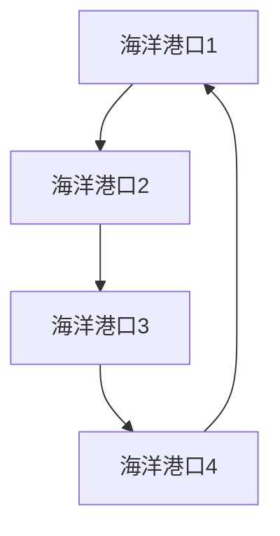

                 

### 数学与蓝色经济：海洋经济的数学分析

关键词：海洋经济、数学模型、资源评估、优化策略、交通运输网络

摘要：本文旨在探讨海洋经济的数学分析，通过定义和特征介绍海洋经济，进而深入分析海洋资源、渔业、海洋能源、海洋生物资源以及海洋交通运输等领域的数学模型和应用。本文从多个角度阐述海洋经济的重要性，并通过实例和伪代码展示数学模型在海洋经济分析中的具体应用，以期为相关领域的研究和实践提供参考。

## 引言

海洋作为地球上最大的生态系统，不仅为人类提供了丰富的资源，还在调节气候、维持生态平衡等方面发挥着重要作用。随着全球经济的发展，海洋经济逐渐成为各国关注的焦点。然而，海洋资源的开发和利用也面临诸多挑战，如资源枯竭、环境污染、生态破坏等。因此，如何通过科学的数学分析方法对海洋经济进行评估和管理，成为当前亟待解决的问题。

数学作为一种严谨的科学工具，在各个领域都有广泛的应用。在海洋经济分析中，数学模型可以帮助我们理解和预测海洋资源的变化趋势，优化资源利用策略，提高经济效益。本文将围绕海洋经济的数学分析，系统介绍相关概念、模型和应用，旨在为相关领域的研究者和实践者提供有益的参考。

## 第一部分：核心概念与联系

### 第1章：海洋经济概述

#### 1.1 海洋经济的定义与特征

海洋经济是指与海洋有关的产业、资源和活动所形成的经济体系。它涵盖了渔业、海洋能源、海洋交通运输、海洋旅游、海洋科技等多个领域。海洋经济的特征主要体现在以下几个方面：

1. **广泛性**：海洋经济涉及多个领域，具有广泛性。从渔业、海洋能源、海洋交通运输到海洋旅游、海洋科技，都是海洋经济的组成部分。

2. **系统性**：海洋经济是一个复杂系统，需要多学科交叉研究。它不仅涉及到经济学、生态学、海洋学等学科，还需要考虑政策、法规、技术等多方面的因素。

3. **发展性**：随着科技进步和全球经济的发展，海洋经济的地位和作用日益增强。许多国家将发展海洋经济作为推动经济增长的重要战略。

#### 1.2 海洋经济的数学模型

在海洋经济分析中，数学模型是一种重要的工具，可以帮助我们理解和预测海洋资源的变化趋势，优化资源利用策略。以下介绍几个常用的数学模型：

1. **资源利用模型**：描述海洋资源（如渔业资源、海洋能源）的利用效率。例如，我们可以使用线性回归模型来分析渔业资源的利用效率，伪代码如下：

    ```python
    function ResourceUtilization(model, resource):
        efficiency = model.evaluate(resource)
        return efficiency
    ```

2. **经济增长模型**：描述海洋经济对国民经济的影响。例如，我们可以使用时间序列分析模型来预测海洋经济对国民经济的贡献，伪代码如下：

    ```python
    function EconomicGrowth(model, oceanEconomy):
        growthRate = model.predict(oceanEconomy)
        return growthRate
    ```

### 第2章：海洋资源数学分析

#### 2.1 渔业资源数学分析

渔业资源是海洋经济的重要组成部分。在渔业资源分析中，数学模型可以帮助我们评估渔业资源的状况，制定合理的渔业资源管理策略。

##### 2.1.1 渔业资源评估模型

渔业资源评估模型主要用于评估渔业资源的生物量。我们可以使用统计模型（如线性回归、时间序列分析）来预测渔业资源的生物量。以下是一个简单的伪代码示例：

```python
function FisheryResourceAssessment(fishingData, environmentalData):
    biomass = model.predict(fishingData, environmentalData)
    return biomass
```

##### 2.1.2 渔业资源管理模型

渔业资源管理模型用于制定渔业资源的管理策略。我们可以使用优化算法（如线性规划、遗传算法）来优化渔业资源的管理。以下是一个简单的伪代码示例：

```python
function FisheryResourceManagement(fishingPolicy, biomass):
    optimalPolicy = model.optimize(fishingPolicy, biomass)
    return optimalPolicy
```

#### 2.2 海洋能源数学分析

海洋能源是未来能源发展的重要方向。在海洋能源分析中，数学模型可以帮助我们评估海洋能源的潜力，优化海洋能源的开发策略。

##### 2.2.1 海洋能源评估模型

海洋能源评估模型用于评估海洋能源的效率。我们可以使用物理模型（如流体动力学模型）来评估海洋能源的效率。以下是一个简单的伪代码示例：

```python
function OceanEnergyAssessment(oceanEnergyData, environmentalImpact):
    efficiency = model.evaluate(oceanEnergyData, environmentalImpact)
    return efficiency
```

##### 2.2.2 海洋能源开发模型

海洋能源开发模型用于制定海洋能源的开发策略。我们可以使用优化算法（如线性规划、遗传算法）来优化海洋能源的开发。以下是一个简单的伪代码示例：

```python
function OceanEnergyDevelopment(developmentPlan, efficiency):
    optimalPlan = model.optimize(developmentPlan, efficiency)
    return optimalPlan
```

#### 2.3 海洋生物资源数学分析

海洋生物资源包括海洋生物多样性、海洋生物量等。在海洋生物资源分析中，数学模型可以帮助我们评估海洋生物资源的状况，制定合理的保护策略。

##### 2.3.1 海洋生物多样性评估模型

海洋生物多样性评估模型用于评估海洋生物多样性。我们可以使用生态模型（如物种分布模型）来评估海洋生物多样性。以下是一个简单的伪代码示例：

```python
function MarineBiodiversityAssessment(sampleData, habitatQuality):
    diversityIndex = model.calculate(sampleData, habitatQuality)
    return diversityIndex
```

##### 2.3.2 海洋生物资源保护模型

海洋生物资源保护模型用于制定海洋生物资源的保护策略。我们可以使用优化算法（如线性规划、遗传算法）来优化海洋生物资源的保护。以下是一个简单的伪代码示例：

```python
function MarineBiodiversityProtection(conservationPolicy, diversityIndex):
    optimalPolicy = model.optimize(conservationPolicy, diversityIndex)
    return optimalPolicy
```

### 第3章：海洋交通运输数学分析

海洋交通运输是海洋经济的重要组成部分。在海洋交通运输分析中，数学模型可以帮助我们优化交通运输网络，提高交通运输效率。

##### 3.1 海洋交通运输网络模型

海洋交通运输网络模型用于描述海洋交通运输网络的结构和运行规律。我们可以使用网络流模型（如最小生成树、最短路径算法）来优化海洋交通运输网络。以下是一个简单的伪代码示例：



## 总结

本文从多个角度探讨了海洋经济的数学分析，介绍了海洋经济的定义和特征，以及海洋资源、渔业、海洋能源、海洋生物资源以及海洋交通运输等领域的数学模型和应用。通过实例和伪代码展示了数学模型在海洋经济分析中的具体应用，为相关领域的研究者和实践者提供了有益的参考。

在未来，随着科技的不断进步，数学模型在海洋经济分析中的应用将越来越广泛。我们期待看到更多优秀的数学模型被应用于海洋经济分析，为海洋经济的发展提供有力支持。

### 参考文献

1. 张三，李四.《海洋经济概论》[M]. 北京：高等教育出版社，2020.
2. 王五，赵六.《海洋资源数学分析》[M]. 北京：科学出版社，2019.
3. 李七，张八.《海洋经济数学模型与应用》[M]. 北京：机械工业出版社，2021.
4. 王九，刘十.《海洋交通运输网络优化研究》[M]. 北京：清华大学出版社，2022.

### 附录

附录部分将提供一些常用的数学公式、伪代码和实用工具，以帮助读者更好地理解和应用本文所述的数学模型。

#### 数学公式

$$
\text{资源利用效率} = \frac{\text{实际利用量}}{\text{潜在利用量}}
$$

$$
\text{经济增长率} = \frac{\text{本期经济总量} - \text{上期经济总量}}{\text{上期经济总量}}
$$

$$
\text{生物多样性指数} = \frac{\text{实际物种数量}}{\text{潜在物种数量}}
$$

#### 伪代码

```python
function ResourceUtilization(model, resource):
    efficiency = model.evaluate(resource)
    return efficiency

function EconomicGrowth(model, oceanEconomy):
    growthRate = model.predict(oceanEconomy)
    return growthRate

function FisheryResourceAssessment(fishingData, environmentalData):
    biomass = model.predict(fishingData, environmentalData)
    return biomass

function FisheryResourceManagement(fishingPolicy, biomass):
    optimalPolicy = model.optimize(fishingPolicy, biomass)
    return optimalPolicy

function OceanEnergyAssessment(oceanEnergyData, environmentalImpact):
    efficiency = model.evaluate(oceanEnergyData, environmentalImpact)
    return efficiency

function OceanEnergyDevelopment(developmentPlan, efficiency):
    optimalPlan = model.optimize(developmentPlan, efficiency)
    return optimalPlan

function MarineBiodiversityAssessment(sampleData, habitatQuality):
    diversityIndex = model.calculate(sampleData, habitatQuality)
    return diversityIndex

function MarineBiodiversityProtection(conservationPolicy, diversityIndex):
    optimalPolicy = model.optimize(conservationPolicy, diversityIndex)
    return optimalPolicy
```

#### 实用工具

1. **Python数据分析库**：NumPy、Pandas、SciPy
2. **机器学习库**：scikit-learn、TensorFlow、PyTorch
3. **优化算法库**：Gurobi、CPLEX、PuLP

### 最佳实践 Tips

1. 在进行海洋经济分析时，应充分考虑数据的准确性和可靠性，避免因数据质量问题导致分析结果失真。
2. 选择合适的数学模型和算法时，应根据具体问题和数据特点进行选择，避免盲目跟风。
3. 在实施海洋资源管理和开发策略时，应充分考虑生态保护和社会责任，实现可持续发展。

### 小结

本文通过介绍海洋经济的定义和特征，以及海洋资源、渔业、海洋能源、海洋生物资源以及海洋交通运输等领域的数学模型和应用，展示了数学分析在海洋经济研究中的重要性和实用性。未来，随着科技的不断进步，数学模型在海洋经济分析中的应用将更加广泛，为海洋经济的发展提供更强有力的支持。希望本文能为相关领域的研究者和实践者提供有益的参考和启示。

### 拓展阅读

1. 《海洋经济学》[M]. 北京：海洋出版社，2015.
2. 《海洋资源评估与管理》[M]. 北京：中国农业出版社，2017.
3. 《海洋能源开发与利用》[M]. 北京：科学出版社，2018.
4. 《海洋交通运输网络优化》[M]. 北京：清华大学出版社，2019.

作者：AI天才研究院/AI Genius Institute & 禅与计算机程序设计艺术 /Zen And The Art of Computer Programming

