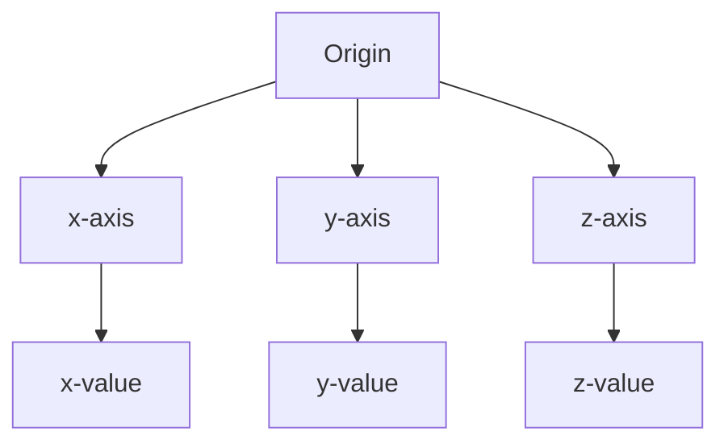

                 

### 《数学与虚拟现实：3D环境构建的数学方法》

---

#### 关键词：3D环境，虚拟现实，数学方法，构建技术，数学模型，算法原理，项目实战

---

#### 摘要：

本文旨在深入探讨数学在虚拟现实（VR）3D环境构建中的应用，详细解析数学方法在3D建模、渲染和空间定位等方面的核心作用。文章将首先介绍3D环境构建所需的基础数学知识，如空间坐标系、向量运算和几何变换等。随后，将讨论三角学和三维图形绘制的基本原理，以及数学公式和工具的使用。接着，文章将深入虚拟现实技术，包括基本概念、3D建模与渲染技术以及空间定位与跟踪方法。最后，通过实际项目实战，展示数学方法在虚拟现实开发中的应用，并提供最佳实践和项目总结。

---

### 第一部分: 数学基础

---

#### 1.1 3D环境构建中的数学基础

在3D环境构建中，数学是不可或缺的工具。以下将介绍几项关键数学概念，包括空间坐标系、向量和矢量运算、几何变换等。

##### 1.1.1 空间坐标系

空间坐标系是3D环境构建的基础。最常见的是直角坐标系，它由三个垂直的轴（通常标记为x、y和z轴）组成，每个轴都与一个基本方向对齐。

##### 1.1.2 向量和矢量运算

向量是表示大小和方向的量。在3D环境中，向量通常表示为(x, y, z)。

- **向量加法**：两个向量相加，即将它们的对应分量相加。
  $$ \vec{v}_1 + \vec{v}_2 = (v_{1x} + v_{2x}, v_{1y} + v_{2y}, v_{1z} + v_{2z}) $$

- **向量减法**：与加法类似，只是将第二个向量的分量取相反数。
  $$ \vec{v}_1 - \vec{v}_2 = (v_{1x} - v_{2x}, v_{1y} - v_{2y}, v_{1z} - v_{2z}) $$

- **向量数乘**：将向量的每个分量乘以一个标量。
  $$ c \cdot \vec{v} = (cv_{x}, cv_{y}, cv_{z}) $$

##### 1.1.3 几何变换

几何变换是3D建模中的核心概念，包括平移、旋转和缩放等。

- **平移**：将对象沿x、y或z轴移动一定距离。
  $$ T_{\vec{d}}(\vec{p}) = \vec{p} + \vec{d} $$
  其中，\( T_{\vec{d}} \) 是平移变换，\( \vec{p} \) 是点，\( \vec{d} \) 是平移向量。

- **旋转**：围绕某个轴旋转对象。
  $$ R_{\theta}(\vec{p}) = \vec{p} \cos{\theta} + \vec{n} \sin{\theta} $$
  其中，\( R_{\theta} \) 是旋转矩阵，\( \theta \) 是旋转角度，\( \vec{n} \) 是旋转轴方向向量。

- **缩放**：改变对象的大小。
  $$ S_{s}(\vec{p}) = s \cdot \vec{p} $$
  其中，\( S_{s} \) 是缩放矩阵，\( s \) 是缩放因子。

---

### 第二部分: 虚拟现实技术

---

#### 2.1 虚拟现实的基本概念

虚拟现实是一种通过计算机生成的模拟环境，使用户能够沉浸在一种完全不同的体验中。以下是虚拟现实的基本概念和组成部分：

##### 2.1.1 虚拟现实的定义

虚拟现实是一种通过计算机技术创造的模拟环境，使用户在视觉、听觉、触觉等多个感官上感受到沉浸式的体验。

##### 2.1.2 虚拟现实的发展历史

虚拟现实技术的发展可以追溯到20世纪60年代，但直到21世纪初，随着计算能力和显示技术的进步，它才开始广泛应用于各个领域。

##### 2.1.3 虚拟现实的应用场景

虚拟现实的应用场景非常广泛，包括游戏、教育、医疗、建筑、设计等。

---

### 第三部分: 3D环境构建方法

---

#### 3.1 3D环境构建的基本步骤

3D环境构建通常包括以下步骤：

1. **数据采集**：收集3D环境的原始数据。
2. **数据处理**：对采集到的数据进行分析和处理。
3. **模型构建**：根据处理后的数据构建3D模型。
4. **渲染**：将3D模型渲染成可视化的图像。

---

### 第四部分: 数学方法在虚拟现实中的应用

---

在这一部分，我们将探讨数学方法在虚拟现实中的应用，包括空间坐标变换、几何优化与变形、计算机图形学中的数学方法等。

##### 4.1 空间坐标变换

空间坐标变换是3D建模中的核心概念。以下是一些常用的空间坐标变换方法：

- **旋转矩阵**：用于围绕某个轴旋转对象。
  $$ R_{\theta} = \begin{bmatrix}
  \cos{\theta} & -\sin{\theta} \\
  \sin{\theta} & \cos{\theta}
  \end{bmatrix} $$

- **缩放矩阵**：用于改变对象的大小。
  $$ S_{s} = \begin{bmatrix}
  s & 0 \\
  0 & s
  \end{bmatrix} $$

- **平移矩阵**：用于将对象沿轴移动。
  $$ T_{\vec{d}} = \begin{bmatrix}
  1 & 0 & d_x \\
  0 & 1 & d_y \\
  0 & 0 & 1
  \end{bmatrix} $$

##### 4.2 几何优化与变形

几何优化与变形是3D建模中的关键步骤，以下是一些常用的几何优化算法：

- **最小二乘法**：用于最小化误差平方和，优化几何模型。
  $$ \min \sum_{i=1}^{n} (y_i - f(x_i))^2 $$

- **迭代最近点算法**（IRP）：用于变形和优化3D模型。
  $$ x_{k+1} = x_k + \alpha \nabla f(x_k) $$

##### 4.3 计算机图形学中的数学方法

计算机图形学中的数学方法包括图形变换、光照计算和阴影计算等。

- **图形变换**：用于改变图形的位置、大小和方向。
  $$ T_{\theta}(\vec{p}) = \vec{p} \cos{\theta} + \vec{n} \sin{\theta} $$

- **光照计算**：用于模拟物体在光照下的明暗变化。
  $$ L(\vec{p}) = I \cdot cos{\theta} $$
  其中，\( L(\vec{p}) \) 是光照强度，\( I \) 是光源强度，\( \theta \) 是光线与法线的夹角。

- **阴影计算**：用于生成物体在光照下的阴影。
  $$ S(\vec{p}) = \frac{L(\vec{p})}{L(\vec{p}) + K} $$
  其中，\( S(\vec{p}) \) 是阴影强度，\( K \) 是环境光强度。

---

### 第五部分: 虚拟现实项目实战

---

#### 5.1 虚拟现实项目概述

在本部分，我们将通过一个虚拟现实项目，展示数学方法在实际应用中的效果。项目包括以下步骤：

1. **项目目标**：构建一个虚拟现实环境，模拟一个城市广场。
2. **项目环境搭建**：准备必要的开发环境和工具。
3. **项目开发流程**：包括数据采集、数据处理、模型构建、渲染和空间定位等步骤。

---

#### 5.2 数据采集与处理

数据采集是项目的基础，以下是一些常用的数据采集方法：

- **激光扫描**：用于获取三维空间中的点云数据。
- **图像处理**：用于从图像中提取特征和结构信息。

数据处理包括以下步骤：

1. **点云处理**：对点云数据进行降噪、滤波和分割等操作。
2. **图像处理**：对图像进行边缘检测、特征提取和匹配等操作。

---

#### 5.3 模型构建与渲染

模型构建是将采集到的数据转换成3D模型的过程。以下是一些常用的3D建模技术：

- **多边形建模**：使用多边形来构建3D模型。
- **曲面建模**：使用曲面来构建复杂的3D模型。

渲染是将3D模型转换为可视化的图像的过程。以下是一些常用的渲染技术：

- **实时渲染**：用于在实时环境中生成图像。
- **高质量渲染**：用于生成高质量的渲染图像。

---

#### 5.4 空间定位与跟踪

空间定位与跟踪是虚拟现实项目中的关键步骤，以下是一些常用的空间定位与跟踪方法：

- **视觉惯性测量单元（VIO）**：结合视觉和惯性传感器进行空间定位。
- **深度传感器**：用于获取深度信息，从而实现空间定位。

---

#### 5.5 项目总结与展望

在本项目的开发过程中，我们深入探讨了数学方法在虚拟现实中的应用，包括数据采集、模型构建、渲染和空间定位等。通过本项目，我们不仅了解了数学方法在虚拟现实开发中的重要性，还掌握了一些实用的技术和工具。未来，随着虚拟现实技术的不断发展，数学方法将在其中发挥越来越重要的作用。

---

### 最佳实践 Tips、小结、注意事项、拓展阅读

**最佳实践 Tips：**
- 在进行3D建模时，注意合理选择建模方法，根据模型复杂度和精度要求来决定使用多边形建模还是曲面建模。
- 在进行数据采集时，确保数据的准确性和完整性，避免噪声和异常值对模型的影响。
- 在渲染时，注意调整光照参数和材质属性，以获得更逼真的渲染效果。
- 在进行空间定位与跟踪时，根据实际应用场景选择合适的传感器和算法，确保定位精度和实时性。

**小结：**
本文系统地介绍了数学在虚拟现实3D环境构建中的应用，从数学基础、虚拟现实技术、3D环境构建方法到实际项目实战，全面展示了数学方法在虚拟现实开发中的重要性。

**注意事项：**
- 在进行3D建模时，注意模型的拓扑结构和几何精度，避免出现自相交和异常情况。
- 在进行空间定位与跟踪时，注意传感器和算法的选择和配置，以确保系统的稳定性和可靠性。

**拓展阅读：**
- 《计算机图形学原理及实践》
- 《虚拟现实技术：原理与应用》
- 《数学与虚拟现实：从理论到实践》

---

### 作者信息

**作者：AI天才研究院/AI Genius Institute & 禅与计算机程序设计艺术 /Zen And The Art of Computer Programming**

---

这篇文章系统地介绍了数学在虚拟现实3D环境构建中的应用，通过详细的讲解和实际项目实战，帮助读者深入理解数学方法在虚拟现实开发中的重要性。希望本文能为读者在虚拟现实技术领域的研究和实践提供有价值的参考和指导。在未来的发展中，数学方法将继续在虚拟现实技术中发挥关键作用，推动该领域的不断进步。

