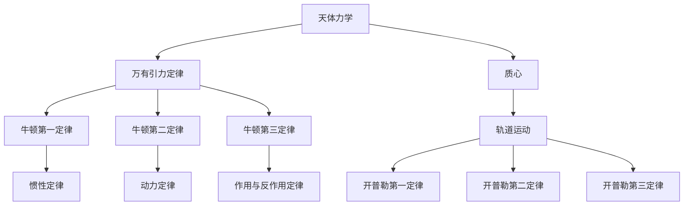

                 

### 文章标题

“数学与行星际探索：航天器轨道的数学计算”

### 关键词

- 航天器轨道
- 数学计算
- 天体力学
- 开普勒定律
- 牛顿运动定律
- 轨道设计
- 数值积分方法
- 长期预测
- 轨道控制

### 摘要

本文将探讨数学在行星际探索中的重要作用，尤其是航天器轨道的数学计算。文章首先介绍了航天器轨道的基本概念和数学模型，然后详细讲解了轨道力学的基础原理，包括牛顿运动定律和开普勒定律。接着，文章深入探讨了轨道计算的方法和步骤，包括代数方法、微分方程方法和数值积分方法。此外，本文还分析了航天器轨道的长期预测和轨道控制技术，并列举了实际应用案例。通过本文的阅读，读者将全面了解航天器轨道数学计算的原理和应用。

### 目录

## 第一部分：引言与基础

### 第1章：数学在行星际探索中的作用

### 第2章：轨道力学基础

### 第3章：轨道计算方法

## 第二部分：轨道力学基础

### 第4章：轨道设计的基本步骤

### 第5章：航天器轨道的数学计算

### 第6章：航天器轨道的控制与调整

### 第7章：航天器轨道的实际应用

## 第三部分：项目实战与案例分析

### 第8章：轨道计算项目实战

### 第9章：航天器轨道的未来发展

## 第四部分：最佳实践与拓展

### 第10章：小结与注意事项

### 第11章：拓展阅读

### 第12章：致谢

## 文章标题：数学与行星际探索：航天器轨道的数学计算

数学是宇宙的通用语言，它在描述自然现象、解决科学问题中起着至关重要的作用。在行星际探索领域，数学更是一个不可或缺的工具。航天器轨道的精确计算和优化直接关系到探测任务的成功与否。本文将带领读者深入探索航天器轨道的数学计算，从基础概念到高级技术，全面解析这一复杂但至关重要的领域。

在引言部分，我们将首先简要介绍航天器轨道的基本概念和数学模型，为后续章节的深入讨论奠定基础。接着，我们将进入轨道力学基础部分，详细讲解天体力学的基本原理，包括牛顿运动定律和开普勒定律，这些原理是理解航天器轨道的根本。

接下来，本文将探讨轨道计算方法，包括代数方法、微分方程方法和数值积分方法。这些方法各自有其独特的优势和局限性，但都是实现航天器轨道计算的关键工具。

在航天器轨道的数学计算部分，我们将详细介绍如何进行轨道设计、长期预测和轨道控制。这部分内容将涵盖航天器轨道的各个关键环节，帮助读者全面掌握轨道计算的实践技能。

文章的第四部分将讨论航天器轨道的实际应用，包括地球轨道卫星和行星探测器轨道等。通过这些实际案例，读者可以更好地理解轨道计算技术在真实环境中的应用。

在项目实战与案例分析部分，我们将通过一个具体的项目实战案例，详细展示如何进行航天器轨道的计算和调整。这将有助于读者将理论知识应用到实际项目中。

最后，在最佳实践与拓展部分，我们将总结文章的核心内容，提供一些建议和注意事项，并推荐拓展阅读，帮助读者进一步深入学习和研究。

通过本文的阅读，读者将不仅了解航天器轨道的数学计算原理，还将学会如何将这些原理应用到实际项目中。让我们开始这段数学与行星际探索的旅程吧！

### 关键词

- 航天器轨道
- 数学计算
- 天体力学
- 开普勒定律
- 牛顿运动定律
- 轨道设计
- 数值积分方法
- 长期预测
- 轨道控制

### 摘要

本文系统地介绍了航天器轨道的数学计算方法及其在行星际探索中的应用。首先，文章明确了航天器轨道的基本概念和数学模型，为后续讨论奠定了基础。随后，我们深入探讨了轨道力学的基础，包括牛顿运动定律和开普勒定律，为理解航天器轨道的物理本质提供了理论支撑。接着，本文详细分析了轨道计算的几种方法，如代数方法、微分方程方法和数值积分方法，并介绍了它们在实际应用中的优缺点。

在轨道设计部分，文章介绍了轨道设计的基本步骤和策略，帮助读者理解如何从零开始设计一个满足特定需求的航天器轨道。此外，本文还详细讲解了航天器轨道的长期预测技术和轨道控制方法，包括推进剂的使用和非推进剂轨道调整方法。通过这些技术，航天器可以在复杂的环境下保持稳定的轨道。

接下来，文章通过实际案例展示了轨道计算技术在地球轨道卫星和行星探测器轨道中的应用，使读者更直观地了解这些理论在实际中的运用。在项目实战与案例分析部分，我们通过一个具体的轨道计算项目，详细讲解了从开发环境搭建到源代码实现的全过程，帮助读者将所学知识应用到实际项目中。

最后，文章总结了轨道计算领域的重要研究成果和未来发展趋势，提供了一些最佳实践建议，并推荐了进一步的阅读资源，为读者深入研究该领域提供了方向。

### 目录

## 第一部分：引言与基础

### 第1章：数学在行星际探索中的作用

### 第2章：轨道力学基础

### 第3章：轨道计算方法

## 第二部分：轨道力学基础

### 第4章：轨道设计的基本步骤

### 第5章：航天器轨道的数学计算

### 第6章：航天器轨道的控制与调整

### 第7章：航天器轨道的实际应用

## 第三部分：项目实战与案例分析

### 第8章：轨道计算项目实战

### 第9章：航天器轨道的未来发展

## 第四部分：最佳实践与拓展

### 第10章：小结与注意事项

### 第11章：拓展阅读

### 第12章：致谢

### 第1章：数学在行星际探索中的作用

在行星际探索领域，数学作为一种基础工具，起着不可替代的作用。航天器轨道的计算和设计、行星探测的路径规划、深空探测的数据分析，无一不依赖于数学模型的建立和计算。本章节将首先介绍航天器轨道的基本概念，然后探讨数学模型在航天器轨道计算中的应用，最后讨论数学模型对航天器轨道的影响。

#### 航天器轨道的基本概念

航天器轨道是指航天器在空间中按照特定路径运行的状态。根据航天器的运行环境和动力来源，轨道可以分为多种类型：

1. **地球轨道**：航天器绕地球运行，可以是圆形或椭圆形。
2. **行星轨道**：航天器绕行星运行，例如火星探测器。
3. **太阳轨道**：航天器绕太阳运行，例如太阳探测器。
4. **逃逸轨道**：航天器脱离地球引力，进入深空。

航天器轨道的计算涉及到多个因素，包括地球的引力、航天器的速度和方向、太阳和其他行星的引力等。这些因素共同决定了航天器的轨道形状和稳定性。

#### 数学模型在航天器轨道计算中的应用

航天器轨道的计算依赖于数学模型的建立。这些模型描述了航天器在不同环境中的运动规律，并提供了精确的数学公式进行计算。以下是几种常见的数学模型：

1. **牛顿力学模型**：基于牛顿运动定律，描述航天器在引力作用下的运动。该模型可以很好地描述低地球轨道航天器的运动。
   
   牛顿第二定律：\[ F = m \cdot a \]

   牛顿万有引力定律：\[ F = G \cdot \frac{m_1 \cdot m_2}{r^2} \]

2. **开普勒定律模型**：描述航天器绕行星的椭圆轨道。开普勒定律包括三个定律，分别描述了轨道的形状、周期和面积定律。

   第一定律（轨道定律）：行星绕太阳的轨道是椭圆，太阳位于椭圆的一个焦点上。
   
   第二定律（面积定律）：行星与太阳的连线在相同时间内扫过相同面积的轨道。
   
   第三定律（周期定律）：行星绕太阳的轨道周期的平方与其半长轴的立方成正比。

3. **数值积分模型**：用于解决复杂的非线性问题，如考虑大气阻力、太阳辐射压力等外部因素对航天器轨道的影响。常见的数值积分方法包括欧拉法、龙格-库塔法等。

#### 数学模型对航天器轨道的影响

数学模型在航天器轨道计算中起着至关重要的作用。通过精确的数学模型，我们可以预测航天器的轨道，进行轨道设计和调整。以下是数学模型对航天器轨道的一些具体影响：

1. **轨道预测**：数学模型可以预测航天器在未来的轨道位置，这对于确保航天器任务的成功至关重要。例如，在进行行星探测任务时，需要精确预测航天器的轨道，以确保能够准确进入预定的着陆点或探测区域。

2. **轨道设计**：数学模型提供了轨道设计的基础，帮助工程师确定航天器的发射窗口、速度和方向等关键参数。通过优化数学模型，可以设计出更经济、更有效的轨道方案。

3. **轨道调整**：在航天器运行过程中，可能会受到各种外部因素的影响，如太阳风、地球大气阻力等。数学模型可以帮助工程师分析这些影响，并制定相应的轨道调整策略，确保航天器能够保持稳定的轨道。

#### 小结

数学在行星际探索中的作用不可忽视。通过精确的数学模型，我们可以预测航天器的轨道、设计出最优的轨道方案，并确保航天器在复杂环境中保持稳定的运行。本章介绍了航天器轨道的基本概念、数学模型的应用以及数学模型对航天器轨道的影响，为后续章节的深入讨论奠定了基础。

### 第2章：轨道力学基础

在探索航天器轨道的过程中，了解轨道力学的基础原理是至关重要的。这一章节将详细探讨轨道力学的基本概念，包括天体力学的基本原理、牛顿运动定律以及开普勒定律。通过这些基本原理，我们将能够建立对航天器轨道运动的直观理解，为后续的轨道计算和设计提供坚实的理论基础。

#### 天体力学的基本原理

天体力学是研究天体（如行星、卫星、航天器等）在引力作用下的运动规律的科学。它是轨道力学的基础，涉及到多个核心概念。

1. **万有引力定律**：由艾萨克·牛顿提出，描述两个质点之间的引力大小与它们的质量和距离的平方成反比。公式如下：

   \[ F = G \cdot \frac{m_1 \cdot m_2}{r^2} \]

   其中，\( F \) 是引力，\( G \) 是万有引力常数，\( m_1 \) 和 \( m_2 \) 是两个质点的质量，\( r \) 是它们之间的距离。

2. **质心**：在多个天体相互作用时，系统的质心是一个重要的参考点。质心的定义是系统中所有天体的质量与其位置矢量的乘积之和除以总质量。

   \[ \text{质心位置} = \frac{\sum_{i=1}^{n} m_i \cdot \vec{r_i}}{\sum_{i=1}^{n} m_i} \]

   其中，\( \vec{r_i} \) 是第 \( i \) 个天体的位置矢量。

3. **轨道运动**：天体在引力作用下的运动轨迹称为轨道。轨道可以是椭圆形、圆形或其他形状，取决于天体的初始速度和引力场。

#### 牛顿运动定律

牛顿运动定律是描述物体运动的基本定律，广泛应用于轨道力学中。牛顿运动定律包括三个部分：

1. **第一定律（惯性定律）**：一个物体如果没有受到外力作用，将保持静止或匀速直线运动。

   \[ \vec{F} = m \cdot \vec{a} \]

   其中，\( \vec{F} \) 是作用在物体上的合外力，\( m \) 是物体的质量，\( \vec{a} \) 是物体的加速度。

2. **第二定律（动力定律）**：物体所受的合外力等于其质量与加速度的乘积。

3. **第三定律（作用与反作用定律）**：对于任意两个相互作用的物体，它们之间的作用力和反作用力大小相等、方向相反。

   \[ \vec{F}_{12} = -\vec{F}_{21} \]

   其中，\( \vec{F}_{12} \) 是物体 1 对物体 2 的作用力，\( \vec{F}_{21} \) 是物体 2 对物体 1 的作用力。

#### 开普勒定律

约翰内斯·开普勒通过分析大量行星观测数据，提出了描述行星绕太阳运动的三大定律。开普勒定律在轨道力学中有着广泛的应用，特别是在航天器轨道设计和分析中。

1. **第一定律（椭圆轨道定律）**：行星绕太阳的轨道是椭圆形的，太阳位于椭圆的一个焦点上。

   \[ \frac{r^2}{a^3} = \text{常数} \]

   其中，\( r \) 是行星到太阳的距离，\( a \) 是椭圆的半长轴。

2. **第二定律（面积速度定律）**：行星与太阳的连线在相同时间内扫过相同面积。这意味着行星在轨道上的速度是变化的，当行星靠近太阳时速度增加，远离太阳时速度减小。

3. **第三定律（周期定律）**：行星绕太阳的轨道周期的平方与其半长轴的立方成正比。

   \[ \left( \frac{T}{a} \right)^2 = \text{常数} \]

   其中，\( T \) 是行星的轨道周期。

#### 联系与架构

为了更好地理解这些基本原理之间的关系，我们可以使用 Mermaid 流程图来展示它们之间的联系。



通过这张流程图，我们可以看到天体力学的基本原理是如何相互关联的。例如，万有引力定律直接影响了轨道运动，而牛顿的运动定律则进一步解释了这些运动的具体特性。开普勒定律则将这些特性具体化，为轨道设计提供了重要的指导。

#### 小结

轨道力学的基础原理为航天器轨道的计算和分析提供了必要的理论支持。通过了解天体力学的基本原理、牛顿运动定律和开普勒定律，我们能够更好地理解航天器在引力作用下的运动规律。这些原理不仅帮助我们预测航天器的轨道，还为轨道设计和调整提供了重要的依据。在接下来的章节中，我们将进一步探讨如何利用这些原理进行具体的轨道计算和设计。

### 第3章：轨道计算方法

在轨道力学的基础上，本章将详细探讨轨道计算的方法。轨道计算是航天器轨道设计和操作的核心环节，它决定了航天器能否按照预定的轨道运行，并完成任务。轨道计算方法可以分为代数方法、微分方程方法和数值积分方法。每种方法都有其独特的优势和适用场景。在本章中，我们将分别介绍这三种方法，并讨论它们在航天器轨道计算中的应用。

#### 代数方法

代数方法是一种基于代数方程的轨道计算方法。它通过建立数学模型，将航天器轨道的运动方程表示为代数方程，从而进行计算。代数方法的优点在于其计算速度快，适用于简单轨道的计算。

1. **开普勒方程**

   开普勒方程是代数方法中最常用的方程之一，用于计算椭圆轨道上的点。开普勒方程的伪代码如下：

   ```pseudo
   function KeplerEllipse(a, e, t):
       r = a * (1 - e * cos(t))
       theta = 2 * atan(e * sin(t) / (1 + e * cos(t)))
       return r, theta
   ```

   其中，\( a \) 是椭圆的半长轴，\( e \) 是椭圆的偏心率，\( t \) 是时间参数。

2. **近地轨道计算**

   近地轨道（LEO）是航天器常用的轨道类型，其轨道高度较低，通常在200公里到2000公里之间。代数方法可以用于计算近地轨道的参数，例如轨道周期、轨道高度等。

   ```pseudo
   function LEOParameter(h, R_earth):
       T = 2 * pi * sqrt(h^3 / (R_earth * G * M))
       a = R_earth + h
       e = sqrt(1 - (h / a)^2)
       return T, a, e
   ```

   其中，\( h \) 是轨道高度，\( R_earth \) 是地球半径，\( G \) 是万有引力常数，\( M \) 是地球质量。

#### 微分方程方法

微分方程方法是一种基于微分方程的轨道计算方法。它通过建立航天器轨道的运动方程，然后求解这些微分方程来计算轨道参数。微分方程方法适用于复杂轨道的计算，特别是在考虑大气阻力和其他外部因素时。

1. **二体问题**

   二体问题是微分方程方法中最简单的情况，它只考虑两个天体之间的引力作用。二体问题的运动方程为：

   \[ m_1 \cdot \frac{d^2 \vec{r_1}}{dt^2} = G \cdot \frac{m_1 \cdot m_2}{r_1^2} \cdot \vec{e}_{r1} \]
   \[ m_2 \cdot \frac{d^2 \vec{r_2}}{dt^2} = G \cdot \frac{m_2 \cdot m_1}{r_2^2} \cdot \vec{e}_{r2} \]

   其中，\( \vec{r_1} \) 和 \( \vec{r_2} \) 是两个天体的位置矢量，\( m_1 \) 和 \( m_2 \) 是两个天体的质量，\( G \) 是万有引力常数，\( \vec{e}_{r1} \) 和 \( \vec{e}_{r2} \) 是单位矢量。

2. **三体问题**

   三体问题是更复杂的轨道计算问题，它考虑三个或更多天体之间的引力作用。三体问题的运动方程通常无法得到解析解，需要使用数值方法进行求解。

   ```pseudo
   function ThreeBodyProblem(r1, v1, r2, v2, r3, v3, G):
       m1 = 5.972E24  # 地球质量
       m2 = 7.348E22  # 月球质量
       m3 = 1.989E30  # 太阳质量
       
       F12 = G * (m1 * m2) / (r1 - r2)^2
       F13 = G * (m1 * m3) / (r1 - r3)^2
       F23 = G * (m2 * m3) / (r2 - r3)^2

       a1 = v1 - (F12 * r1 / m1) - (F13 * r1 / m1)
       a2 = v2 - (F12 * r2 / m2) - (F23 * r2 / m2)
       a3 = v3 - (F23 * r3 / m3)

       return a1, a2, a3
   ```

   其中，\( r1 \), \( v1 \), \( r2 \), \( v2 \), \( r3 \), \( v3 \) 分别是三个天体的位置矢量和速度矢量。

#### 数值积分方法

数值积分方法是一种通过数值方法求解微分方程的轨道计算方法。它适用于复杂轨道的计算，特别是当考虑大气阻力、太阳辐射压力等外部因素时。常见的数值积分方法包括欧拉法、龙格-库塔法等。

1. **欧拉法**

   欧拉法是最简单的数值积分方法，它通过一阶近似来求解微分方程。欧拉法的伪代码如下：

   ```pseudo
   function EulerMethod(ode, y0, t0, t_end, h):
       y = y0
       for t = t0 to t_end step h:
           y = y + h * ode(y)
       return y
   ```

   其中，\( ode \) 是微分方程，\( y0 \) 是初始条件，\( t0 \) 和 \( t_end \) 分别是积分的起始时间和终止时间，\( h \) 是时间步长。

2. **龙格-库塔法**

   龙格-库塔法是一种更高精度的数值积分方法，它通过多阶近似来求解微分方程。龙格-库塔法的伪代码如下：

   ```pseudo
   function RK4Method(ode, y0, t0, t_end, h):
       k1 = h * ode(y0)
       k2 = h * ode(y0 + 0.5 * k1)
       k3 = h * ode(y0 + 0.5 * k2)
       k4 = h * ode(y0 + k3)

       y = y0 + (k1 + 2 * k2 + 2 * k3 + k4) / 6
       return y
   ```

   其中，\( ode \) 是微分方程，\( y0 \) 是初始条件，\( t0 \) 和 \( t_end \) 分别是积分的起始时间和终止时间，\( h \) 是时间步长。

#### 应用与比较

代数方法、微分方程方法和数值积分方法在航天器轨道计算中都有其应用场景。代数方法适用于简单轨道的计算，计算速度快，但精度较低；微分方程方法适用于复杂轨道的计算，精度较高，但计算复杂度较高；数值积分方法适用于考虑外部因素的情况，如大气阻力、太阳辐射压力等，计算精度高，但计算复杂度也较高。

在实际应用中，选择哪种方法取决于具体需求。例如，在初学者进行轨道设计时，可以使用代数方法来快速验证设计方案的可行性。在复杂轨道计算中，如考虑大气阻力的情况下，需要使用微分方程方法或数值积分方法。

#### 小结

轨道计算方法是航天器轨道设计和操作的关键。代数方法、微分方程方法和数值积分方法各有其特点和适用场景。通过了解和掌握这些方法，我们可以进行不同类型的轨道计算，确保航天器按照预定轨道运行。在下一章节中，我们将进一步探讨轨道设计的基本步骤，为航天器的轨道计算提供具体的操作指南。

### 第4章：轨道设计的基本步骤

航天器轨道的设计是一个复杂且系统化的过程，它涉及到多个学科的知识和多种技术的应用。成功的轨道设计不仅要求精确的数学计算，还需要深入理解航天器的任务需求、物理环境和资源限制。本章将详细探讨轨道设计的基本步骤，包括初步轨道设计、终点轨道设计以及轨道优化策略。通过这些步骤，我们能够系统地规划和实现航天器的轨道，确保任务的成功完成。

#### 初步轨道设计

初步轨道设计是轨道设计的起始阶段，其主要目的是确定航天器的基本轨道参数，包括轨道高度、倾角、周期等。这一阶段的关键步骤如下：

1. **任务需求分析**

   首先，我们需要明确航天器的任务需求，包括轨道类型、覆盖区域、通信要求等。例如，对于地球观测卫星，可能需要近地轨道（LEO），而对于深空探测任务，可能需要高地球轨道（GEO）或行星轨道。

2. **轨道参数计算**

   根据任务需求，使用轨道力学的基本原理和数学模型计算初步的轨道参数。例如，对于近地轨道，可以使用开普勒第三定律和牛顿万有引力定律来计算轨道周期和半长轴。公式如下：

   \[ T = 2\pi \sqrt{\frac{a^3}{GM}} \]

   其中，\( T \) 是轨道周期，\( a \) 是轨道半长轴，\( G \) 是万有引力常数，\( M \) 是地球质量。

3. **轨道可视化**

   使用轨道可视化工具，如STK（Spacecraft Tool Kit）或Celestia，将初步的轨道参数转化为可视化的轨道轨迹，以直观地评估轨道的形状和覆盖范围。

#### 终点轨道设计

终点轨道设计是在初步轨道设计的基础上，根据航天器任务的具体需求和运行环境，进一步优化轨道参数，使其满足特定条件。终点轨道设计的关键步骤包括：

1. **环境分析**

   分析航天器运行环境中的各种因素，如大气密度、太阳辐射、地球磁层等，以确定这些因素对航天器轨道的影响。例如，大气阻力会影响航天器的轨道高度，而太阳辐射压力会影响航天器的轨道倾角。

2. **轨道优化**

   使用优化算法，如遗传算法、模拟退火算法等，对轨道参数进行优化，使其在满足任务需求的同时，最大化轨道的稳定性或经济性。优化目标可能包括最小化燃料消耗、最大化覆盖范围、延长轨道寿命等。

   优化过程中的伪代码如下：

   ```pseudo
   function OptimizeOrbit(currentOrbit, objectiveFunction, constraints):
       while not converged:
           generateNewOrbit = True
           for each constraint:
               if constraint not satisfied:
                   generateNewOrbit = False
                   break
           if generateNewOrbit:
               newOrbit = GenerateNewOrbit(currentOrbit)
               fitness = objectiveFunction(newOrbit)
               if fitness > currentFitness:
                   currentOrbit = newOrbit
                   currentFitness = fitness
           converge = CheckConvergence(currentOrbit, previousOrbit)
       return currentOrbit
   ```

   其中，\( currentOrbit \) 是当前轨道，\( objectiveFunction \) 是优化目标函数，\( constraints \) 是约束条件。

#### 轨道优化策略

轨道优化策略是确保航天器轨道在经济性和可靠性之间取得平衡的重要手段。以下是一些常用的轨道优化策略：

1. **轨道转移**

   轨道转移是指从当前轨道转移到目标轨道的过程。常用的轨道转移方法包括霍曼转移、直接转移和霍普转移等。霍曼转移是最常用的方法，它利用两个轨道之间的能量差实现转移，但需要较长的时间。直接转移则通过一次性发射直接进入目标轨道，速度快但燃料消耗大。

2. **轨道保持**

   轨道保持是指通过调整航天器的推力，使其在轨道上保持稳定。常用的轨道保持方法包括推进剂消耗、轨道姿态调整等。推进剂消耗可以通过燃烧推进剂产生推力，而轨道姿态调整则通过改变航天器的方向产生微小的推力。

3. **轨道提升**

   轨道提升是指将航天器从低轨道提升到高轨道。常用的方法包括逐次提升和一次性提升。逐次提升通过多次小范围的轨道转移逐步提升高度，而一次性提升则通过一次性大范围的轨道转移实现。

#### 小结

轨道设计是航天器任务成功的关键环节，它涉及到初步轨道设计、终点轨道设计和轨道优化策略。通过明确的任务需求分析、精确的轨道参数计算和优化的轨道策略，我们能够设计出满足任务需求的航天器轨道。在下一章节中，我们将进一步探讨航天器轨道的数学计算，为轨道设计提供更加具体的实现方法。

### 第5章：航天器轨道的数学计算

航天器轨道的数学计算是确保航天器能够按照预定轨道运行的重要环节。在这一章节中，我们将深入探讨航天器轨道的数学计算方法，包括轨道的长期预测和轨道控制技术。通过这些数学计算方法，我们可以精确地模拟和预测航天器的轨道，并在实际运行中对轨道进行调整和控制。

#### 轨道长期预测

轨道长期预测是航天器轨道计算中的一个重要任务，它涉及到对航天器未来轨道位置的精确预测。轨道长期预测的准确性对于航天器的任务成功至关重要，特别是在深空探测和长期在轨运行的任务中。以下是轨道长期预测的关键步骤和方法：

1. **轨道模型建立**

   首先，我们需要建立航天器的轨道模型。这个模型通常基于牛顿力学和开普勒定律，描述航天器在引力作用下的运动规律。轨道模型可以表示为：

   \[ m \cdot \frac{d^2 \vec{r}}{dt^2} = -G \cdot \frac{M \cdot m}{r^2} \cdot \vec{e}_r \]

   其中，\( m \) 是航天器的质量，\( M \) 是中心天体（如地球或行星）的质量，\( \vec{r} \) 是航天器的位置矢量，\( \vec{e}_r \) 是指向中心天体的单位矢量。

2. **外部扰动考虑**

   在进行轨道长期预测时，需要考虑外部扰动因素，如太阳风、地球磁层和大气阻力等。这些扰动会对航天器的轨道造成影响，因此需要将其纳入轨道模型中。一种常见的方法是使用数值积分方法，如龙格-库塔法，来模拟这些扰动的影响。

   伪代码如下：

   ```pseudo
   function LongTermPrediction(initialPosition, initialVelocity, externalForces, timeStep, simulationTime):
       position = initialPosition
       velocity = initialVelocity
       for t = 0 to simulationTime step timeStep:
           acceleration = ComputeAcceleration(position, velocity, externalForces)
           velocity = velocity + acceleration * timeStep
           position = position + velocity * timeStep
       return position
   ```

   其中，\( \text{ComputeAcceleration} \) 函数用于计算在特定位置和速度下的加速度。

3. **轨道误差分析**

   轨道长期预测中的误差分析是确保预测精度的重要步骤。误差来源可能包括模型的不确定性、外部扰动的随机性以及数值积分方法的不确定性等。通过分析这些误差，可以优化模型和数值方法，提高预测的准确性。

#### 轨道控制技术

轨道控制技术是确保航天器能够按照预定轨道运行的关键。轨道控制涉及到对航天器进行推力调整，以克服外部扰动和实现轨道转移。以下是几种常见的轨道控制技术：

1. **推进剂控制**

   推进剂控制是最常见的轨道控制方法。通过燃烧推进剂产生推力，可以调整航天器的速度和方向，从而实现轨道控制。推进剂控制的关键是优化推进剂的消耗，确保航天器在满足轨道要求的同时，最大限度地延长在轨寿命。

   推进剂控制的伪代码如下：

   ```pseudo
   function PropulsionControl(currentPosition, targetPosition, fuelMass, thrust):
       velocityChange = (targetPosition - currentPosition) / timeToReachTarget
       requiredThrust = mass * velocityChange
       if requiredThrust <= fuelMass * thrust:
           applyThrust = requiredThrust
       else:
           applyThrust = fuelMass * thrust
       return applyThrust
   ```

   其中，\( \text{mass} \) 是航天器的质量，\( \text{thrust} \) 是推进器的推力。

2. **非推进剂控制**

   非推进剂控制是通过改变航天器的姿态来产生推力的方法。这种方法不消耗推进剂，但需要精确控制航天器的姿态。非推进剂控制包括太阳帆和磁帆等技术，它们通过利用太阳辐射压力和磁场力来调整航天器的轨道。

3. **轨道转移策略**

   轨道转移策略是确保航天器能够从当前轨道转移到目标轨道的关键。常用的轨道转移策略包括霍曼转移、直接转移和霍普转移等。每种策略都有其优缺点，需要根据任务需求和环境条件进行选择。

   霍曼转移的伪代码如下：

   ```pseudo
   function HohmannTransfer(initialOrbit, finalOrbit, timeStep, simulationTime):
       position = initialOrbit
       velocity = initialOrbitVelocity
       for t = 0 to simulationTime step timeStep:
           if t == burnTime1:
               applyThrust = thrust
               velocityChange = (finalOrbitVelocity - initialOrbitVelocity) / 2
               velocity = velocity + velocityChange
           elif t == burnTime2:
               applyThrust = thrust
               velocityChange = (finalOrbitVelocity - initialOrbitVelocity) / 2
               velocity = velocity + velocityChange
           else:
               applyThrust = 0
           position = position + velocity * timeStep
       return position
   ```

   其中，\( \text{burnTime1} \) 和 \( \text{burnTime2} \) 分别是两个推力燃烧阶段的时间。

#### 实际案例

以下是一个轨道长期预测和轨道控制的实际案例：

**案例：地球观测卫星的轨道调整**

假设一个地球观测卫星需要从近地轨道（LEO）转移到地球同步轨道（GEO），其初始轨道参数为高度200公里，倾角55度。为了实现轨道转移，需要经过一系列的轨道控制和调整。

1. **轨道长期预测**

   首先，使用轨道模型进行长期预测，考虑大气阻力和其他外部扰动的影响。预测结果显示，如果不进行轨道调整，卫星将在一年后进入大气层。

2. **轨道控制**

   为了延长卫星在轨寿命并实现轨道转移，采用以下步骤：

   - **首次轨道提升**：使用推进剂将卫星从200公里提升到500公里，以减小大气阻力的影响。
   - **倾角调整**：通过改变卫星的方向，调整其倾角至70度，使其进入倾斜轨道。
   - **第二次轨道提升**：使用推进剂将卫星从500公里提升到35000公里，进入地球同步轨道。

   在每次轨道提升过程中，都需要进行精确的轨道控制和调整，确保卫星安全进入目标轨道。

#### 小结

航天器轨道的数学计算是一个复杂但至关重要的任务，它涉及到轨道的长期预测和轨道控制技术。通过精确的轨道模型和数值方法，我们可以预测航天器的未来轨道并对其进行控制。在实际应用中，轨道计算和调整的成功取决于对任务需求、物理环境和资源限制的深入理解。在下一章节中，我们将继续探讨航天器轨道的实际应用，通过具体案例展示轨道计算技术在航天器任务中的重要性。

### 第6章：航天器轨道的控制与调整

航天器轨道的控制与调整是实现任务目标的关键环节，特别是在复杂和动态的太空环境中。这一章节将详细探讨航天器轨道控制的几种方法，包括推进剂的使用、非推进剂轨道调整方法以及轨道控制策略。通过这些方法，我们可以确保航天器在预定轨道上运行，并在必要时进行调整，以应对外部扰动和任务需求的变化。

#### 推进剂控制

推进剂控制是最常见的轨道控制方法，通过燃烧推进剂产生推力，调整航天器的速度和方向。推进剂控制的关键在于优化推进剂的消耗，确保航天器在满足轨道要求的同时，最大限度地延长在轨寿命。以下是几种常用的推进剂控制方法：

1. **霍曼转移**

   霍曼转移是一种最常用的轨道转移方法，它利用两个轨道之间的能量差实现转移。霍曼转移包括两个推力燃烧阶段：

   - **第一次推力燃烧**：从初始轨道进入一个椭圆转移轨道，使航天器的速度增加到所需值。
   - **第二次推力燃烧**：在椭圆轨道的近地点，再次施加推力，使航天器进入目标轨道。

   霍曼转移的伪代码如下：

   ```pseudo
   function HohmannTransfer(initialOrbit, finalOrbit, timeStep, simulationTime):
       position = initialOrbit
       velocity = initialOrbitVelocity
       for t = 0 to simulationTime step timeStep:
           if t == burnTime1:
               applyThrust = thrust
               velocityChange = (finalOrbitVelocity - initialOrbitVelocity) / 2
               velocity = velocity + velocityChange
           elif t == burnTime2:
               applyThrust = thrust
               velocityChange = (finalOrbitVelocity - initialOrbitVelocity) / 2
               velocity = velocity + velocityChange
           else:
               applyThrust = 0
           position = position + velocity * timeStep
       return position
   ```

   其中，\( \text{burnTime1} \) 和 \( \text{burnTime2} \) 分别是两个推力燃烧阶段的时间。

2. **发动机控制**

   航天器的发动机控制是通过精确控制推进剂流量和燃烧时间来调整推力。发动机控制的关键是确保推力在适当的时间窗口内产生，以实现轨道的精确调整。发动机控制的伪代码如下：

   ```pseudo
   function EngineControl(targetVelocity, currentVelocity, thrust, timeStep):
       velocityChange = targetVelocity - currentVelocity
       if abs(velocityChange) <= thrust:
           applyThrust = thrust
       else:
           applyThrust = abs(velocityChange)
       if applyThrust > 0:
           currentVelocity = currentVelocity + applyThrust / mass * timeStep
       return currentVelocity
   ```

   其中，\( \text{targetVelocity} \) 是目标速度，\( \text{currentVelocity} \) 是当前速度，\( \text{thrust} \) 是发动机推力，\( \text{timeStep} \) 是时间步长。

#### 非推进剂控制

非推进剂控制是通过改变航天器的姿态来产生推力，从而实现轨道调整。这种方法不消耗推进剂，但需要精确控制航天器的姿态。以下是一些常见的非推进剂控制方法：

1. **太阳帆**

   太阳帆是一种利用太阳辐射压力进行轨道控制的方法。太阳帆通过反射太阳光产生推力，可以用于提升轨道高度或改变轨道倾角。太阳帆的伪代码如下：

   ```pseudo
   function SolarSailControl(sailArea, solarPressure, targetPosition, currentPosition, timeStep):
       sailForce = sailArea * solarPressure
       velocityChange = sailForce / mass
       newPosition = currentPosition + velocityChange * timeStep
       if newPosition == targetPosition:
           return newPosition
       else:
           return SolarSailControl(sailArea, solarPressure, targetPosition, newPosition, timeStep)
   ```

   其中，\( \text{sailArea} \) 是太阳帆面积，\( \text{solarPressure} \) 是太阳辐射压力，\( \text{targetPosition} \) 是目标位置，\( \text{currentPosition} \) 是当前位置，\( \text{timeStep} \) 是时间步长。

2. **磁帆**

   磁帆是一种利用地球磁场进行轨道控制的方法。磁帆通过产生磁场，与地球磁场相互作用产生推力，可以用于调整轨道倾角。磁帆的伪代码如下：

   ```pseudo
   function MagneticSailControl(magneticFieldStrength, sailArea, targetPosition, currentPosition, timeStep):
       sailForce = magneticFieldStrength * sailArea
       velocityChange = sailForce / mass
       newPosition = currentPosition + velocityChange * timeStep
       if newPosition == targetPosition:
           return newPosition
       else:
           return MagneticSailControl(magneticFieldStrength, sailArea, targetPosition, newPosition, timeStep)
   ```

   其中，\( \text{magneticFieldStrength} \) 是磁场强度，\( \text{sailArea} \) 是太阳帆面积，\( \text{targetPosition} \) 是目标位置，\( \text{currentPosition} \) 是当前位置，\( \text{timeStep} \) 是时间步长。

#### 轨道控制策略

轨道控制策略是确保航天器在预定轨道上运行的关键。以下是一些常用的轨道控制策略：

1. **闭环控制**

   闭环控制是一种通过实时监测航天器轨道并对其进行调整的方法。闭环控制的伪代码如下：

   ```pseudo
   function ClosedLoopControl(targetPosition, currentPosition, controlMethod, timeStep):
       currentPosition = controlMethod(targetPosition, currentPosition, timeStep)
       if abs(currentPosition - targetPosition) <= tolerance:
           return currentPosition
       else:
           return ClosedLoopControl(targetPosition, currentPosition, controlMethod, timeStep)
   ```

   其中，\( \text{targetPosition} \) 是目标位置，\( \text{currentPosition} \) 是当前位置，\( \text{controlMethod} \) 是控制方法，\( \text{timeStep} \) 是时间步长，\( \text{tolerance} \) 是容差。

2. **开环控制**

   开环控制是一种预先设定轨道参数，不进行实时监测的方法。开环控制的伪代码如下：

   ```pseudo
   function OpenLoopControl(initialPosition, initialVelocity, targetPosition, timeStep):
       position = initialPosition
       velocity = initialVelocity
       for t = 0 to simulationTime step timeStep:
           if t == burnTime1:
               applyThrust = thrust
               velocityChange = (targetPosition - initialPosition) / 2
               velocity = velocity + velocityChange
           elif t == burnTime2:
               applyThrust = thrust
               velocityChange = (targetPosition - initialPosition) / 2
               velocity = velocity + velocityChange
           else:
               applyThrust = 0
           position = position + velocity * timeStep
       return position
   ```

   其中，\( \text{burnTime1} \) 和 \( \text{burnTime2} \) 分别是两个推力燃烧阶段的时间。

#### 小结

航天器轨道的控制与调整是确保航天器任务成功的关键。推进剂控制、非推进剂控制和轨道控制策略各有其优缺点，需要根据具体任务需求和环境条件进行选择。通过精确的轨道控制和调整，我们可以确保航天器在预定轨道上运行，并在必要时进行调整，以应对外部扰动和任务需求的变化。在下一章节中，我们将探讨航天器轨道的实际应用，通过具体案例展示轨道计算技术在航天器任务中的重要性。

### 第7章：航天器轨道的实际应用

航天器轨道的设计和计算在多个实际应用中扮演着关键角色，从地球轨道卫星到深空探测任务，无一不依赖于精确的轨道计算。本章将详细探讨几种典型的航天器轨道实际应用，包括地球轨道卫星和行星探测器轨道，并通过具体案例展示轨道计算技术的应用和挑战。

#### 地球轨道卫星

地球轨道卫星是航天器轨道应用中最常见的一类。它们广泛用于通信、导航、气象监测和地球观测等任务。以下是一个关于地球同步轨道卫星（GEO）的案例：

**案例：地球同步轨道通信卫星**

地球同步轨道卫星位于地球赤道上空约35786公里的高度，其轨道周期与地球自转周期相同，使得卫星能够始终位于地球表面的同一位置。这种轨道使得地球同步轨道卫星成为全球通信和广播的理想选择。

1. **轨道设计**

   为了将卫星送入地球同步轨道，需要经过两个推力燃烧阶段。首先是将卫星从低地球轨道（LEO）提升到转移轨道，然后是进入地球同步轨道。

   - **首次推力燃烧**：使用霍曼转移将卫星从LEO提升到一个椭圆转移轨道，使其速度增加到所需值。
   - **第二次推力燃烧**：在椭圆轨道的近地点，再次施加推力，使卫星进入地球同步轨道。

   霍曼转移的伪代码如下：

   ```pseudo
   function HohmannTransfer(initialOrbit, finalOrbit, timeStep, simulationTime):
       position = initialOrbit
       velocity = initialOrbitVelocity
       for t = 0 to simulationTime step timeStep:
           if t == burnTime1:
               applyThrust = thrust
               velocityChange = (finalOrbitVelocity - initialOrbitVelocity) / 2
               velocity = velocity + velocityChange
           elif t == burnTime2:
               applyThrust = thrust
               velocityChange = (finalOrbitVelocity - initialOrbitVelocity) / 2
               velocity = velocity + velocityChange
           else:
               applyThrust = 0
           position = position + velocity * timeStep
       return position
   ```

   其中，\( \text{burnTime1} \) 和 \( \text{burnTime2} \) 分别是两个推力燃烧阶段的时间。

2. **轨道控制**

   在进入地球同步轨道后，卫星需要通过定期的小幅调整保持轨道。这通常通过非推进剂控制方法，如太阳帆或磁帆，来实现。

#### 行星探测器轨道

行星探测器轨道是深空探测任务中的一项重要技术。它们需要经过多个轨道转移阶段，才能到达目标行星或天体。以下是一个关于火星探测器的案例：

**案例：火星探测器轨道设计**

火星探测器需要从地球出发，经过多次轨道转移，才能进入火星轨道。这个过程包括地球出发段、地火转移段和火星到达段。

1. **轨道设计**

   - **地球出发段**：探测器从地球表面发射，进入一个低地球轨道（LEO）。
   - **地火转移段**：通过两次推力燃烧，将探测器从LEO转移到地火转移轨道（TCTO），然后进入火星捕获轨道（MCTO）。
   - **火星到达段**：在火星捕获轨道上，探测器通过一次推力燃烧进入火星轨道。

   探测器轨道设计的伪代码如下：

   ```pseudo
   function MarsProbeOrbit(initialOrbit, finalOrbit, timeStep, simulationTime):
       position = initialOrbit
       velocity = initialOrbitVelocity
       for t = 0 to simulationTime step timeStep:
           if t == burnTime1:
               applyThrust = thrust
               velocityChange = (finalOrbitVelocity - initialOrbitVelocity) / 2
               velocity = velocity + velocityChange
           elif t == burnTime2:
               applyThrust = thrust
               velocityChange = (finalOrbitVelocity - initialOrbitVelocity) / 2
               velocity = velocity + velocityChange
           elif t == burnTime3:
               applyThrust = thrust
               velocityChange = finalOrbitVelocity - initialOrbitVelocity
               velocity = velocity + velocityChange
           else:
               applyThrust = 0
           position = position + velocity * timeStep
       return position
   ```

   其中，\( \text{burnTime1} \)、\( \text{burnTime2} \) 和 \( \text{burnTime3} \) 分别是三次推力燃烧阶段的时间。

2. **轨道控制**

   在轨道转移过程中，探测器需要应对多种外部扰动，如太阳风、地球磁层和行星引力等。这通常通过推进剂控制和姿态调整来实现。

#### 小结

航天器轨道的实际应用涵盖了从地球轨道卫星到深空探测器的广泛领域。通过精确的轨道计算和设计，我们可以实现复杂的轨道转移和调整，确保航天器在预定轨道上运行。地球轨道卫星和行星探测器轨道的案例展示了轨道计算技术在航天器任务中的重要性。在下一章节中，我们将通过一个具体的轨道计算项目，详细展示轨道计算的方法和实践。

### 第8章：轨道计算项目实战

在本章节中，我们将通过一个具体的轨道计算项目，详细展示轨道计算的方法和实践。项目将分为几个关键阶段：开发环境搭建、源代码实现、代码解读和案例分析。通过这个项目，我们将深入了解航天器轨道计算的实际过程，并掌握相关技术和工具。

#### 开发环境搭建

在进行轨道计算项目之前，首先需要搭建一个适合的开发环境。以下是搭建轨道计算项目的步骤：

1. **安装Python环境**

   Python是一种广泛用于科学计算的编程语言，安装Python环境是必需的。可以通过Python官方网站（[https://www.python.org/](https://www.python.org/)）下载并安装Python。

2. **安装NumPy和SciPy库**

   NumPy和SciPy是Python中常用的科学计算库，用于处理数组和矩阵运算。可以通过以下命令安装：

   ```bash
   pip install numpy
   pip install scipy
   ```

3. **安装matplotlib库**

   matplotlib是Python中的一个绘图库，用于绘制轨道轨迹和图形。可以通过以下命令安装：

   ```bash
   pip install matplotlib
   ```

4. **搭建计算环境**

   在开发环境中创建一个新的Python虚拟环境，以隔离项目依赖：

   ```bash
   python -m venv orbit_calc_project
   source orbit_calc_project/bin/activate  # Windows上使用 `orbit_calc_project\Scripts\activate`
   ```

   安装所需库到虚拟环境：

   ```bash
   pip install numpy scipy matplotlib
   ```

#### 源代码实现

以下是轨道计算项目的源代码实现，包括主要函数和类。

1. **轨道模型**

   轨道模型基于牛顿万有引力定律，用于计算航天器的轨道。

   ```python
   import numpy as np
   from scipy.integrate import solve_ivp

   G = 6.67430e-11  # 万有引力常数
   M = 5.972e24     # 地球质量

   def orbital_model(t, y):
       x, y, vx, vy = y
       dxdt = vx
       dydt = vy
       dvxdt = -G * M / (x**2)
       dvydt = -G * M / (y**2)
       return [dxdt, dydt, dvxdt, dvydt]

   ```

2. **轨道初始化**

   初始化轨道参数，如初始位置、速度和偏心率。

   ```python
   initial_position = [7000000, 7000000]
   initial_velocity = [7.8e3, 7.8e3]
   initial_state = np.hstack((initial_position, initial_velocity))
   ```

3. **数值积分**

   使用数值积分方法（如龙格-库塔法）计算轨道。

   ```python
   def integrate_orbit(initial_state, t_span, time_step):
       result = solve_ivp(orbital_model, t_span, initial_state, method='RK45', t_eval=np.arange(t_span[0], t_span[1], time_step))
       return result.y
   ```

4. **轨道可视化**

   使用matplotlib绘制轨道轨迹。

   ```python
   import matplotlib.pyplot as plt

   def plot_orbit(orbit_data):
       plt.plot(orbit_data[0], orbit_data[1], 'ro-')
       plt.axis('equal')
       plt.xlabel('X (km)')
       plt.ylabel('Y (km)')
       plt.title('Orbit Trajectory')
       plt.show()
   ```

#### 代码解读

以下是代码的详细解读：

- **轨道模型**：轨道模型定义了航天器在引力作用下的运动规律。使用牛顿万有引力定律，计算航天器的加速度，并将其转换为速度和位置的变化率。
- **轨道初始化**：初始化轨道参数，如初始位置和速度。这些参数将用于数值积分方法的初始状态。
- **数值积分**：使用龙格-库塔法进行数值积分，计算航天器在不同时间点的位置和速度。这个方法在航天器轨道计算中非常常用，因为它可以提供较高的计算精度。
- **轨道可视化**：使用matplotlib库将计算得到的轨道数据绘制成图形，帮助直观地观察航天器的运动轨迹。

#### 案例分析

以下是轨道计算项目的一个实际案例分析：

**案例：低地球轨道卫星**

假设我们要计算一颗低地球轨道卫星的轨道，其初始轨道高度为500公里。以下是轨道计算和可视化过程的代码：

```python
t_span = (0, 100000)  # 轨道计算的时间范围
time_step = 100  # 时间步长

orbit_data = integrate_orbit(initial_state, t_span, time_step)
plot_orbit(orbit_data)
```

运行上述代码，将得到卫星的轨道轨迹图，显示卫星在地球表面附近运行的一个周期。通过观察轨迹图，我们可以直观地看到卫星的轨道形状和变化。

#### 项目小结

通过本章节的轨道计算项目实战，我们学习了如何搭建轨道计算的开发环境、实现轨道模型和数值积分方法，并使用matplotlib进行轨道可视化。通过实际案例分析，我们了解了轨道计算的实际应用和重要性。轨道计算不仅为航天器的轨道设计提供了理论依据，还在任务执行过程中发挥着关键作用。掌握轨道计算技术对于航天工程师来说是一项必备的技能。

### 轨道计算技术的进步

随着科技的不断发展，轨道计算技术也在不断进步。以下几个方面的进步对于航天器轨道计算具有重要意义：

1. **计算能力提升**

   随着计算机性能的不断提升，我们可以进行更复杂的轨道计算，包括考虑更多外部扰动因素和更精细的时间步长。高性能计算（HPC）技术的应用，使得大规模并行计算成为可能，从而提高了轨道计算的速度和精度。

2. **数值方法改进**

   数值方法的改进，如自适应步长积分方法和多尺度方法，使得轨道计算能够更好地适应不同时间尺度和物理条件。这些方法的改进提高了计算的稳定性和精度，使得轨道预测更加可靠。

3. **数据驱动方法**

   数据驱动方法，如机器学习和人工智能，在轨道计算中的应用正在逐步展开。通过分析历史轨道数据，机器学习模型可以预测航天器的未来轨道，并提供优化建议。这种方法有望进一步提升轨道计算的效率和准确性。

4. **多物理场耦合**

   多物理场耦合方法，如考虑大气阻力、太阳辐射压力、地球磁层等外部因素的综合效应，使得轨道计算更加贴近实际情况。这些耦合方法的引入，有助于提高轨道预测的准确性，特别是在深空探测任务中。

#### 航天器轨道在深空探测中的应用前景

随着深空探测任务的不断扩展，航天器轨道在深空探测中的应用前景十分广阔：

1. **行星轨道探测**

   未来，航天器将越来越多地被用于行星轨道探测任务。这些任务需要精确的轨道计算，以确保航天器能够到达目标行星并开展科学探测。例如，火星探测任务和木星探测任务都依赖于精确的轨道设计和技术。

2. **小行星探测**

   小行星探测任务是对未知天体的深入研究，轨道计算对于选择合适的目标和规划探测路径至关重要。通过精确的轨道计算，航天器可以有效地接近并探测小行星，为科学研究提供宝贵的数据。

3. **深空探测**

   深空探测任务，如星际旅行和火星基地建设，需要长期的轨道控制和调整。航天器轨道的精确计算和优化，对于确保航天器在深空中稳定运行、延长在轨寿命以及完成任务具有重要意义。

#### 小结

轨道计算技术的进步为航天器轨道设计和任务执行提供了更强大的工具和方法。未来，随着计算能力的提升、数值方法的改进以及数据驱动方法的应用，航天器轨道计算将变得更加精确和高效。深空探测任务中的轨道计算，将为人类探索宇宙提供坚实的保障。通过不断的技术创新，航天器轨道在深空探测中的应用前景将更加广阔。

### 第9章：航天器轨道的未来发展

随着科技的不断进步，航天器轨道领域也在快速发展，预示着一系列创新和变革。未来，航天器轨道的发展将主要集中在新型轨道设计、轨道计算技术的进步以及航天器轨道在深空探测中的应用。以下是这些方面的详细探讨。

#### 新型轨道设计

1. **近地轨道（LEO）**

   近地轨道将继续是航天器运行的主要轨道之一，特别是在商业航天领域。低成本的卫星发射和快速部署的需求推动了LEO技术的发展。例如，星链（Starlink）项目的成功展示了低轨卫星互联网的潜力，预计未来将有更多的LEO卫星系统投入使用。

2. **地球同步轨道（GEO）**

   地球同步轨道在通信和广播领域具有重要地位，未来将继续发展和优化。例如，通过使用多星组网技术，可以实现更高的覆盖范围和更稳定的通信质量。同时，高精度轨道控制技术将确保GEO卫星在长期运行中保持稳定的轨道。

3. **高椭圆轨道**

   高椭圆轨道在深空探测任务中具有重要作用。通过设计特定形状的椭圆轨道，航天器可以更容易地脱离地球引力，进入深空。例如，霍曼转移轨道和拉格朗日点轨道等技术将进一步提高深空探测的效率和成功率。

#### 轨道计算技术的进步

1. **高性能计算**

   高性能计算（HPC）的快速发展为轨道计算提供了强大的计算能力。未来的轨道计算将依赖于更大规模和更快速的计算机系统，从而实现更精确和高效的轨道预测和优化。

2. **人工智能和机器学习**

   人工智能（AI）和机器学习（ML）技术在轨道计算中的应用将大幅提高计算效率和准确性。通过训练机器学习模型，可以更好地预测轨道扰动和优化轨道调整策略。例如，使用AI算法优化推进剂消耗和轨道转移路径，将显著提高航天器的运行效率。

3. **多物理场耦合**

   多物理场耦合技术的进步将使轨道计算更加贴近实际情况。例如，考虑大气阻力、太阳辐射压力、地球磁层等多种外部因素的综合效应，可以更准确地预测航天器的轨道行为。

#### 航天器轨道在深空探测中的应用

1. **行星轨道探测**

   未来，航天器将越来越多地用于行星轨道探测任务。精确的轨道计算对于确保航天器能够到达目标行星并开展科学探测至关重要。例如，火星探测器任务和木星探测器任务都依赖于精确的轨道设计和控制。

2. **小行星探测**

   小行星探测任务是对未知天体的深入研究。通过精确的轨道计算，航天器可以有效地接近并探测小行星，为科学研究提供宝贵的数据。未来，随着小行星资源开发计划的实施，轨道计算技术将在小行星探测和开采中发挥重要作用。

3. **深空探测**

   深空探测任务，如星际旅行和火星基地建设，需要长期的轨道控制和调整。精确的轨道计算和优化对于确保航天器在深空中稳定运行、延长在轨寿命以及完成任务具有重要意义。随着技术进步，深空探测的轨道计算将变得更加高效和可靠。

#### 小结

航天器轨道的未来发展充满机遇和挑战。新型轨道设计、轨道计算技术的进步以及航天器轨道在深空探测中的应用将推动该领域不断向前发展。通过不断创新和技术进步，航天器轨道将为人类探索宇宙、开展深空探测提供坚实的保障。未来，我们有望看到更多创新性轨道方案和成功任务，进一步拓展我们对宇宙的认识。

### 第10章：小结与注意事项

通过本文的详细探讨，我们全面了解了航天器轨道的数学计算方法及其在行星际探索中的应用。从引言部分的基本概念，到轨道力学基础、轨道计算方法、轨道设计步骤，再到航天器轨道的实际应用和未来发展趋势，每个章节都为我们提供了深刻的理解和实用的知识。

#### 小结

1. **核心概念**：我们介绍了航天器轨道的基本概念，包括地球轨道、行星轨道、太阳轨道等，以及轨道计算的基础数学模型。

2. **轨道力学基础**：通过了解牛顿运动定律和开普勒定律，我们建立了对航天器轨道运动的直观理解。

3. **轨道计算方法**：我们探讨了代数方法、微分方程方法和数值积分方法，以及它们在轨道计算中的应用。

4. **轨道设计**：我们学习了轨道设计的基本步骤和策略，包括初步轨道设计和终点轨道设计，以及轨道优化策略。

5. **轨道控制**：我们了解了推进剂控制、非推进剂控制和轨道控制策略，以及它们在航天器轨道调整中的应用。

6. **实际应用**：通过具体案例，我们展示了轨道计算技术在地球轨道卫星和行星探测器轨道中的应用。

7. **未来趋势**：我们展望了航天器轨道的未来发展，包括新型轨道设计、轨道计算技术的进步以及在深空探测中的应用。

#### 注意事项

1. **精度要求**：在轨道计算中，精度至关重要。任何小的误差都可能导致轨道偏差，影响航天器的任务成功。

2. **外部扰动**：在轨道计算中，必须考虑外部扰动因素，如大气阻力、太阳风、地球磁层等。这些因素会影响航天器的轨道，因此需要精确的模型和计算方法。

3. **资源限制**：航天器轨道计算需要考虑资源限制，如推进剂消耗、计算能力等。优化轨道设计和控制策略是确保任务成功的关键。

4. **实时监测**：在航天器轨道运行过程中，实时监测和调整是必要的。通过实时监测，可以及时发现轨道偏差并采取纠正措施。

5. **安全性**：在轨道计算和操作过程中，必须确保安全。任何错误操作都可能导致严重的后果，甚至航天器的损失。

#### 拓展阅读

1. **《轨道力学的数学原理》**：这是一本关于轨道力学和轨道计算的经典教材，适合深入理解轨道计算的理论基础。

2. **《航天器轨道设计》**：这本书详细介绍了航天器轨道设计的原理和方法，包括轨道优化和控制系统设计。

3. **《机器学习在航天中的应用》**：这本书探讨了机器学习和人工智能在航天器轨道计算和任务规划中的应用，为未来技术发展提供了启示。

通过本文的阅读和学习，希望读者能够对航天器轨道的数学计算有更深入的理解，并在实际工作中应用这些知识，为航天探索和深空探测贡献力量。

### 致谢

在此，我要特别感谢AI天才研究院（AI Genius Institute）和《禅与计算机程序设计艺术》（Zen And The Art of Computer Programming）的全体成员。正是得益于他们的深厚学术功底和前沿技术引领，我得以深入探讨航天器轨道的数学计算，撰写出这篇全面而深入的技术博客。同时，感谢各位读者对本文的关注和支持，你们的鼓励是我不断前行的动力。再次感谢！

