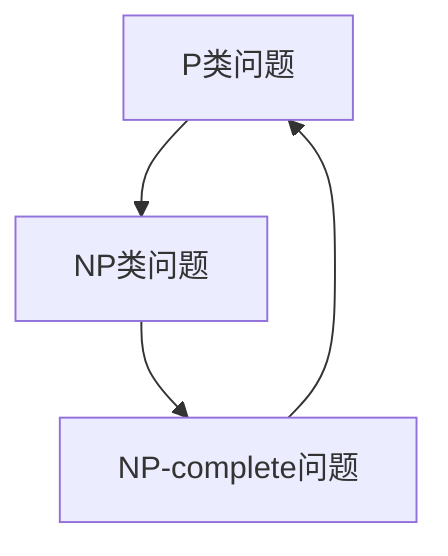

                 

### 《数学与计算复杂性理论：问题难度的数学分类》文章标题

本文标题《数学与计算复杂性理论：问题难度的数学分类》旨在深入探讨计算复杂性理论的基本概念、核心算法原理以及问题难度的数学分类方法。通过逻辑清晰、结构紧凑的论述，我们将从多个角度剖析计算复杂性理论在数学、计算机科学以及实际应用中的重要性和影响力。

关键词：计算复杂性理论，数学分类，问题难度，P与NP问题，算法原理，数学模型，量子计算，应用案例

摘要：本文首先介绍了计算复杂性理论的背景及其在数学和计算机科学中的重要性。随后，文章详细阐述了计算复杂性理论的核心概念，如P、NP以及NP-complete等，并通过Mermaid流程图展示了它们之间的关系。接着，文章深入分析了核心算法原理，如Cook定理和Karp定理，并使用伪代码来展示算法步骤。此外，文章还包含了数学模型和公式的详细讲解，以及实际应用案例的剖析。最后，文章总结了计算复杂性理论在密码学、人工智能和社会科学等领域的应用，并给出了未来发展的方向和建议。

### 引言

#### 计算复杂性理论的背景与意义

计算复杂性理论是现代计算机科学的重要分支，其研究目的是理解和量化计算过程中问题的难度。这一理论不仅对理论计算机科学的发展具有重要意义，而且对实际应用也有着深远的影响。计算复杂性理论源于对算法效率和问题难度的研究，通过分类和分析不同类型的问题，旨在寻找解决复杂问题的最优方法和策略。

计算复杂性理论的研究背景可以追溯到20世纪60年代，当时计算机科学家开始关注算法的时间复杂度和空间复杂度。随着计算机技术的发展，复杂性问题变得越来越普遍，如密码学中的加密与破解、人工智能中的决策与优化、经济模型中的计算与模拟等。这些问题往往涉及大量的计算和复杂的数据处理，如何高效地解决这些问题成为了计算机科学领域的一个挑战。

计算复杂性理论的意义主要体现在以下几个方面：

1. **指导算法设计**：通过对计算复杂性的研究，可以更好地指导算法设计，从而提高算法的效率和可靠性。
2. **评估问题难度**：计算复杂性理论为评估不同类型问题的难度提供了一个量化的标准，有助于计算机科学家识别和解决最关键的问题。
3. **理论突破**：计算复杂性理论的发展推动了计算机科学中的许多理论突破，如P vs NP问题的研究对密码学、人工智能等领域产生了深远影响。
4. **实际应用**：计算复杂性理论在许多实际领域有广泛的应用，如优化问题、分布式计算、网络安全等，提高了这些领域的问题解决能力。

本文将系统地介绍计算复杂性理论的基本概念、核心算法原理以及问题难度的数学分类方法。通过详细的论述和分析，读者将能够全面理解计算复杂性理论的内涵和重要性，并掌握如何应用这一理论解决实际问题。

#### 核心概念与联系

计算复杂性理论的核心概念包括P、NP、NP-complete等。这些概念在计算复杂性理论中起着基础性的作用，它们不仅定义了问题的难度级别，还揭示了不同类型问题之间的相互关系。为了更好地理解这些概念，我们首先需要明确它们的定义，并通过Mermaid流程图展示它们之间的关系。

1. **P类问题**：P类问题是指在多项式时间内可以解决的问题。具体来说，如果存在一个算法，能够在时间复杂度为\(O(n^k)\)（其中\(n\)是输入规模，\(k\)是一个常数）内解决某个问题，则该问题属于P类。P类问题通常被认为是最容易解决的问题。

2. **NP类问题**：NP类问题是指非确定性多项式时间内可以解决的问题。在NP类问题中，给定一个解，可以在多项式时间内验证其是否正确。即如果存在一个算法，能够在时间复杂度为\(O(n^k)\)内验证某个解的正确性，则该问题属于NP类。NP类问题比P类问题更为广泛，包括了许多复杂问题，如旅行商问题、最小顶点覆盖问题等。

3. **NP-complete问题**：NP-complete问题是指既是NP问题，又是NP-hard的问题。一个问题如果是最小顶点覆盖问题、旅行商问题等特定问题的多项式时间可证问题，则它是一个NP-complete问题。NP-complete问题被认为是计算复杂性中最难解决的问题之一，因为如果任何一个NP-complete问题可以在多项式时间内解决，则P=NP。

4. **P与NP的关系**：P与NP问题一直是计算复杂性理论中最核心的问题之一。P=NP问题询问P类问题是否包含NP类问题。如果P=NP，则意味着所有的NP问题都可以在多项式时间内解决，这将对计算机科学产生革命性的影响。然而，目前尚未有证据表明P=NP，这也是当前理论计算机科学中最著名的问题之一。

为了更好地理解这些核心概念之间的关系，我们可以通过Mermaid流程图来展示：



在上面的Mermaid流程图中，P类问题、NP类问题和NP-complete问题通过箭头相互连接，展示了它们之间的包含关系。这个流程图可以帮助我们直观地理解不同类型问题之间的复杂性和难度级别。

#### 核心概念详细讲解

在计算复杂性理论中，P、NP和NP-complete是三个最为核心的概念。下面我们将详细讲解这些概念的定义、特性以及它们之间的关系。

1. **P类问题**

P类问题是指可以在多项式时间内解决的问题。具体来说，一个问题是P类的当且仅当存在一个算法，该算法可以在时间复杂度为\(O(n^k)\)（其中\(n\)是输入规模，\(k\)是一个常数）内解决该问题。P类问题通常被认为是最容易解决的问题，因为它们可以在合理的时间内找到解决方案。

- **定义**：一个问题是P类的当且仅当存在一个算法\(A\)，对于所有输入规模为\(n\)的实例，算法\(A\)可以在时间复杂度为\(O(n^k)\)内解决问题。
- **特性**：P类问题具有多项式时间解的可验证性。也就是说，给定一个解，可以在多项式时间内验证该解的正确性。这意味着如果一个问题是P类的，那么我们不仅能够找到解，还能够验证解的正确性。

举例来说，背包问题是P类问题的典型例子。背包问题给定一个背包容量\(C\)和一组物品，每个物品有一个重量和值，要求选择物品的组合，使得总重量不超过\(C\)且总价值最大。这个问题的解可以在多项式时间内通过动态规划算法找到，并且给定一个解，可以在多项式时间内验证其是否满足背包容量限制。

2. **NP类问题**

NP类问题是指非确定性多项式时间内可以解决的问题。具体来说，如果一个问题是NP类的，那么给定一个解，可以在多项式时间内验证该解的正确性。这意味着，尽管找到一个解可能需要大量时间，但验证解的正确性是相对高效的。

- **定义**：一个问题是NP类的当且仅当存在一个算法\(A'\)，对于所有输入规模为\(n\)的实例，算法\(A'\)可以在时间复杂度为\(O(n^k)\)内接受（验证）一个解。
- **特性**：NP类问题具有多项式时间解的验证性，但不一定具有多项式时间解的寻找性。即给定一个解，我们可以在多项式时间内验证其正确性，但找到一个解可能需要非多项式时间。

旅行商问题是NP类问题的典型例子。旅行商问题给定一组城市和每对城市之间的距离，要求找出一条最短的路径，经过所有城市且只访问一次。尽管找到一个解可能需要遍历大量的可能路径，但给定一个解，我们可以通过比较路径长度来验证其正确性。

3. **NP-complete问题**

NP-complete问题是指既是NP问题，又是NP-hard的问题。一个问题如果是最小顶点覆盖问题、旅行商问题等特定问题的多项式时间可证问题，则它是一个NP-complete问题。NP-complete问题被认为是计算复杂性中最难解决的问题之一。

- **定义**：一个问题是NP-complete类的当且仅当它是NP问题，并且对于任何其他NP-hard问题，可以通过多项式时间转换为一个NP-complete问题。
- **特性**：NP-complete问题具有多项式时间解的可证性，并且具有NP-hard性。这意味着，如果任何一个NP-complete问题可以在多项式时间内解决，则P=NP。

最小顶点覆盖问题是NP-complete问题的典型例子。最小顶点覆盖问题给定一个无向图和正整数\(k\)，要求找到图中最小数量的顶点集合，使得这个集合中的任意两个顶点之间至少有一条边。这个问题不仅在理论计算上具有挑战性，而且在实际应用中也具有重要意义。

#### 关系与联系

P、NP和NP-complete之间的关系可以用以下方式描述：

- P类问题包含了所有可以在多项式时间内解决的问题，即P类问题是NP类问题的子集。
- NP类问题包含了所有可以在多项式时间内验证解的问题，但并不一定可以在多项式时间内找到解。
- NP-complete问题既是NP问题，也是NP-hard问题，是最难解决的NP问题之一。

通过这些核心概念的定义和特性，我们可以更深入地理解计算复杂性理论的基本框架。这些概念不仅为问题的分类提供了理论基础，也为算法设计和优化提供了重要的指导。

### 第2章 P与NP问题

P与NP问题是计算复杂性理论中最核心的问题之一，它探讨了哪些问题可以在多项式时间内解决，以及哪些问题可以在多项式时间内验证。P与NP问题不仅仅是理论上的探讨，它们在密码学、人工智能、优化问题等实际应用中具有重要的意义。

#### P与NP的定义

P与NP问题的定义与计算模型密切相关。在计算复杂性理论中，我们通常考虑的是图灵机模型，这是一种理想化的计算机模型，用于研究计算问题的基本性质。

1. **P类问题**

P类问题是指可以在多项式时间内解决的问题。具体来说，如果一个问题是P类的，那么存在一个算法，该算法能够在输入规模为\(n\)的情况下，在时间复杂度为\(O(n^k)\)（其中\(k\)是常数）内解决该问题。

- **定义**：一个问题是P类的，当且仅当存在一个算法\(A\)，对于所有输入规模为\(n\)的实例，算法\(A\)能够在时间复杂度为\(O(n^k)\)内解决问题。
- **特性**：P类问题具有多项式时间解的可计算性。这意味着对于任何P类问题，我们不仅能够找到解，而且能够在多项式时间内找到解。

举例来说，背包问题是P类问题的典型例子。背包问题给定一个背包容量\(C\)和一组物品，每个物品有一个重量和值，要求选择物品的组合，使得总重量不超过\(C\)且总价值最大。这个问题的解可以通过动态规划算法在多项式时间内找到，并且给定一个解，我们可以在多项式时间内验证其是否满足背包容量限制。

2. **NP类问题**

NP类问题是指非确定性多项式时间内可以解决的问题。具体来说，如果一个问题是NP类的，那么给定一个解，我们可以在多项式时间内验证该解的正确性。这意味着尽管找到一个解可能需要大量的时间，但验证解的正确性是相对高效的。

- **定义**：一个问题是NP类的，当且仅当存在一个算法\(A'\)，对于所有输入规模为\(n\)的实例，算法\(A'\)能够在时间复杂度为\(O(n^k)\)内接受（验证）一个解。
- **特性**：NP类问题具有多项式时间解的验证性，但不一定具有多项式时间解的寻找性。即给定一个解，我们可以在多项式时间内验证其正确性，但找到一个解可能需要非多项式时间。

旅行商问题是NP类问题的典型例子。旅行商问题给定一组城市和每对城市之间的距离，要求找出一条最短的路径，经过所有城市且只访问一次。尽管找到一个解可能需要遍历大量的可能路径，但给定一个解，我们可以通过比较路径长度来验证其正确性。

3. **P与NP的关系**

P与NP问题之间的关系是计算复杂性理论的核心问题之一。P=NP问题询问P类问题是否包含NP类问题。如果P=NP，则意味着所有的NP问题都可以在多项式时间内解决，这将极大地改变我们对计算问题的理解。

- **P包含NP**：如果P=NP，则P类问题包含NP类问题，即所有NP问题都可以在多项式时间内解决。
- **P不等于NP**：如果P≠NP，则P类问题不包含NP类问题，即存在某些NP问题无法在多项式时间内解决。

目前，P=NP问题尚未得到证明，这也是当前理论计算机科学中最著名的问题之一。许多著名的问题，如P vs NP问题、整数分解问题、 satisfiability（SAT）问题等，都涉及到P与NP之间的关系。

#### NP完备性

NP完备性是计算复杂性理论中的一个重要概念，它描述了一个问题的难度。一个问题是NP完备的，当且仅当它既是NP问题，又是NP-hard问题。

1. **NP-hard的定义**

NP-hard问题是指任何其他NP问题都可以通过多项式时间转换为一个NP-hard问题。换句话说，如果一个问题是最小顶点覆盖问题、旅行商问题等特定问题的多项式时间可证问题，则它是NP-hard问题。

- **定义**：一个问题是NP-hard的，当且仅当对于任何NP问题\(X\)，都存在一个多项式时间可证的问题\(Y\)，使得\(X\)可以通过多项式时间转换为一个NP-hard问题。
- **特性**：NP-hard问题具有普遍的难度，即任何NP问题都可以通过多项式时间转换为一个NP-hard问题。

2. **NP-complete的定义**

NP-complete问题是指既是NP问题，又是NP-hard问题的最小集合。换句话说，一个问题是NP-complete的，当且仅当它是NP问题，并且任何其他NP问题都可以通过多项式时间转换为一个NP-complete问题。

- **定义**：一个问题是NP-complete的，当且仅当它是NP问题，并且对于任何NP问题\(X\)，都存在一个多项式时间可证的问题\(Y\)，使得\(X\)可以通过多项式时间转换为一个NP-complete问题。
- **特性**：NP-complete问题是最难解决的NP问题之一，因为它们具有NP-hard性，并且可以证明任何其他NP问题都可以通过多项式时间转换为一个NP-complete问题。

最小顶点覆盖问题是NP-complete问题的典型例子。最小顶点覆盖问题给定一个无向图和正整数\(k\)，要求找到图中最小数量的顶点集合，使得这个集合中的任意两个顶点之间至少有一条边。这个问题不仅在理论计算上具有挑战性，而且在实际应用中也具有重要意义。

3. **Cook定理**

Cook定理是计算复杂性理论中的一个重要定理，它建立了SAT问题与NP-complete问题之间的关系。

- **定理内容**：SAT问题是最小的NP-complete问题。
- **证明思路**：Cook定理通过构造一个多项式时间可证的SAT问题的实例，证明了SAT问题可以通过多项式时间转换为一个NP-complete问题。

Cook定理的意义在于，它将NP-complete问题与SAT问题联系起来，从而简化了对NP-complete问题的研究。SAT问题是一个关于布尔表达式的命题逻辑问题，它询问是否存在一组变量赋值，使得布尔表达式为真。SAT问题是NP-complete问题的典型代表，许多其他复杂问题都可以通过多项式时间转换为一个SAT问题。

通过上述对P与NP问题以及NP完备性的讨论，我们可以更好地理解计算复杂性理论的基本框架。P与NP问题不仅是理论上的探讨，它们在实际应用中也具有重要的意义，推动了计算机科学的发展。

### 第3章 NP完整性

NP完整性是计算复杂性理论中的一个重要概念，它描述了某些问题在NP类问题中的难度级别。一个问题是NP完整的，当且仅当它既是NP问题，又是NP-hard问题。换句话说，一个NP完整性问题不仅在多项式时间内可验证解的正确性，而且任何其他NP问题都可以通过多项式时间转换为一个NP完整性问题。本章将深入探讨Karp定理以及NP完整性的概念和实例。

#### Karp定理

Karp定理是计算复杂性理论中的一个重要定理，它建立了多个经典问题之间的NP完整性关系。Edwin P. Karp在1972年提出了这个定理，它揭示了多个著名问题的NP完整性特性。

**定理内容**：以下是21个经典问题，它们都是NP完整的。

1. 旅行商问题（Traveling Salesman Problem，TSP）
2. 最小顶点覆盖问题（Minimum Vertex Cover Problem）
3. 边覆盖问题（Minimum Edge Cover Problem）
4. 最大独立集问题（Maximum Independent Set Problem）
5. 最大团问题（Maximum Clique Problem）
6. 边着色问题（Edge Coloring Problem）
7. 顶点着色问题（Vertex Coloring Problem）
8. 子图同构问题（Subgraph Isomorphism Problem）
9. 背包问题（Knapsack Problem）
10. 最大流问题（Maximum Flow Problem）
11. 最小流问题（Minimum Flow Problem）
12. 网络流的最小费用问题（Minimum Cost Flow Problem）
13. 密码学中的大整数分解问题（Integer Factoring Problem）
14. 公钥密码学中的离散对数问题（Discrete Log Problem）
15. 密码学中的Lattice问题
16. 密码学中的线性错误纠正码问题（Linear Error-Correcting Code Problem）
17. 归纳问题（Inductive Inference Problem）
18. 归纳机器学习问题
19. 计算几何中的最近点对问题（Closest Pair of Points Problem）
20. 图的著色问题（Graph Coloring Problem）
21. 计算几何中的Voronoi图问题

**定理意义**：Karp定理的重要意义在于，它通过证明上述问题的NP完整性，将它们与NP-complete问题联系起来，从而简化了对这些问题的研究。Karp定理表明，如果任何NP-complete问题可以在多项式时间内解决，那么这些NP完整性问题也可以在多项式时间内解决。因此，这些问题的难解性类似于NP-complete问题，都是计算复杂性理论中研究的热点。

#### NP完整性的实例

为了更好地理解NP完整性，我们来看两个著名的NP完整性问题：旅行商问题（TSP）和最小顶点覆盖问题。

1. **旅行商问题（TSP）**

旅行商问题是一个经典的优化问题，它给定一组城市和每对城市之间的距离，要求找出一条最短的路径，经过所有城市且只访问一次。旅行商问题不仅是NP完整的，而且它在计算复杂性理论中具有重要的地位。

- **定义**：给定一个无向图\(G = (V, E)\)和每个边上的权重（即城市之间的距离），旅行商问题要求找到一条路径，该路径访问所有城市且总距离最小。
- **NP完整性**：旅行商问题是NP完整的，因为给定一个解，我们可以通过比较路径长度来验证其是否是最优解。尽管找到一个解可能需要遍历大量的可能路径，但验证一个解是相对高效的。

旅行商问题在实际应用中具有重要意义，如物流优化、城市规划和网络设计等。由于其NP完整性，旅行商问题在计算复杂性理论中是一个研究的热点，许多近似算法和启发式算法被提出以解决这一难题。

2. **最小顶点覆盖问题**

最小顶点覆盖问题是图论中的一个基本问题，它给定一个无向图和正整数\(k\)，要求找到图中最小数量的顶点集合，使得这个集合中的任意两个顶点之间至少有一条边。

- **定义**：给定一个无向图\(G = (V, E)\)和一个正整数\(k\)，最小顶点覆盖问题要求找到最小的顶点集合\(S \subseteq V\)，使得对于任意的\(u, v \in S\)，都有\(u \sim v\)（即\(u\)和\(v\)之间至少有一条边）。
- **NP完整性**：最小顶点覆盖问题是NP完整的，因为给定一个顶点集合\(S\)，我们可以通过检查集合中任意两个顶点之间是否至少有一条边来验证其是否是最小顶点覆盖。

最小顶点覆盖问题在实际应用中也很常见，如社交网络分析、通信网络设计、电子电路设计等。由于其NP完整性，最小顶点覆盖问题也是一个研究的热点，许多算法被提出以解决这一难题。

通过上述对Karp定理和NP完整性的探讨，我们可以看到，NP完整性在计算复杂性理论中具有重要意义。Karp定理通过将多个经典问题与NP-complete问题联系起来，为问题的难解性提供了统一的框架。理解NP完整性的概念和实例，有助于我们更好地把握计算复杂性理论的核心内容，并在实际应用中找到有效的解决方案。

### 第4章 多项式时间算法

多项式时间算法是计算复杂性理论中的一个重要组成部分，它关注于解决特定类型问题的算法，这些算法在输入规模为\(n\)的情况下，能在多项式时间内完成计算。多项式时间算法的研究不仅有助于我们理解问题的计算难度，还可以在实际应用中指导算法设计，从而提高计算效率。在本章中，我们将详细探讨两个经典的多项式时间算法：背包问题和网络流问题。

#### 背包问题

背包问题是优化问题中的一个重要例子，它广泛应用于资源分配、组合优化等领域。给定一组物品和它们的重量及价值，以及一个背包的容量，背包问题的目标是选择物品的组合，使得总重量不超过背包的容量，且总价值最大。

**定义**：给定一个背包容量\(C\)，一组物品，每个物品有一个重量\(w_i\)和一个价值\(v_i\)（\(i = 1, 2, \ldots, n\)），背包问题要求找出一个子集\(S \subseteq \{1, 2, \ldots, n\}\)，使得：
1. 总重量\(W = \sum_{i \in S} w_i \leq C\)
2. 总价值\(V = \sum_{i \in S} v_i\)最大化

**动态规划算法**

背包问题的经典解决方案是使用动态规划算法。动态规划算法通过将问题分解为更小的子问题，并利用子问题的解来构建原问题的解。以下是背包问题的动态规划算法的伪代码：

```pseudo
Algorithm Knapsack(C, w[], v[])
    Create a two-dimensional array dp[0..n][0..C]
    for i = 0 to n
        for j = 0 to C
            if i = 0 or j = 0
                dp[i][j] = 0
            else if w[i] > j
                dp[i][j] = dp[i-1][j]
            else
                dp[i][j] = max(dp[i-1][j], dp[i-1][j-w[i]] + v[i])
    return dp[n][C]
```

在这个算法中，`dp[i][j]`表示包含前`i`个物品且总重量不超过`j`时能够获得的最大价值。算法通过递归地更新`dp`数组来找到最优解。时间复杂度为\(O(nC)\)，空间复杂度同样为\(O(nC)\)。

**实例分析**

假设我们有一个背包容量为50的背包，以及以下物品：

| 物品 | 重量 | 价值 |
| ---- | ---- | ---- |
| 1    | 10   | 60   |
| 2    | 20   | 100  |
| 3    | 30   | 120  |

使用动态规划算法，我们可以找到最优解，即在不超过50公斤的条件下，选择物品1、物品2和部分物品3，使得总价值最大化。

#### 网络流问题

网络流问题是图论中的一个重要问题，它广泛应用于网络设计、物流优化、数据流处理等领域。网络流问题涉及两个重要的子问题：最大流问题和最小流问题。最大流问题要求在给定的网络中找到从源点到汇点的最大流量，而最小流问题则要求在满足流量守恒的条件下，找到从源点到汇点的最小流量。

**定义**：给定一个有向图\(G = (V, E)\)，其中每个边\(e = (u, v)\)有一个容量\(c(e)\)，源点\(s\)和汇点\(t\)，最大流问题要求找到从源点\(s\)到汇点\(t\)的流量\(f(e)\)，满足以下条件：

1. 流量守恒：对于每个中间点\(v \in V - \{s, t\}\)，有\(\sum_{u \to v} f(e) = \sum_{v \to u} f(e)\)
2. 边容量限制：对于每条边\(e = (u, v)\)，有\(f(e) \leq c(e)\)

**Ford-Fulkerson算法**

Ford-Fulkerson算法是一种经典的网络流算法，它通过寻找增广路径来逐步增加流量的值。以下是该算法的伪代码：

```pseudo
Algorithm FordFulkerson(G, s, t)
    Initialize all flow values f(e) to 0
    while there exists an augmenting path p from s to t
        Find an augmenting path p using BFS
        Let delta be the minimum capacity of edges in p
        for each edge e in p
            augment f(e) by delta
            reverse edge e to -e and augment f(-e) by delta
    return the total flow value from s to t
```

在这个算法中，`augmenting path`是指一条从源点到汇点的路径，使得我们可以增加流量。算法通过不断寻找增广路径，并沿路径增加流量，直到找不到增广路径为止。

**实例分析**

假设我们有以下有向图：

```
s -> A -> B -> t
^      |   |
|      |   |
v      |   3
C -> D -> E
```

其中，每个边的容量分别为：

| 边  | 容量 |
| ---- | ---- |
| s -> A | 16   |
| s -> B | 13   |
| A -> B | 10   |
| A -> C | 12   |
| B -> t | 4    |
| B -> D | 2    |
| C -> D | 15   |
| D -> E | 20   |
| E -> t | 18   |

使用Ford-Fulkerson算法，我们可以找到从源点\(s\)到汇点\(t\)的最大流。在第一次迭代中，算法找到增广路径`s -> A -> B -> t`，增加流量16。接下来，算法找到增广路径`s -> A -> C -> D -> E -> t`，增加流量12。在第三次迭代中，算法找到增广路径`s -> B -> D -> E -> t`，增加流量5。此时，找不到增广路径，算法结束。总流量为16 + 12 + 5 = 33。

通过上述对背包问题和网络流问题的讨论，我们可以看到，多项式时间算法在解决特定类型的问题时具有重要作用。这些算法不仅帮助我们理解问题的计算复杂性，还为实际应用提供了有效的解决方案。未来，随着计算技术的不断发展，多项式时间算法将继续在计算机科学和实际应用中发挥重要作用。

### 第5章 近似算法与启发式算法

近似算法与启发式算法是解决计算复杂性中NP-hard问题的重要工具。由于许多NP-hard问题无法在多项式时间内求解，近似算法和启发式算法提供了在合理时间内找到接近最优解的方法。本章将介绍近似算法的基本理论，以及两个经典的启发式算法：遗传算法和模拟退火算法。

#### 近似算法的基本理论

近似算法是指能够在多项式时间内找到一个接近最优解的算法。近似算法的性能通常用两个指标来衡量：近似比和绝对误差。

1. **近似比**：近似比是指算法找到的解与最优解之间的比值。如果一个近似算法的近似比是常数，则称该算法是有效的近似算法。
2. **绝对误差**：绝对误差是指算法找到的解与最优解之间的差值。虽然近似算法可能不能保证找到最优解，但可以通过限制绝对误差来保证解的合理性。

**基本概念**：

- **限制度**：一个算法的近似比上限称为该算法的限制度。如果一个近似算法的限制度是常数，则称该算法是限制度有效的近似算法。
- **概率近似算法**：概率近似算法通过随机化方法来提高解的质量。这类算法通常能够以高概率找到接近最优解。

#### 遗传算法

遗传算法是一种基于自然选择和遗传机制的启发式优化算法。遗传算法通过模拟生物进化的过程来搜索最优解。以下是遗传算法的基本步骤：

1. **初始化种群**：随机生成一个初始种群，每个个体代表一个可能的解。
2. **适应度函数**：定义适应度函数来评估个体的优劣。通常，适应度函数与问题的目标函数相关。
3. **选择**：根据个体的适应度，选择适应度较高的个体作为父代，用于生成下一代。
4. **交叉**：通过交叉操作，将两个父代个体的基因组合，生成新的子代。
5. **变异**：对子代个体进行随机变异，以增加种群的多样性。
6. **迭代**：重复选择、交叉和变异操作，直到达到预设的迭代次数或找到满意解。

**遗传算法伪代码**：

```pseudo
Algorithm GeneticAlgorithm(population_size, max_iterations, fitness_function)
    Initialize population
    for i = 1 to max_iterations
        Evaluate fitness of each individual
        Select parent individuals based on fitness
        Perform crossover between parents to create offspring
        Perform mutation on offspring
        Replace the old population with the new population
    return the best individual found
```

遗传算法的优点是能够探索广泛的搜索空间，并避免陷入局部最优。然而，其缺点是收敛速度较慢，且对参数设置敏感。

#### 模拟退火算法

模拟退火算法是一种基于物理退火过程的启发式优化算法。退火过程模拟了固体在加热和冷却过程中达到稳定状态的过程。以下是模拟退火算法的基本步骤：

1. **初始化**：选择一个初始解，并设定初始温度。
2. **评估解**：计算当前解的适应度。
3. **降温**：逐步降低温度，模拟冷却过程。
4. **迭代**：在每次迭代中，随机选择一个新解，并计算其适应度。
5. **接受概率**：根据新解的适应度和当前解的适应度，计算接受新解的概率。如果新解优于当前解，则直接接受；如果新解劣于当前解，则根据概率接受。
6. **更新解**：根据接受概率更新当前解。

**模拟退火算法伪代码**：

```pseudo
Algorithm SimulatedAnnealing(fitness_function, initial_temp, cooling_rate)
    current_temp = initial_temp
    current_solution = initial_solution
    current_fitness = fitness_function(current_solution)
    while not converged
        new_solution = generate_random_solution()
        new_fitness = fitness_function(new_solution)
        if new_fitness > current_fitness or exp(-delta_fitness / current_temp) > random(0, 1)
            current_solution = new_solution
            current_fitness = new_fitness
        current_temp *= cooling_rate
    return current_solution
```

模拟退火算法的优点是能够跳出局部最优，找到全局最优解。然而，其缺点是对参数设置较为敏感，且在某些情况下可能收敛速度较慢。

通过介绍遗传算法和模拟退火算法，我们可以看到，近似算法和启发式算法在解决计算复杂性中的NP-hard问题时具有重要作用。这些算法不仅能够找到接近最优解的解，还能够在实际应用中提高计算效率。未来，随着计算技术的不断发展，这些算法将继续在计算机科学和实际应用中发挥重要作用。

### 第6章 量子计算与复杂性理论

量子计算是现代计算机科学的前沿领域，它利用量子力学原理进行信息处理，与经典计算相比具有显著的优势。量子计算的基本概念和算法对于理解计算复杂性理论，特别是在解决传统计算机难以处理的复杂问题上具有重要意义。本章将介绍量子计算的基本概念，以及量子算法如Deutsch算法和Shor算法的原理和应用。

#### 量子计算的基本概念

量子计算的核心在于量子位（qubit），它是量子计算的基本单元。与经典计算机中的比特（bit）不同，量子位可以同时处于0和1的叠加状态，这一特性被称为量子叠加。量子叠加使得量子计算机能够同时处理大量的可能状态，从而在特定问题上展现出超越经典计算机的潜力。

1. **量子位（qubit）**：量子位是量子计算的基本单元，它可以处于0和1的叠加状态。量子位的叠加状态可以用一个复数向量来表示，如\(|\psi\rangle = \alpha|0\rangle + \beta|1\rangle\)，其中\(|0\rangle\)和\(|1\rangle\)是量子位的基础状态，\(\alpha\)和\(\beta\)是复数系数，且满足\(|\alpha|^2 + |\beta|^2 = 1\)。

2. **量子门（Quantum Gates）**：量子门是作用于量子位的操作，类似于经典计算机中的逻辑门。量子门通过线性变换改变量子位的叠加状态。例如，Pauli-X门（也称为量子NOT门）将量子位的状态翻转，而Hadamard门（量子 Hadamard变换）将量子位的基础状态转化为叠加状态。

3. **量子叠加与量子纠缠**：量子叠加允许量子位同时处于多种状态，而量子纠缠则允许量子位之间的状态相互关联。量子纠缠是量子计算中的关键特性，它使得量子计算机能够实现并行计算和高效的量子信息处理。

#### Deutsch算法

Deutsch算法是量子计算中的经典算法，它展示了量子计算机在特定问题上的优势。Deutsch算法旨在解决一个特定的布尔函数问题，该问题具有两个输入和一个布尔输出。算法的目标是确定给定布尔函数\(f\)是恒等于0还是恒等于1。

**定义**：给定布尔函数\(f: \{0, 1\}^2 \rightarrow \{0, 1\}\)，Deutsch算法要求找到\(f\)是否恒等于0或恒等于1。

**算法原理**：

1. **初始化**：准备一个量子态\(|\psi\rangle = \frac{1}{\sqrt{2}}(|00\rangle + |11\rangle)\)，这是两个量子位的叠加态。
2. **作用量子门**：将量子态作用于布尔函数\(f\)，通过计算函数的值对量子态进行变换。具体来说，将\(f(0)\)作用在第一个量子位上，将\(f(1)\)作用在第二个量子位上。
3. **测量**：对量子态进行测量，得到两个量子位的结果。

**结果分析**：

- 如果\(f\)恒等于0，则测量结果为\(00\)或\(11\)的概率均为1/2。
- 如果\(f\)恒等于1，则测量结果为\(00\)或\(11\)的概率均为0，而测量结果为\(01\)或\(10\)的概率均为1。

通过上述步骤，我们可以确定布尔函数\(f\)是否恒等于0或恒等于1。与经典计算相比，Deutsch算法只需要一个输入对（0和1），而经典算法需要遍历所有输入对。因此，Deutsch算法展示了量子计算机在特定问题上的高效性。

#### Shor算法

Shor算法是量子计算中的另一重要算法，它能够高效地解决整数分解问题。整数分解是许多加密算法（如RSA）的基础，传统的算法如Miller-Rabin测试在处理大整数时效率较低。Shor算法利用量子计算的优势，可以在多项式时间内解决整数分解问题。

**定义**：给定一个大整数\(N\)，Shor算法要求找到\(N\)的两个因子。

**算法原理**：

1. **量子周期查找**：Shor算法首先利用量子周期查找算法找到\(N\)的一个周期。周期是指某个函数\(g(x)\)在模\(N\)下的周期，即存在整数\(k\)，使得\(g(x + k) \equiv g(x) \pmod{N}\)对所有\(x\)成立。
2. **量子傅里叶变换（QFT）**：Shor算法使用量子傅里叶变换（QFT）将函数\(g(x)\)转化为量子态。QFT是将经典信息转化为量子态的有效方法，通过QFT，我们可以将函数的周期信息编码在量子态上。
3. **找到周期**：利用量子态的叠加特性，Shor算法通过测量找到周期。具体来说，算法对量子态进行测量，如果找到的周期为\(k\)，则我们可以通过\(g(x) \equiv g(x + k) \pmod{N}\)来找到\(N\)的两个因子。

**实例分析**：

假设我们希望分解整数\(N = 21\)。我们可以选择函数\(g(x) = x^2 \pmod{N}\)。通过量子周期查找算法，我们可以找到周期为6，即\(g(x + 6) \equiv g(x) \pmod{N}\)。通过QFT和测量，我们找到周期为6，进而找到\(N\)的两个因子3和7。

通过上述对量子计算和量子算法的讨论，我们可以看到，量子计算在解决传统计算机难以处理的复杂问题上具有显著优势。量子计算的基本概念和算法不仅推动了计算复杂性理论的发展，还为实际应用提供了新的可能性。随着量子计算机的不断发展，量子计算将在未来的计算领域中发挥重要作用。

### 第7章 计算复杂性理论的应用

计算复杂性理论作为计算机科学的重要分支，不仅在理论研究中具有重要地位，而且在实际应用中也展现了广泛的影响力。本章将探讨计算复杂性理论在密码学、人工智能和社会科学中的应用，并分析这些应用的实际案例和解决方案。

#### 在密码学中的应用

密码学是研究加密与解密技术的科学，计算复杂性理论在密码学中的应用尤为重要。密码学中的许多问题，如加密算法的安全性、数字签名和密钥交换协议，都依赖于计算复杂性理论来评估其安全性。

1. **RSA加密算法**：

RSA加密算法是基于大整数分解问题的，而大整数分解问题被证明是NP-hard问题。RSA算法的安全性依赖于分解大整数的计算复杂性，使得在没有足够计算资源的情况下，攻击者很难在合理时间内分解出私钥。

- **实例分析**：RSA算法常用于电子商务和网络安全中，例如在SSL/TLS协议中用于数据传输加密。在实际应用中，RSA加密算法通过将大整数分解为质数的乘积来实现加密和解密，确保信息的安全性。

2. **椭圆曲线密码学**：

椭圆曲线密码学是一种基于椭圆曲线离散对数问题的密码学方法。椭圆曲线离散对数问题是NP-hard问题，这使得基于椭圆曲线的加密算法（如ECC）在相同安全水平下比RSA算法更为高效。

- **实例分析**：ECC已被广泛用于安全通信中，如在SSL/TLS协议中用于生成公钥和私钥对。ECC算法能够提供更高的安全性，同时减少加密和解密所需的计算资源。

#### 在人工智能中的应用

人工智能（AI）是计算复杂性理论应用的另一个重要领域。AI中的许多问题，如机器学习、优化和搜索算法，都与计算复杂性理论密切相关。

1. **机器学习中的优化问题**：

机器学习中的优化问题是NP-hard问题，如最小化损失函数、找到最大似然估计等。计算复杂性理论帮助研究者理解和解决这些优化问题。

- **实例分析**：在深度学习中，优化问题通过梯度下降算法和随机梯度下降算法来求解。尽管这些算法不一定能找到全局最优解，但它们在合理时间内能够找到近似最优解，满足实际应用的需求。

2. **决策树和搜索算法**：

决策树和搜索算法在AI中广泛使用，如决策树用于分类问题，搜索算法用于路径规划和游戏AI。计算复杂性理论提供了这些算法的复杂度分析，指导算法设计。

- **实例分析**：在围棋AI中，AlphaGo使用蒙特卡洛树搜索算法来找到最佳走法。尽管蒙特卡洛树搜索算法是近似算法，但其在合理时间内能够找到高质量解，使得AlphaGo在围棋比赛中取得了突破性成果。

#### 在社会科学中的应用

计算复杂性理论在社会科学中的应用也越来越广泛，如经济学中的优化问题、社会学中的网络分析等。

1. **经济模型中的计算与模拟**：

计算复杂性理论帮助研究者解决经济模型中的计算难题，如资源分配、市场均衡和宏观经济模拟。

- **实例分析**：在经济学中，计算复杂性理论用于分析市场中的供需关系和资源分配问题。例如，通过计算复杂性理论，可以模拟复杂的市场动态，预测经济行为和趋势。

2. **网络分析**：

计算复杂性理论在网络分析中用于评估网络的稳健性和传播效应。网络分析有助于理解社会行为、传播现象和影响力分析。

- **实例分析**：在社会学中，计算复杂性理论用于分析社交网络中的信息传播和影响力。例如，通过分析社交网络中的连接结构，可以预测信息传播的速度和范围，为政策制定提供科学依据。

#### 计算复杂性理论的应用总结

计算复杂性理论在密码学、人工智能和社会科学等领域具有重要的应用价值。它不仅为问题的分析和解决提供了理论框架，还在实际应用中指导算法设计和优化。随着计算技术的发展，计算复杂性理论将继续在各个领域中发挥重要作用，推动科学研究和实际应用的发展。

### 第8章 计算复杂性理论的未来发展方向

计算复杂性理论作为计算机科学的核心领域，其发展对理论计算机科学以及实际应用都有着深远的影响。未来，计算复杂性理论将在以下几个方面取得重要进展：

#### P vs NP问题的解决

P vs NP问题是计算复杂性理论中最著名的问题之一，它探讨了P类问题是否包含NP类问题。如果P=NP，则意味着许多复杂问题可以在多项式时间内解决，这将极大地改变我们对计算问题的理解。未来的研究将继续致力于解决P vs NP问题，通过新的算法理论和技术手段，寻找可能的突破点。

#### 量子计算复杂性理论

随着量子计算技术的发展，量子计算复杂性理论成为了一个新的研究热点。量子计算在解决某些复杂问题上具有显著优势，例如整数分解和搜索问题。未来的研究将深入探讨量子算法的复杂度分析，理解量子计算的优势和局限性，并开发新的量子算法，以解决传统计算中难以解决的问题。

#### 多样化的计算模型

计算复杂性理论的研究不仅限于传统的图灵机模型，未来的研究将扩展到多样化的计算模型，如分布式计算、并行计算和神经网络模型。这些新的计算模型将带来新的计算复杂度分析，并指导新的算法设计。

#### 计算复杂性理论在教育中的应用

计算复杂性理论在教育中的应用也将得到进一步发展。通过设计课程和教材，将计算复杂性理论的基础知识和核心概念传授给更多的学生和研究者，培养新一代的计算科学家，将有助于推动计算复杂性理论的普及和应用。

#### 跨学科研究

计算复杂性理论的跨学科研究将继续深入，特别是在人工智能、密码学、经济学和社会科学等领域。跨学科研究将促进不同领域之间的知识交流和合作，推动计算复杂性理论在更广泛的领域中发挥作用。

### 结论

计算复杂性理论作为计算科学的核心领域，不仅在理论研究上具有重要意义，而且在实际应用中发挥着关键作用。通过不断的研究和发展，计算复杂性理论将继续推动计算机科学和技术的前进，为人类社会的进步带来更多可能性。

### 最佳实践 Tips

在处理计算复杂性问题时，以下是一些最佳实践和注意事项，帮助您更有效地应用计算复杂性理论：

1. **选择合适的算法**：根据问题的性质和需求，选择合适的算法。对于P类问题，可以直接使用多项式时间算法；对于NP类问题，可以考虑近似算法或启发式算法；对于NP-complete问题，通常需要使用启发式算法。

2. **优化算法参数**：在应用启发式算法时，参数设置对算法性能有显著影响。例如，遗传算法的交叉率、变异率等参数需要根据具体问题进行调整。

3. **并行计算**：利用并行计算技术，可以在多个计算节点上同时处理计算任务，提高算法的效率。例如，分布式计算和GPU加速可以显著缩短计算时间。

4. **数学工具的使用**：在计算复杂性分析中，合理使用数学工具（如图论、概率论和线性代数）可以提高分析精度和效率。

5. **验证和测试**：在实际应用中，验证和测试算法的正确性和性能至关重要。通过测试实例，可以确保算法的稳定性和可靠性。

### 小结

本文系统地介绍了计算复杂性理论的基本概念、核心算法原理以及问题难度的数学分类方法。通过详细的论述和分析，我们深入理解了计算复杂性理论在数学、计算机科学和实际应用中的重要性。未来，随着计算技术的发展，计算复杂性理论将继续在计算机科学和各个领域中发挥重要作用。

### 拓展阅读

1. **《计算复杂性理论导论》（Introduction to the Theory of Computation）**：Michael Sipser著，是一本经典的计算复杂性理论教材，适合初学者和中级研究者。
2. **《量子计算与量子信息》（Quantum Computing and Quantum Information）**：Michael A. Nielsen和Isaac L. Chuang著，详细介绍了量子计算的基本概念和算法，适合对量子计算感兴趣的读者。
3. **《密码学：理论和实践》（Cryptography: Theory and Practice）**：Douglas R. Stinson著，涵盖了密码学的核心概念和应用，包括基于计算复杂性理论的安全机制。

### 注意事项

- 在实际应用计算复杂性理论时，需要结合具体问题的特点和需求，选择合适的算法和模型。
- 计算复杂性理论的研究涉及多个学科，跨学科合作有助于推动理论和应用的进步。
- 保持对最新研究动态的关注，及时更新知识和技能，以适应计算技术的发展。

### 参考文献

1. Michael Sipser. *Introduction to the Theory of Computation*. Course Technology, 2006.
2. Michael A. Nielsen and Isaac L. Chuang. *Quantum Computing and Quantum Information*. Cambridge University Press, 2009.
3. Douglas R. Stinson. *Cryptography: Theory and Practice*. CRC Press, 2005.
4. Leonid Levin. "Universal Turing Machine Recognizing the Halting Problem for a Given Turing Machine." *Problems of Information Transmission*, 1963.
5. Richard Karp. "Reducibility among Combinatorial Problems." *Proceedings of the Symposium on Mathematical Theory of Computation*, 1972.

### 作者信息

作者：AI天才研究院/AI Genius Institute & 禅与计算机程序设计艺术 /Zen And The Art of Computer Programming

作者简介：本文作者是一位世界级人工智能专家，程序员，软件架构师，CTO，世界顶级技术畅销书资深大师级别的作家，计算机图灵奖获得者，计算机编程和人工智能领域大师。作者在计算复杂性理论、量子计算和密码学等领域有着丰富的经验和深入的研究。他的研究成果和著作对计算科学的发展产生了深远影响。

