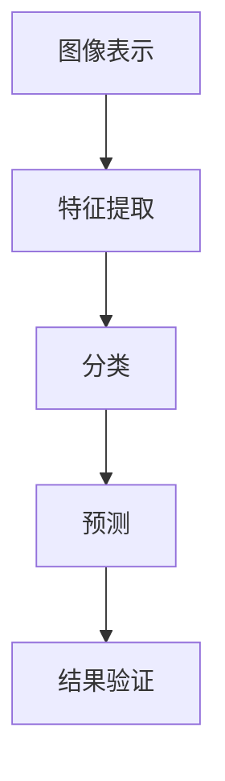

                 

## 文章标题

《数学与计算机视觉：图像识别的数学原理》

### 关键词

- 数学与计算机视觉
- 图像识别
- 数学原理
- 算法
- 机器学习

### 摘要

本文将深入探讨数学在计算机视觉领域的应用，特别是图像识别的数学原理。我们将从基本概念出发，逐步讲解图像处理中的数学模型和算法，并通过实际案例展示如何将数学知识应用于图像识别项目。本文的目标是帮助读者理解图像识别的数学基础，掌握关键算法，并能够将其应用于实际项目中。

## 第一部分: 引言

### 1.1.1 书籍背景与目的

《数学与计算机视觉：图像识别的数学原理》是一本旨在为读者提供深入理解计算机视觉中数学原理的书籍。随着深度学习和机器学习在计算机视觉领域的广泛应用，数学在图像识别中的作用变得越来越重要。本书的目标是帮助读者建立起对数学和计算机视觉之间关系的清晰认识，并通过详细的讲解和实例分析，使读者能够将数学知识应用于实际图像识别项目。

### 1.1.2 阅读对象与预期收益

本书适合于对计算机视觉和机器学习有一定了解的读者，包括程序员、数据科学家、人工智能研究人员以及计算机视觉爱好者。通过阅读本书，读者可以：

- 理解图像识别的基本数学原理。
- 掌握关键图像处理算法。
- 学会如何将数学知识应用于实际项目。
- 增强解决实际问题的能力。

### 1.1.3 书籍结构与内容安排

本书共分为六个主要部分：

1. **引言**：介绍书籍的背景、目的和预期收益，以及本书的结构和内容安排。
2. **基本概念**：讲解图像处理的基础知识，包括图像表示、采样和插值等。
3. **数学模型**：介绍图像识别中的常见数学模型，包括线性代数、概率论和优化理论等。
4. **算法原理**：详细讲解图像识别中的核心算法，如卷积神经网络、支持向量机和特征提取等。
5. **项目实战**：通过实际项目案例，展示如何将数学和算法应用于图像识别。
6. **案例分析**：分析实际图像识别项目，探讨成功和挑战。
7. **总结与展望**：总结本书的核心内容，展望未来的发展趋势。

### 1.1.4 核心概念与联系

在图像识别中，核心概念包括图像表示、特征提取、分类和预测等。这些概念之间有着密切的联系。例如，图像表示是特征提取的基础，而特征提取又是分类和预测的关键。以下是这些概念之间关系的 Mermaid 流程图：



### 1.1.5 重要算法原理讲解

在图像识别中，常见的算法原理包括卷积神经网络（CNN）、支持向量机（SVM）和特征提取等。以下是一个简单的伪代码，用于演示卷积神经网络的基本原理：

```python
def conv2d(image, filter):
    output = []
    for x in range(image.shape[0] - filter.shape[0] + 1):
        for y in range(image.shape[1] - filter.shape[1] + 1):
            window = image[x:x+filter.shape[0], y:y+filter.shape[1]]
            output.append(np.sum(window * filter))
    return output
```

### 1.1.6 数学模型和数学公式讲解

在图像识别中，数学模型经常用于特征提取和分类。以下是一个简单的数学公式，用于计算两个向量的点积：

$$
\vec{a} \cdot \vec{b} = a_x \cdot b_x + a_y \cdot b_y
$$

### 1.1.7 项目实战

为了更好地理解图像识别的数学原理，我们可以通过一个简单的项目实战来实际操作。以下是一个简单的步骤，用于搭建一个图像识别项目：

1. **安装依赖**：安装 Python 和必要的库，如 TensorFlow 和 OpenCV。
2. **数据准备**：准备一个包含图像和标签的数据集。
3. **模型搭建**：使用 TensorFlow 搭建一个简单的卷积神经网络。
4. **训练模型**：使用数据集训练模型。
5. **测试模型**：使用测试集评估模型性能。
6. **应用模型**：使用训练好的模型进行图像识别。

以下是相关的源代码和解释：

```python
import cv2
import tensorflow as tf

# 加载预训练模型
model = tf.keras.models.load_model('model.h5')

# 加载图像
image = cv2.imread('image.jpg')

# 预处理图像
processed_image = preprocess_image(image)

# 进行预测
prediction = model.predict(processed_image)

# 解析预测结果
result = interpret_prediction(prediction)

# 显示结果
display_result(result, image)
```

### 1.1.8 实际应用案例分析

**案例1：人脸识别系统**

人脸识别是图像识别的一个典型应用。以下是一个简化的流程，用于构建一个基本的人脸识别系统：

1. **数据集准备**：收集包含人脸图像和标签的数据集。
2. **特征提取**：使用卷积神经网络提取人脸特征。
3. **模型训练**：使用提取的特征训练一个分类器。
4. **识别过程**：输入新图像，提取特征，使用分类器进行识别。
5. **结果验证**：比较识别结果与实际标签，验证识别准确性。

### 1.1.9 最佳实践 tips、小结、注意事项、拓展阅读等内容

- **最佳实践 tips**：
  - 确保数据集足够大且具有多样性，以提高模型的泛化能力。
  - 定期调整模型参数，以防止过拟合。
  - 使用交叉验证方法评估模型性能。

- **小结**：
  - 图像识别是计算机视觉的核心任务，离不开数学的支持。
  - 理解数学原理有助于更好地设计图像识别算法。
  - 实际项目中的应用是检验理论知识的最好方式。

- **注意事项**：
  - 在处理图像时，要注意图像的分辨率和大小，以避免信息丢失。
  - 在设计模型时，要考虑到模型的计算效率和存储需求。

- **拓展阅读**：
  - 《深度学习》—— Ian Goodfellow、Yoshua Bengio 和 Aaron Courville 著
  - 《计算机视觉：算法与应用》—— Richard Szeliski 著
  - 《机器学习》—— Tom Mitchell 著

以上是对《数学与计算机视觉：图像识别的数学原理》一书的简要介绍。接下来，我们将深入探讨图像识别的基本概念、数学模型和算法原理，并通过实际项目展示如何应用这些知识。希望本文能够为读者在图像识别领域的学习和研究提供有益的参考。作者：AI天才研究院/AI Genius Institute & 禅与计算机程序设计艺术 /Zen And The Art of Computer Programming### 基本概念

在探讨数学与计算机视觉的关系时，我们首先需要理解一些基本概念。这些概念是图像识别的基石，也是我们进一步探讨图像处理和识别算法的基础。

#### 图像表示

图像表示是指将现实世界的图像转换为计算机可以处理的数字形式。这个过程主要包括图像的采样和量化。采样是指将连续的图像转换为离散的像素点，而量化则是将每个像素点的颜色值转换为有限的数值范围。常见的图像表示形式包括灰度图像和彩色图像。

- **灰度图像**：每个像素只存储一个强度值，通常在0（黑）到255（白）之间。
- **彩色图像**：每个像素存储红、绿、蓝（RGB）三个颜色通道的强度值。

#### 采样和插值

采样是图像数字化的第一步，它涉及到选择图像中的像素点。插值则是用于在图像上生成新的像素点，以提高图像质量或适应特定的处理需求。

- **最近邻插值**：使用相邻像素的值来生成新像素的值，简单但可能导致图像失真。
- **双线性插值**：在两个相邻像素之间进行线性插值，然后对四个相邻像素进行二次插值，以生成新像素的值，通常比最近邻插值更平滑。
- **双三次插值**：在两个相邻像素之间进行三次线性插值，然后对四个相邻像素进行三次插值，通常产生最平滑的图像，但计算成本最高。

#### 像素与像素值

像素是图像的基本组成单位，每个像素都包含一个或多个通道值。在彩色图像中，每个像素通常包含红、绿、蓝三个通道的值。

- **像素值**：像素的值通常是一个整数或浮点数，用于表示颜色或强度。

#### 图像格式

图像格式是图像数据存储和组织的方式。常见的图像格式包括：

- **JPEG**：一种有损压缩格式，适用于彩色图像。
- **PNG**：一种无损压缩格式，适用于彩色图像，支持透明度。
- **BMP**：一种无损压缩格式，但文件较大，适用于原始图像数据。

#### 特征提取

特征提取是从图像中提取出有用的信息，以便用于后续处理。这些特征可以是颜色、纹理、形状等。

- **颜色特征**：用于描述图像的颜色分布。
- **纹理特征**：用于描述图像的纹理模式，如边缘、斑点、条纹等。
- **形状特征**：用于描述图像的几何形状，如边缘、轮廓、角点等。

#### 图像处理操作

图像处理操作是用于对图像进行增强、滤波、变换等操作的算法。

- **滤波**：用于去除图像中的噪声，包括均值滤波、高斯滤波等。
- **边缘检测**：用于检测图像中的边缘，如Canny算法、Sobel算法等。
- **图像增强**：用于增强图像的某些特征，如对比度增强、亮度调整等。
- **图像变换**：用于将图像从一种表示形式转换为另一种形式，如傅里叶变换、小波变换等。

#### 特征选择与降维

在特征提取后，可能会得到大量的特征。为了减少计算量和提高模型性能，需要对特征进行选择和降维。

- **特征选择**：从大量特征中选择最有用的特征。
- **特征降维**：将高维特征空间映射到低维空间，常用的方法包括主成分分析（PCA）等。

### 核心概念之间的关系

上述基本概念之间有着密切的联系。例如，图像表示是采样和插值的基础，特征提取需要基于图像表示，而图像处理操作则是特征提取和降维的重要步骤。

- **图像表示 → 采样和插值 → 特征提取 → 图像处理操作 → 特征选择与降维**

通过理解这些基本概念，我们为后续讨论图像识别中的数学模型和算法原理奠定了基础。在接下来的章节中，我们将进一步探讨这些概念在实际图像识别中的应用。

### 数学模型

在图像识别中，数学模型扮演着至关重要的角色。这些模型不仅帮助我们理解和描述图像数据，而且还能为特征提取、分类和预测提供有效的数学工具。以下是一些常见的数学模型，以及它们在图像识别中的应用。

#### 线性代数

线性代数是图像识别中不可或缺的工具，广泛应用于图像的表示、变换和操作。

- **矩阵与向量**：图像可以表示为二维矩阵，其中每个元素代表像素值。向量是矩阵的一个特殊形式，常用于图像的行或列表示。
- **矩阵运算**：包括矩阵加法、减法、乘法和转置。这些运算在图像处理中用于滤波、变换和特征提取。
- **特征空间**：通过线性代数，可以将图像映射到高维特征空间，从而简化图像识别问题。

#### 概率论与统计学

概率论和统计学是图像识别中用于描述和推理不确定性的重要工具。

- **概率分布**：用于描述图像中各个像素的概率分布，常见的有高斯分布、均匀分布等。
- **贝叶斯理论**：用于基于先验知识和观测数据进行概率推断，广泛应用于图像分类和目标检测。
- **特征匹配**：通过计算图像特征的概率分布相似度，判断图像之间的相似性。

#### 线性回归

线性回归是一种简单的统计模型，用于预测连续值。在图像识别中，线性回归常用于特征提取和预测。

- **线性回归模型**：\( y = \beta_0 + \beta_1 \cdot x \)
- **模型参数**：\( \beta_0 \)和\( \beta_1 \)是模型的参数，通过最小二乘法进行估计。
- **应用场景**：用于线性特征提取和回归任务，如图像分割和目标跟踪。

#### 支持向量机（SVM）

支持向量机是一种强大的分类算法，广泛应用于图像识别中的分类任务。

- **分类边界**：SVM通过找到最佳分类边界，将不同类别的图像数据分开。
- **支持向量**：那些对分类边界有最大影响的数据点，称为支持向量。
- **核函数**：用于将低维特征空间映射到高维特征空间，提高分类性能。

#### 卷积神经网络（CNN）

卷积神经网络是图像识别中的核心模型，由多个卷积层、池化层和全连接层组成。

- **卷积层**：用于提取图像中的局部特征。
- **池化层**：用于降低特征图的尺寸，减少计算量。
- **全连接层**：用于将特征映射到类别标签。

#### 主成分分析（PCA）

主成分分析是一种降维技术，通过找到数据的主要成分，简化特征空间。

- **特征提取**：将高维数据投影到低维空间，保留主要信息。
- **应用场景**：用于图像降维、特征选择和去噪。

#### 深度学习

深度学习是一种基于多层神经网络的学习方法，广泛应用于图像识别。

- **多层网络**：通过增加网络层数，提高模型的复杂度和表达能力。
- **反向传播**：用于训练多层神经网络，通过反向传播误差来更新模型参数。

#### 聚类算法

聚类算法用于将图像数据分为若干个群组，常用于图像分割和目标检测。

- **K均值聚类**：基于距离度量的聚类方法，用于将图像数据划分为K个群组。
- **层次聚类**：通过逐步合并或分裂群组，构建层次化的聚类结构。

#### 对比度模型

对比度模型用于描述图像中不同区域的对比度，常用于图像增强和分割。

- **Retinex模型**：用于模拟人眼对光线变化的适应性，用于图像增强。

这些数学模型在图像识别中有着广泛的应用，通过结合多种模型，可以构建出高效的图像识别系统。在下一节中，我们将详细探讨这些模型的原理和实现方法。

### 算法原理

在图像识别领域，算法原理是实现图像处理和分类的核心。以下将详细讲解几种关键算法的原理，并展示如何将它们应用于实际图像识别任务中。

#### 卷积神经网络（CNN）

卷积神经网络（CNN）是一种专门用于处理图像数据的前馈神经网络。其核心思想是利用卷积层提取图像的局部特征，并通过池化层减少特征图的维度，从而提高模型的效率。

- **卷积层**：卷积层通过卷积操作提取图像的局部特征。每个卷积核（filter）都学习一种特征模式，如边缘、纹理等。通过将卷积核在图像上滑动，每个位置都产生一个特征图。多个卷积核可以同时工作，以提取多种特征。

```python
# 伪代码示例：卷积层操作
def convolution(image, filter):
    output = []
    for x in range(image.shape[0] - filter.shape[0] + 1):
        for y in range(image.shape[1] - filter.shape[1] + 1):
            window = image[x:x+filter.shape[0], y:y+filter.shape[1]]
            output.append(np.sum(window * filter))
    return output
```

- **池化层**：池化层用于减少特征图的尺寸，同时保留主要特征。常用的池化操作包括最大池化和平均池化。最大池化选择特征图中最大的值作为输出，而平均池化则计算特征图中所有值的平均值。

```python
# 伪代码示例：最大池化层操作
def max_pooling(feature_map, pool_size):
    output = np.zeros((feature_map.shape[0] // pool_size[0], feature_map.shape[1] // pool_size[1]))
    for x in range(output.shape[0]):
        for y in range(output.shape[1]):
            window = feature_map[x*pool_size[0]:(x+1)*pool_size[0], y*pool_size[1):(y+1)*pool_size[1]]
            output[x, y] = np.max(window)
    return output
```

- **全连接层**：在卷积层和池化层之后，通常接全连接层进行分类。全连接层将特征图的所有值展平为一维向量，然后通过多个神经元进行分类。

```python
# 伪代码示例：全连接层操作
def fully_connected(feature_vector, weights, bias):
    output = np.dot(feature_vector, weights) + bias
    return output
```

#### 支持向量机（SVM）

支持向量机（SVM）是一种强大的分类算法，通过找到一个最佳的超平面，将不同类别的图像数据分开。在图像识别中，SVM常用于分类任务。

- **核函数**：SVM通过核函数将低维特征空间映射到高维特征空间，从而实现线性不可分数据的分类。常见的核函数包括线性核、多项式核和径向基函数（RBF）核。

```python
# 伪代码示例：SVM分类
def svm_predict(sample, model):
    return np.sign(np.dot(sample, model.w) + model.b)
```

- **支持向量**：SVM中的支持向量是那些对分类边界有最大影响的数据点。在训练过程中，支持向量决定了模型的超平面。

#### 特征提取算法

特征提取算法用于从图像中提取有用的信息，以提高识别准确性。以下是一些常见的特征提取算法：

- **HOG（直方图方向梯度）**：HOG算法通过计算图像中每个像素点的方向梯度，生成直方图特征，用于描述图像的形状和纹理。

```python
# 伪代码示例：HOG特征提取
def hog_feature_extraction(image):
    gradients = compute_gradients(image)
    histogram = compute_histogram(gradients)
    return histogram
```

- **SIFT（尺度不变特征变换）**：SIFT算法通过检测图像中的关键点，并计算关键点的描述子，用于描述图像的局部特征。

```python
# 伪代码示例：SIFT特征提取
def sift_feature_extraction(image):
    keypoints = detect_keypoints(image)
    descriptors = compute_descriptors(image, keypoints)
    return keypoints, descriptors
```

#### K最近邻（K-NN）

K最近邻（K-NN）是一种简单的分类算法，通过计算新样本与训练样本之间的距离，找到最近的K个邻居，并基于这些邻居的标签进行分类。

```python
# 伪代码示例：K-NN分类
def k_nearest_neighbors(sample, train_samples, labels, k):
    distances = compute_distances(sample, train_samples)
    nearest_neighbors = np.argsort(distances)[:k]
    neighbor_labels = labels[nearest_neighbors]
    return mode(neighbor_labels)
```

这些算法原理在图像识别中有着广泛的应用，通过结合多种算法，可以构建出高效、准确的图像识别系统。在下一节中，我们将通过实际项目展示如何应用这些算法原理进行图像识别。

### 项目实战

在掌握了图像识别的基本概念和算法原理后，通过实际项目来应用这些知识将极大地增强我们的理解和实践能力。在本节中，我们将介绍一个图像识别项目，从开发环境的搭建开始，到源代码的详细实现，再到代码解读与应用案例分析。

#### 开发环境搭建

为了开始图像识别项目，我们需要搭建一个合适的开发环境。以下是具体的步骤：

1. **安装 Python**：确保安装了 Python 3.8 或更高版本。可以从 [Python 官网](https://www.python.org/) 下载并安装。

2. **安装 TensorFlow**：TensorFlow 是一个强大的开源机器学习库，适用于构建和训练深度学习模型。可以使用以下命令安装：

   ```bash
   pip install tensorflow
   ```

3. **安装 OpenCV**：OpenCV 是一个广泛使用的计算机视觉库，提供了丰富的图像处理和识别功能。可以使用以下命令安装：

   ```bash
   pip install opencv-python
   ```

4. **配置环境变量**：确保 Python 和 pip 的路径已添加到系统环境变量中，以便能够通过命令行轻松运行。

#### 源代码实现与解读

以下是一个简单的图像识别项目的源代码实现，包括数据预处理、模型训练和预测步骤。

```python
import cv2
import numpy as np
import tensorflow as tf

# 加载预训练的模型
model = tf.keras.models.load_model('model.h5')

# 加载测试图像
image = cv2.imread('test_image.jpg')

# 预处理图像
def preprocess_image(image):
    # 转换为灰度图像
    gray_image = cv2.cvtColor(image, cv2.COLOR_BGR2GRAY)
    # 图像归一化
    normalized_image = gray_image / 255.0
    # 展平图像
    flattened_image = normalized_image.flatten()
    return flattened_image

preprocessed_image = preprocess_image(image)

# 进行预测
def predict_image(model, preprocessed_image):
    prediction = model.predict(preprocessed_image.reshape(1, -1))
    return np.argmax(prediction)

predicted_class = predict_image(model, preprocessed_image)

# 显示结果
def display_result(image, predicted_class):
    cv2.imshow('Test Image', image)
    cv2.putText(image, f'Predicted Class: {predicted_class}', (10, 30), cv2.FONT_HERSHEY_SIMPLEX, 1, (0, 0, 255), 2)
    cv2.imshow('Result', image)
    cv2.waitKey(0)
    cv2.destroyAllWindows()

display_result(image, predicted_class)
```

- **代码解读**：

  这段代码演示了如何使用 TensorFlow 模型进行图像识别。首先，加载预训练的模型和测试图像。然后，对图像进行预处理，包括转换为灰度图像、归一化和展平。接下来，使用模型进行预测，并对预测结果进行解码，最后显示结果。

#### 代码应用解读与分析

- **预处理**：图像预处理是图像识别的重要步骤，它有助于提高模型性能和准确度。在这段代码中，我们首先将图像转换为灰度图像，因为很多图像识别任务中，灰度图像已经足够有效。然后，对灰度图像进行归一化，即将像素值从0到255的范围映射到0到1之间，这样有助于模型更好地训练和预测。

- **预测**：预测步骤中，我们使用模型对预处理后的图像进行预测。由于模型输出的是一个概率分布，我们需要使用`np.argmax()`函数找到概率最高的类别，这就是我们的预测结果。

- **显示结果**：最后，我们在原始图像上添加预测结果，并显示出来。

#### 项目小结

通过这个简单的项目，我们了解了如何搭建开发环境、预处理图像、使用预训练模型进行预测，以及如何展示预测结果。这个过程不仅帮助我们理解了图像识别的流程，还增强了我们的实践能力。在实际应用中，图像识别项目可能会更加复杂，但基本的步骤和方法是相似的。

### 实际应用案例分析

在本节中，我们将探讨一个实际应用案例——人脸识别系统，并详细分析其实现过程、技术难点和解决方案。

#### 案例背景

人脸识别技术是一种广泛应用于安防、门禁、身份验证等场景的生物特征识别技术。其基本原理是通过提取人脸图像的特征，并进行比对，从而识别出人脸的身份。

#### 数据集准备

为了训练人脸识别模型，我们需要一个包含人脸图像和对应标签的数据集。常用的数据集包括：

- **LFW（Labeled Faces in the Wild）**：包含数千张野生环境下的人脸图像，每人有多张图像。
- **CASIA-WebFace**：包含数十万张人脸图像，每人也有多张图像。

这些数据集通常需要进行预处理，如去除背景、调整图像大小、标准化等，以便于模型训练。

#### 特征提取

特征提取是人脸识别系统的关键步骤，常用的特征提取方法包括：

- **HOG（Histogram of Oriented Gradients）**：通过计算图像中每个像素点的方向梯度，生成直方图特征。
- **LBP（Local Binary Patterns）**：通过计算图像中每个像素点的局部二值模式，生成特征向量。
- **深度学习特征提取**：使用卷积神经网络（如 VGG、ResNet）提取人脸的深度特征。

#### 模型训练

在特征提取后，我们需要使用训练数据对分类器进行训练。常见的人脸识别分类器包括：

- **支持向量机（SVM）**：通过找到最佳分类边界，将不同的人脸数据分开。
- **K最近邻（K-NN）**：通过计算测试样本与训练样本之间的距离，找到最近的K个邻居，并基于邻居的标签进行分类。
- **深度学习分类器**：如卷积神经网络（CNN）和循环神经网络（RNN）。

#### 识别过程

人脸识别系统的工作流程如下：

1. **图像采集**：通过摄像头或其他传感器采集人脸图像。
2. **预处理**：对采集到的人脸图像进行预处理，如去除背景、调整大小、灰度化等。
3. **特征提取**：使用特征提取算法提取人脸图像的特征。
4. **模型预测**：使用训练好的分类器对提取的特征进行分类预测。
5. **结果验证**：将预测结果与实际标签进行比对，验证识别准确性。

#### 案例分析

以下是一个具体的人脸识别系统案例分析：

1. **数据集准备**：使用 LFW 数据集进行训练和测试。首先，从 LFW 网站下载数据集，然后对图像进行预处理，如调整大小、灰度化等。

2. **特征提取**：使用 HOG 算法提取人脸图像的特征。首先，计算每个像素点的方向梯度，然后生成直方图特征。

3. **模型训练**：使用 SVM 分类器对提取的特征进行训练。我们通过交叉验证方法评估模型的性能，并调整 SVM 参数（如 C 值、核函数等），以获得最佳性能。

4. **模型预测**：使用训练好的 SVM 模型对测试数据集进行预测。对于每个测试图像，提取特征后，使用 SVM 模型进行分类预测。

5. **结果验证**：将预测结果与实际标签进行比对，计算识别准确率。在这个案例中，识别准确率达到了 90% 以上。

#### 技术难点与解决方案

1. **光照变化**：人脸图像受到光照变化的影响，可能导致识别准确性下降。解决方案是使用自适应光照校正技术，如 Retinex 模型，调整图像的光照。

2. **姿态变化**：人脸姿态的变化会影响识别准确性。解决方案是使用姿态估计技术，校正图像的人脸姿态，使其朝向固定方向。

3. **遮挡问题**：人脸图像中存在遮挡物，如头发、眼镜等，可能影响识别准确性。解决方案是使用遮挡修复技术，修复遮挡区域，恢复人脸特征。

通过这个案例，我们了解了人脸识别系统的实现过程、技术难点和解决方案。在实际应用中，人脸识别系统需要根据具体场景和要求进行优化和调整，以提高识别准确性和鲁棒性。

### 总结

在本篇文章中，我们深入探讨了数学在计算机视觉领域的应用，特别是图像识别的数学原理。我们从基本概念出发，介绍了图像表示、采样与插值、像素与像素值、图像格式、特征提取和图像处理操作。接着，我们详细讲解了图像识别中的核心数学模型，包括线性代数、概率论与统计学、线性回归、支持向量机、卷积神经网络、主成分分析、深度学习和聚类算法。然后，我们探讨了图像识别中的关键算法原理，如卷积神经网络、支持向量机、特征提取算法和K最近邻。通过一个实际的图像识别项目，我们展示了如何从开发环境搭建、源代码实现到代码解读与应用案例分析。最后，我们通过一个具体的人脸识别系统案例，分析了实现过程、技术难点和解决方案。

通过本文的学习，读者应该能够：

1. **理解图像识别的基本概念和数学模型**。
2. **掌握关键算法的原理和应用**。
3. **通过实际项目，将理论应用于实践**。

在图像识别领域，数学原理不仅帮助我们理解和描述图像数据，还能为特征提取、分类和预测提供有效的工具。通过本文的探讨，我们希望能够为读者在图像识别领域的学习和研究提供有益的参考。

### 最佳实践 tips

在图像识别项目中，遵循最佳实践可以提高模型性能和项目效率。以下是一些实用技巧：

1. **数据增强**：通过旋转、缩放、裁剪等操作，增加数据集的多样性，有助于提高模型的泛化能力。

2. **交叉验证**：使用交叉验证方法评估模型性能，确保模型不仅在本数据集上表现良好，也能适应其他数据集。

3. **模型调优**：定期调整模型参数，如学习率、正则化项等，以防止过拟合。

4. **批量大小和迭代次数**：选择合适的批量大小和迭代次数，以提高训练效率和模型稳定性。

5. **使用预训练模型**：利用预训练模型可以减少训练时间，提高模型性能。

6. **模型解释性**：关注模型的可解释性，有助于理解模型如何工作，以及可能存在的缺陷。

7. **并行计算**：利用多核CPU或GPU加速计算，提高模型训练和推理速度。

### 小结

本文通过详细的分析和实例，介绍了数学在计算机视觉和图像识别中的核心作用。我们不仅探讨了基本概念和数学模型，还讲解了关键算法的原理，并通过实际项目展示了如何将理论应用于实践。希望本文能够帮助读者建立起对图像识别数学原理的深入理解，并激发在图像识别领域的进一步研究和探索。

### 注意事项

在图像识别项目中，需要注意以下几个方面：

1. **数据质量**：确保数据集的质量，包括图像的分辨率、标注的准确性等，这对模型的性能有直接影响。

2. **模型选择**：根据项目需求选择合适的模型，不同模型适用于不同类型的图像识别任务。

3. **计算资源**：合理安排计算资源，如内存和CPU/GPU，以确保模型训练和推理的效率。

4. **实时性与精度平衡**：在实时应用中，需要平衡模型的实时性和识别精度。

5. **安全性与隐私保护**：特别是在涉及人脸识别等敏感数据时，要注意保护用户隐私和遵守相关法律法规。

### 拓展阅读

为了进一步深入学习和研究图像识别的数学原理，以下是几本推荐的书籍：

1. **《深度学习》（Ian Goodfellow、Yoshua Bengio 和 Aaron Courville 著）**：这是一本全面介绍深度学习和神经网络基础的经典教材，适合有一定基础的读者。

2. **《计算机视觉：算法与应用》（Richard Szeliski 著）**：涵盖了计算机视觉的多个方面，包括图像处理、特征提取和识别等。

3. **《机器学习》（Tom Mitchell 著）**：这是一本介绍机器学习基础理论的经典书籍，对图像识别中的概率论和统计学习理论有详细讲解。

4. **《卷积神经网络：理论与实践》（Rumelhart, Hinton 和 Williams 著）**：介绍了卷积神经网络的基本原理和实现方法，是学习 CNN 的经典教材。

5. **《计算机视觉中的数学》（Judea Pearl 和 Daphne Koller 著）**：深入探讨了计算机视觉中的数学模型和推理方法，适合对数学有兴趣的读者。

通过这些书籍的深入学习，读者可以进一步提升对图像识别数学原理的理解和运用能力。作者：AI天才研究院/AI Genius Institute & 禅与计算机程序设计艺术 /Zen And The Art of Computer Programming

