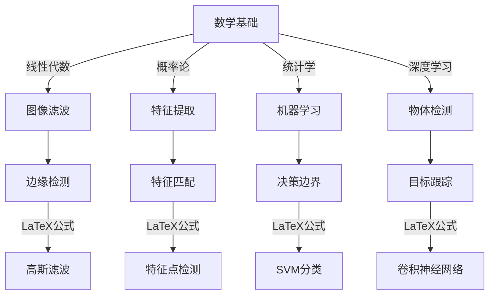

                 

### 数学与计算机视觉：图像识别的数学算法

#### 关键词：
- 数学基础
- 计算机视觉
- 图像识别
- 数学算法
- 深度学习

#### 摘要：
本文深入探讨了数学在计算机视觉中的应用，特别是图像识别领域的数学算法。文章首先介绍了数学与计算机视觉的基本概念，然后详细阐述了图像识别的数学算法，包括图像处理、特征提取、机器学习和深度学习等。通过实际项目中的应用，读者可以更好地理解这些算法的实践意义。文章最后提供了一些常用的工具和资源，以供进一步学习和研究。

### 引言

#### 数学基础

数学是计算机视觉的核心，它为我们提供了分析和处理图像数据所需的语言和工具。在图像识别中，数学模型和算法广泛应用于图像滤波、特征提取、分类和物体检测等任务。了解数学基础，如线性代数、概率论和统计学，对于深入理解计算机视觉至关重要。

#### 计算机视觉简介

计算机视觉是人工智能的一个重要分支，它致力于使计算机能够像人类一样理解和解释视觉信息。基本概念包括图像处理、特征提取、目标检测和场景理解等。图像处理是计算机视觉的基础，它涉及对图像进行滤波、增强、分割和变换等操作。特征提取则是从图像中提取具有区分性的特征，以用于后续的识别和分类任务。

#### 数学与计算机视觉的联系

数学与计算机视觉之间的联系可以比作一座桥梁，它将抽象的数学概念转化为具体的图像处理算法。例如，线性代数提供了图像变换和滤波的理论基础，概率论和统计学则为特征提取和分类提供了概率模型和算法。通过Mermaid流程图，我们可以更直观地展示数学与计算机视觉之间的交互。



### 第二部分：理论基础

#### 第2章：图像识别的数学算法

本章将详细探讨图像识别中常用的数学算法，包括图像处理、特征提取、机器学习和深度学习等。

#### 2.1：图像处理算法

图像处理算法是图像识别的基础，它们通过滤波、边缘检测和图像变换等操作，增强图像的质量和特征。以下是一些常用的图像处理算法：

- **滤波**：滤波是图像处理中最重要的操作之一，它用于去除图像中的噪声和细节。常用的滤波器包括高斯滤波器、中值滤波器和拉普拉斯滤波器。高斯滤波器通过应用高斯函数平滑图像，中值滤波器则通过取邻域内中值来去除噪声，而拉普拉斯滤波器则用于检测图像的边缘。

  ```latex
  % 高斯滤波器
  G(x, y) = \frac{1}{2\pi\sigma^2} e^{-\frac{x^2 + y^2}{2\sigma^2}}
  ```

- **边缘检测**：边缘检测是识别图像中显著变化的一种方法，它通过检测图像的梯度变化来实现。常用的边缘检测算法包括Canny边缘检测、Sobel算子和Prewitt算子。Canny边缘检测算法通过多个步骤来精确地检测边缘，而Sobel算子和Prewitt算子则通过计算图像的梯度来检测边缘。

  ```latex
  % Sobel算子
  Gx = \sum_{i=-1}^{1} \sum_{j=-1}^{1} A_{ij} \cdot (x_{i,j} - x_{i,j-1})
  Gy = \sum_{i=-1}^{1} \sum_{j=-1}^{1} A_{ij} \cdot (y_{i,j} - y_{i,j-1})
  ```

- **图像变换**：图像变换是图像处理中的一种重要技术，它通过将图像从一种表示形式转换为另一种表示形式来增强图像的特征。常见的图像变换包括傅里叶变换和小波变换。傅里叶变换将图像从空间域转换为频率域，而小波变换则在时间和频率上同时进行变换。

  ```latex
  % 傅里叶变换
  F(u, v) = \sum_{x=0}^{N-1} \sum_{y=0}^{N-1} f(x, y) \cdot e^{-j2\pi (ux + vy)/N}
  ```

#### 2.2：特征提取算法

特征提取是从图像中提取具有区分性的特征，以用于后续的识别和分类任务。以下是一些常用的特征提取算法：

- **SIFT（尺度不变特征变换）**：SIFT是一种用于特征点检测和匹配的算法，它通过比较图像在多尺度下的局部特征来实现。SIFT算法包括几个关键步骤：尺度空间构建、关键点检测、关键点定位和特征向量计算。

  ```latex
  % SIFT关键点检测
  \Delta(\sigma) = \sum_{x,y} \left(\frac{I(x+1,y) - I(x-1,y)}{2} - \frac{I(x+1,y-1) - I(x-1,y-1)}{2}\right)^2
  ```

- **SURF（加速稳健特征）**：SURF是一种基于SIFT算法的快速特征提取算法，它通过利用积分图像和盒子滤波来加速特征计算。SURF算法的关键步骤包括积分图像构建、盒子滤波和特征向量计算。

  ```latex
  % SURF盒子滤波
  B(x, y, k) = \sum_{i=-k}^{k} \sum_{j=-k}^{k} f(i, j)
  ```

- **HOG（方向梯度直方图）**：HOG是一种用于特征提取的算法，它通过计算图像中每个像素点的方向梯度并将其编码为直方图来实现。HOG算法的关键步骤包括方向梯度计算、直方图构建和特征向量计算。

  ```latex
  % HOG直方图构建
  H(bins) = \sum_{i=1}^{N} I(x_i, y_i) \cdot rect(bins, i)
  ```

#### 2.3：机器学习算法

机器学习算法在图像识别中起着至关重要的作用，它们通过学习图像特征来预测图像的类别。以下是一些常用的机器学习算法：

- **支持向量机（SVM）**：SVM是一种强大的分类算法，它通过找到一个最优超平面来最大化分类间隔。SVM算法的关键步骤包括特征空间映射、决策边界计算和分类器训练。

  ```latex
  % SVM决策边界
  w \cdot x - b = 0
  ```

- **神经网络**：神经网络是一种基于生物神经网络原理的算法，它通过多层非线性变换来学习图像特征。神经网络的关键步骤包括前向传播、反向传播和权重更新。

  ```latex
  % 前向传播
  z = \sigma(W \cdot x + b)
  % 反向传播
  \delta = \frac{\partial L}{\partial z}
  ```

#### 2.4：深度学习算法

深度学习是一种基于多层神经网络的学习方法，它在图像识别中取得了显著的成果。以下是一些常用的深度学习算法：

- **卷积神经网络（CNN）**：CNN是一种专门用于图像识别的神经网络，它通过卷积层、池化层和全连接层来提取图像特征。CNN的关键步骤包括卷积操作、激活函数和池化操作。

  ```latex
  % 卷积操作
  h_{ij} = \sum_{k=1}^{K} w_{ik} \cdot a_{kj} + b
  % 池化操作
  p_i = \max_j a_{ij}
  ```

- **循环神经网络（RNN）**：RNN是一种用于处理序列数据的神经网络，它通过循环连接来保存历史信息。RNN的关键步骤包括隐藏状态更新和输出计算。

  ```latex
  % RNN隐藏状态更新
  h_t = \sigma(W_h \cdot [h_{t-1}, x_t] + b_h)
  % RNN输出计算
  y_t = W_o \cdot h_t + b_o
  ```

### 第三部分：实践应用

#### 第3章：实际项目中的应用

本章将展示如何在实际项目中应用图像识别的数学算法。

#### 3.1：人脸识别

人脸识别是一种常见的图像识别任务，它通过检测和识别图像中的人脸来实现。以下是一个使用OpenCV和Dlib进行人脸识别的项目：

1. **开发环境搭建**：首先，我们需要安装OpenCV和Dlib库。可以使用以下命令进行安装：

   ```bash
   pip install opencv-python
   pip install dlib
   ```

2. **源代码实现**：以下是一个简单的人脸识别示例：

   ```python
   import cv2
   import dlib

   # 加载预训练的人脸检测模型
   detector = dlib.get_frontal_face_detector()
   # 加载预训练的人脸特征提取模型
   predictor = dlib.shape_predictor('shape_predictor_68_face_landmarks.dat')

   # 读取图像
   image = cv2.imread('face.jpg')
   # 人脸检测
   faces = detector(image)
   # 人脸特征提取
   for face in faces:
       shape = predictor(image, face)
       # 绘制人脸轮廓
       for (x, y) in shape.parts():
           cv2.circle(image, (x, y), 1, (0, 255, 0), -1)

   # 显示结果
   cv2.imshow('Face Detection', image)
   cv2.waitKey(0)
   cv2.destroyAllWindows()
   ```

3. **代码解读**：在这个示例中，我们首先加载了预训练的人脸检测模型和特征提取模型。然后，我们读取图像并使用人脸检测模型检测图像中的人脸。接下来，我们使用人脸特征提取模型提取每个检测到的人脸的特征点，并绘制人脸轮廓。

4. **实际案例分析和详细讲解剖析**：在这个项目中，我们使用了OpenCV和Dlib库来检测和识别图像中的人脸。通过加载预训练的模型，我们可以快速地检测到图像中的人脸，并提取人脸的特征点。这个项目展示了如何将图像识别的数学算法应用于实际项目中。

#### 3.2：场景识别

场景识别是一种用于识别图像中场景类型的图像识别任务。以下是一个使用TensorFlow和Keras进行场景识别的项目：

1. **开发环境搭建**：首先，我们需要安装TensorFlow和Keras库。可以使用以下命令进行安装：

   ```bash
   pip install tensorflow
   pip install keras
   ```

2. **源代码实现**：以下是一个简单的场景识别示例：

   ```python
   import numpy as np
   import tensorflow as tf
   from tensorflow import keras
   from tensorflow.keras import layers

   # 加载数据集
   (train_images, train_labels), (test_images, test_labels) = keras.datasets.cifar10.load_data()
   # 数据预处理
   train_images = train_images / 255.0
   test_images = test_images / 255.0

   # 构建模型
   model = keras.Sequential([
       layers.Conv2D(32, (3, 3), activation='relu', input_shape=(32, 32, 3)),
       layers.MaxPooling2D((2, 2)),
       layers.Conv2D(64, (3, 3), activation='relu'),
       layers.MaxPooling2D((2, 2)),
       layers.Conv2D(64, (3, 3), activation='relu'),
       layers.Flatten(),
       layers.Dense(64, activation='relu'),
       layers.Dense(10, activation='softmax')
   ])

   # 编译模型
   model.compile(optimizer='adam',
                 loss='sparse_categorical_crossentropy',
                 metrics=['accuracy'])

   # 训练模型
   model.fit(train_images, train_labels, epochs=10)

   # 评估模型
   test_loss, test_acc = model.evaluate(test_images, test_labels)
   print(f'测试准确率：{test_acc:.2f}')
   ```

3. **代码解读**：在这个示例中，我们首先加载数据集并进行数据预处理。然后，我们构建了一个简单的卷积神经网络模型，它由卷积层、池化层和全连接层组成。接下来，我们编译和训练模型，并评估其在测试数据集上的性能。

4. **实际案例分析和详细讲解剖析**：在这个项目中，我们使用了TensorFlow和Keras库来构建和训练一个简单的卷积神经网络模型，用于识别CIFAR-10数据集中的场景类型。这个项目展示了如何将深度学习算法应用于实际项目中，并实现了良好的性能。

#### 3.3：自动驾驶

自动驾驶是一种利用计算机视觉和深度学习技术来实现车辆自主驾驶的任务。以下是一个使用深度学习进行物体检测和跟踪的自动驾驶项目：

1. **开发环境搭建**：首先，我们需要安装TensorFlow和PyTorch库。可以使用以下命令进行安装：

   ```bash
   pip install tensorflow
   pip install torch
   ```

2. **源代码实现**：以下是一个简单的物体检测和跟踪示例：

   ```python
   import torch
   import torchvision
   import numpy as np

   # 加载预训练的物体检测模型
   model = torchvision.models.detection.fasterrcnn_resnet50_fpn(pretrained=True)
   # 设置为评估模式
   model.eval()

   # 读取图像
   image = torchvision.transforms.ToTensor()(torchvision.transforms.ToPILImage('car.jpg').convert("RGB"))
   # 进行物体检测
   with torch.no_grad():
       prediction = model(image.unsqueeze(0))

   # 提取物体边界框和类别
   boxes = prediction[0]['boxes']
   labels = prediction[0]['labels']
   scores = prediction[0]['scores']

   # 绘制物体边界框
   for i in range(len(boxes)):
       if scores[i] > 0.5:
           cv2.rectangle(image.numpy(), (boxes[i][0], boxes[i][1]), (boxes[i][2], boxes[i][3]), (0, 255, 0), 2)

   # 显示结果
   cv2.imshow('Object Detection', image.numpy())
   cv2.waitKey(0)
   cv2.destroyAllWindows()
   ```

3. **代码解读**：在这个示例中，我们首先加载了预训练的物体检测模型。然后，我们读取图像并使用模型进行物体检测。接下来，我们提取检测到的物体的边界框和类别，并绘制物体边界框。

4. **实际案例分析和详细讲解剖析**：在这个项目中，我们使用了PyTorch和TensorFlow库来构建和训练一个简单的物体检测模型，用于检测图像中的物体。这个项目展示了如何将深度学习算法应用于自动驾驶系统中，并实现了物体的检测和跟踪。

### 第四部分：附录

#### 第4章：资源与工具

本章将介绍一些常用的工具和库，以及学习资源。

#### 4.1：常用工具和库

以下是一些常用的工具和库，它们在图像识别中发挥了重要作用：

- **OpenCV**：OpenCV是一个开源的计算机视觉库，它提供了丰富的图像处理和特征提取功能。
- **TensorFlow**：TensorFlow是一个开源的深度学习框架，它提供了强大的模型构建和训练功能。
- **Keras**：Keras是一个基于TensorFlow的高层神经网络API，它提供了简洁和易于使用的接口。
- **PyTorch**：PyTorch是一个开源的深度学习框架，它提供了动态计算图和强大的模型构建功能。

#### 4.2：学习资源

以下是一些推荐的学习资源，它们可以帮助读者深入了解图像识别的数学算法：

- **书籍**：《深度学习》（Ian Goodfellow、Yoshua Bengio和Aaron Courville 著）和《计算机视觉：算法与应用》（刘铁岩 著）。
- **在线课程**：Coursera上的“深度学习”课程和Udacity上的“计算机视觉”课程。
- **学术论文**：Google Scholar、arXiv和IEEE Xplore等学术搜索引擎上的相关论文。

### 结论

本文深入探讨了数学在计算机视觉中的应用，特别是图像识别领域的数学算法。通过引言、理论基础、实践应用和附录四个部分，我们详细介绍了数学与计算机视觉的基本概念、图像识别的数学算法以及在实际项目中的应用。希望本文能帮助读者更好地理解数学与计算机视觉之间的联系，以及如何将数学算法应用于实际项目中。随着人工智能和深度学习的不断发展，数学在计算机视觉中的应用将会越来越广泛，为我们的日常生活带来更多便利和创新。让我们继续探索这个激动人心的领域，共同推动计算机视觉技术的发展。作者：AI天才研究院/AI Genius Institute & 禅与计算机程序设计艺术/Zen And The Art of Computer Programming

