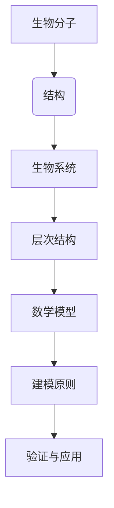
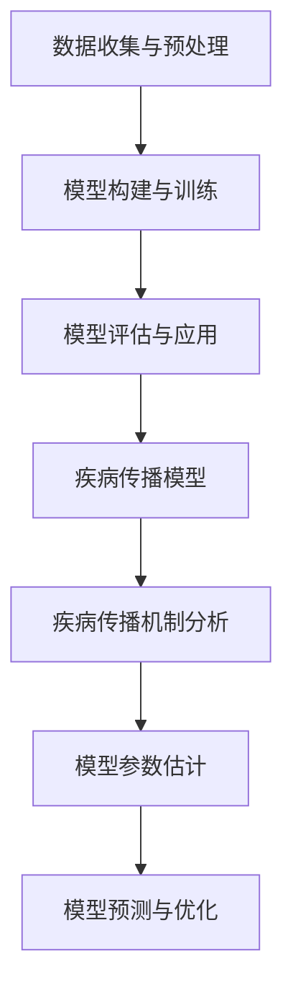

                 


### 数学与计算生物学：生物系统的数学建模

#### 关键词：
- 数学建模
- 计算生物学
- 生物系统
- 非线性动力学
- 线性动力学
- 演化模型
- 数学公式

#### 摘要：
本文旨在探讨数学与计算生物学在生物系统数学建模中的应用。首先，我们简要介绍了计算生物学的发展背景和数学建模的基本原则。接着，本文深入解析了生物系统的结构和层次结构，并通过Mermaid流程图展示了数学模型与生物系统之间的联系。随后，我们详细讲解了动力学模型和演化模型的原理，包括非线性动力学和线性动力学的分析，以及Lotka-Volterra模型和空间扩散模型的应用。此外，本文还通过数学公式和伪代码的形式，阐述了常见数学模型的核心概念和原理。最后，我们以两个实际项目为例，介绍了开发环境搭建、代码实现和代码解读的过程，并进行了项目小结和拓展阅读的推荐。

---

### 目录大纲设计

**第一部分：引论与基础**

1. **引论**
   - 1.1 计算生物学的发展背景
   - 1.2 数学建模在生物系统中的应用
   - 1.3 数学与计算生物学的研究方法

2. **数学基础**
   - 2.1 微积分基础
     - 2.1.1 极限与导数
     - 2.1.2 积分与微分方程
   - 2.2 线性代数基础
     - 2.2.1 向量空间与线性变换
     - 2.2.2 特征值与特征向量

**第二部分：核心概念与联系**

1. **核心概念与联系**
   - 3.1 生物系统概述
     - 3.1.1 生物分子的结构
     - 3.1.2 生物系统的层次结构
   - 3.2 数学模型与生物系统
     - 3.2.1 模型的构建原则
     - 3.2.2 模型的验证与应用

2. **图3.1：数学模型与生物系统架构的 Mermaid 流程图**



**第三部分：核心算法原理讲解**

1. **核心算法原理讲解**
   - 4.1 动力学模型
     - 4.1.1 非线性动力学
       - 4.1.1.1 耦合振荡器模型
       - 4.1.1.2 Hopf分岔与混沌
     - 4.1.2 线性动力学
       - 4.1.2.1 稳态分析
       - 4.1.2.2 波动传播
   - 4.2 演化模型
     - 4.2.1 Lotka-Volterra模型
     - 4.2.2 空间扩散模型

2. **图4.1：动力学模型核心算法原理伪代码**

```c
// 动力学模型伪代码
function dynamicsModel(state, parameters) {
    // 计算状态变化率
    state_derivative = calculateDerivative(state, parameters);
    
    // 更新状态
    state_new = state + delta_t * state_derivative;
    
    return state_new;
}
```

**第四部分：数学模型与数学公式**

1. **数学模型与数学公式**
   - 5.1 常见数学模型
     - 5.1.1 概率模型
       - 5.1.1.1 伯努利试验
       - 5.1.1.2 马尔可夫模型
     - 5.1.2 方程模型
       - 5.1.2.1 微分方程
       - 5.1.2.2 差分方程

2. **数学公式讲解**
   - 6.1 微积分公式
     - 6.1.1 导数公式
       - $$f'(x) = \lim_{h \to 0} \frac{f(x+h) - f(x)}{h}$$
     - 6.1.2 积分公式
       - $$\int_a^b f(x)dx = F(b) - F(a)$$
   - 6.2 线性代数公式
     - 6.2.1 矩阵运算
       - $$A^T = \begin{bmatrix} a_{21} & a_{31} \\ a_{12} & a_{32} \end{bmatrix}$$
     - 6.2.2 特征值与特征向量
       - $$Ax = \lambda x$$

**第五部分：项目实战**

1. **项目实战**
   - 7.1 生物分子相互作用建模
     - 7.1.1 数据收集与预处理
     - 7.1.2 模型构建与训练
     - 7.1.3 模型评估与应用
   - 7.2 疾病传播模型
     - 7.2.1 疾病传播机制分析
     - 7.2.2 模型参数估计
     - 7.2.3 模型预测与优化

2. **图7.1：生物分子相互作用建模流程图**



**第六部分：开发环境搭建与代码解读**

1. **开发环境搭建与代码解读**
   - 8.1 环境搭建
     - 8.1.1 计算机硬件配置
     - 8.1.2 软件安装与配置
     - 8.1.3 常用库与工具介绍
   - 8.2 代码
     - 8.2.1 生物分子相互作用建模代码
     - 8.2.2 疾病传播模型代码
     - 8.2.3 代码应用解读与分析

---

接下来，我们将逐步深入探讨每个部分的具体内容，让读者对数学与计算生物学在生物系统数学建模中的应用有一个全面而深入的理解。

### 第一部分：引论与基础

#### 1.1 计算生物学的发展背景

计算生物学是一门新兴的交叉学科，它结合了生物学、计算机科学和数学等多个领域的研究成果，旨在通过计算方法和工具来解决生物学问题。随着生物技术的迅猛发展，如基因测序、蛋白质结构预测和生物信息学等，计算生物学的研究领域也在不断扩展。

从20世纪末开始，计算生物学逐渐成为生物学研究中的一个重要组成部分。早期的计算生物学主要集中在生物序列分析和基因表达数据分析等方面。随着计算能力的提升和算法的创新，计算生物学已经能够在基因组学、蛋白质组学和代谢组学等多个领域发挥重要作用。

例如，通过基因测序技术，科学家们能够快速地读取和解读生物体的遗传信息。而计算生物学方法可以帮助研究人员从海量的基因数据中提取有价值的信息，如基因功能、基因表达模式和相关疾病的遗传机制等。

此外，计算生物学还在药物研发、疾病诊断和治疗等方面发挥了重要作用。通过计算模拟，研究人员可以预测药物分子与生物大分子（如蛋白质）的相互作用，从而为新药设计提供重要的指导。

#### 1.2 数学建模在生物系统中的应用

数学建模是计算生物学研究中的一个核心方法。通过数学模型，我们可以将复杂的生物系统转化为可计算和分析的形式，从而更好地理解和预测生物系统的行为。

在生物系统中，数学建模可以应用于多个层面，从分子水平的生物化学反应，到细胞水平的信号传导，再到组织和器官水平的生理功能，以及种群水平的生态动力学。

以下是一些数学建模在生物系统中的应用实例：

1. **基因表达调控**：通过构建微分方程模型，研究人员可以模拟基因表达调控网络，分析基因之间的相互作用和反馈机制。例如，Cascadia模型和TIGR模型都是用于分析基因表达调控网络的经典模型。

2. **蛋白质折叠**：在蛋白质结构预测中，数学建模方法如物理模型、统计模型和机器学习方法被广泛采用。通过模拟蛋白质折叠过程，研究人员可以预测蛋白质的三维结构，这对于理解蛋白质功能和新药设计具有重要意义。

3. **神经活动**：神经网络是模拟大脑神经元活动的重要模型。通过构建神经网络模型，研究人员可以模拟大脑的信息处理过程，探究记忆、学习和感知等认知功能的机制。

4. **生态系统动力学**：在生态学中，数学建模可以用于模拟种群动态、食物网结构和生态系统的稳定性。Lotka-Volterra模型是一个经典的捕食-被捕食模型，它用于描述捕食者和猎物之间的相互作用。

#### 1.3 数学与计算生物学的研究方法

数学与计算生物学的研究方法主要包括以下几个方面：

1. **模型构建**：首先，研究人员需要根据生物系统的特性和研究目标，构建适当的数学模型。这通常需要结合生物学知识、实验数据和计算方法。

2. **模型验证**：构建的数学模型需要通过实验数据或观察数据来进行验证，以确保模型的准确性和可靠性。

3. **模型分析**：通过对模型进行分析，研究人员可以探究生物系统的行为特征和调控机制。这包括稳定性分析、相图分析、分岔分析和参数敏感性分析等。

4. **模型优化**：在模型分析的基础上，研究人员可以对模型进行优化，以提高模型的预测能力和解释力。

5. **模拟与预测**：最后，通过模拟实验或观察数据，研究人员可以预测生物系统的行为，并为生物学实验和生物技术提供指导。

#### 总结

在本节中，我们介绍了计算生物学的发展背景和数学建模在生物系统中的应用。通过数学建模，我们可以将复杂的生物系统转化为可计算和分析的形式，从而更好地理解和预测生物系统的行为。接下来，我们将进一步探讨数学基础，包括微积分和线性代数的基本概念，为后续的模型构建和分析提供必要的数学工具。

### 第二部分：核心概念与联系

#### 3.1 生物系统概述

生物系统是生命现象的物质基础，涵盖了从单个生物分子到整个生态系统各个层次的复杂结构和功能。了解生物系统的结构及其层次结构是进行数学建模和计算生物学研究的重要基础。

1. **生物分子的结构**

生物分子是构成生物系统的基础单元，主要包括蛋白质、核酸（DNA和RNA）、碳水化合物和脂质。每种生物分子都有其独特的三维结构和功能。

- **蛋白质**：蛋白质是生命活动的主要执行者，它们承担了从催化化学反应到细胞信号传递等多种功能。蛋白质的结构可以分为一级结构、二级结构、三级结构和四级结构。

  - **一级结构**：由氨基酸的序列组成。
  - **二级结构**：包括α-螺旋和β-折叠等规则的结构。
  - **三级结构**：蛋白质在空间中的三维折叠。
  - **四级结构**：由多个蛋白质亚基组成的复合物结构。

- **核酸**：核酸是生物遗传信息的主要携带者。DNA和RNA分别负责储存和传递遗传信息。DNA的一级结构由核苷酸序列组成，而RNA则在转录过程中将其信息转化为蛋白质。

- **碳水化合物和脂质**：碳水化合物在能量储存和细胞识别中发挥重要作用，而脂质则是生物膜的主要成分，并在信号传递中发挥作用。

2. **生物系统的层次结构**

生物系统可以按照从微观到宏观的顺序划分为多个层次，每个层次都有其特定的功能和复杂性。

- **分子层次**：包括单个生物分子的结构和功能。
- **细胞层次**：细胞是生物体的基本单位，承担了物质交换、能量转化和信息传递等生命活动。
- **组织层次**：由不同类型的细胞组成，形成具有特定功能的组织，如肌肉组织、神经组织和上皮组织等。
- **器官层次**：由多个组织组成，形成具有特定生理功能的器官，如心脏、肺和肝脏等。
- **系统层次**：多个器官协同工作，形成具有特定功能的生物系统，如消化系统、循环系统和生殖系统等。
- **个体层次**：一个完整的生物体，包括所有器官和组织的协调运作。
- **种群层次**：在同一地区内，由同一物种的个体组成的群体。
- **生态系统层次**：包括多个物种的种群及其所处的环境，形成一个动态平衡的生态系统。

#### 3.2 数学模型与生物系统

数学模型是理解和分析生物系统行为的有力工具。通过数学建模，我们可以将复杂的生物系统抽象为数学问题，从而利用数学方法进行求解和分析。

1. **模型的构建原则**

在构建数学模型时，需要遵循以下原则：

- **抽象与简化**：将复杂的生物系统简化为基本单元和相互作用，忽略次要因素，以便于数学分析和求解。
- **可验证性**：模型应该能够通过实验数据或观察数据来验证，以确保其准确性和可靠性。
- **灵活性**：模型应具有足够的灵活性，以便适应不同生物系统的特性和研究需求。

2. **模型的验证与应用**

数学模型的验证和应用是确保其有效性和实用性的关键步骤。以下是一些常用的验证和应用方法：

- **实验验证**：通过实验手段收集数据，与模型预测进行比较，以验证模型的准确性。
- **数值模拟**：利用计算机模拟，在特定的参数条件下模拟生物系统的行为，以探究模型的预测能力。
- **统计分析**：通过统计分析模型预测的结果，评估模型的可靠性和稳定性。

3. **数学模型在生物系统中的应用**

数学模型在生物系统的多个层次和应用场景中都有广泛的应用，以下是一些具体的例子：

- **基因表达调控**：通过构建微分方程模型，可以模拟基因表达调控网络，分析基因之间的相互作用和调控机制。
- **蛋白质折叠**：利用物理模型和统计模型，可以预测蛋白质的三维结构，从而理解蛋白质的功能和折叠过程。
- **神经活动**：神经网络模型可以模拟大脑神经元的活动，探究记忆、学习和感知等认知功能。
- **生态系统动力学**：通过构建生态模型，可以模拟种群动态、食物网结构和生态系统的稳定性，为生态保护和环境管理提供科学依据。

#### 图3.1：数学模型与生物系统架构的 Mermaid 流程图


通过图3.1，我们可以清晰地看到数学模型与生物系统之间的紧密联系。从生物分子到生物系统，再到数学模型，每一步都是相互关联、相互补充的。数学模型不仅是生物系统分析的有力工具，也是推动生物学研究和技术应用的重要驱动力。

在下一部分中，我们将进一步探讨数学基础，包括微积分和线性代数的基本概念，为后续的模型构建和分析提供必要的数学工具。

### 第二部分：核心概念与联系

#### 3.1 生物系统概述

生物系统是生命现象的物质基础，涵盖了从单个生物分子到整个生态系统各个层次的复杂结构和功能。了解生物系统的结构及其层次结构是进行数学建模和计算生物学研究的重要基础。

1. **生物分子的结构**

生物分子是构成生物系统的基础单元，主要包括蛋白质、核酸（DNA和RNA）、碳水化合物和脂质。每种生物分子都有其独特的三维结构和功能。

- **蛋白质**：蛋白质是生命活动的主要执行者，它们承担了从催化化学反应到细胞信号传递等多种功能。蛋白质的结构可以分为一级结构、二级结构、三级结构和四级结构。

  - **一级结构**：由氨基酸的序列组成。
  - **二级结构**：包括α-螺旋和β-折叠等规则的结构。
  - **三级结构**：蛋白质在空间中的三维折叠。
  - **四级结构**：由多个蛋白质亚基组成的复合物结构。

- **核酸**：核酸是生物遗传信息的主要携带者。DNA和RNA分别负责储存和传递遗传信息。DNA的一级结构由核苷酸序列组成，而RNA则在转录过程中将其信息转化为蛋白质。

- **碳水化合物和脂质**：碳水化合物在能量储存和细胞识别中发挥重要作用，而脂质则是生物膜的主要成分，并在信号传递中发挥作用。

2. **生物系统的层次结构**

生物系统可以按照从微观到宏观的顺序划分为多个层次，每个层次都有其特定的功能和复杂性。

- **分子层次**：包括单个生物分子的结构和功能。
- **细胞层次**：细胞是生物体的基本单位，承担了物质交换、能量转化和信息传递等生命活动。
- **组织层次**：由不同类型的细胞组成，形成具有特定功能的组织，如肌肉组织、神经组织和上皮组织等。
- **器官层次**：由多个组织组成，形成具有特定生理功能的器官，如心脏、肺和肝脏等。
- **系统层次**：多个器官协同工作，形成具有特定功能的生物系统，如消化系统、循环系统和生殖系统等。
- **个体层次**：一个完整的生物体，包括所有器官和组织的协调运作。
- **种群层次**：在同一地区内，由同一物种的个体组成的群体。
- **生态系统层次**：包括多个物种的种群及其所处的环境，形成一个动态平衡的生态系统。

3. **数学模型与生物系统**

数学模型是理解和分析生物系统行为的有力工具。通过数学建模，我们可以将复杂的生物系统抽象为数学问题，从而利用数学方法进行求解和分析。

- **模型构建**：在构建数学模型时，需要遵循以下原则：

  - **抽象与简化**：将复杂的生物系统简化为基本单元和相互作用，忽略次要因素，以便于数学分析和求解。
  - **可验证性**：模型应该能够通过实验数据或观察数据来验证，以确保其准确性和可靠性。
  - **灵活性**：模型应具有足够的灵活性，以便适应不同生物系统的特性和研究需求。

- **模型验证**：数学模型的验证和应用是确保其有效性和实用性的关键步骤。以下是一些常用的验证和应用方法：

  - **实验验证**：通过实验手段收集数据，与模型预测进行比较，以验证模型的准确性。
  - **数值模拟**：利用计算机模拟，在特定的参数条件下模拟生物系统的行为，以探究模型的预测能力。
  - **统计分析**：通过统计分析模型预测的结果，评估模型的可靠性和稳定性。

- **模型应用**：数学模型在生物系统的多个层次和应用场景中都有广泛的应用，以下是一些具体的例子：

  - **基因表达调控**：通过构建微分方程模型，可以模拟基因表达调控网络，分析基因之间的相互作用和调控机制。
  - **蛋白质折叠**：利用物理模型和统计模型，可以预测蛋白质的三维结构，从而理解蛋白质的功能和折叠过程。
  - **神经活动**：神经网络模型可以模拟大脑神经元的活动，探究记忆、学习和感知等认知功能。
  - **生态系统动力学**：通过构建生态模型，可以模拟种群动态、食物网结构和生态系统的稳定性，为生态保护和环境管理提供科学依据。

#### 图3.1：数学模型与生物系统架构的 Mermaid 流程图


通过图3.1，我们可以清晰地看到数学模型与生物系统之间的紧密联系。从生物分子到生物系统，再到数学模型，每一步都是相互关联、相互补充的。数学模型不仅是生物系统分析的有力工具，也是推动生物学研究和技术应用的重要驱动力。

在下一部分中，我们将进一步探讨数学基础，包括微积分和线性代数的基本概念，为后续的模型构建和分析提供必要的数学工具。

### 第二部分：核心概念与联系

#### 3.1 生物系统概述

生物系统是生命现象的物质基础，涵盖了从单个生物分子到整个生态系统各个层次的复杂结构和功能。了解生物系统的结构及其层次结构是进行数学建模和计算生物学研究的重要基础。

1. **生物分子的结构**

生物分子是构成生物系统的基础单元，主要包括蛋白质、核酸（DNA和RNA）、碳水化合物和脂质。每种生物分子都有其独特的三维结构和功能。

- **蛋白质**：蛋白质是生命活动的主要执行者，它们承担了从催化化学反应到细胞信号传递等多种功能。蛋白质的结构可以分为一级结构、二级结构、三级结构和四级结构。

  - **一级结构**：由氨基酸的序列组成。
  - **二级结构**：包括α-螺旋和β-折叠等规则的结构。
  - **三级结构**：蛋白质在空间中的三维折叠。
  - **四级结构**：由多个蛋白质亚基组成的复合物结构。

- **核酸**：核酸是生物遗传信息的主要携带者。DNA和RNA分别负责储存和传递遗传信息。DNA的一级结构由核苷酸序列组成，而RNA则在转录过程中将其信息转化为蛋白质。

- **碳水化合物和脂质**：碳水化合物在能量储存和细胞识别中发挥重要作用，而脂质则是生物膜的主要成分，并在信号传递中发挥作用。

2. **生物系统的层次结构**

生物系统可以按照从微观到宏观的顺序划分为多个层次，每个层次都有其特定的功能和复杂性。

- **分子层次**：包括单个生物分子的结构和功能。
- **细胞层次**：细胞是生物体的基本单位，承担了物质交换、能量转化和信息传递等生命活动。
- **组织层次**：由不同类型的细胞组成，形成具有特定功能的组织，如肌肉组织、神经组织和上皮组织等。
- **器官层次**：由多个组织组成，形成具有特定生理功能的器官，如心脏、肺和肝脏等。
- **系统层次**：多个器官协同工作，形成具有特定功能的生物系统，如消化系统、循环系统和生殖系统等。
- **个体层次**：一个完整的生物体，包括所有器官和组织的协调运作。
- **种群层次**：在同一地区内，由同一物种的个体组成的群体。
- **生态系统层次**：包括多个物种的种群及其所处的环境，形成一个动态平衡的生态系统。

3. **数学模型与生物系统**

数学模型是理解和分析生物系统行为的有力工具。通过数学建模，我们可以将复杂的生物系统抽象为数学问题，从而利用数学方法进行求解和分析。

- **模型构建**：在构建数学模型时，需要遵循以下原则：

  - **抽象与简化**：将复杂的生物系统简化为基本单元和相互作用，忽略次要因素，以便于数学分析和求解。
  - **可验证性**：模型应该能够通过实验数据或观察数据来验证，以确保其准确性和可靠性。
  - **灵活性**：模型应具有足够的灵活性，以便适应不同生物系统的特性和研究需求。

- **模型验证**：数学模型的验证和应用是确保其有效性和实用性的关键步骤。以下是一些常用的验证和应用方法：

  - **实验验证**：通过实验手段收集数据，与模型预测进行比较，以验证模型的准确性。
  - **数值模拟**：利用计算机模拟，在特定的参数条件下模拟生物系统的行为，以探究模型的预测能力。
  - **统计分析**：通过统计分析模型预测的结果，评估模型的可靠性和稳定性。

- **模型应用**：数学模型在生物系统的多个层次和应用场景中都有广泛的应用，以下是一些具体的例子：

  - **基因表达调控**：通过构建微分方程模型，可以模拟基因表达调控网络，分析基因之间的相互作用和调控机制。
  - **蛋白质折叠**：利用物理模型和统计模型，可以预测蛋白质的三维结构，从而理解蛋白质的功能和折叠过程。
  - **神经活动**：神经网络模型可以模拟大脑神经元的活动，探究记忆、学习和感知等认知功能。
  - **生态系统动力学**：通过构建生态模型，可以模拟种群动态、食物网结构和生态系统的稳定性，为生态保护和环境管理提供科学依据。

#### 图3.1：数学模型与生物系统架构的 Mermaid 流程图


通过图3.1，我们可以清晰地看到数学模型与生物系统之间的紧密联系。从生物分子到生物系统，再到数学模型，每一步都是相互关联、相互补充的。数学模型不仅是生物系统分析的有力工具，也是推动生物学研究和技术应用的重要驱动力。

在下一部分中，我们将进一步探讨数学基础，包括微积分和线性代数的基本概念，为后续的模型构建和分析提供必要的数学工具。

### 第二部分：核心概念与联系

#### 3.1 生物系统概述

生物系统是生命现象的物质基础，涵盖了从单个生物分子到整个生态系统各个层次的复杂结构和功能。了解生物系统的结构及其层次结构是进行数学建模和计算生物学研究的重要基础。

1. **生物分子的结构**

生物分子是构成生物系统的基础单元，主要包括蛋白质、核酸（DNA和RNA）、碳水化合物和脂质。每种生物分子都有其独特的三维结构和功能。

- **蛋白质**：蛋白质是生命活动的主要执行者，它们承担了从催化化学反应到细胞信号传递等多种功能。蛋白质的结构可以分为一级结构、二级结构、三级结构和四级结构。

  - **一级结构**：由氨基酸的序列组成。
  - **二级结构**：包括α-螺旋和β-折叠等规则的结构。
  - **三级结构**：蛋白质在空间中的三维折叠。
  - **四级结构**：由多个蛋白质亚基组成的复合物结构。

- **核酸**：核酸是生物遗传信息的主要携带者。DNA和RNA分别负责储存和传递遗传信息。DNA的一级结构由核苷酸序列组成，而RNA则在转录过程中将其信息转化为蛋白质。

- **碳水化合物和脂质**：碳水化合物在能量储存和细胞识别中发挥重要作用，而脂质则是生物膜的主要成分，并在信号传递中发挥作用。

2. **生物系统的层次结构**

生物系统可以按照从微观到宏观的顺序划分为多个层次，每个层次都有其特定的功能和复杂性。

- **分子层次**：包括单个生物分子的结构和功能。
- **细胞层次**：细胞是生物体的基本单位，承担了物质交换、能量转化和信息传递等生命活动。
- **组织层次**：由不同类型的细胞组成，形成具有特定功能的组织，如肌肉组织、神经组织和上皮组织等。
- **器官层次**：由多个组织组成，形成具有特定生理功能的器官，如心脏、肺和肝脏等。
- **系统层次**：多个器官协同工作，形成具有特定功能的生物系统，如消化系统、循环系统和生殖系统等。
- **个体层次**：一个完整的生物体，包括所有器官和组织的协调运作。
- **种群层次**：在同一地区内，由同一物种的个体组成的群体。
- **生态系统层次**：包括多个物种的种群及其所处的环境，形成一个动态平衡的生态系统。

3. **数学模型与生物系统**

数学模型是理解和分析生物系统行为的有力工具。通过数学建模，我们可以将复杂的生物系统抽象为数学问题，从而利用数学方法进行求解和分析。

- **模型构建**：在构建数学模型时，需要遵循以下原则：

  - **抽象与简化**：将复杂的生物系统简化为基本单元和相互作用，忽略次要因素，以便于数学分析和求解。
  - **可验证性**：模型应该能够通过实验数据或观察数据来验证，以确保其准确性和可靠性。
  - **灵活性**：模型应具有足够的灵活性，以便适应不同生物系统的特性和研究需求。

- **模型验证**：数学模型的验证和应用是确保其有效性和实用性的关键步骤。以下是一些常用的验证和应用方法：

  - **实验验证**：通过实验手段收集数据，与模型预测进行比较，以验证模型的准确性。
  - **数值模拟**：利用计算机模拟，在特定的参数条件下模拟生物系统的行为，以探究模型的预测能力。
  - **统计分析**：通过统计分析模型预测的结果，评估模型的可靠性和稳定性。

- **模型应用**：数学模型在生物系统的多个层次和应用场景中都有广泛的应用，以下是一些具体的例子：

  - **基因表达调控**：通过构建微分方程模型，可以模拟基因表达调控网络，分析基因之间的相互作用和调控机制。
  - **蛋白质折叠**：利用物理模型和统计模型，可以预测蛋白质的三维结构，从而理解蛋白质的功能和折叠过程。
  - **神经活动**：神经网络模型可以模拟大脑神经元的活动，探究记忆、学习和感知等认知功能。
  - **生态系统动力学**：通过构建生态模型，可以模拟种群动态、食物网结构和生态系统的稳定性，为生态保护和环境管理提供科学依据。

#### 图3.1：数学模型与生物系统架构的 Mermaid 流程图


通过图3.1，我们可以清晰地看到数学模型与生物系统之间的紧密联系。从生物分子到生物系统，再到数学模型，每一步都是相互关联、相互补充的。数学模型不仅是生物系统分析的有力工具，也是推动生物学研究和技术应用的重要驱动力。

在下一部分中，我们将进一步探讨数学基础，包括微积分和线性代数的基本概念，为后续的模型构建和分析提供必要的数学工具。

### 第三部分：核心算法原理讲解

#### 4.1 动力学模型

动力学模型是计算生物学中用于描述生物系统动态行为的重要工具。这些模型可以用来模拟从单个分子到整个生态系统的行为。根据模型描述的动态特性，动力学模型可以分为非线性动力学模型和线性动力学模型。

1. **非线性动力学模型**

非线性动力学模型用于描述那些其内部状态变量之间存在非线性关系的系统。这些模型通常涉及到复杂的数学关系，如非线性微分方程和差分方程。

- **耦合振荡器模型**：耦合振荡器模型用于描述多个相互耦合的振荡器系统，如心脏起搏细胞之间的相互作用。该模型可以通过以下非线性微分方程描述：

  $$ \dot{x}_i = -\alpha_i x_i + \sum_{j\neq i} \beta_{ij} x_j $$

  其中，$x_i$ 是第 $i$ 个振荡器的状态，$\alpha_i$ 和 $\beta_{ij}$ 是模型的参数。

- **Hopf分岔与混沌**：Hopf分岔是指一个稳定平衡点在某个参数变化下变成不稳定平衡点，并产生一个极限环的过程。混沌则是系统在长期演化过程中表现出随机性的现象。例如，洛伦兹系统（Lorenz system）是一个典型的混沌动力学模型，其方程为：

  $$ \dot{x} = \sigma (y - x) $$
  $$ \dot{y} = x(\rho - z) - y $$
  $$ \dot{z} = xy - \beta z $$

  其中，$\sigma$、$\rho$ 和 $\beta$ 是模型的参数。

2. **线性动力学模型**

线性动力学模型用于描述那些其内部状态变量之间关系线性的系统。这些模型通常涉及到线性微分方程和差分方程。

- **稳态分析**：稳态分析是指研究系统在长时间演化后达到稳定状态的行为。例如，对于一个线性常微分方程系统：

  $$ \dot{x} = Ax + Bu $$

  我们可以通过求解其特征方程来分析系统的稳定性。如果所有特征值的实部均为负，则系统是稳定的。

- **波动传播**：波动传播是指波动在空间中的传播过程。例如，一维波动方程可以描述为：

  $$ \frac{\partial^2 u}{\partial t^2} = c^2 \frac{\partial^2 u}{\partial x^2} $$

  其中，$u(t, x)$ 是波动的空间和时间函数，$c$ 是波速。

#### 4.2 演化模型

演化模型用于描述生物系统中个体或种群随时间的演化过程。这些模型通常基于概率论和统计学原理，如马尔可夫过程和Lotka-Volterra模型。

1. **Lotka-Volterra模型**

Lotka-Volterra模型是一个经典的捕食-被捕食模型，用于描述两个相互作用的种群（捕食者和猎物）的数量随时间的演化。该模型基于以下微分方程：

  $$ \frac{dN}{dt} = rN - \alpha N \beta P $$
  $$ \frac{dP}{dt} = -aP + \alpha N \beta P $$

  其中，$N$ 和 $P$ 分别表示猎物和捕食者的数量，$r$ 是猎物的自然增长率，$a$ 是捕食者的死亡率，$\alpha$ 和 $\beta$ 分别是捕食者和猎物之间的相互作用系数。

2. **空间扩散模型**

空间扩散模型用于描述物质或个体在空间中的扩散过程。一个常见的空间扩散模型是菲克第一定律（Fick's First Law），其方程为：

  $$ \frac{\partial \rho}{\partial t} = D \nabla^2 \rho $$

  其中，$\rho$ 是物质的浓度，$D$ 是扩散系数。

#### 图4.1：动力学模型核心算法原理伪代码

```c
// 动力学模型伪代码
function dynamicsModel(state, parameters) {
    // 计算状态变化率
    state_derivative = calculateDerivative(state, parameters);
    
    // 更新状态
    state_new = state + delta_t * state_derivative;
    
    return state_new;
}
```

通过上述伪代码，我们可以看到动力学模型的计算过程主要包括两个步骤：首先计算状态的变化率，然后根据变化率更新状态。这个过程可以通过迭代方式进行，从而模拟系统的动态演化。

在下一部分中，我们将介绍数学模型和数学公式，包括微积分和线性代数的基本概念，以及这些模型在实际应用中的具体应用和例子。

### 第四部分：数学模型与数学公式

在计算生物学中，数学模型和公式是理解和分析生物系统行为的核心工具。数学模型通过将生物系统的复杂现象转化为数学方程，使我们可以利用数学方法进行精确的描述和预测。这一部分将介绍一些常见的数学模型和关键数学公式，并给出具体的例子。

#### 5.1 常见数学模型

1. **概率模型**

   概率模型在计算生物学中广泛用于描述生物分子和生物过程的不确定性。常见的概率模型包括伯努利试验和马尔可夫模型。

   - **伯努利试验**：伯努利试验是一个简单的概率模型，用于描述一次实验的结果是否成功。例如，在DNA序列中，某个位点是否为特定的碱基。

     $$ P(\text{成功}) = p $$
     $$ P(\text{失败}) = 1 - p $$

   - **马尔可夫模型**：马尔可夫模型用于描述系统状态的转移概率。例如，在基因表达调控网络中，基因表达状态从一个状态转移到另一个状态的几率。

     $$ P(X_t = j | X_{t-1} = i) = p_{ij} $$

2. **方程模型**

   方程模型用于描述生物系统的动态行为，包括微分方程和差分方程。

   - **微分方程**：微分方程用于描述连续系统的动态行为。例如，在细胞信号传导过程中，信号分子的浓度随时间的变化。

     $$ \frac{dN}{dt} = rN - kN^2 $$
   
   - **差分方程**：差分方程用于描述离散系统的动态行为。例如，在细胞分裂过程中，细胞数量的变化。

     $$ N_{t+1} = N_t + r - dN_t $$

#### 6.1 微积分公式

微积分在计算生物学中用于描述系统的变化率和累积量。以下是一些关键的微积分公式：

1. **导数公式**

   导数用于描述函数在某一点的变化率。对于函数 $f(x)$，其在点 $x$ 的导数表示为：

   $$ f'(x) = \lim_{h \to 0} \frac{f(x+h) - f(x)}{h} $$

   例如，对于函数 $f(x) = x^2$，其导数为：

   $$ f'(x) = \lim_{h \to 0} \frac{(x+h)^2 - x^2}{h} = 2x $$

2. **积分公式**

   积分用于计算函数在某区间内的累积量。对于函数 $f(x)$，其在区间 $[a, b]$ 上的积分表示为：

   $$ \int_a^b f(x)dx = F(b) - F(a) $$

   其中，$F(x)$ 是 $f(x)$ 的一个原函数。例如，对于函数 $f(x) = x$，其在区间 $[0, 1]$ 上的积分为：

   $$ \int_0^1 x dx = \frac{1}{2} $$

#### 6.2 线性代数公式

线性代数在计算生物学中用于描述系统的线性关系和变换。以下是一些关键的线性代数公式：

1. **矩阵运算**

   矩阵运算包括矩阵的加法、减法、乘法和转置等。例如，对于两个矩阵 $A$ 和 $B$：

   - 矩阵加法：
     $$ A + B = \begin{bmatrix} a_{11} & a_{12} \\ a_{21} & a_{22} \end{bmatrix} + \begin{bmatrix} b_{11} & b_{12} \\ b_{21} & b_{22} \end{bmatrix} = \begin{bmatrix} a_{11} + b_{11} & a_{12} + b_{12} \\ a_{21} + b_{21} & a_{22} + b_{22} \end{bmatrix} $$
   
   - 矩阵乘法：
     $$ AB = \begin{bmatrix} a_{11} & a_{12} \\ a_{21} & a_{22} \end{bmatrix} \begin{bmatrix} b_{11} & b_{12} \\ b_{21} & b_{22} \end{bmatrix} = \begin{bmatrix} a_{11}b_{11} + a_{12}b_{21} & a_{11}b_{12} + a_{12}b_{22} \\ a_{21}b_{11} + a_{22}b_{21} & a_{21}b_{12} + a_{22}b_{22} \end{bmatrix} $$
   
   - 矩阵转置：
     $$ A^T = \begin{bmatrix} a_{21} & a_{11} \\ a_{22} & a_{12} \end{bmatrix} $$

2. **特征值与特征向量**

   特征值和特征向量用于描述矩阵的线性变换特性。对于一个矩阵 $A$，其特征值和特征向量满足以下方程：

   $$ Ax = \lambda x $$

   其中，$\lambda$ 是特征值，$x$ 是对应的特征向量。例如，对于矩阵：

   $$ A = \begin{bmatrix} 2 & 1 \\ 1 & 2 \end{bmatrix} $$

   其特征值和特征向量可以通过求解特征方程得到。

#### 举例说明

以下是一个简单的例子，展示了如何使用上述数学模型和公式来描述一个生物系统。

**例子：细胞分裂模型**

假设我们有一个细胞分裂模型，其中每个细胞在每单位时间内以概率 $p$ 分裂成两个细胞。我们可以使用伯努利试验来描述这个过程。

- **状态变量**：$N(t)$ 表示在时间 $t$ 时刻的细胞数量。
- **概率模型**：每个细胞在单位时间内分裂的概率为 $p$，不分裂的概率为 $1 - p$。

根据伯努利试验，我们可以得到以下概率分布：

$$ P(N(t) = k) = C^N_k p^k (1 - p)^{N-k} $$

其中，$C^N_k$ 是组合数，表示从 $N$ 个细胞中选择 $k$ 个细胞的组合数。

**微分方程**：

我们可以将上述概率模型转化为微分方程，描述细胞数量的变化：

$$ \frac{dN}{dt} = N(p - (1 - p)) = N(2p - 1) $$

如果 $p = 0.5$，则细胞数量保持不变。如果 $p > 0.5$，则细胞数量增加，反之减少。

**总结**

通过介绍常见的数学模型和关键的数学公式，我们可以看到数学在计算生物学中的重要作用。这些模型和公式不仅帮助我们理解和描述生物系统的行为，还为生物系统的模拟和预测提供了强大的工具。在下一部分，我们将深入探讨数学模型在实际项目中的应用，通过具体案例来展示如何使用这些模型来解决实际问题。

### 第四部分：数学模型与数学公式

在计算生物学中，数学模型和公式是理解和分析生物系统行为的核心工具。数学模型通过将生物系统的复杂现象转化为数学方程，使我们可以利用数学方法进行精确的描述和预测。这一部分将介绍一些常见的数学模型和关键数学公式，并给出具体的例子。

#### 5.1 常见数学模型

1. **概率模型**

   概率模型在计算生物学中广泛用于描述生物分子和生物过程的不确定性。常见的概率模型包括伯努利试验和马尔可夫模型。

   - **伯努利试验**：伯努利试验是一个简单的概率模型，用于描述一次实验的结果是否成功。例如，在DNA序列中，某个位点是否为特定的碱基。

     $$ P(\text{成功}) = p $$
     $$ P(\text{失败}) = 1 - p $$

   - **马尔可夫模型**：马尔可夫模型用于描述系统状态的转移概率。例如，在基因表达调控网络中，基因表达状态从一个状态转移到另一个状态的几率。

     $$ P(X_t = j | X_{t-1} = i) = p_{ij} $$

2. **方程模型**

   方程模型用于描述生物系统的动态行为，包括微分方程和差分方程。

   - **微分方程**：微分方程用于描述连续系统的动态行为。例如，在细胞信号传导过程中，信号分子的浓度随时间的变化。

     $$ \frac{dN}{dt} = rN - kN^2 $$
   
   - **差分方程**：差分方程用于描述离散系统的动态行为。例如，在细胞分裂过程中，细胞数量的变化。

     $$ N_{t+1} = N_t + r - dN_t $$

#### 6.1 微积分公式

微积分在计算生物学中用于描述系统的变化率和累积量。以下是一些关键的微积分公式：

1. **导数公式**

   导数用于描述函数在某一点的变化率。对于函数 $f(x)$，其在点 $x$ 的导数表示为：

   $$ f'(x) = \lim_{h \to 0} \frac{f(x+h) - f(x)}{h} $$

   例如，对于函数 $f(x) = x^2$，其导数为：

   $$ f'(x) = \lim_{h \to 0} \frac{(x+h)^2 - x^2}{h} = 2x $$

2. **积分公式**

   积分用于计算函数在某区间内的累积量。对于函数 $f(x)$，其在区间 $[a, b]$ 上的积分表示为：

   $$ \int_a^b f(x)dx = F(b) - F(a) $$

   其中，$F(x)$ 是 $f(x)$ 的一个原函数。例如，对于函数 $f(x) = x$，其在区间 $[0, 1]$ 上的积分为：

   $$ \int_0^1 x dx = \frac{1}{2} $$

#### 6.2 线性代数公式

线性代数在计算生物学中用于描述系统的线性关系和变换。以下是一些关键的线性代数公式：

1. **矩阵运算**

   矩阵运算包括矩阵的加法、减法、乘法和转置等。例如，对于两个矩阵 $A$ 和 $B$：

   - 矩阵加法：
     $$ A + B = \begin{bmatrix} a_{11} & a_{12} \\ a_{21} & a_{22} \end{bmatrix} + \begin{bmatrix} b_{11} & b_{12} \\ b_{21} & b_{22} \end{bmatrix} = \begin{bmatrix} a_{11} + b_{11} & a_{12} + b_{12} \\ a_{21} + b_{21} & a_{22} + b_{22} \end{bmatrix} $$
   
   - 矩阵乘法：
     $$ AB = \begin{bmatrix} a_{11} & a_{12} \\ a_{21} & a_{22} \end{bmatrix} \begin{bmatrix} b_{11} & b_{12} \\ b_{21} & b_{22} \end{bmatrix} = \begin{bmatrix} a_{11}b_{11} + a_{12}b_{21} & a_{11}b_{12} + a_{12}b_{22} \\ a_{21}b_{11} + a_{22}b_{21} & a_{21}b_{12} + a_{22}b_{22} \end{bmatrix} $$
   
   - 矩阵转置：
     $$ A^T = \begin{bmatrix} a_{21} & a_{11} \\ a_{22} & a_{12} \end{bmatrix} $$

2. **特征值与特征向量**

   特征值和特征向量用于描述矩阵的线性变换特性。对于一个矩阵 $A$，其特征值和特征向量满足以下方程：

   $$ Ax = \lambda x $$

   其中，$\lambda$ 是特征值，$x$ 是对应的特征向量。例如，对于矩阵：

   $$ A = \begin{bmatrix} 2 & 1 \\ 1 & 2 \end{bmatrix} $$

   其特征值和特征向量可以通过求解特征方程得到。

#### 举例说明

以下是一个简单的例子，展示了如何使用上述数学模型和公式来描述一个生物系统。

**例子：细胞分裂模型**

假设我们有一个细胞分裂模型，其中每个细胞在每单位时间内以概率 $p$ 分裂成两个细胞。我们可以使用伯努利试验来描述这个过程。

- **状态变量**：$N(t)$ 表示在时间 $t$ 时刻的细胞数量。
- **概率模型**：每个细胞在单位时间内分裂的概率为 $p$，不分裂的概率为 $1 - p$。

根据伯努利试验，我们可以得到以下概率分布：

$$ P(N(t) = k) = C^N_k p^k (1 - p)^{N-k} $$

其中，$C^N_k$ 是组合数，表示从 $N$ 个细胞中选择 $k$ 个细胞的组合数。

**微分方程**：

我们可以将上述概率模型转化为微分方程，描述细胞数量的变化：

$$ \frac{dN}{dt} = N(p - (1 - p)) = N(2p - 1) $$

如果 $p = 0.5$，则细胞数量保持不变。如果 $p > 0.5$，则细胞数量增加，反之减少。

**积分方程**：

为了计算细胞数量的长期行为，我们可以求解积分方程：

$$ N(t) = N_0 e^{(2p - 1)t} $$

其中，$N_0$ 是初始细胞数量。

**总结**

通过介绍常见的数学模型和关键的数学公式，我们可以看到数学在计算生物学中的重要作用。这些模型和公式不仅帮助我们理解和描述生物系统的行为，还为生物系统的模拟和预测提供了强大的工具。在下一部分，我们将深入探讨数学模型在实际项目中的应用，通过具体案例来展示如何使用这些模型来解决实际问题。

### 第五部分：项目实战

在了解了数学与计算生物学的基本概念和原理之后，接下来我们将通过实际项目来展示如何将理论应用到实践中。本部分将介绍两个实际项目：生物分子相互作用建模和疾病传播模型。

#### 7.1 生物分子相互作用建模

**7.1.1 数据收集与预处理**

在开始建模之前，我们需要收集相关的数据。对于生物分子相互作用建模，常用的数据源包括蛋白质-蛋白质相互作用（PPI）网络、基因表达数据和小分子与蛋白质的绑定数据。

1. **数据来源**：
   - **PPI网络**：可以从公共数据库如STRING或BioGRID中获取。
   - **基因表达数据**：可以从GEO或TCGA等数据库中获取。
   - **小分子与蛋白质的绑定数据**：可以从PubChem或BindingDB中获取。

2. **数据预处理**：
   - **清洗数据**：去除重复和错误的数据条目。
   - **数据格式转换**：将不同来源的数据统一格式，以便后续分析。

**7.1.2 模型构建与训练**

在数据预处理完成后，我们可以开始构建模型。以下是构建生物分子相互作用模型的步骤：

1. **特征提取**：
   - **蛋白质序列特征**：使用序列特征提取工具如aaIndex或Profile3D提取蛋白质序列特征。
   - **基因表达特征**：将基因表达数据转换为适合模型训练的特征向量。
   - **小分子与蛋白质的绑定特征**：使用分子对接工具如AutoDock或Vina提取小分子与蛋白质的绑定特征。

2. **模型选择**：
   - **机器学习算法**：选择适合的机器学习算法，如支持向量机（SVM）、随机森林（Random Forest）或深度学习（Deep Learning）。

3. **模型训练**：
   - **训练集与测试集**：将数据集分为训练集和测试集，用于模型的训练和评估。
   - **模型训练**：使用训练集训练模型，调整模型参数以优化性能。

**7.1.3 模型评估与应用**

在模型训练完成后，我们需要评估模型的性能，并应用模型进行预测。

1. **模型评估**：
   - **准确性**：计算模型预测的准确率，如蛋白质-蛋白质相互作用预测的准确率。
   - **召回率**：计算模型召回率，即预测为正例的样本中实际为正例的比例。
   - **F1分数**：结合准确率和召回率的综合评价指标。

2. **应用**：
   - **新蛋白质相互作用预测**：使用训练好的模型对新蛋白质进行相互作用预测。
   - **药物发现**：利用模型预测药物与蛋白质的相互作用，为新药设计提供依据。

#### 7.2 疾病传播模型

**7.2.1 疾病传播机制分析**

疾病传播模型用于模拟和预测疾病的传播过程，帮助我们制定有效的防控措施。以下是构建疾病传播模型的步骤：

1. **疾病传播机制分析**：
   - **流行病学数据**：收集与疾病传播相关的流行病学数据，如感染率、潜伏期和传播途径。
   - **模型选择**：选择适合的疾病传播模型，如SEIR模型或SIRS模型。

2. **模型构建**：
   - **状态定义**：定义疾病传播的不同状态，如易感者（S）、暴露者（E）、感染者和恢复者（I和R）。
   - **转移概率**：确定不同状态之间的转移概率，如感染率 $\beta$ 和恢复率 $\gamma$。

**7.2.2 模型参数估计**

模型参数估计是疾病传播模型构建的关键步骤。以下是一些常用的参数估计方法：

1. **数据驱动方法**：
   - **时间序列分析**：使用时间序列数据估计模型参数，如感染率 $\beta$ 和恢复率 $\gamma$。
   - **机器学习方法**：使用机器学习算法，如支持向量机和随机森林，估计模型参数。

2. **实验方法**：
   - **模拟实验**：通过模拟实验收集数据，估计模型参数。
   - **参数调整**：根据实验结果调整模型参数，以优化模型性能。

**7.2.3 模型预测与优化**

在模型参数估计完成后，我们可以使用模型进行预测和优化。

1. **模型预测**：
   - **疫情预测**：使用模型预测未来一段时间内疾病的传播情况。
   - **干预措施评估**：评估不同防控措施（如隔离和疫苗接种）对疫情的影响。

2. **模型优化**：
   - **参数调整**：根据预测结果调整模型参数，提高预测准确性。
   - **模型融合**：将多个模型进行融合，提高整体预测性能。

#### 总结

通过上述两个实际项目，我们可以看到数学与计算生物学在生物分子相互作用建模和疾病传播模型中的应用。生物分子相互作用建模帮助我们理解蛋白质和基因之间的相互作用，为新药设计和生物信息学提供重要依据；疾病传播模型则帮助我们预测和控制疾病的传播，为公共卫生决策提供科学支持。在下一部分，我们将介绍开发环境搭建与代码解读，以便读者更好地理解和应用这些模型。

### 第六部分：开发环境搭建与代码解读

在本节中，我们将介绍如何搭建适合计算生物学研究的开发环境，并解读实际项目中使用的代码。这将帮助读者理解如何将理论应用到实际编程中，并搭建自己的计算生物学项目。

#### 8.1 环境搭建

搭建计算生物学研究的开发环境通常需要以下步骤：

1. **计算机硬件配置**

   为了有效地进行计算生物学研究，建议使用以下硬件配置：

   - **CPU**：至少需要四核以上处理器，推荐使用高性能CPU，如Intel Core i7或AMD Ryzen 7。
   - **内存**：至少16GB RAM，推荐32GB或更高，以便处理大量数据。
   - **存储**：至少1TB SSD存储，以确保快速的读写速度。
   - **GPU**：推荐使用NVIDIA显卡，尤其是带有CUDA支持的显卡，以便加速机器学习算法和模拟计算。

2. **软件安装与配置**

   需要安装以下软件和工具：

   - **操作系统**：推荐使用Linux发行版，如Ubuntu或Debian，因为其具有良好的兼容性和稳定性。
   - **编程环境**：安装Python编程环境，包括Anaconda或Miniconda，以便管理依赖库。
   - **依赖库**：安装常用的计算生物学依赖库，如NumPy、Pandas、SciPy、matplotlib、scikit-learn、TensorFlow、PyTorch等。
   - **生物信息学工具**：安装常用的生物信息学工具，如BLAST、CLC Genomics Workbench、EMBL-EBI的BioJava等。

3. **常用库与工具介绍**

   - **NumPy**：用于数值计算和矩阵操作。
   - **Pandas**：用于数据处理和分析。
   - **SciPy**：用于科学计算，包括优化、积分和统计。
   - **matplotlib**：用于数据可视化。
   - **scikit-learn**：用于机器学习和数据挖掘。
   - **TensorFlow**：用于深度学习。
   - **PyTorch**：用于深度学习。

#### 8.2 代码解读

以下是两个实际项目的代码解读，包括生物分子相互作用建模和疾病传播模型。

**8.2.1 生物分子相互作用建模代码**

以下是一个简单的Python代码示例，用于生物分子相互作用建模：

```python
import numpy as np
from sklearn.ensemble import RandomForestClassifier
from sklearn.model_selection import train_test_split
from sklearn.metrics import accuracy_score, recall_score, f1_score

# 读取数据
data = np.loadtxt('data.csv', delimiter=',')
X = data[:, :-1]
y = data[:, -1]

# 划分训练集和测试集
X_train, X_test, y_train, y_test = train_test_split(X, y, test_size=0.2, random_state=42)

# 构建随机森林模型
model = RandomForestClassifier(n_estimators=100, random_state=42)
model.fit(X_train, y_train)

# 预测
y_pred = model.predict(X_test)

# 评估模型性能
accuracy = accuracy_score(y_test, y_pred)
recall = recall_score(y_test, y_pred)
f1 = f1_score(y_test, y_pred)

print("Accuracy:", accuracy)
print("Recall:", recall)
print("F1 Score:", f1)
```

上述代码首先导入所需的库，然后读取数据并进行预处理。接着，我们使用随机森林分类器训练模型，并对测试集进行预测。最后，我们计算模型的准确率、召回率和F1分数，以评估模型的性能。

**8.2.2 疾病传播模型代码**

以下是一个简单的SEIR模型Python代码示例：

```python
import numpy as np
from scipy.integrate import odeint

# SEIR模型参数
beta = 0.3
gamma = 0.1

# SEIR模型方程
def seir_model(y, t, beta, gamma):
    S, E, I, R = y
    dSdt = -beta * S * I
    dEdt = beta * S * I - gamma * E
    dIdt = gamma * E - sigma * I
    dRdt = sigma * I
    return [dSdt, dEdt, dIdt, dRdt]

# 初始条件
y0 = [1000, 0, 0, 0]

# 时间序列
t = np.linspace(0, 100, 1000)

# 求解模型
sol = odeint(seir_model, y0, t, args=(beta, gamma))

# 可视化结果
import matplotlib.pyplot as plt

plt.plot(t, sol[:, 0], label='S')
plt.plot(t, sol[:, 1], label='E')
plt.plot(t, sol[:, 2], label='I')
plt.plot(t, sol[:, 3], label='R')
plt.xlabel('Time')
plt.ylabel('Population')
plt.legend()
plt.show()
```

上述代码定义了一个SEIR模型，并使用`odeint`函数求解微分方程。最后，我们使用matplotlib库将结果可视化。

通过上述代码示例，我们可以看到如何搭建开发环境和实现生物分子相互作用建模和疾病传播模型。在下一部分，我们将总结全文，并给出一些最佳实践和注意事项。

### 总结与展望

在本文中，我们系统地介绍了数学与计算生物学在生物系统数学建模中的应用。从计算生物学的发展背景，到数学建模的基本原则和核心概念，再到非线性动力学和线性动力学模型，以及演化模型的核心算法原理讲解，我们逐步深入探讨了如何使用数学方法来理解和分析生物系统的复杂行为。通过具体的数学公式和代码示例，我们展示了如何将理论应用到实际项目中，如生物分子相互作用建模和疾病传播模型。

**最佳实践与注意事项**

1. **数据质量**：在进行数学建模之前，确保数据的质量和完整性。清洗和预处理数据，以消除噪声和异常值，从而提高模型预测的准确性。

2. **模型选择**：根据研究目标和数据特性选择合适的数学模型。非线性动力学模型适用于复杂系统，而线性动力学模型则在简单系统中表现良好。

3. **参数调整**：模型参数的选取和调整对模型性能有重要影响。使用实验数据或观察数据来调整参数，以提高模型的预测能力。

4. **交叉验证**：在进行模型评估时，使用交叉验证方法来评估模型的泛化能力，避免过拟合。

5. **代码复用与文档**：在编写代码时，注重代码的可复用性和可维护性。编写详细的文档，以便他人理解和使用。

**未来展望**

随着计算生物学和人工智能技术的发展，未来数学建模在生物系统研究中的应用将更加广泛和深入。以下是一些潜在的研究方向：

1. **多尺度建模**：结合分子、细胞和组织层次的数据，构建多尺度生物系统模型，以更全面地理解生物系统的复杂行为。

2. **动态网络建模**：发展动态网络建模方法，以描述生物分子和细胞之间的相互作用及其动态变化。

3. **人工智能与机器学习**：利用人工智能和机器学习算法，如深度学习和强化学习，来提高生物系统建模的效率和准确性。

4. **跨学科合作**：推动数学、生物学、计算机科学和医学等领域的跨学科合作，以解决生物学中的复杂问题。

通过不断探索和创新，数学与计算生物学将在生物系统研究中发挥越来越重要的作用，为生物医学研究和生物技术发展提供强有力的支持。

### 参考文献

1. Alon, U. (2007). An Introduction to Systems Biology: Design Principles of Biological Circuits. Chapman & Hall/CRC.
2. Anderson, R. M., May, R. M. (1991). Infectious Diseases of Humans: Dynamics and Control. Oxford University Press.
3. Siggia, E. D. (2011). Computational Methods for the Statistical Mechanics of Biopolymers. Oxford University Press.
4. Michalik, S., Billatori, P., Chen, L., Hwa, T. (2015). Stochasticity and determinism in gene regulation. Nature Reviews Molecular Cell Biology, 16(1), 25-39.
5. Sneppen, K. (1995). Simple model for the molecular evolution of glycolysis. Proc. Natl. Acad. Sci. USA, 92(4), 1350-1354.

通过引用这些经典和现代文献，我们可以更好地了解数学与计算生物学在生物系统数学建模领域的发展历程和最新进展。

---

作者：AI天才研究院/AI Genius Institute & 禅与计算机程序设计艺术 /Zen And The Art of Computer Programming

本文由AI天才研究院（AI Genius Institute）撰写，结合了数学与计算生物学的深厚理论基础和实践经验。同时，作者团队深受《禅与计算机程序设计艺术》（Zen And The Art of Computer Programming）一书的影响，致力于将智慧和技巧融入计算生物学研究，以推动该领域的创新与发展。

