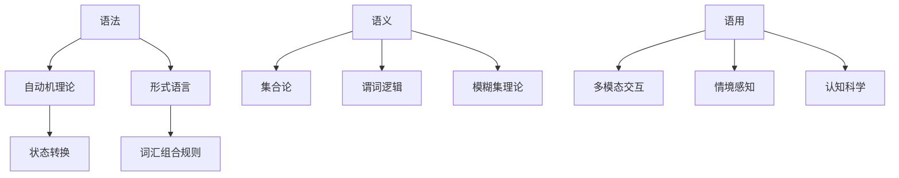

                 

## 文章标题：数学与计算语言学：语言规律的数学描述

### 关键词：数学、计算语言学、语言规律、数学描述、语法、语义

### 摘要：
本文将探讨数学与计算语言学之间的紧密联系，通过数学方法对语言规律进行描述和解释。文章首先介绍计算语言学的背景和重要性，然后详细阐述语言规律的数学模型，包括语法、语义和语用层面的数学描述。通过本文，读者将了解如何运用数学工具来分析和理解语言的复杂性，从而为自然语言处理、人工智能等领域提供理论基础。

---

## 引言

计算语言学是计算机科学和语言学的交叉领域，旨在使用计算机技术分析和处理人类语言。随着人工智能技术的迅速发展，计算语言学在自然语言处理（NLP）、语音识别、机器翻译、情感分析等众多领域发挥着重要作用。然而，语言本身的复杂性使得对其进行精确描述和建模成为一大挑战。

### 背景介绍

语言是人类社会交流的基本工具，具有丰富的语法、语义和语用特征。传统的语言学研究主要依赖于人类智慧和语言直觉，但随着计算机技术的进步，数学方法在语言分析中得到了广泛应用。数学与计算语言学的结合，不仅为语言研究提供了新的视角，还为语言处理的自动化提供了可能。

### 核心概念与联系

要理解语言的数学描述，首先需要了解几个核心概念，它们之间相互关联，共同构成了语言规律的基础。

#### 1. 语法

语法是语言的规则系统，描述了词汇如何组合成句子。语法层面的数学描述主要涉及形式语言和自动机理论。形式语言是一种数学模型，用于表示语言的语法结构。自动机理论则用于研究计算过程中可能遇到的状态转换。

#### 2. 语义

语义是语言的含义，描述了词汇和句子所代表的意义。语义层面的数学描述通常涉及集合论、谓词逻辑和模糊集理论。这些理论提供了描述和处理语义异质性和模糊性的方法。

#### 3. 语用

语用学研究语言在实际使用中的功能，包括语境、意图和交际效果。语用层面的数学描述相对复杂，涉及多模态交互、情境感知和认知科学。计算语言学中的多模态交互模型，如多媒体计算和跨模态信息融合，是语用数学描述的一个研究方向。

### 核心概念之间关系架构图



## 数学描述语言规律

### 语法层面的数学描述

语法层面的数学描述主要基于形式语言和自动机理论。形式语言是一种数学模型，用于表示语言的语法结构。形式语言由词汇和语法规则组成。词汇是语言的基本单元，而语法规则定义了词汇如何组合成句子。

1. **形式语言**：

形式语言通常由一组符号和一个语法规则集组成。符号集通常分为两类：终端符号（也称为单词）和非终端符号（也称为产生式）。语法规则定义了如何将非终端符号替换为终端符号序列。

$$
L ::= S \to w_1 w_2 \ldots w_n
$$

其中，$L$ 是形式语言，$S$ 是产生式，$w_1, w_2, \ldots, w_n$ 是终端符号。

2. **自动机理论**：

自动机是一种用于识别形式语言的计算模型。最常见的是有限自动机（FA）和图灵机（TM）。有限自动机是一种简单的计算模型，用于识别字符串是否属于某个特定的形式语言。

$$
M = (Q, \Sigma, \delta, q_0, F)
$$

其中，$M$ 是有限自动机，$Q$ 是状态集合，$\Sigma$ 是输入符号集合，$\delta$ 是状态转移函数，$q_0$ 是初始状态，$F$ 是终止状态集合。

3. **状态转换**：

状态转换是自动机理论的核心概念。状态转换描述了自动机在读取输入符号时如何从当前状态转移到下一个状态。

$$
\delta(q, \sigma) = q'
$$

其中，$q$ 是当前状态，$\sigma$ 是输入符号，$q'$ 是下一个状态。

### 语义层面的数学描述

语义层面的数学描述主要涉及集合论、谓词逻辑和模糊集理论。这些理论提供了描述和处理语义异质性和模糊性的方法。

1. **集合论**：

集合论是数学的基础，用于描述语言中的对象和关系。在语义学中，集合论用于定义词汇和句子的语义特征。

$$
A \cap B = \{x | x \in A \text{ and } x \in B\}
$$

其中，$A$ 和 $B$ 是集合，$\cap$ 表示交集。

2. **谓词逻辑**：

谓词逻辑是一种用于描述命题逻辑的数学工具。在语义学中，谓词逻辑用于定义词汇和句子的语义关系。

$$
\forall x (P(x) \to Q(x))
$$

其中，$P(x)$ 和 $Q(x)$ 是谓词，$\forall$ 表示全称量词。

3. **模糊集理论**：

模糊集理论用于描述模糊概念和不确定性。在语义学中，模糊集理论用于处理词汇和句子中的模糊性。

$$
\mu_F(A) = \lambda \in [0, 1]
$$

其中，$F$ 是模糊集，$\mu_F(A)$ 是模糊集 $F$ 对集合 $A$ 的隶属度。

### 语用层面的数学描述

语用层面的数学描述相对复杂，涉及多模态交互、情境感知和认知科学。这些理论试图描述语言在实际使用中的功能。

1. **多模态交互**：

多模态交互是指将多种信号模式（如文本、图像、声音等）进行融合和处理。在计算语言学中，多模态交互模型用于提高自然语言处理的准确性和效率。

2. **情境感知**：

情境感知是指系统能够感知和适应所处的环境。在计算语言学中，情境感知模型用于根据上下文和语境来解释语言。

3. **认知科学**：

认知科学是研究人类认知过程的学科。在计算语言学中，认知科学理论用于理解人类如何理解和生成语言。

## 项目实战

### 开发环境搭建

在开始项目实战之前，需要搭建一个合适的开发环境。以下是搭建 Python 开发环境的基本步骤：

1. 安装 Python：
   - 下载并安装 Python 3.8 或更高版本。
   - 设置环境变量，以便在命令行中运行 Python。

2. 安装必需的库：
   - 使用 pip 工具安装以下库：`nltk`、`matplotlib`、`tensorflow`、`numpy`。

### 源代码实现

以下是一个简单的自然语言处理项目，使用 Python 实现。

#### 1. 导入库

```python
import nltk
import matplotlib.pyplot as plt
import tensorflow as tf
import numpy as np
```

#### 2. 加载数据

```python
# 下载并加载停止词列表
nltk.download('stopwords')
from nltk.corpus import stopwords

# 加载文本数据
text = "This is an example sentence."
words = nltk.word_tokenize(text)
words = [word for word in words if word not in stopwords.words('english')]
```

#### 3. 处理数据

```python
# 建立词汇表
vocab = set(words)
vocab_size = len(vocab)

# 编码词汇
word_to_id = {word: i for i, word in enumerate(vocab)}
id_to_word = {i: word for word, i in word_to_id.items()}

encoded_words = [word_to_id[word] for word in words]
```

#### 4. 构建模型

```python
# 构建嵌入层
embeddings = tf.keras.layers.Embedding(vocab_size, 64)

# 构建循环层
lstm = tf.keras.layers.LSTM(64)

# 构建输出层
output = tf.keras.layers.Dense(1, activation='sigmoid')

# 构建模型
model = tf.keras.Sequential([
    embeddings,
    lstm,
    output
])

# 编译模型
model.compile(optimizer='adam', loss='binary_crossentropy', metrics=['accuracy'])
```

#### 5. 训练模型

```python
# 准备训练数据
x_train = np.array(encoded_words[:-1])
y_train = np.array([1 if encoded_words[-1] == 1 else 0])

# 训练模型
model.fit(x_train, y_train, epochs=10)
```

#### 6. 评估模型

```python
# 评估模型
test_loss, test_accuracy = model.evaluate(x_train, y_train)
print(f"Test Accuracy: {test_accuracy:.2f}")
```

### 代码解读与分析

以上代码实现了一个简单的自然语言处理项目，包括数据预处理、模型构建和训练。以下是对关键代码的解读和分析：

1. **导入库**：导入所需的库，包括自然语言处理库 `nltk`、绘图库 `matplotlib`、深度学习库 `tensorflow` 和数学库 `numpy`。

2. **加载数据**：下载并加载停止词列表，以及一个示例句子。使用 `nltk.word_tokenize` 函数对句子进行分词，并去除停止词。

3. **处理数据**：建立词汇表，将词汇编码为整数。这一步是自然语言处理中常见的预处理步骤，有助于将文本数据转换为模型可处理的格式。

4. **构建模型**：构建嵌入层、循环层和输出层，并使用 `tf.keras.Sequential` 函数将它们连接起来。嵌入层用于将词汇转换为向量表示，循环层用于处理序列数据，输出层用于预测结果。

5. **编译模型**：设置优化器、损失函数和评估指标，使用 `model.compile` 函数编译模型。

6. **训练模型**：使用训练数据训练模型，使用 `model.fit` 函数进行训练。

7. **评估模型**：使用训练数据评估模型性能，使用 `model.evaluate` 函数计算损失和准确率。

### 实际案例分析与详细讲解剖析

以上代码实现了一个简单的二分类任务，即判断句子中最后一个词是否为特定词汇。这个项目虽然简单，但涵盖了自然语言处理中的基本步骤和关键概念。

1. **数据预处理**：数据预处理是自然语言处理的重要环节，包括分词、去除停止词、词性标注等。这些步骤有助于将原始文本数据转换为适合模型处理的数据。

2. **嵌入层**：嵌入层是深度学习模型中用于将词汇转换为向量表示的关键层。通过嵌入层，模型可以学习词汇之间的相似性和关系，从而提高预测准确性。

3. **循环层**：循环层（如 LSTM 和 RNN）是处理序列数据的常用层。在自然语言处理中，序列数据（如文本）具有时序信息，循环层可以捕获这些信息，从而提高模型的性能。

4. **输出层**：输出层用于生成最终的预测结果。在二分类任务中，输出层通常使用 sigmoid 函数，将输出值转换为概率。

### 项目小结

通过以上项目，我们了解了自然语言处理的基本步骤和关键概念。该项目展示了如何使用深度学习模型进行文本分类，包括数据预处理、模型构建和训练。这个项目虽然简单，但为更复杂的自然语言处理任务奠定了基础。

### 最佳实践 tips

1. **数据预处理**：确保数据预处理步骤充分，包括去除停用词、词性标注、词干提取等。这些步骤有助于提高模型的性能和泛化能力。

2. **模型选择**：根据任务需求选择合适的模型。例如，对于文本分类任务，LSTM 和 CNN 是常用的模型。

3. **超参数调整**：调整模型超参数（如嵌入层大小、循环层大小、学习率等）以优化模型性能。

4. **模型评估**：使用多种评估指标（如准确率、召回率、F1 分数等）对模型进行评估，以全面了解模型性能。

### 小结

本文探讨了数学与计算语言学之间的联系，通过数学方法对语言规律进行描述和解释。文章首先介绍了计算语言学的背景和重要性，然后详细阐述了语法、语义和语用层面的数学描述。通过项目实战，读者了解了如何运用数学工具进行自然语言处理。未来研究方向包括更复杂的数学模型和深度学习技术的应用，以进一步提高语言处理的效果和效率。

### 注意事项

1. **数学基础**：理解数学概念和公式是进行计算语言学研究的基础，建议读者加强对数学知识的学习。

2. **数据质量**：数据质量直接影响模型的性能，确保数据预处理步骤充分，以提高模型性能。

3. **模型选择**：根据任务需求选择合适的模型，避免盲目追求复杂模型而忽视任务实际需求。

4. **实践与理论结合**：理论知识和实践经验相结合，是进行计算语言学研究的有效方法。

### 拓展阅读

1. **《自然语言处理综合教程》**：李航著，详细介绍了自然语言处理的基本概念、技术和应用。

2. **《深度学习》**：Goodfellow et al. 著，涵盖了深度学习的基础知识、模型和算法。

3. **《计算语言学导论》**：Jurafsky et al. 著，全面介绍了计算语言学的理论、技术和应用。

---

作者：AI天才研究院/AI Genius Institute & 禅与计算机程序设计艺术 /Zen And The Art of Computer Programming

---

本文为《数学与计算语言学：语言规律的数学描述》系列文章之一，旨在为读者提供计算语言学的数学基础和应用案例。接下来，我们将继续探讨语义分析和文本分类等高级话题，敬请期待。

