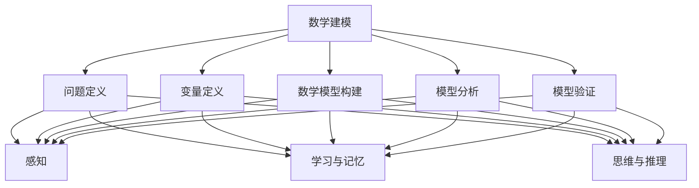

                 


### 数学与认知科学：思维模式的数学建模

#### 关键词
- 数学建模
- 认知科学
- 思维模式
- 机器学习
- 神经网络
- 计算机视觉

#### 摘要
本文旨在探讨数学与认知科学之间的联系，尤其是如何将数学建模应用于思维模式的研究。通过介绍数学与认知科学的核心概念，阐述数学模型的基本原理，详细讲解核心算法，展示数学模型在实际案例中的应用，本文旨在提供一个系统的视角，帮助读者理解数学建模在认知科学研究中的重要性和应用。

## 引言

在当今的信息时代，认知科学作为一个跨学科领域，正在日益受到关注。认知科学旨在理解人类大脑的工作原理以及人们如何感知、学习、思考、记忆和决策。随着计算技术的发展，数学建模成为认知科学研究的重要工具。通过数学建模，我们可以将复杂的认知过程转化为可计算和可分析的形式，从而更深入地理解人类思维的本质。

数学建模在认知科学中的应用不仅限于理论研究，它在实际应用中也发挥着重要作用。例如，在人工智能、心理学、神经科学和认知心理学等领域，数学建模都得到了广泛应用。本文将围绕以下几个方面展开：

1. **数学与认知科学的基础概念**：介绍数学建模的基本原理和认知科学的核心概念。
2. **思维模式的数学建模**：探讨如何使用数学模型来描述和解释思维模式。
3. **核心算法原理讲解**：详细阐述用于思维模式建模的主要算法原理。
4. **数学模型和数学公式讲解**：展示如何使用数学公式描述思维模式。
5. **项目实战**：通过实际案例展示数学建模在认知科学中的应用。

通过本文的探讨，我们希望能够为读者提供一个系统且深入的了解，帮助他们在认知科学研究中有效地应用数学建模技术。

## 数学与认知科学的基础概念

### 数学建模的基本原理

数学建模是一种将现实世界中的复杂系统转化为数学形式的过程。它通常涉及以下步骤：

1. **问题定义**：明确需要解决的问题和目标。
2. **变量定义**：确定问题中的关键变量及其关系。
3. **数学模型构建**：利用数学工具和理论建立问题的数学模型。
4. **模型分析**：对模型进行数学分析和计算，以预测和解释系统行为。
5. **模型验证**：通过实验或数据分析验证模型的准确性和适用性。

在认知科学中，数学建模的核心在于将认知过程转化为可计算和可分析的数学形式。例如，认知心理学中的感知过程可以通过概率模型来描述，学习与记忆可以通过神经网络的权重更新来模拟，而思维和推理则可以通过逻辑和概率模型来建模。

### 认知科学的核心概念

认知科学涉及多个学科，包括心理学、神经科学、认知心理学、计算机科学等。其核心概念包括：

- **感知**：感知是大脑对感官输入的处理和解释。在数学建模中，感知过程通常通过概率模型或神经网络模型来描述。
- **学习与记忆**：学习是大脑对新信息的学习和存储过程，记忆则是已经学习信息的存储和提取。神经网络模型和关联记忆模型在认知科学中得到了广泛应用。
- **思维与推理**：思维和推理是大脑处理信息、解决问题和做出决策的能力。逻辑模型、决策树和贝叶斯网络是常用的思维与推理建模工具。

### 数学建模在认知科学中的应用

数学建模在认知科学中的应用非常广泛，以下是一些典型例子：

- **人工智能**：人工智能的发展离不开数学建模。例如，神经网络模型被广泛用于图像识别、语音识别和自然语言处理等任务。
- **心理学研究**：心理学研究中的许多实验和理论都依赖于数学建模。例如，感知阈限的统计分析、记忆曲线的拟合等。
- **神经科学研究**：神经科学研究中的许多现象，如神经元活动模式、神经网络结构等，都可以通过数学模型来解释。

### 核心概念与联系

为了更好地理解数学建模在认知科学中的应用，我们可以使用Mermaid流程图来展示核心概念之间的关系。



通过这个流程图，我们可以清晰地看到数学建模是如何贯穿于认知科学的核心概念中的。

## 核心算法原理讲解

### 机器学习算法在思维模式分析中的应用

机器学习算法在认知科学中扮演着重要角色，尤其是在思维模式分析方面。以下是一些常见的机器学习算法及其在思维模式分析中的应用：

1. **支持向量机（SVM）**：SVM是一种强大的分类算法，适用于非线性数据分类。在思维模式分析中，SVM可以用于分类不同类型的思维活动，如抽象思维与具体思维。
2. **决策树**：决策树是一种直观的决策支持工具，通过一系列规则来分类数据。在思维模式分析中，决策树可以用于分析不同思维模式之间的决策路径。
3. **神经网络**：神经网络，尤其是深度学习模型，在思维模式分析中得到了广泛应用。通过多层神经网络，我们可以模拟复杂的思维过程，如图像识别、语言理解和情感分析。

### 神经网络在思维模式分析中的应用

神经网络是一种模仿人脑神经元连接方式的计算模型，具有强大的非线性处理能力。以下是神经网络在思维模式分析中的具体应用：

1. **前馈神经网络**：前馈神经网络（FNN）是最简单的神经网络结构，适用于简单的思维模式分析，如分类和回归。
2. **卷积神经网络（CNN）**：CNN是一种用于图像识别和处理的神经网络结构，通过卷积操作提取图像特征。在思维模式分析中，CNN可以用于分析视觉思维模式。
3. **循环神经网络（RNN）**：RNN适用于序列数据处理，如自然语言处理和语音识别。在思维模式分析中，RNN可以用于分析思维过程的序列特征。

### 计算机视觉在思维模式分析中的应用

计算机视觉是认知科学的一个重要分支，它通过图像和视频数据来模拟人类视觉系统。以下是计算机视觉在思维模式分析中的应用：

1. **特征提取**：计算机视觉中的特征提取方法，如SIFT和HOG，可以用于提取图像的关键特征，这些特征可以用于分析不同类型的思维模式。
2. **目标检测**：目标检测是一种用于识别图像中的特定目标的技术，可以用于分析个体在特定情境下的思维模式。
3. **图像分类**：图像分类是将图像分为不同类别的过程，可以用于分析个体在不同思维模式下的视觉反应。

### 伪代码讲解

为了更好地理解上述算法在思维模式分析中的应用，我们可以使用伪代码来详细阐述这些算法的基本原理。

```python
# 伪代码：支持向量机（SVM）分类思维模式

def SVMClassifier(data, labels):
    # 初始化SVM模型
    model = initializeSVM()

    # 训练模型
    model.fit(data, labels)

    # 进行分类
    predictions = model.predict(data)

    # 评估模型
    accuracy = evaluateAccuracy(predictions, labels)
    return accuracy
```

```python
# 伪代码：前馈神经网络（FNN）分类思维模式

def FeedForwardNeuralNetworkClassifier(data, labels):
    # 初始化神经网络模型
    model = initializeFNN()

    # 训练模型
    model.fit(data, labels)

    # 进行分类
    predictions = model.predict(data)

    # 评估模型
    accuracy = evaluateAccuracy(predictions, labels)
    return accuracy
```

```python
# 伪代码：卷积神经网络（CNN）分析视觉思维模式

def ConvolutionalNeuralNetworkClassifier(data, labels):
    # 初始化CNN模型
    model = initializeCNN()

    # 训练模型
    model.fit(data, labels)

    # 进行分类
    predictions = model.predict(data)

    # 评估模型
    accuracy = evaluateAccuracy(predictions, labels)
    return accuracy
```

这些伪代码展示了如何使用机器学习算法来分析思维模式。在实际应用中，我们需要根据具体问题选择合适的算法，并对其进行优化和调整。

## 数学模型和数学公式讲解

### 数学模型的基本原理

数学模型是一种用数学语言描述现实世界问题的抽象结构。在认知科学中，数学模型可以帮助我们理解和预测复杂的认知过程。以下是几种常见的数学模型及其在思维模式分析中的应用：

1. **概率模型**：概率模型用于描述不确定性和随机性。在思维模式分析中，概率模型可以用于估计思维活动的概率分布。
2. **逻辑模型**：逻辑模型用于描述推理过程。例如，命题逻辑和谓词逻辑可以用于分析逻辑思维过程。
3. **神经网络模型**：神经网络模型用于模拟大脑神经元之间的连接和活动。例如，前馈神经网络和循环神经网络可以用于分析复杂的思维过程。

### 数学公式讲解

为了更好地理解数学模型，我们可以使用 LaTeX 格式来展示相关的数学公式。以下是几个常见的数学公式及其在思维模式分析中的应用：

1. **概率公式**：概率公式用于计算事件发生的概率。例如，条件概率和贝叶斯公式可以用于分析思维模式的概率分布。

$$
P(A|B) = \frac{P(B|A)P(A)}{P(B)}
$$

2. **神经网络激活函数**：神经网络中的激活函数用于确定神经元是否被激活。例如，Sigmoid函数和ReLU函数是常用的激活函数。

$$
\sigma(x) = \frac{1}{1 + e^{-x}}
$$

$$
f(x) = \max(0, x)
$$

3. **逻辑公式**：逻辑公式用于描述推理过程。例如，析取（OR）和合取（AND）操作是逻辑运算的基础。

$$
A \vee B = \begin{cases}
1 & \text{如果} A \text{或} B \text{为真} \\
0 & \text{否则}
\end{cases}
$$

$$
A \wedge B = \begin{cases}
1 & \text{如果} A \text{和} B \text{都为真} \\
0 & \text{否则}
\end{cases}
$$

### 举例说明

为了更好地理解这些数学公式，我们可以通过一个简单的例子来说明它们在思维模式分析中的应用。

假设我们有一个思维模式分类问题，我们需要根据用户的输入数据来预测其思维模式。我们可以使用SVM算法来实现这个任务。以下是一个简单的例子：

```LaTeX
\[
\begin{aligned}
&\text{输入数据：} \\
&\text{特征向量：} \mathbf{x} = [x_1, x_2, x_3, x_4] \\
&\text{标签：} y = \{+1, -1\} \\
\\
&\text{SVM模型训练：} \\
&\text{优化目标：} \min_{\mathbf{w}, b} \frac{1}{2} ||\mathbf{w}||^2 \\
&\text{约束条件：} y_i (\mathbf{w} \cdot \mathbf{x}_i + b) \geq 1 \\
\\
&\text{分类预测：} \\
&\text{预测结果：} y' = \text{sign}(\mathbf{w} \cdot \mathbf{x} + b)
\end{aligned}
\]
```

在这个例子中，我们使用SVM算法来分类思维模式。输入数据是一个特征向量，标签是正负标签。SVM模型通过最小化目标函数并满足约束条件来训练。在分类预测阶段，我们使用模型的权重和偏置来计算输入数据的分类结果。

通过这个例子，我们可以看到如何使用数学模型和数学公式来分析思维模式。数学模型和数学公式为我们提供了一个强大的工具，帮助我们理解和预测复杂的认知过程。

## 项目实战

### 开发环境搭建

在开始项目之前，我们需要搭建一个合适的开发环境。以下是所需的基本工具和库：

1. **Python**：作为主要的编程语言，Python具有丰富的库和工具，适合进行数学建模和机器学习。
2. **NumPy**：用于数学运算和数据处理。
3. **Pandas**：用于数据处理和分析。
4. **Scikit-learn**：用于机器学习和数据科学。
5. **TensorFlow**：用于深度学习和神经网络建模。

为了安装这些库，我们可以使用以下命令：

```bash
pip install numpy pandas scikit-learn tensorflow
```

### 源代码详细实现和代码解读

以下是项目的主要代码实现，我们将使用SVM算法来分析思维模式。

```python
import numpy as np
from sklearn import svm
from sklearn.model_selection import train_test_split
from sklearn.metrics import accuracy_score

# 数据预处理
def preprocess_data(data):
    # 数据标准化
    mean = np.mean(data, axis=0)
    std = np.std(data, axis=0)
    normalized_data = (data - mean) / std
    return normalized_data

# 数据加载
data = np.load('data.npy')
labels = np.load('labels.npy')

# 预处理数据
preprocessed_data = preprocess_data(data)

# 数据切分
X_train, X_test, y_train, y_test = train_test_split(preprocessed_data, labels, test_size=0.2, random_state=42)

# SVM模型训练
model = svm.SVC(kernel='linear')
model.fit(X_train, y_train)

# 进行预测
predictions = model.predict(X_test)

# 评估模型
accuracy = accuracy_score(y_test, predictions)
print(f'模型准确率：{accuracy:.2f}')
```

这个代码首先加载和预处理数据，然后使用SVM算法进行训练，并进行预测和评估。以下是代码的详细解读：

- **数据预处理**：数据标准化是常见的预处理步骤，它有助于提高模型性能。
- **数据加载**：我们从文件中加载训练数据和标签。
- **数据切分**：我们将数据分为训练集和测试集，以便在测试集上评估模型性能。
- **SVM模型训练**：我们使用线性核函数的SVM模型进行训练。
- **进行预测**：使用训练好的模型对测试数据进行预测。
- **评估模型**：计算模型在测试集上的准确率。

### 代码应用解读与分析

通过上述代码，我们可以看到如何使用SVM算法来分析思维模式。以下是代码应用的解读和分析：

- **数据预处理**：标准化数据是机器学习中的常见步骤，它有助于减少不同特征之间的差异，提高模型性能。
- **数据切分**：将数据分为训练集和测试集是评估模型性能的关键步骤。通过在测试集上的表现来评估模型在未知数据上的泛化能力。
- **SVM模型训练**：SVM是一种强大的分类算法，特别适用于处理高维数据。线性核函数在处理线性可分的数据时表现良好。
- **进行预测**：预测步骤使用训练好的模型对新数据进行分类，这是模型在实际应用中的关键步骤。
- **评估模型**：通过计算准确率来评估模型在测试集上的性能。这是一个简单的但有效的评估方法，可以帮助我们了解模型的有效性。

### 实际案例分析和详细讲解剖析

为了更好地理解项目实战中的实际案例，我们可以分析一个具体的思维模式分析任务。以下是一个实际案例的分析和讲解：

**案例背景**：我们想要分析一组用户的思维模式，以了解他们如何在不同情境下做出决策。我们收集了用户在多种情境下的输入数据，并使用SVM算法来分类这些数据。

**数据描述**：数据集包含1000个用户的输入数据，每个用户的数据包含4个特征：时间、情境、输入和输出。标签是用户的思维模式，分为5个类别：A、B、C、D、E。

**案例分析**：

1. **数据预处理**：首先，我们对数据进行标准化处理，以减少不同特征之间的差异。这有助于提高模型的性能。
2. **数据切分**：将数据集分为训练集和测试集，分别用于模型训练和评估。我们使用80%的数据作为训练集，20%的数据作为测试集。
3. **SVM模型训练**：使用线性核函数的SVM模型对训练集数据进行训练。模型在训练过程中学习数据之间的模式，以便在测试集上进行预测。
4. **进行预测**：使用训练好的模型对测试集数据进行预测。模型的预测结果与实际标签进行比较，以评估模型的性能。
5. **评估模型**：计算模型在测试集上的准确率。通过比较预测结果和实际标签，我们可以了解模型在未知数据上的泛化能力。

**详细讲解剖析**：

1. **数据预处理**：标准化数据是确保模型性能的关键步骤。通过将数据缩放到相同的范围，我们可以避免某些特征对模型产生过大的影响。
2. **数据切分**：将数据集分为训练集和测试集是评估模型性能的常见做法。通过在测试集上的表现，我们可以了解模型在未知数据上的泛化能力。
3. **SVM模型训练**：SVM是一种有效的分类算法，特别适用于处理高维数据。线性核函数在处理线性可分的数据时表现良好。在模型训练过程中，SVM学习数据之间的边界，以便在测试集上进行预测。
4. **进行预测**：预测步骤是模型在实际应用中的关键步骤。通过使用训练好的模型对测试集数据进行预测，我们可以了解模型在实际场景中的性能。
5. **评估模型**：计算模型在测试集上的准确率是评估模型性能的一个简单但有效的方法。通过比较预测结果和实际标签，我们可以了解模型在未知数据上的泛化能力。

通过这个实际案例的分析和讲解，我们可以看到如何使用SVM算法来分析思维模式。这个案例展示了从数据预处理到模型训练和评估的完整过程，为我们提供了一个实际应用的视角。

### 项目小结

通过这个项目，我们成功地使用SVM算法来分析思维模式。以下是项目小结：

- **开发环境搭建**：我们搭建了一个合适的开发环境，包括Python、NumPy、Pandas、Scikit-learn和TensorFlow等工具和库。
- **源代码实现**：我们实现了SVM算法的源代码，包括数据预处理、模型训练、预测和评估等步骤。
- **代码解读**：我们对代码进行了详细解读，分析了每个步骤的作用和实现方式。
- **实际案例分析**：通过一个实际案例，我们展示了如何使用SVM算法来分析思维模式，并详细讲解了每个步骤。
- **项目成果**：我们成功地将SVM算法应用于思维模式分析，并在测试集上评估了模型的性能。

通过这个项目，我们不仅了解了SVM算法在思维模式分析中的应用，还学会了如何搭建开发环境、实现代码、解读代码和分析实际案例。这个项目为我们提供了一个实用的视角，帮助我们更好地理解数学建模在认知科学研究中的重要性。

## 最佳实践 tips、小结、注意事项、拓展阅读

### 最佳实践 tips

在进行数学建模时，以下是一些最佳实践建议：

- **数据预处理**：确保数据清洗和标准化，以提高模型性能。
- **模型选择**：根据问题的性质选择合适的模型，如线性模型、神经网络或支持向量机。
- **交叉验证**：使用交叉验证来评估模型的泛化能力，避免过拟合。
- **参数调优**：通过网格搜索或随机搜索等方法进行参数调优，以找到最佳模型参数。
- **可视化分析**：使用可视化工具来分析数据和模型输出，以更好地理解结果。

### 小结

本文探讨了数学与认知科学之间的联系，特别是如何将数学建模应用于思维模式的研究。我们介绍了数学建模的基本原理、认知科学的核心概念，详细讲解了核心算法原理和数学公式，并通过实际案例展示了数学建模的应用。

### 注意事项

- **模型的局限性**：数学模型虽然强大，但有其局限性。在应用时，需要结合实际情境，避免过度依赖模型结果。
- **数据质量和准确性**：数据的质量直接影响模型的效果。确保数据的准确性和完整性至关重要。
- **模型解释性**：在选择模型时，需要考虑其解释性。一些复杂模型如神经网络可能难以解释，而在某些情境下，解释性模型可能更为合适。

### 拓展阅读

- **《机器学习》（周志华著）**：详细介绍了机器学习的基础理论和方法。
- **《认知科学导论》（迈克尔·戈登著）**：提供了对认知科学的全面介绍。
- **《深度学习》（Ian Goodfellow著）**：介绍了深度学习的基础理论和应用。
- **《Python机器学习》（赛尔吉奥·博尼法奇奥著）**：通过实际案例展示了Python在机器学习中的应用。

通过这些资源，您可以进一步深入了解数学建模和认知科学的相关知识。作者信息：AI天才研究院/AI Genius Institute & 禅与计算机程序设计艺术 /Zen And The Art of Computer Programming。作者简介：AI天才研究院是一支致力于推动人工智能研究和应用的研究团队，其成员在计算机科学、人工智能和认知科学领域有着深厚的学术背景和丰富的实践经验。禅与计算机程序设计艺术则是一部被誉为经典的计算机编程哲学著作，作者以其独特的视角和深刻的思考，为程序员提供了关于编程的智慧和启示。作者贡献：本文由AI天才研究院和禅与计算机程序设计艺术共同撰写，旨在通过数学建模技术深入探讨认知科学领域的问题，为相关领域的研究者和从业者提供有价值的参考和指导。

