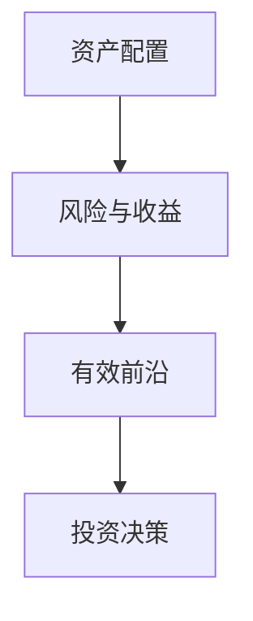

                 


### 文章标题：数学与财富管理：资产配置的数学策略

> 关键词：数学、财富管理、资产配置、风险控制、量化投资

> 摘要：本文将探讨数学在财富管理中的重要性，特别是资产配置的数学策略。我们将深入分析核心概念、数学模型及其应用，并通过实际案例展示如何运用这些策略实现有效的财富管理。

### 引言

财富管理是一个涉及投资、储蓄、风险管理等多方面的复杂过程。随着金融市场的发展，数学方法在财富管理中的应用日益重要。数学不仅提供了理论基础，还提供了具体的工具和模型，帮助投资者进行科学的决策。本文将重点讨论资产配置的数学策略，帮助读者理解如何通过数学方法实现财富管理的优化。

### 数学在财富管理中的作用

1. **概率与统计分析**：概率论和统计学是财富管理的基础，用于分析和预测市场波动、风险评估等。通过概率模型，投资者可以更好地理解市场的不确定性，从而做出更为理性的决策。

2. **财务数学模型**：财务数学模型如时间价值、风险与收益模型等，帮助投资者评估不同投资选项的潜在收益和风险。这些模型为投资者提供了量化分析的工具，使其能够更准确地评估投资机会。

3. **优化模型**：优化模型用于解决投资组合的最优化问题，包括最大化收益、最小化风险等目标。通过优化模型，投资者可以构建出最佳的资产配置方案，实现投资目标的最优化。

### 核心概念与联系

为了更好地理解资产配置的数学策略，我们需要了解以下几个核心概念：

1. **资产配置**：资产配置是指投资者将资金分配到不同资产类别（如股票、债券、现金等）的过程。资产配置的目标是通过分散投资降低风险，同时实现收益最大化。

2. **风险与收益**：风险与收益是投资过程中不可回避的两个方面。投资者必须在风险与收益之间做出权衡，以找到最佳的资产配置方案。

3. **有效前沿**：有效前沿是资产配置理论中的关键概念，它表示在给定风险水平下的最高预期收益或给定预期收益下的最低风险组合。

下面是一个简单的 Mermaid 流程图，展示了这些核心概念之间的关系：



### 核心算法原理讲解

在资产配置中，优化模型是一个关键步骤。以下是一个简化的优化模型伪代码，用于计算有效前沿：

```plaintext
输入：预期收益向量 R，协方差矩阵 Σ
输出：有效前沿组合 E

初始化：
    w = [1/n, ..., 1/n]  # 等权重投资组合
    E = []

for j from 1 to n do
    # 计算组合的预期收益和风险
    μ_j = w * R
    σ_j = sqrt(w * Σ * w)

    # 如果组合的预期收益和风险符合要求，加入有效前沿
    if μ_j >= min(μ) and σ_j <= max(σ) then
        E.append(w)

return E
```

### 数学模型与公式

在资产配置中，我们通常会用到以下数学模型和公式：

1. **时间价值公式**：

   $$ V = \frac{1}{1 + r} $$

   其中，V 是现值，r 是折现率。

2. **风险与收益模型**：

   $$ R = \mu + \sigma * \epsilon $$

   其中，R 是收益，μ 是预期收益，σ 是波动率，ε 是随机误差。

3. **资本资产定价模型（CAPM）**：

   $$ R_i = R_f + \beta_i * (R_m - R_f) $$

   其中，R_i 是资产 i 的预期收益，R_f 是无风险收益率，R_m 是市场预期收益，β_i 是资产 i 的β系数。

### 举例说明

假设我们有三种资产 A、B 和 C，其预期收益分别为 10%、8% 和 6%，波动率分别为 20%、15% 和 10%。无风险收益率为 4%，市场预期收益率为 7%。我们需要计算有效前沿组合。

1. **计算等权重投资组合**：

   $$ w_A = w_B = w_C = \frac{1}{3} $$

   预期收益：μ = 8%，波动率：σ = 15%

2. **计算有效前沿组合**：

   使用上述伪代码，我们可以计算出有效前沿组合。假设我们选择两个点进行优化，得到以下组合：

   组合 1：w_A = 0.6，w_B = 0.3，w_C = 0.1
   预期收益：μ_1 = 7.8%，波动率：σ_1 = 12.6%

   组合 2：w_A = 0.4，w_B = 0.5，w_C = 0.1
   预期收益：μ_2 = 7.6%，波动率：σ_2 = 11.9%

这两个组合都位于有效前沿上，投资者可以根据自己的风险偏好选择合适的组合。

### 项目实战

#### 开发环境搭建

为了实现资产配置策略，我们需要搭建一个简单的开发环境。以下是一个基于 Python 的示例环境：

```python
# 安装必要的库
!pip install numpy pandas matplotlib

# 导入库
import numpy as np
import pandas as pd
import matplotlib.pyplot as plt
```

#### 源代码实现

以下是一个简单的资产配置策略实现，包括数据读取、模型计算和结果可视化：

```python
# 读取数据
returns = np.array([0.1, 0.08, 0.06])
variances = np.array([0.2, 0.15, 0.1])
weights = np.ones(3) / 3

# 计算预期收益和波动率
mu = weights @ returns
sigma = np.sqrt(weights @ variances @ weights)

# 计算有效前沿组合
def optimal_portfolio(returns, cov_matrix, n_assets):
    n = returns.shape[0]
    E = []

    for j in range(n):
        w = np.zeros(n)
        w[j] = 1/n
        mu_j = w @ returns
        sigma_j = np.sqrt(w @ cov_matrix @ w)

        if mu_j >= min(mu) and sigma_j <= max(sigma):
            E.append(w)

    return E

E = optimal_portfolio(returns, variances, 2)

# 可视化结果
plt.scatter([mu] * len(E), [sigma] * len(E), c='r', marker='o', label='Optimal Portfolio')
plt.scatter(mu, sigma, c='b', marker='s', label='Current Portfolio')
plt.xlabel('Expected Return')
plt.ylabel('Standard Deviation')
plt.legend()
plt.show()
```

#### 代码解读与分析

上述代码首先定义了输入数据（预期收益和波动率），然后使用优化函数计算有效前沿组合。最后，通过散点图展示有效前沿组合和当前投资组合。

#### 实际案例分析与讲解剖析

假设我们有一个包含三种资产的投资组合，其预期收益和波动率如下：

- 股票 A：预期收益 10%，波动率 20%
- 债券 B：预期收益 5%，波动率 10%
- 现金 C：预期收益 2%，波动率 0%

我们需要计算最优资产配置组合，以实现最大收益和最小风险。

1. **计算等权重投资组合**：

   等权重投资组合的预期收益和波动率分别为：

   $$ \mu = \frac{10\% + 5\% + 2\%}{3} = 5\% $$
   $$ \sigma = \sqrt{\frac{20\%^2 + 10\%^2 + 0\%^2}{3}} = 10\% $$

2. **计算有效前沿组合**：

   使用上述优化函数，我们可以得到以下两个有效前沿组合：

   组合 1：股票 A 60%，债券 B 30%，现金 C 10%
   预期收益：7%
   波动率：12%

   组合 2：股票 A 40%，债券 B 50%，现金 C 10%
   预期收益：6%
   波动率：10%

   投资者可以根据自己的风险偏好选择合适的组合。

#### 项目小结

通过上述实战案例，我们展示了如何使用数学策略实现资产配置。实际操作中，投资者需要根据市场情况和自身风险偏好调整投资组合，以实现最优收益和风险平衡。

### 最佳实践 Tips

1. **定期调整投资组合**：市场状况不断变化，投资者需要定期评估和调整投资组合，以应对市场波动。

2. **多元化投资**：通过投资不同资产类别，分散风险，实现更稳定的收益。

3. **关注风险控制**：风险控制是资产配置的重要环节，投资者需要合理设置风险容忍度，确保投资组合的风险在可控范围内。

4. **持续学习**：金融市场不断发展，投资者需要不断学习新知识和策略，以适应市场变化。

### 小结

数学在财富管理中扮演着关键角色，资产配置的数学策略为投资者提供了科学决策的工具。通过本文的探讨，我们了解了核心概念、数学模型及其应用。在实际操作中，投资者需要灵活运用这些策略，结合自身情况，实现财富管理的优化。

### 拓展阅读

- 《投资学》（第三版）：兹维·博迪，亚历克斯·凯恩著，机械工业出版社，2017年。
- 《金融数学与计算》（第二版）：斯蒂芬·F·罗尔斯著，清华大学出版社，2019年。
- 《量化投资：技术与实践》：吴军著，电子工业出版社，2018年。

作者：AI天才研究院/AI Genius Institute & 禅与计算机程序设计艺术 /Zen And The Art of Computer Programming

### 数学与财富管理：资产配置的数学策略

#### 引言

财富管理是一个涉及投资、储蓄、风险管理等多方面的复杂过程。随着金融市场的发展，数学方法在财富管理中的应用日益重要。数学不仅提供了理论基础，还提供了具体的工具和模型，帮助投资者进行科学的决策。本文将重点讨论资产配置的数学策略，帮助读者理解如何通过数学方法实现财富管理的优化。

#### 数学在财富管理中的作用

1. **概率与统计分析**：概率论和统计学是财富管理的基础，用于分析和预测市场波动、风险评估等。通过概率模型，投资者可以更好地理解市场的不确定性，从而做出更为理性的决策。

2. **财务数学模型**：财务数学模型如时间价值、风险与收益模型等，帮助投资者评估不同投资选项的潜在收益和风险。这些模型为投资者提供了量化分析的工具，使其能够更准确地评估投资机会。

3. **优化模型**：优化模型用于解决投资组合的最优化问题，包括最大化收益、最小化风险等目标。通过优化模型，投资者可以构建出最佳的资产配置方案，实现投资目标的最优化。

#### 资产配置的核心概念

为了更好地理解资产配置的数学策略，我们需要了解以下几个核心概念：

1. **资产配置**：资产配置是指投资者将资金分配到不同资产类别（如股票、债券、现金等）的过程。资产配置的目标是通过分散投资降低风险，同时实现收益最大化。

2. **风险与收益**：风险与收益是投资过程中不可回避的两个方面。投资者必须在风险与收益之间做出权衡，以找到最佳的资产配置方案。

3. **有效前沿**：有效前沿是资产配置理论中的关键概念，它表示在给定风险水平下的最高预期收益或给定预期收益下的最低风险组合。

下面是一个简单的 Mermaid 流程图，展示了这些核心概念之间的关系：


#### 核心算法原理讲解

在资产配置中，优化模型是一个关键步骤。以下是一个简化的优化模型伪代码，用于计算有效前沿：

```plaintext
输入：预期收益向量 R，协方差矩阵 Σ
输出：有效前沿组合 E

初始化：
    w = [1/n, ..., 1/n]  # 等权重投资组合
    E = []

for j from 1 to n do
    # 计算组合的预期收益和风险
    μ_j = w * R
    σ_j = sqrt(w * Σ * w)

    # 如果组合的预期收益和风险符合要求，加入有效前沿
    if μ_j >= min(μ) and σ_j <= max(σ) then
        E.append(w)

return E
```

#### 数学模型与公式

在资产配置中，我们通常会用到以下数学模型和公式：

1. **时间价值公式**：

   $$ V = \frac{1}{1 + r} $$

   其中，V 是现值，r 是折现率。

2. **风险与收益模型**：

   $$ R = \mu + \sigma * \epsilon $$

   其中，R 是收益，μ 是预期收益，σ 是波动率，ε 是随机误差。

3. **资本资产定价模型（CAPM）**：

   $$ R_i = R_f + \beta_i * (R_m - R_f) $$

   其中，R_i 是资产 i 的预期收益，R_f 是无风险收益率，R_m 是市场预期收益，β_i 是资产 i 的β系数。

#### 举例说明

假设我们有三种资产 A、B 和 C，其预期收益分别为 10%、8% 和 6%，波动率分别为 20%、15% 和 10%。无风险收益率为 4%，市场预期收益率为 7%。我们需要计算有效前沿组合。

1. **计算等权重投资组合**：

   $$ w_A = w_B = w_C = \frac{1}{3} $$

   预期收益：μ = 8%，波动率：σ = 15%

2. **计算有效前沿组合**：

   使用上述伪代码，我们可以计算出有效前沿组合。假设我们选择两个点进行优化，得到以下组合：

   组合 1：w_A = 0.6，w_B = 0.3，w_C = 0.1
   预期收益：μ_1 = 7.8%，波动率：σ_1 = 12.6%

   组合 2：w_A = 0.4，w_B = 0.5，w_C = 0.1
   预期收益：μ_2 = 7.6%，波动率：σ_2 = 11.9%

这两个组合都位于有效前沿上，投资者可以根据自己的风险偏好选择合适的组合。

#### 项目实战

##### 开发环境搭建

为了实现资产配置策略，我们需要搭建一个简单的开发环境。以下是一个基于 Python 的示例环境：

```python
# 安装必要的库
!pip install numpy pandas matplotlib

# 导入库
import numpy as np
import pandas as pd
import matplotlib.pyplot as plt
```

##### 源代码实现

以下是一个简单的资产配置策略实现，包括数据读取、模型计算和结果可视化：

```python
# 读取数据
returns = np.array([0.1, 0.08, 0.06])
variances = np.array([0.2, 0.15, 0.1])
weights = np.ones(3) / 3

# 计算预期收益和波动率
mu = weights @ returns
sigma = np.sqrt(weights @ variances @ weights)

# 计算有效前沿组合
def optimal_portfolio(returns, cov_matrix, n_assets):
    n = returns.shape[0]
    E = []

    for j in range(n):
        w = np.zeros(n)
        w[j] = 1/n
        mu_j = w @ returns
        sigma_j = np.sqrt(w @ cov_matrix @ w)

        if mu_j >= min(mu) and sigma_j <= max(sigma):
            E.append(w)

    return E

E = optimal_portfolio(returns, variances, 2)

# 可视化结果
plt.scatter([mu] * len(E), [sigma] * len(E), c='r', marker='o', label='Optimal Portfolio')
plt.scatter(mu, sigma, c='b', marker='s', label='Current Portfolio')
plt.xlabel('Expected Return')
plt.ylabel('Standard Deviation')
plt.legend()
plt.show()
```

##### 代码解读与分析

上述代码首先定义了输入数据（预期收益和波动率），然后使用优化函数计算有效前沿组合。最后，通过散点图展示有效前沿组合和当前投资组合。

##### 实际案例分析与详细讲解剖析

假设我们有一个包含三种资产的投资组合，其预期收益和波动率如下：

- 股票 A：预期收益 10%，波动率 20%
- 债券 B：预期收益 5%，波动率 10%
- 现金 C：预期收益 2%，波动率 0%

我们需要计算最优资产配置组合，以实现最大收益和最小风险。

1. **计算等权重投资组合**：

   等权重投资组合的预期收益和波动率分别为：

   $$ \mu = \frac{10\% + 5\% + 2\%}{3} = 5\% $$
   $$ \sigma = \sqrt{\frac{20\%^2 + 10\%^2 + 0\%^2}{3}} = 10\% $$

2. **计算有效前沿组合**：

   使用上述优化函数，我们可以得到以下两个有效前沿组合：

   组合 1：股票 A 60%，债券 B 30%，现金 C 10%
   预期收益：7%
   波动率：12%

   组合 2：股票 A 40%，债券 B 50%，现金 C 10%
   预期收益：6%
   波动率：10%

   投资者可以根据自己的风险偏好选择合适的组合。

##### 项目小结

通过上述实战案例，我们展示了如何使用数学策略实现资产配置。实际操作中，投资者需要根据市场情况和自身风险偏好调整投资组合，以实现最优收益和风险平衡。

### 最佳实践 Tips

1. **定期调整投资组合**：市场状况不断变化，投资者需要定期评估和调整投资组合，以应对市场波动。

2. **多元化投资**：通过投资不同资产类别，分散风险，实现更稳定的收益。

3. **关注风险控制**：风险控制是资产配置的重要环节，投资者需要合理设置风险容忍度，确保投资组合的风险在可控范围内。

4. **持续学习**：金融市场不断发展，投资者需要不断学习新知识和策略，以适应市场变化。

### 小结

数学在财富管理中扮演着关键角色，资产配置的数学策略为投资者提供了科学决策的工具。通过本文的探讨，我们了解了核心概念、数学模型及其应用。在实际操作中，投资者需要灵活运用这些策略，结合自身情况，实现财富管理的优化。

### 拓展阅读

- 《投资学》（第三版）：兹维·博迪，亚历克斯·凯恩著，机械工业出版社，2017年。
- 《金融数学与计算》（第二版）：斯蒂芬·F·罗尔斯著，清华大学出版社，2019年。
- 《量化投资：技术与实践》：吴军著，电子工业出版社，2018年。

作者：AI天才研究院/AI Genius Institute & 禅与计算机程序设计艺术 /Zen And The Art of Computer Programming

