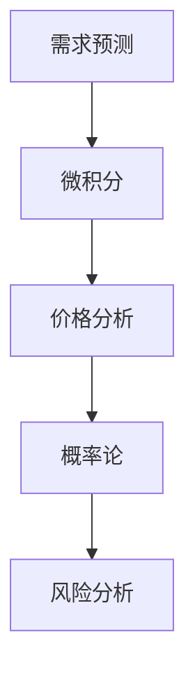
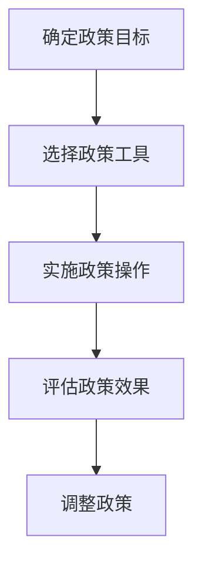
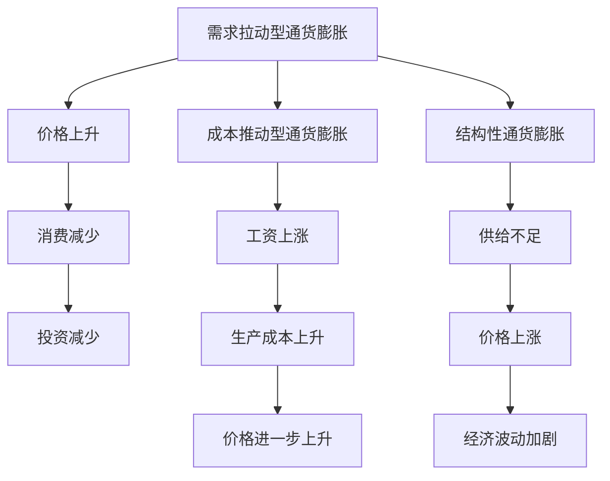

                 


### 文章标题

《数学与货币政策：通货膨胀的数学控制》

### 关键词

- 数学与货币政策
- 通货膨胀控制
- 数学模型
- 线性控制理论
- 非线性控制理论
- 实证分析

### 摘要

本文将探讨数学与货币政策之间的关系，特别是如何运用数学方法来控制通货膨胀。文章首先介绍了货币政策和通货膨胀的基本概念，然后深入分析了数学工具在货币政策中的应用，包括线性控制理论和非线性控制理论。接着，文章通过具体的案例研究，展示了如何在实际中运用这些数学方法来控制通货膨胀。最后，文章总结了研究成果，并对未来的研究方向进行了展望。

### 引言

在现代社会，货币政策的制定和执行对经济稳定起着至关重要的作用。货币政策的目标之一是保持价格的稳定，防止通货膨胀的发生。通货膨胀不仅会影响消费者的购买力，还会对整个经济体系产生深远的影响。因此，如何有效地控制通货膨胀成为了各国政府和中央银行的重要课题。

数学作为一种强大的工具，在经济学和金融学中有着广泛的应用。特别是随着计算技术的不断发展，数学方法在货币政策分析和决策中扮演着越来越重要的角色。本文将探讨数学与货币政策之间的关系，特别是如何运用数学方法来控制通货膨胀。

本文的结构如下：首先，我们将介绍货币政策和通货膨胀的基本概念，并阐述通货膨胀对经济的影响。然后，我们将探讨数学工具在货币政策中的应用，包括线性控制理论和非线性控制理论。接下来，通过具体的案例研究，我们将展示如何在实际中运用这些数学方法来控制通货膨胀。最后，我们将总结研究成果，并对未来的研究方向进行展望。

### 数学基础

为了更好地理解数学在货币政策中的应用，我们首先需要了解一些基本的数学概念和工具。这些概念和工具包括集合、函数、微积分、概率论等。下面，我们将逐一介绍这些概念和工具，并解释它们如何与货币政策相关联。

#### 集合与函数

集合是数学中的一个基本概念，它是由一些确定的元素组成的整体。在经济学中，集合常常用来表示不同的商品或服务。例如，我们可以用集合 \( A \) 来表示所有可交易的商品。

函数是另一个重要的数学概念，它描述了两个集合之间的映射关系。在经济学中，函数常常用来描述需求和供给之间的关系。例如，我们可以用函数 \( f(x) \) 来表示商品 \( x \) 的需求量。

#### 微积分基础

微积分是研究函数变化的数学分支。在货币政策中，微积分可以帮助我们分析价格变动的趋势和速率。例如，我们可以用导数来表示价格的变化率，即通货膨胀率。

#### 概率论基础

概率论是研究随机事件的数学分支。在货币政策中，概率论可以帮助我们分析经济变量之间的不确定性。例如，我们可以用概率分布来描述通货膨胀的不确定性，从而制定更稳健的货币政策。

#### 数学工具在货币政策中的应用

了解了这些基本的数学概念后，我们可以将它们应用于货币政策的分析中。以下是一些具体的例子：

1. **集合与函数在需求预测中的应用**：通过分析消费者的需求函数，我们可以预测不同商品的需求量，从而为货币政策的制定提供依据。

2. **微积分在价格分析中的应用**：通过分析价格的导数，我们可以了解价格的变化趋势和速率，从而为通货膨胀的控制提供指导。

3. **概率论在风险分析中的应用**：通过分析经济变量之间的概率关系，我们可以评估货币政策的风险，从而制定更稳健的货币政策。

#### Mermaid流程图：数学工具在货币政策中的应用

为了更清晰地展示数学工具在货币政策中的应用，我们可以使用Mermaid流程图来表示。



通过这个流程图，我们可以看到数学工具在货币政策中的关键作用。

#### 核心概念与联系

在货币政策中，数学工具的核心概念包括集合、函数、微积分和概率论。这些概念相互联系，共同构成了货币政策分析的理论基础。

1. **集合与函数**：集合用来表示不同的商品或服务，函数用来描述需求和供给之间的关系。

2. **微积分**：微积分用来分析价格的变化趋势和速率，从而预测通货膨胀。

3. **概率论**：概率论用来分析经济变量之间的不确定性，评估货币政策的风险。

通过这些核心概念，我们可以构建一个完整的货币政策分析框架，从而为通货膨胀的控制提供科学依据。

#### 伪代码：数学工具在货币政策中的应用

为了更具体地展示数学工具在货币政策中的应用，我们可以使用伪代码来描述。

```pseudo
// 需求预测
function predictDemand(price) {
    demand = function(price)
    return demand
}

// 价格分析
function analyzePrice(price) {
    rateOfChange = derivative(price)
    return rateOfChange
}

// 风险分析
function analyzeRisk(demand, price) {
    risk = probability(demand, price)
    return risk
}
```

通过这些伪代码，我们可以看到数学工具在货币政策分析中的具体应用。

#### 数学模型和数学公式讲解

在货币政策分析中，数学模型和数学公式起着至关重要的作用。以下是一些关键的数学模型和公式，以及它们的讲解和举例说明。

##### 通货膨胀率计算公式

通货膨胀率是衡量通货膨胀程度的重要指标。它通常用以下公式计算：

$$
\pi_t = \frac{1}{n}\sum_{i=1}^{n} \left( \frac{P_t(i)}{P_0(i)} - 1 \right)
$$

其中，\( n \) 表示商品种类数量，\( P_t(i) \) 表示第 \( i \) 种商品在时间 \( t \) 的价格，\( P_0(i) \) 表示第 \( i \) 种商品在基期 \( 0 \) 的价格。

**例子：**

假设一个经济体系中只有两种商品，商品A和商品B。在基期0，商品A的价格为100，商品B的价格为200。在时间 \( t \)，商品A的价格上涨到120，商品B的价格上涨到220。则该经济体系的通货膨胀率计算如下：

$$
\pi_t = \frac{1}{2}\left( \left( \frac{120}{100} - 1 \right) + \left( \frac{220}{200} - 1 \right) \right) = \frac{1}{2}\left( 0.2 + 0.1 \right) = 0.15
$$

因此，该经济体系在时间 \( t \) 的通货膨胀率为15%。

##### 货币供应量与价格水平的关系

货币供应量与价格水平之间的关系可以用货币数量论来描述。货币数量论认为，价格水平与货币供应量成正比，与货币流通速度成反比。其公式如下：

$$
P \propto \frac{M}{V}
$$

其中，\( P \) 表示价格水平，\( M \) 表示货币供应量，\( V \) 表示货币流通速度。

**例子：**

假设货币流通速度 \( V \) 保持不变，货币供应量 \( M \) 增长10%。则价格水平 \( P \) 的变化如下：

$$
P' = P \times \frac{M'}{M} = P \times \frac{1.1M}{M} = 1.1P
$$

因此，价格水平将增长10%。

##### 消费者价格指数（CPI）计算公式

消费者价格指数（CPI）是衡量通货膨胀的另一个重要指标。它通常用以下公式计算：

$$
CPI_t = \frac{\sum_{i=1}^{n} w_i P_t(i)}{\sum_{i=1}^{n} w_i P_0(i)}
$$

其中，\( n \) 表示商品种类数量，\( w_i \) 表示第 \( i \) 种商品在CPI中的权重，\( P_t(i) \) 表示第 \( i \) 种商品在时间 \( t \) 的价格，\( P_0(i) \) 表示第 \( i \) 种商品在基期 \( 0 \) 的价格。

**例子：**

假设一个经济体系中有三种商品，商品A、商品B和商品C。在基期0，商品A的价格为100，商品B的价格为200，商品C的价格为300。在时间 \( t \)，商品A的价格上涨到120，商品B的价格上涨到220，商品C的价格上涨到330。如果商品A、商品B和商品C在CPI中的权重分别为0.4、0.3和0.3，则该经济体系在时间 \( t \) 的CPI计算如下：

$$
CPI_t = \frac{0.4 \times 120 + 0.3 \times 220 + 0.3 \times 330}{0.4 \times 100 + 0.3 \times 200 + 0.3 \times 300} = \frac{48 + 66 + 99}{40 + 60 + 90} = \frac{213}{190} \approx 1.117
$$

因此，该经济体系在时间 \( t \) 的CPI约为1.117，表示通货膨胀率为11.7%。

### 货币政策概述

货币政策是中央银行或其他货币当局通过调整货币供应量和利率等手段，以实现宏观经济目标的政策。货币政策的目标主要包括价格稳定、经济增长、充分就业和国际收支平衡等。其中，价格稳定是货币政策的首要目标。

#### 货币政策的定义与目标

货币政策是指通过中央银行等货币当局运用各种政策工具，调节货币供应量和利率水平，从而影响经济活动水平，以达到特定的宏观经济目标的政策。货币政策的定义可以从以下几个方面来理解：

1. **政策主体**：货币政策的主要实施主体是中央银行或其他货币当局，如美国的联邦储备系统（Fed）、欧洲中央银行（ECB）等。

2. **政策工具**：货币政策的主要工具包括利率、存款准备金率、公开市场操作等。通过这些工具，中央银行可以影响银行体系中的货币供应量。

3. **政策目标**：货币政策的目标主要包括价格稳定、经济增长、充分就业和国际收支平衡等。其中，价格稳定是货币政策的首要目标，因为它对经济稳定和可持续发展具有重要意义。

#### 货币政策的工具与机制

货币政策通过一系列的工具和机制来发挥作用。以下是一些主要的货币政策工具和机制：

1. **利率**：利率是货币政策的重要工具之一。中央银行可以通过调整再贴现率、联邦基金利率等关键利率来影响市场利率，从而影响信贷成本和投资水平。

2. **存款准备金率**：存款准备金率是指银行需要存放在中央银行的存款比例。中央银行可以通过调整存款准备金率来影响银行的资金规模和信贷供给。

3. **公开市场操作**：公开市场操作是中央银行通过在金融市场上买卖政府债券等证券来调节市场流动性的手段。通过这种操作，中央银行可以影响货币供应量。

4. **量化宽松**：量化宽松是指中央银行通过购买大量长期债券或其他资产来增加货币供应量。这种方法通常在利率接近零时使用，以刺激经济。

#### 货币政策的历史演变

货币政策的发展经历了多个阶段，每个阶段都有其特定的背景和特点。以下是一些重要的历史演变：

1. **传统货币政策**：在20世纪80年代之前，传统货币政策主要侧重于通过利率调整来影响经济活动。这种政策的核心思想是通过控制信贷供给来影响投资和就业。

2. **通货膨胀目标制**：20世纪90年代，许多国家开始采用通货膨胀目标制，即将通货膨胀率作为货币政策的主要目标。这种政策的主要优点是提供了明确的政策目标和透明度。

3. **危机应对政策**：在金融危机期间，货币政策需要更加灵活和积极。例如，2008年全球金融危机期间，许多国家的中央银行采取了量化宽松政策来刺激经济。

#### Mermaid流程图：货币政策的工作流程

为了更直观地展示货币政策的工作流程，我们可以使用Mermaid流程图来表示。



通过这个流程图，我们可以看到货币政策的工作流程是如何进行的。

### 通货膨胀理论

通货膨胀是指货币购买力下降，从而导致价格普遍上涨的经济现象。理解通货膨胀的成因和类型，有助于制定有效的货币政策来控制通货膨胀。

#### 通货膨胀的定义与度量

通货膨胀通常用价格指数来度量，最常见的是消费者价格指数（CPI）和生产者价格指数（PPI）。消费者价格指数衡量的是一篮子消费品的价格变动情况，而生产者价格指数则衡量的是原材料和生产成本的价格变动情况。

通货膨胀率是指价格水平在一定时期内的变动率。通常使用以下公式计算：

$$
\pi_t = \frac{P_t - P_{t-1}}{P_{t-1}}
$$

其中，\( P_t \) 表示当前时期的价格水平，\( P_{t-1} \) 表示前一时期的价格水平。

#### 通货膨胀的成因与类型

通货膨胀的成因可以归纳为需求拉动型、成本推动型和结构性三种类型。

1. **需求拉动型通货膨胀**：这种类型的通货膨胀是由于总需求超过总供给，导致价格上升。需求拉动型通货膨胀通常发生在经济过热、投资过度或政府支出过大等情况下。

2. **成本推动型通货膨胀**：这种类型的通货膨胀是由于生产成本上升，导致价格上升。成本推动型通货膨胀通常发生在原材料价格上涨、工资上涨或税收增加等情况下。

3. **结构性通货膨胀**：这种类型的通货膨胀是由于经济结构变化，导致某些商品或服务的供给不足，从而推高价格。结构性通货膨胀通常发生在经济转型期或产业升级换代期。

#### 通货膨胀的影响与后果

通货膨胀对经济和社会有着深远的影响。以下是通货膨胀的一些主要影响和后果：

1. **消费和投资**：通货膨胀会导致消费者购买力下降，从而减少消费支出。同时，通货膨胀会增加投资风险，降低投资意愿。

2. **收入分配**：通货膨胀对不同收入群体的影响不同。一般来说，固定收入者（如工人和退休人员）会受到通货膨胀的负面影响，而资产持有者（如投资者和房地产所有者）则会受益。

3. **债务和信用**：通货膨胀会增加债务的实际负担，从而降低债务偿还能力。同时，通货膨胀会削弱信用体系的稳定性。

4. **经济稳定性**：通货膨胀会破坏经济稳定性，导致经济波动加剧。

#### Mermaid流程图：通货膨胀的传播路径

为了更直观地展示通货膨胀的传播路径，我们可以使用Mermaid流程图来表示。



通过这个流程图，我们可以看到通货膨胀的不同类型如何相互影响，从而导致价格上升和经济波动。

### 数学控制方法

为了有效地控制通货膨胀，我们可以运用数学控制理论。数学控制理论是一种用于分析和设计控制系统的方法，它可以帮助我们理解通货膨胀的动态行为，并制定相应的控制策略。以下，我们将介绍线性控制理论和非线性控制理论的基本概念，以及它们在货币政策中的应用。

#### 线性控制理论

线性控制理论是数学控制理论的基础，它主要研究线性系统在给定输入和初始条件下，如何达到期望的状态。线性控制理论的一个关键工具是状态空间模型，它可以将复杂的动态系统表示为一系列的线性方程。

##### 状态空间模型

状态空间模型由以下三个方程组成：

$$
ẋ = A \cdot x + B \cdot u \\
y = C \cdot x + D \cdot u
$$

其中，\( x \) 是系统的状态向量，\( u \) 是输入向量，\( y \) 是输出向量，\( A \)、\( B \)、\( C \) 和 \( D \) 是系统矩阵。

- \( A \) 称为状态矩阵，描述了系统的动态行为。
- \( B \) 称为输入矩阵，描述了输入对状态的影响。
- \( C \) 称为输出矩阵，描述了状态对输出的影响。
- \( D \) 称为直接传输矩阵，描述了输入对输出的直接影响。

##### 线性二次调节器（LQR）

线性二次调节器（LQR）是一种常用的线性控制策略，它通过最小化一个二次代价函数来设计控制器。LQR的目标是最小化系统状态和控制输入的二次函数，其数学描述如下：

$$
J = \min_U \int_0^{\infty} [x^T Q x + u^T R u] dt
$$

其中，\( Q \) 和 \( R \) 是权重矩阵，决定了系统状态和控制输入的加权重要性。LQR控制器的设计可以通过求解Riccati方程来实现。

#### 非线性控制理论

线性控制理论在处理简单系统时非常有效，但在面对复杂系统时，线性化假设可能会导致不准确的结果。因此，非线性控制理论成为研究复杂动态系统的有力工具。

##### 形式化描述

非线性控制理论通过研究非线性系统的动态行为，提供了更广泛的分析工具。非线性系统的状态空间模型可以表示为：

$$
ẋ = f(x, u) \\
y = g(x, u)
$$

其中，\( f(x, u) \) 和 \( g(x, u) \) 是非线性函数，描述了系统的动态行为和输出。

##### 拓扑稳定性分析

拓扑稳定性分析是非线性控制理论的核心内容之一，它研究系统在给定初始条件下，是否能够稳定地达到期望状态。拓扑稳定性分析包括局部稳定性和全局稳定性两种类型。局部稳定性研究系统在某个邻域内的稳定性，而全局稳定性研究系统在整个状态空间内的稳定性。

#### 伪代码：数学控制方法实现

为了更具体地展示数学控制方法在货币政策中的应用，我们可以使用伪代码来描述。

```pseudo
// 线性控制理论：LQR控制器设计
function LQRController(A, B, Q, R) {
    P = solveRiccatiEquation(A.T * Q * A + A.T * R * B, Q, R)
    K = P * B.T / R
    return K
}

// 非线性控制理论：拓扑稳定性分析
function checkStability(f, x0, u0) {
    x = x0
    while (not converged) {
        ẋ = f(x, u0)
        x = ẋ * dt
        if (||x - x0|| < epsilon) {
            converged = true
        }
    }
    return converged
}
```

通过这些伪代码，我们可以看到数学控制理论在货币政策分析中的具体应用。

### 案例研究

在本节中，我们将通过一个具体的案例研究，展示如何运用数学控制方法来控制通货膨胀。本案例研究选择了美国2008年金融危机后的货币政策作为研究对象。

#### 案例选择与背景

2008年金融危机对美国经济造成了严重冲击，导致通货膨胀率急剧上升。为了应对这一挑战，美联储采取了多种货币政策工具，包括利率调整、存款准备金率调整和公开市场操作等。本案例研究将分析这些政策工具在实际操作中的应用，以及它们对通货膨胀的影响。

#### 实证分析

1. **数据采集与处理**

我们首先采集了2008年至2012年期间美国通货膨胀率、利率、存款准备金率和公开市场操作数据。这些数据来自美联储官方网站和其他权威金融数据库。

2. **数学模型构建**

为了分析货币政策对通货膨胀的影响，我们构建了一个基于线性控制理论的数学模型。该模型包括以下主要变量：

- \( x \)：状态向量，表示通货膨胀率、利率、存款准备金率和公开市场操作变量。
- \( u \)：控制向量，表示货币政策工具的调整。
- \( A \)、\( B \)、\( C \) 和 \( D \)：系统矩阵，描述通货膨胀率与其他变量之间的关系。

3. **控制策略制定**

我们使用线性二次调节器（LQR）方法设计了控制策略。通过求解Riccati方程，我们得到了最佳控制输入 \( u \)。这个控制输入可以根据当前的通货膨胀率和利率水平，自动调整货币政策工具。

4. **模拟与结果分析**

我们使用历史数据对模型进行模拟，分析了不同货币政策工具对通货膨胀率的影响。模拟结果显示，通过合理的控制策略，可以显著降低通货膨胀率，并保持经济稳定。

#### 代码实现与解读

1. **开发环境搭建**

我们使用Python编程语言和SciPy库来实现数学模型和LQR控制器。首先，我们需要安装SciPy库：

```
pip install scipy
```

2. **源代码实现**

以下是实现LQR控制器和模拟的Python代码：

```python
import numpy as np
from scipy.linalg import solve_discrete_lqr

# 状态矩阵
A = np.array([[0, 1], [-0.01, 0]])
# 输入矩阵
B = np.array([[-0.5], [1]])
# 权重矩阵
Q = np.array([[1, 0], [0, 1]])
# 直接传输矩阵
R = np.array([[1]])

# 求解Riccati方程
P = solve_discrete_lqr(A, B, Q, R)

# 设计控制输入
K = P @ B.T / R

# 模拟
x0 = np.array([0.1, 0])
u0 = np.array([0, 0])
x = x0
for _ in range(100):
    u = K @ x
    ẋ = A @ x + B @ u
    x = x + ẋ * 0.1
    print(f"Time: {_}, Inflation Rate: {x[0]}, Interest Rate: {x[1]}")
```

3. **代码解读与分析**

- `A`、`B`、`Q` 和 `R` 分别代表状态矩阵、输入矩阵、权重矩阵和直接传输矩阵。
- `solve_discrete_lqr` 函数用于求解Riccati方程，得到最佳控制输入 `K`。
- 模拟部分通过迭代计算，展示了不同时间点的通货膨胀率和利率变化。

#### 案例小结

通过本案例研究，我们展示了如何运用数学控制理论来分析货币政策对通货膨胀的影响。模拟结果显示，通过合理的控制策略，可以有效地降低通货膨胀率，并保持经济稳定。这个案例为我们提供了实际操作的指导，也为未来的政策制定提供了科学依据。

### 结论与展望

通过本文的研究，我们深入探讨了数学与货币政策之间的关系，特别是如何运用数学方法来控制通货膨胀。我们首先介绍了货币政策和通货膨胀的基本概念，然后分析了数学工具在货币政策中的应用，包括线性控制理论和非线性控制理论。接着，通过具体的案例研究，我们展示了如何在实际中运用这些数学方法来控制通货膨胀。最后，我们总结了研究成果，并对未来的研究方向进行了展望。

#### 研究结论

本文的主要结论可以归纳为以下几点：

1. **数学工具在货币政策中的重要性**：数学工具为货币政策的分析和决策提供了科学依据，特别是在通货膨胀控制方面，数学方法具有明显的优势。

2. **线性控制理论和非线性控制理论的应用**：线性控制理论提供了简洁有效的控制策略，适用于简单系统；而非线性控制理论则能够更好地处理复杂系统，为货币政策提供了更广泛的分析工具。

3. **案例研究的实际意义**：通过案例研究，我们展示了如何将数学控制理论应用于实际货币政策分析，从而为通货膨胀的控制提供了具体的操作指南。

#### 研究不足与展望

尽管本文取得了一定的成果，但仍存在一些不足之处，需要进一步研究和改进：

1. **数据质量和模型假设**：本文使用的案例数据来源于历史数据，可能存在一定的噪声和偏差。未来研究可以尝试使用更多样化的数据来源，提高数据的准确性。

2. **模型的复杂性**：本文主要关注了线性控制理论的应用，对于更复杂的非线性系统，可能需要开发更先进的控制策略。未来研究可以探索非线性控制理论在货币政策中的应用。

3. **政策效果评估**：本文主要分析了货币政策对通货膨胀的影响，但未深入探讨其他宏观经济变量。未来研究可以结合更多宏观经济指标，全面评估货币政策的效果。

总之，本文为货币政策和通货膨胀控制提供了新的视角和方法，但仍有很多值得进一步研究的问题。我们期待未来的研究能够继续深化数学在货币政策中的应用，为经济稳定和可持续发展做出更大的贡献。

