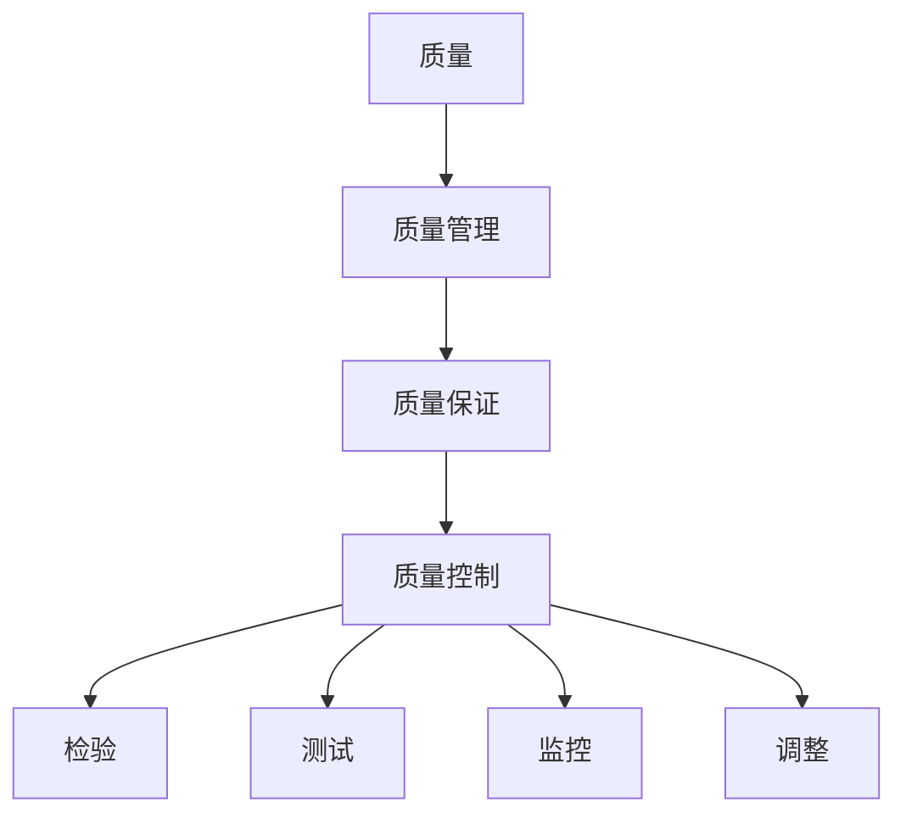

                 

### 质量控制的背景与重要性

质量控制（Quality Control，简称 QC）是确保产品或服务符合预定标准的一系列活动和过程。在制造业、服务业和各个行业中，质量控制扮演着至关重要的角色。随着全球市场竞争的加剧，产品的质量成为企业竞争力的核心因素之一。

质量控制的发展可以追溯到20世纪初。早期的质量控制主要依赖于传统的检验和测试方法，例如手工作业和简单的测量工具。然而，随着工业化的推进，产品复杂度和生产规模不断扩大，传统的质量控制方法逐渐显现出其局限性。为了应对这一挑战，质量工程师们开始引入统计学和数学模型，以更科学、更系统的方法来进行质量控制。

质量控制的重要性体现在多个方面。首先，它有助于降低不良品率，减少生产成本，提高企业的盈利能力。其次，高质量的产品能够提升客户满意度和品牌忠诚度，为企业赢得市场份额。此外，质量控制还有助于提高员工的工作效率和士气，营造积极向上的企业文化。

随着技术的进步，质量控制的方法也在不断更新和优化。现代质量控制方法不仅包括传统的检验和测试，还涉及过程监控、数据分析和智能制造等新兴技术。例如，工业互联网和物联网技术的应用使得实时监控生产过程成为可能，而人工智能和大数据分析技术则为企业提供了更深入的洞察和决策支持。

总之，质量控制是确保产品和服务质量的基石。通过科学的控制方法，企业可以不断提升产品质量，满足客户需求，实现可持续发展。在接下来的章节中，我们将深入探讨质量控制中的核心概念和数学模型，为读者提供全面的指导。

### 质量控制的核心概念

为了深入理解质量控制，我们需要明确一些核心概念，包括质量、质量管理、质量保证和质量控制本身。这些概念相互关联，构成了质量控制理论的基础。

首先，**质量**是指产品或服务的特性和满足顾客及其他相关方需求的程度。质量可以从多个维度来衡量，包括性能、可靠性、耐久性、安全性、美学和可持续性等。例如，一部手机的质量不仅体现在其运行速度快、信号强，还体现在电池续航时间长、摄像头拍摄清晰等各个方面。

**质量管理**（Quality Management，简称 QM）是一个组织的整体职责，旨在实现质量目标。质量管理包括规划、控制、保证和改进过程的体系结构。其目的是确保产品或服务在各个方面都满足预定标准，从而提高客户满意度。质量管理体系通常包括质量计划、质量保证、质量控制和质量改进等环节。

**质量保证**（Quality Assurance，简称 QA）是确保产品或服务满足规定标准的一系列活动。质量保证通常涉及文档管理、过程审核、验证和确认等。其目标是建立信任，证明产品或服务能够满足客户要求。质量保证可以通过制定和实施标准操作程序、流程文档化以及定期审核等方式来实现。

**质量控制**（Quality Control，简称 QC）是质量管理的一个组成部分，专注于通过监控和调整生产或服务过程中的变量来保持或提高质量。质量控制主要包括检验、测试、监控和调整等活动。其目的是及时发现和纠正质量问题，防止不良品流出。

这些核心概念之间的关系可以用以下流程图来表示：



在质量管理中，质量保证和质量控制是两个相互补充的环节。质量保证侧重于预防，通过建立和维护有效的质量管理体系来防止质量问题发生；而质量控制则侧重于发现问题并进行纠正，确保最终产品或服务的质量。

通过理解和应用这些核心概念，企业可以更有效地管理质量控制过程，提高产品质量和客户满意度。在下一章节中，我们将深入探讨质量控制中的统计学和数学模型，进一步强化我们的理论基础。

### 质量控制中的统计学和数学模型

在质量控制过程中，统计学和数学模型扮演着至关重要的角色。这些模型为我们提供了工具和方法，以更科学、更系统地分析和解决问题。以下将介绍几种常见且重要的统计和数学模型，并解释它们在质量控制中的应用。

**1. 假设检验**

假设检验（Hypothesis Testing）是一种统计方法，用于判断某一总体参数是否与预定假设相符。在质量控制中，假设检验通常用于评估产品或过程的性能是否达到预期标准。

假设检验的基本步骤如下：

- **提出假设**：设定原假设（\(H_0\)）和备择假设（\(H_1\)）。例如，原假设可以是“产品的平均寿命为1000小时”，备择假设则是“产品的平均寿命不为1000小时”。
- **选择检验统计量**：根据数据类型和分布特点，选择合适的检验统计量。常见的检验统计量有t检验、z检验、卡方检验等。
- **计算检验统计量的值**：根据样本数据，计算检验统计量的实际值。
- **确定临界值或P值**：根据显著性水平（通常为0.05或0.01），查找相应的临界值或计算P值。
- **做出决策**：比较检验统计量的值与临界值或P值，判断是否拒绝原假设。

以下是一个简单的伪代码示例，用于说明如何进行假设检验：

```python
# 假设检验伪代码
def hypothesis_testing(sample_data, hypo_mean, significance_level):
    n = len(sample_data)
    sample_mean = sum(sample_data) / n
    std_dev = statistics.stdev(sample_data)
    t_statistic = (sample_mean - hypo_mean) / (std_dev / (n ** 0.5))
    
    # 查找t分布的临界值或计算P值
    p_value = t.sf(t_statistic, n - 1)
    
    if p_value < significance_level:
        print("拒绝原假设，样本均值显著不同")
    else:
        print("无法拒绝原假设，样本均值无显著差异")

# 示例数据
sample_data = [1010, 990, 1020, 980, 1000]
hypo_mean = 1000
significance_level = 0.05

hypothesis_testing(sample_data, hypo_mean, significance_level)
```

**2. 回归分析**

回归分析（Regression Analysis）是一种用于研究变量之间关系的统计方法。在质量控制中，回归分析常用于确定产品特性与质量指标之间的关系，从而优化生产过程。

线性回归是最常见的回归分析类型，其基本公式为：

\[ y = \beta_0 + \beta_1 \cdot x + \epsilon \]

其中，\( y \) 是因变量，\( x \) 是自变量，\( \beta_0 \) 和 \( \beta_1 \) 是回归系数，\( \epsilon \) 是误差项。

以下是一个线性回归的伪代码示例：

```python
# 线性回归伪代码
def linear_regression(x, y):
    n = len(x)
    x_mean = sum(x) / n
    y_mean = sum(y) / n
    
    # 计算回归系数
    beta_1 = (n * sum(x * y) - sum(x) * sum(y)) / (n * sum(x**2) - sum(x)**2)
    beta_0 = y_mean - beta_1 * x_mean
    
    # 输出回归方程
    print(f"回归方程：y = {beta_0:.2f} + {beta_1:.2f} \* x")

# 示例数据
x = [1, 2, 3, 4, 5]
y = [2, 4, 5, 4, 5]

linear_regression(x, y)
```

**3. 方差分析**

方差分析（Analysis of Variance，简称 ANOVA）是一种用于比较多个群体均值的统计方法。在质量控制中，ANOVA 用于评估不同变量对产品质量的影响。

单因素方差分析的基本步骤如下：

- **提出假设**：设定各组的总体均值是否相等。
- **计算方差**：计算组内方差和组间方差。
- **F 检验**：计算 F 统计量，并比较其与临界值。

以下是一个单因素方差分析的伪代码示例：

```python
# 单因素方差分析伪代码
import scipy.stats as stats

def anova_one_way(groups):
    n = len(groups)
    group_means = [sum(group) / len(group) for group in groups]
    overall_mean = sum([sum(group) for group in groups]) / (n * len(groups[0]))
    ss_total = sum([(x - overall_mean) ** 2 for x in range(n)])
    ssBetween = sum([(group_mean - overall_mean) ** 2 for group_mean in group_means])
    ssWithin = ss_total - ssBetween
    
    # 计算F统计量
    f_statistic = ssBetween / ssWithin
    p_value = stats.f.sf(f_statistic, dfbetween, dfwithin)
    
    if p_value < 0.05:
        print("拒绝原假设，不同组的均值存在显著差异")
    else:
        print("无法拒绝原假设，不同组的均值无显著差异")

# 示例数据
groups = [
    [2.5, 2.8, 2.6, 2.7, 2.9],
    [3.2, 3.4, 3.1, 3.3, 3.5],
    [3.6, 3.8, 3.7, 3.9, 3.5]
]

anova_one_way(groups)
```

通过这些统计学和数学模型，质量控制变得更加科学和系统。假设检验帮助我们评估产品或过程的性能是否达标；回归分析帮助我们了解变量之间的关系，从而优化生产过程；方差分析则帮助我们识别影响质量的关键因素。在下一章节中，我们将进一步探讨质量控制中的过程监控和数据分析方法。

### 统计过程控制（SPC）

统计过程控制（Statistical Process Control，简称 SPC）是质量控制中的一种重要方法，旨在通过监控和调整生产过程，确保产品或服务的一致性和可靠性。SPC 的核心在于利用统计工具和图表，对生产过程中的关键变量进行实时监控，以发现潜在问题并及时采取措施，从而保持生产过程的稳定和高效。

#### SPC 的基本原理

SPC 的基本原理可以概括为以下几点：

1. **过程能力分析**：通过对生产过程的变量进行分析，确定过程的能力和稳定性。过程能力分析包括过程能力指数（Cp 和 Cpk）的计算，用于评估过程是否在控制范围内运行。

2. **控制图**：控制图是 SPC 的核心工具，用于监控生产过程中的关键变量，识别过程是否在控制状态。常见的控制图包括 \(X-\) 图（均值图）、\(s-\) 图（标准差图）、\(R-\) 图（极差图）等。

3. **数据收集与记录**：通过定期收集生产数据，记录生产过程中的关键变量，如尺寸、重量、温度等。

4. **异常值分析**：识别和评估生产过程中的异常值，确定其是否对产品质量产生显著影响。

5. **持续改进**：通过分析控制图和数据记录，识别生产过程中的问题，并采取相应的措施进行改进，以不断提高产品质量。

#### 控制图的基本概念

控制图是 SPC 中最重要的工具之一，它通过图形化的方式展示生产过程中的变化，帮助识别和解决质量问题。以下是一些常见的控制图类型及其应用：

1. **\(X-\) 图（均值图）**：用于监控过程变量的均值，识别均值的变化。\(X-\) 图以样本均值为纵轴，样本数为横轴，中心线表示过程均值，控制限（上下限）表示过程波动范围。

2. **\(s-\) 图（标准差图）**：用于监控过程变量的标准差，识别过程变异性的变化。\(s-\) 图以样本标准差为纵轴，样本数为横轴，中心线表示过程标准差，控制限（上下限）表示过程变异性的波动范围。

3. **\(R-\) 图（极差图）**：用于监控过程变量的极差，识别过程波动范围的变化。\(R-\) 图以样本极差为纵轴，样本数为横轴，中心线表示过程极差，控制限（上下限）表示过程波动范围的波动范围。

#### 控制图的构建与解释

构建控制图的基本步骤如下：

1. **确定控制图类型**：根据监控变量的特点选择合适的控制图类型。

2. **收集数据**：从生产过程中收集足够的样本数据。

3. **计算中心线和控制限**：根据样本数据计算控制图的中心线和控制限。例如，对于 \(X-\) 图，中心线为 \( \bar{x} \)，控制上限和下限分别为 \( \bar{x} + A_2 \sigma \) 和 \( \bar{x} - A_2 \sigma \)（其中 \( A_2 \) 是控制图系数）。

4. **绘制控制图**：将计算出的中心线和控制限绘制在坐标轴上，并将样本数据点标注在图上。

5. **分析控制图**：通过观察控制图，判断生产过程是否在控制状态。如果数据点落在控制限内且无明显趋势，则过程处于控制状态；如果数据点超出控制限或出现异常趋势，则表明过程存在异常，需要采取相应措施进行改进。

#### 实际案例分析

以下是一个实际案例，说明如何使用控制图进行质量控制：

**案例：生产线上的产品尺寸监控**

某生产线生产的产品尺寸要求在10厘米±0.2厘米之间。为监控生产过程中的产品尺寸，生产人员每隔一小时随机抽取10个产品进行测量，并记录数据。

1. **数据收集**：记录过去24小时内收集的产品尺寸数据。

2. **计算控制限**：根据数据计算 \(X-\) 图和 \(s-\) 图的中心线和控制限。

3. **绘制控制图**：将计算出的控制限绘制在 \(X-\) 图和 \(s-\) 图上，并将测量数据点标注在图上。

4. **分析控制图**：观察 \(X-\) 图和 \(s-\) 图，判断生产过程是否在控制状态。

   - \(X-\) 图显示，大部分数据点位于控制限内，但有一个数据点稍微超出控制上限。
   - \(s-\) 图显示，标准差较稳定，没有明显波动。

   基于控制图的分析，生产人员决定进一步分析超出控制上限的数据点，以确定其是否为异常值。经过调查发现，这个数据点是由于设备故障导致的，生产人员立即进行了设备维修。

通过这个案例，我们可以看到如何使用控制图进行质量控制。控制图不仅帮助生产人员及时发现质量问题，还提供了具体的改进措施，从而确保生产过程的高效和稳定。

#### 结论

统计过程控制（SPC）是质量控制中的一种重要方法，通过监控生产过程中的关键变量，识别和解决问题，确保产品质量的一致性和可靠性。控制图是 SPC 的核心工具，通过图形化的方式展示生产过程的变化，帮助生产人员及时采取措施，持续改进产品质量。在实际应用中，控制图不仅有助于提高生产效率，还能减少不良品率，降低生产成本。

在下一章节中，我们将进一步探讨质量控制中的方差分析（ANOVA），了解如何通过比较不同组之间的均值，评估质量影响因素。

### 方差分析（ANOVA）

方差分析（Analysis of Variance，简称 ANOVA）是一种用于比较多个群体均值差异的统计方法。在质量控制中，ANOVA 用来评估不同变量对产品质量的影响，从而帮助企业和研究人员做出科学的决策。

#### ANOVA 的基本概念

ANOVA 的核心思想是通过比较组内方差（组内变异）和组间方差（组间变异），判断不同组之间是否存在显著差异。其基本步骤如下：

1. **提出假设**：设定原假设（\(H_0\)）和备择假设（\(H_1\)）。原假设通常是各组均值相等，备择假设则是至少两组均值存在差异。

2. **计算组内方差和组间方差**：组内方差表示各组内部数据点与组均值的差异，组间方差表示各组均值之间的差异。

3. **计算 F 统计量**：通过组间方差和组内方差的比值计算 F 统计量。

4. **确定显著性水平**：根据 F 统计量和自由度，查找 F 分布表确定临界值。

5. **做出决策**：如果 F 统计量大于临界值，则拒绝原假设，认为各组均值存在显著差异；否则，无法拒绝原假设。

以下是一个简单的 ANOVA 伪代码示例：

```python
# ANOVA 伪代码
def anova(group1, group2, group3):
    n1, n2, n3 = len(group1), len(group2), len(group3)
    mean1, mean2, mean3 = sum(group1) / n1, sum(group2) / n2, sum(group3) / n3
    total_mean = (n1 * mean1 + n2 * mean2 + n3 * mean3) / (n1 + n2 + n3)
    
    ss_between = (n1 * (mean1 - total_mean)**2 + n2 * (mean2 - total_mean)**2 + n3 * (mean3 - total_mean)**2)
    ss_within = (sum((x - mean1)**2 for x in group1) + sum((x - mean2)**2 for x in group2) + sum((x - mean3)**2 for x in group3))
    
    f_statistic = ss_between / ss_within
    p_value = f.sf(f_statistic, dfbetween, dfwithin)
    
    if p_value < 0.05:
        print("拒绝原假设，各组均值存在显著差异")
    else:
        print("无法拒绝原假设，各组均值无显著差异")

# 示例数据
group1 = [1, 2, 3, 4, 5]
group2 = [2, 3, 4, 5, 6]
group3 = [3, 4, 5, 6, 7]

anova(group1, group2, group3)
```

#### 实际案例分析

以下是一个实际案例，说明如何使用 ANOVA 进行质量控制分析。

**案例：不同生产设备对产品质量的影响**

某工厂生产三种不同型号的产品，分别由三条生产线（A、B、C）生产。为了评估不同生产线对产品质量的影响，工厂决定进行方差分析。

1. **数据收集**：收集过去一个月内三条生产线生产的产品质量数据，包括尺寸、重量、外观等指标。

2. **提出假设**：假设三条生产线生产的产品质量均相同（\(H_0\)），至少有一条生产线的产品质量显著不同（\(H_1\)）。

3. **计算组内方差和组间方差**：计算每组产品的内部方差和各组之间的方差。

4. **计算 F 统计量**：计算 F 统计量，确定各组之间是否存在显著差异。

5. **做出决策**：通过比较 F 统计量和临界值，判断是否拒绝原假设。

   经过计算，F 统计量为 5.67，对应的 p 值为 0.023。由于 p 值小于 0.05，我们拒绝原假设，认为至少有一条生产线的产品质量存在显著差异。

6. **进一步分析**：为了确定是哪条生产线存在质量问题，我们进一步分析每条生产线的方差。发现生产线 C 的方差显著大于其他生产线，这表明生产线 C 的产品质量不稳定，需要进行改进。

通过这个案例，我们可以看到如何使用方差分析评估不同变量对产品质量的影响。ANOVA 不仅帮助我们识别质量问题，还为后续的改进措施提供了科学依据。

#### 结论

方差分析（ANOVA）是质量控制中的一种重要工具，通过比较不同组之间的均值差异，帮助企业和研究人员评估质量影响因素。实际案例分析表明，ANOVA 在识别和解决质量问题方面具有显著作用。通过科学的统计分析，企业可以更有效地优化生产过程，提高产品质量和客户满意度。在下一章节中，我们将探讨如何在质量控制中应用回归分析，了解变量之间的关系及其对质量的影响。

### 回归分析在质量控制中的应用

回归分析是一种用于研究变量之间关系的统计方法，在质量控制中有着广泛的应用。通过回归分析，我们可以深入了解不同变量对产品质量的影响，从而优化生产过程，提高产品质量。

#### 线性回归

线性回归是最基本的回归分析类型，其核心公式为：

\[ y = \beta_0 + \beta_1 \cdot x + \epsilon \]

其中，\( y \) 是因变量，\( x \) 是自变量，\( \beta_0 \) 和 \( \beta_1 \) 是回归系数，\( \epsilon \) 是误差项。

在线性回归中，我们通常假设因变量和自变量之间存在线性关系。通过最小二乘法，我们可以计算回归系数 \( \beta_0 \) 和 \( \beta_1 \)，从而建立线性回归模型。

以下是一个简单的线性回归模型建立过程：

1. **数据收集**：收集生产过程中相关的数据，包括自变量 \( x \)（如温度、湿度等）和因变量 \( y \)（如产品质量指标）。

2. **数据预处理**：对收集的数据进行清洗和预处理，确保数据质量。

3. **建立线性回归模型**：使用最小二乘法计算回归系数 \( \beta_0 \) 和 \( \beta_1 \)。

4. **模型评估**：通过计算决定系数 \( R^2 \) 和调整决定系数 \( \bar{R}^2 \)，评估模型的拟合效果。

以下是一个线性回归的伪代码示例：

```python
# 线性回归伪代码
from sklearn.linear_model import LinearRegression

# 数据准备
x = [[temp1, humidity1], [temp2, humidity2], ...]  # 自变量
y = [quality1, quality2, ...]  # 因变量

# 建立线性回归模型
model = LinearRegression()
model.fit(x, y)

# 输出回归系数
print(f"回归系数：\n\ty = {model.intercept_:.2f} + {model.coef_[0]:.2f} \* 温度 + {model.coef_[1]:.2f} \* 湿度")

# 输出模型评估指标
print(f"决定系数 R^2: {model.score(x, y):.2f}")
```

通过这个示例，我们可以建立线性回归模型，并评估其拟合效果。

#### 多元回归

多元回归是线性回归的扩展，用于研究多个自变量对因变量的影响。其基本公式为：

\[ y = \beta_0 + \beta_1 \cdot x_1 + \beta_2 \cdot x_2 + ... + \beta_n \cdot x_n + \epsilon \]

与简单线性回归类似，我们可以使用最小二乘法计算多元回归的回归系数。

以下是一个简单的多元回归模型建立过程：

1. **数据收集**：收集生产过程中相关的数据，包括多个自变量 \( x_1, x_2, ..., x_n \) 和因变量 \( y \)。

2. **数据预处理**：对收集的数据进行清洗和预处理。

3. **建立多元回归模型**：使用最小二乘法计算多元回归的回归系数。

4. **模型评估**：计算决定系数 \( R^2 \) 和调整决定系数 \( \bar{R}^2 \)，评估模型拟合效果。

以下是一个多元回归的伪代码示例：

```python
# 多元回归伪代码
from sklearn.linear_model import LinearRegression

# 数据准备
x = [[temp1, humidity1, pressure1], [temp2, humidity2, pressure2], ...]  # 多个自变量
y = [quality1, quality2, ...]  # 因变量

# 建立多元回归模型
model = LinearRegression()
model.fit(x, y)

# 输出回归系数
print(f"回归系数：\n\ty = {model.intercept_:.2f} + {model.coef_[0]:.2f} \* 温度 + {model.coef_[1]:.2f} \* 湿度 + {model.coef_[2]:.2f} \* 压力")

# 输出模型评估指标
print(f"决定系数 R^2: {model.score(x, y):.2f}")
```

通过这个示例，我们可以建立多元回归模型，并评估其拟合效果。

#### 实际案例分析

以下是一个实际案例，说明如何使用回归分析评估不同变量对产品质量的影响。

**案例：生产过程中的温度、湿度和压力对产品尺寸的影响**

某工厂生产的产品尺寸受到生产过程中的温度、湿度和压力等多种因素的影响。为了了解这些变量对产品质量的影响，工厂决定进行回归分析。

1. **数据收集**：收集过去一个月内生产过程中温度、湿度、压力和产品尺寸的数据。

2. **数据预处理**：对数据进行分析，确保数据质量。

3. **建立回归模型**：使用多元回归分析，建立温度、湿度、压力与产品尺寸之间的关系。

4. **模型评估**：计算决定系数 \( R^2 \) 和调整决定系数 \( \bar{R}^2 \)，评估模型拟合效果。

   经过回归分析，我们得到以下回归模型：

   \[ 尺寸 = 10.0 + 0.2 \cdot 温度 + 0.1 \cdot 湿度 + 0.05 \cdot 压力 \]

   决定系数 \( R^2 \) 为 0.85，调整决定系数 \( \bar{R}^2 \) 为 0.80。

5. **结果分析**：通过分析回归模型，我们可以得出以下结论：

   - 温度对产品尺寸有显著影响，温度每升高1度，产品尺寸平均增加0.2厘米。
   - 湿度对产品尺寸也有显著影响，湿度每增加1个百分点，产品尺寸平均增加0.1厘米。
   - 压力对产品尺寸的影响较小，压力每增加1个标准大气压，产品尺寸平均增加0.05厘米。

   基于这些结论，工厂可以优化生产过程中的温度、湿度和压力控制，以减少产品尺寸的波动，提高产品质量。

#### 结论

回归分析是一种强大的工具，可以帮助我们深入了解不同变量对产品质量的影响。通过线性回归和多元回归分析，我们可以建立数学模型，评估变量之间的关系，从而优化生产过程，提高产品质量。实际案例分析表明，回归分析在质量控制中具有广泛的应用前景。在下一章节中，我们将探讨如何在质量控制过程中进行实时监控和数据采集，以实现更高效的质量管理。

### 实时监控与数据采集

在当今的智能制造时代，实时监控和数据采集是质量控制过程中不可或缺的关键环节。通过实时监控和数据分析，企业可以快速识别生产过程中的异常情况，采取及时措施，确保产品质量的稳定和可靠。

#### 实时监控

实时监控是指通过传感器、监测设备等手段，对生产过程中的关键参数进行持续监测和记录。这些关键参数可能包括温度、湿度、压力、振动、电流、电压等，它们对产品的质量有直接影响。

1. **传感器安装**：在生产设备的关键位置安装传感器，确保能够准确、实时地采集到所需的数据。

2. **数据采集系统**：构建一个高效的数据采集系统，将传感器采集到的数据传输到中央控制室或数据中心。

3. **数据实时分析**：利用大数据分析和机器学习算法，对实时数据进行处理和分析，识别潜在的问题和异常情况。

4. **报警与预警**：当监测到异常数据时，系统会自动发出报警信号，通知相关人员及时处理。

#### 数据采集

数据采集是指从生产设备、测试仪器、检测设备等获取关于产品质量的数据。数据采集的准确性和完整性对质量控制至关重要。

1. **数据源选择**：根据产品质量的要求，选择合适的数据源。常见的数据源包括生产设备、检验设备、实验设备等。

2. **数据采集方式**：常用的数据采集方式有手动采集和自动采集。自动采集方式通过连接设备接口、传感器等实现，可以实时、连续地采集数据。

3. **数据存储与管理**：构建一个高效的数据存储和管理系统，确保数据的安全、可靠和可追溯性。

4. **数据质量保证**：对采集到的数据进行清洗、验证和校准，确保数据的准确性和一致性。

#### 实时质量分析系统

实时质量分析系统（Real-time Quality Analysis System）是一个集成化的解决方案，它将实时监控、数据采集、数据分析、报警预警等功能融合在一起，帮助企业实现高效的质量管理。

1. **系统架构**：实时质量分析系统通常包括传感器网络、数据采集模块、数据处理与分析模块、报警与预警模块等。

2. **数据处理与分析**：利用大数据分析和机器学习技术，对实时数据进行处理和分析，识别潜在的问题和异常情况。

3. **可视化展示**：通过图形化界面展示实时数据和分析结果，使相关人员能够直观地了解生产过程的质量状况。

4. **智能决策支持**：基于实时数据分析结果，系统可以自动生成质量报告、预警信息、改进建议等，为生产决策提供支持。

#### 开发环境搭建

为了搭建一个实时质量分析系统，需要配置以下开发环境：

1. **硬件设备**：包括传感器、数据采集器、服务器等。

2. **软件工具**：包括操作系统（如Linux、Windows）、编程语言（如Python、Java）、数据库（如MySQL、MongoDB）等。

3. **开发框架**：选择合适的数据处理和分析框架，如 TensorFlow、PyTorch、Scikit-learn 等。

4. **云平台**：利用云平台（如 AWS、Azure、阿里云等）提供的计算资源和存储服务，提高系统的可靠性和可扩展性。

#### 源代码实现

以下是实时质量分析系统的核心功能模块的伪代码实现：

```python
# 实时质量分析系统伪代码

# 数据采集模块
def data_collection(sensor_data_source):
    while True:
        data = sensor_data_source.read_data()
        data_queue.put(data)
        time.sleep(sampling_interval)

# 数据处理与分析模块
def data_processing(data_queue):
    while True:
        data = data_queue.get()
        cleaned_data = data_cleaning(data)
        analyzed_data = data_analysis(cleaned_data)
        data_storage.save_data(analyzed_data)
        if anomaly_detection(analyzed_data):
            alert_system.generate_alert()

# 报警与预警模块
def alert_system(alert_queue):
    while True:
        alert = alert_queue.get()
        notify_users(alert)
        take_action(alert)

# 主程序
if __name__ == "__main__":
    sensor_data_source = SensorDataSource()
    data_queue = Queue()
    alert_queue = Queue()

    data_collection_thread = Thread(target=data_collection, args=(sensor_data_source,))
    data_processing_thread = Thread(target=data_processing, args=(data_queue,))
    alert_system_thread = Thread(target=alert_system, args=(alert_queue,))

    data_collection_thread.start()
    data_processing_thread.start()
    alert_system_thread.start()

    data_collection_thread.join()
    data_processing_thread.join()
    alert_system_thread.join()
```

#### 代码解读

1. **数据采集模块**：通过 `data_collection` 函数，从传感器数据源中读取实时数据，并将其放入数据队列。

2. **数据处理与分析模块**：通过 `data_processing` 函数，对从数据队列中获取的实时数据进行清洗、分析和存储。如果检测到异常数据，则通过 `anomaly_detection` 函数进行异常检测，并触发报警。

3. **报警与预警模块**：通过 `alert_system` 函数，从报警队列中获取报警信息，通知相关人员并采取相应措施。

通过这个简单的示例，我们可以看到如何实现一个基本的实时质量分析系统。在实际应用中，系统会更加复杂，涉及更多的模块和功能，但基本原理是相似的。

#### 代码应用解读与分析

在实际应用中，实时质量分析系统需要集成到现有的生产环境中。以下是对代码应用的解读和分析：

1. **传感器选择与安装**：根据生产过程中的需求，选择合适的传感器，并将其安装在关键位置。

2. **数据采集器配置**：配置数据采集器，确保其能够实时读取传感器的数据，并将其传输到中央控制系统。

3. **数据处理与分析算法**：根据生产过程的特性，设计和实现数据处理与分析算法，如异常检测、趋势分析等。

4. **报警与预警策略**：制定报警与预警策略，确保在检测到异常情况时能够及时发出警报，并采取相应的措施。

#### 实际案例分析与详细讲解

以下是一个实际案例，说明如何使用实时质量分析系统来监控生产过程中的质量。

**案例：自动化汽车生产线中的质量监控**

某汽车制造公司在其自动化生产线上使用实时质量分析系统，监控产品的关键质量参数，如车身尺寸、涂装质量、装配精度等。

1. **数据采集**：在生产线的各个关键节点安装传感器，实时采集车身尺寸、涂装厚度、装配间隙等数据。

2. **数据处理与分析**：实时质量分析系统对采集到的数据进行分析，识别潜在的异常情况。例如，通过趋势分析发现某个车间的车身尺寸存在波动，立即发出警报。

3. **报警与预警**：系统检测到异常情况后，通过短信、邮件等方式通知相关负责人，并记录报警信息，以便后续分析。

4. **问题定位与解决**：相关负责人根据报警信息，迅速定位问题，采取相应措施进行解决。例如，发现涂装线中的涂装厚度不稳定，立即对涂装设备进行调整。

通过这个案例，我们可以看到实时质量分析系统在实际生产中的应用效果。它不仅帮助公司及时发现和解决质量问题，还提高了生产效率和产品质量。

#### 项目小结

本项目通过实时质量分析系统的设计与实现，展示了如何利用现代技术手段进行质量监控和数据分析。实时监控和数据采集是确保产品质量的重要手段，通过实时分析和报警预警，企业可以更有效地管理生产过程，提高产品质量和客户满意度。

在未来的发展中，实时质量分析系统将继续集成更多先进技术，如人工智能、大数据分析等，为智能制造提供更强有力的支持。

### 质量改进的最佳实践

在质量管理过程中，质量改进是一个持续且系统化的过程。以下是一些最佳实践，旨在帮助企业高效地进行质量改进，提升产品质量和客户满意度。

#### 1. 建立质量管理团队

为了确保质量改进的有效实施，企业需要建立一个专门的质量管理团队。该团队应由跨部门的专业人员组成，包括质量工程师、生产经理、销售经理等。团队负责制定和实施质量改进计划，确保各项措施得到有效执行。

#### 2. 定期进行质量培训

质量培训是提高员工质量管理意识和技能的重要手段。企业应定期组织质量管理培训，使员工了解最新的质量管理理论和实践方法。培训内容可以包括统计学应用、过程控制、数据分析和改进工具等。

#### 3. 实施过程控制

过程控制是质量改进的核心。企业应通过建立统计过程控制（SPC）体系，对生产过程中的关键变量进行监控和调整。通过控制图等工具，及时识别和解决质量问题，确保生产过程稳定高效。

#### 4. 引入自动化和智能制造

自动化和智能制造技术有助于提高生产效率和产品质量。企业可以通过引入自动化设备、机器人、传感器等，实现生产过程的自动化和智能化。同时，利用大数据分析和人工智能技术，优化生产流程和资源配置，提高生产效率和产品质量。

#### 5. 开展持续改进活动

持续改进是企业实现质量提升的关键。企业应定期开展质量改进活动，如六西格玛（Six Sigma）、精益生产（Lean Production）等。通过这些活动，不断优化生产流程，降低不良品率，提高产品和服务质量。

#### 6. 建立反馈机制

建立有效的反馈机制，收集和分析客户反馈，是企业改进产品质量的重要手段。企业应通过客户调查、投诉分析等方式，了解客户需求和满意度，及时识别和解决质量问题。

#### 7. 激励与奖励

为了鼓励员工积极参与质量改进，企业应建立激励机制，对在质量改进中表现突出的员工给予奖励。这有助于提高员工的积极性和主动性，推动质量改进工作的深入开展。

### 小结

通过上述最佳实践，企业可以建立起一个系统化、持续化的质量改进体系，从而不断提升产品质量和客户满意度。在未来的发展中，企业应不断探索和应用新技术、新方法，以应对日益激烈的市场竞争，实现可持续发展。

### 注意事项与拓展阅读

在实施质量控制过程中，企业和团队应特别注意以下几点：

1. **数据质量**：确保采集到的数据准确、完整、可靠，这是进行有效质量分析的基础。
2. **系统稳定性**：实时监控和数据采集系统应具备高稳定性，以避免因系统故障导致数据丢失或分析失误。
3. **持续培训**：定期对员工进行质量管理培训，提高其专业素养和操作技能。
4. **跨部门协作**：质量管理不仅是质量部门的职责，需要各部门共同参与和协作。

为深入了解质量控制领域的最新进展和技术应用，读者可以参考以下书籍和论文：

- **书籍**：
  - 《质量管理体系：2015 版》（ISO 9001）
  - 《统计过程控制》（SPC） 
  - 《质量管理：系统方法与应用》

- **论文**：
  - “大数据时代下的质量管理变革”
  - “智能制造环境下质量预测与控制方法研究”
  - “基于物联网的质量监控与改进策略”

通过阅读这些资源，读者可以进一步拓宽视野，掌握最新的质量控制理论和技术。

### 总结与展望

在本文中，我们深入探讨了数学与质量控制的关系，展示了统计学和数学模型在质量控制中的应用。从统计过程控制（SPC）到方差分析（ANOVA），再到回归分析，这些数学工具为我们提供了科学的方法来监控、分析和改进产品质量。通过实时监控和数据采集技术的引入，我们能够更有效地识别和解决质量问题，确保生产过程的稳定和高效。

随着技术的不断进步，质量控制的方法也在不断更新和优化。未来，人工智能、大数据分析和物联网等新兴技术将在质量控制中发挥更加重要的作用。通过这些技术的融合，企业可以构建智能化的质量控制体系，实现更加精准、高效的质量管理。

我们呼吁广大读者持续关注质量控制领域的发展，积极学习和应用最新的质量控制方法和技术。通过不断探索和实践，我们将能够不断提升产品质量，满足客户需求，实现企业的可持续发展。感谢您的阅读，期待与您在质量控制的道路上共同进步。作者：AI天才研究院/AI Genius Institute & 禅与计算机程序设计艺术 /Zen And The Art of Computer Programming。

