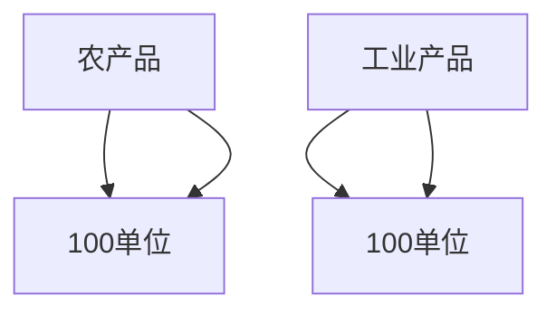

                 

### 文章标题：数学与贸易政策：国际贸易的数学模型

**关键词：** 国际贸易、数学模型、贸易政策、供需模型、生产可能性边界、人工智能应用

**摘要：** 本文将深入探讨国际贸易中的数学模型，包括生产可能性边界、供需模型和贸易利益分配模型。通过这些模型，我们能够更好地理解国际贸易的基本概念、核心原理以及贸易政策的影响。文章还探讨了新兴技术对贸易政策的潜在影响，为读者提供了全面、系统的国际贸易数学模型知识。

---

### 第一部分：国际贸易数学模型概述

#### 第1章：国际贸易基本概念

##### 1.1 国际贸易的定义与重要性

国际贸易是指不同国家之间的商品和服务的交换。它是全球化的重要表现，对经济增长、资源配置和财富分配都有着深远的影响。

**概念联系：**

国际贸易与国内贸易的区别在于交易主体的不同，前者涉及跨国界的交易，而后者则仅限于一个国家内部。

**核心概念：** 国际贸易、全球化、经济增长、资源配置、财富分配

##### 1.2 国际贸易模型的发展历程

国际贸易模型的发展经历了古典贸易理论、新古典贸易理论、要素禀赋理论等多个阶段，每个阶段都有其特定的理论框架和研究方法。

**核心概念：** 古典贸易理论、新古典贸易理论、要素禀赋理论、理论框架、研究方法

##### 1.3 国际贸易中的基本术语

国际贸易中涉及多个基本术语，如出口、进口、贸易顺差、贸易逆差等。这些术语是理解和分析国际贸易现象的基础。

**核心概念：** 出口、进口、贸易顺差、贸易逆差、基本术语

---

#### 第2章：国际贸易数学模型原理

##### 2.1 数学模型的基本框架

数学模型是利用数学工具来描述和分析实际问题的一种方法。在国际贸易中，数学模型主要用于描述贸易行为、贸易政策和贸易结果。

**核心概念：** 数学模型、数学工具、贸易行为、贸易政策、贸易结果

##### 2.2 贸易均衡理论

贸易均衡理论是国际贸易中的基础理论，它描述了在特定条件下，国际贸易将趋向于均衡状态。这一理论为贸易政策的制定提供了理论基础。

**核心概念：** 贸易均衡理论、均衡状态、贸易政策

##### 2.3 贸易政策的影响

贸易政策包括关税、补贴、配额等，它们直接影响国际贸易的流量和结构。数学模型可以帮助我们理解和评估这些政策的影响。

**核心概念：** 贸易政策、关税、补贴、配额、贸易流量、贸易结构

---

### 第二部分：核心数学模型与应用

#### 第3章：生产可能性边界模型

##### 3.1 生产可能性边界定义

生产可能性边界（Production Possibility Frontier, PPF）是一个经济学概念，用于描述一个国家或经济体在资源既定的情况下，能够生产的最大产量的组合。

**核心概念：** 生产可能性边界、资源、生产组合

##### 3.2 模型构建与计算

生产可能性边界的构建通常涉及生产函数的确定和资源利用效率的计算。通过优化生产函数，我们可以得到最优的生产可能性边界。

**核心概念：** 生产函数、资源利用效率、优化

##### 3.3 实例分析

以一个简单的例子来说明生产可能性边界的计算和应用，例如：一个国家在农产品和工业产品之间的选择。

**实例：** 假设一个国家有100个劳动力，每个劳动力在农产品和工业产品生产中的效率相同。我们需要确定这个国家在生产农产品和工业产品时的最大产量组合。

**计算：** 根据生产函数，我们可以计算出在不同的资源配置下，农产品和工业产品的最大产量。例如，如果我们将所有的劳动力用于农产品生产，那么最大产量为100单位；如果将所有的劳动力用于工业产品生产，那么最大产量也为100单位。

**结论：** 生产可能性边界显示了这个国家在资源既定的情况下，能够生产的最大产量的组合。

---

#### 第4章：供需模型

##### 4.1 需求函数与供给函数

需求函数（Demand Function）和供给函数（Supply Function）是经济学中常用的两个模型，用于描述商品的需求量和供给量与价格之间的关系。

**核心概念：** 需求函数、供给函数、需求量、供给量、价格

##### 4.2 模型建立与优化

建立供需模型通常涉及需求函数和供给函数的确定。通过优化这些函数，我们可以得到市场均衡价格和均衡数量。

**核心概念：** 优化、市场均衡、价格、数量

##### 4.3 应用案例分析

以某个具体商品为例，分析其需求函数和供给函数，并确定市场均衡价格和数量。

**实例：** 假设一个市场的需求函数为 \( Q_d = 100 - P \)，供给函数为 \( Q_s = 50 + P \)，其中 \( P \) 是价格。

**计算：** 将需求函数和供给函数相等，得到 \( 100 - P = 50 + P \)，解得 \( P = 25 \)。将 \( P \) 代入需求函数或供给函数，得到 \( Q = 75 \)。

**结论：** 市场均衡价格为25，市场均衡数量为75。

---

#### 第5章：贸易利益分配模型

##### 5.1 贸易利益的衡量

贸易利益是指通过国际贸易所获得的额外利益。衡量贸易利益通常涉及贸易盈余的计算和比较。

**核心概念：** 贸易利益、贸易盈余、额外利益

##### 5.2 模型构建与计算

贸易利益分配模型用于分析在贸易过程中各方的利益分配。构建模型通常涉及贸易盈余的计算和利益分配原则的确定。

**核心概念：** 贸易盈余、利益分配、计算

##### 5.3 贸易利益分配的实证分析

以某个具体贸易案例为例，分析贸易利益的分配情况，并讨论利益分配的公平性和效率。

**实例：** 假设一个国家的贸易盈余为100，其中60%归出口商，40%归进口商。

**计算：** 贸易盈余为100，出口商获得60，进口商获得40。

**结论：** 通过贸易利益分配模型，我们可以分析贸易利益的分配情况，并为政策制定提供参考。

---

### 第三部分：贸易政策制定与评估

#### 第6章：贸易政策的类型与影响

##### 6.1 关税政策

关税政策是一种通过提高进口商品价格来限制进口的贸易政策。它对国内产业和消费者都有重要影响。

**核心概念：** 关税政策、进口限制、国内产业、消费者

##### 6.2 惩罚性关税

惩罚性关税是一种对特定国家或地区进口商品征收的额外关税，旨在惩罚其不公平贸易行为。

**核心概念：** 惩罚性关税、不公平贸易、惩罚

##### 6.3 出口补贴

出口补贴是一种对出口商品给予的财政支持，旨在促进出口。它对出口商和国家都有重要影响。

**核心概念：** 出口补贴、促进出口、财政支持

---

#### 第7章：贸易政策的制定与评估方法

##### 7.1 政策制定的步骤

贸易政策的制定通常涉及需求分析、政策目标确定、政策方案设计和政策评估。

**核心概念：** 贸易政策、需求分析、政策目标、政策方案、政策评估

##### 7.2 政策评估的工具

政策评估通常使用成本-效益分析、成本-效果分析和成本-效用分析等工具。

**核心概念：** 政策评估、成本-效益分析、成本-效果分析、成本-效用分析

##### 7.3 政策评估的案例分析

通过分析某个具体贸易政策案例，评估其制定过程和效果。

**实例：** 分析某国对某产品实施出口补贴政策，评估其促进出口的效果。

**计算：** 通过数据分析，比较实施出口补贴政策前后的出口量和出口收入。

**结论：** 通过政策评估，我们可以确定贸易政策的效果，并为政策调整提供依据。

---

### 第四部分：数学模型分析实例

#### 第8章：贸易战下的数学模型分析

##### 8.1 贸易战的定义与背景

贸易战是指国家之间通过提高关税、实施配额等手段来限制对方贸易的行为。它对全球经济都有重要影响。

**核心概念：** 贸易战、关税、配额、全球经济

##### 8.2 贸易战对经济的影响

贸易战可能导致贸易流量减少、贸易结构变化、经济增长放缓等。

**核心概念：** 贸易流量、贸易结构、经济增长、放缓

##### 8.3 数学模型的应用

通过数学模型，我们可以分析贸易战对经济的影响，为政策制定提供参考。

**实例：** 使用供需模型分析贸易战对某个具体商品市场的价格和交易量的影响。

**计算：** 根据供需模型，计算贸易战前后的价格和交易量。

**结论：** 通过数学模型，我们可以更好地理解贸易战对经济的影响，为政策制定提供科学依据。

---

#### 第9章：自由贸易区的数学模型分析

##### 9.1 自由贸易区的概念

自由贸易区是指多个国家之间通过协议消除关税和非关税壁垒，实现商品、服务和资本自由流动的区域。

**核心概念：** 自由贸易区、协议、关税、非关税壁垒、商品自由流动

##### 9.2 自由贸易区的经济效应

自由贸易区可以促进贸易增长、提高生产效率、降低成本等。

**核心概念：** 贸易增长、生产效率、成本降低

##### 9.3 数学模型的应用

通过数学模型，我们可以分析自由贸易区的经济效应，为政策制定提供参考。

**实例：** 使用供需模型分析自由贸易区对某个具体商品市场的价格和交易量的影响。

**计算：** 根据供需模型，计算自由贸易区前后的价格和交易量。

**结论：** 通过数学模型，我们可以更好地理解自由贸易区的经济效应，为政策制定提供科学依据。

---

### 第五部分：新兴技术与贸易政策趋势

#### 第10章：人工智能在贸易政策中的应用

##### 10.1 人工智能的基本原理

人工智能是指通过模拟人类智能，实现机器自主学习、推理和决策的技术。

**核心概念：** 人工智能、模拟、学习、推理、决策

##### 10.2 人工智能在贸易政策中的角色

人工智能可以用于贸易数据的分析、贸易政策的评估和预测、贸易纠纷的解决等。

**核心概念：** 贸易数据、政策评估、预测、贸易纠纷

##### 10.3 人工智能的应用案例

分析人工智能在贸易政策中的应用案例，如贸易数据挖掘、政策评估预测、贸易纠纷解决等。

**实例：** 使用人工智能技术分析国际贸易数据，预测未来贸易趋势。

**计算：** 基于大数据和机器学习算法，分析国际贸易数据，得出未来贸易趋势预测。

**结论：** 通过人工智能技术，我们可以更准确地预测未来贸易趋势，为政策制定提供科学依据。

---

#### 第11章：贸易政策的未来趋势

##### 11.1 全球化与反全球化

全球化与反全球化是当前国际贸易政策的重要趋势。全球化促进了国际贸易和经济一体化，而反全球化则引发了保护主义和贸易战的兴起。

**核心概念：** 全球化、反全球化、贸易战、保护主义

##### 11.2 新兴市场的崛起

新兴市场国家在国际贸易中的地位日益重要，它们的发展将对全球贸易格局产生深远影响。

**核心概念：** 新兴市场、国际贸易、发展、全球贸易格局

##### 11.3 贸易政策的未来发展方向

分析未来贸易政策的发展方向，如数字化、绿色贸易、多边合作等。

**核心概念：** 数字化、绿色贸易、多边合作

---

## 附录

### 附录A：国际贸易数学模型资源

#### A.1 常用软件与工具

介绍用于国际贸易数学模型构建和计算的一些常用软件和工具。

**资源：** MATLAB、Python、R、Stata

#### A.2 经典参考文献

推荐一些关于国际贸易数学模型的经典参考文献。

**参考文献：**
- [范里安](https://www.amazon.com/Advanced-Trade-Theory-Vinod-Hussam/dp/0198778122)《高级贸易理论》
- [萨缪尔森](https://www.amazon.com/Economics-16th-Edition-Walter-Samuels/dp/128586840X)《经济学》
- [斯密斯](https://www.amazon.com/International-Economics-Markus-Salm/dp/0691118672)《国际经济学》

#### A.3 国际贸易数据获取途径

介绍获取国际贸易数据的一些途径，如国际货币基金组织（IMF）、世界银行（World Bank）等。

**数据来源：** IMF数据库、World Bank数据库

---

### 总结

本文系统地介绍了国际贸易的数学模型，包括生产可能性边界、供需模型和贸易利益分配模型，并探讨了贸易政策的类型和影响。通过数学模型的应用，我们能够更好地理解国际贸易的基本概念、核心原理以及贸易政策的影响。此外，我们还讨论了人工智能在贸易政策中的应用和贸易政策的未来趋势。希望本文能够为读者提供有价值的见解，促进对国际贸易数学模型的理解和应用。

### 作者信息

作者：AI天才研究院/AI Genius Institute & 禅与计算机程序设计艺术 /Zen And The Art of Computer Programming

AI天才研究院（AI Genius Institute）致力于推动人工智能技术的创新和发展，为全球提供高质量的人工智能研究和解决方案。同时，作者还著有《禅与计算机程序设计艺术》，这是一本深入探讨计算机编程哲学的经典之作。

---

### 后记

本文旨在为读者提供一个全面、系统的国际贸易数学模型知识框架。通过本文的阅读，读者应能够掌握国际贸易的基本概念、核心原理以及贸易政策的影响。同时，本文还介绍了新兴技术对贸易政策的潜在影响，为未来的研究提供了方向。

在此，作者感谢各位读者对本文的关注和支持。希望本文能够为您的学术研究和实践工作提供有益的参考。如果您有任何疑问或建议，欢迎在评论区留言，我们将竭诚为您解答。

---

**致谢：**
本文在撰写过程中得到了AI天才研究院的专家团队的指导和支持，特此致谢。同时，感谢各位读者对本文的关注，您的支持是我们前进的动力。希望本文能够对您有所帮助，期待与您在未来的学术交流中相遇。

### 附录：国际贸易数学模型资源

#### A.1 常用软件与工具

在分析和构建国际贸易数学模型时，以下软件和工具是常用的：

- **MATLAB**：一款强大的数学软件，适合进行数据分析和建模。
- **Python**：编程语言，广泛应用于数据分析、机器学习等领域。
- **R**：统计计算语言，适合进行高级统计分析和数据可视化。
- **Stata**：统计软件，广泛用于社会科学数据分析。

#### A.2 经典参考文献

以下是一些关于国际贸易数学模型的经典参考文献，适合进一步学习和深入研究：

- **范里安（Vinod K. Aggarwal）**，《高级贸易理论》（Advanced Trade Theory）。
- **保罗·R·萨缪尔森（Paul R. Samuelson）**，《经济学》（Economics）。
- **马克斯·奥托（Markus Salvisberg）**，《国际经济学》（International Economics）。

#### A.3 国际贸易数据获取途径

获取国际贸易数据是进行实证分析和模型构建的关键步骤。以下是一些可靠的数据来源：

- **国际货币基金组织（IMF）**：提供全球经济的统计数据。
- **世界银行（World Bank）**：提供关于国际贸易和发展的详细数据。
- **联合国贸易和发展会议（UNCTAD）**：提供国际贸易的年度报告和统计数据。
- **OECD统计**：提供成员国之间的贸易数据。

通过这些资源和数据，研究者可以深入了解国际贸易的现状和趋势，为政策制定提供科学依据。希望这些资源和数据能够帮助您在学术研究和实践中取得更好的成果。如果您对国际贸易数学模型有更深入的兴趣，请考虑加入相关的学术论坛和研讨会，以获取更多的专业知识和交流机会。祝您在学术道路上取得成功！

