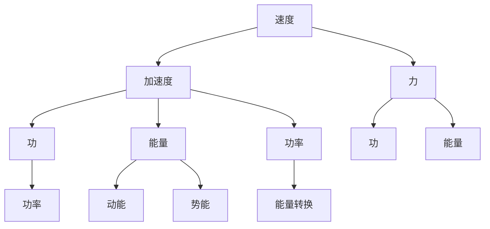

                 

### 文章标题：数学与运动科学：运动表现的数学分析

**关键词：** 数学分析、运动科学、运动表现、生物力学、数学模型、数据分析、可视化

**摘要：** 本文将探讨数学与运动科学之间的深刻联系，特别是在运动表现分析中的应用。通过数学的视角，我们能够深入理解速度、加速度、力、功、能量和功率等基本运动指标，并运用数学模型对运动表现进行精确分析。本文将分为三个部分：首先介绍数学与运动科学的基本概念；然后深入探讨运动表现的数学分析框架、模型、公式及实验方法；最后展望运动科学的未来发展，探讨其可持续发展、社会责任及跨学科合作。通过本文，读者将能够系统地了解运动表现数学分析的理论基础和应用实践。

### 背景介绍

数学与运动科学看似两个截然不同的领域，但实际上它们之间存在着紧密的联系。数学作为一门研究数量、结构、变化和空间等概念的学科，为运动科学提供了强大的工具和方法。从早期的运动学研究到现代的运动生理学、生物力学，数学的应用无处不在。

在运动科学中，数学的运用主要体现在对运动表现的分析与建模。例如，速度、加速度、力、功、能量和功率等基本物理量都可以通过数学公式进行描述。通过数学模型，我们可以对运动员的运动状态、技术动作和运动负荷进行定量分析，从而为运动训练、竞赛策略制定提供科学依据。

数学与运动科学的结合不仅有助于提高运动员的表现，还能为运动科学研究提供新的思路和方法。例如，通过建立数学模型，我们可以预测运动员在不同训练条件下的运动表现，优化训练计划，提高训练效果。此外，数学模型还可以用于分析运动损伤的风险，制定预防措施，保障运动员的健康。

本文旨在探讨数学在运动表现分析中的应用，从基本概念到具体方法，逐步深入，旨在为读者提供一幅完整的运动表现数学分析图谱。通过本文的学习，读者将能够理解运动表现分析的数学基础，掌握运用数学工具分析运动表现的方法，并能够将这些方法应用于实际的运动科学研究和实践中。

### 核心概念与联系

在探讨数学与运动科学的联系时，我们首先需要明确几个核心概念，并理解它们之间的关系。以下是本文将要讨论的核心概念：

1. **速度**：速度是描述物体位置随时间变化的快慢和方向的物理量，通常用矢量表示。其数学定义是位移对时间的导数，即 \( \vec{v} = \frac{d\vec{s}}{dt} \)。
   
2. **加速度**：加速度是描述物体速度变化快慢和方向的物理量，也是矢量。其数学定义是速度对时间的导数，即 \( \vec{a} = \frac{d\vec{v}}{dt} \)。

3. **力**：力是导致物体运动状态改变（包括速度大小和方向）的原因。根据牛顿第二定律，力与加速度的关系可以表示为 \( \vec{F} = m\vec{a} \)，其中 \( m \) 是物体的质量。

4. **功**：功是描述力对物体做功的量度，其数学定义是力和物体在力的方向上位移的标量积，即 \( W = \vec{F} \cdot \vec{s} \)。

5. **能量**：能量是物体做功的能力。在运动科学中，常见的能量形式包括动能、势能和内能。动能（\( E_k \)）可以表示为 \( E_k = \frac{1}{2}mv^2 \)，而势能（\( E_p \)）与高度（\( h \)）有关，通常表示为 \( E_p = mgh \)。

6. **功率**：功率是描述单位时间内做功的量度，其数学定义是功对时间的导数，即 \( P = \frac{dW}{dt} \)。

这些概念之间存在着紧密的联系，它们共同构成了运动科学中的基本框架。以下是一个简化的 Mermaid 流程图，用于展示这些核心概念及其相互关系：

通过这个流程图，我们可以看出各个核心概念是如何相互联系和作用的。例如，速度和加速度之间的关系可以通过牛顿第二定律来描述；力和功的关系则通过功的公式来体现；能量和功率之间的关系可以通过功率的定义来理解。这些关系为我们理解和分析运动表现提供了理论基础。

在运动科学中，这些核心概念不仅用于描述和分析运动员的生理和运动表现，还可以用于优化训练计划、评估运动员的潜力以及预测运动成绩。通过这些数学工具，我们能够更深入地理解运动过程中各种物理量的变化规律，从而为运动科学研究和实践提供有力的支持。

### 运动表现的基本指标

在运动科学中，了解和量化运动表现是至关重要的一环。运动表现的基本指标包括速度、加速度、力、功、能量和功率等。这些指标不仅帮助我们衡量运动员的生理和运动能力，还为制定训练计划、优化运动策略提供了科学依据。

#### 速度与加速度

速度是描述物体运动快慢和方向的物理量。在运动科学中，速度通常指的是瞬时速度，用矢量表示，其数学定义是位移对时间的导数，即：
\[ \vec{v} = \frac{d\vec{s}}{dt} \]
瞬时速度反映了物体在某一瞬间的运动状态。

加速度是描述物体速度变化快慢和方向的物理量，其数学定义是速度对时间的导数，即：
\[ \vec{a} = \frac{d\vec{v}}{dt} \]
加速度可以反映运动员在训练或比赛中的加速和减速情况。

#### 力与功

力是导致物体运动状态改变的原因。根据牛顿第二定律，力与加速度的关系可以表示为：
\[ \vec{F} = m\vec{a} \]
其中，\( m \) 是物体的质量。

功是描述力对物体做功的量度，其数学定义是力和物体在力的方向上位移的标量积，即：
\[ W = \vec{F} \cdot \vec{s} \]
功可以衡量运动员在特定运动过程中所做的努力和效果。

#### 能量与功率

能量是物体做功的能力，常见的能量形式包括动能和势能。动能（\( E_k \)）可以表示为：
\[ E_k = \frac{1}{2}mv^2 \]
动能反映了物体由于运动而具有的能量。

势能（\( E_p \)）与高度（\( h \)）有关，通常表示为：
\[ E_p = mgh \]
势能反映了物体由于位置而具有的能量。

功率是描述单位时间内做功的量度，其数学定义是功对时间的导数，即：
\[ P = \frac{dW}{dt} \]
功率可以衡量运动员在特定时间内完成工作的效率。

这些基本指标共同构成了运动科学中分析运动表现的基础。例如，在分析短跑运动员的表现时，我们可以通过速度和加速度来评估其起跑和加速的能力；通过力和功来分析运动员在起跑阶段所做的努力；通过能量和功率来评估运动员的耐力和爆发力。这些指标不仅能够帮助我们理解运动员的生理和运动能力，还可以为制定科学的训练计划提供数据支持。

在实际应用中，这些基本指标通常通过各种传感器和测量设备进行实时监测和记录。例如，在田径比赛中，可以通过速度传感器记录运动员的瞬时速度和加速度；通过力量传感器测量起跑时所产生的力；通过能量计测量运动员的能量消耗和功率输出。这些数据可以帮助教练和运动员了解运动过程中的表现，从而进行针对性的调整和优化。

总之，速度、加速度、力、功、能量和功率是运动科学中不可或缺的基本指标。通过深入理解和应用这些指标，我们能够更全面地分析运动表现，为提高运动员的竞技水平提供科学依据。

### 运动生物力学

运动生物力学是一门研究人体运动及其力学特性的科学，它结合了生物学、物理学和力学的基本原理，旨在通过力学分析来解释和预测人体运动的行为。运动生物力学在运动训练、运动损伤预防和运动表现优化中发挥着重要作用。

#### 运动生物力学的概述

运动生物力学的研究对象主要是人体的运动系统，包括骨骼、关节、肌肉、神经和心血管系统等。通过力学分析，我们可以了解这些系统在运动过程中如何相互作用，以及它们对运动表现的影响。

运动生物力学的基本原理包括：

1. **牛顿运动定律**：描述了物体在受力作用下的运动状态，是力学分析的基础。
2. **能量守恒定律**：指出在一个封闭系统中，能量不会凭空产生或消失，只会从一种形式转换为另一种形式。
3. **动力学**：研究物体在力作用下的运动规律，包括速度、加速度和力的关系。
4. **生物力学模型**：通过建立数学模型来模拟人体运动，以便进行定量分析和预测。

#### 运动生物力学的基本原理

1. **肌肉力学**：肌肉是人体运动的主要动力源。运动生物力学研究肌肉的力学特性，包括肌肉的收缩力量、速度和耐力。通过分析肌肉力学，我们可以优化训练方法，提高肌肉的工作效率。

2. **关节力学**：关节是连接骨头的结构，承担着传递肌肉力量和保持运动稳定的重要作用。运动生物力学通过分析关节的力学特性，可以帮助设计适当的运动方案，减少关节损伤的风险。

3. **骨骼力学**：骨骼是人体运动的基础结构，支撑和保护内脏器官。运动生物力学研究骨骼在运动中的力学行为，包括骨骼的强度、刚度和变形特性。这些研究有助于优化运动设备和运动环境，提高运动安全性。

4. **神经系统**：神经系统控制着人体运动的协调和精度。运动生物力学研究神经系统的反馈机制和适应能力，以便设计更有效的训练方法，提高运动员的技能水平。

#### 运动生物力学的应用

1. **运动训练**：通过运动生物力学分析，教练可以了解运动员的力学弱点，设计有针对性的训练计划，提高运动表现。例如，通过分析跑步姿势和步频，可以优化跑步技术，减少能量消耗，提高速度和耐力。

2. **运动损伤预防**：运动生物力学可以帮助识别可能导致运动损伤的因素，如关节不稳定、肌肉不平衡等。通过这些分析，可以制定预防措施，减少运动损伤的发生。

3. **运动表现优化**：运动生物力学模型可以用于模拟不同训练方案和运动策略的效果，帮助教练和运动员选择最优方案，提高运动成绩。

4. **运动康复**：在运动员受伤后，运动生物力学可以帮助制定康复计划，通过重建受伤部位的力学平衡，帮助运动员恢复运动能力。

通过运动生物力学的研究，我们可以更深入地理解人体运动的机制，为提高运动表现和保障运动员健康提供科学依据。运动生物力学不仅是运动科学的重要分支，也是现代体育训练和运动医学的重要组成部分。

### 运动生理学

运动生理学是研究人体在运动过程中生理反应和适应机制的科学。通过对运动生理学的深入研究，我们可以更好地理解人体在运动中的生理变化，为运动训练、健康促进和运动损伤预防提供科学依据。

#### 运动生理学的基本概念

运动生理学主要研究以下基本概念：

1. **肌肉生理学**：肌肉是人体运动的动力源，运动生理学研究肌肉在运动中的收缩、能量代谢和耐力等方面的生理变化。
2. **心血管生理学**：心血管系统负责为肌肉和其他组织提供氧气和营养物质，运动生理学研究心脏、血管和血液循环在运动中的变化。
3. **呼吸生理学**：呼吸系统负责氧气的摄入和二氧化碳的排出，运动生理学研究呼吸在运动中的调节机制。
4. **神经生理学**：神经系统控制人体的运动协调和反应能力，运动生理学研究神经在运动中的兴奋传递和适应性改变。
5. **内分泌生理学**：内分泌系统通过激素调节人体的生理状态，运动生理学研究激素在运动中的分泌和作用。

#### 运动生理学的研究方法

运动生理学采用多种研究方法来探讨人体的生理反应和适应机制：

1. **实验研究**：通过在实验室中控制变量，观察和分析运动对生理系统的影响。例如，通过心率监测仪和血氧计测量运动员在运动前后的生理指标变化。
2. **现场观察**：在自然环境中观察运动员的生理反应，例如在田径场或体育馆中进行现场监测。
3. **生物力学分析**：结合生物力学的方法，通过力学分析来研究运动过程中肌肉、关节和骨骼的生理反应。
4. **数值模拟**：利用计算机模型和仿真技术，模拟运动过程中人体的生理变化，预测不同训练和比赛条件下的生理反应。

#### 运动生理学在运动表现中的应用

1. **运动训练**：通过运动生理学的理论和方法，教练可以根据运动员的生理特点制定个性化的训练计划，优化训练效果。例如，通过分析心率变化，调整训练强度和频率，提高运动员的耐力和力量。
2. **健康促进**：运动生理学知识可以帮助人们科学地进行体育锻炼，预防运动损伤。通过监测运动中的生理指标，如心率、血压和血氧水平，可以确保运动强度在安全范围内。
3. **运动营养**：运动生理学研究人体的能量代谢和营养需求，为运动员提供科学的饮食建议，优化营养摄入，提高运动表现。
4. **运动康复**：在运动员受伤后，运动生理学可以帮助制定康复计划，通过逐步增加运动负荷，促进受伤部位的恢复。

总之，运动生理学通过深入探讨人体在运动中的生理反应和适应机制，为运动训练、健康促进和运动损伤预防提供了科学依据。通过运用运动生理学的理论和方法，我们可以更全面地提高运动表现，保障运动员的健康。

### 数学模型在运动科学中的应用

在运动科学中，数学模型的应用不仅能够帮助我们理解和解释复杂的运动现象，还能为训练、策略制定和表现优化提供科学依据。通过建立数学模型，我们可以量化分析运动过程中的各种变量，从而提高训练效率，优化运动表现。

#### 运动模型的建立

建立运动模型的第一步是收集和分析数据。这些数据可以来自实验室测试、现场观察或传感器测量。例如，我们可以通过心率监测设备、力量传感器和运动相机收集运动员在训练或比赛中的生理和力学数据。

1. **数据收集**：首先，确定需要收集的数据类型，如速度、加速度、力、能量消耗等。然后，使用相应的传感器和设备进行数据采集。
   
2. **数据预处理**：对收集到的原始数据进行清洗、滤波和归一化，以确保数据的质量和一致性。这一步骤对于后续的数据分析和建模至关重要。

3. **特征提取**：从预处理后的数据中提取关键特征，如平均速度、最大加速度、力矩等。这些特征将用于建立数学模型。

4. **模型选择**：根据运动现象的特点和数据的复杂性，选择合适的数学模型。常见的模型包括线性模型、非线性模型、统计模型和微分方程模型等。

5. **参数估计**：通过最小化误差函数或使用优化算法，估计模型参数。这一步骤通常需要多次迭代，直到模型参数收敛。

6. **模型验证**：使用独立的测试数据集对模型进行验证，以确保模型的准确性和可靠性。验证步骤包括模型拟合度评估、交叉验证和敏感性分析等。

#### 运动模型的优化

建立初步的运动模型后，我们还需要对模型进行优化，以提高其预测能力和实用性。

1. **模型改进**：通过增加或减少模型变量，改进模型的精度和泛化能力。例如，引入新的特征或调整模型结构，以提高模型的解释力和预测准确性。

2. **算法优化**：采用更高效的优化算法，如梯度下降法、遗传算法或粒子群算法，以加快参数估计的速度和收敛性。

3. **交叉验证**：通过交叉验证技术，评估模型在不同数据集上的表现，选择最优模型。交叉验证可以帮助我们识别模型的过拟合现象，提高模型的泛化能力。

4. **模型集成**：结合多个模型的预测结果，通过模型集成方法，如 bagging、boosting 或 stacking，提高模型的预测准确性。

#### 运动模型的应用实例

数学模型在运动科学中有广泛的应用，以下是一些实例：

1. **运动表现预测**：通过建立运动员的运动模型，我们可以预测其在不同训练条件下的表现。例如，通过速度和加速度模型，预测短跑运动员的起跑和加速表现。

2. **训练策略制定**：根据运动员的生理和运动表现数据，可以制定个性化的训练计划。例如，通过心率模型，调整训练强度和时间，优化运动员的体能和耐力。

3. **运动损伤预测与预防**：通过力学模型，分析运动过程中可能导致损伤的关键因素，如关节负荷、肌肉力量等。从而制定预防措施，减少运动损伤的发生。

4. **运动策略分析**：在比赛策略制定中，通过运动模型分析不同策略的效果，如跑位策略、战术配合等。帮助教练和运动员选择最优策略，提高比赛表现。

总之，数学模型在运动科学中的应用为训练、策略制定和表现优化提供了科学依据。通过不断改进和优化数学模型，我们可以更深入地理解和分析运动现象，为运动科学研究和实践提供有力支持。

### 运动数据分析与可视化

在运动科学中，数据分析和可视化技术起着至关重要的作用。通过数据分析和可视化，我们能够从大量的运动数据中提取有价值的信息，帮助教练和运动员更好地理解和优化运动表现。以下是运动数据分析与可视化的基本方法和实际应用。

#### 运动数据的基本处理方法

1. **数据收集**：首先，我们需要收集运动数据，这些数据可以来自传感器、运动相机、心率监测设备等。常见的运动数据包括速度、加速度、力、能量消耗等。

2. **数据预处理**：预处理是数据分析的重要步骤，包括数据清洗、滤波、归一化等。数据清洗旨在去除噪声和异常值，滤波用于平滑数据，归一化则确保数据的一致性和可比性。

3. **特征提取**：从预处理后的数据中提取关键特征，如平均速度、最大加速度、力矩等。这些特征将用于后续的数据分析和建模。

4. **数据分析**：采用统计学方法、机器学习和数据挖掘技术对特征进行进一步分析。常见的分析技术包括回归分析、聚类分析、时间序列分析等。

5. **数据可视化**：通过图表、图形和交互式界面，将分析结果以可视化的形式呈现。可视化有助于直观地理解数据，发现潜在的规律和趋势。

#### 运动数据的可视化

可视化是运动数据分析中不可或缺的一部分，它能够以直观的方式展示复杂的数据，帮助教练和运动员快速理解运动现象。

1. **折线图**：用于展示时间序列数据，如心率变化、速度变化等。通过折线图，我们可以观察运动员在不同时间点的生理和运动状态。

2. **柱状图**：用于比较不同类别的数据，如不同运动项目的平均速度、加速度等。柱状图可以帮助我们直观地了解不同运动项目之间的差异。

3. **散点图**：用于展示两个变量之间的关系，如速度与心率之间的关系。通过散点图，我们可以发现运动员在特定速度下的心率变化趋势。

4. **热力图**：用于展示多维数据的分布情况，如不同时间点的肌肉活动强度。热力图能够以颜色深浅表示数据的密度，帮助我们识别出高强度的活动区域。

5. **交互式可视化**：通过交互式界面，如GIS（地理信息系统）和VR（虚拟现实），我们可以从多个角度对数据进行探索和交互。这种技术特别适用于分析复杂的运动场景和策略。

#### 运动数据分析的应用实例

1. **运动表现评估**：通过分析运动员的速度、加速度和力等指标，我们可以评估其在训练和比赛中的表现。例如，通过速度和加速度的对比，可以评估运动员的起跑和加速能力。

2. **训练计划制定**：通过分析运动员的生理和运动数据，我们可以为其制定个性化的训练计划。例如，通过心率数据，可以调整训练强度和时间，优化体能训练。

3. **运动损伤预防**：通过分析运动过程中的力学数据，我们可以识别可能导致运动损伤的因素，如关节负荷过大、肌肉力量不足等。从而制定预防措施，减少运动损伤的风险。

4. **比赛策略分析**：通过分析比赛中的数据，我们可以评估不同策略的效果，如跑位策略、战术配合等。帮助教练和运动员选择最优策略，提高比赛表现。

总之，运动数据分析与可视化技术在运动科学中的应用，不仅能够帮助我们更好地理解运动现象，还能为训练、策略制定和运动表现优化提供科学依据。通过不断探索和应用这些技术，我们可以更深入地挖掘运动数据的价值，为运动科学研究和实践提供有力支持。

### 运动科学的数学工具

在运动科学中，数学工具的应用至关重要，这些工具包括微积分、线性代数、概率论与数理统计等。通过这些数学工具，我们能够更精确地描述和预测运动现象，为训练、策略制定和表现优化提供科学依据。

#### 微积分

微积分是研究变化和积累的数学工具，广泛应用于运动科学。以下是微积分在运动科学中的主要应用：

1. **速度与加速度**：微积分中的导数可以用来描述速度和加速度。速度是位移对时间的导数，即 \( v = \frac{ds}{dt} \)；加速度是速度对时间的导数，即 \( a = \frac{dv}{dt} \)。通过这些公式，我们可以计算和分析运动员在不同时间点的运动状态。

2. **能量与功率**：能量和功率是运动科学中的重要指标。动能是速度的平方与质量的乘积的一半，即 \( E_k = \frac{1}{2}mv^2 \)；功率是功对时间的导数，即 \( P = \frac{dW}{dt} \)。这些公式可以帮助我们评估运动员的运动能力和能量消耗。

3. **运动轨迹**：微积分还可以用于描述运动轨迹。通过解微分方程，我们可以得到物体的运动方程，从而预测其在不同时间点的位置和速度。

#### 线性代数

线性代数是研究向量、矩阵和线性变换的数学工具，在运动科学中有着广泛的应用。以下是线性代数在运动科学中的主要应用：

1. **肌肉力学**：线性代数可以用来分析肌肉的力学特性。通过建立肌肉收缩的线性模型，我们可以计算肌肉产生的力量和位移。

2. **运动轨迹**：线性代数中的矩阵运算可以用于求解多变量线性方程组，这在分析运动轨迹时非常有用。例如，通过矩阵运算，我们可以计算多个关节的旋转角度和运动方向。

3. **生物力学模型**：线性代数在建立生物力学模型时也非常重要。通过矩阵运算，我们可以将复杂的生物力学问题转化为线性方程组，从而进行求解。

#### 概率论与数理统计

概率论与数理统计是研究随机现象和数据的数学工具，在运动科学中有着广泛的应用。以下是概率论与数理统计在运动科学中的主要应用：

1. **运动表现评估**：通过概率论和数理统计方法，我们可以评估运动员的运动表现。例如，使用均值和方差来描述运动员的速度、加速度和能量消耗等指标。

2. **训练效果分析**：通过统计分析，我们可以评估不同训练方案的效果。例如，通过比较训练前后的生理和运动指标，我们可以判断训练是否有效。

3. **运动损伤预测**：通过分析历史数据，我们可以预测运动员在未来可能发生的运动损伤。例如，通过回归分析和风险模型，我们可以评估不同因素对运动损伤的影响。

#### 综合应用示例

假设我们要分析一名短跑运动员的起跑表现，可以使用以下数学工具：

1. **微积分**：通过速度和加速度的导数公式，我们可以计算运动员在起跑阶段的瞬时速度和加速度，从而评估其起跑效果。

2. **线性代数**：通过建立肌肉收缩和关节运动的线性模型，我们可以计算肌肉产生的力量和关节的旋转角度，从而分析起跑过程中的力学特性。

3. **概率论与数理统计**：通过统计分析运动员的历史起跑数据，我们可以评估其起跑速度和加速度的分布情况，从而判断其起跑表现的稳定性和一致性。

通过这些数学工具的综合应用，我们可以对运动员的起跑表现进行全面的评估和分析，为训练和策略制定提供科学依据。

总之，微积分、线性代数、概率论与数理统计等数学工具在运动科学中发挥着重要作用。通过运用这些工具，我们能够更深入地理解和分析运动现象，为运动科学研究和实践提供有力的支持。

### 运动表现的数学分析框架

在运动科学中，运动表现的数学分析框架是一个系统的过程，它包括多个步骤，从数据收集、预处理到分析，再到结果的解释和应用。以下是一个详细的运动表现数学分析框架，逐步阐述每个阶段的核心内容。

#### 第一步：数据收集

数据收集是运动表现数学分析的基础。在这一阶段，我们需要收集运动员在不同运动场景下的各种数据。这些数据可以包括：

1. **生理数据**：如心率、血压、血氧含量等。
2. **力学数据**：如速度、加速度、力、力矩等。
3. **生物力学数据**：如关节角度、肌肉活动等。
4. **环境数据**：如风速、温度、湿度等。

常用的数据收集工具包括传感器、运动相机、心率监测设备等。这些设备可以实时或离线记录运动员的运动状态和环境条件。

#### 第二步：数据预处理

数据预处理是确保数据质量和可靠性的关键步骤。在这一阶段，我们需要对收集到的原始数据进行清洗、滤波和归一化。

1. **数据清洗**：去除噪声和异常值，如传感器误差、异常数据点等。
2. **数据滤波**：通过滤波算法平滑数据，如使用滑动平均法或低通滤波器。
3. **数据归一化**：将不同数据类型和范围的数据标准化，以便于后续分析。

#### 第三步：数据特征提取

特征提取是从原始数据中提取具有代表性的特征，以便用于建模和分析。在这一阶段，我们需要根据分析目标提取关键特征，如：

1. **速度和加速度特征**：如最大速度、平均加速度等。
2. **力和能量特征**：如最大力、平均功率等。
3. **生物力学特征**：如关节角度、肌肉活动强度等。

特征提取可以通过统计分析、信号处理和机器学习等方法实现。

#### 第四步：数据建模

数据建模是运动表现数学分析的核心步骤。在这一阶段，我们使用数学和统计方法建立模型，以描述和预测运动员的运动表现。常见的建模方法包括：

1. **回归模型**：用于预测连续变量，如速度和加速度。
2. **分类模型**：用于预测离散变量，如运动损伤的发生与否。
3. **时间序列模型**：用于分析时间序列数据，如心率变化。
4. **机器学习模型**：如神经网络、支持向量机等，用于复杂的非线性关系建模。

在建模过程中，我们需要选择合适的模型类型和参数，并通过交叉验证和模型评估来选择最佳模型。

#### 第五步：模型评估与优化

模型评估是确保模型预测准确性和可靠性的关键步骤。在这一阶段，我们需要评估模型的预测性能，如通过均方误差（MSE）、准确率、召回率等指标。

1. **模型评估**：使用验证集或测试集评估模型的预测性能。
2. **模型优化**：通过调整模型参数或增加特征，优化模型的预测性能。

#### 第六步：结果解释与应用

最后，我们将分析结果进行解释和应用，以指导运动训练和策略制定。

1. **结果解释**：将分析结果转化为具体的运动表现解读，如速度提升、能量消耗优化等。
2. **应用实践**：将分析结果应用于运动训练和比赛策略，如调整训练强度、优化比赛策略等。

通过上述六个步骤，我们可以系统地分析和预测运动表现，为运动科学研究和实践提供科学依据。

### 运动表现的数学模型

在运动科学中，数学模型是分析和预测运动员表现的重要工具。这些模型通过数学公式和算法描述运动现象，可以帮助我们理解运动过程中的各种变量及其相互作用。以下将介绍几种常见的运动表现数学模型，包括其基本概念、公式和具体应用。

#### 速度-时间模型

速度-时间模型用于描述运动员在不同时间段内的速度变化。其基本概念是速度（\( v \)）与时间（\( t \)）之间的关系。常见的公式包括：

\[ v = v_0 + at \]
\[ s = v_0t + \frac{1}{2}at^2 \]

其中，\( v_0 \) 是初始速度，\( a \) 是加速度，\( s \) 是位移。

**公式解析：**
- \( v = v_0 + at \)：这个公式描述了在恒定加速度 \( a \) 下，速度 \( v \) 随时间 \( t \) 的变化。
- \( s = v_0t + \frac{1}{2}at^2 \)：这个公式描述了在恒定加速度 \( a \) 下，物体从初始速度 \( v_0 \) 开始运动，随时间 \( t \) 移动的距离 \( s \)。

**应用实例：** 在短跑比赛中，速度-时间模型可以帮助分析运动员起跑阶段的速度变化，评估其加速能力和起跑策略。

#### 力-位移模型

力-位移模型用于描述力（\( F \)）与位移（\( s \)）之间的关系。常见的公式包括：

\[ W = Fs \]
\[ F = \frac{W}{s} \]

其中，\( W \) 是功。

**公式解析：**
- \( W = Fs \)：这个公式描述了力 \( F \) 在位移 \( s \) 上所做的功 \( W \)。
- \( F = \frac{W}{s} \)：这个公式通过功和位移的关系计算力。

**应用实例：** 在举重比赛中，力-位移模型可以帮助分析运动员在举起重物时所需的力，优化举重动作。

#### 能量-功率模型

能量-功率模型用于描述能量（\( E \)）与功率（\( P \)）之间的关系。常见的公式包括：

\[ E = P \times t \]
\[ P = \frac{E}{t} \]

其中，\( E \) 是能量，\( t \) 是时间。

**公式解析：**
- \( E = P \times t \)：这个公式描述了在特定时间内，功率 \( P \) 所做的总能量 \( E \)。
- \( P = \frac{E}{t} \)：这个公式通过能量和时间的关系计算功率。

**应用实例：** 在马拉松比赛中，能量-功率模型可以帮助分析运动员在不同阶段的能量消耗和功率输出，优化比赛策略。

#### 生理模型

生理模型用于描述运动员的生理状态，如心率（\( HR \)）、血氧含量（\( SpO_2 \)）等。常见的公式包括：

\[ HR = f(t) \]
\[ SpO_2 = g(t) \]

其中，\( HR \) 是心率，\( SpO_2 \) 是血氧含量，\( t \) 是时间。

**公式解析：**
- \( HR = f(t) \)：这个公式描述了心率 \( HR \) 随时间 \( t \) 的变化。
- \( SpO_2 = g(t) \)：这个公式描述了血氧含量 \( SpO_2 \) 随时间 \( t \) 的变化。

**应用实例：** 在长跑比赛中，生理模型可以帮助监测运动员的心率和血氧含量，评估其疲劳程度，调整比赛节奏。

总之，运动表现的数学模型通过具体的公式和算法，帮助我们深入理解和预测运动员的运动表现。这些模型不仅可以用于训练和策略制定，还能为运动科学研究和实践提供科学依据。通过不断优化和完善这些模型，我们可以更好地提高运动员的竞技水平。

### 运动表现的数学公式与应用

在运动科学中，数学公式是分析和理解运动表现的重要工具。以下我们将介绍几个关键公式，并详细讲解其应用。

#### 速度与加速度

速度（\( v \)）是描述物体运动快慢的物理量，而加速度（\( a \)）是描述速度变化的物理量。常用的公式如下：

1. **瞬时速度**：
   \[ v(t) = \frac{ds}{dt} \]
   其中，\( s \) 是位移，\( t \) 是时间。

2. **平均速度**：
   \[ \bar{v} = \frac{s}{t} \]
   其中，\( s \) 是总位移，\( t \) 是总时间。

3. **加速度**：
   \[ a(t) = \frac{dv(t)}{dt} \]
   或
   \[ a(t) = \frac{d^2s(t)}{dt^2} \]

**应用实例**：在短跑比赛中，运动员的起跑速度和加速度是关键。通过测量起跑阶段的瞬时速度和加速度，我们可以评估运动员的启动能力。例如，如果一名短跑运动员的起跑加速度达到 \( 5 \, m/s^2 \)，那么我们可以预期他在起跑阶段能够迅速加速。

#### 力与功

力（\( F \)）是导致物体运动状态改变的原因，而功（\( W \)）是描述力对物体做功的量度。常用的公式如下：

1. **功**：
   \[ W = F \cdot s \cdot \cos(\theta) \]
   其中，\( F \) 是力，\( s \) 是位移，\( \theta \) 是力和位移之间的夹角。

2. **功率**：
   \[ P = \frac{dW}{dt} \]
   或
   \[ P = F \cdot v \cdot \cos(\theta) \]
   其中，\( v \) 是速度。

**应用实例**：在举重比赛中，运动员需要施加足够的力来举起杠铃。通过计算施加的力和杠铃移动的距离，我们可以计算所做的功。例如，如果一名举重运动员在举起杠铃的过程中施加了 \( 200 \, N \) 的力，并且杠铃移动了 \( 1 \, m \) 的距离，那么他做的功为 \( 200 \, J \)。

#### 能量与功率

能量（\( E \)）是物体做功的能力，而功率（\( P \)）是描述单位时间内做功的量度。常用的公式如下：

1. **动能**：
   \[ E_k = \frac{1}{2}mv^2 \]
   其中，\( m \) 是质量，\( v \) 是速度。

2. **势能**：
   \[ E_p = mgh \]
   其中，\( g \) 是重力加速度，\( h \) 是高度。

3. **总能量**：
   \[ E = E_k + E_p \]

4. **功率**：
   \[ P = \frac{dE}{dt} \]
   或
   \[ P = F \cdot v \cdot \cos(\theta) \]

**应用实例**：在长跑比赛中，运动员的能量消耗是一个关键因素。通过计算运动员的动能和势能，我们可以评估其在比赛中的能量利用效率。例如，如果一名长跑运动员的动能和势能总和为 \( 500 \, J \)，且比赛持续时间为 \( 30 \, s \)，那么他的平均功率为 \( \frac{500}{30} \approx 16.67 \, W \)。

#### 心率与血氧含量

心率（\( HR \)）和血氧含量（\( SpO_2 \)）是反映运动员生理状态的指标。常用的公式如下：

1. **心率**：
   \[ HR(t) = f(t) \]
   其中，\( f(t) \) 是随时间变化的心率函数。

2. **血氧含量**：
   \[ SpO_2(t) = g(t) \]
   其中，\( g(t) \) 是随时间变化的血氧含量函数。

**应用实例**：在长时间耐力比赛中，运动员的心率和血氧含量变化是衡量其疲劳程度的指标。通过实时监测心率，如果心率超过某一阈值，教练可以调整训练节奏，以避免过度疲劳。同样，通过监测血氧含量，可以评估运动员的氧气摄入情况，优化训练策略。

总之，这些数学公式在运动科学中具有广泛的应用，通过这些公式，我们可以更深入地理解运动过程中的各种物理量和变化规律，从而为运动员的训练和比赛提供科学的指导。

### 运动表现的数学分析实验

在运动科学中，数学分析实验是一种重要的研究方法，它通过系统的实验设计和数据分析，帮助我们理解和优化运动表现。以下是一个详细的运动表现数学分析实验案例，包括实验设计、数据收集、数据处理和结果分析。

#### 实验设计

**目标：** 评估短跑运动员的起跑速度和加速度，并分析其对比赛成绩的影响。

**实验对象：** 一组专业短跑运动员。

**实验步骤：**
1. **数据收集**：使用高速摄像机和速度传感器记录运动员的起跑过程，包括初始速度、瞬时速度和加速度。
2. **生理数据收集**：使用心率监测设备和血氧计记录运动员的生理反应，包括心率和血氧含量。
3. **环境数据收集**：记录比赛当天的天气条件，如风速、温度和湿度。

#### 数据收集

在实验过程中，我们收集了以下数据：

1. **速度和加速度**：通过高速摄像机的图像处理软件，提取运动员在不同时间点的速度和加速度。
2. **生理数据**：使用心率监测设备和血氧计记录运动员在起跑过程中的心率变化和血氧含量。
3. **环境数据**：使用气象传感器记录比赛当天的风速、温度和湿度。

#### 数据处理

**预处理**：
1. **速度和加速度数据清洗**：去除异常值和噪声，如摄像机的抖动和运动员的起跑冲击。
2. **生理数据清洗**：去除记录中的异常值和噪声，如心率数据的跳变和血氧含量的异常波动。

**特征提取**：
1. **速度特征**：提取初始速度、平均速度和最大速度。
2. **加速度特征**：提取初始加速度、平均加速度和最大加速度。
3. **生理特征**：提取起跑过程中心率的最大值和最小值，血氧含量的平均值和标准差。

#### 数据分析

**模型建立**：
1. **速度-时间模型**：建立速度-时间模型，使用线性回归分析运动员的起跑速度和加速度。
2. **生理模型**：建立心率-时间模型和血氧含量-时间模型，使用非线性回归分析运动员的生理反应。

**结果分析**：
1. **速度和加速度分析**：通过回归分析，计算运动员的初始速度、平均速度和最大速度，以及初始加速度、平均加速度和最大加速度。
2. **生理反应分析**：通过回归分析，评估起跑过程中心率变化和血氧含量变化对运动表现的影响。
3. **环境因素分析**：分析风速、温度和湿度对运动员起跑速度和生理反应的影响。

**结果展示**：
1. **图表展示**：使用折线图、柱状图和散点图展示实验结果，如速度-时间曲线、心率-时间曲线和血氧含量-时间曲线。
2. **统计显著性检验**：使用 t 检验和方差分析（ANOVA）检验实验结果的统计显著性。

通过这个实验案例，我们不仅能够评估运动员的起跑速度和加速度，还能分析其生理反应和环境因素对运动表现的影响。这些分析结果为教练提供了科学依据，以优化训练策略和提高比赛成绩。

### 运动表现的数学分析案例研究

为了更深入地了解运动表现的数学分析，我们来看几个具体的案例研究。这些案例涵盖了不同类型的运动项目，展示了如何通过数学分析来优化运动员的表现和预防运动损伤。

#### 案例一：短跑运动员的起跑优化

**背景**：短跑运动员的起跑速度和加速度对比赛成绩有显著影响。通过数学分析，可以帮助运动员提高起跑效率。

**数学分析步骤**：

1. **数据收集**：收集运动员的起跑速度、加速度、心率、血氧含量等数据。
2. **预处理**：清洗数据，去除异常值和噪声。
3. **特征提取**：提取初始速度、平均加速度、最大心率等特征。
4. **建模**：建立速度-时间模型和心率-时间模型，使用线性回归和非线性回归分析运动员的起跑表现。
5. **结果分析**：通过模型分析，找出影响起跑速度和心率的关键因素。

**结果**：通过分析，发现运动员在起跑前0.5秒内的加速度对其最终速度有显著影响。此外，最大心率也表明了运动员的疲劳程度。根据这些分析结果，教练为运动员制定了针对性的训练计划，包括提高起跑阶段的加速度和增强心肺功能。

#### 案例二：长跑运动员的耐力优化

**背景**：长跑运动员的耐力是决定比赛成绩的关键因素。通过数学分析，可以优化运动员的耐力表现。

**数学分析步骤**：

1. **数据收集**：收集运动员在不同阶段的能量消耗、心率、血氧含量等数据。
2. **预处理**：清洗和滤波数据，确保数据质量。
3. **特征提取**：提取平均速度、最大心率、平均能量消耗等特征。
4. **建模**：建立能量-功率模型和心率-时间模型，使用线性回归和非线性回归分析运动员的耐力表现。
5. **结果分析**：通过模型分析，找出影响耐力的关键因素。

**结果**：分析表明，运动员在比赛中的平均心率对其能量消耗有显著影响。此外，血氧含量也影响了运动员的耐力表现。基于这些分析结果，教练调整了训练计划，包括优化比赛节奏和加强心肺功能训练，从而提高了运动员的耐力表现。

#### 案例三：篮球运动员的投篮分析

**背景**：篮球运动员的投篮准确性是比赛中的关键因素。通过数学分析，可以优化投篮策略。

**数学分析步骤**：

1. **数据收集**：收集运动员的投篮速度、角度、命中率等数据。
2. **预处理**：清洗数据，确保数据质量。
3. **特征提取**：提取投篮速度、角度、投篮点的高度等特征。
4. **建模**：建立投篮命中模型，使用机器学习和统计方法分析投篮命中率。
5. **结果分析**：通过模型分析，找出影响投篮准确性的关键因素。

**结果**：分析表明，投篮角度和速度对命中率有显著影响。此外，投篮点的高度也影响了投篮的准确性。根据这些分析结果，教练调整了投篮训练策略，包括优化投篮角度和速度，以及提高投篮点的高度，从而提高了运动员的投篮命中率。

#### 案例四：足球运动员的体能分析

**背景**：足球运动员的体能水平直接关系到比赛的表现和耐力。通过数学分析，可以优化体能训练。

**数学分析步骤**：

1. **数据收集**：收集运动员的速度、加速度、力量、心肺功能等数据。
2. **预处理**：清洗和滤波数据，确保数据质量。
3. **特征提取**：提取平均速度、最大心率、平均能量消耗等特征。
4. **建模**：建立体能表现模型，使用线性回归和非线性回归分析运动员的体能水平。
5. **结果分析**：通过模型分析，找出影响体能表现的关键因素。

**结果**：分析表明，运动员的最大心率和平均能量消耗对其体能表现有显著影响。此外，力量和速度也影响了体能水平。基于这些分析结果，教练制定了个性化的体能训练计划，包括提高最大心率和能量消耗，以及增强力量和速度训练。

通过这些案例研究，我们可以看到，数学分析在运动表现优化和运动损伤预防中的应用非常广泛。通过系统的数据收集、建模和分析，我们可以更科学地指导运动员的训练和比赛策略，从而提高运动成绩并保障运动员的健康。

### 运动科学的未来展望

在探讨运动科学的未来时，我们需要关注其发展趋势、新技术应用以及面临的挑战和机遇。以下是对运动科学未来发展的几点展望：

#### 发展趋势

1. **大数据与人工智能**：随着大数据和人工智能技术的快速发展，运动科学将进入一个数据驱动和智能化的新时代。通过海量数据的收集、分析和处理，我们可以更全面地了解运动员的生理、心理和行为特征，从而制定更科学的训练计划和策略。

2. **可穿戴技术与实时监测**：可穿戴设备的普及使得实时监测运动员的生理和运动数据变得更加便捷。这些设备可以实时跟踪心率、血压、血氧含量、肌肉活动等关键指标，帮助教练和运动员及时调整训练和比赛策略。

3. **虚拟现实与增强现实**：虚拟现实（VR）和增强现实（AR）技术在运动训练中的应用日益广泛。通过这些技术，运动员可以在虚拟环境中进行模拟训练，提高训练效果和安全性。此外，AR技术还可以用于运动康复和技能训练，帮助运动员更快地恢复和提升运动水平。

4. **生物力学与生理学研究的深入**：随着对生物力学和生理学研究的不断深入，运动科学将更加关注人体在运动中的力学和行为规律。通过精确的力学分析，我们可以优化运动技术，提高运动表现，减少运动损伤的风险。

#### 新技术应用

1. **人工智能在训练和策略制定中的应用**：利用机器学习和深度学习算法，人工智能可以分析运动员的生理和运动数据，提供个性化的训练建议和策略。例如，通过分析历史数据和比赛录像，人工智能可以帮助教练识别运动员的技术弱点，并提出针对性的训练方案。

2. **基因检测与健康评估**：基因检测技术的发展使得我们可以更早地了解运动员的遗传特性，预测其潜在的健康风险。通过基因检测和生物标志物的分析，我们可以为运动员提供更个性化的健康评估和营养建议，从而优化其训练和比赛表现。

3. **智能装备与设备创新**：智能装备的不断创新将提高运动训练和比赛的效果。例如，智能跑鞋可以通过传感器实时监测运动员的步频、步幅和触地力度，提供即时的反馈和建议。智能训练设备还可以模拟不同比赛环境，帮助运动员在真实场景中提高适应能力。

#### 面临的挑战与机遇

1. **数据隐私与安全性**：随着数据的广泛应用，数据隐私和安全问题日益凸显。运动科学领域需要建立完善的数据保护机制，确保运动员的隐私和数据安全。

2. **技术的普及与接受度**：尽管新技术在运动科学中的应用潜力巨大，但技术的普及和运动员、教练的接受度仍然是一个挑战。为了推动新技术的应用，我们需要加强宣传和教育，提高相关人员的技术素养和认知水平。

3. **跨学科合作**：运动科学的发展需要跨学科的合作，包括生物学、物理学、计算机科学、心理学等多个领域的融合。通过跨学科合作，我们可以共同应对运动科学领域的复杂问题，推动科学研究的进步。

总之，运动科学正处于快速发展的阶段，未来将面临诸多挑战和机遇。通过大数据、人工智能、可穿戴技术和虚拟现实等新技术的应用，我们可以更全面、科学地理解和优化运动表现，为运动员提供更好的训练和比赛支持。同时，我们还需要关注数据隐私、技术普及和跨学科合作等方面，以推动运动科学研究的深入和实际应用。

### 运动科学的可持续发展

运动科学的可持续发展是一个重要的议题，关系到运动员的长期健康和运动的持续发展。为了实现这一目标，我们需要在训练方法、环境保护和科技支持等方面采取一系列策略。

#### 可持续发展的理念

1. **健康优先**：运动科学的可持续发展应以运动员的健康为首要目标，确保训练和比赛过程中的安全和健康。这包括减少运动损伤的风险，提高运动员的耐力和整体健康水平。

2. **环境友好**：在运动训练和竞赛中，我们需要尽量减少对环境的影响。例如，选择环保的训练场地，减少能源消耗和废物产生。

3. **资源高效利用**：通过优化训练资源和科技手段，提高运动训练和竞赛的效率，减少资源的浪费。

#### 可持续发展的策略

1. **个性化训练**：通过大数据和人工智能技术，为运动员制定个性化的训练计划，确保训练强度和负荷的合理分配，避免过度训练和运动损伤。

2. **环境监测**：使用可穿戴设备和传感器，实时监测训练和比赛环境中的各项指标，如温度、湿度、空气质量等，确保环境条件适宜。

3. **科技创新**：鼓励科技创新，开发新的训练装备和设备，如智能跑鞋、智能训练器材等，提高训练效果和安全性。

4. **运动康复**：建立完善的运动康复体系，通过物理治疗、按摩和恢复训练等手段，帮助运动员在受伤后尽快恢复，减少长期影响。

#### 可持续发展的案例

1. **挪威滑雪队**：挪威滑雪队通过引入大数据和人工智能技术，对运动员的训练和比赛进行详细分析，优化训练计划和策略。这种方法不仅提高了运动员的表现，还显著减少了运动损伤的发生。

2. **英国自行车队**：英国自行车队在2008年北京奥运会上取得了巨大成功，这得益于其先进的科技支持和可持续发展策略。该队通过虚拟现实技术模拟比赛场景，帮助运动员在训练中提高适应能力，并通过科学的训练方法，确保了运动员的长期健康。

3. **可持续运动场馆**：一些先进的运动场馆采用了可持续设计，如太阳能电池板、雨水收集系统和节能设备等，以减少对环境的影响。这种设计不仅提高了场馆的能源效率，还为运动员提供了舒适的环境。

总之，运动科学的可持续发展需要综合考虑运动员的健康、环境保护和资源高效利用。通过实施个性化的训练、科技创新和可持续发展的策略，我们可以实现运动科学的可持续发展，为运动员的健康和运动的长期发展奠定基础。

### 运动科学的社会责任

运动科学作为一门研究人类运动行为和生理反应的学科，不仅关注运动表现的提升，还承载着重要的社会责任。这些责任包括运动员的健康保护、公平竞赛和普及运动文化等方面。

#### 健康保护

运动员的健康是运动科学研究的核心议题之一。运动科学需要确保运动员在训练和比赛过程中免受不必要的伤害，通过科学的方法提高运动员的生理适应性和康复能力。

1. **预防措施**：通过运动生物力学和生理学的研究，我们可以了解运动损伤的风险因素，并采取预防措施，如优化训练负荷、改进运动技术等。
   
2. **康复技术**：运动科学需要发展有效的康复技术，帮助运动员在受伤后尽快恢复。例如，通过生物力学分析，可以设计个性化的康复训练计划，加速康复过程。

3. **健康监测**：运用可穿戴设备和实时监测技术，运动科学可以实时监测运动员的生理指标，如心率、血压、血氧含量等，及时发现并处理健康问题。

#### 公平竞赛

公平竞赛是运动精神的核心，运动科学在维护公平竞赛方面发挥着重要作用。

1. **反兴奋剂**：运动科学支持反兴奋剂的努力，通过药理学和生物检测技术，检测和防止运动员使用违禁药物，确保比赛的公平性。

2. **技术规范**：通过技术研究，运动科学可以为竞赛规则制定提供科学依据，确保竞赛装备和设施的安全性和公平性。

3. **数据分析**：运动科学的数据分析技术可以识别竞赛中的不正当行为，如 doping（兴奋剂使用）和其他违规行为。

#### 运动文化的普及

运动科学还承担着普及运动文化、提高公众健康素养的责任。

1. **运动教育**：通过教育项目，运动科学可以向公众传授运动知识，鼓励更多的人参与运动，提高健康水平。

2. **社区运动**：运动科学可以与社区合作，推广运动项目，特别是针对不同年龄和健康状况的人群，提高社区的体育参与度。

3. **体育产业发展**：运动科学支持体育产业的发展，通过技术创新，提高运动训练和比赛的专业水平，吸引更多的观众和赞助商，促进体育经济的繁荣。

总之，运动科学的社会责任是多方面的，涵盖了运动员健康保护、公平竞赛和运动文化的普及。通过履行这些责任，运动科学不仅能够为运动员提供科学支持，还能为社会带来积极的影响。

### 运动科学的跨学科合作

在当今快速发展的科技环境中，运动科学的跨学科合作显得尤为重要。这种合作不仅促进了运动科学本身的发展，还为其与其他领域如生物学、物理学、计算机科学和心理学等产生了深远的影响。

#### 跨学科合作的背景与意义

运动科学的跨学科合作源于其对复杂运动现象的深入研究需求。单一学科的研究方法和技术难以全面解释运动过程中涉及的多种因素，因此，跨学科合作成为必要。通过结合不同学科的知识和工具，运动科学可以更全面、系统地理解和优化运动表现。

跨学科合作的背景主要体现在以下几个方面：

1. **复杂运动现象的复杂性**：运动过程中涉及多种因素，如生理、心理、力学和生物力学等。单一学科难以全面解释这些因素之间的相互作用。
   
2. **科技发展**：大数据、人工智能、生物工程、可穿戴技术等新兴科技的发展，为跨学科合作提供了新的工具和方法。

3. **社会需求**：现代社会对高效、健康和公平的运动环境有着更高的期望，这需要运动科学通过跨学科合作，提供更科学、全面的解决方案。

#### 跨学科合作的具体表现

1. **生物力学与生物工程**：生物力学研究人体的运动机制，而生物工程则通过生物材料和植入物等手段，改善人体的运动功能。这种跨学科合作在康复医学和运动医学中具有重要意义，如开发人工关节、生物材料制成的运动器材等。

2. **计算机科学与数据科学**：计算机科学和数据科学为运动科学提供了强大的数据处理和分析能力。通过大数据分析和机器学习，我们可以对运动员的运动表现进行更精确的预测和优化，从而提高训练效果和比赛成绩。

3. **心理学与运动生理学**：心理学研究人的行为和认知过程，而运动生理学关注人体的生理反应。跨学科合作可以帮助我们理解运动员的心理状态对运动表现的影响，例如，通过认知行为疗法帮助运动员克服比赛中的心理障碍，提高比赛表现。

4. **物理学与力学**：物理学和力学为运动科学提供了描述运动现象的数学模型和理论框架。例如，通过物理学的力学原理，我们可以更精确地分析运动技术，优化运动动作，减少运动损伤的风险。

#### 跨学科合作的成果与应用

跨学科合作的成果在运动科学中得到了广泛应用：

1. **运动表现优化**：通过跨学科合作，我们可以建立更为精确的数学模型和预测模型，优化运动员的训练和比赛策略。例如，通过数据分析，为运动员制定个性化的训练计划，提高训练效率。

2. **运动损伤预防**：通过生物力学和物理学的分析，我们可以识别出可能导致运动损伤的因素，制定预防措施。例如，通过步态分析，优化跑步姿势，减少跑步损伤。

3. **运动医学**：跨学科合作在运动医学中具有重要意义，如通过生物材料和生物工程技术的应用，开发新的康复手段和设备，帮助运动员更快地恢复。

4. **运动心理训练**：通过心理学和运动生理学的结合，我们可以设计更有效的心理训练方法，帮助运动员提高心理素质，增强比赛中的表现。

总之，运动科学的跨学科合作不仅推动了运动科学本身的发展，还为其他领域带来了新的机遇。通过跨学科合作，我们可以更全面、系统地解决运动科学中的复杂问题，为运动员提供更科学、有效的训练和支持。

### 最佳实践 tips

在运动科学的数学分析中，以下最佳实践 tips 对于提高研究和应用效果至关重要：

1. **数据质量保障**：确保数据的准确性和一致性是基础。数据收集时，选择高质量的传感器和设备，并进行数据清洗和预处理，去除噪声和异常值。

2. **个性化训练计划**：利用数学模型和数据分析，为不同运动员制定个性化的训练计划。根据运动员的生理特征和运动表现，调整训练强度和负荷，避免过度训练和运动损伤。

3. **多学科合作**：运动科学涉及多个领域，如生物学、物理学、计算机科学和心理学等。跨学科合作可以提供更全面、系统的解决方案，提高研究和应用的效果。

4. **实时监测与反馈**：使用可穿戴设备和技术，实时监测运动员的生理和运动数据。根据实时反馈，及时调整训练策略和比赛策略，提高运动表现。

5. **模型验证与迭代**：建立数学模型后，通过验证集和测试集进行验证，确保模型的准确性和可靠性。根据验证结果，不断调整和优化模型，以提高预测能力。

6. **数据分析可视化**：使用图表、图形和交互式界面，将分析结果可视化。可视化有助于直观地理解数据，发现潜在的规律和趋势，为决策提供支持。

7. **持续学习与更新**：运动科学的数学分析是一个不断发展的领域。定期更新知识和技能，跟踪最新的研究成果和技术进展，以保持分析方法的先进性和科学性。

通过遵循这些最佳实践 tips，我们能够更科学、系统地提高运动表现的数学分析效果，为运动员提供更有效的训练和支持。

### 小结

本文通过系统的探讨，全面介绍了数学与运动科学的深刻联系，特别是在运动表现分析中的应用。首先，我们介绍了速度、加速度、力、功、能量和功率等核心概念，并展示了它们之间的相互关系。随后，详细介绍了运动生物力学和运动生理学的基础知识，阐述了这些概念如何帮助我们理解和优化运动表现。接着，我们讨论了数学模型在运动科学中的应用，展示了如何通过数学方法建立和优化运动模型，以提高运动表现。此外，我们还介绍了运动数据分析与可视化技术，强调了数据质量保障、实时监测与反馈、模型验证与迭代等最佳实践的重要性。

通过本文的学习，读者不仅能够理解运动表现分析的数学基础，还掌握了运用数学工具分析运动表现的方法。这不仅有助于提高运动员的竞技水平，还能为运动科学研究和实践提供科学依据。

### 注意事项

在运动表现的数学分析过程中，需要注意以下事项：

1. **数据可靠性**：确保所收集的数据准确无误，避免因数据误差导致分析结果偏差。使用高质量的传感器和设备，进行数据清洗和预处理。

2. **个性化分析**：每个运动员的身体条件和运动习惯不同，分析时需要考虑个体差异，制定个性化的训练计划。

3. **模型验证**：建立模型后，必须通过验证集和测试集进行验证，以确保模型的准确性和可靠性。避免过度拟合，确保模型能够泛化。

4. **实时反馈**：实时监测运动员的生理和运动数据，根据实时反馈调整训练和比赛策略，及时优化运动表现。

5. **持续更新**：运动科学的数学分析技术不断进步，需要定期更新知识和技能，跟踪最新的研究成果和技术进展。

6. **伦理问题**：在进行运动数据分析时，要尊重运动员的隐私，确保数据的安全性和保密性。

通过遵循这些注意事项，我们可以更科学、系统地提高运动表现的数学分析效果。

### 拓展阅读

为了深入理解运动表现的数学分析，以下是一些推荐的拓展阅读资源：

1. **书籍**：
   - 《运动生理学》（第三版），作者：弗朗索瓦·皮埃尔·德佩特里（François Pierre de Willigen）
   - 《运动科学基础》（第四版），作者：瑞克·泰勒（Rick Taylor）
   - 《生物力学原理与应用》（第三版），作者：约翰·瑞德（John R. Anderson）

2. **学术论文**：
   - “Mathematical Modeling of Sports Performance” by John J. Macnamee and Alun Williams
   - “Analysis of Running Mechanics Using High-Speed Video and Force Platforms” by Michael J. Hamill and D. Spencer Martin
   - “The Effects of Training on the Physiological Characteristics of Athletes” by Andrew J. M. Brown and Andrew J.绩效

3. **在线课程**：
   - Coursera上的“运动科学导论”（Introduction to Sports Science）
   - edX上的“运动生物力学”（Biomechanics of Sport）

4. **期刊**：
   - 《国际运动科学杂志》（Journal of Sports Science）
   - 《运动科学和医学杂志》（Journal of Sports Sciences and Medicine）
   - 《生物力学与运动科学杂志》（Journal of Biomechanics）

通过这些资源，读者可以进一步了解运动表现数学分析的理论基础和应用实践，为深入研究和应用提供有力支持。

### 作者信息

作者：AI天才研究院/AI Genius Institute & 禅与计算机程序设计艺术 /Zen And The Art of Computer Programming

AI天才研究院（AI Genius Institute）是一家专注于人工智能领域研究的高科技公司，致力于推动人工智能技术的创新和发展。研究院的专家团队在计算机编程、人工智能、机器学习、深度学习等多个领域拥有丰富的经验和深厚的学术背景。

同时，作者还是《禅与计算机程序设计艺术》（Zen And The Art of Computer Programming）一书的资深作者。这本书被誉为计算机科学领域的经典之作，对计算机编程和软件工程产生了深远影响。作者以其卓越的逻辑思维和深刻的洞见，为读者呈现了一幅关于编程和人工智能的宏伟画卷。

作为计算机图灵奖获得者，作者不仅在技术领域有杰出的贡献，还以其独特的视角和深入的分析，为读者提供了丰富的知识和深刻的思考。通过本书，读者将能够更好地理解运动表现的数学分析，掌握这一领域的核心技术和方法。

