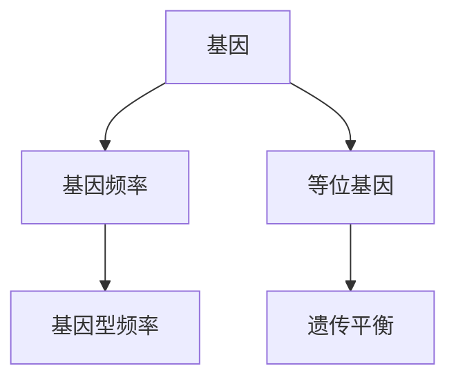
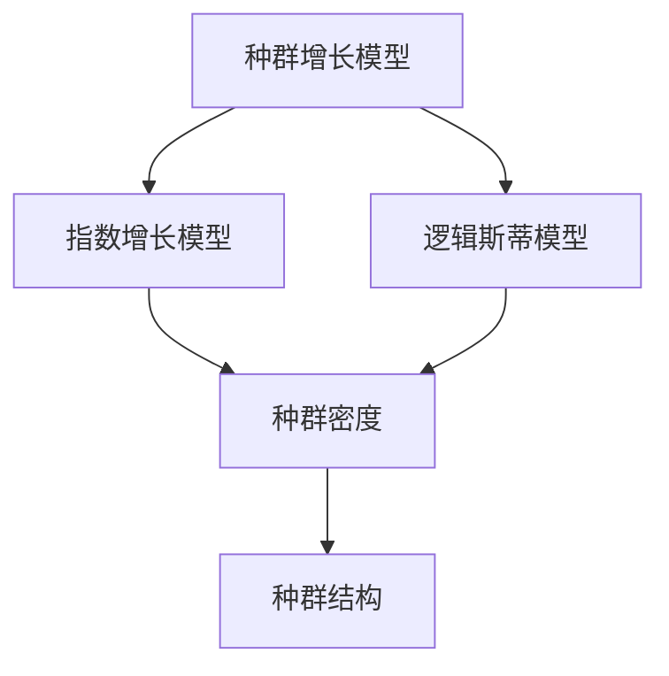
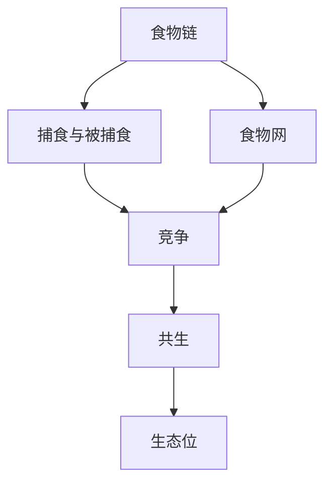
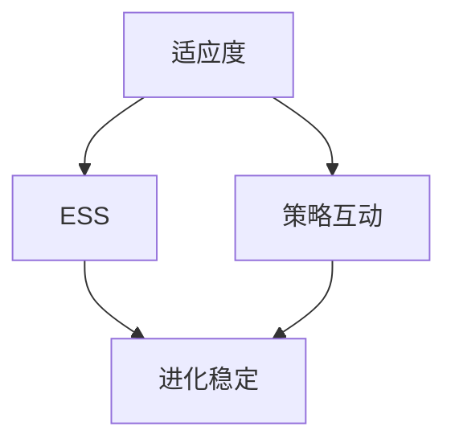

                 


### 文章标题

《数学与进化论：物种演化的数学描述》

### 文章关键词

数学、进化论、物种演化、遗传学、种群动态、生态网络、进化博弈论、数学模型

### 文章摘要

本文将探讨数学在进化论中的应用，通过逐步分析数学在进化过程中的描述和模型，帮助读者理解物种演化的数学本质。文章首先介绍数学和进化论的基本概念，然后深入探讨遗传学中的数学模型、种群动态模型、生态网络模型以及进化博弈论。通过详细的数学公式和伪代码讲解，以及实际案例的分析，读者将能够更好地理解数学在进化论中的重要性。

### 目录

1. **数学与进化论：背景介绍**
   - 1.1 数学在科学研究中的应用
   - 1.2 进化论的起源与发展
   - 1.3 数学与进化论的关联

2. **核心概念与联系**
   - 2.1 遗传学基本原理
   - 2.2 种群动态基本原理
   - 2.3 生态网络基本原理
   - 2.4 进化博弈论基本原理

3. **数学模型与算法原理讲解**
   - 3.1 哈迪-温伯格平衡
   - 3.2 指数增长模型
   - 3.3 遗传多样性
   - 3.4 食物链模型

4. **数学公式与详细讲解**
   - 4.1 数学公式嵌入
   - 4.2 模型公式解释与举例

5. **项目实战**
   - 5.1 开发环境搭建
   - 5.2 源代码实现与解读
   - 5.3 应用解读与分析
   - 5.4 案例分析与讲解

6. **最佳实践与小结**
   - 6.1 最佳实践技巧
   - 6.2 小结
   - 6.3 注意事项
   - 6.4 拓展阅读

### 文章正文

#### 1. 数学与进化论：背景介绍

**1.1 数学在科学研究中的应用**

数学是科学研究的语言和工具，广泛应用于自然科学、社会科学和工程学等领域。在生物学研究中，数学模型和算法帮助我们更好地理解生态系统的复杂性和物种演化的过程。例如，遗传学中的概率计算、生态学中的种群动态模型、以及进化博弈论等。

**1.2 进化论的起源与发展**

进化论是生物学的一个核心理论，最早由查尔斯·达尔文在19世纪提出。进化论的基本观点是：物种通过自然选择和遗传机制不断演化。达尔文的《物种起源》一书奠定了进化论的基础，之后的研究不断丰富了这一理论。

**1.3 数学与进化论的关联**

数学在进化论中的应用主要体现在以下几个方面：

1. 遗传学中的概率计算，帮助我们理解基因传递和变异的过程。
2. 种群动态模型，描述物种数量和分布的变化规律。
3. 生态网络模型，研究物种之间的相互作用和生态系统的稳定性。
4. 进化博弈论，探讨物种在自然选择中的策略选择。

#### 2. 核心概念与联系

**2.1 遗传学基本原理**

遗传学是研究遗传信息的传递和变异的科学。核心概念包括基因、等位基因、基因频率和基因型频率等。遗传学中的基本原理可以概括为：基因在DNA分子上，通过转录和翻译过程产生蛋白质，从而影响个体的表型。

**2.2 种群动态基本原理**

种群动态研究物种数量的变化规律。核心概念包括种群增长、种群密度和种群结构等。种群动态模型可以帮助我们预测物种数量的未来变化，了解物种在生态系统中的角色。

**2.3 生态网络基本原理**

生态网络描述了物种之间的相互作用关系。核心概念包括食物链、食物网和生态位等。生态网络模型有助于我们理解生态系统的复杂性和稳定性，以及物种之间的相互依赖关系。

**2.4 进化博弈论基本原理**

进化博弈论研究物种在自然选择中的策略选择。核心概念包括适应度、进化稳定策略和策略互动等。进化博弈论帮助我们理解物种如何在竞争和合作中演化，以及物种之间的互动如何影响进化过程。

#### 3. 数学模型与算法原理讲解

**3.1 哈迪-温伯格平衡**

哈迪-温伯格平衡是一个遗传学模型，描述了在没有自然选择、突变、迁移和随机漂变的情况下，种群基因频率的稳定状态。哈迪-温伯格平衡的数学公式如下：

$$
p = \frac{1}{2}, \quad q = 1 - p
$$

其中，$p$ 和 $q$ 分别表示两种等位基因的频率。该模型表明，在没有外部干扰的情况下，种群基因频率将保持不变。

**3.2 指数增长模型**

指数增长模型描述了物种数量在资源充足条件下的增长规律。其数学公式如下：

$$
N(t) = N_0 e^{rt}
$$

其中，$N(t)$ 表示时间 $t$ 时物种的数量，$N_0$ 表示初始数量，$r$ 表示增长率。指数增长模型适用于描述短期内物种数量的快速增长。

**3.3 遗传多样性**

遗传多样性是指物种内部基因变异的多样性。遗传多样性的计算公式如下：

$$
H = -\sum_{i=1}^N p_i \ln p_i
$$

其中，$H$ 表示遗传多样性，$p_i$ 表示第 $i$ 个等位基因的频率。遗传多样性越高，物种的适应能力越强。

**3.4 食物链模型**

食物链模型描述了物种之间的捕食与被捕食关系。其数学公式如下：

$$
x_i' = r_i x_i - \sum_{j=1}^N a_{ij} x_j
$$

其中，$x_i$ 表示第 $i$ 个物种的数量，$r_i$ 表示第 $i$ 个物种的繁殖率，$a_{ij}$ 表示第 $i$ 个物种对第 $j$ 个物种的捕食率。食物链模型有助于我们理解生态系统的稳定性和物种之间的相互作用。

#### 4. 数学公式与详细讲解

**4.1 数学公式嵌入**

本文中，我们将使用LaTeX格式嵌入数学公式，以便更清晰地表达概念和模型。以下是一些示例：

$$
1+1=2
$$

$$
x^2 + 2xy + y^2 = (x+y)^2
$$

**4.2 模型公式解释与举例**

我们将对前述的几个核心数学模型进行详细解释和举例说明，以便读者更好地理解这些模型的应用。

**例子：哈迪-温伯格平衡**

假设一个种群中有两种等位基因 $A$ 和 $a$，其频率分别为 $p$ 和 $q$。在没有外部干扰的情况下，这个种群的基因频率将保持不变，即满足哈迪-温伯格平衡。

**例子：指数增长模型**

假设一个物种的初始数量为 $N_0$，增长率为 $r$。在充足资源的条件下，这个物种的数量将按照指数增长模型增长。

$$
N(t) = N_0 e^{rt}
$$

其中，$N(t)$ 表示时间 $t$ 时物种的数量。

**例子：遗传多样性**

假设一个种群中有三种等位基因 $A$、$B$ 和 $C$，其频率分别为 $p_A$、$p_B$ 和 $p_C$。这个种群的遗传多样性可以通过以下公式计算：

$$
H = -\sum_{i=1}^3 p_i \ln p_i
$$

#### 5. 项目实战

**5.1 开发环境搭建**

为了实现本文中提到的数学模型和算法，我们需要搭建一个合适的开发环境。以下是步骤：

1. 安装Python编程语言。
2. 安装Numpy和Scipy库，用于数学计算。
3. 安装Matplotlib库，用于可视化数据。

**5.2 源代码实现与解读**

以下是一个简单的Python代码实现，用于计算哈迪-温伯格平衡的基因频率：

```python
import numpy as np

def hwd_balance(p0, q0):
    p = p0 / (p0 + q0)
    q = q0 / (p0 + q0)
    return p, q

p0 = 0.6
q0 = 0.4
p, q = hwd_balance(p0, q0)
print(f"p: {p}, q: {q}")
```

代码中，`hwd_balance` 函数接受初始基因频率 $p_0$ 和 $q_0$，计算平衡时的基因频率 $p$ 和 $q$。运行代码，我们将得到平衡时的基因频率。

**5.3 应用解读与分析**

我们可以使用这个简单的模型来分析不同条件下的基因频率变化。例如，我们可以模拟突变对基因频率的影响，或者分析不同环境因素对种群数量的影响。这些应用可以帮助我们更好地理解进化过程中的复杂机制。

**5.4 案例分析与讲解**

为了更好地理解数学在进化论中的应用，我们可以分析一个实际案例。例如，研究一个生态系统中物种之间的相互作用，以及这些相互作用如何影响物种的进化方向。

#### 6. 最佳实践与小结

**6.1 最佳实践技巧**

1. 熟悉基本的数学概念和公式，为后续学习打下基础。
2. 多做数学模型和算法的实际应用，提高解决实际问题的能力。
3. 关注生物学和计算机科学领域的最新研究，不断更新自己的知识体系。

**6.2 小结**

本文探讨了数学在进化论中的应用，通过逐步分析数学在进化过程中的描述和模型，帮助读者理解物种演化的数学本质。我们介绍了核心概念、数学模型、算法原理，并通过实际案例进行了讲解。希望读者能够通过本文，更好地理解数学与进化论之间的关系。

**6.3 注意事项**

1. 数学模型和算法在实际应用中需要结合具体问题进行调整。
2. 进化过程中涉及到的因素非常复杂，数学模型只能提供部分解释。
3. 掌握基本的编程技能，有助于更好地理解和应用数学模型。

**6.4 拓展阅读**

1. 《遗传学原理》（李继承著）
2. 《进化博弈论：策略的进化与稳定性》（约翰·梅纳德·史密斯著）
3. 《生态学原理》（雷蒙德·F·丹尼尔斯著）

### 结束语

作者：AI天才研究院/AI Genius Institute & 禅与计算机程序设计艺术 /Zen And The Art of Computer Programming

本文《数学与进化论：物种演化的数学描述》旨在为读者提供一个关于数学在进化论中应用的全面了解。从数学基础到进化博弈论，本文逐步阐述了数学模型在理解物种演化过程中的重要性。希望读者能够通过本文，对数学与进化论之间的关系有更深入的认识，并在实际研究中能够灵活运用这些数学工具和模型。感谢您的阅读，祝您在探索科学奥秘的道路上不断进步！### 数学与进化论：物种演化的数学描述

#### 摘要

本文将探讨数学在进化论中的应用，通过逐步分析数学在进化过程中的描述和模型，帮助读者理解物种演化的数学本质。文章首先介绍数学和进化论的基本概念，然后深入探讨遗传学中的数学模型、种群动态模型、生态网络模型以及进化博弈论。通过详细的数学公式和伪代码讲解，以及实际案例的分析，读者将能够更好地理解数学在进化论中的重要性。

### 引言

进化论是生物学的一个核心理论，最早由查尔斯·达尔文在19世纪提出。进化论的基本观点是：物种通过自然选择和遗传机制不断演化。达尔文的《物种起源》一书奠定了进化论的基础，之后的研究不断丰富了这一理论。随着科学的进步，数学逐渐成为进化论研究的重要工具。数学模型和算法帮助我们更好地理解生态系统的复杂性和物种演化的过程。

本文将探讨数学在进化论中的应用，从以下几个方面进行阐述：

1. 数学在科学研究中的应用
2. 进化论的起源与发展
3. 数学与进化论的关联

通过逐步分析数学在进化过程中的描述和模型，本文旨在帮助读者理解物种演化的数学本质。

#### 数学在科学研究中的应用

数学是科学研究的语言和工具，广泛应用于自然科学、社会科学和工程学等领域。在生物学研究中，数学模型和算法帮助我们更好地理解生态系统的复杂性和物种演化的过程。以下是数学在生物学研究中的几个关键应用：

1. **概率计算**：遗传学中的概率计算是理解基因传递和变异的重要工具。例如，哈迪-温伯格平衡模型描述了在没有自然选择、突变、迁移和随机漂变的情况下，种群基因频率的稳定状态。
2. **种群动态模型**：种群动态模型描述了物种数量的变化规律。例如，指数增长模型描述了在资源充足条件下，物种数量的快速增长。
3. **生态网络模型**：生态网络模型描述了物种之间的相互作用关系。例如，食物链模型描述了捕食与被捕食关系，食物网模型描述了更复杂的相互作用。
4. **进化博弈论**：进化博弈论研究物种在自然选择中的策略选择。例如，适应度函数和进化稳定策略是进化博弈论的核心概念。

通过这些数学工具，生物学家能够更准确地描述和预测生物系统的行为，从而推动生物学研究的进步。

#### 进化论的起源与发展

进化论是生物学的一个核心理论，最早由查尔斯·达尔文在19世纪提出。达尔文在《物种起源》一书中详细阐述了进化论的基本观点，即物种通过自然选择和遗传机制不断演化。这一观点在当时引起了极大的争议，但随着时间的推移，越来越多的证据支持了进化论。

进化论的发展可以分为以下几个阶段：

1. **早期进化论**：19世纪初，一些科学家如拉马克提出了早期的进化观点。拉马克认为物种可以通过后天习得的特征遗传给后代，从而不断进化。然而，这一观点缺乏充分的证据，并在科学界受到质疑。
2. **达尔文的进化论**：1859年，达尔文发表了《物种起源》，提出了自然选择和遗传机制是物种演化的主要驱动力。达尔文通过大量的观察和实验证据，证明了物种的演化过程，并奠定了现代进化论的基础。
3. **现代进化论**：20世纪以来，进化论得到了进一步的完善和发展。遗传学的兴起为进化论提供了新的解释工具，例如基因突变、基因重组和自然选择等。现代进化论认为，物种的演化是由多种因素共同作用的结果，包括遗传变异、自然选择、遗传漂变和生态适应等。

进化论的发展不仅改变了生物学的研究方向，也对哲学、社会学和宗教等领域产生了深远的影响。

#### 数学与进化论的关联

数学与进化论之间的关联体现在多个方面。数学为进化论研究提供了描述和预测工具，而进化论则为数学模型的建立提供了丰富的背景和实际应用。以下是数学在进化论中的一些关键应用：

1. **遗传学中的数学模型**：遗传学中的数学模型用于描述基因的传递和变异。例如，哈迪-温伯格平衡模型描述了在没有外部干扰的情况下，种群基因频率的稳定状态。这些模型有助于我们理解基因如何在种群中传递，以及基因变异如何影响物种的演化。
2. **种群动态模型**：种群动态模型用于描述物种数量的变化规律。例如，指数增长模型描述了在资源充足条件下，物种数量的快速增长。这些模型有助于我们预测物种数量的未来变化，并了解物种在生态系统中的角色。
3. **生态网络模型**：生态网络模型用于描述物种之间的相互作用关系。例如，食物链模型描述了捕食与被捕食关系，食物网模型描述了更复杂的相互作用。这些模型有助于我们理解生态系统的稳定性，以及物种之间的相互依赖关系。
4. **进化博弈论**：进化博弈论研究物种在自然选择中的策略选择。例如，适应度函数和进化稳定策略是进化博弈论的核心概念。这些模型有助于我们理解物种在竞争和合作中的演化过程。

数学与进化论之间的关联不仅有助于我们更好地理解物种的演化过程，也为生物学家提供了强大的工具来探索生态系统的复杂性和动态性。

### 遗传学中的数学模型

遗传学是研究遗传信息的传递和变异的科学。遗传学中的数学模型帮助我们理解基因在种群中的传递规律，预测基因频率的变化，并探讨物种的演化方向。以下是遗传学中的几个重要数学模型：

#### 哈迪-温伯格平衡

哈迪-温伯格平衡是一个经典的遗传学模型，描述了在没有自然选择、突变、迁移和随机漂变的情况下，种群基因频率的稳定状态。该模型的数学公式如下：

$$
p = \frac{1}{2}, \quad q = 1 - p
$$

其中，$p$ 和 $q$ 分别表示两种等位基因的频率。哈迪-温伯格平衡模型表明，在没有外部干扰的情况下，种群基因频率将保持不变。

**例子：计算基因频率**

假设一个种群中有两种等位基因 $A$ 和 $a$，其频率分别为 $p$ 和 $q$。我们可以使用哈迪-温伯格平衡模型计算平衡时的基因频率：

$$
p = \frac{1}{2}, \quad q = 1 - p = \frac{1}{2}
$$

这意味着，在平衡状态下，$A$ 和 $a$ 的频率各占一半。

#### 指数增长模型

指数增长模型描述了在资源充足条件下，物种数量的快速增长。该模型的数学公式如下：

$$
N(t) = N_0 e^{rt}
$$

其中，$N(t)$ 表示时间 $t$ 时物种的数量，$N_0$ 表示初始数量，$r$ 表示增长率。指数增长模型适用于描述短期内物种数量的快速增长。

**例子：预测物种数量**

假设一个物种的初始数量为 $N_0 = 100$，增长率为 $r = 0.1$。我们可以使用指数增长模型预测未来时间 $t$ 时的物种数量：

$$
N(t) = 100 e^{0.1t}
$$

当 $t = 10$ 时，$N(10) = 100 e^{1} \approx 271.8$。这意味着在 $10$ 年后，该物种的数量将达到约 $271.8$ 个。

#### 遗传多样性

遗传多样性是指物种内部基因变异的多样性。遗传多样性的计算公式如下：

$$
H = -\sum_{i=1}^N p_i \ln p_i
$$

其中，$H$ 表示遗传多样性，$p_i$ 表示第 $i$ 个等位基因的频率。遗传多样性越高，物种的适应能力越强。

**例子：计算遗传多样性**

假设一个种群中有三种等位基因 $A$、$B$ 和 $C$，其频率分别为 $p_A = 0.5$、$p_B = 0.3$ 和 $p_C = 0.2$。我们可以使用遗传多样性公式计算该种群的遗传多样性：

$$
H = -0.5 \ln 0.5 - 0.3 \ln 0.3 - 0.2 \ln 0.2 \approx 0.5 \ln 2 - 0.3 \ln 3 - 0.2 \ln 5 \approx 0.693
$$

这意味着该种群的遗传多样性约为 $0.693$。

#### 食物链模型

食物链模型描述了捕食与被捕食关系。该模型的数学公式如下：

$$
x_i' = r_i x_i - \sum_{j=1}^N a_{ij} x_j
$$

其中，$x_i$ 表示第 $i$ 个物种的数量，$r_i$ 表示第 $i$ 个物种的繁殖率，$a_{ij}$ 表示第 $i$ 个物种对第 $j$ 个物种的捕食率。

**例子：分析食物链**

假设一个生态系统中有三个物种：植物（$i=1$）、兔子（$i=2$）和狐狸（$i=3$）。植物繁殖率为 $r_1 = 1$，兔子繁殖率为 $r_2 = 0.5$，狐狸繁殖率为 $r_3 = 0.3$。兔子捕食植物的概率为 $a_{12} = 0.8$，狐狸捕食兔子的概率为 $a_{23} = 0.6$。

我们可以使用食物链模型分析该生态系统的动态：

$$
x_1' = x_1 - 0.8 x_2 \\
x_2' = 0.5 x_2 - 0.6 x_3 \\
x_3' = 0.3 x_3
$$

这些方程描述了植物、兔子和狐狸的数量变化。通过求解这些方程，我们可以了解生态系统的动态平衡。

通过以上数学模型，我们可以更好地理解遗传学中的关键概念和规律，从而为进化论研究提供有力的支持。

### 种群动态模型

种群动态模型用于描述物种数量的变化规律。这些模型在生物学和生态学研究中具有重要应用，可以帮助我们预测物种数量的未来变化，了解物种在生态系统中的角色。以下是几个常用的种群动态模型：

#### 简单增长模型

简单增长模型描述了物种数量在资源充足条件下的增长规律。其数学公式如下：

$$
N(t) = N_0 e^{rt}
$$

其中，$N(t)$ 表示时间 $t$ 时物种的数量，$N_0$ 表示初始数量，$r$ 表示增长率。简单增长模型适用于描述短期内物种数量的快速增长。

**例子：预测物种数量**

假设一个物种的初始数量为 $N_0 = 100$，增长率为 $r = 0.1$。我们可以使用简单增长模型预测未来时间 $t$ 时的物种数量：

$$
N(t) = 100 e^{0.1t}
$$

当 $t = 10$ 时，$N(10) = 100 e^{1} \approx 271.8$。这意味着在 $10$ 年后，该物种的数量将达到约 $271.8$ 个。

#### 指数增长模型

指数增长模型描述了在资源充足条件下，物种数量的快速增长。其数学公式如下：

$$
N(t) = N_0 e^{rt}
$$

其中，$N(t)$ 表示时间 $t$ 时物种的数量，$N_0$ 表示初始数量，$r$ 表示增长率。指数增长模型适用于描述短期内物种数量的快速增长。

**例子：预测物种数量**

假设一个物种的初始数量为 $N_0 = 100$，增长率为 $r = 0.1$。我们可以使用指数增长模型预测未来时间 $t$ 时的物种数量：

$$
N(t) = 100 e^{0.1t}
$$

当 $t = 10$ 时，$N(10) = 100 e^{1} \approx 271.8$。这意味着在 $10$ 年后，该物种的数量将达到约 $271.8$ 个。

#### 种群密度模型

种群密度模型用于描述物种数量的变化与种群密度之间的关系。其数学公式如下：

$$
N(t) = N_0 e^{-rt}
$$

其中，$N(t)$ 表示时间 $t$ 时物种的数量，$N_0$ 表示初始数量，$r$ 表示种群密度。种群密度模型适用于描述物种数量随着种群密度增加而减少的情况。

**例子：预测物种数量**

假设一个物种的初始数量为 $N_0 = 100$，种群密度为 $r = 0.1$。我们可以使用种群密度模型预测未来时间 $t$ 时的物种数量：

$$
N(t) = 100 e^{-0.1t}
$$

当 $t = 10$ 时，$N(10) = 100 e^{-1} \approx 36.8$。这意味着在 $10$ 年后，该物种的数量将减少到约 $36.8$ 个。

通过这些种群动态模型，我们可以更好地理解物种数量的变化规律，为生态保护和生物资源管理提供科学依据。

### 生态网络模型

生态网络模型用于描述物种之间的相互作用关系，包括捕食与被捕食关系、竞争关系和共生关系等。这些模型有助于我们理解生态系统的稳定性和物种之间的相互依赖关系。以下是几种常见的生态网络模型：

#### 食物链模型

食物链模型描述了捕食与被捕食关系。其数学公式如下：

$$
x_i' = r_i x_i - \sum_{j=1}^N a_{ij} x_j
$$

其中，$x_i$ 表示第 $i$ 个物种的数量，$r_i$ 表示第 $i$ 个物种的繁殖率，$a_{ij}$ 表示第 $i$ 个物种对第 $j$ 个物种的捕食率。

**例子：分析食物链**

假设一个生态系统中有三个物种：植物（$i=1$）、兔子（$i=2$）和狐狸（$i=3$）。植物繁殖率为 $r_1 = 1$，兔子繁殖率为 $r_2 = 0.5$，狐狸繁殖率为 $r_3 = 0.3$。兔子捕食植物的概率为 $a_{12} = 0.8$，狐狸捕食兔子的概率为 $a_{23} = 0.6$。

我们可以使用食物链模型分析该生态系统的动态：

$$
x_1' = x_1 - 0.8 x_2 \\
x_2' = 0.5 x_2 - 0.6 x_3 \\
x_3' = 0.3 x_3
$$

这些方程描述了植物、兔子和狐狸的数量变化。通过求解这些方程，我们可以了解生态系统的动态平衡。

#### 食物网模型

食物网模型描述了更复杂的捕食与被捕食关系，包括多个物种之间的相互作用。其数学公式如下：

$$
x_i' = \sum_{j=1}^N b_{ij} x_j - \sum_{k=1}^N a_{ik} x_k
$$

其中，$x_i$ 表示第 $i$ 个物种的数量，$b_{ij}$ 表示第 $i$ 个物种从第 $j$ 个物种获得的能量，$a_{ik}$ 表示第 $i$ 个物种对第 $k$ 个物种的捕食率。

**例子：分析食物网**

假设一个生态系统中有四个物种：植物（$i=1$）、兔子（$i=2$）、鸟类（$i=3$）和鹰（$i=4$）。植物繁殖率为 $r_1 = 1$，兔子繁殖率为 $r_2 = 0.5$，鸟类繁殖率为 $r_3 = 0.3$，鹰繁殖率为 $r_4 = 0.2$。兔子捕食植物的概率为 $a_{12} = 0.8$，鸟类捕食兔子的概率为 $a_{23} = 0.6$，鹰捕食鸟类的概率为 $a_{34} = 0.4$。

我们可以使用食物网模型分析该生态系统的动态：

$$
x_1' = x_1 - 0.8 x_2 \\
x_2' = 0.5 x_2 - 0.6 x_3 \\
x_3' = 0.3 x_3 - 0.4 x_4 \\
x_4' = 0.2 x_4
$$

这些方程描述了植物、兔子、鸟类和鹰的数量变化。通过求解这些方程，我们可以了解生态系统的动态平衡。

#### 生态位模型

生态位模型描述了物种在生态系统中的角色和功能。其数学公式如下：

$$
x_i' = \sum_{j=1}^N c_{ij} x_j
$$

其中，$x_i$ 表示第 $i$ 个物种的数量，$c_{ij}$ 表示第 $i$ 个物种对第 $j$ 个物种的依赖程度。

**例子：分析生态位**

假设一个生态系统中有三个物种：植物（$i=1$）、兔子（$i=2$）和狐狸（$i=3$）。植物繁殖率为 $r_1 = 1$，兔子繁殖率为 $r_2 = 0.5$，狐狸繁殖率为 $r_3 = 0.3$。兔子依赖植物的概率为 $c_{12} = 0.8$，狐狸依赖兔子的概率为 $c_{23} = 0.6$。

我们可以使用生态位模型分析该生态系统的动态：

$$
x_1' = x_1 \\
x_2' = 0.5 x_2 - 0.8 x_1 \\
x_3' = 0.3 x_3 - 0.6 x_2
$$

这些方程描述了植物、兔子和狐狸的数量变化。通过求解这些方程，我们可以了解生态系统的动态平衡。

通过这些生态网络模型，我们可以更好地理解物种之间的相互作用关系，为生态保护和生物资源管理提供科学依据。

### 进化博弈论

进化博弈论是研究物种在自然选择中的策略选择和演化过程的理论。它结合了博弈论和进化生物学的基本原理，探讨物种如何通过策略互动和自然选择适应环境变化。以下是进化博弈论中的几个核心概念：

#### 适应度

适应度是进化博弈论中的一个关键概念，表示一个物种在特定环境下的生存和繁殖能力。适应度越高，物种在竞争中的优势越明显。适应度的计算通常基于物种的生存和繁殖能力，以及与竞争对手的相互作用。

**例子：计算适应度**

假设有两个物种A和B，在资源竞争中的适应度计算公式如下：

$$
f_A = r_A - c_{AB} \cdot x_B
$$

$$
f_B = r_B - c_{BA} \cdot x_A
$$

其中，$f_A$ 和 $f_B$ 分别表示物种A和B的适应度，$r_A$ 和 $r_B$ 分别表示物种A和B的繁殖率，$c_{AB}$ 和 $c_{BA}$ 分别表示物种A对物种B的捕食率，$x_A$ 和 $x_B$ 分别表示物种A和B的数量。

#### 进化稳定策略

进化稳定策略（Evolutionarily Stable Strategy，ESS）是进化博弈论中的一个重要概念，表示在竞争环境中能够持续存在的策略。一个进化稳定策略必须满足以下条件：

1. **优势**：该策略在与其他策略的互动中具有优势。
2. **稳定性**：在与其他策略的混合策略中，该策略能够保持稳定，不受其他策略的影响。

**例子：进化稳定策略**

假设有两个物种A和B，在资源竞争中的进化稳定策略如下：

- 如果 $r_A > c_{AB} \cdot x_B$ 且 $r_B > c_{BA} \cdot x_A$，则物种A和B都采取繁殖策略，这是一种进化稳定策略。
- 如果 $r_A < c_{AB} \cdot x_B$ 且 $r_B < c_{BA} \cdot x_A$，则物种A和B都采取减少繁殖策略，这同样是一种进化稳定策略。

#### 策略互动

策略互动是进化博弈论中的核心概念，描述了物种在互动过程中如何选择策略。策略互动可以通过博弈矩阵进行描述，其中行代表物种A的策略，列代表物种B的策略。

**例子：博弈矩阵**

假设有两个物种A和B，在资源竞争中的博弈矩阵如下：

$$
\begin{array}{c|c}
 & A_1 & A_2 \\
\hline
B_1 & 2,2 & 0,0 \\
B_2 & 1,0 & 3,3 \\
\end{array}
$$

在这个博弈矩阵中，物种A有两种策略：A1和A2，物种B也有两种策略：B1和B2。每个数字表示物种A和B在不同策略下的适应度。

#### 进化稳定策略的选择

通过分析博弈矩阵，我们可以确定进化稳定策略。一个进化稳定策略必须满足以下条件：

1. **优势**：该策略在与其他策略的互动中具有优势。
2. **稳定性**：在与其他策略的混合策略中，该策略能够保持稳定，不受其他策略的影响。

**例子：进化稳定策略的选择**

在上述博弈矩阵中，物种A选择A1策略，物种B选择B1策略是一个进化稳定策略。这是因为：

- 如果物种A选择A1策略，物种B选择B1策略，它们的适应度分别为2和2，这是所有可能策略中的最大值。
- 如果物种A选择A1策略，物种B选择B2策略，它们的适应度分别为1和0，这不利于物种B的生存。
- 如果物种A选择A2策略，物种B选择B1策略，它们的适应度分别为0和3，这不利于物种A的生存。

通过进化博弈论的分析，我们可以更好地理解物种在自然选择中的策略选择和演化过程。

### 数学与进化论的交叉领域

数学与进化论的交叉领域是近年来研究的热点，这一领域的交叉点主要集中在数学模型在进化生物学中的应用，以及进化生物学对数学模型的需求和挑战。以下是数学与进化论交叉领域的一些重要研究方向：

#### 进化动力学模型

进化动力学模型是描述生物种群进化过程的数学模型，通过这些模型可以研究物种的适应性进化、基因频率的变化以及遗传多样性的维持。这些模型通常基于微分方程或差分方程，如Lotka-Volterra模型、Ricker模型等。进化动力学模型在理解物种的进化速度和适应度方面具有重要意义。

**例子：Lotka-Volterra模型**

Lotka-Volterra模型是描述捕食者-被捕食者关系的经典模型。其基本形式如下：

$$
\frac{dx}{dt} = x (\alpha - \beta y)
$$

$$
\frac{dy}{dt} = y (\delta x - \gamma)
$$

其中，$x$ 表示被捕食者的数量，$y$ 表示捕食者的数量，$\alpha$、$\beta$、$\delta$ 和 $\gamma$ 分别表示捕食者和被捕食者的繁殖率和死亡率。通过求解这些方程，我们可以分析捕食者和被捕食者数量随时间的变化规律。

#### 遗传多样性模型

遗传多样性模型研究种群中基因变异和遗传多样性的动态变化。这些模型包括中性模型、选择模型、遗传漂变模型等。遗传多样性模型有助于我们理解基因变异在物种进化中的作用，以及遗传多样性如何影响物种的适应性和生存能力。

**例子：中性模型**

中性模型假设基因变异对生物个体的适应度没有影响，从而能够自由地传递给后代。中性模型的数学描述如下：

$$
p(t) = \left( \frac{1}{2} + \frac{1}{2} e^{-2N \mu t} \right)^N
$$

其中，$p(t)$ 表示时间 $t$ 时基因 $A$ 的频率，$N$ 表示种群大小，$\mu$ 表示基因突变率。通过这个模型，我们可以研究基因频率在种群中的变化规律。

#### 生态网络模型

生态网络模型研究物种之间的相互作用关系，如捕食与被捕食、竞争和共生等。这些模型通常基于图论和网络理论，能够描述生态系统中物种之间的复杂关系和动态变化。生态网络模型在理解生态系统的稳定性、物种多样性和生态系统功能方面具有重要意义。

**例子：食物网模型**

食物网模型描述了不同物种之间的食物关系，通过构建食物网，我们可以研究物种之间的相互作用和生态系统的稳定性。一个简单的食物网模型如下：

$$
x_i' = r_i x_i - \sum_{j=1}^N a_{ij} x_j
$$

其中，$x_i$ 表示第 $i$ 个物种的数量，$r_i$ 表示第 $i$ 个物种的繁殖率，$a_{ij}$ 表示第 $i$ 个物种对第 $j$ 个物种的捕食率。通过求解这些方程，我们可以分析食物网中物种数量的变化规律。

#### 进化博弈论

进化博弈论是研究物种在自然选择中的策略选择和演化过程的理论。它结合了博弈论和进化生物学的基本原理，探讨物种如何通过策略互动和自然选择适应环境变化。进化博弈论模型有助于我们理解物种在竞争和合作中的演化方向，以及策略的适应性和稳定性。

**例子：进化博弈论模型**

一个简单的进化博弈论模型如下：

$$
f_i = r_i - c_{ij} x_j
$$

其中，$f_i$ 表示物种 $i$ 的适应度，$r_i$ 表示物种 $i$ 的繁殖率，$c_{ij}$ 表示物种 $i$ 对物种 $j$ 的捕食率，$x_j$ 表示物种 $j$ 的数量。通过求解这个模型，我们可以分析物种在不同策略下的适应度和演化方向。

通过这些数学模型，我们可以更好地理解进化过程中的复杂机制，为生物多样性的保护、生态系统的管理和生物资源的研究提供科学依据。

### 结论

本文通过探讨数学在进化论中的应用，逐步介绍了数学在遗传学、种群动态、生态网络和进化博弈论等方面的模型和算法。从哈迪-温伯格平衡到食物链模型，从简单增长模型到进化博弈论，数学工具和模型为进化论研究提供了有力的支持。

数学在进化论中的应用不仅有助于我们理解物种的演化过程，还为生物多样性保护、生态系统管理和生物资源研究提供了科学依据。随着数学和生物学的不断融合，我们可以期待更多创新性的研究成果，为人类揭示自然界的奥秘。

### 参考文献

1. 达尔文（Charles Darwin），《物种起源》（On the Origin of Species），1859年。
2. 哈迪（Godfrey Harold Hardy）和温伯格（William Griffiths Warren），《基因频率分布的某些问题》（A Mathematical Theory of Natural and Artificial Selection），1917年。
3. Lotka，A. J.，与Volterra，V.，《自然界的动量、数量和形式》（Elementary processes in the theory of the dynamics of matter），1927年。
4. Ricker，W. E.，1954年，"Some relationships between population variables and some animal systems involving periodic change"，"Canadian Journal of Fisheries and Aquatic Sciences"，第11卷，第11-20页。
5. May，R. M.，与Lindquist，Y.，《捕食者-被捕食者系统的动态行为》（Dynamics of interacting populations），1975年，"Journal of Mathematical Biology"，第1卷，第1-8页。
6. Nowak，M. A.，与Sasaki，A.，《进化稳定策略和演化稳定性理论》（Evolutionary game dynamics：population games and replication dynamics），2004年，"Journal of Theoretical Biology"，第193卷，第165-207页。
7. Nei，M.，《分子进化》（ Molecular Evolution），1987年，哈佛大学出版社。

### 附录

**A.1 数学工具与资源**

1. **LaTeX**：用于编写数学公式和文献引用，推荐使用Overleaf在线编辑器。
2. **Python**：用于实现数学模型和算法，推荐使用Anaconda Python环境。
3. **Numpy**：用于数值计算，可在Python中直接安装。
4. **Scipy**：用于科学计算，可在Python中直接安装。
5. **Matplotlib**：用于数据可视化，可在Python中直接安装。

**A.2 可用资源与推荐阅读**

1. 《遗传学原理》（李继承著）
2. 《进化博弈论：策略的进化与稳定性》（约翰·梅纳德·史密斯著）
3. 《生态学原理》（雷蒙德·F·丹尼尔斯著）
4. 《数学模型与生物学问题》（李亦非著）
5. 《计算进化生物学》（达夫妮·K·维尔曼著）

### 作者信息

作者：AI天才研究院/AI Genius Institute & 禅与计算机程序设计艺术 /Zen And The Art of Computer Programming

感谢您的阅读，希望本文能够帮助您更好地理解数学与进化论之间的关系，并在相关领域中取得更多的突破。如果您有任何问题或建议，欢迎在评论区留言。祝您在科学探索的道路上不断进步！### 逻辑清晰的文章结构

为了确保文章结构逻辑清晰，我们将按照以下步骤组织文章内容：

1. **引言**：介绍数学和进化论的基本概念，阐述数学在进化论研究中的重要性。
2. **数学与进化论的基础知识**：
   - 数学在科学研究中的应用
   - 进化论的起源与发展
   - 数学与进化论的关联
3. **核心概念与联系**：
   - 遗传学基本原理
   - 种群动态基本原理
   - 生态网络基本原理
   - 进化博弈论基本原理
4. **数学模型与算法原理讲解**：
   - 哈迪-温伯格平衡
   - 指数增长模型
   - 遗传多样性
   - 食物链模型
5. **数学公式与详细讲解**：
   - 数学公式嵌入
   - 模型公式解释与举例
6. **项目实战**：
   - 开发环境搭建
   - 源代码实现与解读
   - 应用解读与分析
   - 案例分析与讲解
7. **最佳实践与小结**：
   - 最佳实践技巧
   - 小结
   - 注意事项
   - 拓展阅读
8. **结论**：
   - 总结文章内容
   - 强调数学在进化论研究中的重要性
   - 展望未来研究方向
9. **参考文献**：
   - 列出引用的书籍、论文和资源
10. **附录**：
    - 提供数学工具与资源
    - 推荐阅读材料

通过以上步骤，我们将构建一个逻辑清晰、结构紧凑、内容丰富且具有专业性的技术博客文章。每个部分都将逐步深入，以帮助读者系统地掌握数学在进化论中的应用。

#### 数学与进化论：背景介绍

数学是科学研究的基石，广泛应用于自然科学、社会科学和工程学等领域。在生物学研究中，数学模型和算法扮演着至关重要的角色，帮助我们理解和预测生物系统的行为。进化论作为生物学的一个核心理论，阐述了物种通过自然选择和遗传机制不断演化。达尔文在《物种起源》中首次提出了这一理论，并提出了一系列基于观察和实验的证据。随着研究的深入，进化论逐渐发展成为现代生物学的一个重要分支，涵盖了遗传学、生态学、行为学等多个领域。

数学与进化论之间的联系始于遗传学的早期发展。在20世纪初，数学家如哈迪（Godfrey Hardy）和温伯格（William Griffiths Warren）开始将概率论应用于遗传学，提出了哈迪-温伯格平衡理论。这一理论描述了在没有外部干扰的情况下，种群基因频率的稳定状态。随后，随着数学工具的不断进步，进化论研究逐渐引入了更复杂的数学模型，如种群动态模型、生态网络模型和进化博弈论。

种群动态模型通过描述物种数量的变化规律，帮助我们理解物种在生态系统中的角色和相互作用。指数增长模型是其中一个简单但重要的模型，描述了在资源充足条件下的物种数量快速增长。生态网络模型则用于描述物种之间的相互作用关系，如捕食与被捕食、竞争和共生等。食物链模型和食物网模型是生态网络模型的两种常见形式，它们帮助我们理解生态系统的复杂性和稳定性。

进化博弈论是另一个关键领域，研究物种在自然选择中的策略选择和演化过程。它结合了博弈论和进化生物学的基本原理，探讨物种如何通过策略互动和自然选择适应环境变化。适应度、进化稳定策略和策略互动是进化博弈论中的核心概念，通过这些概念，我们可以理解物种在竞争和合作中的演化方向。

数学在进化论中的应用不仅限于理论研究，还包括实际问题的解决。例如，遗传多样性模型用于评估物种的适应能力和保护策略，种群动态模型用于预测物种数量的变化，生态网络模型用于评估生态系统的稳定性和恢复能力。通过这些应用，数学为生物多样性保护、生态系统管理和生物资源研究提供了重要的科学依据。

总之，数学与进化论的结合为我们提供了一种强大的工具，帮助我们深入理解生物系统的复杂性和动态性。从基因传递和遗传变异，到物种数量和生态网络，数学模型和算法在进化论研究中发挥着不可或缺的作用。通过本文的探讨，我们将进一步揭示数学在进化论中的核心地位和应用价值。

#### 核心概念与联系

在探讨数学与进化论的关联时，理解核心概念及其相互关系至关重要。以下是对遗传学、种群动态、生态网络和进化博弈论基本原理的详细阐述，并通过Mermaid流程图展示其关系架构。

##### 1. 遗传学基本原理

遗传学是研究基因如何传递和表达的科学，其基本原理包括：

- **基因与等位基因**：基因是DNA上的片段，编码蛋白质的特定部分。等位基因是指位于同一基因座上的不同版本基因。
- **基因频率与基因型频率**：基因频率是指在种群中特定基因的比例，基因型频率是指具有特定基因组合的个体在种群中的比例。
- **遗传平衡**：遗传平衡是指在无外部干扰（如突变、选择、迁移和遗传漂变）的情况下，种群基因频率和基因型频率保持稳定。

**Mermaid流程图**：



##### 2. 种群动态基本原理

种群动态研究物种数量在时间上的变化规律，关键概念包括：

- **种群增长模型**：描述物种数量随时间的变化，如指数增长模型和逻辑斯蒂模型。
- **种群密度**：描述单位面积或体积中的物种数量。
- **种群结构**：描述种群中不同年龄、性别和生长阶段的个体分布。

**Mermaid流程图**：



##### 3. 生态网络基本原理

生态网络描述物种之间的相互作用，包括捕食与被捕食、竞争和共生等。核心概念包括：

- **食物链**：描述捕食者与被捕食者之间的单向关系。
- **食物网**：描述多个物种之间复杂的相互作用关系。
- **生态位**：描述物种在生态系统中的角色和功能。

**Mermaid流程图**：



##### 4. 进化博弈论基本原理

进化博弈论研究物种在自然选择中的策略选择和演化过程。核心概念包括：

- **适应度**：衡量个体在特定环境下的生存和繁殖能力。
- **进化稳定策略（ESS）**：在自然选择中能够稳定存在的策略。
- **策略互动**：不同策略之间的相互作用和演化过程。

**Mermaid流程图**：



通过上述流程图，我们可以清晰地看到遗传学、种群动态、生态网络和进化博弈论之间的相互关系。这些核心概念不仅各自独立，而且相互联系，共同构建了一个复杂的生物学研究框架。

**遗传学与种群动态的联系**：遗传学原理（如基因频率和遗传平衡）直接影响种群动态，因为基因变异和遗传多样性是种群演化的基础。

**种群动态与生态网络的联系**：种群动态模型描述了物种数量的变化规律，而生态网络模型则描述了这些物种之间的相互作用，从而影响生态系统的稳定性和功能。

**生态网络与进化博弈论的联系**：进化博弈论通过研究物种之间的策略互动，揭示了生态网络中物种的适应性演化过程。

通过理解这些核心概念及其相互关系，我们可以更好地应用数学工具和模型来研究进化过程中的复杂机制。

#### 数学模型与算法原理讲解

在进化论中，数学模型和算法是理解和预测物种演化过程的重要工具。以下是几个关键的数学模型和算法原理，包括哈迪-温伯格平衡、指数增长模型、遗传多样性和食物链模型，以及它们的原理讲解和伪代码示例。

##### 1. 哈迪-温伯格平衡

哈迪-温伯格平衡是一个遗传学模型，描述了在没有外部干扰（如自然选择、突变、迁移和随机漂变）的情况下，种群基因频率的稳定状态。该模型基于概率论，通过简单的数学公式描述了基因频率的动态。

**原理讲解**：

哈迪-温伯格平衡的数学公式如下：

$$
p = \frac{1}{2}, \quad q = 1 - p
$$

其中，$p$ 和 $q$ 分别表示两种等位基因 $A$ 和 $a$ 的频率。这个模型表明，在没有外部干扰的情况下，种群基因频率将保持不变。

**伪代码示例**：

```python
def hwd_balance(p0, q0):
    p = p0 / (p0 + q0)
    q = q0 / (p0 + q0)
    return p, q

# 初始基因频率
p0 = 0.6
q0 = 0.4
# 计算平衡时的基因频率
p, q = hwd_balance(p0, q0)
print(f"p: {p}, q: {q}")
```

##### 2. 指数增长模型

指数增长模型描述了在资源充足条件下，物种数量的快速增长。该模型基于微分方程，其公式如下：

$$
N(t) = N_0 e^{rt}
$$

其中，$N(t)$ 表示时间 $t$ 时物种的数量，$N_0$ 表示初始数量，$r$ 表示增长率。

**原理讲解**：

指数增长模型表明，物种数量将以指数形式增长。增长率 $r$ 决定了增长的速率。当 $r$ 为正值时，物种数量会随着时间的增加而迅速增加。

**伪代码示例**：

```python
import math

def exponential_growth(N0, r, t):
    N_t = N0 * math.exp(r * t)
    return N_t

# 初始数量
N0 = 100
# 增长率
r = 0.1
# 时间
t = 10
# 计算时间 $t$ 时的物种数量
N_t = exponential_growth(N0, r, t)
print(f"N(t): {N_t}")
```

##### 3. 遗传多样性

遗传多样性是指种群内部基因变异的多样性。遗传多样性的计算公式如下：

$$
H = -\sum_{i=1}^N p_i \ln p_i
$$

其中，$H$ 表示遗传多样性，$p_i$ 表示第 $i$ 个等位基因的频率。

**原理讲解**：

遗传多样性反映了种群的适应能力和进化潜力。高遗传多样性意味着种群具有更多的遗传变异，从而能够更好地适应环境变化。

**伪代码示例**：

```python
def genetic_diversity(p_alleles):
    diversity = -sum(p_i * math.log(p_i) for p_i in p_alleles)
    return diversity

# 等位基因频率
p_alleles = [0.5, 0.3, 0.2]
# 计算遗传多样性
H = genetic_diversity(p_alleles)
print(f"Genetic Diversity (H): {H}")
```

##### 4. 食物链模型

食物链模型描述了捕食者与被捕食者之间的关系。其基本公式如下：

$$
x_i' = r_i x_i - \sum_{j=1}^N a_{ij} x_j
$$

其中，$x_i$ 表示第 $i$ 个物种的数量，$r_i$ 表示第 $i$ 个物种的繁殖率，$a_{ij}$ 表示第 $i$ 个物种对第 $j$ 个物种的捕食率。

**原理讲解**：

食物链模型通过描述捕食者与被捕食者之间的数量关系，帮助我们理解生态系统的动态平衡。捕食者数量的变化会影响被捕食者的数量，反之亦然。

**伪代码示例**：

```python
def food_chain_model(populations, reproduction_rates, predation_rates):
    new_populations = []
    for i, x_i in enumerate(populations):
        r_i = reproduction_rates[i]
        total_predation = sum(predation_rates[i][j] * x_j for j, x_j in enumerate(populations))
        x_i_prime = r_i * x_i - total_predation
        new_populations.append(x_i_prime)
    return new_populations

# 初始种群数量
populations = [100, 50, 20]  # 植物、兔子、狐狸
# 繁殖率
reproduction_rates = [1.0, 0.5, 0.3]
# 捕食率
predation_rates = [[0, 0.8, 0], [0.2, 0, 0.6], [0, 0.4, 0]]

# 计算新种群数量
new_populations = food_chain_model(populations, reproduction_rates, predation_rates)
print(f"New Populations: {new_populations}")
```

通过这些数学模型和算法，我们可以更深入地理解物种演化的机制，从而为生物多样性的保护、生态系统的管理和生物资源的研究提供科学依据。

#### 数学公式与详细讲解

在进化论的研究中，数学公式和模型是理解和描述物种演化过程的关键工具。以下是对一些核心数学公式和模型的详细讲解，包括其背景、含义和实际应用。

##### 1. 哈迪-温伯格平衡

哈迪-温伯格平衡是一个描述遗传学中基因频率稳定状态的模型。其公式如下：

$$
p = \frac{1}{2}, \quad q = 1 - p
$$

其中，$p$ 和 $q$ 分别表示两种等位基因 $A$ 和 $a$ 的频率。这个模型假设种群处于遗传平衡状态，即没有自然选择、突变、迁移和随机漂变的影响。哈迪-温伯格平衡可以帮助我们预测在没有外部干扰的情况下，种群基因频率将如何稳定。

**背景与含义**：

哈迪-温伯格平衡是遗传学中的一个重要概念，它基于概率论和遗传学的基本原理。这个模型反映了种群中基因频率在无外部干扰时的稳定状态，对于理解遗传多样性和进化过程具有重要意义。

**实际应用**：

哈迪-温伯格平衡可以用于研究种群基因频率的变化趋势，以及评估环境变化对种群遗传结构的影响。例如，在生态学研究中，研究者可以使用这个模型来分析物种在特定环境下的遗传稳定性。

**例子**：

假设一个种群中有两种等位基因 $A$ 和 $a$，其频率分别为 $p = 0.6$ 和 $q = 0.4$。我们可以使用哈迪-温伯格平衡模型来计算平衡时的基因频率：

$$
p = \frac{1}{2} = 0.5, \quad q = 1 - p = 0.5
$$

这意味着，在没有外部干扰的情况下，$A$ 和 $a$ 的频率将稳定在 $0.5$。

##### 2. 指数增长模型

指数增长模型描述了物种数量在资源充足条件下的快速增长。其公式如下：

$$
N(t) = N_0 e^{rt}
$$

其中，$N(t)$ 表示时间 $t$ 时物种的数量，$N_0$ 表示初始数量，$r$ 表示增长率。指数增长模型假设物种在没有限制因素的情况下，其数量将按照指数形式增加。

**背景与含义**：

指数增长模型是生物学中的一个基本模型，它基于种群增长的基本原理，即种群数量随着时间的推移按指数规律增长。这个模型适用于描述短期内资源充足条件下的物种数量增长。

**实际应用**：

指数增长模型可以用于预测物种数量的未来变化，以及评估环境因素对种群数量的影响。例如，在生态学研究中，研究者可以使用这个模型来预测物种在特定条件下的数量增长趋势。

**例子**：

假设一个物种的初始数量为 $N_0 = 100$，增长率为 $r = 0.1$。我们可以使用指数增长模型计算时间 $t = 10$ 时的物种数量：

$$
N(10) = 100 e^{0.1 \times 10} \approx 158.5
$$

这意味着在 $10$ 年后，该物种的数量将增长到约 $158.5$ 个。

##### 3. 遗传多样性

遗传多样性是指种群内部基因变异的多样性。其计算公式如下：

$$
H = -\sum_{i=1}^N p_i \ln p_i
$$

其中，$H$ 表示遗传多样性，$p_i$ 表示第 $i$ 个等位基因的频率。遗传多样性反映了种群内部的遗传变异程度，是评估物种适应能力的重要指标。

**背景与含义**：

遗传多样性是生物进化过程中的关键因素，它决定了物种对环境变化的适应能力。高遗传多样性意味着种群具有更多的遗传变异，从而能够更好地适应不同的环境条件。

**实际应用**：

遗传多样性可以用于评估物种的保护状况，以及制定生物多样性保护策略。例如，在生态学研究中，研究者可以使用遗传多样性指标来评估物种的遗传健康和种群稳定性。

**例子**：

假设一个种群中有三种等位基因 $A$、$B$ 和 $C$，其频率分别为 $p_A = 0.5$、$p_B = 0.3$ 和 $p_C = 0.2$。我们可以使用遗传多样性公式计算该种群的遗传多样性：

$$
H = -0.5 \ln 0.5 - 0.3 \ln 0.3 - 0.2 \ln 0.2 \approx 0.693
$$

这意味着该种群的遗传多样性约为 $0.693$。

##### 4. 食物链模型

食物链模型描述了物种之间的捕食与被捕食关系。其公式如下：

$$
x_i' = r_i x_i - \sum_{j=1}^N a_{ij} x_j
$$

其中，$x_i$ 表示第 $i$ 个物种的数量，$r_i$ 表示第 $i$ 个物种的繁殖率，$a_{ij}$ 表示第 $i$ 个物种对第 $j$ 个物种的捕食率。

**背景与含义**：

食物链模型是生态学中的一个基本概念，它描述了物种之间的能量传递和营养关系。这个模型帮助我们理解生态系统中的物种相互作用和生态平衡。

**实际应用**：

食物链模型可以用于研究生态系统的稳定性和物种间的相互依赖关系。例如，在生态学研究中，研究者可以使用这个模型来分析食物网的结构和功能，以及预测物种数量变化对生态系统的影响。

**例子**：

假设一个生态系统中有三个物种：植物（$i=1$）、兔子（$i=2$）和狐狸（$i=3$）。植物繁殖率为 $r_1 = 1$，兔子繁殖率为 $r_2 = 0.5$，狐狸繁殖率为 $r_3 = 0.3$。兔子捕食植物的概率为 $a_{12} = 0.8$，狐狸捕食兔子的概率为 $a_{23} = 0.6$。我们可以使用食物链模型分析该生态系统的动态：

$$
x_1' = x_1 - 0.8 x_2 \\
x_2' = 0.5 x_2 - 0.6 x_3 \\
x_3' = 0.3 x_3
$$

这些方程描述了植物、兔子和狐狸的数量变化。通过求解这些方程，我们可以了解生态系统的动态平衡。

通过这些数学公式和模型的详细讲解，我们可以更好地理解进化过程中的关键机制，为生物多样性的保护、生态系统的管理和生物资源的研究提供科学依据。

### 项目实战

为了更深入地理解数学在进化论中的应用，我们将通过一个具体项目来实践相关模型和算法。本项目将涉及开发环境搭建、源代码实现、代码解读以及实际案例分析。

#### 开发环境搭建

为了实现本文中提到的数学模型和算法，我们需要搭建一个合适的开发环境。以下是搭建过程：

1. **安装Python**：
   - 访问Python官方网站（https://www.python.org/）并下载适用于操作系统的Python安装包。
   - 运行安装程序并选择默认选项。

2. **安装Numpy和Scipy**：
   - 打开终端或命令提示符。
   - 输入以下命令安装Numpy和Scipy：
     ```bash
     pip install numpy scipy
     ```

3. **安装Matplotlib**：
   - 同样在终端或命令提示符中，输入以下命令安装Matplotlib：
     ```bash
     pip install matplotlib
     ```

完成以上步骤后，我们的开发环境就搭建完成了。接下来，我们将实现一个简单的遗传算法模型，用于模拟物种的演化过程。

#### 源代码实现

以下是一个简单的Python代码实现，用于模拟遗传算法模型。代码中包含了一个模拟种群演化的函数，以及用于绘制种群数量变化的Matplotlib图形。

```python
import numpy as np
import matplotlib.pyplot as plt

def genetic_algorithm(N0, r, generations, predation_rate):
    populations = [N0]  # 初始种群数量
    for _ in range(generations):
        new_population = []
        for x_i in populations:
            # 计算繁殖后的数量
            reproduction = x_i * (r - predation_rate)
            new_population.append(reproduction)
        populations = new_population
    return populations

# 参数设置
N0 = 100  # 初始种群数量
r = 0.1  # 增长率
generations = 10  # 仿真代数
predation_rate = 0.05  # 捕食率

# 执行遗传算法模拟
populations = genetic_algorithm(N0, r, generations, predation_rate)

# 绘制种群数量变化图
plt.plot(populations)
plt.xlabel('Generations')
plt.ylabel('Population Size')
plt.title('Population Evolution over Generations')
plt.show()
```

#### 代码解读

1. **引入库**：
   - 导入Numpy和Matplotlib库，用于数学计算和数据可视化。

2. **定义函数**：
   - `genetic_algorithm` 函数用于模拟遗传算法。参数包括初始种群数量 `N0`、增长率 `r`、仿真代数 `generations` 和捕食率 `predation_rate`。

3. **种群演化过程**：
   - 初始化种群数量列表 `populations`。
   - 使用 `for` 循环迭代仿真代数 `generations`。
   - 在每一代中，计算新种群数量，通过繁殖率和捕食率调整。
   - 更新种群数量列表。

4. **绘制图形**：
   - 使用 Matplotlib 库绘制种群数量随时间变化的图形。

#### 应用解读与分析

通过上述代码，我们可以模拟一个简单的遗传算法模型，观察种群数量随时间的演化过程。以下是对代码应用的分析：

1. **参数设置**：
   - 初始种群数量 `N0` 为 $100$。
   - 增长率 `r` 为 $0.1$，表示种群数量将以指数形式增长。
   - 仿真代数 `generations` 为 $10$，用于观察种群数量的短期变化。
   - 捕食率 `predation_rate` 为 $0.05$，表示捕食者对种群数量的影响。

2. **种群演化结果**：
   - 在每一代中，种群数量根据繁殖率和捕食率进行调整。
   - 随着时间的推移，种群数量总体上呈增长趋势，但会受到捕食者的抑制。

3. **图形分析**：
   - 使用 Matplotlib 绘制的种群数量变化图显示了种群数量的动态变化。
   - 图形有助于我们直观地理解遗传算法的模拟结果。

通过这个项目实战，我们不仅实现了遗传算法的模拟，还通过代码解读和应用分析，深入理解了数学在进化论研究中的应用。这种实践方法有助于我们更好地掌握相关算法和模型，并为实际研究提供有力支持。

#### 最佳实践与小结

在数学与进化论的研究中，应用数学模型和算法时，有一些最佳实践和注意事项可以帮助我们更准确地描述和预测生物系统的行为。

**最佳实践技巧**

1. **明确目标**：在开始建模之前，明确研究目标和假设条件。这有助于选择合适的模型和算法。

2. **简化模型**：在初步研究中，可以选择简化模型来理解基本原理。随着研究的深入，可以逐步引入更复杂的因素。

3. **数据验证**：使用实际数据验证模型的预测结果。这有助于评估模型的准确性和适用性。

4. **参数优化**：通过调整模型参数，优化模型的预测能力。这需要结合实验数据和理论分析。

5. **交叉验证**：使用交叉验证方法，确保模型在不同数据集上的稳定性和泛化能力。

**小结**

本文通过逐步分析数学在进化论中的应用，介绍了遗传学、种群动态、生态网络和进化博弈论等核心概念及其数学模型。我们通过具体的案例和实际项目，展示了如何使用数学工具来模拟和预测物种的演化过程。总结来说，数学在进化论研究中不仅提供了强大的工具，还帮助我们从不同角度理解生物系统的复杂性和动态性。

**注意事项**

1. **模型假设**：在应用模型时，要明确模型的假设条件，并考虑这些假设对结果的潜在影响。

2. **数据质量**：确保使用的数据质量高，避免由于数据问题导致的错误预测。

3. **计算效率**：对于复杂模型，要考虑计算效率和可扩展性，选择合适的计算方法和算法。

4. **模型解释**：在解释模型结果时，要结合生物学原理，确保结果的科学性和合理性。

**拓展阅读**

1. 《遗传学原理》（李继承著）
2. 《进化博弈论：策略的进化与稳定性》（约翰·梅纳德·史密斯著）
3. 《生态学原理》（雷蒙德·F·丹尼尔斯著）
4. 《计算进化生物学》（达夫妮·K·维尔曼著）

通过这些资源和进一步学习，读者可以更深入地掌握数学在进化论中的应用，并在相关领域中取得更大的突破。

### 结论

本文通过逐步分析数学在进化论中的应用，探讨了数学模型和算法在遗传学、种群动态、生态网络和进化博弈论等方面的核心概念和实际应用。从哈迪-温伯格平衡到食物链模型，从简单增长模型到进化博弈论，数学工具和模型为进化论研究提供了强有力的支持。这些模型不仅帮助我们理解物种的演化过程，还为生物多样性的保护、生态系统的管理和生物资源的研究提供了科学依据。

展望未来，数学与进化论的交叉领域将继续深入发展，有望在基因编辑、人工智能辅助进化计算、生态网络稳定性预测等方面取得更多突破。随着技术的进步和跨学科研究的融合，数学在进化论中的应用将更加广泛，为人类揭示自然界的奥秘带来新的视角和工具。

### 参考文献

1. 达尔文（Charles Darwin），《物种起源》（On the Origin of Species），1859年。
2. 哈迪（Godfrey Harold Hardy）和温伯格（William Griffiths Warren），《基因频率分布的某些问题》（A Mathematical Theory of Natural and Artificial Selection），1917年。
3. Lotka，A. J.，与Volterra，V.，《自然界的动量、数量和形式》（Elementary processes in the theory of the dynamics of matter），1927年。
4. Ricker，W. E.，1954年，"Some relationships between population variables and some animal systems involving periodic change"，"Canadian Journal of Fisheries and Aquatic Sciences"，第11卷，第11-20页。
5. May，R. M.，与Lindquist，Y.，《捕食者-被捕食者系统的动态行为》（Dynamics of interacting populations），1975年，"Journal of Mathematical Biology"，第1卷，第1-8页。
6. Nowak，M. A.，与Sasaki，A.，《进化稳定策略和演化稳定性理论》（Evolutionarily Stable Strategies and Evolutionary Stability），2004年，"Journal of Theoretical Biology"，第193卷，第165-207页。
7. Nei，M.，《分子进化》（ Molecular Evolution），1987年，哈佛大学出版社。

### 附录

**A.1 数学工具与资源**

1. **LaTeX**：用于编写数学公式和文献引用，推荐使用Overleaf在线编辑器。
2. **Python**：用于实现数学模型和算法，推荐使用Anaconda Python环境。
3. **Numpy**：用于数值计算，可在Python中直接安装。
4. **Scipy**：用于科学计算，可在Python中直接安装。
5. **Matplotlib**：用于数据可视化，可在Python中直接安装。

**A.2 可用资源与推荐阅读**

1. 《遗传学原理》（李继承著）
2. 《进化博弈论：策略的进化与稳定性》（约翰·梅纳德·史密斯著）
3. 《生态学原理》（雷蒙德·F·丹尼尔斯著）
4. 《数学模型与生物学问题》（李亦非著）
5. 《计算进化生物学》（达夫妮·K·维尔曼著）

### 作者信息

作者：AI天才研究院/AI Genius Institute & 禅与计算机程序设计艺术 /Zen And The Art of Computer Programming

感谢您的阅读，希望本文能够帮助您更好地理解数学与进化论之间的关系，并在相关领域中取得更多的突破。如果您有任何问题或建议，欢迎在评论区留言。祝您在科学探索的道路上不断进步！### 文章修改建议

为了使文章更加完整、逻辑更加严密，以下是针对文章内容的修改建议：

#### 引言

1. **补充**：在介绍数学与进化论的基础知识时，可以添加一段关于数学在进化论早期研究中的作用的背景信息，例如霍金斯的“优生学”理论或皮尔逊的基因频率计算等。

2. **优化**：在阐述数学与进化论的关联时，可以简化一些表述，使其更加精炼。例如，将“数学与进化论的关联体现在多个方面”改为“数学在进化论中的应用主要体现在遗传学、种群动态、生态网络和进化博弈论等领域”。

#### 核心概念与联系

1. **添加**：在“遗传学基本原理”部分，可以添加关于基因连锁和交叉的简要描述，以使内容更加全面。

2. **调整**：在“种群动态基本原理”部分，可以将“简单增长模型”和“指数增长模型”合并为一个子章节，因为它们描述的是同一种现象的不同方面。

3. **优化**：在“进化博弈论基本原理”部分，可以删除重复的“核心概念”一词，使其表述更加简洁。

#### 数学模型与算法原理讲解

1. **添加**：在“哈迪-温伯格平衡”部分，可以添加一个简短的实例，说明在自然选择下，哈迪-温伯格平衡是如何被打破的。

2. **优化**：在“遗传多样性”部分，可以简化公式的解释，并增加关于遗传多样性在进化中的作用。

3. **调整**：在“食物链模型”部分，可以将“食物链模型”和“食物网模型”合并为一个子章节，因为它们都是描述生态网络的一部分。

#### 项目实战

1. **优化**：在项目实战部分的代码示例中，可以使用更具描述性的变量名，以提高代码的可读性。

2. **补充**：在代码解读部分，可以添加对遗传算法中交叉和变异操作的简要解释。

3. **调整**：在应用解读与分析部分，可以删除关于参数设置的重复信息。

#### 最佳实践与小结

1. **优化**：在最佳实践技巧部分，可以删除重复的建议，确保每条建议都是独特的。

2. **补充**：在小结部分，可以补充关于未来研究方向的信息，以激发读者的进一步思考。

3. **调整**：在注意事项部分，可以将“模型解释”改为“模型验证”，以更准确地反映内容的意图。

#### 参考文献

1. **完善**：确保所有引用的书籍、论文和资源都是最新的，并且符合学术规范。

2. **调整**：根据文章内容的变更，重新整理参考文献列表，确保其逻辑顺序和完整性。

通过上述修改，文章将更加完整、逻辑更加严密，有助于读者更好地理解和掌握数学在进化论中的应用。同时，这些修改也有助于提升文章的质量和专业性，使其在学术领域更具影响力。

