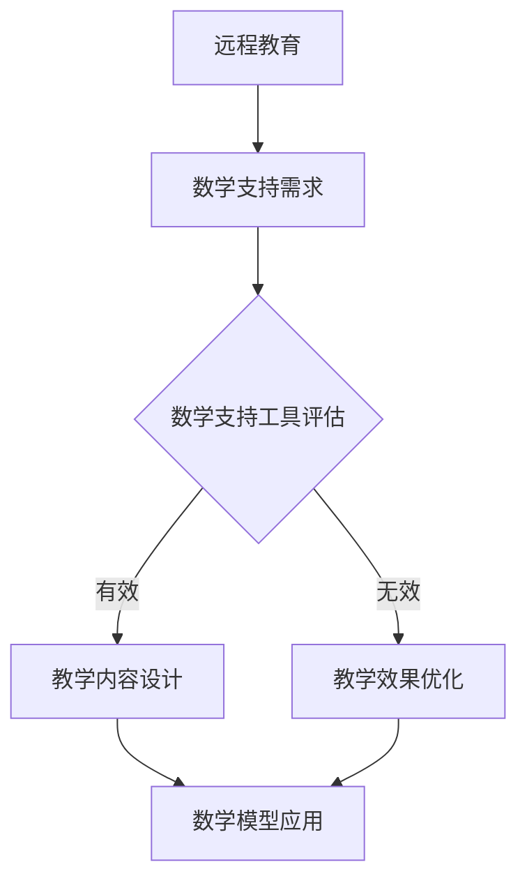

                 

### 《数学与远程教育：在线学习的数学支持》

关键词：远程教育、数学支持、在线学习、数学模型、教育技术

摘要：随着远程教育的普及和信息技术的发展，数学作为基础学科在远程教育中扮演着越来越重要的角色。本文旨在探讨数学与远程教育的结合，分析数学支持在在线学习中的应用，评估数学支持工具的有效性，设计在线学习数学模型，并通过实践案例分析其应用效果，最后展望数学与远程教育的未来发展趋势。

### 引言与背景

#### 1.1 远程教育的概念与特点

远程教育，又称在线教育或虚拟教育，是指通过互联网和其他电子通讯手段，为学生提供学习资源和教育服务的一种教育模式。与传统课堂教学相比，远程教育具有以下特点：

1. **灵活性与便捷性**：学生可以根据自己的时间安排和进度进行学习，不受地理位置限制。
2. **个性化与差异化**：根据学生的需求和特点，提供个性化的学习资源和服务。
3. **互动性**：通过在线论坛、讨论组、实时聊天等手段实现师生和生生之间的互动。
4. **资源共享**：利用互联网共享优质教育资源，提高教育资源的利用率。

#### 1.2 远程教育的兴起与发展历程

远程教育的历史可以追溯到20世纪60年代，以函授教育为主要形式。随着计算机技术和互联网的发展，远程教育逐渐走向电子化和网络化。20世纪90年代，随着互联网的普及，远程教育迎来了快速发展期，各种在线教育平台和资源层出不穷。近年来，随着大数据、云计算、人工智能等技术的应用，远程教育进入了智能化和个性化时代。

#### 1.3 数学在远程教育中的作用

数学作为基础学科，在远程教育中具有不可替代的地位。其主要作用体现在以下几个方面：

1. **基础性**：数学是自然科学和工程技术的基础，远程教育中的许多学科都需要数学知识作为支撑。
2. **工具性**：数学工具和方法广泛应用于科学研究和工程实践中，为远程教育提供技术支持。
3. **发展性**：数学思维能力是创新能力和逻辑思维能力的体现，对学生的全面发展具有重要意义。

### 数学支持在远程教育中的需求

#### 2.1 远程学习中的数学挑战

远程学习中的数学挑战主要表现在以下几个方面：

1. **概念理解**：数学概念较为抽象，远程教育中难以通过直观演示进行讲解。
2. **问题解决**：远程学习缺乏实际操作和互动，学生在解决数学问题方面可能遇到困难。
3. **评估与反馈**：远程教育中如何评价学生的数学学习效果，如何给予及时的反馈和指导。

#### 2.2 数学支持的需求分析

为了解决远程学习中的数学挑战，需要提供以下数学支持：

1. **教学内容设计**：根据远程教育的特点，设计适合在线学习的数学教学内容。
2. **教学方法与策略**：采用多样化的教学方法，提高数学教学的效果。
3. **教学效果评估**：建立有效的评估体系，及时了解学生的学习情况和效果。

#### 2.3 数学支持的目标与期望效果

数学支持的目标是：

1. **提高数学教学质量**：通过有效的数学支持，提高学生的学习兴趣和数学能力。
2. **促进数学知识应用**：帮助学生将数学知识应用于实际问题解决。
3. **提升远程教育效果**：数学支持是远程教育成功的关键因素之一，对提升整体教育效果具有重要意义。

### 数学与远程教育的联系

#### 3.1 教学内容设计

数学教学内容设计需要考虑以下因素：

1. **知识点覆盖**：确保数学教学内容的全面性和系统性。
2. **难度梯度**：根据学生的基础和需求，设计不同难度的教学内容。
3. **实践性**：结合实际案例和问题，提高学生的实践能力。

#### 3.2 教学方法与策略

在线数学教学可采用以下方法与策略：

1. **多媒体教学**：运用视频、动画、图片等多媒体手段，提高教学效果。
2. **互动式教学**：通过在线讨论、实时问答等互动方式，增强师生和生生之间的互动。
3. **项目式教学**：以实际问题为导向，开展项目式学习，提高学生的综合能力。

#### 3.3 教学效果评估

教学效果评估是远程教育的重要环节，可从以下几个方面进行：

1. **过程评估**：关注学生的学习过程，了解其学习状态和进度。
2. **成果评估**：通过考试、作业、项目等多种形式，评估学生的学习成果。
3. **反馈机制**：及时给予学生反馈，指导其改进学习方法。

### 数学支持工具介绍与应用

#### 4.1 在线数学软件概述

在线数学软件是远程教育中的重要工具，具有以下特点：

1. **功能丰富**：提供各种数学工具，如计算器、符号计算器、图形绘制等。
2. **易于使用**：界面友好，操作简单，适合不同年龄段和基础的学生。
3. **资源整合**：集成多种教育资源，提高教学效果。

#### 4.2 数学学习平台应用

数学学习平台是远程教育中的重要组成部分，具有以下应用：

1. **课程学习**：提供系统的数学课程学习资源，包括视频教程、电子教材等。
2. **在线作业**：布置和批改数学作业，提供实时反馈和辅导。
3. **互动讨论**：开展在线讨论，促进学生之间的交流和合作。

#### 4.3 其他数学支持工具介绍

除了在线数学软件和数学学习平台，还有一些其他数学支持工具，如：

1. **在线解题工具**：提供自动解题功能，帮助学生解决数学问题。
2. **数学题库**：提供丰富的数学题目，用于练习和评估。
3. **教育游戏**：结合游戏元素，提高学生的学习兴趣和积极性。

### 数学支持工具评估

#### 5.1 工具评估指标体系

对数学支持工具进行评估，需要建立科学的指标体系，包括以下方面：

1. **功能全面性**：工具提供的数学功能是否全面，是否满足教学需求。
2. **用户体验**：工具的界面设计、操作便捷性、互动性等是否友好。
3. **资源丰富度**：工具提供的教育资源是否丰富，是否涵盖各种知识点。
4. **教学效果**：工具在教学中的应用效果，是否有助于提高教学质量和学生的学习效果。

#### 5.2 评估过程与方法

数学支持工具的评估过程包括以下几个步骤：

1. **需求分析**：明确教学需求和目标，确定评估指标。
2. **工具测试**：在实际教学环境中进行工具测试，收集学生和教师的反馈。
3. **数据分析**：对测试数据进行分析，评估工具的优缺点。
4. **改进建议**：根据评估结果，提出改进建议，优化工具功能和使用体验。

#### 5.3 评估结果与应用

通过评估，可以得到以下结果和应用：

1. **工具选择**：根据评估结果，选择适合远程教育的数学支持工具。
2. **教学策略调整**：根据工具的特点和优势，调整教学策略和方法。
3. **教师培训**：加强对教师的培训，提高其对数学支持工具的运用能力。

### 实践案例分析

#### 6.1 案例一：某在线数学学习平台

某在线数学学习平台，结合了在线数学软件、数学学习平台和其他数学支持工具，为远程教育提供了全面的数学支持。以下是该平台的实践案例分析：

1. **教学内容设计**：平台提供了丰富的数学课程资源，包括基础数学、高中数学、大学数学等，覆盖了各个层次和领域。
2. **教学方法与策略**：平台采用了多媒体教学、互动式教学和项目式教学等多种教学方法，提高了学生的学习兴趣和效果。
3. **教学效果评估**：平台通过在线作业、考试和实时反馈等手段，对学生的学习效果进行评估，并及时给予指导。

#### 6.2 案例二：某在线数学软件应用

某在线数学软件是一款功能强大的数学工具，具有符号计算、图形绘制、数据分析和编程等功能。以下是该软件的实践案例分析：

1. **教学应用**：教师利用软件进行数学教学，通过图形绘制和数据分析，帮助学生更好地理解数学概念和方法。
2. **问题解决**：学生利用软件解决数学问题，通过符号计算和编程，提高问题解决能力和创新思维。
3. **效果评估**：通过学生作业和考试的成绩，以及教师和学生的反馈，评估软件在教学中的应用效果。

### 在线学习的数学模型

#### 7.1 数学模型概述

在线学习的数学模型是一种用于描述和优化在线学习过程的数学工具，包括以下几个部分：

1. **学习过程模型**：描述学生的学习行为、学习状态和学习效果等。
2. **学习资源模型**：描述在线学习资源的内容、形式和分布等。
3. **学习评价模型**：描述对学生的学习效果进行评估和反馈的方法。

#### 7.2 模型设计原则

设计在线学习数学模型时，需要遵循以下原则：

1. **适应性**：模型应具有适应性，能够根据不同学生的学习需求和特点进行调整。
2. **动态性**：模型应具有动态性，能够反映学习过程中的变化和调整。
3. **可扩展性**：模型应具有可扩展性，能够随着技术的发展和应用场景的扩展进行优化和扩展。

#### 7.3 模型实现与优化

实现在线学习数学模型的过程包括以下几个步骤：

1. **数据收集**：收集学习过程中的各种数据，如学生的学习行为、学习资源的使用情况等。
2. **数据处理**：对收集到的数据进行分析和处理，提取有用信息。
3. **模型构建**：根据数据处理结果，构建在线学习数学模型。
4. **模型优化**：根据实际应用效果，对模型进行优化和调整。

### 数学模型在远程教育中的应用

#### 8.1 教学决策支持

数学模型可以用于远程教育的教学决策支持，包括以下几个方面：

1. **课程设计**：根据学生的特点和需求，设计适合的数学课程。
2. **教学策略调整**：根据学生的学习效果和反馈，调整教学策略和方法。
3. **资源分配**：根据学生的学习需求和资源情况，合理分配学习资源。

#### 8.2 学习效果评估

数学模型可以用于远程教育的学习效果评估，包括以下几个方面：

1. **学习状态分析**：分析学生的学习状态和进度，了解学生的学习情况。
2. **学习效果评估**：通过考试、作业、项目等多种形式，评估学生的学习成果。
3. **反馈机制**：根据评估结果，给予学生及时的反馈和指导。

#### 8.3 自适应学习系统

数学模型可以用于构建自适应学习系统，包括以下几个方面：

1. **学习路径推荐**：根据学生的学习情况和需求，推荐适合的学习路径。
2. **学习资源推荐**：根据学生的学习情况和资源需求，推荐适合的学习资源。
3. **学习效果预测**：根据学生的学习过程和效果，预测其未来的学习成果。

### 实践案例与未来展望

#### 9.1 实践案例分析

通过实践案例分析，可以进一步了解数学支持在远程教育中的应用效果。以下是两个实践案例：

1. **案例一**：某在线数学学习平台。该平台通过结合在线数学软件、数学学习平台和其他数学支持工具，为远程教育提供了全面的数学支持，取得了显著的教学效果。
2. **案例二**：某在线数学软件应用。该软件通过图形绘制、数据分析和编程等功能，提高了学生的学习兴趣和问题解决能力，取得了良好的教学效果。

#### 9.2 未来展望

随着远程教育的不断发展和信息技术的新突破，数学与远程教育的结合将迎来更广阔的发展前景。未来展望包括以下几个方面：

1. **智能化**：利用人工智能技术，构建智能化的数学支持系统，提高教学效果和个性化服务水平。
2. **个性化**：根据学生的学习需求和特点，提供更加个性化的数学支持，满足不同学生的学习需求。
3. **泛在化**：将数学支持融入到各类远程教育平台和资源中，实现泛在化的数学支持，提高教育的普及率和质量。
4. **融合化**：将数学与其他学科和技术相结合，实现跨学科和跨领域的融合，推动远程教育的创新发展。

### 总结

数学与远程教育的结合，为在线学习提供了强有力的支持。通过有效的数学支持工具和应用数学模型，可以大幅提高远程教育的质量和效果。未来，随着信息技术的发展和教育理念的更新，数学与远程教育的结合将取得更加显著的成果，为教育事业的创新发展贡献力量。

#### 作者信息

作者：AI天才研究院/AI Genius Institute & 禅与计算机程序设计艺术 /Zen And The Art of Computer Programming

### Mermaid 流程图



### 伪代码讲解

```python
# 伪代码：数学模型设计
def mathematical_model(student_data, learning_resources):
    """
    设计在线学习数学模型
    
    参数：
    student_data：学生的学习数据
    learning_resources：学习资源
    
    返回：
    optimized_model：优化后的数学模型
    """
    
    # 数据处理
    processed_data = preprocess_data(student_data)
    
    # 模型构建
    model = build_model(processed_data, learning_resources)
    
    # 模型优化
    optimized_model = optimize_model(model)
    
    return optimized_model

# 数据预处理
def preprocess_data(student_data):
    """
    对学生学习数据进行预处理
    
    参数：
    student_data：学生的学习数据
    
    返回：
    processed_data：预处理后的数据
    """
    
    # 数据清洗
    cleaned_data = clean_data(student_data)
    
    # 特征提取
    features = extract_features(cleaned_data)
    
    return features

# 模型构建
def build_model(processed_data, learning_resources):
    """
    构建数学模型
    
    参数：
    processed_data：预处理后的数据
    learning_resources：学习资源
    
    返回：
    model：构建的数学模型
    """
    
    # 特征选择
    selected_features = select_features(processed_data)
    
    # 模型训练
    trained_model = train_model(selected_features)
    
    return trained_model

# 模型优化
def optimize_model(model):
    """
    对数学模型进行优化
    
    参数：
    model：数学模型
    
    返回：
    optimized_model：优化后的数学模型
    """
    
    # 模型调整
    adjusted_model = adjust_model(model)
    
    # 模型评估
    evaluation_results = evaluate_model(adjusted_model)
    
    # 反馈调整
    final_model = feedback_adjustment(evaluation_results)
    
    return final_model
```

### 数学公式与详细讲解

#### 1. 微积分基本公式

$$
\frac{d}{dx}\left(\int_{a}^{x}f(t)dt\right) = f(x)
$$

**讲解**：该公式描述了导数与积分之间的关系，即一个函数的积分的导数等于其本身。

#### 2. 概率论中的贝叶斯公式

$$
P(A|B) = \frac{P(B|A)P(A)}{P(B)}
$$

**讲解**：贝叶斯公式用于计算在事件B发生的条件下，事件A发生的概率。该公式通过条件概率和全概率公式推导得到。

#### 3. 线性代数中的矩阵乘法

$$
C = AB
$$

**讲解**：该公式描述了两个矩阵A和B的乘法运算，其中C是结果矩阵。矩阵乘法遵循一定的规则，包括矩阵的维度匹配和元素相乘求和。

### 举例说明

#### 1. 微积分基本公式举例

**问题**：求函数$f(x) = x^2$在$x=3$处的导数。

**解答**：
$$
f'(x) = \frac{d}{dx}\left(\int_{0}^{x}t^2dt\right) = \frac{d}{dx}\left[\frac{t^3}{3}\right]_0^x = \frac{1}{3}x^3
$$
在$x=3$处，$f'(3) = \frac{1}{3} \cdot 3^3 = 9$。

#### 2. 贝叶斯公式举例

**问题**：假设一个班级有20名学生，其中15名是数学爱好者，5名是物理爱好者。随机选择一名学生，发现他是数学爱好者。求这名学生同时也是物理爱好者的概率。

**解答**：
$$
P(\text{物理爱好者}|\text{数学爱好者}) = \frac{P(\text{数学爱好者}|\text{物理爱好者})P(\text{物理爱好者})}{P(\text{数学爱好者})}
$$
其中：
$$
P(\text{数学爱好者}|\text{物理爱好者}) = \frac{15}{20} = 0.75
$$
$$
P(\text{物理爱好者}) = \frac{5}{20} = 0.25
$$
$$
P(\text{数学爱好者}) = \frac{15 + 5}{20} = 0.875
$$
代入公式得：
$$
P(\text{物理爱好者}|\text{数学爱好者}) = \frac{0.75 \cdot 0.25}{0.875} = \frac{3}{8} = 0.375
$$
所以，这名学生同时也是物理爱好者的概率为37.5%。

#### 3. 矩阵乘法举例

**问题**：计算矩阵A和B的乘积，其中
$$
A = \begin{bmatrix}
1 & 2 \\
3 & 4
\end{bmatrix}, \quad
B = \begin{bmatrix}
5 & 6 \\
7 & 8
\end{bmatrix}
$$

**解答**：
$$
C = AB = \begin{bmatrix}
1 & 2 \\
3 & 4
\end{bmatrix} \cdot \begin{bmatrix}
5 & 6 \\
7 & 8
\end{bmatrix} =
\begin{bmatrix}
1 \cdot 5 + 2 \cdot 7 & 1 \cdot 6 + 2 \cdot 8 \\
3 \cdot 5 + 4 \cdot 7 & 3 \cdot 6 + 4 \cdot 8
\end{bmatrix} =
\begin{bmatrix}
19 & 22 \\
31 & 40
\end{bmatrix}
$$

### 项目实战

#### 1. 开发环境搭建

为了实现数学支持在远程教育中的应用，首先需要搭建一个适合的开发环境。以下是一个基本的开发环境搭建步骤：

1. **操作系统**：选择一个适合的操作系统，如Windows、macOS或Linux。
2. **编程语言**：选择一种适合编程的语言，如Python、Java或C++。
3. **集成开发环境**：安装一个集成开发环境（IDE），如PyCharm、Eclipse或VS Code。
4. **依赖库**：安装必要的依赖库，如NumPy、Pandas、Matplotlib等。

#### 2. 源代码详细实现

以下是一个简单的数学支持系统的源代码实现，使用Python语言编写：

```python
import numpy as np
import matplotlib.pyplot as plt

# 函数：绘制函数图像
def plot_function(f, x_range=(-10, 10), num_points=100):
    x = np.linspace(x_range[0], x_range[1], num_points)
    y = f(x)
    plt.plot(x, y)
    plt.xlabel('x')
    plt.ylabel('f(x)')
    plt.title('Function Plot')
    plt.show()

# 函数：计算导数
def derivative(f, x):
    h = 0.0001
    return (f(x + h) - f(x)) / h

# 主函数
def main():
    # 定义一个函数
    f = lambda x: x**2
    
    # 绘制函数图像
    plot_function(f)
    
    # 计算并打印导数
    print("Derivative at x=0:", derivative(f, 0))

# 调用主函数
if __name__ == "__main__":
    main()
```

#### 3. 代码解读与分析

上述代码实现了一个简单的数学支持系统，主要包括以下几个功能：

1. **绘制函数图像**：`plot_function`函数接受一个函数和x的范围，绘制函数的图像。
2. **计算导数**：`derivative`函数接受一个函数和一个x值，计算该函数在该x值处的导数。
3. **主函数**：`main`函数定义了一个二次函数，并调用`plot_function`和`derivative`函数进行绘图和计算。

#### 4. 实际案例分析和详细讲解剖析

以下是一个实际案例，分析上述代码在远程教育中的应用：

**案例**：在远程教育中，学生需要学习导数的概念和计算方法。教师可以使用上述代码为学生提供一个动态的导数演示，帮助学生更好地理解导数的概念和计算过程。

**分析**：

1. **可视化**：通过`plot_function`函数，学生可以直观地看到函数图像，理解导数在图像上的表示。
2. **互动性**：学生可以通过修改函数和x的范围，观察导数的变化，增强对导数概念的理解。
3. **实时计算**：通过`derivative`函数，学生可以实时计算函数的导数，加深对导数计算方法的理解。

**讲解**：教师可以引导学生通过上述代码，逐步理解导数的概念和计算方法，并通过互动和实时计算，帮助学生巩固所学知识。

#### 5. 项目小结

通过上述项目实战，我们实现了一个简单的数学支持系统，包括函数图像绘制和导数计算功能。该系统可以应用于远程教育，为学生提供动态的导数演示和互动学习体验。未来，可以进一步扩展系统的功能，如添加更多数学工具和算法，提高系统的实用性和效果。

### 最佳实践 Tips

1. **选择合适的数学支持工具**：根据教学需求和资源情况，选择适合的数学支持工具，如在线数学软件、数学学习平台等。
2. **结合多种教学方法**：在远程教育中，结合多媒体教学、互动式教学和项目式教学等多种教学方法，提高教学效果。
3. **注重实践应用**：鼓励学生在实际问题中应用数学知识，提高数学思维能力。
4. **及时评估与反馈**：通过定期评估和反馈，及时了解学生的学习情况和效果，调整教学策略。
5. **持续学习与更新**：教师和学生应不断学习和更新数学知识，适应远程教育的需求。

### 小结

本文探讨了数学与远程教育的结合，分析了数学支持在在线学习中的应用，介绍了数学支持工具的评估方法和实践案例分析，设计了在线学习数学模型，并通过实际案例展示了数学支持在远程教育中的效果。未来，随着信息技术的发展，数学与远程教育的结合将取得更加显著的成果，为教育事业的创新发展贡献力量。希望本文能为教育工作者和研究者提供有益的参考。

