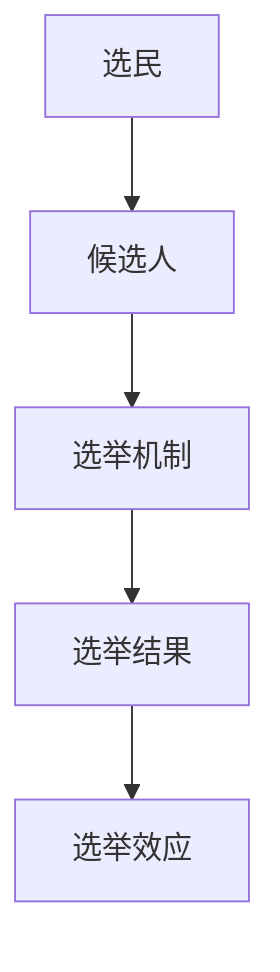
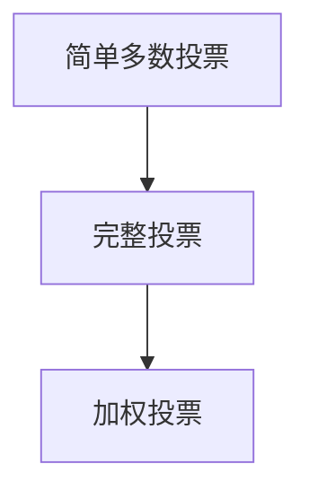

                 

### **文章标题**: 数学与选举系统：投票机制的数学设计

#### **关键词**: 投票机制，数学模型，选举系统，组合数学，稳定性分析

#### **摘要**: 
本文深入探讨了投票机制的数学设计，从基本概念出发，逐步剖析了各种投票系统的数学模型和设计原则，并通过稳定性分析和实际案例分析，展示了数学在选举系统中的应用与影响。

---

## **第一部分：选举系统的数学基础**

### **第1章：选举系统概述**

#### **1.1 选举系统的基本概念**

选举是民主社会中一项基本的活动，它涉及选择代表、决策制定和权力分配等多个方面。选举系统可以分为直接选举和间接选举两大类。直接选举是指选民直接投票选举代表，而间接选举则是选民首先选举出代表他们的代表，再由这些代表进行进一步的投票选举。

在讨论选举系统时，我们需要明确几个核心概念：选民、候选人、选举机制、选举结果和选举效应。选民是参与选举的个人，候选人是在选举中争取选民支持的个体。选举机制则是指如何收集和计算选票的方式，常见的有简单多数投票、比例代表投票和决选投票等。

选举的目标通常包括代表性、公正性和效率。代表性指的是选举结果能够真实反映选民的意愿；公正性要求选举过程和结果不受不正当干预；效率则关注选举的成本和速度。

#### **1.2 数学在选举系统中的作用**

数学在选举系统中的作用至关重要。它不仅为我们提供了一套分析和评估选举机制的工具，还帮助我们在复杂的社会环境中更好地理解选举过程和结果。

首先，数学模型可以用来模拟和预测选举结果。通过构建数学模型，我们可以分析不同选举机制下的选民行为和候选人策略，预测选举的可能结果。这种分析有助于政策制定者和选举专家制定更有效的选举策略。

其次，数学在评估选举系统的公正性和稳定性方面也发挥着重要作用。例如，组合数学可以用来计算各种投票机制的可行性，概率论和统计学则可以帮助我们分析选举结果的不确定性。

#### **图1-1：选举系统中的核心概念关联图**

### **第2章：投票机制的数学设计**

#### **2.1 投票机制的类型**

投票机制的设计直接影响选举的公正性和有效性。常见的投票机制包括简单多数投票、完整投票和加权投票等。

**简单多数投票**是最常见的投票机制，它要求获得最多选票的候选人获胜。简单多数投票的优点是直观易懂，操作简单，但缺点是可能导致“多数暴政”，即在多选情况下，某一候选人可能仅获得微弱优势却赢得选举。

**完整投票**（也称为“等级投票”或“偏好投票”），允许选民对多个候选人进行排序，选举结果是按照选票排序累积获得的。完整投票可以更好地反映选民的偏好分布，减少“第三候选人效应”，但计算复杂度较高。

**加权投票**则根据不同选民的影响力分配不同的权重，如代表、专家等，其目的是更准确地反映不同群体的意愿。

#### **2.2 投票机制的数学模型**

投票机制的数学模型主要涉及概率论、统计学和组合数学。

- **概率模型**用于模拟选民投票的概率分布。例如，我们可以使用贝叶斯网络或马尔可夫链来分析选民在不同投票机制下的行为。

- **组合数学**在计算投票组合和可能性方面有广泛应用。例如，在计算简单多数投票的获胜概率时，我们可以使用组合数学中的排列组合方法。

- **统计学模型**则用于分析选举结果的不确定性和稳定性。例如，我们可以使用标准差和置信区间来评估选举结果的可信度。

#### **图2-1：投票机制类型的关联图**

## **第二部分：选举结果的稳定性分析**

### **第3章：稳定性分析的基本原理**

#### **3.1 稳定性分析的基本原理**

选举结果的稳定性分析是评估选举系统公正性的重要方面。稳定性分析旨在确定选举结果是否受到异常值或偏差的影响，从而判断选举系统的稳健性。

稳定性分析通常基于以下几个基本原理：

1. **偏差与异常值的影响**：分析选民投票数据中异常值或偏差对选举结果的影响，判断选举结果的稳健性。
2. **偏差检测**：使用统计学方法检测投票数据中的异常值，如箱线图、标准差等。
3. **稳健性测试**：通过模拟不同情况下的投票数据，测试选举系统在不同情境下的稳定性。

#### **3.2 稳定性准则**

稳定性准则用于评估选举系统的稳定性。常见的稳定性准则包括：

- **一致准则**：如果选举结果在不同投票机制下保持一致，则认为选举系统是稳定的。
- **中立准则**：如果选举结果不受特定候选人或选民群体的干扰，则认为选举系统是稳定的。
- **最小影响准则**：如果选举结果在异常值或偏差较小的情况下保持稳定，则认为选举系统是稳定的。

### **第4章：选举结果的稳定性分析**

#### **4.1 稳定性分析的方法**

稳定性分析的方法主要包括：

- **概率模型**：使用概率模型分析选举结果的不确定性，如贝叶斯网络、马尔可夫链等。
- **统计学方法**：使用统计学方法评估选举结果的稳健性，如置信区间、假设检验等。
- **仿真模拟**：通过仿真模拟不同情境下的选举过程，分析选举结果的稳定性。

#### **4.2 稳定性分析的案例研究**

为了更好地理解稳定性分析，我们可以通过案例分析来展示实际应用。

**案例1：某城市市长选举**

在某城市市长选举中，选民投票数据被检测出存在多个异常值。通过稳定性分析，发现这些异常值对选举结果有显著影响，导致原本领先的候选人未能获胜。进一步分析表明，选举系统的稳定性较差，需要改进。

**案例2：某国家总统选举**

在某国家总统选举中，选举结果在多次计票后仍存在争议。通过稳定性分析，发现选举结果在不同计票方式下保持一致，表明选举系统具有较高的稳定性。然而，由于计票过程中的偏差较大，需要对计票系统进行改进以确保稳定性。

### **第5章：选举结果的稳定性分析与改进**

#### **5.1 选举结果稳定性分析的重要性**

选举结果的稳定性分析对于确保选举公正性和可信度至关重要。通过稳定性分析，我们可以及时发现选举系统中的问题，提出改进措施，提高选举系统的稳健性。

#### **5.2 选举结果稳定性分析的改进措施**

为了提高选举结果的稳定性，我们可以采取以下改进措施：

- **改进投票机制**：设计更为公正和稳健的投票机制，减少异常值和偏差的影响。
- **加强数据分析**：使用先进的统计学方法和概率模型，提高数据分析的准确性和可靠性。
- **优化计票系统**：采用先进的计票技术，减少计票过程中的误差和偏差。

### **第6章：选举系统的未来发展趋势**

#### **6.1 新技术的影响**

随着信息技术的快速发展，选举系统也在不断演进。新技术，如人工智能、区块链和大数据分析等，为选举系统的改进提供了新的可能性。

- **人工智能**：通过机器学习和数据挖掘技术，可以更精确地分析选民行为和选举结果，提高选举预测的准确性。
- **区块链**：区块链技术可以提供透明的选举过程和不可篡改的投票记录，提高选举的可信度。
- **大数据分析**：通过对大规模数据的分析，可以更好地了解选民需求和偏好，优化选举策略。

#### **6.2 未来发展趋势**

未来，选举系统的发展趋势将包括以下几个方面：

- **智能化选举系统**：通过人工智能技术，实现选举过程的自动化和智能化，提高选举效率和准确性。
- **透明化选举过程**：通过区块链技术，确保选举过程的透明和可追溯性，增强公众对选举的信任。
- **个性化选举策略**：通过大数据分析，制定更加个性化和精准的选举策略，更好地满足选民需求。

### **结语**

数学在选举系统中的应用具有重要意义。通过数学模型和算法，我们可以更好地设计投票机制，分析选举结果，提高选举系统的公正性和稳健性。随着新技术的不断发展，选举系统将变得更加智能、透明和个性化，为民主社会的建设提供更强有力的支持。

---

**作者：AI天才研究院/AI Genius Institute & 禅与计算机程序设计艺术 /Zen And The Art of Computer Programming**

