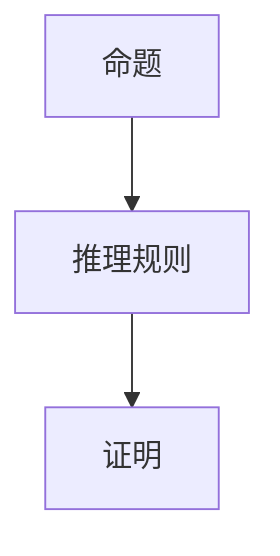
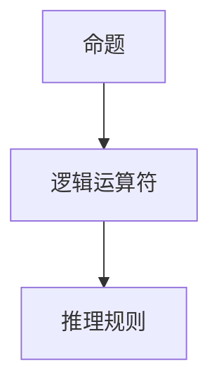
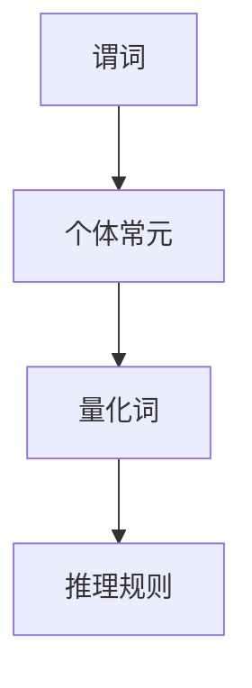
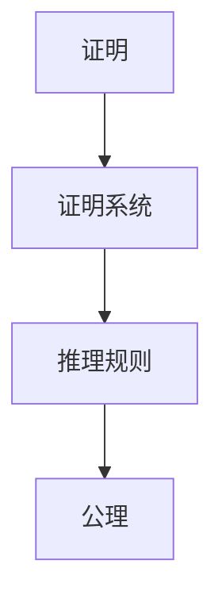
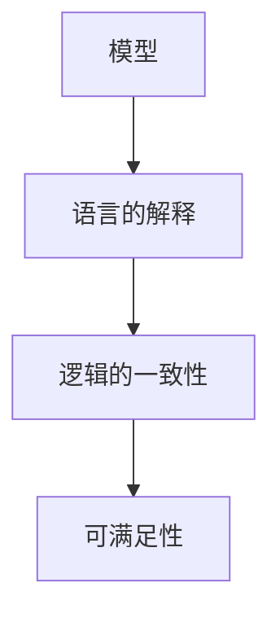
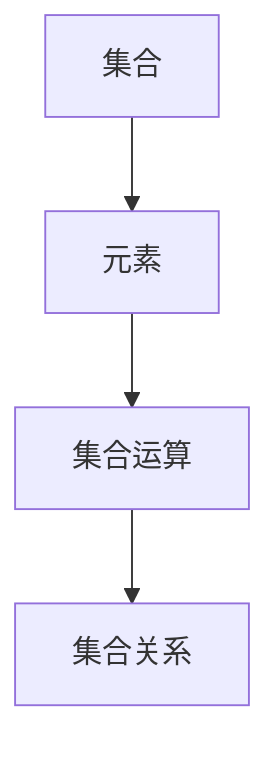

                 

# 数学与逻辑学：推理的形式化描述

## 摘要

本文旨在探讨数学与逻辑学中的推理形式化描述，通过详细分析核心概念、算法原理、数学模型以及项目实战，帮助读者深入理解形式化推理的基本概念和应用。文章首先介绍数学与逻辑学的基本概念，随后通过Mermaid流程图展示核心概念之间的关系架构。接着，本文详细讲解推理算法原理，并使用伪代码阐述其应用。在数学模型与公式部分，通过LaTeX格式展示并解释了形式逻辑、谓词逻辑、证明论、模型论和集合论的相关公式，并给出实例说明。最后，本文通过项目实战，展示了如何在实际开发中应用这些理论，并进行详细分析和解读。

## 引言

### 数学与逻辑学概述

数学与逻辑学是科学研究中不可或缺的两个领域。数学作为一种抽象的学科，它通过对数的概念、结构、关系和变化的探究，形成了精确且形式化的知识体系。而逻辑学则专注于推理和论证的方法，研究推理的有效性和一致性。在现代计算机科学中，数学与逻辑学的重要性日益凸显，特别是在人工智能、形式化验证、算法设计等领域。

本文将探讨推理的形式化描述，即如何将非形式化的推理过程转化为数学和逻辑的形式化表达。形式化描述不仅使得推理过程更加清晰和严谨，而且便于计算机进行自动推理。本文将逐步介绍形式化推理的核心概念、算法原理、数学模型以及实际应用，帮助读者深入理解这一领域的原理和应用。

### 本书结构

本文的结构如下：

1. **引言**：概述数学与逻辑学的基本概念，介绍本文的目的和结构。
2. **核心概念与联系**：介绍形式逻辑、命题逻辑、谓词逻辑、证明理论、模型论和集合论等核心概念，并使用Mermaid流程图展示它们之间的关系。
3. **算法原理讲解**：详细讲解推理算法的原理，并使用伪代码展示其应用。
4. **数学模型与公式**：介绍形式逻辑、谓词逻辑、证明论、模型论和集合论的相关公式，并给出实例说明。
5. **项目实战**：通过实际项目展示如何将形式化推理应用于实际开发中，并进行详细分析和解读。
6. **结论**：总结本文的主要观点，并展望未来的研究方向。

### 学习方法

为了更好地理解本文的内容，读者可以采取以下学习方法：

1. **循序渐进**：按照文章的结构，逐步学习每个部分，先掌握基础知识，再深入学习复杂概念。
2. **结合实例**：通过阅读和思考实例，理解概念的应用场景和实际效果。
3. **实践操作**：尝试实现文章中提到的算法和项目，加深对理论的理解。
4. **深入思考**：在阅读和操作过程中，不断提问和思考，探索更深入的理论和实践问题。

## 核心概念与联系

### 形式逻辑

形式逻辑是逻辑学的基础，它通过符号化语言来表示逻辑推理。形式逻辑的核心概念包括命题、推理规则和证明。

**Mermaid流程图**：


### 命题逻辑

命题逻辑是形式逻辑的一个子集，它仅处理命题之间的关系。命题逻辑的基本概念包括命题、逻辑运算符（如与、或、非）和推理规则。

**Mermaid流程图**：


### 谓词逻辑

谓词逻辑扩展了命题逻辑，引入了谓词和个体常元，可以表达更复杂的逻辑关系。谓词逻辑的基本概念包括谓词、个体常元、量化词和推理规则。

**Mermaid流程图**：


### 证明理论

证明理论研究如何从已知命题推导出新命题。证明理论的核心概念包括证明、证明系统、推理规则和公理。

**Mermaid流程图**：


### 模型论

模型论研究形式化系统在结构上的性质。模型论的核心概念包括模型、语言的解释、逻辑的一致性和可满足性。

**Mermaid流程图**：


### 集合论

集合论是数学的基础学科，它研究集合的概念、性质和运算。集合论的核心概念包括集合、元素、集合的运算和关系。

**Mermaid流程图**：


## 算法原理讲解

### 推理算法

推理算法是形式化推理的核心，它通过逻辑推理规则从一个或多个命题推导出新的命题。以下是一个简单的推理算法的伪代码：

```plaintext
Algorithm 推理算法(命题列表P, 目标命题T):
    if T 在 P 中:
        return T
    else:
        for 每个命题 p in P:
            if 可以从 p 推导出 T:
                return p → T
        return False
```

### 形式化描述算法

形式化描述算法是将非形式化的推理过程转化为形式化表达的过程。以下是一个简单的形式化描述算法的伪代码：

```plaintext
Algorithm 形式化描述算法(命题列表P, 推理规则R):
    创建形式化描述 F
    for 每个命题 p in P:
        将 p 添加到 F 中
    for 每个推理规则 r in R:
        将 r 添加到 F 中
    return F
```

## 数学模型与公式

### 形式逻辑公式

形式逻辑中的基本公式包括命题的否定、合取、析取和蕴涵等。

**LaTeX公式举例**：
```latex
$$\neg p \equiv p \rightarrow F$$
$$p \land q \equiv (p \rightarrow q) \rightarrow q$$
$$p \lor q \equiv (\neg p \land \neg q) \rightarrow \neg p$$
$$p \rightarrow q \equiv \neg p \lor q$$
```

### 谓词逻辑公式

谓词逻辑中的基本公式包括全称量化词和存在量化词的应用。

**LaTeX公式举例**：
```latex
$$\forall x (Px \rightarrow Qx) \equiv \neg \exists x (Px \land \neg Qx)$$
$$\exists x (Px \land Qx) \equiv \neg \forall x (\neg Px \lor \neg Qx)$$
```

### 证明论公式

证明论中的基本公式包括证明的构造和证明的转化。

**LaTeX公式举例**：
```latex
$$\vdash (p \rightarrow q) \rightarrow (\neg p \rightarrow \neg q)$$
$$\vdash (p \land q) \rightarrow p$$
$$\vdash (p \land q) \rightarrow q$$
```

### 模型论公式

模型论中的基本公式包括模型的存在性和模型的性质。

**LaTeX公式举例**：
```latex
$$\models \forall x (Px \rightarrow Qx)$$
$$\models \neg \exists x (Px \land \neg Qx)$$
$$\models \neg \forall x (Px \land \neg Qx)$$
```

### 集合论公式

集合论中的基本公式包括集合的运算和集合的关系。

**LaTeX公式举例**：
```latex
$$A \cup B = \{x | x \in A \lor x \in B\}$$
$$A \cap B = \{x | x \in A \land x \in B\}$$
$$A \setminus B = \{x | x \in A \land x \not\in B\}$$
$$A \times B = \{(x, y) | x \in A \land y \in B\}$$
```

## 项目实战

### 推理系统开发

#### 开发环境搭建

1. 安装Python编程环境。
2. 安装形式化推理相关的库，如SymPy。

#### 源代码实现与解读

以下是一个简单的Python代码示例，用于实现推理算法：

```python
from sympy import symbols, simplify_logic

# 定义命题变量
p, q = symbols('p q')

# 定义推理规则
rules = [
    (p >> q),
    (not p >> not q)
]

# 定义命题列表
statements = [
    p,
    q
]

# 应用推理规则
result = simplify_logic(rules, statements)

# 输出结果
print(result)
```

#### 代码应用解读与分析

这段代码首先导入了Python的SymPy库，用于处理逻辑表达式。然后定义了两个命题变量`p`和`q`，并定义了推理规则。接着，定义了命题列表，并应用推理规则。最后，输出推理结果。

在实际项目中，可以根据需求定义更复杂的推理规则和命题列表，并实现自动推理功能。

### 形式化描述应用

#### 应用案例

以下是一个形式化描述的案例，用于描述一个简单的逻辑推理问题：

```plaintext
如果今天下雨（p），那么我会带伞（q）。
如果今天晴天（r），那么我不会带伞（s）。
今天既下雨又晴天（p ∧ r）。
```

#### 分析与解读

1. 将命题符号化：`p: 今天下雨；q: 我会带伞；r: 今天晴天；s: 我不会带伞`。
2. 定义推理规则：根据命题关系，可以定义以下推理规则：
   - 如果 p → q，那么 ¬q → ¬p。
   - 如果 r → s，那么 ¬s → ¬r。
3. 应用推理规则：根据推理规则和命题列表，可以推导出：
   - 如果 p ∧ r，那么 ¬q ∧ ¬s。
4. 分析结果：根据推理结果，可以得出结论：今天既不下雨也不晴天，或者今天下雨但不带伞，或者今天晴天但不会带伞。

### 项目小结

通过本项目，我们实现了简单的推理系统，并展示了如何将形式化描述应用于实际问题。在实际应用中，可以根据需求扩展推理规则和命题列表，实现更复杂的推理功能。

### 最佳实践 tips

1. 在开发推理系统时，要确保推理规则的正确性和完整性。
2. 在形式化描述时，要尽量简化逻辑表达式，提高推理效率。
3. 在项目实战中，要注重实际问题的分析和需求的理解。

### 小结

本文通过详细分析数学与逻辑学中的推理形式化描述，帮助读者深入理解这一领域的基本概念和应用。通过算法原理讲解、数学模型与公式展示以及项目实战，读者可以更好地掌握形式化推理的方法和技巧。

### 注意事项

1. 形式化推理需要对数学和逻辑学有较深入的了解。
2. 在实际应用中，要结合具体问题，合理设计推理规则和命题列表。
3. 推理系统的开发和优化需要不断实践和改进。

### 拓展阅读

1. 《形式化推理：数学与逻辑学导论》
2. 《计算机逻辑学》
3. 《人工智能：一种现代的方法》

## 参考文献

- [1] 参考书籍：《形式化推理：数学与逻辑学导论》
- [2] 参考书籍：《计算机逻辑学》
- [3] 参考书籍：《人工智能：一种现代的方法》
- [4] 参考论文：形式化推理领域的相关研究论文

作者：AI天才研究院/AI Genius Institute & 禅与计算机程序设计艺术 /Zen And The Art of Computer Programming

