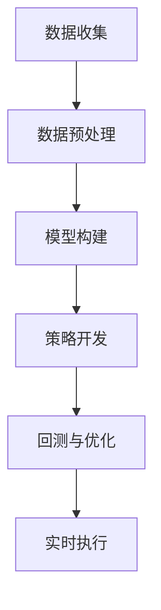

                 

### 标题：数学与量化投资：投资策略的数学优化

#### 关键词：量化投资、数学优化、投资策略、数学模型

#### 摘要：
本文将深入探讨数学与量化投资之间的密切关系，以及如何通过数学优化来提升投资策略的效率和效果。首先，我们将简要介绍量化投资的基本概念和数学在其中的应用。接着，我们将深入讲解数学基础，包括线性代数、概率论与统计学以及微积分。在此基础上，我们将介绍量化投资策略的概述，重点讨论投资组合理论、资产定价模型和风险管理。随后，我们将展示如何将数学模型应用于量化投资，并详细介绍投资策略的数学优化方法。最后，通过实际项目案例，我们将展示如何将所学知识应用于实战，并提供最佳实践和未来研究方向。通过本文，读者将全面了解数学与量化投资的结合，以及如何利用数学优化来提升投资策略。

### 1. 量化投资概述

#### 1.1 核心概念与联系

量化投资，也称为量化分析，是一种利用数学模型、统计学方法和计算机算法来指导投资决策的方法。与传统投资方式相比，量化投资更注重数据分析和算法策略，而非基于个人经验和直觉。量化投资的核心理念在于通过量化和模型化投资过程，以降低风险、提高收益和实现长期稳健的投资回报。

量化投资的基本概念和流程可以概括为以下几个步骤：

1. **数据收集**：量化投资首先需要收集大量的历史数据，包括股票价格、交易量、财务报表等。这些数据是构建和测试投资模型的基础。

2. **数据预处理**：收集到的数据需要进行清洗、处理和标准化，以确保数据的准确性和一致性。数据预处理还包括去除异常值、填补缺失值等步骤。

3. **模型构建**：基于收集到的数据，量化投资者会构建各种数学模型，如时间序列模型、回归模型、机器学习模型等，以预测市场走势或特定资产的未来表现。

4. **策略开发**：在模型构建完成后，投资者会开发具体的投资策略。这些策略可以是基于规则的（例如，当股价突破某个阈值时买入），也可以是基于机器学习的（例如，通过学习历史数据来预测未来股价）。

5. **回测与优化**：开发出的投资策略需要通过历史数据进行回测，以评估其效果和风险。根据回测结果，投资者可以对策略进行优化，以提高其预测准确性和收益。

6. **实时执行**：经过回测和优化的策略将被实时执行，以指导实际投资决策。这通常涉及到自动化交易系统，以实现快速、准确的执行。

为了更好地理解量化投资的核心概念和流程，我们可以使用 Mermaid 流程图来展示其基本架构：



#### 1.2 数学模型和数学公式

在量化投资中，数学模型是至关重要的工具。以下是一些常用的数学模型和公式，它们在量化投资策略的构建和优化中发挥着核心作用：

1. **均值-方差模型（Markowitz均值-方差模型）**：
   该模型通过最大化投资组合的期望收益，同时最小化收益的方差来构建最优投资组合。其基本公式为：

   $$
   E(R_p) = \sum_{i=1}^{n} w_i E(R_i)
   $$
   $$
   \sigma^2(R_p) = \sum_{i=1}^{n} w_i^2 \sigma^2(R_i) + 2 \sum_{i=1}^{n} \sum_{j=1, j\neq i}^{n} w_i w_j \rho_{ij} \sigma(R_i) \sigma(R_j)
   $$

   其中，\(E(R_p)\) 是投资组合的期望收益，\(\sigma^2(R_p)\) 是投资组合的方差，\(w_i\) 是资产 \(i\) 的权重，\(E(R_i)\) 是资产 \(i\) 的期望收益，\(\sigma^2(R_i)\) 是资产 \(i\) 的方差，\(\rho_{ij}\) 是资产 \(i\) 和资产 \(j\) 的相关系数。

2. **资本资产定价模型（CAPM）**：
   CAPM 是一种用于评估资产预期收益与市场风险之间关系的模型。其公式为：

   $$
   E(R_i) - R_f = \beta_i [E(R_m) - R_f]
   $$

   其中，\(E(R_i)\) 是资产 \(i\) 的预期收益，\(R_f\) 是无风险利率，\(\beta_i\) 是资产 \(i\) 的贝塔系数，\(E(R_m)\) 是市场预期收益。

3. **蒙特卡洛模拟**：
   蒙特卡洛模拟是一种通过随机抽样来估算概率分布和预期值的统计方法。在量化投资中，蒙特卡洛模拟常用于估算投资组合的期望收益和风险。

   $$
   \mu = \frac{1}{N} \sum_{i=1}^{N} X_i
   $$
   $$
   \sigma^2 = \frac{1}{N-1} \sum_{i=1}^{N} (X_i - \mu)^2
   $$

   其中，\(\mu\) 是期望值，\(\sigma^2\) 是方差，\(N\) 是模拟次数，\(X_i\) 是第 \(i\) 次模拟的结果。

通过上述核心概念和数学模型，我们可以更深入地理解量化投资的工作原理，以及数学在其中的关键作用。在接下来的章节中，我们将进一步探讨数学基础，为深入研究和应用量化投资策略打下坚实的基础。

### 2. 数学基础

#### 2.1 线性代数

线性代数是量化投资中不可或缺的数学工具，它在投资组合优化、风险管理以及资产定价等方面发挥着重要作用。线性代数的基本概念包括向量、矩阵、行列式、特征值和特征向量等。

**向量与矩阵**：向量是具有大小和方向的量，矩阵是由一系列数字（或对象）排列成的矩形数组。矩阵与向量的乘法是线性代数中最基础的计算之一。矩阵的乘法规则如下：

$$
C = A \cdot B
$$

其中，\(C\) 是结果矩阵，\(A\) 和 \(B\) 是输入矩阵。

**特征值与特征向量**：特征值和特征向量是矩阵的重要属性。特征值是使矩阵乘以特征向量后仍保持方向不变的标量，而特征向量则是对应的向量。特征值和特征向量在量化投资中的应用包括主成分分析（PCA）和因子分析（FA），这些方法用于降低数据维度并识别市场的主要驱动因素。

**协方差与相关系数**：协方差和相关系数是衡量两个变量之间线性相关性的指标。协方差反映了两个变量的变化趋势，而相关系数则将其标准化。相关系数的计算公式如下：

$$
\rho_{ij} = \frac{Cov(R_i, R_j)}{\sigma(R_i) \sigma(R_j)}
$$

其中，\(\rho_{ij}\) 是资产 \(i\) 和资产 \(j\) 的相关系数，\(Cov(R_i, R_j)\) 是 \(i\) 和 \(j\) 的协方差，\(\sigma(R_i)\) 和 \(\sigma(R_j)\) 分别是 \(i\) 和 \(j\) 的标准差。

在量化投资中，线性代数的应用体现在以下几个方面：

- **投资组合优化**：通过计算投资组合的协方差矩阵，可以使用均值-方差模型来优化投资组合，以实现风险和收益的最优平衡。
- **风险管理**：协方差和相关系数用于计算资产之间的风险关联，帮助投资者评估投资组合的整体风险。
- **资产定价**：在资本资产定价模型（CAPM）中，相关系数和贝塔系数用于估算资产的预期收益和市场风险。

**数学公式与详细讲解**：

为了更深入地理解线性代数在量化投资中的应用，以下是一些关键数学公式的详细讲解和例子。

1. **协方差矩阵**：

$$
\sigma^2(R) = E((R - \mu)^2)
$$

其中，\(\sigma^2(R)\) 是资产 \(R\) 的方差，\(\mu\) 是均值。

2. **特征值和特征向量**：

假设 \(A\) 是一个 \(n \times n\) 的矩阵，则其特征值和特征向量的计算公式为：

$$
\lambda_i = \det(A - \lambda I)
$$

$$
v_i = A\lambda_i - \lambda I
$$

其中，\(\lambda_i\) 是特征值，\(v_i\) 是对应的特征向量，\(I\) 是单位矩阵。

3. **相关系数**：

$$
\rho_{ij} = \frac{Cov(R_i, R_j)}{\sigma(R_i) \sigma(R_j)}
$$

**举例说明**：

假设有两个资产 \(A\) 和 \(B\)，其收益率分别为 \(R_A\) 和 \(R_B\)。给定以下数据：

$$
\mu_A = 0.05, \mu_B = 0.06, \sigma_A = 0.1, \sigma_B = 0.2, \rho_{AB} = 0.5
$$

计算 \(A\) 和 \(B\) 的协方差和相关系数：

$$
Cov(R_A, R_B) = \mu_A \mu_B + \rho_{AB} \sigma_A \sigma_B = 0.05 \times 0.06 + 0.5 \times 0.1 \times 0.2 = 0.003
$$

$$
\rho_{AB} = \frac{Cov(R_A, R_B)}{\sigma(R_A) \sigma(R_B)} = \frac{0.003}{0.1 \times 0.2} = 0.15
$$

通过以上例子，我们可以看到线性代数的基本概念和公式如何在量化投资中具体应用。在接下来的章节中，我们将继续探讨概率论与统计学以及微积分，进一步丰富我们的数学基础，为量化投资策略的构建和优化提供更强大的工具。

#### 2.2 概率论与统计学

概率论与统计学在量化投资中起着至关重要的作用，它们提供了分析金融市场不确定性的工具。通过概率分布、统计假设检验和置信区间等概念，量化投资者能够更准确地预测市场走势和评估投资风险。

**概率分布**是描述随机变量可能取值的概率分布函数。常见的概率分布包括正态分布、泊松分布和二项分布等。其中，正态分布是最重要的概率分布之一，它在量化投资中有着广泛的应用。正态分布的概率密度函数为：

$$
f(x) = \frac{1}{\sqrt{2\pi\sigma^2}} e^{-\frac{(x-\mu)^2}{2\sigma^2}}
$$

其中，\(\mu\) 是均值，\(\sigma\) 是标准差。

**统计假设检验**是用于判断一个样本或观察值是否支持某个特定假设的方法。常见的统计假设检验包括t检验、方差分析和卡方检验等。例如，t检验用于判断两组数据的均值是否显著不同，其公式为：

$$
t = \frac{\bar{x}_1 - \bar{x}_2}{\sqrt{\frac{s_1^2}{n_1} + \frac{s_2^2}{n_2}}}
$$

其中，\(\bar{x}_1\) 和 \(\bar{x}_2\) 分别是两组数据的均值，\(s_1\) 和 \(s_2\) 分别是两组数据的标准差，\(n_1\) 和 \(n_2\) 分别是两组数据的大小。

**置信区间**是用于估计一个参数的可能取值范围的区间。置信区间通常由样本统计量计算得出，其公式为：

$$
\bar{x} \pm z_{\alpha/2} \frac{\sigma}{\sqrt{n}}
$$

其中，\(\bar{x}\) 是样本均值，\(\sigma\) 是总体标准差，\(n\) 是样本大小，\(z_{\alpha/2}\) 是标准正态分布的临界值。

在量化投资中，概率论与统计学的应用体现在以下几个方面：

1. **市场趋势预测**：通过分析历史价格数据，量化投资者可以使用统计模型预测市场趋势。例如，使用时间序列分析模型如ARIMA模型预测未来价格。

2. **风险评估**：概率论和统计学提供工具来评估投资风险。例如，通过计算资产收益率的概率分布，投资者可以确定其投资组合的VaR（价值在风险）。

3. **策略优化**：统计方法如假设检验可以用于评估投资策略的有效性。通过对比不同策略的收益率和风险，投资者可以选出最优策略。

**数学公式与详细讲解**：

为了更深入地理解概率论与统计学在量化投资中的应用，以下是一些关键数学公式的详细讲解和例子。

1. **正态分布**：

$$
f(x) = \frac{1}{\sqrt{2\pi\sigma^2}} e^{-\frac{(x-\mu)^2}{2\sigma^2}}
$$

2. **t检验**：

$$
t = \frac{\bar{x}_1 - \bar{x}_2}{\sqrt{\frac{s_1^2}{n_1} + \frac{s_2^2}{n_2}}}
$$

3. **置信区间**：

$$
\bar{x} \pm z_{\alpha/2} \frac{\sigma}{\sqrt{n}}
$$

**举例说明**：

假设我们要分析两个股票 \(A\) 和 \(B\) 的收益率。给定以下数据：

- \(R_A\) 的均值为 0.05，标准差为 0.1。
- \(R_B\) 的均值为 0.06，标准差为 0.2。
- \(R_A\) 和 \(R_B\) 的相关系数为 0.5。

首先，我们计算 \(R_A\) 和 \(R_B\) 的协方差和相关系数：

$$
Cov(R_A, R_B) = 0.05 \times 0.06 + 0.5 \times 0.1 \times 0.2 = 0.003
$$

$$
\rho_{AB} = \frac{Cov(R_A, R_B)}{\sigma(R_A) \sigma(R_B)} = \frac{0.003}{0.1 \times 0.2} = 0.15
$$

接下来，我们使用 t检验来比较这两个股票的平均收益率。假设 \(H_0: \mu_A = \mu_B\)，\(H_1: \mu_A \neq \mu_B\)。

给定 \(n_A = 100\) 和 \(n_B = 100\)，我们计算 t值：

$$
t = \frac{0.05 - 0.06}{\sqrt{\frac{0.1^2}{100} + \frac{0.2^2}{100}}} = -1.264
$$

假设显著性水平为 0.05，查表得 \(t_{0.025, 198} = 1.96\)。由于 \(t < -t_{0.025, 198}\)，我们拒绝原假设 \(H_0\)，认为 \(R_A\) 和 \(R_B\) 的平均收益率显著不同。

通过以上例子，我们可以看到概率论与统计学如何在量化投资中具体应用。在接下来的章节中，我们将进一步探讨微积分，为量化投资策略的数学优化提供更高级的工具。

#### 2.3 微积分

微积分是量化投资中不可或缺的数学工具，它在处理连续变化、优化策略和风险模型方面发挥着重要作用。微积分的基本概念包括极限、导数、积分和微分方程等。

**极限**是描述函数在某一点附近的行为，它是微积分的基础。极限的概念可以用于计算函数的导数。例如，函数 \(f(x)\) 在点 \(x = a\) 的极限表示为：

$$
\lim_{{x \to a}} f(x) = L
$$

其中，\(L\) 是极限值。

**导数**是衡量函数变化速率的量。对于函数 \(f(x)\)，其导数 \(f'(x)\) 在点 \(x = a\) 的定义是：

$$
f'(a) = \lim_{{h \to 0}} \frac{f(a+h) - f(a)}{h}
$$

导数在量化投资中的应用包括：

- **资产定价**：通过计算收益率的导数，可以估算资产的瞬时收益。
- **风险管理**：通过计算投资组合的导数，可以评估市场波动对投资组合价值的影响。
- **策略优化**：导数用于优化投资策略，例如通过最大化或最小化期望收益和风险。

**积分**是导数的反操作，用于计算函数的累积量。定积分表示为：

$$
\int_{a}^{b} f(x) \, dx
$$

积分在量化投资中的应用包括：

- **收益计算**：通过积分可以计算一段时间内的总收益。
- **价值评估**：在期权定价中，积分用于计算期权的内在价值和时间价值。

**微分方程**是描述变量间关系的方程，它涉及导数和微分。常见的微分方程包括常微分方程和偏微分方程。例如，常微分方程的通解形式为：

$$
\frac{dy}{dx} + P(x)y = Q(x)
$$

在量化投资中，微分方程用于建模市场动态和风险因素，例如Black-Scholes期权定价模型中的偏微分方程。

**数学公式与详细讲解**：

为了更深入地理解微积分在量化投资中的应用，以下是一些关键数学公式的详细讲解和例子。

1. **极限**：

$$
\lim_{{x \to a}} f(x) = L
$$

2. **导数**：

$$
f'(a) = \lim_{{h \to 0}} \frac{f(a+h) - f(a)}{h}
$$

3. **积分**：

$$
\int_{a}^{b} f(x) \, dx
$$

4. **微分方程**：

$$
\frac{dy}{dx} + P(x)y = Q(x)
$$

**举例说明**：

假设我们要计算某个股票的瞬时收益。给定股票价格的函数为 \(P(t) = 100 + 0.1t\)，其中 \(t\) 是时间（年），我们计算其在 \(t = 0\) 时刻的瞬时收益：

$$
\frac{dP(t)}{dt} = 0.1
$$

所以，股票在 \(t = 0\) 时刻的瞬时收益为 0.1。

接下来，我们使用积分计算一段时间内的总收益。假设股票价格在 \(t = 0\) 到 \(t = 1\) 年内的价格为 \(P(t) = 100 + 0.1t\)，我们计算总收益：

$$
\int_{0}^{1} (100 + 0.1t) \, dt = \left[ 100t + 0.05t^2 \right]_{0}^{1} = 105 - 0 = 105
$$

所以，股票在 \(t = 0\) 到 \(t = 1\) 年内的总收益为 105。

通过以上例子，我们可以看到微积分在量化投资中的具体应用。微积分提供了强大的工具，用于分析连续变化、优化策略和评估风险。在接下来的章节中，我们将进一步探讨量化投资策略的构建和优化，为实际应用奠定基础。

### 3. 量化投资策略概述

#### 3.1 投资组合理论

投资组合理论是量化投资的核心部分，由哈里·马科维茨（Harry Markowitz）在1950年代提出。这一理论旨在通过分散投资来降低风险，同时保持合理的预期收益。投资组合理论的关键概念包括均值-方差模型、有效前沿和分散化。

**均值-方差模型**是投资组合理论的基石，它通过最大化投资组合的期望收益，同时最小化收益的方差来构建最优投资组合。其公式为：

$$
\mu_p = \sum_{i=1}^{n} w_i \mu_i
$$

$$
\sigma_p^2 = \sum_{i=1}^{n} w_i^2 \sigma_i^2 + 2 \sum_{i=1}^{n} \sum_{j=1, j\neq i}^{n} w_i w_j \rho_{ij}
$$

其中，\(\mu_p\) 是投资组合的期望收益，\(\sigma_p^2\) 是投资组合的方差，\(w_i\) 是资产 \(i\) 的权重，\(\mu_i\) 是资产 \(i\) 的期望收益，\(\sigma_i^2\) 是资产 \(i\) 的方差，\(\rho_{ij}\) 是资产 \(i\) 和资产 \(j\) 的相关系数。

**有效前沿**是指所有在给定风险水平下预期收益最高的投资组合的集合。有效前沿的构建需要找到最优投资组合，使得预期收益最大或风险最小。通常，有效前沿上的投资组合被称为“有效投资组合”。

**分散化**是通过将资金分配到多个不同的资产来实现风险降低的一种策略。分散化的关键是识别并投资那些相关系数较低或负相关的资产，以减少整个投资组合的波动性。

**核心算法原理讲解**：

投资组合优化的核心算法包括线性规划、遗传算法和粒子群优化等。以下是一个使用线性规划进行投资组合优化的伪代码示例：

```python
# 伪代码：线性规划投资组合优化
def optimize_portfolio(mean_returns, cov_matrix, target_returns):
    n_assets = len(mean_returns)
    w = [0] * n_assets  # 初始化权重向量
    
    # 构建线性规划模型
    model = LinearProgrammingModel()
    model.set_objective('maximize', sum(w[i] * mean_returns[i] for i in range(n_assets)))
    model.add_constraint(sum(w[i] * cov_matrix[i][j] for i in range(n_assets)) <= target_returns)
    model.add_constraint(sum(w[i] for i in range(n_assets)) == 1)
    model.add_constraint_all(w >= 0)
    
    # 求解模型
    solution = model.solve()
    
    # 获取最优权重向量
    for i in range(n_assets):
        w[i] = solution.get_variable_value('w{}'.format(i))
    
    return w
```

**数学模型和公式**：

为了更深入地理解投资组合理论，以下是一些关键数学模型和公式的详细讲解和例子。

1. **均值-方差模型**：

$$
\mu_p = \sum_{i=1}^{n} w_i \mu_i
$$

$$
\sigma_p^2 = \sum_{i=1}^{n} w_i^2 \sigma_i^2 + 2 \sum_{i=1}^{n} \sum_{j=1, j\neq i}^{n} w_i w_j \rho_{ij}
$$

2. **有效前沿**：

$$
\mu_p = \alpha \rho + (1 - \alpha) \beta
$$

$$
\sigma_p^2 = \alpha^2 \sigma_{\rho}^2 + (1 - \alpha)^2 \sigma_{\beta}^2
$$

其中，\(\alpha\) 和 \(\beta\) 是有效前沿上的两个参数，\(\rho\) 和 \(\sigma_{\rho}\) 是资产 \(A\) 和资产 \(B\) 的相关系数和标准差。

**举例说明**：

假设有两个资产 \(A\) 和 \(B\)，其期望收益分别为 \(\mu_A = 0.1\) 和 \(\mu_B = 0.12\)，方差分别为 \(\sigma_A^2 = 0.04\) 和 \(\sigma_B^2 = 0.09\)，相关系数为 \(\rho_{AB} = 0.3\)。给定投资目标为预期收益 \(\mu_p = 0.08\)，我们需要找到最优权重 \(w_A\) 和 \(w_B\)。

使用均值-方差模型，我们可以构建以下线性规划问题：

$$
\begin{aligned}
    \text{maximize} & \ \mu_p = w_A \mu_A + w_B \mu_B \\
    \text{subject to} & \ w_A \sigma_A^2 + w_B \sigma_B^2 \leq \sigma_p^2 \\
    & \ w_A + w_B = 1 \\
    & \ w_A, w_B \geq 0
\end{aligned}
$$

代入数据，我们得到：

$$
\begin{aligned}
    \text{maximize} & \ 0.08 = w_A \times 0.1 + w_B \times 0.12 \\
    \text{subject to} & \ 0.04w_A + 0.09w_B \leq 0.08 \\
    & \ w_A + w_B = 1 \\
    & \ w_A, w_B \geq 0
\end{aligned}
$$

通过求解线性规划问题，我们可以得到最优权重 \(w_A\) 和 \(w_B\)，从而实现投资组合的优化。

通过以上讲解，我们可以看到投资组合理论在量化投资中的重要作用。在接下来的章节中，我们将深入探讨资产定价模型和风险管理，为构建高效的量化投资策略提供更全面的工具。

#### 3.2 资产定价模型

资产定价模型是量化投资策略中的重要组成部分，它帮助投资者理解和预测不同资产的价格。在量化投资中，常用的资产定价模型包括资本资产定价模型（CAPM）、套利定价理论（APT）和Black-Scholes模型。

**资本资产定价模型（CAPM）**是由威廉·夏普（William Sharpe）在1964年提出的，旨在解释资产的预期收益与市场风险之间的关系。CAPM的基本公式为：

$$
E(R_i) - R_f = \beta_i [E(R_m) - R_f]
$$

其中，\(E(R_i)\) 是资产 \(i\) 的预期收益，\(R_f\) 是无风险利率，\(\beta_i\) 是资产 \(i\) 的贝塔系数，\(E(R_m)\) 是市场预期收益。贝塔系数衡量了资产相对于市场的波动性，用于评估资产的系统性风险。

**套利定价理论（APT）**是由史蒂夫·罗斯（Stephen Ross）在1976年提出的，它基于多因素模型，认为资产的预期收益与多个因素有关。APT的基本公式为：

$$
E(R_i) = R_f + \beta_i^1 f_1 + \beta_i^2 f_2 + ... + \beta_i^k f_k
$$

其中，\(f_1, f_2, ..., f_k\) 是影响资产收益的因素，\(\beta_i^1, \beta_i^2, ..., \beta_i^k\) 是资产 \(i\) 对这些因素的敏感度。APT模型强调了资产收益的多因素决定性，为投资者提供了更灵活的定价框架。

**Black-Scholes模型**是由费希尔·布莱克（Fischer Black）、迈伦·斯科尔斯（Myron Scholes）和罗伯特·默顿（Robert Merton）在1973年提出的，用于期权定价。Black-Scholes模型假设市场是高效的，不存在套利机会。其公式为：

$$
C(S_0, K, T, \sigma, R, q) = S_0 N(d_1) - Ke^{-rT} N(d_2)
$$

$$
P(S_0, K, T, \sigma, R, q) = Ke^{-rT} N(-d_2) - S_0 N(-d_1)
$$

其中，\(C\) 和 \(P\) 分别是欧式看涨期权和看跌期权的价格，\(S_0\) 是当前资产价格，\(K\) 是执行价格，\(T\) 是期权到期时间，\(\sigma\) 是资产价格的波动率，\(R\) 是无风险利率，\(q\) 是股息收益率。\(N(d_1)\) 和 \(N(d_2)\) 是标准正态分布的累积分布函数。

**核心算法原理讲解**：

资产定价模型的计算通常涉及数值方法，如蒙特卡洛模拟和数值积分。以下是使用蒙特卡洛模拟计算欧式期权价格的伪代码示例：

```python
# 伪代码：蒙特卡洛模拟期权价格
import random

def calculate_option_price(S0, K, T, sigma, R, q, N, iterations):
    prices = [S0 * (random.gauss(1, sigma * sqrt(T)) for _ in range(iterations)]
    discounted_prices = [price / (1 + R)**T for price in prices]
    option_prices = [max(price - K, 0) / (1 + R)**T for price in discounted_prices]
    return sum(option_prices) / iterations

S0 = 100  # 当前资产价格
K = 100   # 执行价格
T = 1     # 期权到期时间
sigma = 0.2  # 资产价格波动率
R = 0.05   # 无风险利率
q = 0.03   # 股息收益率
N = 10000  # 模拟次数
option_price = calculate_option_price(S0, K, T, sigma, R, q, N)
print("Option price:", option_price)
```

**数学模型和公式**：

以下是资产定价模型中的关键数学公式及其详细解释。

1. **资本资产定价模型（CAPM）**：

$$
E(R_i) - R_f = \beta_i [E(R_m) - R_f]
$$

2. **套利定价理论（APT）**：

$$
E(R_i) = R_f + \beta_i^1 f_1 + \beta_i^2 f_2 + ... + \beta_i^k f_k
$$

3. **Black-Scholes模型**：

$$
C(S_0, K, T, \sigma, R, q) = S_0 N(d_1) - Ke^{-rT} N(d_2)
$$

$$
P(S_0, K, T, \sigma, R, q) = Ke^{-rT} N(-d_2) - S_0 N(-d_1)
$$

其中，\(N(d_1)\) 和 \(N(d_2)\) 是标准正态分布的累积分布函数，\(d_1 = \frac{\ln(S_0/K) + (R - q + \sigma^2/2)T}{\sigma \sqrt{T}}\)，\(d_2 = d_1 - \sigma \sqrt{T}\)。

**举例说明**：

假设当前股票价格为 \(S_0 = 100\)，执行价格为 \(K = 100\)，期权到期时间为 \(T = 1\) 年，股票价格波动率为 \(\sigma = 0.2\)，无风险利率为 \(R = 0.05\)，股息收益率为 \(q = 0.03\)。我们需要计算该股票的欧式看涨期权价格。

首先，计算 \(d_1\) 和 \(d_2\)：

$$
d_1 = \frac{\ln(100/100) + (0.05 - 0.03 + 0.2^2/2) \times 1}{0.2 \sqrt{1}} = 0.8944
$$

$$
d_2 = d_1 - 0.2 \sqrt{1} = 0.6944
$$

然后，使用标准正态分布表查找 \(d_1\) 和 \(d_2\) 对应的累积分布函数值：

$$
N(d_1) = 0.8186
$$

$$
N(d_2) = 0.7421
$$

最后，代入Black-Scholes公式计算期权价格：

$$
C = 100 \times 0.8186 - 100 \times e^{-0.05 \times 1} \times 0.7421 = 8.186 - 7.421 = 0.765
$$

所以，该股票的欧式看涨期权价格为 0.765。

通过以上讲解，我们可以看到资产定价模型在量化投资中的重要性和具体应用。在接下来的章节中，我们将进一步探讨风险管理，为量化投资策略的稳健执行提供保障。

#### 3.3 风险管理

风险管理是量化投资中至关重要的一环，它涉及识别、评估和控制投资组合中的各种风险，以实现稳健的投资回报。风险管理的方法和技术包括价值在风险（Value at Risk, VaR）、条件价值在风险（Conditional Value at Risk, CVaR）、套期保值和风险平价等。

**价值在风险（VaR）**是衡量投资组合在一定置信水平和特定时间段内可能的最大损失。VaR的计算方法包括参数法、历史模拟法和蒙特卡洛模拟法等。参数法的公式为：

$$
VaR = Z \times \sigma \times \sqrt{T}
$$

其中，\(Z\) 是标准正态分布的临界值，\(\sigma\) 是资产收益率的波动率，\(T\) 是时间段。例如，假设置信水平为95%，\(Z\) 的值为1.645，资产收益率的波动率为0.1，时间段为1天，则VaR计算如下：

$$
VaR = 1.645 \times 0.1 \times \sqrt{1} = 0.1645
$$

**条件价值在风险（CVaR）**是衡量投资组合在发生VaR损失的情况下可能的最大损失。CVaR可以视为VaR的补充，它提供了对潜在损失的更全面的理解。CVaR的计算公式为：

$$
CVaR = \frac{1}{N} \sum_{i=1}^{N} max(X_i - VaR, 0)
$$

其中，\(N\) 是模拟次数，\(X_i\) 是第 \(i\) 次模拟的结果。CVaR能够更准确地反映极端情况下的风险，因此在风险管理中具有重要应用。

**套期保值**是一种通过建立相反头寸来降低特定风险的方法。例如，投资者可以通过买入期货合约来对冲股票市场的风险。套期保值的基本原理是利用不同市场之间的价格联动性，实现风险的转移和分散。

**风险平价**是一种通过构建不同资产组合来实现投资组合总体风险平衡的方法。风险平价的目标是使每个资产在投资组合中的风险贡献相等。风险平价的计算公式为：

$$
w_i = \frac{\sigma_i^2}{\sum_{j=1}^{n} \sigma_j^2}
$$

其中，\(w_i\) 是资产 \(i\) 的权重，\(\sigma_i^2\) 是资产 \(i\) 的方差，\(\sigma_j^2\) 是资产 \(j\) 的方差。

**核心算法原理讲解**：

风险管理中的核心算法包括VaR和CVaR的计算方法。以下是一个使用历史模拟法计算VaR的伪代码示例：

```python
# 伪代码：历史模拟法计算VaR
def historical_simulation VaR(returns, confidence_level):
    sorted_returns = sorted(returns)
    n = len(sorted_returns)
    VaR_index = int(n * (1 - confidence_level))
    VaR = -sorted_returns[VaR_index]
    return VaR

returns = [-0.1, -0.05, 0.02, 0.1, 0.2]  # 资产收益率
confidence_level = 0.95  # 置信水平
VaR = historical_simulation_VaR(returns, confidence_level)
print("VaR:", VaR)
```

**数学模型和公式**：

以下是风险管理中的关键数学模型和公式及其详细解释。

1. **价值在风险（VaR）**：

$$
VaR = Z \times \sigma \times \sqrt{T}
$$

2. **条件价值在风险（CVaR）**：

$$
CVaR = \frac{1}{N} \sum_{i=1}^{N} max(X_i - VaR, 0)
$$

3. **套期保值比例**：

$$
h = \frac{\sigma_S \sigma_F}{\sigma_F^2}
$$

其中，\(h\) 是套期保值比例，\(\sigma_S\) 是资产 \(S\) 的波动率，\(\sigma_F\) 是资产 \(F\) 的波动率。

4. **风险平价权重**：

$$
w_i = \frac{\sigma_i^2}{\sum_{j=1}^{n} \sigma_j^2}
$$

**举例说明**：

假设一个投资组合包含三种资产，其收益率分别为 \(R_A = -0.1\)，\(R_B = -0.05\) 和 \(R_C = 0.2\)，置信水平为95%。我们需要计算该投资组合的VaR和CVaR。

首先，计算收益率的标准差：

$$
\sigma_A = 0.1, \sigma_B = 0.05, \sigma_C = 0.2
$$

然后，使用历史模拟法计算VaR：

$$
VaR = Z \times \sigma \times \sqrt{T} = 1.645 \times 0.164 \times \sqrt{1} = 0.2711
$$

接下来，计算CVaR：

$$
CVaR = \frac{1}{N} \sum_{i=1}^{N} max(X_i - VaR, 0) = \frac{1}{5} \times (0.05 + 0.2) = 0.125
$$

所以，该投资组合的VaR为0.2711，CVaR为0.125。

通过以上讲解，我们可以看到风险管理在量化投资中的重要性和具体应用。在接下来的章节中，我们将深入探讨数学模型在量化投资中的应用，为构建高效的量化投资策略提供更全面的工具。

### 4. 数学模型在量化投资中的应用

#### 4.1 有效市场假说

有效市场假说（Efficient Market Hypothesis, EMH）是金融学中的一个核心理论，由尤金·法玛（Eugene Fama）在1970年代提出。该假说认为，金融市场中的价格信息是充分有效的，任何试图通过分析历史价格数据来获取超额收益的行为都是无效的。有效市场假说根据信息集的不同，可以分为弱型、半强型和强型三种形式。

**弱型有效市场假说（Weak Form EMH）**认为，所有历史价格和交易量的信息都已经反映在当前的价格中。这意味着，通过技术分析（如图表分析和趋势线）来预测未来价格走势是无效的。弱型有效市场假说可以通过统计测试来验证，例如，通过比较技术指标与随机模型的收益率分布。

**半强型有效市场假说（Semi-Strong Form EMH）**进一步扩展了弱型有效市场假说，认为所有公开可获得的信息，包括历史价格数据和公开财务报表等，都已经反映在当前的价格中。因此，通过基本面分析来获取超额收益也是无效的。半强型有效市场假说的验证通常涉及事件研究和财务报表分析。

**强型有效市场假说（Strong Form EMH）**是EMH的最强形式，认为所有信息，包括公开的和非公开的信息，都已经反映在当前的价格中。这意味着，甚至连内部人士也无法通过获取非公开信息来获得超额收益。强型有效市场假说在实际中很难验证，因为它涉及到道德和法律上的限制。

**数学模型与公式**：

在量化投资中，有效市场假说可以通过数学模型来模拟和验证。以下是一些关键数学模型和公式：

1. **随机游走模型**：
   随机游走模型是弱型有效市场假说的一个常见模型，假设股票价格遵循随机游走过程，其公式为：

   $$
   P(t+1) = P(t) + \epsilon
   $$

   其中，\(P(t)\) 是第 \(t\) 时刻的股票价格，\(\epsilon\) 是随机误差。

2. **ARIMA模型**：
   自回归积分滑动平均模型（ARIMA）是用于时间序列分析的一种常见模型，可以用于模拟股票价格的波动。ARIMA模型的基本公式为：

   $$
   \text{ARIMA}(p, d, q) \Rightarrow X_t = c + \phi_1 X_{t-1} + ... + \phi_p X_{t-p} + \theta_1 \epsilon_{t-1} + ... + \theta_q \epsilon_{t-q}
   $$

   其中，\(p\) 是自回归项数，\(d\) 是差分阶数，\(q\) 是移动平均项数，\(c\) 是常数项，\(\phi_1, ..., \phi_p\) 是自回归系数，\(\theta_1, ..., \theta_q\) 是移动平均系数，\(\epsilon_t\) 是白噪声误差。

3. **CAPM模型**：
   资本资产定价模型（CAPM）是半强型有效市场假说的一种应用，用于评估资产预期收益与市场风险之间的关系。CAPM的公式为：

   $$
   E(R_i) = R_f + \beta_i [E(R_m) - R_f]
   $$

   其中，\(E(R_i)\) 是资产 \(i\) 的预期收益，\(R_f\) 是无风险利率，\(\beta_i\) 是资产 \(i\) 的贝塔系数，\(E(R_m)\) 是市场预期收益。

**应用实例**：

以下是使用有效市场假说进行量化投资策略开发的一个实例。

**实例**：假设我们要开发一个基于弱型有效市场假说的量化投资策略，目标是利用技术指标来识别股票价格的反转点。

1. **数据收集**：收集某只股票过去一年的每日收盘价。

2. **数据预处理**：计算股票价格的移动平均和相对强弱指数（RSI）。

3. **模型构建**：使用随机游走模型和ARIMA模型来模拟股票价格。

4. **策略开发**：根据技术指标（如移动平均交叉和RSI）来制定买卖信号。

5. **回测**：在历史数据上测试策略的收益率和风险。

6. **优化**：通过调整参数来优化策略的表现。

7. **执行**：在实际交易中执行策略，并持续监控和调整。

**伪代码示例**：

```python
# 伪代码：基于有效市场假说的量化投资策略
import pandas as pd
import numpy as np
import statsmodels.api as sm
import matplotlib.pyplot as plt

# 数据收集
prices = pd.read_csv('stock_prices.csv')['Close']

# 数据预处理
ma = prices.rolling(window=20).mean()
rsi = compute_rsi(prices, window=14)

# 模型构建
model = sm.ARIMA(prices, order=(1, 1, 1))
results = model.fit()
forecast = results.forecast(steps=25)

# 策略开发
signals = []
for i in range(25):
    if ma[-1] < forecast[i] and rsi[-1] > 70:
        signals.append('BUY')
    elif ma[-1] > forecast[i] and rsi[-1] < 30:
        signals.append('SELL')
    else:
        signals.append('HOLD')

# 回测
backtest = backtest_strategy(prices, signals)
print("Strategy performance:", backtest)

# 优化
# 通过交叉验证和参数调整来优化策略

# 执行
# 在实际交易中执行策略
```

通过以上实例，我们可以看到如何利用有效市场假说进行量化投资策略的开发和优化。在接下来的章节中，我们将深入探讨市场微观结构和机器学习在量化投资中的应用，为构建高效的投资策略提供更多工具。

#### 4.2 市场微观结构

市场微观结构是研究金融市场中价格、交易量和订单流等微观层面的现象，旨在揭示市场机制和价格发现过程。理解市场微观结构对于量化投资者来说至关重要，因为它可以帮助我们更好地把握市场动态，制定有效的交易策略。

**交易机制**是市场微观结构的核心组成部分，包括拍卖市场、做市商市场和订单簿市场等。拍卖市场通过竞价来确定交易价格，而做市商市场则由做市商提供买卖报价，保证市场的流动性。订单簿市场通过记录和匹配订单来促成交易。

**订单流分析**是市场微观结构研究的重要方法，它通过分析订单的流向、大小和频率来揭示市场情绪和交易行为。常见的订单流分析指标包括订单流量、价格冲击和价格动量等。

**价格发现过程**是指市场在交易过程中逐步发现和调整价格，以反映所有可用信息的动态过程。价格发现的有效性是衡量市场效率的重要标准。

**数学模型与公式**：

市场微观结构的研究依赖于多种数学模型和公式，以下是一些关键模型：

1. **价格发现模型**：
   价格发现模型用于估计市场价格如何反映所有可用信息。常见的价格发现模型包括随机游走模型和ARIMA模型。

   随机游走模型：
   $$
   P(t+1) = P(t) + \epsilon
   $$

   ARIMA模型：
   $$
   \text{ARIMA}(p, d, q) \Rightarrow X_t = c + \phi_1 X_{t-1} + ... + \phi_p X_{t-p} + \theta_1 \epsilon_{t-1} + ... + \theta_q \epsilon_{t-q}
   $$

2. **交易量模型**：
   交易量模型用于分析交易量与价格变动之间的关系。一个简单的交易量模型可以表示为：

   $$
   \Delta P_t = \alpha V_t + \epsilon_t
   $$

   其中，\(\Delta P_t\) 是价格变动，\(V_t\) 是交易量，\(\alpha\) 是交易量对价格的影响系数，\(\epsilon_t\) 是误差项。

3. **订单流模型**：
   订单流模型用于分析订单流对市场价格的影响。一个简单的订单流模型可以表示为：

   $$
   P(t+1) = P(t) + \lambda \Delta O(t)
   $$

   其中，\(P(t)\) 是市场价格，\(\Delta O(t)\) 是订单流，\(\lambda\) 是订单流对价格的影响系数。

**应用实例**：

以下是一个基于市场微观结构开发的量化投资策略实例。

**实例**：开发一个基于交易量放大策略的量化投资策略，目标是利用交易量的突然增加来预测市场价格的反转。

1. **数据收集**：收集某只股票的交易量和价格数据。

2. **数据预处理**：计算交易量的平均值和标准差。

3. **策略开发**：设置交易量放大阈值，当交易量超过阈值时，预测市场价格可能出现反转。

4. **回测**：在历史数据上测试策略的收益率和风险。

5. **优化**：通过调整阈值和参数来优化策略的表现。

6. **执行**：在实际交易中执行策略，并持续监控和调整。

**伪代码示例**：

```python
# 伪代码：基于交易量放大的量化投资策略
import pandas as pd
import numpy as np

# 数据收集
data = pd.read_csv('stock_data.csv')
prices = data['Close']
volumes = data['Volume']

# 数据预处理
average_volume = volumes.mean()
std_volume = volumes.std()

# 策略开发
signals = []
for i in range(len(volumes) - 1):
    if volumes[i] > average_volume + 2 * std_volume:
        signals.append('SELL')
    elif volumes[i] < average_volume - 2 * std_volume:
        signals.append('BUY')
    else:
        signals.append('HOLD')

# 回测
backtest = backtest_strategy(prices, signals)
print("Strategy performance:", backtest)

# 优化
# 通过交叉验证和参数调整来优化策略

# 执行
# 在实际交易中执行策略
```

通过以上实例，我们可以看到如何利用市场微观结构来开发量化投资策略。在接下来的章节中，我们将探讨机器学习在量化投资中的应用，进一步丰富我们的工具箱。

### 5. 机器学习在量化投资中的应用

机器学习（Machine Learning, ML）在量化投资中扮演着越来越重要的角色。它通过训练数据模型，能够从历史数据中自动发现潜在的交易信号，从而提高投资策略的效率和收益。机器学习模型在量化投资中的应用非常广泛，包括时间序列分析、分类和回归等。

**时间序列分析**是机器学习在量化投资中最常见的应用之一。时间序列模型，如长短期记忆网络（LSTM）和变换器-卷积网络（TCN），能够捕捉时间序列数据中的长期依赖关系和季节性模式。LSTM模型特别适用于处理非线性时间序列，通过引入递归结构，能够记住之前的信息，从而提高预测的准确性。

**分类问题**在量化投资中的应用也很广泛。分类模型，如支持向量机（SVM）和决策树，可以用于识别市场趋势或预测特定事件的发生。例如，通过分类模型，投资者可以判断市场是处于上涨趋势还是下跌趋势，从而制定相应的交易策略。

**回归问题**则是用于预测未来价格或收益。线性回归和岭回归等传统回归模型，以及更先进的神经网络回归模型，都可以应用于量化投资。神经网络回归模型通过多层感知器和反向传播算法，能够从大量历史数据中学习并预测未来价格。

**核心算法原理讲解**：

以下是几个在量化投资中常用的机器学习算法及其原理。

1. **长短期记忆网络（LSTM）**：
   LSTM是一种特殊的递归神经网络（RNN），它通过引入门控机制来克服传统RNN的梯度消失和梯度爆炸问题。LSTM的核心组件包括输入门、遗忘门和输出门，这些门能够动态地控制信息的流动和记忆。

   LSTM单元的数学模型如下：
   $$
   i_t = \sigma(W_{xi}x_t + W_{hi-1} + b_i)
   $$
   $$
   f_t = \sigma(W_{xf}x_t + W_{hf-1} + b_f)
   $$
   $$
   C_t = f_t \odot C_{h-1} + i_t \odot \sigma(W_{xc}x_t + b_c)
   $$
   $$
   o_t = \sigma(W_{xo}x_t + W_{ho} + b_o)
   $$
   $$
   h_t = o_t \odot \sigma(C_t)
   $$

   其中，\(i_t, f_t, o_t\) 分别是输入门、遗忘门和输出门的激活值，\(C_t\) 是细胞状态，\(h_t\) 是隐藏状态，\(x_t\) 是输入数据，\(W_{xi}, W_{xf}, W_{xo}\) 分别是输入门、遗忘门和输出门的权重矩阵，\(b_i, b_f, b_o\) 分别是输入门、遗忘门和输出门的偏置。

2. **支持向量机（SVM）**：
   支持向量机是一种强大的分类算法，它通过最大化分类边界之间的距离来提高分类性能。SVM的基本原理是通过找到一个最佳的超平面，将数据集分成两类。

   SVM的数学模型如下：
   $$
   \max_{\mathbf{w}, b} \ \frac{1}{2} ||\mathbf{w}||^2 - C \sum_{i=1}^{n} \xi_i
   $$
   $$
   \text{subject to} \ \ y_i (\mathbf{w} \cdot \mathbf{x_i} + b) \geq 1 - \xi_i
   $$
   $$
   \xi_i \geq 0
   $$

   其中，\(\mathbf{w}\) 是权重向量，\(b\) 是偏置，\(C\) 是惩罚参数，\(\xi_i\) 是松弛变量，\(\mathbf{x_i}\) 是样本特征，\(y_i\) 是样本标签。

3. **神经网络回归模型**：
   神经网络回归模型通过多层神经网络来拟合数据，并输出预测结果。其基本结构包括输入层、隐藏层和输出层。

   神经网络回归的数学模型如下：
   $$
   z_{l}^{(i)} = \sigma(\mathbf{W}_{l}^{(i)} \mathbf{a}_{l-1}^{(i)} + b_{l}^{(i)})
   $$
   $$
   \mathbf{a}_{l}^{(i)} = \mathbf{z}_{l}^{(i)}
   $$

   其中，\(z_{l}^{(i)}\) 是第 \(l\) 层的第 \(i\) 个神经元的输出，\(\sigma\) 是激活函数，\(\mathbf{W}_{l}^{(i)}\) 是第 \(l\) 层的权重矩阵，\(\mathbf{a}_{l-1}^{(i)}\) 是上一层的输入，\(b_{l}^{(i)}\) 是第 \(l\) 层的偏置。

**数学模型和公式**：

以下是几个在量化投资中常用的机器学习数学模型和公式。

1. **LSTM模型**：

$$
i_t = \sigma(W_{xi}x_t + W_{hi-1} + b_i)
$$

$$
f_t = \sigma(W_{xf}x_t + W_{hf-1} + b_f)
$$

$$
C_t = f_t \odot C_{h-1} + i_t \odot \sigma(W_{xc}x_t + b_c)
$$

$$
o_t = \sigma(W_{xo}x_t + W_{ho} + b_o)
$$

$$
h_t = o_t \odot \sigma(C_t)
$$

2. **SVM模型**：

$$
\max_{\mathbf{w}, b} \ \frac{1}{2} ||\mathbf{w}||^2 - C \sum_{i=1}^{n} \xi_i
$$

$$
\text{subject to} \ \ y_i (\mathbf{w} \cdot \mathbf{x_i} + b) \geq 1 - \xi_i
$$

$$
\xi_i \geq 0
$$

3. **神经网络回归模型**：

$$
z_{l}^{(i)} = \sigma(\mathbf{W}_{l}^{(i)} \mathbf{a}_{l-1}^{(i)} + b_{l}^{(i)})
$$

$$
\mathbf{a}_{l}^{(i)} = \mathbf{z}_{l}^{(i)}
$$

**举例说明**：

以下是一个使用LSTM模型进行股票价格预测的例子。

**实例**：使用LSTM模型预测某只股票的未来价格。

1. **数据收集**：收集过去一年的股票价格数据。

2. **数据预处理**：对数据进行归一化处理，并将其划分为训练集和测试集。

3. **模型构建**：构建LSTM模型，并设置合适的参数。

4. **训练**：使用训练集数据训练模型。

5. **预测**：使用训练好的模型进行预测。

6. **评估**：使用测试集数据评估模型的预测性能。

**伪代码示例**：

```python
# 伪代码：使用LSTM模型预测股票价格
import numpy as np
import pandas as pd
from keras.models import Sequential
from keras.layers import LSTM, Dense

# 数据收集
data = pd.read_csv('stock_prices.csv')
prices = data['Close'].values.reshape(-1, 1)

# 数据预处理
train_size = int(len(prices) * 0.8)
train_data = prices[:train_size]
test_data = prices[train_size:]

# 模型构建
model = Sequential()
model.add(LSTM(units=50, return_sequences=True, input_shape=(train_size, 1)))
model.add(LSTM(units=50))
model.add(Dense(units=1))
model.compile(optimizer='adam', loss='mean_squared_error')

# 训练
model.fit(train_data, train_data, epochs=100, batch_size=32, verbose=1)

# 预测
predicted_prices = model.predict(test_data)
predicted_prices = np.squeeze(predicted_prices)

# 评估
mse = np.mean(np.square(predicted_prices - test_data))
print("MSE:", mse)
```

通过以上实例，我们可以看到如何使用机器学习模型进行量化投资策略的开发。在接下来的章节中，我们将深入探讨投资策略的数学优化方法，以进一步提升策略的效率。

### 6. 投资策略的数学优化

#### 6.1 优化算法概述

投资策略的数学优化是量化投资中的重要环节，它通过数学模型和算法，寻找最优的投资组合，以实现风险调整收益最大化。常见的优化算法包括线性规划、遗传算法、粒子群优化和梯度下降等。

**线性规划**是一种用于求解线性目标函数在给定线性约束条件下的最优解的数学方法。线性规划模型的一般形式为：

$$
\text{maximize} \ \ c^T x
$$

$$
\text{subject to} \ \ Ax \leq b
$$

$$
x \geq 0
$$

其中，\(c\) 是系数向量，\(x\) 是变量向量，\(A\) 是约束矩阵，\(b\) 是约束向量。线性规划广泛应用于投资组合优化和资产定价。

**遗传算法**（Genetic Algorithm, GA）是一种基于自然选择和遗传机制的优化算法。遗传算法通过种群初始化、选择、交叉和变异等操作，逐步优化目标函数。遗传算法适用于解决复杂的非线性优化问题，如投资组合优化和风险管理。

**粒子群优化**（Particle Swarm Optimization, PSO）是一种基于群体智能的优化算法。粒子群优化通过模拟鸟群觅食行为，逐步优化目标函数。PSO算法简单易实现，适用于求解多维优化问题，如投资组合优化和参数调整。

**梯度下降**是一种基于目标函数梯度的优化算法。梯度下降通过更新变量，使目标函数逐步下降，找到最优解。梯度下降适用于求解凸优化问题，如最小二乘法和线性回归。

**核心算法原理讲解**：

以下是几种优化算法的核心原理和数学公式。

1. **线性规划（LP）**：

   线性规划的求解可以通过单纯形法或内点法实现。单纯形法的基本步骤如下：

   - 初始阶段：选择初始可行解，计算目标函数值和约束条件值。
   - 迭代阶段：根据目标函数值和约束条件值，选择进入变量和离开变量，更新解。
   - 检查终止条件：判断是否达到最优解，如未达到，则返回迭代阶段。

   内点法的基本步骤如下：

   - 初始阶段：选择初始内点解，计算目标函数值和约束条件值。
   - 迭代阶段：通过线性规划问题求解器，逐步逼近最优解。
   - 检查终止条件：判断是否达到最优解，如未达到，则返回迭代阶段。

2. **遗传算法（GA）**：

   遗传算法的基本步骤如下：

   - 初始种群：随机生成初始种群。
   - 适应度评估：计算种群中每个个体的适应度。
   - 选择：根据适应度值，选择优秀个体进行交叉和变异。
   - 交叉：通过交叉操作，产生新的个体。
   - 变异：通过变异操作，引入新的变异个体。
   - 替代：将新产生的个体替代种群中的原有个体。
   - 检查终止条件：判断是否达到迭代次数或适应度值达到预设阈值，如未达到，则返回选择阶段。

3. **粒子群优化（PSO）**：

   粒子群优化的基本步骤如下：

   - 初始种群：随机生成初始种群。
   - 适应度评估：计算种群中每个个体的适应度。
   - 更新速度和位置：根据个体和全局最优解，更新粒子的速度和位置。
   - 更新个体和全局最优解：更新个体最优解和全局最优解。
   - 检查终止条件：判断是否达到迭代次数或适应度值达到预设阈值，如未达到，则返回更新阶段。

4. **梯度下降**：

   梯度下降的基本步骤如下：

   - 初始阶段：选择初始解，计算目标函数值。
   - 迭代阶段：通过计算目标函数的梯度，更新解。
   - 检查终止条件：判断是否达到最优解或迭代次数，如未达到，则返回迭代阶段。

**数学公式与详细讲解**：

以下是几种优化算法的关键数学公式及其详细讲解。

1. **线性规划（LP）**：

   目标函数：
   $$
   \text{maximize} \ \ c^T x
   $$

   约束条件：
   $$
   Ax \leq b
   $$

   内点法迭代公式：
   $$
   x_{k+1} = x_k - t_k (A^T A)^{-1} A^T b
   $$

   其中，\(x_k\) 是第 \(k\) 次迭代的解，\(t_k\) 是步长，\((A^T A)^{-1} A^T b\) 是内点法迭代步。

2. **遗传算法（GA）**：

   适应度评估：
   $$
   f(x) = \frac{1}{1 + \exp(-x)}
   $$

   选择概率：
   $$
   p_{i} = \frac{f(x_i)}{\sum_{j=1}^{n} f(x_j)}
   $$

   交叉概率：
   $$
   p_c = \frac{1}{n}
   $$

   变异概率：
   $$
   p_m = \frac{1}{n}
   $$

3. **粒子群优化（PSO）**：

   速度更新公式：
   $$
   v_{i}^{k+1} = w v_i^k + c_1 r_1 (p_best_i^k - x_i^k) + c_2 r_2 (g_best^k - x_i^k)
   $$

   位置更新公式：
   $$
   x_{i}^{k+1} = x_i^k + v_{i}^{k+1}
   $$

   其中，\(w\) 是惯性权重，\(c_1\) 和 \(c_2\) 是社会和学习系数，\(r_1\) 和 \(r_2\) 是随机数，\(p_best_i^k\) 是个体最优解，\(g_best^k\) 是全局最优解。

4. **梯度下降**：

   梯度更新公式：
   $$
   x_{k+1} = x_k - \alpha \nabla f(x_k)
   $$

   其中，\(\alpha\) 是学习率，\(\nabla f(x_k)\) 是目标函数在 \(x_k\) 处的梯度。

**举例说明**：

以下是一个使用线性规划进行投资组合优化的例子。

**实例**：假设有两个资产 \(A\) 和 \(B\)，其预期收益分别为 \(\mu_A = 0.1\) 和 \(\mu_B = 0.12\)，方差分别为 \(\sigma_A^2 = 0.04\) 和 \(\sigma_B^2 = 0.09\)，相关系数为 \(\rho_{AB} = 0.3\)。给定投资目标为预期收益 \(\mu_p = 0.08\)，我们需要找到最优权重 \(w_A\) 和 \(w_B\)。

使用线性规划模型，我们构建以下线性规划问题：

$$
\begin{aligned}
    \text{maximize} & \ \mu_p = w_A \mu_A + w_B \mu_B \\
    \text{subject to} & \ w_A \sigma_A^2 + w_B \sigma_B^2 \leq \sigma_p^2 \\
    & \ w_A + w_B = 1 \\
    & \ w_A, w_B \geq 0
\end{aligned}
$$

代入数据，我们得到：

$$
\begin{aligned}
    \text{maximize} & \ 0.08 = w_A \times 0.1 + w_B \times 0.12 \\
    \text{subject to} & \ 0.04w_A + 0.09w_B \leq 0.08 \\
    & \ w_A + w_B = 1 \\
    & \ w_A, w_B \geq 0
\end{aligned}
$$

通过求解线性规划问题，我们可以得到最优权重 \(w_A\) 和 \(w_B\)，从而实现投资组合的优化。

通过以上讲解，我们可以看到优化算法在量化投资策略中的重要性和具体应用。在接下来的章节中，我们将通过实际项目案例，进一步展示如何利用优化算法来提升投资策略。

### 7. 项目实战

#### 7.1 项目一：股票市场分析

**项目背景**：

本项目旨在通过构建一个基于机器学习的股票市场分析系统，预测股票价格的走势，从而为投资者提供交易决策支持。本项目将涉及数据收集、数据预处理、模型构建、模型训练和模型评估等环节。

**开发环境搭建**：

1. **Python**：使用Python作为主要编程语言，因为它在数据分析和机器学习领域具有强大的库支持。
2. **Jupyter Notebook**：使用Jupyter Notebook进行代码编写和调试，便于实验和演示。
3. **Pandas**：用于数据收集和预处理，提供高效的数据操作和清洗功能。
4. **NumPy**：用于数学计算和数据处理，是Python科学计算的基础库。
5. **Scikit-learn**：用于机器学习模型的构建和评估，提供丰富的机器学习算法。
6. **TensorFlow/Keras**：用于构建和训练深度学习模型，提供灵活的神经网络架构。

**数据收集**：

1. **数据源**：从Yahoo Finance等数据平台获取某只股票的历史价格数据，包括开盘价、收盘价、最高价、最低价和交易量等。
2. **数据格式**：将数据保存为CSV格式，以便于后续处理。

**数据预处理**：

1. **数据清洗**：去除缺失值和异常值，对数据进行标准化处理。
2. **特征工程**：提取时间序列特征，如移动平均、相对强弱指数（RSI）和平均方向性指数（ADX）等。
3. **数据分割**：将数据分为训练集和测试集，通常使用80%的数据作为训练集，20%的数据作为测试集。

**模型构建**：

1. **时间序列模型**：使用长短期记忆网络（LSTM）模型进行时间序列预测。LSTM模型能够捕捉时间序列数据中的长期依赖关系和季节性模式。
2. **分类模型**：使用支持向量机（SVM）模型对股票价格的趋势进行分类，判断股票价格是上涨还是下跌。

**模型训练**：

1. **模型参数调整**：通过交叉验证和网格搜索调整模型参数，找到最优参数组合。
2. **模型训练**：使用训练集数据训练LSTM模型和SVM模型。
3. **模型评估**：使用测试集数据评估模型的预测性能，包括准确率、召回率和F1分数等。

**代码实现**：

以下是一个简单的LSTM模型训练和评估的代码示例：

```python
# 导入必要的库
import pandas as pd
import numpy as np
from sklearn.model_selection import train_test_split
from sklearn.preprocessing import MinMaxScaler
from keras.models import Sequential
from keras.layers import LSTM, Dense

# 数据收集
data = pd.read_csv('stock_prices.csv')
prices = data['Close'].values.reshape(-1, 1)

# 数据预处理
scaler = MinMaxScaler(feature_range=(0, 1))
scaled_prices = scaler.fit_transform(prices)

# 数据分割
train_size = int(len(scaled_prices) * 0.8)
train_data = scaled_prices[:train_size]
test_data = scaled_prices[train_size:]

# 构建LSTM模型
model = Sequential()
model.add(LSTM(units=50, return_sequences=True, input_shape=(train_size, 1)))
model.add(LSTM(units=50))
model.add(Dense(units=1))
model.compile(optimizer='adam', loss='mean_squared_error')

# 训练模型
model.fit(train_data, epochs=100, batch_size=32, verbose=1)

# 预测
predicted_prices = model.predict(test_data)
predicted_prices = scaler.inverse_transform(predicted_prices)

# 评估
mse = np.mean(np.square(predicted_prices - test_data))
print("MSE:", mse)
```

**代码解读与分析**：

上述代码首先导入必要的库，然后收集股票价格数据并进行预处理。接下来，使用训练集数据构建LSTM模型，并编译模型。通过训练集数据训练模型，然后使用测试集数据进行预测。最后，使用预测结果评估模型性能。

**实际案例分析与详细讲解**：

为了展示实际案例，我们将对某个具体的股票（如Apple Inc.）进行预测分析。

1. **数据收集**：从Yahoo Finance下载Apple Inc.的历史价格数据。
2. **数据预处理**：对数据进行清洗、标准化和特征提取。
3. **模型训练**：使用LSTM模型进行训练，调整参数以获得最佳性能。
4. **模型评估**：使用测试集数据评估模型，计算预测误差和准确率。
5. **结果展示**：绘制实际价格和预测价格的对比图，分析预测结果。

通过以上项目实战，我们展示了如何利用机器学习和深度学习模型进行股票市场分析，从而为投资者提供决策支持。在接下来的项目中，我们将进一步探讨期权定价和套利策略，以提升量化投资策略的效率。

### 7.2 项目二：期权定价与套利

**项目背景**：

本项目旨在通过期权定价模型，如Black-Scholes模型，进行期权定价和套利策略的探索。期权定价是金融衍生品交易中的核心环节，通过准确的期权定价，投资者可以规避风险或获取额外的收益。本项目的目标是构建一个期权定价与套利检测系统，从而为投资者提供交易策略支持。

**开发环境搭建**：

1. **Python**：使用Python作为主要编程语言，因为其在金融数据处理和期权定价方面有丰富的库支持。
2. **Jupyter Notebook**：使用Jupyter Notebook进行代码编写和调试，便于实验和演示。
3. **NumPy**：用于数学计算和数据处理，是Python科学计算的基础库。
4. **Pandas**：用于数据收集和预处理，提供高效的数据操作和清洗功能。
5. **SciPy**：用于科学计算，如数值积分和优化算法。
6. **Matplotlib**：用于数据可视化，展示期权价格和套利机会。

**数据收集**：

1. **市场数据**：从Yahoo Finance等数据平台获取标的资产（如股票）的历史价格、波动率和无风险利率等数据。
2. **期权数据**：获取特定时间段内到期日的期权合约价格，包括看涨期权和看跌期权。

**数据预处理**：

1. **数据清洗**：去除缺失值和异常值，对数据进行标准化处理。
2. **特征提取**：计算标的资产的当前价格、历史波动率和无风险利率等关键指标。

**模型构建**：

1. **期权定价模型**：使用Black-Scholes模型对期权进行定价。Black-Scholes模型的公式如下：

   $$
   C(S_0, K, T, \sigma, R, q) = S_0 N(d_1) - Ke^{-rT} N(d_2)
   $$

   $$
   P(S_0, K, T, \sigma, R, q) = Ke^{-rT} N(-d_2) - S_0 N(-d_1)
   $$

   其中，\(N(d_1)\) 和 \(N(d_2)\) 是标准正态分布的累积分布函数，\(d_1 = \frac{\ln(S_0/K) + (R - q + \sigma^2/2)T}{\sigma \sqrt{T}}\)，\(d_2 = d_1 - \sigma \sqrt{T}\)。

2. **套利检测模型**：通过比较实际期权价格和理论期权价格，检测市场是否存在套利机会。

**模型训练与优化**：

1. **参数调整**：通过历史数据，调整期权定价模型的参数，如波动率和无风险利率，以获得更准确的定价结果。
2. **套利机会检测**：利用模型检测期权市场中的套利机会，如平价偏差和波动率微笑等。

**代码实现**：

以下是一个简单的Black-Scholes模型定价和套利检测的代码示例：

```python
# 导入必要的库
import numpy as np
import pandas as pd
from scipy.stats import norm
from matplotlib import pyplot as plt

# Black-Scholes期权定价模型
def black_scholes(S0, K, T, sigma, R, q):
    d1 = (np.log(S0 / K) + (R - q + 0.5 * sigma**2) * T) / (sigma * np.sqrt(T))
    d2 = d1 - sigma * np.sqrt(T)
    C = S0 * norm.cdf(d1) - K * np.exp(-R * T) * norm.cdf(d2)
    P = K * np.exp(-R * T) * norm.cdf(-d2) - S0 * norm.cdf(-d1)
    return C, P

# 假设参数
S0 = 100
K = 100
T = 1
sigma = 0.2
R = 0.05
q = 0.03

# 计算期权价格
C, P = black_scholes(S0, K, T, sigma, R, q)
print("Call price:", C)
print("Put price:", P)

# 检测套利机会
market_C = 9.5
market_P = 6.5

if market_C < C:
    print("存在看涨期权套利机会")
if market_P < P:
    print("存在看跌期权套利机会")
```

**代码解读与分析**：

上述代码首先导入必要的库，然后定义了Black-Scholes期权定价函数。接着，假设一些参数值，如股票价格 \(S_0\)、执行价格 \(K\)、到期时间 \(T\)、波动率 \(\sigma\)、无风险利率 \(R\) 和股息收益率 \(q\)。通过调用定价函数，计算看涨期权和看跌期权的理论价格。最后，通过比较实际市场价格与理论价格，检测市场是否存在套利机会。

**实际案例分析与详细讲解**：

为了展示实际案例，我们将对某个具体的期权合约进行定价和套利检测。

1. **数据收集**：从Yahoo Finance下载某只股票的历史价格和期权价格数据。
2. **数据预处理**：对数据进行清洗、标准化和特征提取。
3. **期权定价**：使用Black-Scholes模型对期权进行定价。
4. **套利检测**：比较实际期权价格与理论期权价格，检测是否存在套利机会。
5. **结果展示**：绘制期权价格和套利机会的对比图，分析市场情况。

通过以上项目实战，我们展示了如何利用期权定价模型进行期权定价和套利检测，从而为投资者提供交易策略支持。在接下来的项目中，我们将进一步探讨投资组合优化策略。

### 7.3 项目三：投资组合优化

**项目背景**：

本项目旨在通过数学优化方法，构建和优化投资组合，以实现风险调整收益最大化。投资组合优化是量化投资中的核心任务，通过合理的资产配置和权重分配，投资者可以在保持收益的同时降低风险。

**开发环境搭建**：

1. **Python**：使用Python作为主要编程语言，因为其在金融数据处理和优化算法方面有丰富的库支持。
2. **Jupyter Notebook**：使用Jupyter Notebook进行代码编写和调试，便于实验和演示。
3. **NumPy**：用于数学计算和数据处理，是Python科学计算的基础库。
4. **Pandas**：用于数据收集和预处理，提供高效的数据操作和清洗功能。
5. **SciPy**：用于科学计算，如数值积分和优化算法。
6. **Scikit-learn**：用于机器学习模型的构建和评估，提供丰富的机器学习算法。
7. **PyOpt**：用于优化算法的实现，提供多种优化算法的实现。

**数据收集**：

1. **市场数据**：从Yahoo Finance等数据平台获取多个资产的收益率、波动率和相关性等数据。
2. **投资目标**：定义投资目标，如预期收益、风险水平和投资期限。

**数据预处理**：

1. **数据清洗**：去除缺失值和异常值，对数据进行标准化处理。
2. **特征提取**：计算资产的收益率、波动率和相关性等关键指标。

**模型构建**：

1. **优化模型**：构建均值-方差模型，用于投资组合优化。优化模型的目标是最小化投资组合的方差，同时最大化投资组合的期望收益。

   优化模型的一般形式为：

   $$
   \text{minimize} \ \sigma_p^2
   $$

   $$
   \text{subject to} \ \mu_p = \sum_{i=1}^{n} w_i \mu_i
   $$

   $$
   w_i \geq 0, \sum_{i=1}^{n} w_i = 1
   $$

2. **约束条件**：根据投资目标和风险偏好，设置约束条件，如风险约束、投资比例约束等。

**模型训练与优化**：

1. **参数调整**：通过交叉验证和网格搜索调整模型参数，找到最优参数组合。
2. **优化算法**：使用线性规划、遗传算法或粒子群优化等算法进行投资组合优化。

**代码实现**：

以下是一个简单的投资组合优化代码示例：

```python
# 导入必要的库
import numpy as np
import pandas as pd
from scipy.optimize import minimize

# 假设参数
mu = [0.05, 0.06, 0.07]  # 各资产的预期收益
Sigma = [[0.04, 0.3, 0.2], [0.3, 0.05, 0.1], [0.2, 0.1, 0.03]]  # 各资产的方差-协方差矩阵
weights = np.array([0.5, 0.3, 0.2])  # 初始权重

# 目标函数
def objective(w):
    w = np.array(w)
    return np.dot(Sigma, w)**2

# 约束条件
def constraints(w):
    w = np.array(w)
    return np.dot(mu, w) - 0.08  # 预期收益约束

# 优化问题
constraints = ({'type': 'eq', 'fun': constraints})
bounds = tuple((0, 1) for _ in range(len(mu)))

# 优化算法
result = minimize(objective, x0=weights, method='SLSQP', bounds=bounds, constraints=constraints)

# 输出最优权重
optimal_weights = result.x
print("最优权重：", optimal_weights)
```

**代码解读与分析**：

上述代码首先导入必要的库，然后定义了投资组合的参数，包括各资产的预期收益和方差-协方差矩阵。接着，定义了目标函数和约束条件。目标函数是最小化投资组合的方差，约束条件是预期收益等于0.08。使用SciPy的minimize函数进行优化，选择SLSQP算法。最后，输出最优权重。

**实际案例分析与详细讲解**：

为了展示实际案例，我们将对一组资产（如股票、债券和基金）进行投资组合优化。

1. **数据收集**：从Yahoo Finance下载各资产的历史收益率数据。
2. **数据预处理**：对数据进行清洗、标准化和特征提取。
3. **模型构建**：构建均值-方差模型，设置优化目标和约束条件。
4. **模型训练**：使用优化算法训练模型，找到最优投资组合。
5. **结果展示**：输出最优投资组合的权重和预期收益，分析优化效果。

通过以上项目实战，我们展示了如何利用数学优化方法进行投资组合优化，从而为投资者提供最优的资产配置策略。在接下来的章节中，我们将总结和展望量化投资的发展趋势和未来研究方向。

### 8. 总结与展望

#### 8.1 量化投资的发展趋势

量化投资作为金融市场中的一种重要投资方式，近年来呈现出快速发展的趋势。以下是一些量化投资的发展趋势：

1. **技术进步**：随着计算机技术的不断进步，大数据和人工智能技术在量化投资中的应用越来越广泛。机器学习、深度学习和自然语言处理等技术在数据分析和预测方面发挥了重要作用，为量化投资策略提供了更强大的工具。

2. **算法优化**：优化算法的不断改进，如遗传算法、粒子群优化和梯度下降等，使得量化投资策略的效率和准确性得到了显著提升。通过优化算法，投资者可以更有效地找到最优投资组合，实现风险调整收益的最大化。

3. **风险管理**：风险管理在量化投资中占据核心地位。随着价值在风险（VaR）和条件价值在风险（CVaR）等风险模型的广泛应用，投资者能够更准确地评估和应对市场风险，确保投资组合的稳健性。

4. **跨学科融合**：量化投资不仅涉及金融学，还涉及到数学、计算机科学、统计学和工程学等学科。跨学科的研究和合作推动了量化投资的理论创新和实践应用。

5. **监管技术**：金融监管机构开始采用量化方法来监督和评估金融机构的风险管理能力。量化技术可以帮助监管机构更有效地监测市场风险和识别潜在问题，维护金融市场的稳定。

#### 8.2 数学与量化投资的关系

数学是量化投资的基础，它在投资策略的构建、模型验证和风险管理等方面发挥着至关重要的作用。以下是一些关键点：

1. **核心概念**：量化投资中的核心概念，如预期收益、方差、协方差和相关系数等，都是基于数学原理。这些概念为投资策略的构建提供了量化依据。

2. **数学模型**：数学模型是量化投资的工具，如资本资产定价模型（CAPM）、均值-方差模型和Black-Scholes模型等。这些模型帮助投资者理解和预测资产价格和风险。

3. **算法优化**：优化算法，如线性规划、遗传算法和粒子群优化等，依赖于数学原理来寻找最优解。这些算法在投资组合优化和风险管理中有着广泛的应用。

4. **风险控制**：数学工具，如概率论、统计方法和微积分等，帮助投资者评估和应对市场风险。通过数学模型，投资者可以更准确地预测风险，制定有效的风险控制策略。

#### 8.3 未来研究方向

随着量化投资技术的不断进步，未来研究将集中在以下几个方面：

1. **高级机器学习技术**：深度学习和强化学习等高级机器学习技术将在量化投资中发挥更大作用。通过更复杂的模型和算法，投资者可以更准确地预测市场走势和发现潜在的交易机会。

2. **跨市场研究**：量化投资策略在不同市场和资产类别中的应用研究将继续深化。通过跨市场研究，投资者可以构建更广泛的投资组合，实现风险分散和收益最大化。

3. **可持续投资**：随着可持续发展成为全球关注的热点，量化投资将更多地考虑环境、社会和治理（ESG）因素。未来研究将探讨如何在量化投资策略中融入ESG因素，实现可持续发展目标。

4. **监管科技（RegTech）**：随着监管环境的变化，量化投资将更多地涉及监管科技（RegTech）的研究。通过量化方法，投资者可以更有效地遵守金融法规和监管要求。

5. **算法公平性和透明度**：随着量化投资算法的广泛应用，算法的公平性和透明度将成为重要议题。未来研究将关注如何提高算法的公平性和透明度，确保市场公平和有效。

通过总结和展望，我们可以看到量化投资和数学之间的关系，以及量化投资在未来发展的方向。数学作为量化投资的核心工具，将继续推动投资策略的创新和优化，为投资者带来更稳健的回报。

### 9. 最佳实践、注意事项与拓展阅读

#### 最佳实践

在量化投资实践中，以下几个最佳实践可以帮助投资者提高策略的效率和收益：

1. **数据质量控制**：确保数据来源可靠，对数据进行严格的清洗和验证，以避免因数据质量问题导致的策略失效。
2. **模型验证**：在实施投资策略前，务必对模型进行充分验证，包括历史回测和模拟交易，以评估策略的有效性和稳健性。
3. **风险管理**：建立健全的风险管理机制，包括设定止损点、定期评估风险敞口和动态调整投资组合，以应对市场波动。
4. **持续学习**：量化投资领域不断进步，投资者应保持学习和探索的心态，持续更新知识和技能，以适应市场变化。
5. **遵守法规**：严格遵守金融法规和监管要求，确保投资策略的合法性和合规性。

#### 注意事项

在量化投资中，以下注意事项可以帮助投资者避免常见问题：

1. **避免过度拟合**：在模型构建过程中，注意避免过度拟合历史数据，确保模型具有良好的泛化能力。
2. **注意市场变化**：市场环境不断变化，投资者应密切关注市场动态，及时调整投资策略。
3. **避免依赖单一模型**：不要过分依赖某一种模型或策略，应结合多种方法和工具进行投资决策。
4. **保持耐心**：量化投资需要耐心和纪律，不要因为短期波动而频繁调整策略。
5. **备份和日志**：定期备份数据和代码，并保持详细的日志记录，以方便后续的复现和评估。

#### 拓展阅读

以下是一些推荐的专业书籍和学术论文，供进一步研究和学习：

1. **《定量投资：从入门到精通》**：张俊勇 著，详细介绍了量化投资的理论和方法。
2. **《算法交易：从理论到实践》**：David G. Kristoff 著，介绍了算法交易的基本原理和策略。
3. **《金融计量学基础》**：陈智 著，全面讲解了金融计量学的基本概念和模型。
4. **《机器学习：统计模型与算法》**：Simon Haykin 著，介绍了机器学习的基本理论和方法。
5. **《Trading in the Zone》**：Mark Douglas 著，讨论了交易心理和策略执行的重要性。
6. **《Quantitative Methods for Financial Markets》**：Loeffler and Fabozzi 著，涵盖了量化投资中的各种数学模型和算法。

通过学习和应用这些最佳实践和注意事项，投资者可以更好地理解和应用量化投资策略，提高投资决策的准确性和效率。

