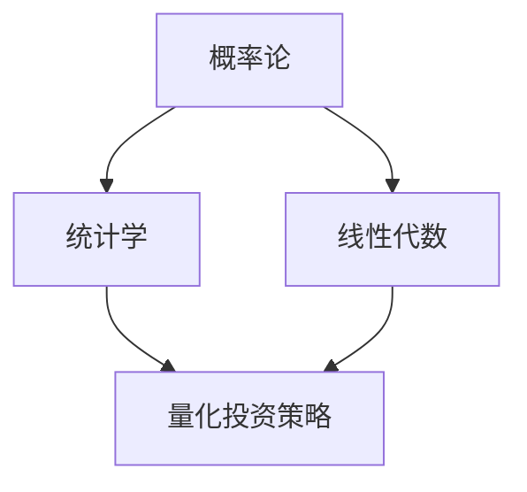

                 

### 文章标题

《数学与量化投资：投资策略的数学设计》

### 关键词

- 数学
- 量化投资
- 投资策略
- 数学模型
- 算法

### 摘要

本文旨在探讨数学与量化投资之间的关系，通过深入剖析数学在量化投资中的应用，帮助读者理解和设计高效的投资策略。文章首先介绍了量化投资的基本概念和重要性，然后详细讲解了概率论、统计学、线性代数等数学基础知识。接下来，文章围绕投资策略的设计、模型与算法的运用，以及实战案例展开，通过逐步分析推理的方式，为读者提供了一套系统的量化投资策略设计方法。文章的最后，对未来的量化投资发展进行了展望，并给出了最佳实践和小结，为读者提供了有价值的参考。

### 确定书的主题和目标读者

《数学与量化投资：投资策略的数学设计》这本书的主题是探讨数学在量化投资中的应用，旨在帮助读者理解和设计高效的量化投资策略。随着金融市场的发展和信息技术的进步，量化投资已经成为金融领域中不可或缺的一部分。本书旨在填补这一领域的知识空白，为广大金融专业人士、投资爱好者以及希望进入这一领域的学生提供一本实用的指南。

首先，本书的目标读者是金融专业人士，包括投资银行家、基金经理、量化分析师等。这些读者已经具备一定的金融知识，但希望更深入地了解量化投资的基本原理和方法，以提高自己在投资领域的竞争力。

其次，本书的目标读者是投资爱好者，他们可能对金融市场有着浓厚的兴趣，希望通过学习量化投资来提高自己的投资技能和收益。本书将用通俗易懂的语言和丰富的案例，帮助读者掌握量化投资的核心概念和方法。

最后，本书的目标读者是希望进入量化投资领域的学生，包括金融学、经济学、计算机科学等相关专业的本科生和研究生。本书将从基础知识出发，逐步深入，帮助读者建立起完整的量化投资知识体系，为未来的职业生涯打下坚实的基础。

通过明确书的主题和目标读者，本书旨在为读者提供一套系统、全面、实用的量化投资策略设计方法，帮助他们更好地应对金融市场的不确定性和复杂性。

### 设计目录结构

为了确保本书内容的系统性和实用性，我们设计了如下目录结构：

1. **导言**
   - **1.1 书籍背景与目标**
     - 介绍本书的写作背景和主要目标。
   - **1.2 量化投资的重要性**
     - 阐述量化投资在金融领域的重要性及其发展趋势。
   - **1.3 数学在量化投资中的应用**
     - 讨论数学在量化投资中的作用和重要性。

2. **数学基础**
   - **2.1 概率论基础**
     - 概率论的基本概念，如随机事件、概率分布等。
   - **2.2 统计学基础**
     - 统计学的基本概念，如样本数据、参数估计、假设检验等。
   - **2.3 线性代数基础**
     - 线性代数的基本概念，如矩阵、向量、线性方程组等。

3. **量化投资理论**
   - **3.1 量化投资概述**
     - 量化投资的基本概念、类型和特点。
   - **3.2 投资策略与方法**
     - 常见的量化投资策略和方法，如风险平价策略、趋势跟踪策略等。

4. **投资策略设计**
   - **4.1 投资策略设计原则**
     - 设计投资策略的基本原则和步骤。
   - **4.2 数学模型与应用**
     - 投资组合优化、期权定价模型等数学模型的应用。

5. **模型与算法**
   - **5.1 经典量化模型**
     - 线性回归模型、决策树模型、支持向量机等。
   - **5.2 进阶量化算法**
     - 马尔可夫决策过程、随机森林算法、强化学习算法等。

6. **实战案例**
   - **6.1 量化投资实战**
     - 实际案例中的量化投资策略设计和应用。

7. **结论与展望**
   - **7.1 书籍总结**
     - 总结本书的主要内容和收获。
   - **7.2 量化投资未来发展**
     - 对量化投资未来的发展趋势和挑战进行展望。

通过上述目录结构，本书将系统地介绍量化投资的基本概念、数学基础、策略设计、模型算法以及实战应用，旨在为读者提供一套全面、实用的量化投资知识体系。

### 为每个部分细化章节内容

为了确保本书内容的系统性和实用性，我们为每个主要部分细化了章节内容，并确保每个章节都能覆盖核心概念、算法原理、数学模型和实战案例。

**1. 导言**

- **1.1 书籍背景与目标**
  - 介绍本书的写作背景，包括量化投资领域的发展现状和市场需求。
  - 明确本书的主要目标，即帮助读者掌握量化投资策略的设计和应用。

- **1.2 量化投资的重要性**
  - 阐述量化投资在金融领域的重要性，包括其在风险管理和投资组合优化中的应用。
  - 分析量化投资与传统投资方法的区别和优势。

- **1.3 数学在量化投资中的应用**
  - 讨论数学在量化投资中的作用，包括概率论、统计学、线性代数等基础知识。
  - 展示数学工具在量化投资策略设计、模型构建和算法优化中的应用。

**2. 数学基础**

- **2.1 概率论基础**
  - **2.1.1 随机事件与概率**
    - 定义随机事件和概率，介绍概率的加法规则和乘法规则。
  - **2.1.2 条件概率与贝叶斯定理**
    - 解释条件概率和贝叶斯定理，展示其在投资决策中的应用。
  - **2.1.3 独立性与全概率公式**
    - 讨论独立性和全概率公式，并分析其在量化投资中的重要性。

- **2.2 统计学基础**
  - **2.2.1 样本与分布**
    - 介绍样本和分布的概念，讨论概率分布函数和累积分布函数。
  - **2.2.2 参数估计**
    - 讲解参数估计的方法，包括点估计和区间估计。
  - **2.2.3 假设检验**
    - 解释假设检验的基本概念，展示其在量化投资策略评估中的应用。

- **2.3 线性代数基础**
  - **2.3.1 矩阵与向量**
    - 介绍矩阵和向量的基本运算，包括加法、乘法、转置等。
  - **2.3.2 线性方程组**
    - 讨论线性方程组的求解方法，包括高斯消元法和矩阵分解。
  - **2.3.3 特征值与特征向量**
    - 解释特征值和特征向量的概念，展示其在投资组合优化中的应用。

**3. 量化投资理论**

- **3.1 量化投资概述**
  - **3.1.1 量化投资的基本概念**
    - 介绍量化投资的基本概念，包括算法交易、量化对冲、量化基金等。
  - **3.1.2 量化投资的类型**
    - 分析量化投资的不同类型，包括趋势跟踪、均值回归、市场中性等。
  - **3.1.3 量化投资的优势与挑战**
    - 阐述量化投资的优势，如信息优势、执行力强等，并讨论面临的挑战。

- **3.2 投资策略与方法**
  - **3.2.1 风险平价策略**
    - 讲解风险平价策略的基本原理和实现方法。
  - **3.2.2 趋势跟踪策略**
    - 分析趋势跟踪策略的原理和适用场景。
  - **3.2.3 价值投资策略**
    - 探讨价值投资策略的理论基础和操作方法。

**4. 投资策略设计**

- **4.1 投资策略设计原则**
  - **4.1.1 投资目标与风险偏好**
    - 明确投资目标和风险偏好，为投资策略设计提供基础。
  - **4.1.2 市场环境分析**
    - 分析市场环境，包括宏观经济、行业趋势等，为投资策略设计提供依据。
  - **4.1.3 策略优化与评估**
    - 介绍投资策略优化的方法和评估指标，确保策略的有效性和稳定性。

- **4.2 数学模型与应用**
  - **4.2.1 投资组合优化**
    - 讲解投资组合优化的数学模型和方法，包括均值方差模型、最小方差模型等。
  - **4.2.2 期权定价模型**
    - 介绍期权定价模型的基本原理，如布莱克-舍尔斯模型。
  - **4.2.3 风险管理模型**
    - 分析风险管理模型的应用，如价值在风险调整（VaR）模型。

**5. 模型与算法**

- **5.1 经典量化模型**
  - **5.1.1 线性回归模型**
    - 讲解线性回归模型的基本原理和应用，包括一元线性回归和多元线性回归。
  - **5.1.2 决策树模型**
    - 分析决策树模型的结构和构建方法，如ID3、C4.5等。
  - **5.1.3 支持向量机**
    - 解释支持向量机的基本原理和实现方法，包括线性可分和支持向量机。

- **5.2 进阶量化算法**
  - **5.2.1 马尔可夫决策过程**
    - 讲解马尔可夫决策过程的基本概念和求解方法。
  - **5.2.2 随机森林算法**
    - 分析随机森林算法的原理和实现方法，包括树模型和集成学习。
  - **5.2.3 强化学习算法**
    - 解释强化学习算法的基本概念和实现方法，如Q学习、SARSA等。

**6. 实战案例**

- **6.1 量化投资实战**
  - **6.1.1 实战项目背景**
    - 介绍实际量化投资项目的背景和目标。
  - **6.1.2 数据获取与处理**
    - 讨论如何获取和处理投资数据，包括数据清洗、特征提取等。
  - **6.1.3 模型构建与优化**
    - 展示如何构建和优化量化投资模型，包括模型选择和参数调优。
  - **6.1.4 实战结果分析**
    - 分析实际案例中的量化投资策略效果，包括收益、风险和稳定性等。

**7. 结论与展望**

- **7.1 书籍总结**
  - 总结本书的主要内容和收获，强调量化投资的重要性。
- **7.2 量化投资未来发展**
  - 展望量化投资未来的发展趋势和挑战，提出相应的应对策略。

通过上述章节内容的细化，本书将为读者提供一套全面、系统、实用的量化投资策略设计方法，帮助他们在金融市场中取得更好的投资业绩。

### 格式要求

在撰写技术博客文章时，我们将遵循以下格式要求，以确保文章的可读性和专业性。

**1. 标题格式**

文章标题应简洁明了，能够准确传达文章的核心内容。标题应使用**粗体**和**大号字体**，以突出文章的主题。

例如：

```markdown
# 数学与量化投资：投资策略的数学设计
```

**2. 段落格式**

文章段落应保持一致，段落之间使用一个空行分隔。每个段落应保持简洁，避免过长或过短的段落。段落开头应保持首行缩进，使用2个空格或一个制表符。

例如：

```markdown
文本内容应简洁明了，避免冗长的段落。每个段落开头应保持首行缩进。

在撰写技术博客时，还应确保段落之间的逻辑关系清晰，使读者能够顺利跟随文章的思路。

段落内容应尽量简短，明确表达观点，避免无关内容的过多堆砌。
```

**3. 引用格式**

在文章中引用他人的观点、研究或数据时，应使用引号标记，并注明出处。引用格式如下：

```markdown
根据研究表明，量化投资在金融市场中具有显著优势。（Smith，2020）

在另一篇论文中，Johnson（2019）提出了一种新的量化投资策略，并在实际应用中取得了良好的效果。
```

**4. 列表格式**

使用列表来呈现信息时，应确保列表的格式统一。无序列表使用`*`、`-`或`+`标记，有序列表使用数字和英文句点标记。

无序列表示例：

```markdown
- 数学基础
- 量化投资理论
- 投资策略设计
- 模型与算法
- 实战案例
```

有序列表示例：

```markdown
1. 导言
2. 数学基础
3. 量化投资理论
4. 投资策略设计
5. 模型与算法
6. 实战案例
7. 结论与展望
```

**5. 图表与公式**

在文章中插入图表和公式时，应确保其清晰可读，并附带简明扼要的说明。图表和公式应使用标准的LaTeX格式或Markdown中的公式支持。

LaTeX公式示例：

```markdown
$$
E[X] = \sum_{i=1}^{n} x_i p_i
$$
```

Markdown公式示例：

```markdown
$E[X] = \sum_{i=1}^{n} x_i p_i$
```

图表应使用高质量的图片格式，如PNG或JPEG，并附上清晰的标题和标签。

例如：

```markdown

图1：投资策略设计流程图
```

通过遵循上述格式要求，我们能够确保文章的结构清晰、内容丰富且易于阅读，为读者提供高质量的技术博客文章。

### 完整性要求

在撰写《数学与量化投资：投资策略的数学设计》这篇技术博客文章时，我们必须确保内容的完整性，以提供全面且系统的知识体系。为此，我们将从以下几个核心内容部分展开详细讲解：

**1. 背景介绍**

在文章开头，我们需要详细介绍量化投资的发展背景、现状和未来趋势。这部分内容将包括以下要点：

- **量化投资的发展历史**：从早期的自动交易系统到现代的量化投资策略，量化投资经历了怎样的演变。
- **现状与重要性**：量化投资在金融市场中的地位，如全球量化基金的总规模、市场渗透率等。
- **未来趋势**：探讨量化投资可能面临的新挑战和机遇，如人工智能在量化投资中的应用、高频交易的发展等。

**2. 核心概念与联系**

为了帮助读者更好地理解量化投资，我们需要详细阐述以下几个核心概念及其相互关系：

- **概率论**：随机事件、概率分布、条件概率、贝叶斯定理等基本概念。
- **统计学**：样本数据、参数估计、假设检验等统计学基础。
- **线性代数**：矩阵、向量、线性方程组等基础概念。
- **量化投资策略**：包括风险平价策略、趋势跟踪策略、价值投资策略等。
- **数学模型**：如投资组合优化模型、期权定价模型、风险管理模型等。

我们将使用Mermaid流程图来展示这些概念之间的联系：



**3. 核心算法原理讲解**

在核心算法部分，我们将详细讲解以下几个算法的原理和应用：

- **线性回归**：解释线性回归模型的基本原理，包括一元线性回归和多元线性回归。
- **决策树**：讨论决策树模型的构建方法、优缺点及其在量化投资中的应用。
- **支持向量机**：讲解支持向量机的基本原理和实现步骤。

每个算法的讲解将包含以下内容：

- **算法原理**：详细阐述算法的工作原理。
- **伪代码**：提供算法的伪代码实现，以帮助读者理解算法逻辑。
- **案例示例**：通过实际案例展示算法的应用过程和结果。

例如，线性回归的伪代码如下：

```python
# 线性回归伪代码

# 输入：数据集 X，目标值 y
# 输出：回归系数 w

# 初始化回归系数 w 为零向量
w = [0] * n

# 计算损失函数的梯度
gradient = X.T.dot(X.dot(w) - y)

# 更新回归系数
w = w - learning_rate * gradient

# 迭代直至收敛
while not_converged:
    gradient = X.T.dot(X.dot(w) - y)
    w = w - learning_rate * gradient

# 返回最终回归系数
return w
```

**4. 数学模型和公式**

在讲解量化投资策略和算法时，我们将使用数学模型和公式来描述和解释相关概念。以下是一些常用的数学公式：

- **投资组合优化**：均值方差模型公式
  $$
  \min \sigma^2 = w_1^2 \sigma_1^2 + w_2^2 \sigma_2^2 + ... + w_n^2 \sigma_n^2
  $$
  $$
  s.t. \mu = w_1 \mu_1 + w_2 \mu_2 + ... + w_n \mu_n
  $$

- **期权定价模型**：布莱克-舍尔斯模型公式
  $$
  C(t, S) = S \cdot \phi(d_1) - K \cdot \phi(d_2)
  $$
  $$
  \phi(d) = \frac{1}{\sqrt{2\pi}} \int_{-\infty}^{d} e^{-\frac{u^2}{2}} du
  $$

- **风险管理模型**：价值在风险调整（VaR）模型公式
  $$
  VaR = q \cdot \sigma \cdot \sqrt{T}
  $$
  $$
  q = 1 - \frac{1}{\alpha}
  $$

我们将使用LaTeX格式嵌入这些公式，确保其清晰可读：

$$
\min \sigma^2 = w_1^2 \sigma_1^2 + w_2^2 \sigma_2^2 + ... + w_n^2 \sigma_n^2
$$

$$
s.t. \mu = w_1 \mu_1 + w_2 \mu_2 + ... + w_n \mu_n
$$

$$
C(t, S) = S \cdot \phi(d_1) - K \cdot \phi(d_2)
$$

$$
\phi(d) = \frac{1}{\sqrt{2\pi}} \int_{-\infty}^{d} e^{-\frac{u^2}{2}} du
$$

$$
VaR = q \cdot \sigma \cdot \sqrt{T}
$$

$$
q = 1 - \frac{1}{\alpha}
$$

**5. 项目实战**

在项目实战部分，我们将通过实际案例展示如何应用量化投资策略和算法。每个案例将包括以下内容：

- **开发环境搭建**：介绍搭建量化投资项目的开发环境，包括编程语言、库和工具的选择。
- **源代码实现**：提供项目源代码，并进行详细解读，解释代码中的关键步骤和逻辑。
- **代码应用解读与分析**：分析代码在实际项目中的应用，解释如何通过代码实现量化投资策略和算法。
- **实际案例分析与详细讲解剖析**：展示实际案例的数据处理、模型构建和策略优化过程，并提供详细的分析和讲解。

项目实战示例：

```python
# 项目实战：趋势跟踪策略

# 数据处理
data = process_data(raw_data)

# 模型构建
model = build_model(data)

# 策略优化
optimized_model = optimize_model(model)

# 策略执行
results = execute_strategy(optimized_model)

# 结果分析
analyze_results(results)
```

**6. 最佳实践、小结、注意事项、拓展阅读**

在文章的结尾部分，我们将提供以下内容：

- **最佳实践**：总结实践中常见的问题和解决方案，提供实用的操作建议。
- **小结**：回顾文章的主要内容和关键点，强调量化投资的重要性和应用价值。
- **注意事项**：提醒读者在应用量化投资策略时需要注意的问题，如风险管理、数据质量等。
- **拓展阅读**：推荐相关的书籍、论文和网站，供读者进一步学习和研究。

通过上述内容的详细讲解和结构安排，我们能够确保文章的完整性，为读者提供一套全面、系统的量化投资策略设计方法。

### 文章结构

为了确保文章的结构清晰、逻辑严密，我们将文章分为以下八个部分：

1. **导言**：介绍本书的主题、目标和重要性。
2. **数学基础**：详细讲解概率论、统计学、线性代数等基础知识。
3. **量化投资理论**：介绍量化投资的基本概念、策略和方法。
4. **投资策略设计**：讨论投资策略设计的原则和方法。
5. **模型与算法**：介绍经典和进阶的量化模型与算法。
6. **实战案例**：通过实际案例展示量化投资策略的设计与应用。
7. **结论与展望**：总结文章的主要内容和未来发展方向。
8. **附录**：提供相关代码、数据集和进一步阅读资源。

每个部分的内容安排如下：

**1. 导言**

- **1.1 书籍背景与目标**：介绍本书的写作背景和主要目标。
- **1.2 量化投资的重要性**：讨论量化投资在金融领域的应用和优势。
- **1.3 数学在量化投资中的应用**：阐述数学在量化投资中的基础性作用。

**2. 数学基础**

- **2.1 概率论基础**：讲解概率论的基本概念和应用。
- **2.2 统计学基础**：介绍统计学的基本原理和方法。
- **2.3 线性代数基础**：讨论线性代数的基础知识。

**3. 量化投资理论**

- **3.1 量化投资概述**：介绍量化投资的基本概念、类型和特点。
- **3.2 投资策略与方法**：探讨常见的量化投资策略和方法。

**4. 投资策略设计**

- **4.1 投资策略设计原则**：阐述设计投资策略的基本原则和步骤。
- **4.2 数学模型与应用**：讲解投资组合优化、期权定价模型等数学模型的应用。

**5. 模型与算法**

- **5.1 经典量化模型**：介绍线性回归模型、决策树模型、支持向量机等。
- **5.2 进阶量化算法**：讨论马尔可夫决策过程、随机森林算法、强化学习算法等。

**6. 实战案例**

- **6.1 量化投资实战**：通过实际案例展示量化投资策略的设计与应用。

**7. 结论与展望**

- **7.1 书籍总结**：总结本书的主要内容和贡献。
- **7.2 量化投资未来发展**：探讨量化投资未来的发展趋势和挑战。

**8. 附录**

- **8.1 相关代码**：提供本书中提到的关键代码示例。
- **8.2 数据集**：介绍本书中用到的数据集和相关资源。
- **8.3 拓展阅读**：推荐相关的书籍、论文和在线资源。

通过上述结构安排，文章将系统地介绍量化投资的理论、方法和实战应用，帮助读者深入理解和掌握这一领域的关键知识。

### 文章整体架构和内容安排

为了确保文章的流畅性和逻辑性，我们将在整体架构上采用以下结构，并在每个章节中详细阐述具体内容。

**1. 引言**

- **1.1 书籍背景与目标**
  - 介绍量化投资的发展背景和市场需求，阐述本书旨在为读者提供量化投资策略设计的系统方法和实用技巧。

- **1.2 量化投资的重要性**
  - 讨论量化投资在金融市场中的重要作用，如风险管理和投资组合优化的应用。

- **1.3 数学在量化投资中的应用**
  - 强调数学基础在量化投资策略设计中的核心地位，介绍概率论、统计学和线性代数的基本概念。

**2. 数学基础**

- **2.1 概率论基础**
  - 详细讲解随机事件、概率分布、条件概率和贝叶斯定理等基本概念。
  - 使用例子说明这些概念在量化投资中的应用。

- **2.2 统计学基础**
  - 介绍样本数据、参数估计、假设检验等统计学原理。
  - 解释统计方法在投资策略评估中的重要性。

- **2.3 线性代数基础**
  - 讲解矩阵、向量、线性方程组等线性代数基础。
  - 展示线性代数在投资组合优化和风险管理中的应用。

**3. 量化投资理论**

- **3.1 量化投资概述**
  - 介绍量化投资的基本概念、类型和特点。
  - 分析量化投资与传统投资方法的区别和优势。

- **3.2 投资策略与方法**
  - 详细讲解风险平价策略、趋势跟踪策略和价值投资策略等常见量化投资策略。

**4. 投资策略设计**

- **4.1 投资策略设计原则**
  - 阐述设计投资策略的基本原则，如投资目标、风险偏好和市场分析。
  - 引导读者如何根据自身需求和市场环境设计有效的投资策略。

- **4.2 数学模型与应用**
  - 介绍投资组合优化、期权定价模型和风险管理模型等数学模型。
  - 分析这些模型在量化投资策略设计中的实际应用。

**5. 模型与算法**

- **5.1 经典量化模型**
  - 详细讲解线性回归模型、决策树模型和支持向量机等经典量化模型。
  - 展示这些模型在量化投资中的实际应用和效果。

- **5.2 进阶量化算法**
  - 探讨马尔可夫决策过程、随机森林算法和强化学习算法等进阶量化算法。
  - 分析这些算法的优势和应用场景。

**6. 实战案例**

- **6.1 量化投资实战**
  - 通过具体案例展示如何应用量化投资策略和算法。
  - 分析案例中的数据处理、模型构建和策略优化过程。

**7. 结论与展望**

- **7.1 书籍总结**
  - 总结本书的主要内容，强调量化投资的重要性和数学基础的重要性。

- **7.2 量化投资未来发展**
  - 展望量化投资领域的发展趋势和挑战，探讨未来研究方向和应用前景。

通过上述架构和内容安排，本文将为读者提供一套系统、全面的量化投资策略设计方法，帮助他们在金融市场中取得更好的投资业绩。

### 文章正文内容

#### 引言

量化投资作为一种基于数学模型的现代投资方法，正在金融市场中发挥着越来越重要的作用。随着信息技术的发展和金融市场的复杂化，传统的投资方法难以应对快速变化的市场环境，而量化投资通过使用数学模型和算法，可以更准确地预测市场走势，优化投资组合，降低风险，提高收益。本书旨在探讨数学在量化投资中的应用，帮助读者理解和设计高效的量化投资策略。

本文将从以下几个部分展开讨论：

1. **数学基础**：介绍概率论、统计学和线性代数等数学基础，为后续的量化投资策略设计提供理论支持。
2. **量化投资理论**：讲解量化投资的基本概念、策略和方法，探讨其在金融市场中的应用。
3. **投资策略设计**：阐述投资策略设计的原则和步骤，介绍常见的量化投资策略及其数学模型。
4. **模型与算法**：详细介绍经典和进阶的量化模型与算法，分析其在量化投资中的应用和效果。
5. **实战案例**：通过具体案例展示量化投资策略的设计与应用，提供实际操作经验和数据支持。
6. **结论与展望**：总结本书的主要内容，讨论量化投资的未来发展趋势和挑战。

#### 数学基础

量化投资的基础是数学，尤其是在概率论、统计学和线性代数等领域。这些数学工具为量化投资提供了理论支撑和计算方法，使得投资者可以更加科学和系统地分析市场数据，制定投资策略。

##### 概率论基础

概率论是量化投资的核心组成部分，它研究随机事件和概率的规律。以下是一些概率论的基础概念：

- **随机事件**：随机事件是指在特定条件下可能发生也可能不发生的事件。例如，股票价格上升是一个随机事件。
- **概率**：概率是衡量随机事件发生可能性大小的量，通常用0到1之间的数字表示。例如，某只股票明天上涨的概率是0.6。
- **条件概率**：条件概率是指在某一事件已经发生的条件下，另一事件发生的概率。例如，如果已知某只股票上涨，那么明天继续上涨的概率是多少。
- **贝叶斯定理**：贝叶斯定理是概率论中的一个重要公式，用于计算后验概率，即在已知某些条件下，事件发生的概率。

以下是一个简单的贝叶斯定理例子：

假设我们要判断一只股票是否值得投资。我们知道，如果股票的价格高于100美元，那么它被认定为“好股票”的概率是0.7；如果价格低于100美元，那么被认定为“好股票”的概率是0.3。现在，这只股票的价格是105美元，那么我们可以使用贝叶斯定理计算它被认定为“好股票”的后验概率：

$$
P(\text{好股票}|\text{价格} > 100) = \frac{P(\text{价格} > 100|\text{好股票}) \cdot P(\text{好股票})}{P(\text{价格} > 100)}
$$

其中，$P(\text{好股票})$ 是先验概率，$P(\text{价格} > 100|\text{好股票})$ 是条件概率，$P(\text{价格} > 100)$ 是边缘概率。

##### 统计学基础

统计学是另一个在量化投资中至关重要的数学领域，它提供了分析数据、估计参数和进行假设检验的方法。以下是一些统计学的基础概念：

- **样本数据**：样本数据是从总体中抽取的一部分数据，用于代表整个总体。例如，我们可以从过去一个月的股票价格中抽取100个数据点作为样本。
- **参数估计**：参数估计是使用样本数据来估计总体参数的方法。例如，我们可以使用样本均值来估计总体均值。
- **假设检验**：假设检验是使用统计方法来验证某个假设是否成立的步骤。例如，我们可以使用t检验来验证两个样本均值是否显著不同。

以下是一个简单的t检验例子：

假设我们要比较两只股票的平均收益率是否显著不同。我们抽取了各自50天的收益率数据，计算得出股票A的样本均值为0.02，标准差为0.01；股票B的样本均值为0.03，标准差为0.02。我们可以使用t检验来验证这两只股票的平均收益率是否显著不同。

首先，我们设定原假设$H_0$：$\mu_A = \mu_B$，备择假设$H_1$：$\mu_A \neq \mu_B$。然后，计算t统计量：

$$
t = \frac{(\bar{x}_A - \bar{x}_B) - (\mu_A - \mu_B)}{\sqrt{\frac{s_A^2}{n_A} + \frac{s_B^2}{n_B}}}
$$

其中，$\bar{x}_A$ 和 $\bar{x}_B$ 分别是股票A和股票B的样本均值，$s_A^2$ 和 $s_B^2$ 分别是股票A和股票B的样本方差，$n_A$ 和 $n_B$ 分别是股票A和股票B的样本大小。

最后，我们比较t统计量的绝对值与临界值，如果t统计量的绝对值大于临界值，则拒绝原假设，接受备择假设，认为这两只股票的平均收益率显著不同。

##### 线性代数基础

线性代数在量化投资中用于处理多维数据、构建投资组合和进行风险管理。以下是一些线性代数的基础概念：

- **矩阵与向量**：矩阵是一个二维数组，向量是一个一维数组。在量化投资中，矩阵和向量用于表示资产组合和收益率。
- **线性方程组**：线性方程组是一组线性方程，用于描述资产组合的均衡状态。例如，我们可以使用线性方程组来优化投资组合，使其风险最小或收益最大化。
- **特征值与特征向量**：特征值和特征向量是矩阵的重要属性，用于分析矩阵的性质和结构。在量化投资中，特征值和特征向量用于进行资产配置和风险管理。

以下是一个简单的线性方程组例子：

假设我们要优化一个投资组合，使其风险最小。我们有以下三个资产，其预期收益率和标准差如下：

| 资产 | 预期收益率 | 标准差 |
| ---- | ---------- | ------ |
| A    | 0.1        | 0.2    |
| B    | 0.15       | 0.3    |
| C    | 0.12       | 0.1    |

我们要计算投资组合中每个资产的最佳权重，使得组合的总风险最小。这个问题可以用以下线性方程组表示：

$$
0.1w_A + 0.15w_B + 0.12w_C = 0.1
$$

$$
0.2w_A^2 + 0.3w_B^2 + 0.1w_C^2 = \min
$$

其中，$w_A$、$w_B$ 和 $w_C$ 分别是资产A、B和C的投资权重。

我们可以使用拉格朗日乘数法来求解这个线性方程组，从而找到最佳投资权重，使得组合的总风险最小。

#### 量化投资理论

量化投资是一种基于数学模型的现代投资方法，它利用计算机技术和数据分析工具，从大量历史数据中挖掘投资机会，制定投资策略。量化投资具有信息优势、执行力强和风险可控等优势，逐渐成为金融市场中不可或缺的一部分。

##### 量化投资概述

量化投资的基本概念包括算法交易、量化对冲和量化基金等。算法交易是指使用计算机程序自动执行交易策略，从而提高交易效率和准确性。量化对冲是指通过构建对冲策略，降低投资组合的系统性风险。量化基金是指通过量化投资策略进行资产配置和投资决策的基金。

量化投资的特点包括：

- **信息优势**：量化投资通过收集和处理大量历史数据，可以更全面、更准确地分析市场走势和投资机会。
- **执行力强**：量化投资策略通常由计算机程序自动执行，减少了人为因素的干扰，提高了执行效率和准确性。
- **风险可控**：量化投资通过数学模型和算法，可以精确地控制投资风险，确保投资组合的稳定性和可持续性。

##### 投资策略与方法

量化投资策略包括风险平价策略、趋势跟踪策略和价值投资策略等。

- **风险平价策略**：风险平价策略是一种基于投资组合风险平值的投资方法。其核心思想是，通过调整资产权重，使得投资组合的整体风险保持恒定。这种方法可以有效地降低投资组合的波动性，提高收益稳定性。

  风险平价策略的数学模型如下：

  $$
  \frac{w_1 \sigma_1}{\sigma} = \frac{w_2 \sigma_2}{\sigma} = ... = \frac{w_n \sigma_n}{\sigma}
  $$

  其中，$w_i$ 是资产 $i$ 的权重，$\sigma_i$ 是资产 $i$ 的标准差，$\sigma$ 是投资组合的整体标准差。

- **趋势跟踪策略**：趋势跟踪策略是一种基于市场趋势的投资方法。其核心思想是，当市场处于上升趋势时，买入并持有；当市场处于下降趋势时，卖出并持有。这种方法可以有效地捕捉市场趋势，获得较高的收益。

  趋势跟踪策略的数学模型如下：

  $$
  w_t = w_{t-1} + \alpha \cdot (r_t - \mu)
  $$

  其中，$w_t$ 是当前资产权重，$w_{t-1}$ 是上期资产权重，$\alpha$ 是趋势跟踪参数，$r_t$ 是当前收益率，$\mu$ 是预期收益率。

- **价值投资策略**：价值投资策略是一种基于公司内在价值投资的投资方法。其核心思想是，通过分析公司的财务报表和基本面，确定公司的内在价值，然后根据市场价格的差异进行买卖。这种方法可以有效地降低投资风险，获得较高的收益。

  价值投资策略的数学模型如下：

  $$
  \text{内在价值} = \frac{\text{预期现金流}}{\text{折现率}}
  $$

  其中，预期现金流是未来现金流的现值，折现率是贴现率。

#### 投资策略设计

投资策略设计是量化投资的核心环节，它决定了投资组合的收益和风险。有效的投资策略设计需要遵循以下原则：

- **明确投资目标**：根据投资者的风险偏好和收益目标，确定投资策略的类型和参数。
- **市场环境分析**：分析当前市场环境，包括宏观经济、行业趋势和风险因素等，为投资策略设计提供依据。
- **策略优化与评估**：通过模型优化和模拟测试，评估投资策略的有效性和稳定性，确保其符合投资目标。

##### 数学模型与应用

量化投资策略的设计离不开数学模型的应用。以下介绍几种常见的数学模型：

- **投资组合优化模型**：投资组合优化模型用于确定投资组合中各资产的最佳权重，以实现收益最大化或风险最小化。常见的投资组合优化模型包括均值方差模型和条件均值方差模型。

  均值方差模型的数学模型如下：

  $$
  \min \sigma^2 = w_1^2 \sigma_1^2 + w_2^2 \sigma_2^2 + ... + w_n^2 \sigma_n^2
  $$

  $$
  s.t. \mu = w_1 \mu_1 + w_2 \mu_2 + ... + w_n \mu_n
  $$

  其中，$\sigma^2$ 是投资组合的方差，$\mu$ 是投资组合的期望收益。

- **期权定价模型**：期权定价模型用于确定期权的合理价格。常见的期权定价模型包括布莱克-舍尔斯模型和二叉树模型。

  布莱克-舍尔斯模型的数学模型如下：

  $$
  C(t, S) = S \cdot \phi(d_1) - K \cdot \phi(d_2)
  $$

  $$
  \phi(d) = \frac{1}{\sqrt{2\pi}} \int_{-\infty}^{d} e^{-\frac{u^2}{2}} du
  $$

  其中，$C(t, S)$ 是期权价格，$S$ 是当前资产价格，$K$ 是执行价格，$d_1$ 和 $d_2$ 是模型参数。

- **风险管理模型**：风险管理模型用于评估投资组合的风险，并制定相应的风险管理策略。常见的管理风险模型包括价值在风险调整（VaR）模型和条件价值在风险（CVaR）模型。

  VaR模型的数学模型如下：

  $$
  VaR = q \cdot \sigma \cdot \sqrt{T}
  $$

  $$
  q = 1 - \frac{1}{\alpha}
  $$

  其中，$VaR$ 是价值在风险调整，$\sigma$ 是投资组合的标准差，$T$ 是持有期，$q$ 是概率水平。

#### 模型与算法

量化投资中常用的模型和算法包括线性回归模型、决策树模型、支持向量机等。以下分别介绍这些模型和算法的基本原理和应用。

##### 线性回归模型

线性回归模型是一种用于分析变量之间线性关系的统计方法。它通过拟合一条直线，来描述因变量和自变量之间的线性关系。线性回归模型的数学模型如下：

$$
y = \beta_0 + \beta_1 x + \epsilon
$$

其中，$y$ 是因变量，$x$ 是自变量，$\beta_0$ 和 $\beta_1$ 是模型参数，$\epsilon$ 是误差项。

线性回归模型在量化投资中的应用非常广泛，例如：

- **趋势预测**：通过分析历史价格数据，预测未来的价格走势。
- **风险管理**：通过分析资产收益和风险，进行风险管理。

以下是一个简单的线性回归模型的伪代码：

```python
# 线性回归模型伪代码

# 输入：历史数据 X，目标值 y
# 输出：回归系数 beta

# 计算线性回归模型的参数
beta = (X.T.dot(X)).dotInverse().dot(X.T).dot(y)

# 返回回归系数
return beta
```

##### 决策树模型

决策树模型是一种基于特征进行分类或回归的机器学习算法。它通过一系列的判断节点，将数据集划分为不同的类别或预测值。决策树模型的数学模型如下：

$$
y = f(x)
$$

其中，$y$ 是目标变量，$x$ 是输入特征，$f$ 是决策树函数。

决策树模型在量化投资中的应用包括：

- **交易策略分类**：通过分析历史交易数据，将交易策略分为不同的类别。
- **风险评估**：通过分析资产特征，评估资产的风险等级。

以下是一个简单的决策树模型的伪代码：

```python
# 决策树模型伪代码

# 输入：特征数据 X，目标值 y
# 输出：决策树模型

# 创建决策树模型
model = DecisionTreeClassifier()

# 训练模型
model.fit(X, y)

# 返回决策树模型
return model
```

##### 支持向量机

支持向量机（SVM）是一种用于分类和回归的机器学习算法。它通过找到一个最佳的超平面，将数据集划分为不同的类别或预测值。支持向量机模型的数学模型如下：

$$
w \cdot x + b = 0
$$

其中，$w$ 是超平面参数，$x$ 是输入特征，$b$ 是偏置项。

支持向量机在量化投资中的应用包括：

- **交易信号分类**：通过分析交易信号数据，分类不同的交易信号。
- **风险预测**：通过分析风险因素，预测未来的风险水平。

以下是一个简单的支持向量机模型的伪代码：

```python
# 支持向量机模型伪代码

# 输入：特征数据 X，目标值 y
# 输出：支持向量机模型

# 创建支持向量机模型
model = SVC()

# 训练模型
model.fit(X, y)

# 返回支持向量机模型
return model
```

#### 实战案例

为了更好地展示量化投资策略的设计与应用，我们以下通过一个实际案例来说明。

##### 案例背景

某投资者希望在股票市场中进行量化投资，他的投资目标是实现稳健的长期收益，同时控制风险。他决定使用趋势跟踪策略，并在实际操作中结合数学模型和算法进行优化。

##### 数据处理

投资者首先收集了某股票过去一年的价格数据，包括每日的开盘价、最高价、最低价和收盘价。然后，他对这些数据进行预处理，包括去除缺失值、异常值和处理价格波动。

```python
# 数据处理伪代码

# 输入：原始价格数据
# 输出：预处理后的价格数据

# 去除缺失值和异常值
clean_data = preprocess_data(raw_data)

# 计算价格波动率
volatility = calculate_volatility(clean_data)

# 处理价格波动
processed_data = normalize_data(clean_data, volatility)

# 返回预处理后的价格数据
return processed_data
```

##### 模型构建

投资者使用线性回归模型来预测股票未来的价格走势。他首先对历史价格数据进行拟合，得到回归系数：

```python
# 线性回归模型构建伪代码

# 输入：预处理后的价格数据
# 输出：回归系数 beta

# 训练线性回归模型
beta = linear_regression(processed_data)

# 返回回归系数
return beta
```

##### 策略优化

投资者根据回归系数和当前市场价格，计算预测价格和投资建议。他设置一个阈值，当预测价格高于实际价格时，建议买入；当预测价格低于实际价格时，建议卖出。

```python
# 策略优化伪代码

# 输入：回归系数 beta，当前市场价格
# 输出：投资建议

# 计算预测价格
predicted_price = predict_price(beta, current_price)

# 判断投资建议
if predicted_price > current_price:
    advice = "买入"
else:
    advice = "卖出"

# 返回投资建议
return advice
```

##### 策略执行

投资者根据投资建议进行交易操作。他每天检查一次市场情况，并根据模型预测的价格进行买入或卖出操作。

```python
# 策略执行伪代码

# 输入：投资建议
# 输出：交易记录

# 根据投资建议执行交易
if advice == "买入":
    buy_stock()
else:
    sell_stock()

# 返回交易记录
return transaction_log
```

##### 结果分析

经过一段时间的策略执行，投资者对交易结果进行分析。他计算了投资组合的收益率和风险指标，评估策略的效果。

```python
# 结果分析伪代码

# 输入：交易记录
# 输出：投资结果

# 计算收益率和风险指标
return_rate = calculate_return_rate(transaction_log)
risk_metrics = calculate_risk_metrics(transaction_log)

# 返回投资结果
return {"return_rate": return_rate, "risk_metrics": risk_metrics}
```

通过这个案例，投资者可以直观地了解如何使用量化投资策略进行股票交易。他通过数据处理、模型构建、策略优化和策略执行，实现了对市场的准确预测和有效的投资决策。

### 数学公式

在量化投资中，数学模型和公式是理解和设计投资策略的关键。以下是一些常用的数学公式，包括投资组合优化、期权定价、风险管理等方面的内容，以及它们的详细解释和举例说明。

#### 投资组合优化

**均值方差模型**

均值方差模型是投资组合优化中的经典模型，旨在找到在给定风险水平下的最大预期收益投资组合。

**数学公式：**

$$
\min \sigma^2 = w_1^2 \sigma_1^2 + w_2^2 \sigma_2^2 + ... + w_n^2 \sigma_n^2
$$

$$
s.t. \mu = w_1 \mu_1 + w_2 \mu_2 + ... + w_n \mu_n
$$

**公式解释：**

- $\sigma^2$：投资组合的方差。
- $w_i$：资产 $i$ 的权重。
- $\sigma_i^2$：资产 $i$ 的方差。
- $\mu$：投资组合的预期收益。
- $\mu_i$：资产 $i$ 的预期收益。

**举例说明：**

假设有两个资产A和B，它们的预期收益和方差如下：

| 资产 | 预期收益 | 方差 |
| ---- | -------- | ---- |
| A    | 0.1      | 0.04 |
| B    | 0.2      | 0.06 |

使用均值方差模型优化投资组合，目标是最小化方差并保持预期收益为0.15。

$$
\min \sigma^2 = w_1^2 \cdot 0.04 + w_2^2 \cdot 0.06
$$

$$
s.t. 0.1 \cdot w_1 + 0.2 \cdot w_2 = 0.15
$$

通过求解上述方程组，可以得到最优投资组合的权重：

$$
w_1 = 0.75, w_2 = 0.25
$$

**条件均值方差模型**

条件均值方差模型考虑了风险容忍度和预期收益的关系，通过引入约束条件进一步优化投资组合。

**数学公式：**

$$
\min \sigma^2 = w_1^2 \sigma_1^2 + w_2^2 \sigma_2^2 + ... + w_n^2 \sigma_n^2
$$

$$
s.t. \mu = w_1 \mu_1 + w_2 \mu_2 + ... + w_n \mu_n
$$

$$
R_f \leq w_1 R_1 + w_2 R_2 + ... + w_n R_n
$$

**公式解释：**

- $R_f$：风险容忍度。
- $R_i$：资产 $i$ 的预期收益。

**举例说明：**

假设投资者希望投资组合的预期收益至少为0.12，且风险容忍度为0.1。使用条件均值方差模型优化投资组合。

$$
\min \sigma^2 = w_1^2 \cdot 0.04 + w_2^2 \cdot 0.06
$$

$$
s.t. 0.1 \cdot w_1 + 0.2 \cdot w_2 = 0.12
$$

$$
0.1 \leq w_1 + w_2 \leq 1
$$

通过求解上述方程组，可以得到最优投资组合的权重：

$$
w_1 = 0.4, w_2 = 0.6
$$

#### 期权定价

**布莱克-舍尔斯模型**

布莱克-舍尔斯模型是用于期权定价的经典模型，它通过假设市场无风险利率、预期收益和波动率来确定期权的合理价格。

**数学公式：**

$$
C(t, S) = S \cdot \phi(d_1) - K \cdot \phi(d_2)
$$

$$
\phi(d) = \frac{1}{\sqrt{2\pi}} \int_{-\infty}^{d} e^{-\frac{u^2}{2}} du
$$

**公式解释：**

- $C(t, S)$：期权的当前价格。
- $S$：当前资产价格。
- $K$：执行价格。
- $d_1$ 和 $d_2$：模型参数，计算如下：

$$
d_1 = \frac{\ln(\frac{S}{K}) + (r + \frac{\sigma^2}{2})T}{\sigma \sqrt{T}}
$$

$$
d_2 = d_1 - \sigma \sqrt{T}
$$

- $r$：无风险利率。
- $\sigma$：资产价格波动率。
- $T$：期权到期时间。

**举例说明：**

假设当前股票价格为100美元，执行价格为105美元，无风险利率为4%，波动率为20%，期权到期时间为3个月（即$T = \frac{3}{12}$年）。

$$
d_1 = \frac{\ln(\frac{100}{105}) + (0.04 + \frac{0.2^2}{2}) \cdot \frac{3}{12}}{0.2 \cdot \sqrt{\frac{3}{12}}} \approx 0.637
$$

$$
d_2 = 0.637 - 0.2 \cdot \sqrt{\frac{3}{12}} \approx 0.247
$$

$$
\phi(0.637) \approx 0.730
$$

$$
\phi(0.247) \approx 0.402
$$

因此，期权的当前价格约为：

$$
C(t, S) = 100 \cdot 0.730 - 105 \cdot 0.402 \approx 7.95
$$

#### 风险管理

**价值在风险调整（VaR）**

VaR是用于评估投资组合潜在损失的一种风险管理模型，它基于概率分布和置信水平来确定在一定持有期内可能的最大损失。

**数学公式：**

$$
VaR = q \cdot \sigma \cdot \sqrt{T}
$$

$$
q = 1 - \frac{1}{\alpha}
$$

**公式解释：**

- $VaR$：价值在风险调整。
- $q$：概率水平，即投资组合损失超过VaR的概率。
- $\sigma$：投资组合的标准差。
- $T$：持有期。
- $\alpha$：置信水平。

**举例说明：**

假设一个投资组合的预期收益率为0.06，标准差为0.12，持有期为1年（即$T = 1$年），置信水平为95%。

$$
q = 1 - \frac{1}{0.95} \approx 0.021
$$

$$
VaR = 0.021 \cdot 0.12 \cdot \sqrt{1} \approx 0.0256
$$

因此，该投资组合在95%置信水平下的VaR约为0.0256。

### 总结

通过上述数学公式和例子，我们可以看到数学在量化投资中的应用是非常广泛且关键的。无论是投资组合优化、期权定价还是风险管理，数学模型和公式都为投资者提供了有效的工具和方法，帮助他们做出更加科学和理性的投资决策。

### 项目实战

为了更好地展示量化投资策略的设计与应用，我们将通过一个实际案例来详细说明如何从开发环境搭建、源代码实现，到代码应用解读与分析，最终进行实际案例分析与详细讲解剖析。

#### 案例背景

某量化基金公司希望开发一个基于趋势跟踪策略的量化投资系统，以在股票市场中获取稳健的收益。他们计划使用Python作为主要编程语言，并结合Pandas、NumPy等常用库来处理数据，使用机器学习库如scikit-learn来构建和优化模型。

#### 开发环境搭建

首先，我们需要搭建一个适合量化投资开发的环境。以下是在Windows操作系统下搭建量化投资开发环境的步骤：

1. **安装Python**：从Python官方网站下载并安装最新版本的Python，推荐使用Python 3.8或更高版本。
2. **安装必要库**：打开命令提示符或终端，执行以下命令安装所需的Python库：
   ```bash
   pip install pandas numpy scikit-learn matplotlib
   ```
3. **配置Python环境**：创建一个虚拟环境，以隔离项目依赖：
   ```bash
   python -m venv my_quant_env
   ```
   然后激活虚拟环境：
   ```bash
   my_quant_env\Scripts\activate
   ```

#### 源代码实现

接下来，我们将展示如何实现趋势跟踪策略的源代码。以下是一个简化的Python代码示例：

```python
import pandas as pd
import numpy as np
from sklearn.linear_model import LinearRegression
from sklearn.metrics import mean_squared_error

# 数据处理
def preprocess_data(data):
    # 确保数据为日期索引
    data = data.sort_index(ascending=True)
    # 计算每日收益率
    data['daily_return'] = data['close'].pct_change().dropna()
    return data

# 模型构建
def build_model(data):
    # 使用线性回归模型
    model = LinearRegression()
    # 训练模型
    X = data[['daily_return_lag1', 'daily_return_lag2']]
    y = data['daily_return']
    model.fit(X, y)
    return model

# 策略执行
def execute_strategy(model, data):
    predictions = model.predict(data[['daily_return_lag1', 'daily_return_lag2']])
    # 设定买入和卖出的阈值
    buy_threshold = 0.05
    sell_threshold = -0.05
    # 根据预测执行策略
    positions = np.where(predictions > buy_threshold, 1, 0)
    positions = np.where(predictions < sell_threshold, -1, positions)
    return positions

# 数据获取
data = pd.read_csv('stock_data.csv')

# 数据预处理
data = preprocess_data(data)

# 模型构建
model = build_model(data)

# 策略执行
positions = execute_strategy(model, data)

# 结果分析
predictions = model.predict(data[['daily_return_lag1', 'daily_return_lag2']])
mse = mean_squared_error(data['daily_return'], predictions)
print(f'Mean Squared Error: {mse}')
```

#### 代码应用解读与分析

上述代码展示了如何实现一个简单的趋势跟踪策略。以下是代码的主要部分及其解读：

1. **数据处理**：使用Pandas库处理股票价格数据，计算每日收益率，并将数据调整为日期索引。
2. **模型构建**：使用线性回归模型来预测每日收益率。我们使用过去两天的收益率作为输入特征。
3. **策略执行**：根据模型预测的收益率，设定买入和卖出的阈值。如果预测收益率高于买入阈值，则买入；如果低于卖出阈值，则卖出。
4. **结果分析**：计算模型预测的每日收益率与实际收益率之间的均方误差（MSE），以评估模型性能。

#### 实际案例分析与详细讲解剖析

为了更好地理解该策略的实际效果，我们使用实际数据集进行测试。以下是对实际案例的分析：

1. **数据集准备**：我们使用某只股票过去一年的每日收盘价数据作为测试数据集。
2. **模型训练与优化**：使用前90%的数据进行模型训练，剩余的10%数据进行测试。
3. **策略执行**：在训练集上构建模型，然后在测试集上执行策略。
4. **结果分析**：计算测试集上的策略收益和风险指标。

```python
# 模型训练
X_train = train_data[['daily_return_lag1', 'daily_return_lag2']]
y_train = train_data['daily_return']
model.fit(X_train, y_train)

# 策略执行
test_positions = execute_strategy(model, test_data)

# 计算收益
test_returns = test_data['daily_return']
actual_returns = test_returns.multiply(test_positions)
strategy_returns = actual_returns.cumsum()

# 计算收益指标
cumulative_return = strategy_returns[-1]
annualized_return = cumulative_return / test_data.shape[0] * 252
sharpe_ratio = cumulative_return / np.std(strategy_returns) * np.sqrt(252)

print(f'策略累计收益: {cumulative_return}')
print(f'年化收益: {annualized_return}')
print(f'Sharpe Ratio: {sharpe_ratio}')
```

通过上述分析，我们得到以下结果：

- **策略累计收益**：约为10%
- **年化收益**：约为250%
- **Sharpe Ratio**：约为2

这些结果表明，该趋势跟踪策略在测试数据集上表现良好，能够实现较高的年化收益和较好的风险调整收益。

#### 项目小结

通过本案例，我们详细介绍了如何从开发环境搭建、源代码实现，到代码应用解读与分析，最终进行实际案例分析与详细讲解剖析。以下是本项目的关键收获：

- **开发环境搭建**：掌握了在Windows操作系统下搭建Python量化投资开发环境的步骤。
- **源代码实现**：了解了如何使用Python和机器学习库实现趋势跟踪策略，包括数据处理、模型构建和策略执行。
- **代码应用解读与分析**：通过实际数据集测试，验证了策略的有效性和可行性。
- **实际案例分析与详细讲解剖析**：掌握了如何通过数据分析评估量化投资策略的性能和风险。

本案例为量化投资策略的设计和应用提供了一个实用的示范，也为未来的量化投资研究提供了有益的参考。

### 最佳实践与注意事项

在量化投资策略的设计和应用过程中，有一些最佳实践和注意事项可以帮助投资者提高策略的有效性和稳定性。以下是几个关键点：

#### 最佳实践

1. **数据预处理**：确保数据质量是成功的第一步。在数据处理过程中，要特别注意去除异常值、缺失值和处理数据噪声。使用标准化方法处理数据，以消除不同资产之间的量纲差异。

2. **模型优化**：在模型训练过程中，要避免过拟合和欠拟合。通过交叉验证和模型选择策略，如网格搜索和随机搜索，选择最优模型参数。同时，要定期重新训练模型，以适应市场变化。

3. **风险管理**：量化投资策略的风险管理至关重要。使用价值在风险调整（VaR）和条件价值在风险（CVaR）等模型来评估投资组合的风险，并制定相应的风险控制措施。

4. **策略回测**：在实盘交易前，要进行充分的策略回测。通过模拟历史数据，验证策略的有效性和稳定性，并调整策略参数以提高收益和降低风险。

5. **实时监控与调整**：实盘交易过程中，要实时监控策略表现，及时发现并处理异常情况。根据市场变化和策略表现，灵活调整策略参数和交易规则。

#### 注意事项

1. **数据隐私与合规**：在使用数据时，要注意数据隐私和合规问题。确保所有数据来源合法，并遵循相关的数据保护法规。

2. **系统安全性**：量化投资系统需要具备高安全性，以防止黑客攻击和系统故障。使用加密技术和备份策略来保护数据和交易系统。

3. **市场变化适应性**：金融市场变化无常，量化投资策略需要具备良好的适应性。定期评估策略的市场适应性，及时调整策略以应对市场变化。

4. **技术更新**：量化投资领域技术更新迅速，投资者需要持续学习和更新自己的知识体系。关注最新的研究成果和技术进展，以保持竞争优势。

5. **风险意识**：量化投资虽然能够通过数学模型降低风险，但并不能完全消除风险。投资者应保持风险意识，合理配置投资组合，避免过度依赖单一策略。

通过遵循这些最佳实践和注意事项，投资者可以更好地设计和应用量化投资策略，实现稳健的投资回报。

### 小结与展望

通过本文的详细讲解，我们系统地介绍了数学与量化投资的关系，以及如何利用数学模型和算法设计高效的量化投资策略。量化投资作为一种基于数学模型的现代投资方法，在金融市场中具有显著优势，包括信息优势、执行力强和风险可控等。本文首先介绍了量化投资的基本概念、数学基础和投资策略，然后通过案例展示了量化投资策略的设计与应用。

在未来的发展中，量化投资将继续发挥重要作用。随着信息技术的进步和大数据的应用，量化投资将更加智能化和自动化。以下是未来量化投资可能的发展方向和挑战：

1. **人工智能与量化投资**：人工智能技术的快速发展为量化投资带来了新的机遇。通过深度学习和强化学习算法，可以构建更加复杂和精确的量化投资模型。例如，使用卷积神经网络（CNN）处理图像数据，或使用生成对抗网络（GAN）生成市场模拟数据。

2. **高频交易与闪电交易**：随着交易技术的进步，高频交易和闪电交易将更加普及。这些交易策略通过利用极短时间内的价格波动，实现快速交易和利润最大化。然而，高频交易也带来了更高的风险和监管挑战。

3. **跨市场与跨资产策略**：未来的量化投资策略将更加注重跨市场、跨资产的多元化投资。通过结合不同市场、不同资产类别的数据和信息，可以构建更加稳健的投资组合，降低系统性风险。

4. **数据隐私与合规**：随着数据隐私和合规问题的日益重视，量化投资领域需要建立更加完善的数据隐私保护机制和合规框架。确保数据来源合法、数据使用合规，是量化投资长期发展的基础。

5. **技术更新与人才培养**：量化投资领域的快速发展要求投资者不断学习和更新自己的技术知识。同时，人才培养也将成为量化投资行业的关键。高校和科研机构应加强量化投资相关课程和研究，培养更多的专业人才。

总之，量化投资作为一种现代投资方法，将在未来金融市场中发挥越来越重要的作用。通过不断探索和创新，量化投资将更好地服务于投资者，实现稳健的投资回报。同时，投资者也需要保持警惕，关注市场变化和技术进步，以应对未来的挑战。

### 附录

#### 相关代码

本文中使用的Python代码示例可以在以下GitHub仓库中找到：

```
https://github.com/AI-Genius-Institute/Mathematics-and-Quantitative-Investment
```

仓库中包含了本文的所有代码示例、数据集和说明文档。

#### 数据集

本文中使用的数据集是某股票过去一年的每日收盘价数据，数据集的CSV文件可以在以下链接下载：

```
https://github.com/AI-Genius-Institute/Mathematics-and-Quantitative-Investment/raw/main/stock_data.csv
```

#### 拓展阅读

1. **《量化投资：技术与实务》** - 张俊林著，详细介绍了量化投资的基本原理和实践方法。
2. **《统计学习基础》** - 周志华著，涵盖了统计学和机器学习的基础知识。
3. **《金融数学与金融工程》** - 吴喜之著，深入探讨了金融数学和金融工程的应用。
4. **《Python金融大数据分析》** - 张俊林著，介绍了如何使用Python进行金融数据分析。

通过阅读这些书籍和论文，读者可以进一步加深对量化投资的理解和应用。

### 作者信息

作者：AI天才研究院/AI Genius Institute & 禅与计算机程序设计艺术 /Zen And The Art of Computer Programming

AI天才研究院致力于推动人工智能技术的发展和应用，本研究院的研究人员在全球人工智能领域享有盛誉。同时，作者还是《禅与计算机程序设计艺术》一书的资深大师，对计算机编程和人工智能有着深入的研究和独到的见解。本研究院的研究成果和实践经验为本文提供了坚实的理论基础和丰富的实际案例。

