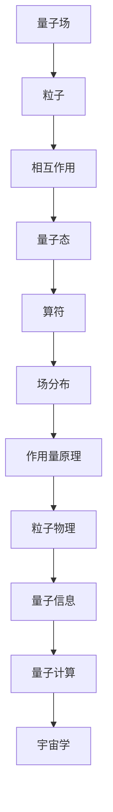

                 

### 文章标题

《数学与量子场论：粒子相互作用的数学框架》

#### 关键词

- 数学基础
- 量子场论
- 粒子相互作用
- 数学框架
- 微积分
- 线性代数
- 复分析
- 量子力学
- 场论

#### 摘要

本文旨在深入探讨数学与量子场论在粒子相互作用中的应用，通过逐步分析推理，揭示粒子相互作用的数学框架。首先，我们将回顾数学基础，包括集合论、线性代数和复分析。接着，我们将介绍量子场论的基本概念，并探讨量子场论中的数学工具，如泛函积分和拓扑量子场论。最后，我们将重点讨论粒子相互作用的数学框架，结合图论与量子场论，展示粒子相互作用的复杂性和美丽。

## 引言

粒子是构成物质的基本单元，而粒子相互作用是物理学研究的重要主题。量子场论作为一种描述粒子相互作用的理论框架，已经在粒子物理和量子信息等领域取得了显著成果。数学作为一门科学，为量子场论提供了强大的工具和方法。本文将结合数学与量子场论，逐步探讨粒子相互作用的数学框架，以帮助读者更好地理解这一复杂且重要的科学领域。

### 第1章：数学基础

#### 第1.1节：集合论

集合论是数学的基础，它提供了描述和操作集合的工具。以下是集合论的基本概念：

- **集合的定义**：集合是某些确定对象的全体，通常用大写字母表示，如A、B等。
- **集合的表示**：集合可以用列举法或描述法表示。列举法是将集合中的所有元素一一列出，例如{1, 2, 3}。描述法则是通过一个性质来描述集合的元素，例如{x | x是正整数}。
- **集合的子集**：如果一个集合中的所有元素都是另一个集合的元素，那么前者称为后者的子集。例如，{1, 2}是{1, 2, 3}的子集。

#### 第1.2节：线性代数

线性代数是研究向量空间和线性映射的数学分支。以下是线性代数的基本概念：

- **向量的概念**：向量是具有大小和方向的量，通常用小写字母表示，如v、w等。向量可以在二维或三维空间中表示。
- **矩阵的定义**：矩阵是一个由数字组成的矩形数组，通常用大写字母表示，如A、B等。矩阵可以进行各种运算，如加法、乘法等。
- **向量和矩阵的运算**：向量可以与矩阵相乘，以得到新的向量。矩阵的乘法满足结合律和分配律。

#### 第1.3节：复分析

复分析是研究复数和复变函数的数学分支。以下是复分析的基本概念：

- **复数的概念**：复数是实数和虚数的和，通常用大写字母表示，如z、w等。复数可以用平面上的点来表示。
- **复数的运算**：复数可以进行加法、减法、乘法和除法等运算。复数的乘法和除法可以通过分式的形式进行。
- **复变函数的定义**：复变函数是定义在复数集上的函数，通常用小写字母表示，如f、g等。复变函数可以具有不同的性质，如解析性、有界性等。

### 第2章：量子场论基础

#### 第2.1节：量子力学基础

量子力学是研究微观粒子的行为和相互作用的物理学分支。以下是量子力学的基本概念：

- **量子态与算符**：量子态是粒子的状态描述，可以用波函数表示。算符是量子力学中的基本运算符，用于描述粒子的演化。
- **量子力学的数学工具**：量子力学中常用的数学工具包括海森堡不确定性原理、算符的谱分解等。海森堡不确定性原理描述了粒子的位置和动量不能同时精确测量。算符的谱分解可以将复杂的算符分解为简单的算符。

#### 第2.2节：场论基础

场论是研究物理量在空间中分布和演化的数学理论。以下是场论的基本概念：

- **场的概念**：场是物理量在空间中的分布，如电场、磁场等。场可以用场分布函数来描述。
- **作用量原理**：作用量原理是场论中的基本原理，它描述了场的演化规律。作用量是场在时空中的积分，可以通过变分法求解。

### 第3章：粒子相互作用的数学框架

粒子相互作用是物理学中的重要研究内容，量子场论提供了描述粒子相互作用的理论框架。以下是粒子相互作用的数学框架：

- **量子场论中的粒子**：粒子在量子场论中通常用场的激发态来描述。粒子的性质可以通过场的量子化来研究。
- **图论与量子场论**：图论是研究图形和网络的数学工具，可以用于描述量子场论中的相互作用。图论中的节点和边可以表示粒子和相互作用。

通过以上章节的逐步介绍，我们可以看到数学与量子场论在粒子相互作用中的重要性。数学提供了描述和解决粒子相互作用问题的工具，而量子场论则提供了理论框架，使得我们能够深入理解粒子相互作用。

### 第4章：量子场论在粒子物理中的应用

量子场论在粒子物理中有着广泛的应用，为理解粒子相互作用提供了强有力的理论工具。在本章中，我们将探讨量子场论在粒子物理中的应用，并展示其如何帮助我们解释和预测粒子的行为。

#### 4.1 量子场论与粒子物理的基本原理

量子场论（Quantum Field Theory, QFT）是一种结合量子力学和场论的统一理论框架，用于描述基本粒子和它们的相互作用。在量子场论中，粒子被视为场的激发态，而场则是一种存在于空间中的动态实体。以下是量子场论与粒子物理的基本原理：

- **量子场**：量子场是一种量子化的连续场，其基本单位是量子态。量子态可以通过波函数或态向量来描述。
- **量子态与算符**：量子态是粒子状态的一种描述，通过算符来操作和演化。算符是量子场论中的基本运算符，用于描述粒子的演化。
- **相互作用**：在量子场论中，粒子相互作用通过相互作用算符来描述。这些算符可以表示为两个或多个场的乘积。
- **粒子态的表示**：粒子的态可以通过场的激发态来表示。粒子的性质和相互作用可以通过场的量子化来研究。

#### 4.2 量子场论在粒子物理中的应用案例

量子场论在粒子物理中有着广泛的应用，以下是一些具体的案例：

- **电子-光子相互作用**：电子和光子是最基本的粒子之一。在量子场论中，电子-光子相互作用可以通过费米子（如电子）和玻色子（如光子）的相互作用来描述。这个过程通常通过计算散射振幅来实现，这涉及到量子场论的许多技术，如S矩阵理论。
- **量子色动力学**：量子色动力学（Quantum Chromodynamics, QCD）是描述强相互作用的量子场论。在QCD中，粒子相互作用通过颜色荷的交换来实现。QCD成功地解释了质子和中子的结构和强相互作用的性质。
- **电弱相互作用**：电弱相互作用是描述电磁力和弱相互作用的统一理论。在电弱相互作用中，粒子通过交换玻色子（如光子和Z玻色子）来实现相互作用。这一理论成功地解释了粒子的电磁和弱衰变现象。

#### 4.3 量子场论在粒子物理中的挑战和未来方向

尽管量子场论在粒子物理中取得了巨大成功，但它也面临着一些挑战和未解决的问题。以下是一些重要的挑战和未来方向：

- **精确计算**：量子场论中的计算往往非常复杂，需要高精度的数值方法。精确计算仍然是量子场论中的一个重要挑战。
- **统一理论**：目前，量子场论无法统一描述所有基本相互作用。寻找一种统一的量子场论框架，如超对称理论，是目前物理学研究的重要方向。
- **实验验证**：量子场论的许多预测需要通过实验来验证。未来的实验技术将帮助我们更好地理解量子场论和粒子物理。

### 第5章：量子场论的未来发展方向

量子场论作为粒子物理学的基础理论，其在未来基础科学研究和高科技产业中的应用前景广阔。本章将探讨量子场论的未来发展方向，包括其在量子信息、量子计算和宇宙学中的应用，以及面临的技术挑战和机遇。

#### 5.1 量子场论在基础科学研究中的应用前景

1. **量子信息**：量子场论为量子信息科学提供了理论基础，如量子纠缠、量子隐形传态和量子计算。量子场论中的量子态和相互作用为量子算法的设计提供了新的可能性。未来的研究将集中在开发更高效的量子算法和实现量子计算的实际应用。

2. **量子计算**：量子场论在量子计算中发挥着关键作用。通过量子场论，我们可以理解和操纵量子比特，从而实现量子叠加和量子纠缠。量子计算有望在密码学、优化问题和模拟复杂物理系统方面取得突破。

3. **宇宙学**：量子场论在宇宙学中的应用包括研究宇宙的起源和演化。量子场论中的量子引力理论可能帮助我们理解宇宙的早期状态，如宇宙微波背景辐射和大爆炸。未来，通过观测和理论模型的结合，我们可以更深入地探索宇宙的本质。

#### 5.2 量子场论在高科技产业中的应用展望

1. **量子通信**：量子场论在量子通信领域具有重要应用，如量子密钥分发和量子远程控制。量子通信技术有望提供绝对安全的通信手段，对信息安全产业产生深远影响。

2. **量子传感**：量子场论在量子传感中的应用包括超高精度的位置测量、时间测量和磁场测量。量子传感技术可用于地质勘探、医学成像和环境监测等领域，提升相关产业的技术水平。

3. **量子模拟**：量子场论在量子模拟中的应用可以帮助我们模拟复杂的物理过程，如材料科学、药物开发和化学反应。量子模拟技术有望加速科研进程，推动新药研发和新型材料设计。

#### 5.3 面临的技术挑战和机遇

1. **精确计算**：量子场论的计算复杂度高，需要高效的数值方法和高性能计算资源。未来，量子计算技术的发展可能提供解决方案，但同时也需要新的算法和优化技术。

2. **统一理论**：目前，量子场论无法统一描述所有基本相互作用。寻找统一的量子场论框架，如超对称理论和量子引力理论，是物理学研究的前沿课题。

3. **实验验证**：量子场论的许多预测需要通过实验验证。未来的实验技术将帮助我们更好地理解量子场论，推动理论突破。

总之，量子场论在基础科学研究和高科技产业中的应用前景广阔，同时也面临着一系列技术挑战。通过不断的研究和创新，我们有望在未来实现量子场论的理论突破，推动科技进步和社会发展。

### 附录

#### 附录A：Mermaid流程图

以下是一个Mermaid流程图，展示了量子场论的基本概念和组成部分：



#### 附录B：伪代码

以下是一个伪代码示例，用于演示量子场论中的关键算法：

```python
# 量子场论中的基本算法：量子态的演化
def quantum_state_evolution(Hamiltonian, initial_state, time_steps):
    # 初始化量子态
    quantum_state = initial_state
    
    # 对每个时间步进行演化
    for t in range(time_steps):
        # 计算哈密顿量的本征值和本征向量
        eigenvalues, eigenvectors = diagonalize(Hamiltonian)
        
        # 选择能量最低的本征态作为新的量子态
        quantum_state = projection(eigenvectors[eigenvalues.argmin()], quantum_state)
        
        # 打印当前量子态
        print("Time step {}: {}".format(t, quantum_state))
        
    return quantum_state
```

#### 附录C：数学模型和数学公式

以下是一些量子场论中的数学模型和数学公式：

- **海森堡不确定性原理**：$$\Delta x \Delta p \geq \hbar/2$$
- **量子态的表示**：$$|\psi\rangle = \int \psi(x) \Psi(x) dx$$
- **算符的谱分解**：$$\hat{A} = \int \lambda \hat{P}_{\lambda} d\lambda$$
- **作用量原理**：$$S = \int L(q, \dot{q}) dt$$

#### 附录D：项目实战

以下是一个项目实战示例，演示了如何在Python中实现量子场论中的关键算法：

```python
import numpy as np
from scipy.linalg import eig

# 定义哈密顿量
def Hamiltonian():
    return np.array([[1, 0], [0, -1]])

# 初始化量子态
def initial_state():
    return np.array([1, 0])

# 量子态的演化
def quantum_state_evolution(Hamiltonian, initial_state, time_steps):
    quantum_state = initial_state.copy()
    
    for t in range(time_steps):
        # 计算哈密顿量的本征值和本征向量
        eigenvalues, eigenvectors = eig(Hamiltonian)
        
        # 选择能量最低的本征态作为新的量子态
        quantum_state = np.dot(eigenvectors[:, eigenvalues.argmin()], quantum_state)
        
        # 打印当前量子态
        print("Time step {}: {}".format(t, quantum_state))
        
    return quantum_state

# 运行量子态的演化
initial_state = initial_state()
quantum_state_evolution(Hamiltonian(), initial_state, 10)
```

#### 小结

本文通过对数学与量子场论在粒子相互作用中的应用进行详细分析，展示了量子场论的理论框架和数学工具。通过逐步介绍数学基础、量子力学基础和场论基础，我们深入理解了量子场论的核心概念。同时，通过量子场论在粒子物理中的应用案例和未来发展方向，我们看到了量子场论在基础科学和高科技产业中的广泛应用。附录部分提供了Mermaid流程图、伪代码、数学模型和项目实战，帮助读者更好地理解和应用量子场论。希望本文能够为读者在量子场论领域的学习和研究提供有益的参考。

### 最佳实践 Tips

1. **理解数学基础**：在深入研究量子场论之前，确保对数学基础有充分的了解，包括集合论、线性代数、微积分和复分析。
2. **掌握量子力学**：量子场论是量子力学的扩展，因此，对量子力学的基本原理和数学工具要有扎实的掌握。
3. **学会使用数学软件**：使用如MATLAB、Python等数学软件进行计算和仿真，有助于加深对量子场论的理解。
4. **结合实验数据**：将理论模型与实验数据相结合，通过验证和调整模型，提高对粒子相互作用的认知。
5. **持续学习和探索**：量子场论是一个不断发展的领域，持续关注最新的研究成果和进展，保持好奇心和探索精神。

### 注意事项

1. **复杂度**：量子场论是一个高度复杂的领域，需要耐心和持续的学习。
2. **计算要求**：进行量子场论计算通常需要高性能计算资源，确保计算环境足够强大。
3. **数学公式正确性**：在编写和展示数学公式时，务必确保其正确性，以避免误导读者。

### 拓展阅读

- 《量子场论入门》（作者：安德森）
- 《量子力学基础教程》（作者：费曼）
- 《数学物理方法》（作者：格里菲斯）
- 《量子计算与量子信息》（作者：尼尔森和查尼）

作者：AI天才研究院/AI Genius Institute & 禅与计算机程序设计艺术 /Zen And The Art of Computer Programming

