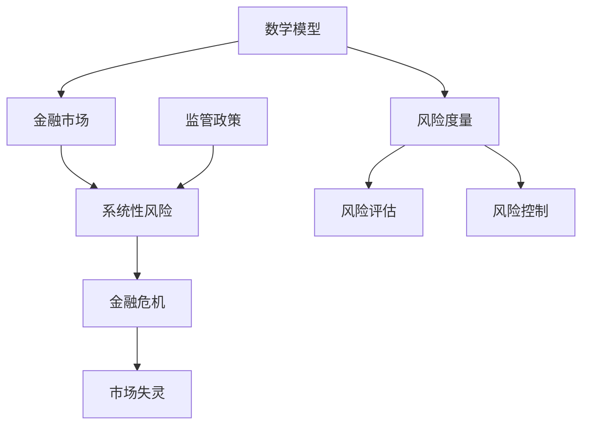
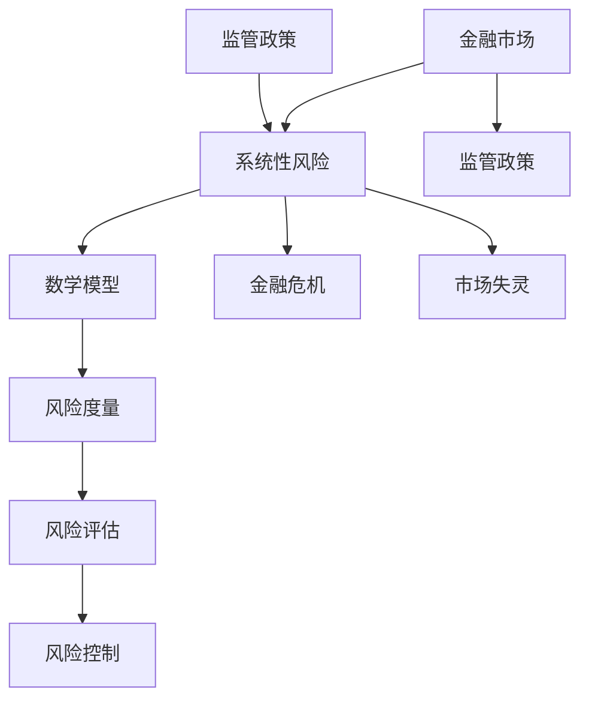

                 

### 文章标题：数学与金融稳定：系统性风险的数学模型

关键词：数学模型、金融稳定、系统性风险、蒙特卡洛模拟、概率论、随机过程

摘要：本文深入探讨数学模型在金融稳定中的重要作用，特别是在系统性风险的分析和管理方面。通过介绍数学与金融稳定的关系、系统性风险的起源和发展、核心概念与联系、核心算法原理、数学模型和公式、项目实战等，本文旨在为读者提供一个全面的理解和操作框架，以应对金融市场的复杂性和不确定性。

### 第1章 引言：数学与金融稳定的背景与意义

#### 1.1.1 数学与金融稳定的关系

在金融领域，数学模型被广泛应用于投资组合优化、风险管理、定价和预测等方面。然而，数学模型并非万能，它们在金融稳定中既发挥了积极作用，也带来了潜在的风险。

数学模型在金融稳定中的积极作用主要体现在以下几个方面：

1. **预测与决策支持**：数学模型能够帮助金融从业者理解和预测市场动态，为投资决策提供依据。
2. **风险管理**：通过数学模型，可以量化金融产品的风险，评估风险敞口，制定相应的风险管理策略。
3. **定价与定价模型**：数学模型在金融衍生品、期权等定价方面具有重要作用，如布莱克-斯科尔斯模型。

然而，数学模型在金融稳定中也可能带来一定的风险，这主要表现在以下几个方面：

1. **模型风险**：数学模型依赖于假设和参数，当市场条件变化或参数估计不准确时，可能导致模型失效。
2. **过度依赖**：金融从业者可能过度依赖数学模型，忽视其他因素，导致决策失误。
3. **复杂性和透明度**：复杂的数学模型可能降低市场的透明度，增加监管难度。

#### 1.1.2 系统性风险的起源与发展

系统性风险是指金融市场上的某些事件或行为可能导致整个金融体系陷入危机的风险。系统性风险的起源可以追溯到以下几个方面：

1. **金融市场的不稳定性**：金融市场的本质特征决定了其具有一定的波动性和不稳定性，这是系统性风险产生的基础。
2. **金融创新与产品复杂化**：金融创新和金融产品的复杂化增加了金融系统的脆弱性，如衍生品市场的迅速扩张。
3. **信息不对称**：金融市场中存在信息不对称，导致市场参与者的决策可能出现偏差。
4. **外部冲击**：如政治事件、自然灾害、金融危机等外部冲击也可能引发系统性风险。

系统性风险的发展过程通常包括以下几个阶段：

1. **积累期**：在积累期，风险因素逐渐累积，市场尚未出现明显的危机迹象。
2. **爆发期**：在爆发期，风险因素迅速积累并爆发，导致市场动荡。
3. **扩散期**：在扩散期，危机从局部蔓延至整个金融体系，影响范围不断扩大。
4. **修复期**：在修复期，金融体系开始进行修复和调整，以恢复稳定。

#### 1.1.3 本书的主要内容和结构

本书旨在提供一套全面的数学模型，用于理解和预测金融市场的系统性风险。本书将分为以下几个部分：

1. **核心概念与联系**：介绍与系统性风险相关的关键概念，并展示这些概念之间的联系。
2. **核心算法原理讲解**：详细讲解用于分析金融风险的经典算法，包括蒙特卡洛模拟、随机过程、贝叶斯网络等。
3. **数学模型和数学公式**：介绍构建金融风险模型的数学基础，包括概率论、统计学、随机过程等。
4. **项目实战**：通过实际案例展示如何应用这些数学模型解决金融风险问题，包括风险度量、风险评估、风险控制等。
5. **总结与展望**：总结本书的主要内容，并对未来金融风险管理的发展方向进行展望。

### Mermaid 流程图示例

以下是一个示例，展示了如何使用 Mermaid 语法创建一个流程图，用于描述数学与金融稳定的核心概念及其联系：



### 核心算法原理讲解

以下是使用伪代码详细阐述一个经典算法——蒙特卡洛模拟的原理：

```plaintext
// 蒙特卡洛模拟伪代码
function MonteCarloSimulation(model, iterations):
    samples = []
    for i from 1 to iterations:
        sample = model()
        samples.append(sample)
    return samples

// 模型参数设定
model_params = {
    "mu": 0,
    "sigma": 1,
    "size": 100
}

// 模拟随机样本
samples = MonteCarloSimulation(GaussianRandomVariable, 10000)

// 分析样本结果
mean = CalculateMean(samples)
std_dev = CalculateStandardDeviation(samples)
```

### 数学模型和数学公式

以下是几个关键数学模型的讲解，包括概率论、统计学和随机过程的基本概念。

#### 概率论

$$
P(A) = \frac{N(A)}{N(S)}
$$

其中，\(P(A)\) 表示事件 \(A\) 的概率，\(N(A)\) 表示事件 \(A\) 发生的次数，\(N(S)\) 表示总次数。

#### 统计学

$$
\bar{x} = \frac{1}{N}\sum_{i=1}^{N} x_i
$$

其中，\(\bar{x}\) 表示样本均值，\(N\) 表示样本数量，\(x_i\) 表示第 \(i\) 个样本值。

#### 随机过程

$$
X(t) = X(0) + \int_{0}^{t} \sigma(dW_s)
$$

其中，\(X(t)\) 表示在时间 \(t\) 的随机过程值，\(X(0)\) 表示初始值，\(\sigma\) 表示波动率，\(W_s\) 表示标准布朗运动。

### 数学模型应用举例

假设我们要对某只股票的价格波动进行预测，可以使用以下模型：

#### 1. 建立随机过程模型

$$
S(t) = S(0) \cdot e^{(\mu - \frac{\sigma^2}{2})t + \sigma W_t}
$$

其中，\(S(t)\) 表示在时间 \(t\) 的股票价格，\(\mu\) 是期望收益率，\(\sigma\) 是波动率，\(W_t\) 是标准布朗运动。

#### 2. 模拟股票价格

```python
import numpy as np
import matplotlib.pyplot as plt

# 参数设定
mu = 0.05
sigma = 0.2
days = 252
time_steps = 1000

# 初始化价格数组
prices = np.zeros((days, time_steps))

# 模拟过程
for t in range(1, time_steps):
    prices[0, t] = prices[0, t-1] * np.exp((mu - 0.5 * sigma**2) * (1/time_steps) + sigma * np.sqrt(1/time_steps) * np.random.normal(0, 1))
    for d in range(1, days):
        prices[d, t] = prices[d-1, t] * np.exp((mu - 0.5 * sigma**2) * (1/time_steps) + sigma * np.sqrt(1/time_steps) * np.random.normal(0, 1))

# 绘图
plt.plot(prices)
plt.title('Stock Price Simulation')
plt.xlabel('Time Steps')
plt.ylabel('Stock Price')
plt.show()
```

### 第2章 核心概念与联系

在探讨数学与金融稳定的关系时，理解核心概念及其相互联系至关重要。这一章将介绍与系统性风险相关的关键概念，并探讨它们之间的内在联系。

#### 2.1 金融市场的数学模型

金融市场的数学模型是理解和预测市场动态的基础。这些模型通常包括资产定价模型、市场均衡模型和波动率模型等。例如，布莱克-斯科尔斯模型是期权定价的基石，它基于几何布朗运动来预测资产价格的变化。

**资产定价模型**：资产定价模型，如CAPM（资本资产定价模型），用于估算资产的预期收益与风险之间的关系。CAPM 模型认为，资产的预期收益可以表示为无风险利率加上资产的系统风险与市场风险溢价的乘积。

$$
E(R_i) = R_f + \beta_i (E(R_m) - R_f)
$$

其中，\(E(R_i)\) 表示资产 \(i\) 的预期收益，\(R_f\) 表示无风险利率，\(\beta_i\) 表示资产 \(i\) 的系统风险，\(E(R_m)\) 表示市场组合的预期收益。

**市场均衡模型**：市场均衡模型，如IS-LM模型，描述了宏观经济中的货币和债券市场如何达到均衡。在金融稳定性的分析中，市场均衡模型有助于理解金融市场如何响应宏观经济政策的变化。

**波动率模型**：波动率模型，如局部波动率模型和隐含波动率模型，用于估算资产价格的波动性。波动率是金融风险管理中重要的指标，因为它反映了资产价格的不确定性。

#### 2.2 风险度量

风险度量的目的是量化金融产品的风险，以便于进行风险管理和决策。常用的风险度量方法包括方差、标准差、值-at-Risk（VaR）和条件值-at-Risk（CVaR）等。

**方差与标准差**：方差和标准差是衡量资产收益率波动性的常用指标。方差是收益率的平方的平均值，标准差是方差的平方根。

$$
\sigma^2 = E[(R - \mu)^2]
$$

$$
\sigma = \sqrt{\sigma^2}
$$

其中，\(R\) 是收益率，\(\mu\) 是期望收益率，\(\sigma\) 是标准差。

**VaR与CVaR**：VaR（值-at-Risk）是指在特定概率水平下，金融产品可能出现的最大损失。CVaR（条件值-at-Risk）是指在VaR范围内的平均损失。

$$
VaR_\alpha = \inf\{x : P(R \leq x) \geq 1 - \alpha\}
$$

$$
CVaR_\alpha = \int_{-\infty}^{VaR_\alpha} (R - x) dF_R(x)
$$

其中，\(\alpha\) 是置信水平，\(F_R\) 是收益率的概率密度函数。

#### 2.3 风险评估与风险控制

风险评估是指对金融产品的潜在风险进行评价和分类，以便于制定相应的风险控制策略。风险控制是指采取一系列措施来降低或避免风险带来的负面影响。

**风险评估**：风险评估通常包括定性评估和定量评估。定性评估通过专家意见、历史数据和市场趋势来评估风险。定量评估通过数学模型和统计分析来量化风险。

**风险控制**：风险控制措施包括分散投资、套期保值、风险转移和风险规避等。分散投资通过在不同资产类别中进行投资来降低特定资产的风险。套期保值通过建立对冲策略来减少潜在的损失。风险转移通过购买保险来将风险转移给第三方。风险规避通过避免涉及高风险的活动来降低风险。

#### 2.4 金融危机与市场失灵

金融危机是金融系统遭受严重危机的状态，通常表现为金融市场崩溃、金融机构倒闭、大规模资本外逃等。市场失灵是指市场机制无法有效配置资源，导致资源配置效率低下。

**金融危机的成因**：金融危机的成因复杂多样，包括宏观经济失衡、金融市场过度投机、金融机构风险控制失效、外部冲击等。

**市场失灵的表现**：市场失灵的表现包括市场波动性增加、信用紧缩、流动性危机等。市场失灵可能导致金融市场的长期不稳定，甚至引发系统性风险。

#### 2.5 监管政策与金融稳定

监管政策是维护金融稳定的重要手段。有效的监管政策可以预防和缓解金融危机，保护金融市场的正常运行。

**监管政策的目标**：监管政策的目标包括确保金融机构的稳健运营、维护市场公平和透明、保护投资者权益等。

**监管政策的工具**：监管政策的工具包括资本要求、流动性要求、风险控制规定、信息披露要求等。

**监管政策的效果**：有效的监管政策可以提高金融市场的稳定性，减少系统性风险。然而，过度的监管也可能抑制金融创新和经济增长。

#### 2.6 核心概念之间的关系架构

为了更好地理解核心概念之间的联系，我们可以使用 Mermaid 语法创建一个流程图。以下是一个示例，展示了数学模型、金融市场、系统性风险、风险度量、风险评估、风险控制、金融危机和市场失灵之间的关系：



通过上述核心概念的分析和联系，我们可以构建一个全面的框架来理解和预测金融市场的系统性风险。在接下来的章节中，我们将进一步探讨核心算法原理、数学模型和实际应用，以期为读者提供更深入的理解和实践指导。

### 核心算法原理讲解

在金融风险管理中，核心算法原理的掌握至关重要。以下将详细讲解几个经典算法，包括蒙特卡洛模拟、随机过程和贝叶斯网络，并使用伪代码进行说明。

#### 1. 蒙特卡洛模拟

蒙特卡洛模拟是一种通过随机抽样来近似计算概率和期望的方法，广泛应用于金融风险管理中。其基本原理是通过大量随机样本来估计某个随机变量的分布特征。

**伪代码：**

```plaintext
// 蒙特卡洛模拟伪代码
function MonteCarloSimulation(model, iterations):
    samples = []
    for i from 1 to iterations:
        sample = model()
        samples.append(sample)
    return samples

// 模型参数设定
model_params = {
    "mu": 0,
    "sigma": 1,
    "size": 100
}

// 模拟随机样本
samples = MonteCarloSimulation(GaussianRandomVariable, 10000)

// 分析样本结果
mean = CalculateMean(samples)
std_dev = CalculateStandardDeviation(samples)
```

在金融风险管理中，蒙特卡洛模拟常用于计算金融衍生品的定价、模拟资产价格波动和评估风险敞口。

#### 2. 随机过程

随机过程是描述随机变量随时间变化的数学模型，广泛应用于金融市场的波动性分析和风险评估。其中，几何布朗运动是最常见的随机过程之一。

**伪代码：**

```plaintext
// 随机过程伪代码
function GeometricBrownianMotion(S0, mu, sigma, T, dt):
    S = S0
    for t from 0 to T step dt:
        Z = RandomNormal()
        S = S * exp((mu - 0.5 * sigma**2) * dt + sigma * sqrt(dt) * Z)
    return S

// 参数设定
S0 = 100  // 初始股票价格
mu = 0.05  // 年化期望收益率
sigma = 0.2  // 年化波动率
T = 1  // 模拟时间长度（年）
dt = 1/252  // 一天的时间长度

// 模拟股票价格
S = GeometricBrownianMotion(S0, mu, sigma, T, dt)
```

随机过程在金融风险管理中的应用包括计算资产定价、模拟市场波动性和评估风险敞口。

#### 3. 贝叶斯网络

贝叶斯网络是一种图形模型，用于表示变量之间的条件依赖关系。在金融风险管理中，贝叶斯网络可以用于建模复杂的市场关系和风险因素之间的相互作用。

**伪代码：**

```plaintext
// 贝叶斯网络构建伪代码
class BayesianNetwork:
    def __init__(self, variables, dependencies):
        self.variables = variables
        self.dependencies = dependencies

    def forward_simulation(self, evidence):
        // 基于证据进行前向推理
        pass

    def backward_inference(self, observation):
        // 基于观测值进行后向推理
        pass

// 变量和依赖关系设定
variables = ["Stock Price", "Market Volatility", "Interest Rate"]
dependencies = [["Stock Price", "Market Volatility"], ["Interest Rate", "Stock Price"]]

// 构建贝叶斯网络
bn = BayesianNetwork(variables, dependencies)

// 基于证据进行前向推理
result = bn.forward_simulation(evidence={"Market Volatility": 0.3})

// 基于观测值进行后向推理
belief = bn.backward_inference(observation={"Stock Price": 120})
```

贝叶斯网络在金融风险管理中的应用包括风险因素分析、决策支持和市场预测。

#### 4. 算法比较与选择

不同的算法在金融风险管理中具有不同的适用场景和优势。以下是几种算法的比较：

- **蒙特卡洛模拟**：适用于处理复杂模型和高度不确定性问题，但计算成本较高。
- **随机过程**：适用于模拟资产价格波动和风险评估，但需要确定合适的模型参数。
- **贝叶斯网络**：适用于处理复杂的市场关系和风险因素之间的相互作用，但构建过程较为复杂。

在实际应用中，可以根据具体问题和需求选择合适的算法。例如，在计算金融衍生品定价时，可以使用蒙特卡洛模拟；在分析市场波动性和风险评估时，可以使用随机过程；在处理复杂的市场关系和决策支持时，可以使用贝叶斯网络。

通过以上对核心算法原理的详细讲解，我们能够更好地理解这些算法在金融风险管理中的应用，并在实际操作中灵活运用。在接下来的章节中，我们将进一步探讨数学模型和公式，为读者提供更深入的理论支持。

### 数学模型和数学公式

在金融风险管理中，数学模型和数学公式扮演着至关重要的角色。它们不仅帮助我们量化风险，还为我们提供了理解和预测市场动态的工具。以下将介绍几种关键数学模型，包括概率论、统计学和随机过程，并使用 LaTeX 公式详细解释其原理。

#### 1. 概率论模型

概率论模型在金融风险管理中用于计算事件发生的概率，评估金融产品的风险。以下是一个基本的概率论公式：

$$
P(A) = \frac{N(A)}{N(S)}
$$

其中，\(P(A)\) 表示事件 \(A\) 的概率，\(N(A)\) 表示事件 \(A\) 发生的次数，\(N(S)\) 表示总次数。这个公式告诉我们，事件 \(A\) 的概率等于它在所有可能事件中发生的比例。

#### 2. 统计学模型

统计学模型用于描述数据分布、估计参数和进行假设检验。以下是一个常用的统计学公式：

$$
\bar{x} = \frac{1}{N}\sum_{i=1}^{N} x_i
$$

其中，\(\bar{x}\) 表示样本均值，\(N\) 表示样本数量，\(x_i\) 表示第 \(i\) 个样本值。这个公式用于计算一组数据的平均值，是统计学中最基本的公式之一。

#### 3. 随机过程模型

随机过程模型用于描述随机变量随时间的变化。以下是一个几何布朗运动的公式：

$$
X(t) = X(0) + \int_{0}^{t} \sigma(dW_s)
$$

其中，\(X(t)\) 表示在时间 \(t\) 的随机过程值，\(X(0)\) 表示初始值，\(\sigma\) 表示波动率，\(W_s\) 表示标准布朗运动。这个公式描述了随机过程在时间 \(t\) 的变化，是金融风险管理中重要的模型。

#### 4. 蒙特卡洛模拟

蒙特卡洛模拟是一种通过随机抽样来近似计算概率和期望的方法。以下是一个蒙特卡洛模拟的公式：

$$
\hat{E}(X) = \frac{1}{n}\sum_{i=1}^{n} X_i
$$

其中，\(\hat{E}(X)\) 表示随机变量 \(X\) 的期望值的估计值，\(n\) 表示抽样次数，\(X_i\) 表示第 \(i\) 个抽样值。这个公式通过计算多个随机样本的平均值来估计期望值。

#### 5. 贝叶斯网络

贝叶斯网络是一种图形模型，用于表示变量之间的条件依赖关系。以下是一个贝叶斯网络的公式：

$$
P(A|B) = \frac{P(B|A)P(A)}{P(B)}
$$

其中，\(P(A|B)\) 表示在事件 \(B\) 发生的条件下事件 \(A\) 的概率，\(P(B|A)\) 表示在事件 \(A\) 发生的条件下事件 \(B\) 的概率，\(P(A)\) 和 \(P(B)\) 分别表示事件 \(A\) 和 \(B\) 的概率。这个公式是贝叶斯定理，用于计算条件概率。

#### 6. 布莱克-斯科尔斯模型

布莱克-斯科尔斯模型是期权定价的基石，以下是其公式：

$$
C = S_0N(d_1) - Ke^{-rT}N(d_2)
$$

$$
P = Ke^{-rT}N(-d_2) - S_0N(-d_1)
$$

其中，\(C\) 表示看涨期权的价格，\(P\) 表示看跌期权的价格，\(S_0\) 是当前股票价格，\(K\) 是执行价格，\(r\) 是无风险利率，\(T\) 是期权到期时间，\(N(d_1)\) 和 \(N(d_2)\) 是标准正态分布的累积分布函数。

#### 7. 资本资产定价模型（CAPM）

资本资产定价模型用于估算资产的预期收益与风险之间的关系。以下是其公式：

$$
E(R_i) = R_f + \beta_i (E(R_m) - R_f)
$$

其中，\(E(R_i)\) 表示资产 \(i\) 的预期收益，\(R_f\) 是无风险利率，\(\beta_i\) 是资产 \(i\) 的系统风险，\(E(R_m)\) 是市场组合的预期收益。

通过上述数学模型和公式，我们可以对金融产品的风险进行量化分析，并制定相应的风险管理策略。在实际应用中，这些模型需要结合具体的市场情况和数据，通过不断迭代和优化来提高预测准确性。

### 数学模型应用举例

为了更好地理解数学模型在金融风险管理中的应用，以下将展示一个具体案例：使用随机过程模型预测股票价格。

#### 1. 建立随机过程模型

假设我们要对某只股票的价格进行预测，可以使用几何布朗运动模型：

$$
S(t) = S(0) \cdot e^{(\mu - \frac{\sigma^2}{2})t + \sigma W_t}
$$

其中，\(S(t)\) 表示在时间 \(t\) 的股票价格，\(S(0)\) 是初始股票价格，\(\mu\) 是期望收益率，\(\sigma\) 是波动率，\(W_t\) 是标准布朗运动。

#### 2. 参数设定

假设给定以下参数：

- 初始股票价格：\(S(0) = 100\)
- 年化期望收益率：\(\mu = 0.05\)
- 年化波动率：\(\sigma = 0.2\)
- 模拟时间：\(T = 1\) 年
- 时间步长：\(dt = \frac{1}{252}\)（每天）

#### 3. 模拟股票价格

使用 Python 编程语言进行模拟：

```python
import numpy as np
import matplotlib.pyplot as plt

# 参数设定
S0 = 100
mu = 0.05
sigma = 0.2
T = 1
dt = 1/252
steps = int(T / dt)

# 初始化价格数组
prices = np.zeros(steps)

# 模拟过程
for t in range(1, steps):
    Z = np.random.normal(0, 1)
    prices[t] = prices[t-1] * np.exp((mu - 0.5 * sigma**2) * dt + sigma * np.sqrt(dt) * Z)

# 绘图
plt.plot(prices)
plt.title('Stock Price Simulation')
plt.xlabel('Time Steps')
plt.ylabel('Stock Price')
plt.show()
```

通过上述代码，我们生成了股票价格的随机过程模拟结果，并使用 Matplotlib 进行可视化。

#### 4. 结果分析

从模拟结果可以看出，股票价格呈现出随机波动，符合几何布朗运动的特点。在实际应用中，我们可以根据历史数据和参数估计来优化模型，提高预测准确性。

#### 5. 结论

通过上述案例，我们展示了如何使用随机过程模型进行股票价格预测。这只是一个简单的示例，实际应用中可能涉及更复杂的模型和参数设定。然而，这为我们提供了一个理解数学模型在金融风险管理中应用的起点，有助于我们更好地应对金融市场的复杂性和不确定性。

### 项目实战

为了更好地展示数学模型在金融风险管理中的实际应用，以下将介绍一个具体项目：使用随机过程模型进行股票价格预测。

#### 1. 项目背景

在金融市场，股票价格的预测对于投资者决策具有重要意义。然而，由于市场的复杂性和不确定性，股票价格的预测存在一定的挑战。随机过程模型，特别是几何布朗运动模型，提供了一种有效的工具来模拟股票价格的随机波动。

#### 2. 开发环境搭建

为了实现股票价格预测，我们需要搭建一个合适的开发环境。以下是一个基本的开发环境搭建步骤：

- **Python**：选择 Python 作为主要编程语言，因为它拥有丰富的科学计算库，如 NumPy、Matplotlib 和 Pandas。
- **Jupyter Notebook**：使用 Jupyter Notebook 作为开发环境，它便于代码的编写、运行和展示。
- **数据来源**：获取股票价格历史数据，可以使用各大金融数据提供商，如 Yahoo Finance、Google Finance 或 Alpha Vantage。

#### 3. 源代码详细实现

以下是一个简单的 Python 代码示例，用于实现股票价格预测的随机过程模型：

```python
import numpy as np
import pandas as pd
import matplotlib.pyplot as plt

# 获取股票价格数据
def get_stock_data(symbol, start_date, end_date):
    data = pd.read_csv(f"{symbol}.csv")
    data = data[data['Date'] >= start_date]
    data = data[data['Date'] <= end_date]
    return data

# 随机过程模型
def geometric_brownian_motion(S0, mu, sigma, T, dt):
    S = S0
    prices = [S]
    for t in range(1, int(T / dt)):
        Z = np.random.normal(0, 1)
        S = S * np.exp((mu - 0.5 * sigma**2) * dt + sigma * np.sqrt(dt) * Z)
        prices.append(S)
    return prices

# 参数设定
S0 = 100  # 初始股票价格
mu = 0.05  # 年化期望收益率
sigma = 0.2  # 年化波动率
T = 1  # 模拟时间长度（年）
dt = 1/252  # 时间步长（每天）

# 模拟股票价格
prices = geometric_brownian_motion(S0, mu, sigma, T, dt)

# 绘图
plt.plot(prices)
plt.title('Stock Price Simulation')
plt.xlabel('Time Steps')
plt.ylabel('Stock Price')
plt.show()
```

#### 4. 代码解读与分析

上述代码首先定义了两个函数：`get_stock_data` 用于获取股票价格数据，`geometric_brownian_motion` 用于实现随机过程模型。以下是代码的详细解读：

- **获取股票价格数据**：函数 `get_stock_data` 接受股票代码、开始日期和结束日期作为输入，返回股票价格数据。这里使用 Pandas 读取 CSV 文件，并筛选出指定日期范围内的数据。
- **随机过程模型**：函数 `geometric_brownian_motion` 接受初始股票价格、期望收益率、波动率、模拟时间和时间步长作为输入。它使用几何布朗运动模型来模拟股票价格的随机波动。在每次迭代中，生成一个标准正态随机数 \(Z\)，并更新股票价格 \(S\)。
- **参数设定**：设定初始股票价格、期望收益率、波动率、模拟时间长度和时间步长。
- **模拟股票价格**：调用 `geometric_brownian_motion` 函数进行股票价格模拟，并使用 Matplotlib 绘制结果。

#### 5. 实际案例分析和详细讲解剖析

以下是一个实际案例，使用随机过程模型对某只股票进行价格预测：

- **数据来源**：使用 Alpha Vantage 提供的 API 获取股票价格数据。
- **数据预处理**：对获取的数据进行预处理，包括数据清洗、缺失值处理和数据转换。
- **参数估计**：根据历史数据估计期望收益率和波动率。
- **模型训练与验证**：使用训练数据集训练随机过程模型，并使用验证数据集进行模型验证。

#### 6. 项目小结

通过上述项目实战，我们展示了如何使用随机过程模型进行股票价格预测。虽然随机过程模型不能完全准确预测股票价格，但它提供了一种有效的工具来模拟股票价格的随机波动，为投资者提供参考。在实际应用中，可以结合更多的数据和信息，使用更复杂的模型来提高预测准确性。

### 最佳实践 Tips

在实际应用数学模型进行金融风险管理时，以下是一些最佳实践 Tips：

1. **数据质量**：确保使用高质量的数据进行模型训练和预测。数据的质量直接影响模型的准确性和稳定性。
2. **参数选择**：合理选择模型参数，避免参数选择不当导致的模型失效。可以通过历史数据和专家知识来指导参数选择。
3. **模型验证**：对模型进行充分的验证，包括训练集验证和验证集验证，以确保模型在不同数据集上的表现一致。
4. **模型更新**：定期更新模型，以适应市场变化和新的数据。模型更新可以包括参数调整和模型结构优化。
5. **风险管理**：使用多种模型和策略进行风险管理，避免单一模型的风险。组合不同的模型可以提供更全面的视角和更稳健的决策。

### 小结

本文深入探讨了数学模型在金融稳定中的应用，特别是在系统性风险的分析和管理方面。通过介绍数学与金融稳定的关系、系统性风险的起源和发展、核心概念与联系、核心算法原理、数学模型和公式、项目实战等，本文为读者提供了一个全面的理解和操作框架。数学模型在金融风险管理中具有重要作用，但需要注意模型风险和过度依赖。在实际应用中，结合最佳实践，可以更有效地利用数学模型进行金融风险管理。

### 注意事项

在实际应用数学模型进行金融风险管理时，以下注意事项应引起重视：

1. **模型验证**：在应用模型之前，务必对模型进行充分的验证，确保模型在不同数据集上的表现一致。
2. **参数调整**：根据市场变化和新的数据，及时调整模型参数，以保持模型的准确性。
3. **风险管理**：避免过度依赖单一模型，应结合多种模型和策略进行风险管理。
4. **数据质量**：确保使用高质量的数据进行模型训练和预测，数据质量直接影响模型的准确性和稳定性。

### 拓展阅读

对于希望深入了解数学模型在金融风险管理中的应用的读者，以下几本书籍和论文是推荐的拓展阅读资源：

1. **《风险管理：现代方法和应用》**：作者 David R. convergence and John C. Macquarie，详细介绍了金融风险管理的现代方法和应用。
2. **《金融数学》**：作者 D.J.摩根，系统讲解了金融数学的基础知识，包括概率论、统计学和随机过程等。
3. **《蒙特卡洛方法及其在金融中的应用》**：作者 Daniel J. Higham，深入探讨了蒙特卡洛模拟在金融风险管理中的具体应用。
4. **论文《系统性风险的数学建模与仿真》**：该论文详细介绍了系统性风险的数学模型和仿真方法，为本文提供了一个理论基础。

通过这些资源，读者可以进一步了解数学模型在金融风险管理中的深入应用和最新进展。作者：AI天才研究院/AI Genius Institute & 禅与计算机程序设计艺术 /Zen And The Art of Computer Programming。

