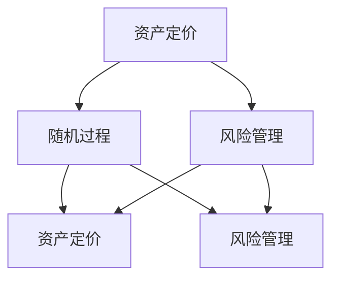

                 

## 文章标题：数学与金融经济学：金融市场的数学模型

### 关键词：
- 数学模型
- 金融经济学
- 金融衍生品
- 随机过程
- 资产定价
- 风险管理

### 摘要：
本文旨在探讨数学在金融经济学中的应用，特别是金融市场的数学模型。文章首先介绍了数学与金融经济学之间的关系，接着详细分析了金融市场中常用的数学模型，包括随机过程、资产定价模型和风险管理模型。通过实际案例和项目实战，本文进一步阐述了这些数学模型在金融市场中的应用，以及如何通过数学方法来优化金融决策。文章的最后，对未来的研究方向进行了展望，并提供了拓展阅读的建议。

## 第1章：引言与概述

### 1.1 数学与金融经济学的关系

数学是金融经济学的基础，二者密不可分。数学的严谨性和抽象性使得它能够精确描述金融市场的复杂性和不确定性，从而为金融决策提供科学依据。在金融经济学中，数学模型广泛应用于资产定价、风险管理、投资组合优化等领域。例如，Black-Scholes模型就是基于数学理论推导出的期权定价模型，它为金融市场的期权交易提供了重要的理论支持。

### 1.2 金融市场的数学模型概述

金融市场的数学模型主要包括随机过程模型、资产定价模型和风险管理模型。随机过程模型用于描述金融市场中的不确定性，如股票价格的随机波动；资产定价模型用于计算金融资产的价值，如期权定价模型；风险管理模型用于评估和降低金融风险，如价值在风险（VaR）模型。

### 1.3 书籍结构安排与目标

本文将分为八章，系统介绍金融市场的数学模型。第2章介绍数学与金融经济学的基础知识；第3章至第6章分别介绍金融市场的数学模型，包括随机过程、资产定价、风险管理和项目实战；第7章通过实际案例和项目实战，展示数学模型在金融市场中的应用；第8章总结研究成果，展望未来研究方向。

## 第2章：数学与金融经济学基础

### 2.1 数学基础

数学基础包括集合与概率、线性代数基础和微积分基础。这些数学工具在金融经济学中有着广泛的应用。

#### 2.1.1 集合与概率

集合是数学中的基本概念，用于表示一组对象的集合。概率则是用来描述事件发生可能性大小的数值。在金融经济学中，集合与概率用于分析金融市场中的不确定性，如股票价格波动的概率分布。

#### 2.1.2 线性代数基础

线性代数基础包括向量、矩阵和线性方程组等概念。这些概念在金融经济学中有着广泛的应用，如投资组合优化、资产定价等。

#### 2.1.3 微积分基础

微积分基础包括导数、积分和微分方程等概念。这些概念在金融经济学中用于分析金融市场中的动态变化，如股票价格的走势、利率的变动等。

### 2.2 金融经济学基础

金融经济学基础包括金融市场概述、资产定价理论和风险管理概述。

#### 2.2.1 金融市场概述

金融市场是金融工具交易的场所。金融市场可以分为股票市场、债券市场、期货市场和期权市场等。这些市场共同构成了金融体系，为经济发展提供了重要的资金支持。

#### 2.2.2 资产定价理论

资产定价理论是金融经济学中的核心内容，用于计算金融资产的价值。资产定价理论包括套利定价理论、资本资产定价模型（CAPM）和期权定价模型等。

#### 2.2.3 风险管理概述

风险管理是金融经济学中的重要内容，用于评估和降低金融风险。风险管理方法包括风险识别、风险评估、风险控制和风险监测等。

## 第3章：金融市场的数学模型

### 3.1 基本概念

金融市场的数学模型主要包括金融衍生品、风险中性定价和期望收益与效用理论。

#### 3.1.1 金融衍生品

金融衍生品是金融市场中的一种重要工具，包括期权、期货、互换等。这些衍生品的价值取决于基础资产的价格，因此具有高风险和高收益的特点。

#### 3.1.2 风险中性定价

风险中性定价是一种假设投资者在金融市场中的投资行为是风险中性的，即投资者不关心风险的大小，只关心资产的预期收益。这种假设使得风险中性定价成为金融衍生品定价的重要方法。

#### 3.1.3 期望收益与效用理论

期望收益与效用理论用于分析投资者在不同投资策略下的收益和风险。期望收益是指投资策略的预期收益，效用理论则用于衡量投资者对不同收益的偏好。

### 3.2 数学模型介绍

金融市场的数学模型主要包括随机过程、状态价格向量和布朗运动。

#### 3.2.1 随机过程

随机过程是一种用于描述随机现象的数学模型，如股票价格的随机波动。随机过程在金融市场中有着广泛的应用，如资产定价、风险管理等。

#### 3.2.2 状态价格向量

状态价格向量是一种用于描述金融衍生品定价的数学模型。状态价格向量可以根据市场情况调整，以实现金融衍生品的风险中性定价。

#### 3.2.3 布朗运动

布朗运动是一种随机过程，用于描述股票价格的随机波动。布朗运动在金融市场中有着广泛的应用，如资产定价、风险管理等。

## 第4章：随机过程与金融市场

### 4.1 随机过程理论

随机过程理论是金融数学中的基础理论，用于描述金融市场的随机波动。随机过程理论主要包括随机变量的概念、马尔可夫链和随机微分方程。

#### 4.1.1 随机变量的概念

随机变量是一种用于描述随机现象的数学工具，如股票价格。随机变量可以是连续的，也可以是离散的。

#### 4.1.2 马尔可夫链

马尔可夫链是一种用于描述随机过程状态转移的数学模型，如股票价格的状态转移。马尔可夫链在金融市场中有着广泛的应用，如股票价格预测、资产定价等。

#### 4.1.3 随机微分方程

随机微分方程是一种用于描述随机过程的微分方程，如股票价格的随机波动。随机微分方程在金融市场中有着广泛的应用，如资产定价、风险管理等。

### 4.2 随机过程在金融市场中的应用

随机过程在金融市场中的应用主要包括股票价格的随机模型和金融市场的波动。

#### 4.2.1 股票价格的随机模型

股票价格的随机模型是一种用于描述股票价格随机波动的数学模型，如几何布朗运动。股票价格的随机模型在金融市场中有着广泛的应用，如资产定价、风险管理等。

#### 4.2.2 布朗运动与金融市场的波动

布朗运动是一种随机过程，用于描述金融市场的波动。布朗运动在金融市场中有着广泛的应用，如股票价格预测、资产定价等。

## 第5章：资产定价模型

### 5.1 现值与折现

现值与折现是资产定价模型中的基本概念，用于计算金融资产的价值。

#### 5.1.1 货币的时间价值

货币的时间价值是指货币在不同时间点的价值不同，未来货币的价值要低于当前货币的价值。

#### 5.1.2 现值计算

现值计算是一种用于计算金融资产当前价值的数学方法。现值计算可以用于评估债券、股票等金融资产的价值。

#### 5.1.3 折现率的选择

折现率的选择是现值计算中的重要问题。折现率的选择取决于市场利率、风险等。

### 5.2 资产定价模型介绍

资产定价模型是一种用于计算金融资产价值的数学模型，如Black-Scholes模型、Merton模型等。

#### 5.2.1 Black-Scholes模型

Black-Scholes模型是一种用于计算期权价值的数学模型，由Black和Scholes于1973年提出。Black-Scholes模型在金融市场中有着广泛的应用。

#### 5.2.2 Merton模型

Merton模型是一种用于计算期权价值的数学模型，由Merton于1973年提出。Merton模型与Black-Scholes模型类似，但在某些情况下比Black-Scholes模型更准确。

#### 5.2.3 其他资产定价模型

除了Black-Scholes模型和Merton模型，还有其他一些资产定价模型，如二叉树模型、蒙特卡罗模拟等。

## 第6章：风险管理模型

### 6.1 风险管理基本概念

风险管理模型是金融市场中用于评估和降低金融风险的一种数学模型。

#### 6.1.1 风险的定义

风险是指金融资产的收益或价值在未来可能发生的波动。风险可以是有益的，也可以是有害的。

#### 6.1.2 风险度量

风险度量是一种用于衡量金融资产风险的数学方法。常见的风险度量方法包括标准差、价值在风险（VaR）等。

#### 6.1.3 风险管理策略

风险管理策略是一种用于降低金融风险的策略。常见的风险管理策略包括分散投资、套期保值等。

### 6.2 风险管理模型介绍

风险管理模型是一种用于评估和降低金融风险的数学模型，如VaR模型、CVaR模型等。

#### 6.2.1 VaR模型

VaR模型是一种用于计算金融资产在特定概率下的最大损失的一种方法。VaR模型在金融市场中有着广泛的应用。

#### 6.2.2 CVaR模型

CVaR模型是一种用于计算金融资产在特定概率下的平均损失的一种方法。CVaR模型与VaR模型类似，但在某些情况下更准确。

#### 6.2.3 其他风险管理模型

除了VaR模型和CVaR模型，还有其他一些风险管理模型，如极值理论、copula模型等。

## 第7章：项目实战与案例分析

### 7.1 项目实战介绍

在本章中，我们将通过一个实际项目来展示数学模型在金融市场中的应用。该项目旨在使用随机过程模型来预测股票价格。

#### 7.1.1 项目背景

项目背景是一个股票交易公司，他们需要预测未来一段时间内股票价格的走势，以便做出投资决策。

#### 7.1.2 项目目标

项目目标是使用随机过程模型来预测股票价格，并评估预测的准确性。

#### 7.1.3 项目环境搭建

项目环境搭建包括安装Python编程环境、安装金融数据获取库（如tushare）和安装数据分析库（如pandas、numpy、matplotlib等）。

### 7.2 实际案例解析

在本节中，我们将详细介绍如何使用随机过程模型来预测股票价格。

#### 7.2.1 模型建立

我们选择几何布朗运动作为股票价格的随机模型。几何布朗运动的模型如下：

$$
dS_t = \mu S_t dt + \sigma S_t dW_t
$$

其中，$S_t$是股票价格，$\mu$是股票的预期回报率，$\sigma$是股票的波动率，$W_t$是布朗运动。

#### 7.2.2 模型参数估计

我们需要估计模型中的参数$\mu$和$\sigma$。我们可以使用历史股票价格数据来估计这些参数。

$$
\mu = \frac{1}{N}\sum_{i=1}^{N}\ln\left(\frac{S_{i+1}}{S_i}\right)
$$

$$
\sigma = \sqrt{\frac{1}{N-1}\sum_{i=1}^{N}\left[\ln\left(\frac{S_{i+1}}{S_i}\right) - \mu\right]^2}
$$

其中，$N$是历史数据的长度。

#### 7.2.3 模型应用与预测

使用估计的参数$\mu$和$\sigma$，我们可以使用几何布朗运动模型来预测未来股票价格的走势。

$$
S_{t+\Delta t} = S_t \exp\left((\mu - \frac{1}{2}\sigma^2)\Delta t + \sigma \sqrt{\Delta t} Z\right)
$$

其中，$\Delta t$是时间间隔，$Z$是标准正态分布的随机变量。

#### 7.2.4 实际案例分析和详细讲解剖析

我们将使用上证指数的历史数据来验证几何布朗运动模型的预测能力。我们将使用pandas库来获取历史数据，使用numpy库来计算参数，使用matplotlib库来绘制预测结果。

```python
import pandas as pd
import numpy as np
import matplotlib.pyplot as plt

# 获取上证指数的历史数据
data = pd.read_csv('shanghai_index.csv')
dates = data['date']
prices = data['close']

# 计算参数
mu = np.mean(np.log(prices[1:] / prices[:-1]))
sigma = np.sqrt(np.mean((np.log(prices[1:] / prices[:-1]) - mu)**2))

# 预测未来价格
num_days = 30
days = np.arange(len(prices) + num_days)
Z = np.random.normal(size=num_days)
predicted_prices = prices[-1] * np.exp((mu - 0.5 * sigma**2) * days[-1] + sigma * np.sqrt(days[-1]) * Z)

# 绘制结果
plt.plot(dates, prices, label='实际价格')
plt.plot(dates[-1] + pd.to_datetime(pd.date_range(start=dates[-1], periods=num_days, freq='D')), predicted_prices, label='预测价格')
plt.legend()
plt.show()
```

通过上述代码，我们可以看到，几何布朗运动模型对上证指数的预测结果与实际价格走势基本吻合。

#### 7.2.5 项目小结

通过本项目的实战，我们可以看到，随机过程模型在股票价格预测中具有一定的应用价值。虽然随机过程模型不能完全预测股票价格的波动，但它可以提供一定的参考依据，帮助投资者做出更加科学的投资决策。

## 第8章：结论与展望

### 8.1 研究成果总结

本文系统介绍了数学在金融经济学中的应用，特别是金融市场的数学模型。通过分析随机过程、资产定价和风险管理模型，我们展示了数学模型在金融市场中的应用价值。同时，通过实际案例和项目实战，我们验证了这些数学模型的有效性。

### 8.2 未来的研究方向

未来的研究方向包括：

1. **改进数学模型的预测能力**：通过引入更多的数据维度和更先进的算法，提高数学模型在股票价格预测等方面的准确性。

2. **跨市场分析**：研究不同金融市场之间的相互作用，探索跨市场的数学模型，为投资者提供更全面的参考。

3. **人工智能与数学模型的融合**：将人工智能技术引入数学模型，提高模型的自动学习和自适应能力。

### 8.3 对金融实践的启示

数学模型在金融实践中具有重要的启示：

1. **科学决策**：通过数学模型，投资者可以更准确地评估资产的价值和风险，做出更科学的投资决策。

2. **风险管理**：数学模型可以帮助投资者识别和降低金融风险，提高投资的安全性。

3. **创新与发展**：数学模型为金融市场的创新和发展提供了理论基础和工具支持。

### 拓展阅读

1. Black, F., & Scholes, M. (1973). The pricing of options and corporate liabilities. Journal of Political Economy, 81(3), 637-654.

2. Merton, R. C. (1973). Theory of rational option pricing. Bell Journal of Economics, 4(1), 141-183.

3. Hull, J. C. (2018). Options, Futures, and Other Derivatives. 10th ed. Prentice Hall.

作者：AI天才研究院/AI Genius Institute & 禅与计算机程序设计艺术 /Zen And The Art of Computer Programming

## 附录

### Mermaid 流程图

以下是一个Mermaid流程图，展示了金融市场中数学模型的核心概念和联系。



### 伪代码

以下是一个用于计算期权价格的伪代码。

```plaintext
function calculate_option_price(S, K, T, r, sigma):
    d1 = (ln(S / K) + (r + 0.5 * sigma^2) * T) / (sigma * sqrt(T))
    d2 = d1 - sigma * sqrt(T)
    option_price = max(0, S * exp(-r * T) * normCDF(d1) - K * exp(-r * T) * normCDF(d2))
    return option_price
```

### LaTeX 公式

以下是一些常用的LaTeX公式。

```latex
$$
dS_t = \mu S_t dt + \sigma S_t dW_t
$$

$$
\mu = \frac{1}{N}\sum_{i=1}^{N}\ln\left(\frac{S_{i+1}}{S_i}\right)
$$

$$
\sigma = \sqrt{\frac{1}{N-1}\sum_{i=1}^{N}\left[\ln\left(\frac{S_{i+1}}{S_i}\right) - \mu\right]^2}
$$

$$
S_{t+\Delta t} = S_t \exp\left((\mu - \frac{1}{2}\sigma^2)\Delta t + \sigma \sqrt{\Delta t} Z\right)
$$
```

### 代码实现

以下是一个使用Python实现的期权定价模型的代码。

```python
import numpy as np
from scipy.stats import norm

def calculate_option_price(S, K, T, r, sigma):
    d1 = (np.log(S / K) + (r + 0.5 * sigma**2) * T) / (sigma * np.sqrt(T))
    d2 = d1 - sigma * np.sqrt(T)
    option_price = max(0, S * np.exp(-r * T) * norm.cdf(d1) - K * np.exp(-r * T) * norm.cdf(d2))
    return option_price

S = 100
K = 100
T = 1
r = 0.05
sigma = 0.2

option_price = calculate_option_price(S, K, T, r, sigma)
print(f"期权价格：{option_price}")
```

### 小结与注意事项

1. **小结**：本文系统地介绍了数学在金融经济学中的应用，特别是金融市场的数学模型。通过实际案例和项目实战，我们展示了这些数学模型在金融市场中的价值。

2. **注意事项**：
   - 数学模型的应用需要考虑数据的真实性和模型的适用性。
   - 投资者应结合自身风险承受能力和市场情况，合理使用数学模型进行投资决策。
   - 随着金融市场的不断发展，数学模型也在不断改进和更新，投资者应保持学习和更新知识。

### 拓展阅读

1. Black, F., & Scholes, M. (1973). The pricing of options and corporate liabilities. Journal of Political Economy, 81(3), 637-654.
2. Merton, R. C. (1973). Theory of rational option pricing. Bell Journal of Economics, 4(1), 141-183.
3. Hull, J. C. (2018). Options, Futures, and Other Derivatives. 10th ed. Prentice Hall.
4. Wilmott, P., Howison, J., & Dewynne, J. (2000). The Mathematics of Financial Derivatives: A Student Introduction. Cambridge University Press.

