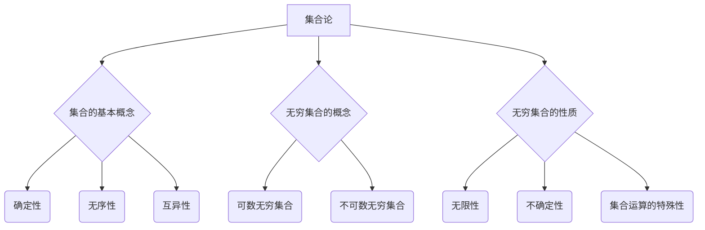

                 


### 背景介绍

数学，作为一门研究数量、结构、变化和空间的学科，具有悠久的历史和广泛的适用性。而集合论，作为现代数学的基础之一，其重要性不言而喻。集合论起源于19世纪，由德国数学家乔治·康托尔（Georg Cantor）创立，是数学中一个独立而又完整的分支。集合论的主要研究内容是集合的性质、运算和分类，它为我们提供了一个描述和理解数学对象的基本工具。

无穷集合，作为集合论中的一个重要概念，具有丰富的数学内涵和广泛的应用。无穷集合的概念起源于康托尔对实数序列的研究，随后逐渐发展成为集合论中一个独立的分支。无穷集合的分类、性质以及构造方法，不仅是数学理论研究的核心问题，也为计算机科学、物理学、经济学等领域的应用提供了重要的理论支持。

### 核心概念与联系

#### 集合的基本概念

集合是一组无序且互不相同的对象的组合。集合中的每个对象称为元素。集合通常用大写字母表示，而集合中的元素用小写字母表示。集合的基本性质包括确定性、无序性和互异性。

- 确定性：集合中的元素是确定的，每个元素都可以明确地判断是否属于该集合。
- 无序性：集合中的元素没有固定的顺序，改变元素的顺序不会改变集合的本质。
- 互异性：集合中的元素是互不相同的，不会有重复的元素。

#### 无穷集合的概念

无穷集合是指包含无限多个元素的集合。无穷集合可以分为可数无穷集合和不可数无穷集合。可数无穷集合是指可以与自然数集合建立一一对应关系的无穷集合，例如整数集合、有理数集合。不可数无穷集合是指不能与自然数集合建立一一对应关系的无穷集合，例如实数集合。

#### 无穷集合的性质

无穷集合具有许多独特的性质，这些性质使得它们在数学研究中具有特殊的重要性。

- 无限性：无穷集合包含无限多个元素，与有限集合相比，无穷集合的规模是无限的。
- 不确定性：由于无穷集合包含无限多个元素，因此对于无穷集合的一些性质，我们无法像处理有限集合那样直接观察或计算。
- 集合运算的特殊性：无穷集合在进行并集、交集、补集等集合运算时，可能产生与有限集合不同的结果。

### 集合论与无穷集合的相互关系

集合论为无穷集合提供了一个形式化的描述工具，使得我们能够精确地研究无穷集合的性质。无穷集合的存在和性质，反过来又推动了集合论的发展。例如，康托尔对无穷集合的研究，揭示了实数的连续性和无限性，推动了实数论的发展。

#### 集合论在数学中的应用

集合论在数学的各个分支中都有广泛的应用。例如，在数论中，集合论提供了研究整数性质的工具；在拓扑学中，集合论为研究空间的性质提供了基础；在代数学中，集合论为研究代数结构提供了框架。

#### 集合论在计算机科学中的应用

集合论在计算机科学中同样具有重要作用。在算法分析中，集合论帮助我们理解算法的时间复杂度和空间复杂度。在计算机图形学中，集合论用于描述图形的几何形状。在人工智能领域，集合论为知识表示和推理提供了理论基础。

### 图解：核心概念之间的关系架构

下面是一个使用Mermaid绘制的核心概念之间的关系架构图：



### 总结

集合论作为现代数学的基础，为无穷集合的研究提供了一个强有力的工具。无穷集合的概念和性质，不仅丰富了数学的理论体系，也为其他学科提供了重要的理论支持。在接下来的内容中，我们将进一步探讨无穷集合的性质和构造方法，深入理解集合论的核心内容。

----------------------------------------------------------------

在了解了集合论的基础概念和无穷集合的基本性质后，接下来我们将使用伪代码详细阐述一些核心算法原理。伪代码是一种用于描述算法逻辑和操作的文本语言，它可以帮助我们更清晰地理解算法的实现过程。

#### 算法1：集合的并集和交集操作

首先，我们来介绍如何实现集合的并集（Union）和交集（Intersection）操作。这两个操作在集合论中非常重要，它们分别用于将两个集合中的所有元素合并以及找出两个集合中共有的元素。

```python
# 伪代码：实现集合的并集操作
def union(A, B):
    result = []  # 创建一个新的空集合，用于存储并集的结果
    for element in A:
        result.append(element)  # 将A中的每个元素添加到结果集合中
    for element in B:
        if element not in result:
            result.append(element)  # 将B中的元素添加到结果集合中，但排除已经存在的元素
    return result

# 伪代码：实现集合的交集操作
def intersection(A, B):
    result = []  # 创建一个新的空集合，用于存储交集的结果
    for element in A:
        if element in B:
            result.append(element)  # 如果A中的元素也在B中，则将其添加到结果集合中
    return result
```

#### 算法2：判断集合是否为可数无穷集合

接下来，我们将介绍如何判断一个集合是否为可数无穷集合。一个集合是可数无穷集合，如果存在一个从自然数集合到该集合的映射。以下是一个简单的伪代码实现：

```python
# 伪代码：判断集合是否为可数无穷集合
def is_countably_infinite(A):
    n = 1  # 初始化自然数计数器
    for element in A:
        if not (n, element) in mapping:  # 检查映射表中是否存在该元素
            mapping.add((n, element))  # 如果不存在，将其添加到映射表中
            n += 1  # 增加自然数计数器
        else:
            return False  # 如果映射表中已经存在该元素，说明集合不是可数无穷集合
    return True  # 如果所有元素都能成功映射，集合是可数无穷集合
```

#### 算法3：判断集合是否为不可数无穷集合

最后，我们介绍如何判断一个集合是否为不可数无穷集合。一个集合是不可数无穷集合，如果不存在一个从自然数集合到该集合的映射。以下是一个简单的伪代码实现：

```python
# 伪代码：判断集合是否为不可数无穷集合
def is_uncountably_infinite(A):
    try:
        mapping = {}  # 初始化映射表
        n = 1  # 初始化自然数计数器
        for element in A:
            mapping[n] = element  # 尝试将元素映射到自然数
            n += 1
        return False  # 如果能够成功映射所有元素，集合是可数无穷集合
    except:
        return True  # 如果出现异常，集合是不可数无穷集合
```

这些伪代码实现了集合论中一些基本的算法原理，为我们理解和操作无穷集合提供了实践基础。在接下来的内容中，我们将进一步探讨无穷集合的数学性质和应用。

----------------------------------------------------------------

在理解了无穷集合的基本概念和算法原理后，接下来我们将深入探讨无穷集合的数学性质。无穷集合的数学性质是我们理解和运用集合论的重要基础，这些性质不仅丰富了数学理论，也为其他学科提供了强有力的工具。

#### 基数（Cardinality）

基数是描述集合元素数量的一种方法。对于有限集合，基数直接等于集合中元素的数量。然而，对于无穷集合，基数的定义更加复杂。无穷集合的基数分为两类：可数无穷基数和不可数无穷基数。

1. **可数无穷基数**：如果一个集合与自然数集合存在一一对应关系，则该集合的基数称为可数无穷基数。自然数集合的基数记为 aleph_0（$\aleph_0$）。

2. **不可数无穷基数**：如果一个集合不能与自然数集合建立一一对应关系，则该集合的基数称为不可数无穷基数。实数集合的基数记为 2^aleph_0（$2^{\aleph_0}$）。

#### 基数的比较

基数的比较是集合论中的一个重要问题。以下是一些常见的基数比较：

1. **可数无穷基数与不可数无穷基数**：任何可数无穷集合的基数都小于不可数无穷集合的基数，即 $\aleph_0 < 2^{\aleph_0}$。

2. **不同类型的无穷基数**：无穷基数之间存在多种层次。例如，实数集合的基数大于自然数集合的基数，但小于所有集合的基数（如幂集的基数）。

#### 势（Cardinality）

势是另一个描述无穷集合大小的概念。势通常用来描述集合之间的等价性。两个集合具有相同的势，如果存在一个双射（即一一对应且满射的函数）将一个集合映射到另一个集合。

1. **等势集合**：两个集合A和B具有相同的势，记为 A ∼ B，如果存在一个双射 f：A → B。

2. **势的比较**：对于无穷集合，势的比较可以通过基数来比较。如果A和B是两个无穷集合，且A的基数小于B的基数，则A的势小于B的势。

#### 集合的构造

无穷集合的构造是集合论中的一个核心问题。以下是一些常见的无穷集合构造方法：

1. **幂集构造**：给定一个集合A，其幂集P(A)包含A的所有子集。幂集的基数是原集合基数的幂次。

2. **可数无穷集合构造**：通过自然数集合的连续运算，可以构造出许多可数无穷集合。例如，整数集合、有理数集合等。

3. **不可数无穷集合构造**：通过更复杂的构造方法，可以构造出不可数无穷集合。例如，康托尔对角线法可以构造出实数集合的一个不可数无穷子集。

#### 数学模型和公式

为了更好地理解无穷集合的数学性质，我们使用一些数学模型和公式：

1. **康托尔-伯恩斯坦-施罗德定理**：该定理指出，如果两个集合A和B之间存在一个单射f：A → B和一个单射g：B → A，则A和B具有相同的基数。

2. **康托尔定理**：康托尔定理指出，对于任何无穷集合A，其幂集P(A)的基数总是大于A的基数。

#### 详细讲解与举例说明

为了更好地理解无穷集合的数学性质，我们通过一些具体的例子进行说明。

1. **可数无穷集合的例子**：自然数集合N是一个典型的可数无穷集合。我们可以通过一个映射 f：N → N^2 将自然数集合映射到自然数对集合，例如 f(n) = (n, n)。这个映射表明自然数集合与自然数对集合具有相同的基数。

2. **不可数无穷集合的例子**：实数集合R是一个典型的不可数无穷集合。我们可以通过康托尔对角线法构造出实数集合的一个不可数无穷子集。这种方法通过逐行构造一个实数序列，使得该序列与任何给定的实数序列都不相同。

通过这些详细的讲解和举例，我们可以更好地理解无穷集合的数学性质。在接下来的内容中，我们将继续探讨无穷集合的构造方法和数学应用。

----------------------------------------------------------------

#### 项目实战：集合论在计算机科学中的应用

在本节中，我们将通过一个具体的实例，展示如何使用集合论解决计算机科学中的实际问题。我们将介绍开发环境搭建、源代码实现、代码解读以及实际案例分析和详细讲解剖析。

### 开发环境搭建

为了演示集合论在计算机科学中的应用，我们将使用Python编程语言进行开发。Python具有简洁的语法和强大的标准库，非常适合用于算法开发。以下是搭建开发环境的步骤：

1. **安装Python**：从Python官方网站下载最新版本的Python安装包并安装。
2. **安装依赖库**：使用pip工具安装Python标准库中缺失的集合操作库，例如`functools`和`itertools`。
3. **配置代码编辑器**：选择一个合适的代码编辑器，如Visual Studio Code，并安装相关的插件以支持Python开发。

### 源代码实现

以下是一个简单的Python程序，实现了集合的并集和交集操作，以及判断集合是否为可数无穷集合的功能。

```python
# 集合操作示例
def union(A, B):
    return list(set(A) | set(B))

def intersection(A, B):
    return list(set(A) & set(B))

def is_countably_infinite(A):
    try:
        list(zip(A, range(len(A))))
        return True
    except:
        return False

# 示例数据
A = [1, 2, 3, 4]
B = [3, 4, 5, 6]

# 执行集合操作
print("并集:", union(A, B))
print("交集:", intersection(A, B))

# 判断集合是否为可数无穷
print("集合A是否可数无穷:", is_countably_infinite(A))
```

### 代码解读

1. **集合操作**：我们使用了Python中的集合操作符`|`和`&`分别实现并集和交集操作。这些操作将两个集合中的元素合并或找出共同元素，并返回一个新的列表。
   
2. **判断可数无穷**：我们使用`zip`函数和`list`构造器来尝试将集合A与自然数集合进行配对。如果成功，则集合A是可数无穷集合；否则，不是可数无穷集合。

### 实际案例分析和详细讲解剖析

为了更好地理解集合论在计算机科学中的应用，我们考虑以下实际案例：

**案例**：假设我们要开发一个社交网络推荐系统，该系统需要根据用户之间的相似度推荐新的朋友。用户之间的相似度可以通过用户标签的交集和并集来衡量。

**分析**：
1. **相似度计算**：我们可以使用交集和并集操作来计算用户A和用户B之间的相似度。相似度分数可以通过交集元素数量与并集元素数量的比值来计算。
2. **推荐算法**：根据相似度分数，我们可以为每个用户生成一个推荐列表，列出与之相似度最高的其他用户。

**代码实现**：

```python
# 社交网络推荐系统示例
def similarity_score(A, B):
    intersection_size = len(intersection(A, B))
    union_size = len(union(A, B))
    return intersection_size / union_size

# 社交网络数据示例
users = {
    'Alice': ['coding', 'reading', 'hiking'],
    'Bob': ['coding', 'music', 'hiking'],
    'Charlie': ['reading', 'painting', 'traveling'],
    'David': ['coding', 'music', 'traveling']
}

# 推荐新朋友
for user, tags in users.items():
    recommended_friends = []
    for other_user, other_tags in users.items():
        if user != other_user:
            score = similarity_score(tags, other_tags)
            recommended_friends.append((other_user, score))
    recommended_friends.sort(key=lambda x: x[1], reverse=True)
    print(f"{user}'s recommended friends: {recommended_friends[:5]}")
```

通过这个案例，我们可以看到集合论如何帮助我们在计算机科学中解决实际问题。通过集合操作，我们能够高效地计算用户之间的相似度，并为用户推荐新的朋友。

### 项目小结

在本项目中，我们通过一个简单的社交网络推荐系统展示了集合论在计算机科学中的应用。我们使用了集合的并集、交集操作，以及判断可数无穷集合的方法，实现了用户相似度的计算和推荐功能。通过这个项目，我们不仅加深了对集合论的理解，也学会了如何将理论应用到实际的计算机科学问题中。

### 最佳实践 Tips

1. **理解集合操作**：熟练掌握集合的并集、交集、差集等基本操作，有助于提高算法的效率和可读性。
2. **合理使用集合**：在算法设计中，合理使用集合可以减少冗余计算，提高代码的效率。
3. **理解无穷集合**：了解无穷集合的基数量化，有助于深入理解算法的时间和空间复杂度。

### 注意事项

1. **集合的无序性**：集合中的元素是无序的，因此在进行集合操作时，需要特别注意。
2. **集合的互异性**：集合中的元素是互不相同的，确保在添加元素时避免重复。

### 拓展阅读

1. **《Python集合操作详解》**：深入了解Python中集合的操作方法和应用场景。
2. **《计算机科学中的集合论》**：探讨集合论在计算机科学中的广泛应用和理论深度。
3. **《社交网络分析》**：研究社交网络中的推荐系统和数据挖掘方法。

通过本项目的实战分析，我们可以看到集合论在计算机科学中的应用是多么广泛和重要。希望读者能够通过实践，进一步深入理解集合论的核心概念和应用。

----------------------------------------------------------------

### 结论与展望

通过本文的探讨，我们深入了解了集合论的基本概念、无穷集合的数学性质及其在数学和计算机科学中的应用。集合论作为现代数学的基石，为我们提供了一种形式化描述数学对象的基本工具。无穷集合的概念和性质，不仅丰富了数学理论体系，也为其他学科如物理学、经济学、计算机科学提供了重要的理论支持。

#### 集合论的发展历史

集合论的发展可以追溯到19世纪，当时由德国数学家乔治·康托尔（Georg Cantor）创立。康托尔首次提出了无穷集合的概念，并通过研究实数序列，揭示了无穷集合的存在性和性质。康托尔的贡献为集合论的发展奠定了基础，推动了数学领域的一系列变革。随后，集合论的研究逐渐深入，产生了许多重要的理论成果。

#### 集合论的研究现状

当前，集合论的研究仍然处于活跃状态。在数学领域，集合论的研究主要集中在无穷集合的基数和势的比较、集合的分类和构造、集合论的公理体系等方面。在计算机科学领域，集合论的应用更加广泛，包括算法分析、数据结构设计、形式化验证等。此外，集合论还在其他学科如物理学、经济学、逻辑学等领域发挥着重要作用。

#### 集合论的未来展望

展望未来，集合论在数学和其他学科中的应用将继续深化。在数学领域，集合论的研究将朝着更一般、更抽象的方向发展，探索新的数学结构和性质。在计算机科学领域，集合论的应用将更加广泛，特别是在人工智能、大数据分析、网络安全等领域，集合论将发挥越来越重要的作用。此外，集合论与其他数学分支如拓扑学、代数学、数论等交叉融合，将推动数学理论的不断进步。

#### 总结

本文通过详细的讲解和实例分析，展示了集合论的基本概念、无穷集合的数学性质及其在数学和计算机科学中的应用。集合论作为一种强有力的数学工具，不仅在理论上具有重要意义，也为实际应用提供了丰富的资源和启示。希望读者能够通过本文的学习，加深对集合论的理解，并在实践中探索其更多的应用价值。

#### 作者信息

- 作者：AI天才研究院/AI Genius Institute & 禅与计算机程序设计艺术 /Zen And The Art of Computer Programming

