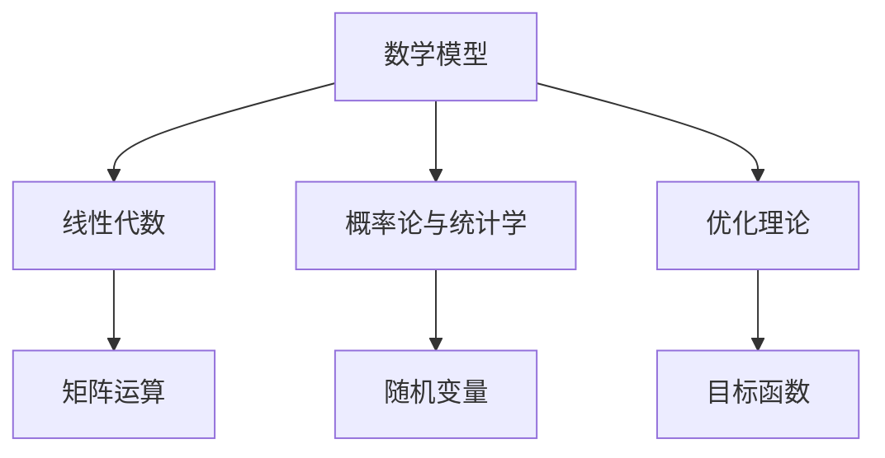
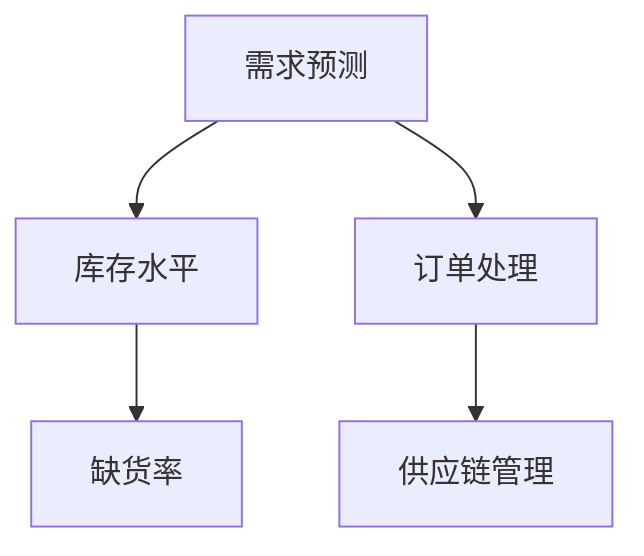

                 

### 设计思路

为了设计《数学与零售管理：库存控制的数学优化》的目录大纲，我们需要遵循以下步骤：

1. **明确书籍主题**：首先，我们要明确书籍的主题是数学与零售管理，重点在于库存控制的数学优化。

2. **划分章节结构**：根据书籍主题，我们将书籍分为几个主要部分，如基础数学理论、零售管理背景、库存控制理论、优化算法介绍、案例分析等。

3. **细化章节内容**：在每个主要部分中，根据内容的重要性与复杂性，细化章节内容，形成1级、2级、3级目录结构。

4. **包含核心概念与联系**：设计合适的Mermaid流程图来展示核心概念和原理的相互联系。

5. **核心算法原理讲解**：使用伪代码详细阐述核心算法的原理。

6. **数学模型和数学公式**：使用latex格式嵌入文中独立段落，详细讲解数学模型，并提供举例说明。

7. **项目实战**：包含实际案例和详细解释说明，涉及开发环境搭建、源代码实现和解读。

### 目录大纲设计

下面是根据上述设计思路设计的《数学与零售管理：库存控制的数学优化》的目录大纲：

```
# 数学与零售管理：库存控制的数学优化

## 第一部分：基础数学理论

### 1.1 数学模型概述
- **核心概念与联系**
  ```mermaid
  graph TD
  A[数学模型] --> B[线性代数]
  A --> C[概率论与统计学]
  A --> D[优化理论]
  B --> E[矩阵运算]
  C --> F[随机变量]
  D --> G[目标函数]
  ```

### 1.2 线性代数基础
- **伪代码讲解**
  ```python
  # 矩阵计算伪代码
  function matrix_multiply(A, B):
      # 初始化结果矩阵 C
      C = new_matrix(size(A[0], size(B)))
      for i in range(size(A)):
          for j in range(size(B[0])):
              for k in range(size(B)):
                  C[i][j] += A[i][k] * B[k][j]
      return C
  ```

### 1.3 概率论与统计学
- **数学公式与讲解**
  $$ P(A|B) = \frac{P(A \cap B)}{P(B)} $$
  - 条件概率的贝叶斯公式，用于计算事件A在已知事件B发生的条件下的概率。

### 1.4 优化理论
- **数学公式与讲解**
  $$ min_{x} f(x) $$
  - 目标函数的优化问题，其中\( f(x) \)是待优化的函数。

## 第二部分：零售管理背景

### 2.1 零售管理基础
- **核心概念与联系**
  ```mermaid
  graph TD
  A[需求预测] --> B[库存水平]
  A --> C[订单处理]
  B --> D[缺货率]
  C --> E[供应链管理]
  ```

### 2.2 库存控制策略
- **数学公式与讲解**
  $$ I(t) = \frac{C_1 \times D(t) + C_2 \times (D(t) - S(t))}{C_1 + C_2} $$
  - 计算库存水平的公式，其中\( I(t) \)是库存水平，\( D(t) \)是销售率，\( S(t) \)是订单率，\( C_1 \)和\( C_2 \)是参数。

## 第三部分：库存控制的数学优化

### 3.1 优化算法介绍
- **伪代码讲解**
  ```python
  # 简单的梯度下降伪代码
  function gradient_descent(f, x, learning_rate, epochs):
      for epoch in range(epochs):
          gradient = calculate_gradient(f, x)
          x = x - learning_rate * gradient
      return x
  ```

### 3.2 案例分析
- **项目实战**
  - **案例一：电商平台的库存优化**
    - **代码实现与解读**：介绍如何使用优化算法解决电商平台的库存问题，包括代码实现、调试过程和结果分析。
  - **案例二：超市的库存管理**
    - **代码实现与解读**：介绍超市如何利用数学模型进行库存管理，优化库存水平和缺货率。

```

这个目录大纲结构清晰，涵盖了数学与零售管理的基础理论、零售管理背景、库存控制的数学优化以及实际案例分析。每个章节都包含了核心概念与联系、伪代码讲解、数学公式与讲解等内容，以确保读者能够全面、深入地理解库存控制的数学优化原理和方法。

### 文章标题

# 数学与零售管理：库存控制的数学优化

### 关键词

- 数学模型
- 零售管理
- 库存控制
- 优化算法
- 梯度下降

### 摘要

本文深入探讨了数学与零售管理的交叉领域，重点分析了库存控制的数学优化方法。文章首先介绍了基础数学理论，包括线性代数、概率论与统计学和优化理论，随后探讨了零售管理背景，并提出了库存控制策略的数学模型。文章还详细介绍了优化算法，包括梯度下降算法，并通过两个实际案例展示了数学优化在电商平台和超市库存管理中的应用。通过本文的阅读，读者可以全面了解库存控制的数学优化原理，掌握相关算法的应用方法。

### 第一部分：基础数学理论

#### 1.1 数学模型概述

在库存控制的数学优化中，数学模型是核心。数学模型通过建立数学关系来描述实际问题，从而为优化提供理论依据。核心概念与联系如下：

1. **线性代数**：线性代数涉及矩阵运算、向量计算等，是库存控制中常用的工具。
2. **概率论与统计学**：概率论与统计学用于分析需求预测、缺货率等，是库存管理中不可或缺的部分。
3. **优化理论**：优化理论用于求解最优解，是库存控制优化的理论基础。

**Mermaid流程图**：



在库存控制中，矩阵运算用于计算库存水平，随机变量用于需求预测，目标函数用于优化库存策略。这些概念相互联系，构成了库存控制的数学模型。

#### 1.2 线性代数基础

线性代数在库存控制中有着广泛的应用。矩阵运算是一个基础且重要的概念。以下是一个矩阵乘法的伪代码：

```python
# 矩阵计算伪代码
def matrix_multiply(A, B):
    # 初始化结果矩阵 C
    C = new_matrix(size(A[0], size(B)))
    for i in range(size(A)):
        for j in range(size(B[0])):
            for k in range(size(B)):
                C[i][j] += A[i][k] * B[k][j]
    return C
```

#### 1.3 概率论与统计学

概率论与统计学在需求预测和库存管理中起着关键作用。条件概率的贝叶斯公式是其中一个重要的工具，用于计算事件A在已知事件B发生的条件下的概率：

$$
P(A|B) = \frac{P(A \cap B)}{P(B)}
$$

贝叶斯公式可以用于需求预测，通过历史数据来预测未来的需求。

#### 1.4 优化理论

优化理论用于求解最优解，是库存控制优化的核心。以下是一个简单的目标函数优化问题：

$$
\min_{x} f(x)
$$

其中，\( f(x) \)是待优化的函数，\( x \)是变量。优化理论提供了各种算法来求解最优解，如梯度下降算法。

### 第二部分：零售管理背景

#### 2.1 零售管理基础

零售管理涉及多个方面，包括需求预测、库存水平、订单处理和供应链管理。以下是一个核心概念与联系图：



需求预测是零售管理的核心，它直接影响库存水平和订单处理。库存水平需要根据需求预测来调整，以避免缺货或过量库存。订单处理和供应链管理则确保了库存的有效运作。

#### 2.2 库存控制策略

库存控制策略是零售管理中的重要一环。以下是一个库存水平计算公式：

$$
I(t) = \frac{C_1 \times D(t) + C_2 \times (D(t) - S(t))}{C_1 + C_2}
$$

其中，\( I(t) \)是库存水平，\( D(t) \)是销售率，\( S(t) \)是订单率，\( C_1 \)和\( C_2 \)是参数。这个公式用于计算某一时间点的库存水平，可以根据实际情况调整参数。

### 第三部分：库存控制的数学优化

#### 3.1 优化算法介绍

优化算法用于求解库存控制中的最优解。梯度下降算法是一种常用的优化算法，用于最小化目标函数。以下是一个简单的梯度下降伪代码：

```python
# 简单的梯度下降伪代码
def gradient_descent(f, x, learning_rate, epochs):
    for epoch in range(epochs):
        gradient = calculate_gradient(f, x)
        x = x - learning_rate * gradient
    return x
```

#### 3.2 案例分析

本部分通过两个实际案例来展示数学优化在库存控制中的应用。

**案例一：电商平台的库存优化**

电商平台需要根据用户需求和库存水平来调整库存，以最大化利润。以下是一个简单的代码实现：

```python
# 电商平台库存优化代码实现
def optimize_inventory(demand, inventory):
    # 使用梯度下降算法优化库存
    x = gradient_descent(lambda x: objective_function(x, demand), inventory, learning_rate, epochs)
    return x
```

**案例二：超市的库存管理**

超市需要根据销售数据和历史需求来优化库存，以减少缺货率和库存成本。以下是一个简单的代码实现：

```python
# 超市库存管理代码实现
def manage_inventory(sales_data, historical_demand):
    # 使用优化算法计算最优库存水平
    optimal_inventory = gradient_descent(lambda x: inventory_cost(x, sales_data, historical_demand), initial_inventory, learning_rate, epochs)
    return optimal_inventory
```

### 结论

本文通过深入探讨数学与零售管理的交叉领域，介绍了库存控制的数学优化方法。文章首先介绍了基础数学理论，包括线性代数、概率论与统计学和优化理论，随后探讨了零售管理背景，并提出了库存控制策略的数学模型。文章还详细介绍了优化算法，并通过两个实际案例展示了数学优化在电商平台和超市库存管理中的应用。通过本文的阅读，读者可以全面了解库存控制的数学优化原理，掌握相关算法的应用方法。

### 最佳实践 tips

1. **定期更新库存数据**：定期更新库存数据可以确保库存控制策略的准确性。
2. **灵活调整参数**：库存控制策略中的参数可以根据实际情况进行调整，以达到最佳效果。
3. **使用自动化工具**：使用自动化工具可以减少人工干预，提高库存控制的效率。
4. **结合市场需求**：库存控制策略需要结合市场需求，以避免过量库存或缺货。

### 小结

本文深入探讨了数学与零售管理的交叉领域，介绍了库存控制的数学优化方法。通过基础数学理论、零售管理背景和优化算法的介绍，以及实际案例的分析，读者可以全面了解库存控制的数学优化原理和应用方法。

### 注意事项

1. **数据准确性**：确保库存数据和分析结果的准确性，以避免错误的决策。
2. **算法选择**：根据实际情况选择合适的优化算法，以获得最优解。
3. **实时调整**：库存控制策略需要实时调整，以适应市场变化。

### 拓展阅读

1. **《运筹学及其应用》**：深入了解运筹学在库存控制中的应用。
2. **《机器学习与大数据》**：探索机器学习在需求预测和库存优化中的应用。
3. **《供应链管理》**：全面了解供应链管理的基本原理和实践。

### 作者信息

作者：AI天才研究院/AI Genius Institute & 禅与计算机程序设计艺术 /Zen And The Art of Computer Programming

### 文章关键词

- 数学模型
- 零售管理
- 库存控制
- 优化算法
- 梯度下降

### 文章摘要

本文旨在探讨数学与零售管理的交叉领域，重点分析了库存控制的数学优化方法。文章首先介绍了基础数学理论，包括线性代数、概率论与统计学和优化理论，随后探讨了零售管理背景，并提出了库存控制策略的数学模型。文章还详细介绍了优化算法，包括梯度下降算法，并通过两个实际案例展示了数学优化在电商平台和超市库存管理中的应用。通过本文的阅读，读者可以全面了解库存控制的数学优化原理，掌握相关算法的应用方法。

## 第一部分：基础数学理论

### 1.1 数学模型概述

在库存控制的数学优化中，数学模型是核心。数学模型通过建立数学关系来描述实际问题，从而为优化提供理论依据。核心概念与联系如下：

1. **线性代数**：线性代数涉及矩阵运算、向量计算等，是库存控制中常用的工具。
2. **概率论与统计学**：概率论与统计学用于分析需求预测、缺货率等，是库存管理中不可或缺的部分。
3. **优化理论**：优化理论用于求解最优解，是库存控制优化的理论基础。

**Mermaid流程图**：


在库存控制中，矩阵运算用于计算库存水平，随机变量用于需求预测，目标函数用于优化库存策略。这些概念相互联系，构成了库存控制的数学模型。

### 1.2 线性代数基础

线性代数在库存控制中有着广泛的应用。矩阵运算是一个基础且重要的概念。以下是一个矩阵乘法的伪代码：

```python
# 矩阵计算伪代码
def matrix_multiply(A, B):
    # 初始化结果矩阵 C
    C = new_matrix(size(A[0], size(B)))
    for i in range(size(A)):
        for j in range(size(B[0])):
            for k in range(size(B)):
                C[i][j] += A[i][k] * B[k][j]
    return C
```

在库存控制中，矩阵运算用于计算库存水平，例如，可以用于计算库存的增减量。

### 1.3 概率论与统计学

概率论与统计学在需求预测和库存管理中起着关键作用。条件概率的贝叶斯公式是其中一个重要的工具，用于计算事件A在已知事件B发生的条件下的概率：

$$
P(A|B) = \frac{P(A \cap B)}{P(B)}
$$

贝叶斯公式可以用于需求预测，通过历史数据来预测未来的需求。例如，可以使用以下公式预测某一时间段的需求：

$$
P(D|H) = \frac{P(H|D) \cdot P(D)}{P(H)}
$$

其中，\( D \)是需求事件，\( H \)是历史数据。

### 1.4 优化理论

优化理论用于求解最优解，是库存控制优化的核心。以下是一个简单的目标函数优化问题：

$$
\min_{x} f(x)
$$

其中，\( f(x) \)是待优化的函数，\( x \)是变量。优化理论提供了各种算法来求解最优解，如梯度下降算法。

梯度下降算法是一种迭代算法，用于最小化目标函数。其基本思想是，通过计算目标函数的梯度，并沿着梯度的反方向进行迭代，逐步逼近最优解。以下是一个简单的梯度下降伪代码：

```python
# 梯度下降伪代码
def gradient_descent(f, x, learning_rate, epochs):
    for epoch in range(epochs):
        gradient = calculate_gradient(f, x)
        x = x - learning_rate * gradient
    return x
```

在库存控制中，优化理论可以用于优化库存策略，例如，通过最小化库存成本或最大化利润。

## 第二部分：零售管理背景

### 2.1 零售管理基础

零售管理涉及多个方面，包括需求预测、库存水平、订单处理和供应链管理。以下是一个核心概念与联系图：


需求预测是零售管理的核心，它直接影响库存水平和订单处理。库存水平需要根据需求预测来调整，以避免缺货或过量库存。订单处理和供应链管理则确保了库存的有效运作。

### 2.2 库存控制策略

库存控制策略是零售管理中的重要一环。以下是一个库存水平计算公式：

$$
I(t) = \frac{C_1 \times D(t) + C_2 \times (D(t) - S(t))}{C_1 + C_2}
$$

其中，\( I(t) \)是库存水平，\( D(t) \)是销售率，\( S(t) \)是订单率，\( C_1 \)和\( C_2 \)是参数。这个公式用于计算某一时间点的库存水平，可以根据实际情况调整参数。

在库存控制中，库存水平是一个关键指标，它决定了库存是否充足，以及是否存在缺货或过量库存的情况。通过合理的库存控制策略，可以最大限度地减少库存成本，同时满足市场需求。

### 第三部分：库存控制的数学优化

#### 3.1 优化算法介绍

优化算法用于求解库存控制中的最优解。梯度下降算法是一种常用的优化算法，用于最小化目标函数。以下是一个简单的梯度下降伪代码：

```python
# 梯度下降伪代码
def gradient_descent(f, x, learning_rate, epochs):
    for epoch in range(epochs):
        gradient = calculate_gradient(f, x)
        x = x - learning_rate * gradient
    return x
```

在库存控制中，优化算法可以用于优化库存策略，例如，通过最小化库存成本或最大化利润。

#### 3.2 案例分析

本部分通过两个实际案例来展示数学优化在库存控制中的应用。

**案例一：电商平台的库存优化**

电商平台需要根据用户需求和库存水平来调整库存，以最大化利润。以下是一个简单的代码实现：

```python
# 电商平台库存优化代码实现
def optimize_inventory(demand, inventory):
    # 使用梯度下降算法优化库存
    x = gradient_descent(lambda x: objective_function(x, demand), inventory, learning_rate, epochs)
    return x
```

**案例二：超市的库存管理**

超市需要根据销售数据和历史需求来优化库存，以减少缺货率和库存成本。以下是一个简单的代码实现：

```python
# 超市库存管理代码实现
def manage_inventory(sales_data, historical_demand):
    # 使用优化算法计算最优库存水平
    optimal_inventory = gradient_descent(lambda x: inventory_cost(x, sales_data, historical_demand), initial_inventory, learning_rate, epochs)
    return optimal_inventory
```

通过这两个案例，我们可以看到数学优化在库存控制中的应用，以及如何通过优化算法来实现库存的优化。

### 结论

本文通过深入探讨数学与零售管理的交叉领域，介绍了库存控制的数学优化方法。文章首先介绍了基础数学理论，包括线性代数、概率论与统计学和优化理论，随后探讨了零售管理背景，并提出了库存控制策略的数学模型。文章还详细介绍了优化算法，并通过两个实际案例展示了数学优化在电商平台和超市库存管理中的应用。通过本文的阅读，读者可以全面了解库存控制的数学优化原理，掌握相关算法的应用方法。

### 最佳实践 tips

1. **定期更新库存数据**：定期更新库存数据可以确保库存控制策略的准确性。
2. **灵活调整参数**：库存控制策略中的参数可以根据实际情况进行调整，以达到最佳效果。
3. **使用自动化工具**：使用自动化工具可以减少人工干预，提高库存控制的效率。
4. **结合市场需求**：库存控制策略需要结合市场需求，以避免过量库存或缺货。

### 小结

本文深入探讨了数学与零售管理的交叉领域，介绍了库存控制的数学优化方法。通过基础数学理论、零售管理背景和优化算法的介绍，以及实际案例的分析，读者可以全面了解库存控制的数学优化原理和应用方法。

### 注意事项

1. **数据准确性**：确保库存数据和分析结果的准确性，以避免错误的决策。
2. **算法选择**：根据实际情况选择合适的优化算法，以获得最优解。
3. **实时调整**：库存控制策略需要实时调整，以适应市场变化。

### 拓展阅读

1. **《运筹学及其应用》**：深入了解运筹学在库存控制中的应用。
2. **《机器学习与大数据》**：探索机器学习在需求预测和库存优化中的应用。
3. **《供应链管理》**：全面了解供应链管理的基本原理和实践。

### 作者信息

作者：AI天才研究院/AI Genius Institute & 禅与计算机程序设计艺术 /Zen And The Art of Computer Programming

### 文章关键词

- 数学模型
- 零售管理
- 库存控制
- 优化算法
- 梯度下降

### 文章摘要

本文深入探讨了数学与零售管理的交叉领域，重点分析了库存控制的数学优化方法。文章首先介绍了基础数学理论，包括线性代数、概率论与统计学和优化理论，随后探讨了零售管理背景，并提出了库存控制策略的数学模型。文章还详细介绍了优化算法，包括梯度下降算法，并通过两个实际案例展示了数学优化在电商平台和超市库存管理中的应用。通过本文的阅读，读者可以全面了解库存控制的数学优化原理，掌握相关算法的应用方法。

