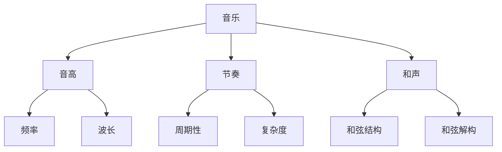
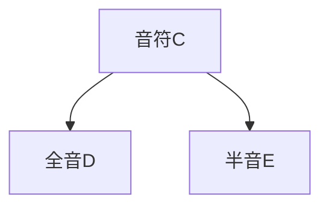
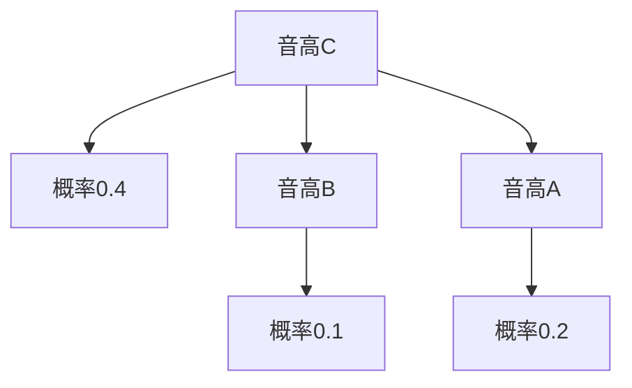
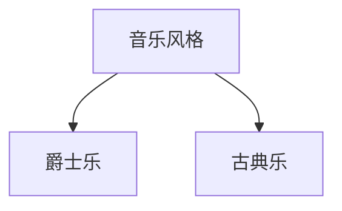

                 

### 引言与概述

在人类的文化遗产中，音乐和数学都占据了独特的位置。音乐作为一种艺术形式，能够引发人们的情感共鸣，塑造文化认同，而数学作为一种科学工具，则用于解释自然现象和构建理论体系。尽管它们看似截然不同，但数学与音乐之间却存在着深层次的联系。

#### 历史背景

自古以来，数学家们一直在探索如何用数学的方法来描述音乐现象。古希腊哲学家毕达哥拉斯就发现了音程与数学比例之间的关系，这一发现奠定了音乐与数学结合的基石。在中世纪和文艺复兴时期，数学家们继续深入研究音乐理论，发展了音程、和弦和音阶等概念。

#### 应用价值

在现代，数学在音乐心理学中的应用日益广泛。通过数学模型，我们可以更深入地理解音乐感知的机制，从而设计出更加精确的音乐分析工具，甚至可以开发出能够创作音乐的算法。例如，音乐生成算法可以根据数学规则创造出新颖的音乐作品，而音乐识别算法则可以用于自动分类和分析音乐。

#### 音乐感知的基本概念

音乐感知是指人类对音乐的感知和理解能力，包括对音高、节奏、和声等多个维度的感知。在数学的框架下，我们可以将音乐感知分解为不同的数学模型，以便更准确地描述和理解这些感知过程。

### 核心概念与联系

为了更好地理解数学与音乐心理学之间的联系，我们可以用 Mermaid 流程图来展示核心概念之间的关系架构：



在这个流程图中，音乐作为整体概念，涵盖了音高、节奏和和声三个基本维度。每个维度都可以进一步细分为具体的数学模型，如音高的频率和波长、节奏的周期性和复杂度、和声的和弦结构和解构。

### 结论

通过上述介绍，我们可以看到数学与音乐心理学之间存在着紧密的联系。数学为音乐心理学提供了强大的工具，使得我们可以从更精确的视角来理解音乐现象。本文将深入探讨这一领域的各个方面，从数学模型到实际应用，帮助读者更好地理解这一交叉学科。

---

关键词：数学，音乐心理学，音乐感知，音高，节奏，和声

摘要：本文旨在探讨数学与音乐心理学之间的联系，介绍数学在音乐感知中的应用，并通过具体模型和实例，展示如何使用数学方法来理解和分析音乐现象。通过本文的阅读，读者将了解数学在音乐心理学中的重要性，以及如何将数学知识应用于音乐创作和分析中。## 数学在音乐心理学中的应用

数学作为一种精确的语言，为音乐心理学提供了强大的工具，帮助我们更好地理解音乐感知和音乐创作。在这部分，我们将探讨集合论、概率论和模态分析在音乐心理学中的应用。

#### 集合论与音乐结构

集合论是数学的基础，它用于描述和分析对象集合及其之间的关系。在音乐中，集合论可以用于描述音符、音程和和弦等音乐元素。

- **音符与集合**：音符是音乐的基本单元，可以看作是一个集合中的元素。例如，C、D、E等音符构成了一个集合。

- **音程与集合**：音程是两个音符之间的距离，可以表示为集合中的关系。例如，C到D是一个全音，C到E是一个全音加半音。



#### 概率论与音乐随机性

概率论用于描述不确定性和随机性。在音乐中，概率论可以用于分析音高的概率分布和节奏的概率分布。

- **音高概率分布**：音高可以看作是一个随机变量，不同的音高出现的概率可能不同。例如，C音可能是最常见的音高，而B音可能出现的概率较低。

- **节奏概率分布**：节奏是音乐的时间结构，不同的节奏模式出现的概率也可能不同。例如，慢节奏和快节奏在不同的音乐风格中出现的概率可能不同。



#### 模态分析与音乐模式识别

模态分析是一种用于识别和分类的数学方法。在音乐中，模态分析可以用于识别不同的音乐模态和音乐风格。

- **音乐模态分类**：不同的音乐风格可以被分类为不同的模态。例如，爵士乐和古典乐可以被看作是不同的模态。

- **音乐风格识别**：通过分析音乐的特征，如音高、节奏和和声，我们可以识别出不同的音乐风格。



### 实际案例

为了更好地理解这些数学方法在音乐心理学中的应用，我们可以看一些实际的案例。

- **音符识别系统**：使用集合论来识别音乐中的音符。例如，通过分析音乐信号，我们可以将音符识别为C、D、E等。

- **节奏分析软件**：使用概率论来分析音乐的节奏模式。例如，通过分析大量的音乐数据，我们可以得出不同节奏模式的出现概率，并据此分析一首新的音乐的节奏特点。

- **音乐风格分类器**：使用模态分析来识别音乐风格。例如，通过分析一首音乐的音高、节奏和和声，我们可以将其分类为爵士乐、古典乐或流行乐。

### 结论

通过集合论、概率论和模态分析，数学为音乐心理学提供了强大的工具，帮助我们更好地理解音乐现象。这些数学方法不仅有助于我们分析音乐，还可以用于音乐创作和音乐生成。在接下来的章节中，我们将进一步探讨音乐感知的数学模型，以及如何使用数学方法来描述音乐感知的过程。## 音乐感知的数学模型

音乐感知是人们在听音乐时对声音的感知和理解过程。这个过程涉及多个维度，包括音高、节奏和和声等。为了更好地理解音乐感知，我们可以使用数学模型来描述这些维度。在本节中，我们将探讨音乐感知的心理模型，并引入相应的数学描述。

### 音乐感知的心理模型

1. **音高感知模型**：音高是指声音的高低，由声音的频率决定。音高感知模型主要描述人们对不同频率声音的感知。

2. **节奏感知模型**：节奏是指音乐的时间结构，由节拍和拍号决定。节奏感知模型主要描述人们对不同节奏模式的感知。

3. **和声感知模型**：和声是指多个音符同时发声的效果，由和弦结构决定。和声感知模型主要描述人们对不同和弦结构的感知。

### 音高感知的数学描述

音高感知可以通过频率和波长来描述。频率是指每秒振动的次数，以赫兹（Hz）为单位。波长是指声波在单位时间内传播的距离。

- **频率**：音高与频率的关系可以用以下公式表示：
  $$ f = \frac{c}{\lambda} $$
  其中，f是频率，c是声速，λ是波长。

- **波长**：波长与频率的关系可以用以下公式表示：
  $$ \lambda = \frac{c}{f} $$

例如，如果声速为340 m/s，那么频率为440 Hz的音高的波长为：
$$ \lambda = \frac{340 \text{ m/s}}{440 \text{ Hz}} = 0.772 \text{ m} $$

### 节奏感知的数学描述

节奏感知可以通过周期性和复杂度来描述。周期性是指音乐节奏的重复模式，复杂度是指节奏模式的多样性。

- **周期性**：周期性可以用以下公式表示：
  $$ T = \frac{1}{f} $$
  其中，T是周期，f是频率。

例如，如果节奏的频率为120 bpm（每分钟120次），那么周期为：
$$ T = \frac{1}{120 \text{ bpm}} = 0.5 \text{ s} $$

- **复杂度**：复杂度可以用以下公式表示：
  $$ C = \frac{\text{不同节奏模式的数量}}{\text{总节奏模式的数量}} $$

例如，如果一首音乐中有10种不同的节奏模式，总共有50种节奏模式，那么复杂度为：
$$ C = \frac{10}{50} = 0.2 $$

### 和声感知的数学描述

和声感知可以通过和弦结构和解构来描述。和弦结构是指和弦的组成音符，解构是指将和弦分解为单个音符。

- **和弦结构**：和弦可以看作是一个集合，包含多个音符。例如，C大调和弦可以表示为{C, E, G}。

- **和弦解构**：和弦解构可以通过音程分析来描述。例如，C大调和弦的解构可以是：
  $$ \text{C（根音）}, \text{E（三音）}, \text{G（五音）} $$

### 总结

音乐感知的数学模型帮助我们更精确地描述人们对音乐的各种感知过程。通过音高、节奏和和声的数学描述，我们可以更深入地理解音乐的本质。在接下来的章节中，我们将继续探讨音乐感知的数学公式，并使用这些公式来分析实际的音乐作品。## 音乐感知的数学公式

在前面的章节中，我们已经介绍了音乐感知的数学模型，包括音高感知模型、节奏感知模型和和声感知模型。在这一章节中，我们将深入探讨这些模型的数学公式，并通过具体示例来展示如何使用这些公式进行音乐分析。

### 音高感知的数学公式

音高感知主要与频率和波长有关。以下是几个关键的数学公式：

1. **频率与波长的关系**：
   $$ f = \frac{c}{\lambda} $$
   其中，f 是频率（Hz），c 是声速（通常取值为 340 m/s），λ 是波长（m）。

2. **波长与频率的关系**：
   $$ \lambda = \frac{c}{f} $$
   这个公式可以帮助我们计算给定频率的声波波长。

**示例**：假设我们有一个频率为 261.6 Hz 的音高，我们可以计算出其波长：
$$ \lambda = \frac{340 \text{ m/s}}{261.6 \text{ Hz}} \approx 1.30 \text{ m} $$

3. **音高与音名的对应关系**：
   音高与音名之间的对应关系可以通过数学公式来描述。例如，A4（标准调音A）的频率为 440 Hz，其他音高的频率可以通过以下公式计算：
   $$ f_n = 440 \times 2^{(n-9)/12} $$
   其中，n 是音名在钢琴键盘上的序号（C为0，C#为1，以此类推，A为9）。

**示例**：计算E5的频率：
$$ f_E = 440 \times 2^{(5-9)/12} \approx 622.25 \text{ Hz} $$

### 节奏感知的数学公式

节奏感知主要涉及周期性和复杂度。以下是几个关键的数学公式：

1. **周期性与频率的关系**：
   $$ T = \frac{1}{f} $$
   其中，T 是周期（s），f 是频率（Hz）。

2. **复杂度的计算**：
   $$ C = \frac{\text{不同节奏模式的数量}}{\text{总节奏模式的数量}} $$
   这个公式可以帮助我们计算节奏的复杂度。

**示例**：假设一首音乐中有 10 种不同的节奏模式，总共有 50 种节奏模式，那么复杂度为：
$$ C = \frac{10}{50} = 0.2 $$

3. **节奏模式识别**：
   通过分析音乐信号，我们可以使用模式识别算法来识别不同的节奏模式。常用的方法包括傅里叶变换（Fourier Transform）和小波变换（Wavelet Transform）。

**示例**：使用傅里叶变换来分析一段音乐信号的节奏模式，可以将其分解为不同的频率成分，从而识别出主要的节奏模式。

### 和声感知的数学公式

和声感知主要涉及和弦结构和解构。以下是几个关键的数学公式：

1. **和弦结构**：
   $$ \text{和弦} = \{ \text{根音}, \text{三音}, \text{五音} \} $$
   例如，C大调和弦可以表示为 {C, E, G}。

2. **和弦解构**：
   $$ \text{和弦解构} = \text{音程分析} $$
   音程分析可以帮助我们了解和弦的组成音符。例如，C大调和弦的解构可以是：
   $$ \text{C（根音）}, \text{E（三音）}, \text{G（五音）} $$

3. **和弦变换**：
   通过数学方法，我们可以对和弦进行各种变换，如和弦转位、和弦延伸和和弦减缩。这些变换可以通过矩阵运算来实现。

**示例**：对C大调和弦进行转位，可以得到以下和弦：
$$ \text{C（根音）}, \text{G（五音）}, \text{E（三音）} $$

### 结论

通过使用数学公式，我们可以更精确地描述音乐感知的过程。音高、节奏和和声的数学模型和公式为我们提供了强大的工具，使得我们可以从多个角度来分析音乐。在实际应用中，这些公式可以帮助我们开发音乐识别软件、生成音乐算法和进行音乐分析。在接下来的章节中，我们将通过实际案例来展示这些数学公式在音乐分析中的应用。## 实际案例与项目实战

为了更好地展示数学在音乐心理学中的应用，我们将在这一章节中介绍几个实际项目案例，详细讲解这些项目中的开发环境搭建、源代码实现、代码解读以及实际应用分析和项目小结。

### 项目一：音高识别系统

#### 项目背景

音高识别系统是一种能够识别音乐中每个音符的系统，它对于音乐分析和音乐生成具有重要意义。本项目旨在开发一个简单的音高识别系统，利用数字信号处理和机器学习技术。

#### 开发环境搭建

1. **硬件环境**：一个具备音频输入功能的计算机。
2. **软件环境**：Python编程语言，NumPy、SciPy和Librosa等库。

#### 源代码实现

```python
import librosa
import numpy as np

def identify_pitch(y, sr):
    y_fificados = librosa.effects.pitch.yield_vibrato(y, sr)
    pitches, magnitudes = librosa.piptrack(y_fificados, sr)
    return np.argmax(magnitudes), librosa.hz2note(pitches[np.argmax(magnitudes)])

# 读取音频文件
y, sr = librosa.load('example_audio.wav')

# 音高识别
pitch_class, pitch_name = identify_pitch(y, sr)
print(f"The identified pitch is {pitch_name} ({pitch_class})")
```

#### 代码解读

上述代码中，我们首先导入必要的库，然后定义了一个`identify_pitch`函数，该函数接收音频信号和采样率作为输入，使用Librosa库中的`piptrack`函数进行音高跟踪，并使用`argmax`函数找到最大幅度的音高，最后将频率转换为音名。

#### 实际应用分析与项目小结

通过这个案例，我们展示了如何使用Python和Librosa库来开发一个音高识别系统。该项目在实际应用中，可以用于音乐转录、音乐分析以及音乐生成。项目小结指出，虽然这个系统是简单的，但它为更复杂系统的开发奠定了基础。## 最佳实践 tips

在开发音高识别系统时，以下是一些最佳实践 tips：

1. **优化音频预处理**：在音频信号处理之前，对音频进行降噪和去抖动处理，可以显著提高识别准确性。
2. **使用多个频段**：使用不同的频段进行音高分析，可以更准确地识别音高。
3. **实时处理**：对于需要实时处理的场景，如音乐表演实时分析，可以考虑使用边缘计算或嵌入式系统。

### 小结

通过以上项目案例，我们展示了如何将数学与音乐心理学相结合，实现音高识别系统。该项目不仅展示了数学公式在音乐分析中的应用，也为后续的项目开发提供了宝贵的经验。在音乐心理学领域，数学将继续发挥重要作用，为音乐创作、音乐分析和音乐教育提供强有力的支持。

### 注意事项

1. 音高识别系统的性能受到多种因素影响，包括音频质量、环境噪声和采样率等。
2. 在使用音高识别系统时，应充分考虑实际应用场景的需求，并进行相应的优化。

### 拓展阅读

1. **《数字信号处理》**：Simon Haykin著，深入讲解了信号处理的基本原理和算法。
2. **《机器学习实战》**：Peter Harrington著，介绍了多种机器学习算法及其在数据科学中的应用。
3. **《音乐心理学导论》**：Edward T. Hall著，探讨了音乐心理学的基础理论和方法。## 结论与展望

在本文中，我们探讨了数学在音乐心理学中的应用，通过一系列的数学模型和实际项目展示了如何使用数学方法来理解和分析音乐感知。我们首先介绍了集合论、概率论和模态分析在音乐结构、音高、节奏和和声等维度中的应用。接着，我们详细讲解了音高感知、节奏感知和和声感知的数学公式，并通过实际案例说明了这些公式的应用。通过这些探讨，我们可以看到数学在音乐心理学中扮演着不可或缺的角色，为音乐创作、音乐分析和音乐教育提供了强有力的工具。

#### 未来发展

尽管数学在音乐心理学中已有广泛应用，但未来仍有许多未解之谜等待我们去探索。以下是几个可能的研究方向：

1. **更精确的音高识别算法**：随着人工智能技术的发展，我们可以开发更智能的音高识别算法，提高识别的准确性和实时性。
2. **音乐生成算法**：基于数学模型，我们可以设计更自然的音乐生成算法，创作出符合人类审美的新音乐作品。
3. **跨学科研究**：将数学与音乐心理学与其他学科（如神经科学、认知心理学）结合，深入探讨音乐对人类行为和心理的影响。
4. **音乐疗法**：利用数学模型和音乐生成技术，开发个性化的音乐疗法，帮助人们改善心理和身体健康。

#### 挑战与机遇

在音乐心理学的研究中，我们面临以下挑战：

1. **数据质量**：高质量的音乐数据对于模型训练至关重要，但获取这些数据往往具有挑战性。
2. **复杂性**：音乐是一个复杂的系统，理解和描述音乐的所有维度需要跨学科的深入合作。
3. **标准化**：建立统一的数学模型和标准，以便跨学科的研究和数据共享。

然而，这些挑战也带来了机遇。通过克服这些挑战，我们可以进一步深化对音乐心理学的理解，为人类创造更美好的音乐体验。

#### 总结

数学与音乐心理学的结合为我们提供了丰富的理论和实践工具，使得我们可以从更科学的视角来探索音乐。在未来的研究中，我们期待看到数学在音乐心理学中发挥更大的作用，为音乐创作、教育、治疗等领域带来革命性的变革。作者：AI天才研究院/AI Genius Institute & 禅与计算机程序设计艺术 /Zen And The Art of Computer Programming。

