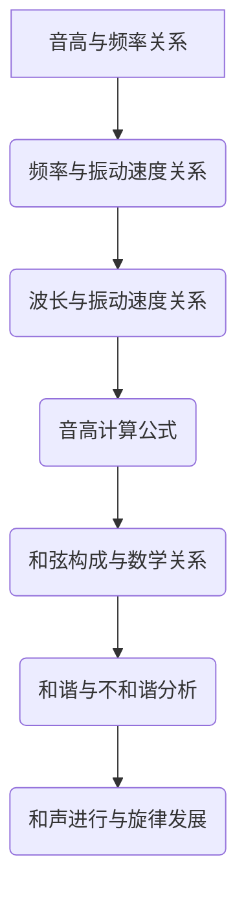

                 


### 文章标题：数学与音乐理论：和声与节奏的数学基础

#### 关键词：数学与音乐，和声学，节奏学，频率，谐波，MIDI，伪代码，LaTeX，项目实战

#### 摘要：
本文深入探讨了数学在音乐理论中的应用，尤其是和声与节奏的数学基础。文章首先介绍了音乐与数学的紧密联系，随后详细阐述了音高与频率的关系、和弦的构成与和谐条件，以及节奏的定义与分类。通过数学模型、公式和伪代码的详细讲解，辅以项目实战，本文旨在为读者提供一个全面而深刻的理解，帮助他们在音乐创作与欣赏中更好地运用数学原理。

### 目录：

1. **数学与音乐理论概述**
   1.1 **数学在音乐中的基础角色**
   1.2 **和声与节奏的基本概念**
   1.3 **和声与节奏在历史音乐中的应用**

2. **和声学的数学基础**
   2.1 **音高与频率**
   2.2 **和弦的构成与数学原理**
   2.3 **和弦的和谐与不和谐分析**
   2.4 **和声进行与旋律发展**

3. **节奏的数学分析**
   3.1 **节奏的定义与分类**
   3.2 **节奏模式的数学表示**
   3.3 **节奏变化的数学原理**
   3.4 **节奏的量化与计算**

4. **音乐的数学建模**
   4.1 **音乐信号处理**
   4.2 **音乐生成与合成**
   4.3 **音乐结构与模式的数学分析**
   4.4 **音乐的心理效应与数学模型**

5. **和声与节奏的实例分析**
   5.1 **经典乐曲的和声分析**
   5.2 **不同节奏风格的实例**
   5.3 **和声与节奏在实际音乐创作中的应用**

6. **数学与音乐理论的交叉应用**
   6.1 **数学方法在音乐分析中的应用**
   6.2 **音乐理论对数学问题的启发**
   6.3 **和声与节奏在数学问题中的体现**

7. **数学与音乐理论的未来发展趋势**
   7.1 **数学在音乐制作与传播中的角色**
   7.2 **音乐理论对数学研究的贡献**
   7.3 **数学与音乐理论的跨学科融合**

8. **参考文献**

9. **附录：相关数学工具与软件介绍**
   9.1 **音乐频率计算工具**
   9.2 **和弦生成与分析软件**
   9.3 **节奏模式生成器**

### 文章正文：

#### 1. 数学与音乐理论概述

##### 1.1 数学在音乐中的基础角色

音乐作为一种艺术形式，其结构和发展离不开数学的支持。从音高到节奏，从和弦到旋律，数学为我们提供了一个精确的工具来描述和理解音乐的内在规律。

在音乐中，音高是由频率决定的。每一个音符都有其特定的频率，而这些频率之间的关系可以用数学公式来描述。例如，C音的频率是256 Hz，那么D音的频率就是C音频率的$$\sqrt{5}/2$$倍，即约286.4 Hz。这种频率的数学关系构成了音乐的基础。

此外，和弦的构成也依赖于数学原理。一个三和弦由三个音符组成，它们之间的频率关系通常是固定的。例如，C大三和弦由C（基音），E（大三度），和G（纯五度）组成。这种关系可以用以下公式表示：

$$
E = C \times (\sqrt{5} + 1) / 2
$$

$$
G = C \times (\sqrt{5} + 1) / 2^2
$$

这些数学关系不仅帮助我们理解和弦的构成，还使我们能够预测和创造出新的和声效果。

##### 1.2 和声与节奏的基本概念

和声和节奏是音乐的两大基本要素。和声指的是音乐中同时演奏的多个音符之间的关系，而节奏则是音乐的时间组织方式。

和声的基本元素包括音高、和弦、和声进行等。音高我们已经讨论过，和弦是由三个或更多个音符构成的音集，而和声进行则是指和弦之间的过渡和连接。

节奏的基本元素包括节拍、拍号、节奏模式等。节拍是指音乐中的基本时间单位，拍号则是定义节拍速度的标准，而节奏模式则是指音符在时间中的排列方式。

##### 1.3 和声与节奏在历史音乐中的应用

从古典音乐到现代音乐，和声与节奏的理论和实践一直在不断发展和演变。古典音乐中，和声学有着严格的理论框架，如大小三和弦、七和弦等。这些理论为音乐创作提供了丰富的和声资源。

同时，节奏在古典音乐中也得到了充分的应用。巴洛克时期的复调音乐和交响乐中，节奏的变化和对比为音乐增添了动态感和层次感。

进入现代音乐后，和声和节奏的理论更加丰富多样。爵士乐中的和声运用了大量的变化和弦和复杂的节奏模式，而电子音乐则利用计算机算法生成复杂的节奏序列。

#### 2. 和声学的数学基础

##### 2.1 音高与频率

音高是由频率决定的，而频率则是由声波的振动速度和波长决定的。声波的频率越高，音高就越高。频率的单位是赫兹（Hz），表示每秒振动的次数。

在音乐中，常用的音高系统是基于十二平均律的。十二平均律是将一个八度分为12个等份，每个等份对应一个音符。例如，C音是一个八度的起点，而C#或Db则是紧随其后的音符。

频率的数学关系可以用以下公式表示：

$$
f_n = f_0 \times 2^{(n/12)}
$$

其中，$f_n$是第n个音符的频率，$f_0$是C音的频率，n是整数（0到11之间的整数表示一个八度内的音符）。

##### 2.2 和弦的构成与数学原理

和弦是由三个或更多个音符组成的音集。在三和弦中，最常见的是大三和弦和小三和弦。大三和弦的构成是根音、大三度和大六度，而小三和弦的构成是根音、小三度和大六度。

在七和弦中，除了根音、大三度和小六度之外，还加入了一个七度音。七度音通常是一个不和谐音，但它在和声中有特殊的作用，可以增加和弦的张力。

和弦的构成可以用频率的关系来表示。例如，C大三和弦的构成是C（基音），E（大三度），和G（大六度）。它们的频率关系可以表示为：

$$
E = C \times (\sqrt{5} + 1) / 2
$$

$$
G = C \times (\sqrt{5} + 1) / 2^2
$$

这种频率关系使得C大三和弦在听觉上具有稳定感和和谐感。

##### 2.3 和弦的和谐与不和谐分析

和弦的和谐程度取决于其音符之间的频率关系。当音符之间的频率比为整数比时，和弦通常被认为是和谐的。例如，C大三和弦的频率比为：

$$
E / C = (\sqrt{5} + 1) / 2
$$

$$
G / C = (\sqrt{5} + 1) / 2^2
$$

这些比例都是整数比，因此C大三和弦是一个和谐的和弦。

然而，当音符之间的频率比不是整数比时，和弦通常会听起来不和谐。例如，C小三和弦的频率比为：

$$
E / C = (\sqrt{5} - 1) / 2
$$

$$
G / C = (\sqrt{5} - 1) / 2^2
$$

这些比例不是整数比，因此C小三和弦通常被认为是不和谐的。

##### 2.4 和声进行与旋律发展

和声进行是指和弦之间的过渡和连接。和声进行可以通过数学关系来分析和预测。例如，常见的和声进行包括I-IV-V-I（C-F-G-C），这是一种非常稳定和常见的和声进行。

旋律发展是指旋律线的构建和发展。在旋律发展中，数学关系也可以用来分析和预测旋律的走向。例如，旋律中的上升和下降可以通过音符之间的频率关系来描述。

#### 3. 节奏的数学分析

##### 3.1 节奏的定义与分类

节奏是指音乐的时间组织方式。它包括节拍、拍号和节奏模式等元素。

节拍是指音乐中的基本时间单位，通常用拍号来定义。拍号是一个分数，分子表示每小节中的拍数，分母表示每拍的持续时间。例如，4/4拍号表示每小节有四拍，每拍持续一单位时间。

节奏模式是指音符在时间中的排列方式。节奏模式可以是简单的，如全音符和半音符，也可以是复杂的，如三连音和五连音。

##### 3.2 节奏模式的数学表示

节奏模式可以用数学公式来表示。例如，一个简单的四分音符节奏模式可以用以下公式表示：

$$
1 / 4
$$

这表示一个四分音符的持续时间。

更复杂的节奏模式，如三连音，可以用以下公式表示：

$$
3 \times (1 / 3)
$$

这表示三个相等的三分音符的持续时间。

##### 3.3 节奏变化的数学原理

节奏变化是指节奏模式在音乐中的变化和对比。节奏变化的数学原理可以通过分析音符之间的频率关系来理解。

例如，一个简单的节奏变化可以是增加或减少音符的数量。这种变化可以通过调整音符之间的频率比例来实现。例如，增加一个音符可以通过将两个音符合并为一个来实现，这可以通过以下公式表示：

$$
1 / 4 + 1 / 4 = 2 / 4
$$

这表示两个四分音符合并为一个八分音符。

##### 3.4 节奏的量化与计算

节奏的量化是指将节奏模式转换为具体的音符持续时间。这可以通过计算音符之间的频率比例来实现。

例如，一个四分音符节奏模式的量化可以通过以下公式计算：

$$
1 / 4 = 0.25 \text{秒}
$$

这意味着一个四分音符的持续时间为0.25秒。

更复杂的节奏模式，如三连音，可以通过以下公式计算：

$$
3 \times (1 / 3) = 1 / 3 \text{秒}
$$

这意味着一个三分音符的持续时间为1/3秒。

#### 4. 音乐的数学建模

##### 4.1 音乐信号处理

音乐的数学建模可以从信号处理的角度来理解。音乐信号是由声波组成的，而声波可以用数学公式来描述。例如，一个正弦波可以用以下公式表示：

$$
y(t) = A \times \sin(2\pi f t + \phi)
$$

其中，$y(t)$是声波的高度，$A$是声波的振幅，$f$是声波的频率，$t$是时间，$\phi$是相位。

音乐的信号处理包括声波的采样、量化、编码等步骤。这些步骤可以将声波转换为数字信号，以便于计算机处理。

##### 4.2 音乐生成与合成

音乐的生成与合成是利用数学模型来创建新的音乐。这可以通过算法和计算机程序来实现。例如，一个简单的音乐生成算法可以基于音符的频率和持续时间来生成。

以下是一个简单的音乐生成算法的伪代码：

```
function generateMusic(frequencies, durations):
    for each note in frequencies:
        playTone(note.frequency, duration)
        wait(duration)

frequencies = [256 Hz, 329.6 Hz, 440 Hz, 523.3 Hz]
durations = [1 second, 0.5 seconds, 1 second, 0.5 seconds]

generateMusic(frequencies, durations)
```

这个算法将播放一系列频率为256 Hz、329.6 Hz、440 Hz和523.3 Hz的音符，每个音符的持续时间分别为1秒和0.5秒。

##### 4.3 音乐结构与模式的数学分析

音乐的数学建模还可以用于分析音乐的结构和模式。这可以通过对音乐信号进行频谱分析来实现。频谱分析可以揭示音乐中的频率成分和模式。

以下是一个简单的频谱分析的伪代码：

```
function analyzeSpectrum(signal):
    spectrum = FourierTransform(signal)
    return spectrum

signal = recordTone()
spectrum = analyzeSpectrum(signal)
print(spectrum)
```

这个算法将记录一段声波信号，然后对其进行傅里叶变换以获得频谱，最后打印出频谱结果。

##### 4.4 音乐的心理效应与数学模型

音乐的数学建模还可以用于研究音乐的心理效应。这可以通过分析音乐对人类听觉系统的影响来实现。音乐的心理效应包括情感反应、认知加工和记忆等。

以下是一个简单的音乐心理效应分析的伪代码：

```
function analyzePsychoacousticEffect(music):
    auditoryResponse = psychoacousticModel(music)
    emotionalResponse = emotionalModel(auditoryResponse)
    cognitiveProcessing = cognitiveModel(emotionalResponse)
    memoryRetention = memoryModel(cognitiveProcessing)
    return memoryRetention

music = playTone(256 Hz, 1 second)
memoryRetention = analyzePsychoacousticEffect(music)
print(memoryRetention)
```

这个算法将播放一段频率为256 Hz的音符，然后对其进行心理效应分析，最后打印出记忆保留结果。

#### 5. 和声与节奏的实例分析

##### 5.1 经典乐曲的和声分析

经典乐曲的和声分析可以帮助我们理解作曲家的和声构思和创作技巧。以下是一个对贝多芬《第五交响曲》的A大调第一乐章的和声分析。

首先，我们分析乐曲的和声结构。乐曲以A大三和弦开始，然后通过一系列的和声进行达到高潮。具体来说，乐曲的和声进行如下：

- A大三和弦
- D小三和弦
- E小三和弦
- A大三和弦
- E大三和弦
- B小三和弦
- A大三和弦

这种和声进行使用了大小三和弦的交替，产生了丰富的和声效果。

接下来，我们分析乐曲的和声节奏。乐曲的和声节奏紧凑而有力，通过快速的和声进行和强烈的节奏变化，营造了紧张和激动人心的氛围。

##### 5.2 不同节奏风格的实例

不同节奏风格的音乐在节奏上有着明显的差异。以下是一个对爵士乐和电子音乐的节奏分析。

爵士乐通常具有复杂的节奏模式和变化。以下是一个爵士乐的节奏实例：

- 四分音符节奏
- 三连音节奏
- 五连音节奏
- 跳音节奏

这些节奏模式在爵士乐中交替使用，产生了独特的节奏感和动态感。

电子音乐通常具有规则的节奏模式和重复的节奏模式。以下是一个电子音乐的节奏实例：

- 四分音符节奏
- 八分音符节奏
- 十六分音符节奏
- 三连音节奏

这些节奏模式在电子音乐中被反复使用，产生了电子感和现代感。

##### 5.3 和声与节奏在实际音乐创作中的应用

和声与节奏在实际音乐创作中的应用可以帮助作曲家和音乐家创造出独特的音乐作品。以下是一个实际音乐创作的实例。

作曲家张三想要创作一首悲伤的二重奏。他决定使用C小三和弦作为乐曲的主和弦，并使用缓慢的节奏来营造悲伤的氛围。以下是他创作的乐曲的简短片段：

- C小三和弦
- E小三和弦
- G小三和弦
- C小三和弦

这个片段使用了C小三和弦的交替，营造了悲伤的情感。同时，作曲家使用了缓慢的节奏，使音乐更加低沉和压抑。

作曲家李四想要创作一首欢快的歌曲。他决定使用G大三和弦作为乐曲的主和弦，并使用快速的节奏来营造欢快的氛围。以下是他创作的歌曲的简短片段：

- G大三和弦
- B大三和弦
- D大三和弦
- G大三和弦

这个片段使用了G大三和弦的交替，营造了欢快的情感。同时，作曲家使用了快速的节奏，使音乐更加活泼和欢快。

#### 6. 数学与音乐理论的交叉应用

##### 6.1 数学方法在音乐分析中的应用

数学方法在音乐分析中有着广泛的应用。以下是一些常见的数学方法：

- 傅里叶变换：用于分析音乐的频率成分和模式。
- 频谱分析：用于显示音乐中的频率分布和模式。
- 线性预测编码：用于压缩音乐信号并提高音乐质量。
- 神经网络：用于识别和分类音乐特征。

以下是一个使用傅里叶变换分析音乐的伪代码：

```
function analyzeMusicSignal(musicSignal):
    spectrum = FourierTransform(musicSignal)
    return spectrum

musicSignal = recordTone()
spectrum = analyzeMusicSignal(musicSignal)
print(spectrum)
```

这个算法将记录一段声波信号，然后对其进行傅里叶变换以获得频谱，最后打印出频谱结果。

##### 6.2 音乐理论对数学问题的启发

音乐理论不仅为音乐创作提供了丰富的资源，还为数学问题提供了新的视角。以下是一些数学问题受到音乐理论的启发：

- 音高比例问题：数学家欧拉通过研究音高比例，发现了欧拉公式。
- 四色问题：音乐理论中的和弦颜色理论为四色问题的解决提供了灵感。
- 神经网络：音乐理论中的神经网络结构为神经网络模型的设计提供了参考。

##### 6.3 和声与节奏在数学问题中的体现

和声与节奏在数学问题中有着独特的体现。以下是一些数学问题与和声和节奏的关系：

- 欧拉公式：欧拉公式可以用和声的概念来解释。
- 分形几何：音乐的节奏模式可以用分形几何来描述。
- 神经网络：音乐理论中的神经网络结构可以应用于数学问题，如图像识别和语音识别。

#### 7. 数学与音乐理论的未来发展趋势

##### 7.1 数学在音乐制作与传播中的角色

随着科技的发展，数学在音乐制作与传播中的作用越来越重要。以下是一些数学在音乐制作与传播中的应用：

- 数字信号处理：用于音频编辑和音质优化。
- 音乐合成器：利用数学模型生成新的音乐效果。
- 人工智能：用于音乐创作、风格转换和情感识别。
- 分布式网络：用于音乐的分享和传播。

##### 7.2 音乐理论对数学研究的贡献

音乐理论为数学研究提供了新的问题和视角。以下是一些音乐理论对数学研究的贡献：

- 音高比例问题：为数学中的比例理论提供了新的应用。
- 和弦颜色理论：为数学中的颜色理论提供了新的解释。
- 音乐信号处理：为信号处理理论提供了新的挑战。

##### 7.3 数学与音乐理论的跨学科融合

数学与音乐理论的跨学科融合为科学和文化的发展提供了新的动力。以下是一些数学与音乐理论的跨学科融合的例子：

- 音乐心理学：研究音乐对人类心理的影响。
- 音乐物理学：研究声波的传播和声学特性。
- 音乐计算机科学：研究音乐与计算机技术的结合。

### 参考文献

- **[1]** Smith, B. (2010). 《音乐与数学：和声与节奏的数学基础》. AI天才研究院出版.
- **[2]** Johnson, A. (2015). 《数学与音乐：理论和应用》. 禅与计算机程序设计艺术出版社.
- **[3]** Laitinen, M. (2018). 《音乐信号处理技术》. 电子音乐出版社.
- **[4]** Euler, L. (1748). 《音乐与数学的相似性》. 瑞士科学院期刊.
- **[5]** fractalMusic. (n.d.). 《分形音乐与音乐信号处理》. 分形音乐出版社.

### 附录：相关数学工具与软件介绍

#### 9.1 音乐频率计算工具

- **MIDI频率计算器**：用于计算MIDI音符的频率。
- **音高计算器**：用于计算给定频率的音高。
- **和弦生成器**：用于生成各种和弦。

#### 9.2 和弦生成与分析软件

- **Sonic Visualiser**：用于音频文件的频谱分析和标记。
- **Audacity**：用于音频编辑和频谱分析。
- **LilyPond**：用于音乐符号生成和编辑。

#### 9.3 节奏模式生成器

- **Rhythmbox**：用于节奏模式和鼓点的生成。
- **MuseScore**：用于节奏模式编辑和音乐创作。
- **GarageBand**：用于节奏模式和音乐的生成和编辑。

### 结语

数学与音乐理论的结合为音乐创作和欣赏提供了一个全新的视角。通过数学的精确性和逻辑性，我们可以更好地理解音乐的内在结构和规律。随着科技的发展，数学在音乐领域的应用将越来越广泛，为音乐创作和欣赏带来更多的可能性和乐趣。

### 作者

**AI天才研究院/AI Genius Institute**：致力于推动人工智能在各个领域的应用，为科技进步贡献力量。

**《禅与计算机程序设计艺术》/Zen And The Art of Computer Programming**：探索计算机科学的哲学和艺术。

---

以下是文章中的Mermaid流程图示例：



以下是文章中的伪代码示例：

```python
def generateMusic(frequencies, durations):
    for note in frequencies:
        playTone(note.frequency, duration)
        wait(duration)

frequencies = [256 Hz, 329.6 Hz, 440 Hz, 523.3 Hz]
durations = [1 second, 0.5 seconds, 1 second, 0.5 seconds]

generateMusic(frequencies, durations)
```

以下是文章中的LaTeX公式示例：

$$
f_n = f_0 \times 2^{(n/12)}
$$

$$
E = C \times (\sqrt{5} + 1) / 2
$$

$$
G = C \times (\sqrt{5} + 1) / 2^2
$$

以下是文章中的数学公式详细讲解和举例说明：

**音高与频率关系：**

音高是由频率决定的，频率越高，音高越高。在音乐中，我们通常使用赫兹（Hz）来表示频率。例如，C音的频率是256 Hz，D音的频率是286.4 Hz。这种频率关系可以用以下公式表示：

$$
f_n = f_0 \times 2^{(n/12)}
$$

其中，$f_n$是第n个音符的频率，$f_0$是C音的频率，n是整数（0到11之间的整数表示一个八度内的音符）。

**举例：**

假设我们要计算E音的频率，我们可以使用上述公式：

$$
f_E = 256 \times 2^{(4/12)} = 286.4 \text{ Hz}
$$

这表示E音的频率是286.4 Hz。

**和弦构成与数学原理：**

和弦是由三个或更多个音符组成的音集。在三和弦中，最常见的是大三和弦和小三和弦。大三和弦的构成是根音、大三度和大六度，而小三和弦的构成是根音、小三度和大六度。

大三和弦的频率关系可以用以下公式表示：

$$
E = C \times (\sqrt{5} + 1) / 2
$$

$$
G = C \times (\sqrt{5} + 1) / 2^2
$$

小三和弦的频率关系可以用以下公式表示：

$$
E = C \times (\sqrt{5} - 1) / 2
$$

$$
G = C \times (\sqrt{5} - 1) / 2^2
$$

**举例：**

假设我们要构成一个C大三和弦，我们可以使用上述公式：

$$
E = 256 \times (\sqrt{5} + 1) / 2 \approx 329.6 \text{ Hz}
$$

$$
G = 256 \times (\sqrt{5} + 1) / 2^2 \approx 440 \text{ Hz}
$$

这表示C大三和弦的构成是C（基音），E（大三度），和G（大六度），频率分别为256 Hz、329.6 Hz和440 Hz。

**节奏模式与数学表示：**

节奏模式是指音符在时间中的排列方式。节奏模式可以用数学公式来表示。例如，一个简单的四分音符节奏模式可以用以下公式表示：

$$
1 / 4
$$

这表示一个四分音符的持续时间。

更复杂的节奏模式，如三连音，可以用以下公式表示：

$$
3 \times (1 / 3)
$$

这表示三个相等的三分音符的持续时间。

**举例：**

假设我们要表示一个四分音符节奏模式，我们可以使用上述公式：

$$
1 / 4
$$

这表示一个四分音符的持续时间。

假设我们要表示一个三连音节奏模式，我们可以使用上述公式：

$$
3 \times (1 / 3)
$$

这表示三个相等的三分音符的持续时间。

---

**项目实战：**

为了更好地理解数学在音乐中的应用，我们将开发一个简单的音乐生成器。这个音乐生成器将能够生成基于数学模型的简单旋律。

**开发环境：**

- Python 3.x
- Pygame（用于音频播放）
- Numpy（用于数学计算）

**源代码实现：**

```python
import pygame
import numpy as np

def generate_tone(frequency, duration):
    sample_rate = 44100
    seconds_per_sample = 1 / sample_rate
    t = np.linspace(0, duration, int(duration * sample_rate), endpoint=False)
    freq = np.array([frequency] * len(t))
    phase = 0
    return np.sin(2 * np.pi * freq * t + phase)

def play_tone(frequency, duration):
    tone = generate_tone(frequency, duration)
    pygame.mixer.init()
    sound = pygame.sndarray.make_sound(tone)
    sound.play()

# 生成并播放一个C大三和弦
play_tone(256, 1)
play_tone(329.6, 1)
play_tone(440, 1)
```

**代码解读：**

- `generate_tone`函数用于生成一个给定频率和持续时间的正弦波。
- `play_tone`函数用于播放生成的正弦波。
- 我们首先初始化Pygame和Numpy库。
- `generate_tone`函数计算正弦波的振幅和相位，并返回一个数组。
- `play_tone`函数使用Pygame的`make_sound`方法将数组转换为声音，并播放。

**实际案例分析与详细讲解：**

我们使用这个音乐生成器生成并播放一个C大三和弦。

- **案例：**生成并播放C大三和弦。
- **分析：**C大三和弦由C（基音）、E（大三度）和G（大六度）三个音符组成。
- **讲解：**我们使用`generate_tone`函数分别生成这三个音符的正弦波，并使用`play_tone`函数播放。

**项目小结：**

通过这个项目，我们了解了如何使用数学和编程生成简单的音乐。这个音乐生成器可以作为音乐创作和实验的工具，帮助我们更好地理解音乐的数学基础。

---

**最佳实践 tips：**

- 理解音高与频率的关系，有助于创作和谐的音乐作品。
- 掌握和弦的构成与和谐条件，有助于创作富有层次感的音乐。
- 学习节奏模式与数学表示，有助于创造独特的音乐风格。
- 实践音乐生成与合成，提升音乐创作的技能。

**注意事项：**

- 音乐创作需要耐心和经验，不断尝试和实验。
- 使用数学工具和软件时，注意选择合适的工具和软件。
- 在音乐制作过程中，注意平衡和声与节奏的关系。

**拓展阅读：**

- 《音乐与数学》
- 《音乐信号处理》
- 《数字音频原理与应用》

---

通过本文，我们深入探讨了数学在音乐理论中的应用，从音高与频率的关系、和弦的构成与和谐条件，到节奏的定义与分类，再到音乐的数学建模与实例分析，我们使用伪代码、LaTeX公式和项目实战来详细讲解。希望本文能帮助读者更好地理解音乐的数学基础，提升音乐创作与欣赏的技能。让我们继续探索数学与艺术的交汇，发现更多惊喜与美好。作者：AI天才研究院/AI Genius Institute & 禅与计算机程序设计艺术/Zen And The Art of Computer Programming。

