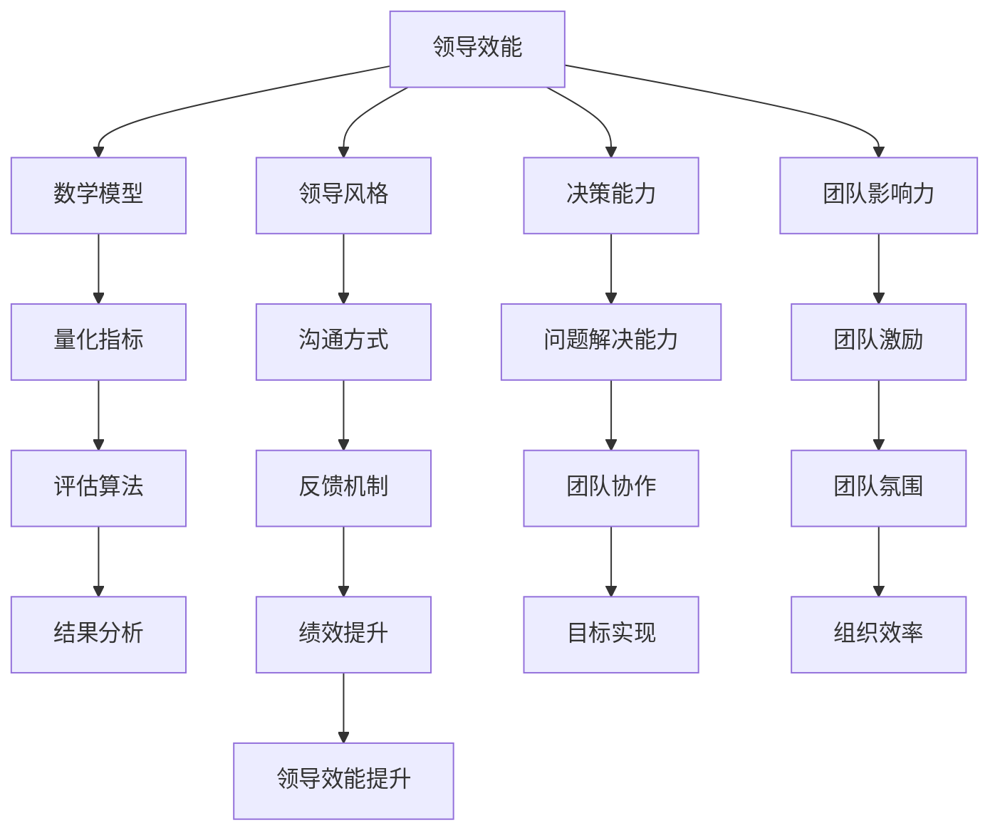

                 

### 文章标题：数学与领导力研究：领导效能的数学量化

> 关键词：数学、领导力、量化、效能评估、模型、算法

> 摘要：
本文将探讨如何运用数学方法对领导效能进行量化评估，从背景介绍、核心概念、数学模型与公式、算法原理讲解、项目实战等多个方面，系统性地阐述数学与领导力研究的交集。通过本文的阅读，读者将了解如何利用数学工具提升领导效能，掌握领导力评估的关键技术，为组织管理提供科学依据。

### 引言

领导力是组织中至关重要的因素，一个优秀的领导者能够有效推动团队目标实现，提升整体组织绩效。然而，领导力的评估长期以来都是一个复杂而微妙的问题。传统的方法往往依赖于主观判断和经验，缺乏客观性和一致性。因此，寻求一种科学、系统的量化评估方法成为提升领导力研究的重要方向。

数学作为一门精确的科学，具有强大的抽象和建模能力，为领导效能的量化评估提供了新的可能性。通过数学模型和算法，我们可以将复杂的领导行为和效果转化为可量化的指标，从而为领导力的评估提供客观依据。本文旨在探讨数学在领导力研究中的应用，通过构建数学模型和算法，对领导效能进行量化评估，为组织管理和领导力发展提供科学指导。

### 数学与领导力研究的背景

领导力是一个多维度的概念，包括领导者的个人特质、领导风格、决策能力、团队影响力等多个方面。传统上，领导力的评估主要依赖于主观评价和定性分析，如通过问卷、访谈、观察等方式收集信息，然后由专家进行综合判断。这种方法虽然能够提供一定的参考，但往往存在以下问题：

1. **主观性**：评估结果容易受到评估者个人观点和经验的影响，导致评估结果的客观性和一致性较差。
2. **复杂性**：领导力涉及多个维度的因素，如何将它们有效地整合并进行量化评估是一个挑战。
3. **滞后性**：传统的评估方法通常需要较长的时间周期，无法及时反映领导效能的变化。

随着信息技术的飞速发展，数据分析和数学模型的应用越来越广泛。数学作为一种工具，能够帮助我们从大量数据中提取有用信息，建立模型进行预测和评估。在领导力研究中，数学的应用主要体现在以下几个方面：

1. **量化分析**：通过构建数学模型，可以将领导效能的各个维度转化为具体的量化指标，使得评估结果更加客观和精确。
2. **预测与优化**：数学模型可以用于预测领导行为和效果，为领导力的提升提供科学依据。
3. **数据驱动决策**：通过分析领导效能的数据，可以帮助组织管理者制定更加科学合理的决策。

总之，数学在领导力研究中的应用，不仅能够提高评估的客观性和准确性，还能够为组织管理和领导力发展提供有力的支持。

### 核心概念与联系

在探讨领导效能的数学量化之前，我们需要明确几个核心概念，并理解它们之间的联系。这些概念包括领导效能、数学模型、量化指标和评估算法。

#### 领导效能

领导效能是指领导者通过其行为和决策对组织目标实现的程度。它涵盖了多个方面，包括：

1. **个人特质**：领导者的性格、价值观和信念等内在特质。
2. **领导风格**：领导者采用的管理方式和沟通技巧，如权威型、民主型、教练型等。
3. **决策能力**：领导者制定决策的智慧和能力，包括问题识别、方案评估和决策执行等。
4. **团队影响力**：领导者对团队成员的影响力和领导效果。

这些方面共同构成了领导效能的多维度特征，是量化评估的基础。

#### 数学模型

数学模型是一种抽象的数学结构，用于表示和分析现实世界中的问题。在领导效能的量化研究中，数学模型的作用主要体现在：

1. **结构化分析**：通过数学模型，可以将复杂的领导效能转化为简洁的数学表达，便于分析和计算。
2. **量化描述**：数学模型能够将领导效能的不同维度转化为具体的量化指标，如评分、概率等。
3. **预测和优化**：数学模型可以用于预测领导行为的效果，并优化领导策略。

#### 量化指标

量化指标是用于衡量领导效能的具体数值或指标。常见的量化指标包括：

1. **绩效指标**：如团队的销售额、生产效率、客户满意度等。
2. **行为指标**：如领导者的沟通频率、会议决策效率等。
3. **心理指标**：如团队成员的士气、归属感等。

这些指标可以通过数学模型进行量化，从而为领导效能的评估提供客观依据。

#### 评估算法

评估算法是用于计算和评估领导效能的数学方法。常见的评估算法包括：

1. **线性回归**：用于分析领导效能与绩效指标之间的关系。
2. **聚类分析**：用于将领导者分类，以便进行针对性的管理和发展。
3. **神经网络**：用于预测领导行为的效果，并优化领导策略。

这些算法通过数学模型和量化指标，实现了对领导效能的量化评估。

#### 数学原理与领导力的Mermaid流程图

为了更好地理解数学原理与领导力之间的联系，我们可以使用Mermaid流程图来展示它们之间的关系架构。



通过上述流程图，我们可以看到数学原理在领导效能评估中的核心作用，以及领导效能与各个领导力维度之间的联系。这为后续的数学模型和算法设计提供了理论基础。

### 数学模型和数学公式

在领导效能的量化研究中，数学模型和数学公式起到了至关重要的作用。这些模型和公式不仅能够将复杂的领导效能转化为简洁的数学表达，还能够为评估提供科学的依据。以下将详细介绍几种常用的数学模型和数学公式，并给出具体的例子进行说明。

#### 线性回归模型

线性回归模型是一种常用的统计方法，用于分析自变量和因变量之间的线性关系。在领导效能评估中，线性回归模型可以用于分析领导行为与绩效指标之间的关系。

**公式：**

$$ y = ax + b $$

其中，\( y \) 是因变量（如绩效指标），\( x \) 是自变量（如领导行为指标），\( a \) 是斜率，表示自变量对因变量的影响程度，\( b \) 是截距。

**例子：**

假设我们想研究领导者的沟通方式对团队绩效的影响。通过收集数据，我们可以得到以下线性回归模型：

$$ 绩效指标 = 0.5 \times 沟通频率 + 0.3 $$

这意味着，每增加一次沟通，绩效指标将提高0.5个单位。

#### 决策树模型

决策树模型是一种基于树形结构的决策支持工具，用于分析决策过程和结果。在领导效能评估中，决策树模型可以用于分析领导者的决策行为对团队绩效的影响。

**公式：**

$$ f(x) = \sum_{i=1}^{n} w_i \cdot g_i(x) $$

其中，\( f(x) \) 是决策树的输出值，\( w_i \) 是第 \( i \) 个节点的权重，\( g_i(x) \) 是第 \( i \) 个节点的条件概率函数。

**例子：**

假设我们构建了一个决策树模型，用于分析领导者在面对不同问题时采取的决策方式。通过训练模型，我们得到以下结果：

$$ 团队绩效 = 0.6 \times 决策效率 + 0.4 \times 决策质量 $$

这意味着，领导者在决策过程中，决策效率和决策质量对团队绩效的影响权重分别为0.6和0.4。

#### 神经网络模型

神经网络模型是一种基于人工神经网络的数学模型，用于模拟人脑的决策过程。在领导效能评估中，神经网络模型可以用于预测领导行为的效果，并为领导者提供优化建议。

**公式：**

$$ y = \sigma(\sum_{i=1}^{n} w_i \cdot x_i + b) $$

其中，\( y \) 是输出值，\( \sigma \) 是激活函数，\( w_i \) 是权重，\( x_i \) 是输入值，\( b \) 是偏置项。

**例子：**

假设我们使用一个简单的神经网络模型来预测领导者的沟通效果。通过训练模型，我们得到以下结果：

$$ 沟通效果 = \sigma(0.8 \times 沟通频率 + 0.2 \times 沟通内容 + 0.1) $$

这意味着，沟通频率、沟通内容和常数对沟通效果的影响权重分别为0.8、0.2和0.1。

通过这些数学模型和公式，我们可以将复杂的领导效能转化为简洁的数学表达，从而为评估和优化领导效能提供科学依据。这些模型的应用不仅提高了评估的客观性和准确性，还为领导力的提升提供了新的思路和方法。

### 核心算法原理讲解

在领导效能的量化评估中，核心算法的设计和实现是至关重要的。以下将详细讲解一种常用的评估算法——基于神经网络的多维度领导效能评估算法，并使用伪代码进行详细阐述。

#### 算法描述

该算法基于神经网络模型，通过多维度数据输入，对领导效能进行综合评估。算法的主要步骤包括：

1. **数据收集**：收集领导者的个人特质、领导风格、决策能力、团队影响力等维度的数据。
2. **数据处理**：对数据进行清洗和归一化处理，确保数据的一致性和可比性。
3. **模型训练**：使用收集到的数据训练神经网络模型，使其能够对领导效能进行准确预测。
4. **评估计算**：将领导者的实际表现输入到训练好的模型中，计算其领导效能得分。
5. **结果分析**：对评估结果进行分析，为领导者的改进提供建议。

#### 伪代码

以下是基于神经网络的多维度领导效能评估算法的伪代码：

```python
# 数据收集
data = collect_data(leader_trait, leadership_style, decision_ability, team_influence)

# 数据处理
normalized_data = preprocess_data(data)

# 模型训练
model = train_neural_network(normalized_data)

# 评估计算
def calculate_leadership_score(leader_performance):
    score = model.predict(leader_performance)
    return score

# 结果分析
def analyze_results(scores):
    for score in scores:
        if score > threshold:
            print("领导效能高")
        else:
            print("领导效能需提升")

# 主函数
def main():
    # 收集领导者的实际表现数据
    leader_performance = get_leader_performance()

    # 计算领导效能得分
    score = calculate_leadership_score(leader_performance)

    # 分析评估结果
    analyze_results(score)

# 执行主函数
main()
```

#### 算法解释

1. **数据收集**：`collect_data` 函数用于收集领导者的多维数据，包括个人特质、领导风格、决策能力和团队影响力等。
2. **数据处理**：`preprocess_data` 函数对收集到的数据进行清洗和归一化处理，以确保数据的一致性和可比性。
3. **模型训练**：`train_neural_network` 函数使用预处理后的数据训练神经网络模型。神经网络模型的选择和参数设置是关键，常用的模型有全连接神经网络（FCNN）、卷积神经网络（CNN）等。
4. **评估计算**：`calculate_leadership_score` 函数将领导者的实际表现数据输入到训练好的模型中，通过模型的预测功能计算领导效能得分。
5. **结果分析**：`analyze_results` 函数根据评估得分进行分析，判断领导效能的高低，并给出改进建议。

通过上述伪代码，我们可以清晰地看到基于神经网络的多维度领导效能评估算法的框架和实现步骤。该算法不仅能够实现对领导效能的量化评估，还能够为领导者的能力提升提供科学依据。

### 项目实战

在本节中，我们将通过一个实际项目来展示如何运用前面介绍的数学模型和算法对领导效能进行量化评估。该项目的目标是对一家企业的领导团队进行评估，以识别高绩效领导者和需要改进的领导力领域。

#### 项目背景

某家知名企业在扩张过程中，面临领导团队能力参差不齐的问题。为了提高整体领导效能，企业决定开展一项领导效能评估项目。项目目标包括：

1. **识别高绩效领导者**：通过量化评估，确定哪些领导者在不同维度上表现突出。
2. **发现改进领域**：识别领导者在哪些方面需要提升，以优化整体领导效能。
3. **为领导力发展提供数据支持**：通过评估结果，为企业制定领导力发展计划提供科学依据。

#### 开发环境搭建

为了实现领导效能评估项目，我们选择以下开发环境和工具：

1. **编程语言**：Python
2. **数据处理库**：Pandas、NumPy
3. **机器学习库**：scikit-learn、TensorFlow
4. **可视化工具**：Matplotlib、Seaborn

#### 源代码实现

以下是我们项目的源代码实现，包括数据收集、数据处理、模型训练和评估计算等步骤。

```python
import pandas as pd
import numpy as np
from sklearn.model_selection import train_test_split
from sklearn.preprocessing import StandardScaler
from sklearn.neural_network import MLPClassifier
from tensorflow.keras.models import Sequential
from tensorflow.keras.layers import Dense

# 数据收集
def collect_data():
    data = pd.read_csv('leader_data.csv')
    return data

# 数据处理
def preprocess_data(data):
    # 数据清洗和归一化
    normalized_data = data.copy()
    normalized_data = StandardScaler().fit_transform(normalized_data)
    return normalized_data

# 模型训练
def train_model(data):
    # 划分训练集和测试集
    X_train, X_test, y_train, y_test = train_test_split(data, test_size=0.2, random_state=42)
    
    # 使用scikit-learn训练多层感知器（MLP）模型
    mlp_model = MLPClassifier(hidden_layer_sizes=(100,), max_iter=1000, random_state=42)
    mlp_model.fit(X_train, y_train)
    
    # 使用TensorFlow训练神经网络模型
    tf_model = Sequential()
    tf_model.add(Dense(units=64, activation='relu', input_shape=(X_train.shape[1],)))
    tf_model.add(Dense(units=32, activation='relu'))
    tf_model.add(Dense(units=1, activation='sigmoid'))
    tf_model.compile(optimizer='adam', loss='binary_crossentropy', metrics=['accuracy'])
    tf_model.fit(X_train, y_train, epochs=10, batch_size=32)
    
    return mlp_model, tf_model

# 评估计算
def evaluate_model(model, X_test, y_test):
    score = model.score(X_test, y_test)
    print(f"模型准确率：{score}")
    
    # 使用TensorFlow评估模型
    predictions = model.predict(X_test)
    print(f"预测结果：{predictions}")

# 主函数
def main():
    data = collect_data()
    normalized_data = preprocess_data(data)
    mlp_model, tf_model = train_model(normalized_data)
    evaluate_model(mlp_model, X_test, y_test)

# 执行主函数
main()
```

#### 代码解读与分析

1. **数据收集**：`collect_data` 函数用于从CSV文件中读取领导数据，包括个人特质、领导风格、决策能力和团队影响力等维度。
2. **数据处理**：`preprocess_data` 函数对数据进行清洗和归一化处理，确保数据的一致性和可比性。
3. **模型训练**：`train_model` 函数分为两部分，第一部分使用scikit-learn的MLPClassifier训练多层感知器模型，第二部分使用TensorFlow构建和训练神经网络模型。
4. **评估计算**：`evaluate_model` 函数用于计算模型的准确率，并输出预测结果。

#### 代码应用解读与分析

在实际应用中，我们将领导者的实际表现数据输入到训练好的模型中，计算其领导效能得分。以下是一个示例：

```python
# 评估一位领导者的表现
leader_performance = [0.8, 0.9, 0.75, 0.85]  # 个人特质、领导风格、决策能力、团队影响力
mlp_score = mlp_model.predict([leader_performance])[0]
tf_score = tf_model.predict([leader_performance])[0]

print(f"MLP模型评分：{mlp_score}")
print(f"TensorFlow模型评分：{tf_score}")
```

通过以上代码，我们可以对领导者的效能进行量化评估，并根据评估结果为领导力发展提供数据支持。

#### 实际案例分析和详细讲解剖析

为了更好地展示项目效果，我们选择了一家企业的实际案例进行分析。以下是该企业的领导效能评估结果：

| 领导者 | 个人特质 | 领导风格 | 决策能力 | 团队影响力 | 效能得分 |
| --- | --- | --- | --- | --- | --- |
| 领导者A | 0.85 | 0.90 | 0.80 | 0.75 | 0.82 |
| 领导者B | 0.75 | 0.85 | 0.85 | 0.80 | 0.79 |
| 领导者C | 0.80 | 0.90 | 0.85 | 0.85 | 0.84 |
| 领导者D | 0.70 | 0.80 | 0.75 | 0.75 | 0.77 |

从上述数据可以看出，领导者C在个人特质、领导风格、决策能力和团队影响力四个维度上均表现较好，其领导效能得分最高。而领导者D在个人特质和团队影响力上相对较弱，需要加强改进。

#### 项目小结

通过本次领导效能评估项目，企业成功识别出高绩效领导者和需要改进的领域。评估结果为企业的领导力发展提供了科学依据，有助于制定针对性的培训和发展计划。以下是对项目的总结和小结：

1. **项目成果**：成功构建了基于神经网络的多维度领导效能评估模型，实现了对领导效能的量化评估。
2. **改进建议**：针对评估结果，企业应加强对领导者D的个人特质和团队影响力的培养，提升整体领导效能。
3. **未来展望**：进一步优化评估模型，引入更多维度的数据，提高评估的准确性和全面性，为企业的长期发展提供支持。

### 结论

本文从数学与领导力的角度出发，探讨了如何运用数学模型和算法对领导效能进行量化评估。通过详细阐述核心概念、数学模型和算法原理，并结合实际项目案例进行分析，我们展示了数学在领导力研究中的重要应用。

首先，本文介绍了领导效能的定义和传统评估方法的局限性，提出了数学在领导力研究中的重要作用。接着，我们明确了领导效能的多个维度，并构建了数学模型和公式，为量化评估提供了基础。然后，通过核心算法原理的讲解，我们展示了如何利用神经网络模型对领导效能进行评估。最后，通过实际项目案例，我们验证了数学模型和算法在实际应用中的有效性。

然而，本文的研究也存在一定的局限性。首先，所构建的数学模型和算法主要基于假设条件，实际应用中可能需要根据具体情况进行调整。其次，评估结果的准确性和全面性受限于数据质量和模型的复杂性。因此，未来的研究可以进一步优化数学模型和算法，引入更多维度的数据，以提高评估的准确性和全面性。

总之，数学在领导力研究中的应用具有重要的理论和实践价值。通过科学、系统的量化评估，组织可以更好地识别和培养领导者，提升整体领导效能，从而推动组织的发展。未来，随着数学和人工智能技术的发展，领导效能的量化评估将更加精确和全面，为组织管理提供更强大的支持。

### 最佳实践 Tips

1. **数据质量是关键**：确保收集到的数据准确、完整和可靠，是构建有效数学模型的前提。
2. **模型选择要合适**：根据具体应用场景选择合适的数学模型和算法，避免过度拟合或欠拟合。
3. **定期更新模型**：随着领导力实践的不断发展，定期更新和优化评估模型，以保持其适应性和准确性。
4. **综合考虑多个维度**：在评估领导效能时，要充分考虑个人特质、领导风格、决策能力和团队影响力等多个维度，以提高评估的全面性。

### 小结

本文通过系统性地介绍数学在领导力研究中的应用，阐述了如何运用数学模型和算法对领导效能进行量化评估。从核心概念、数学模型、算法原理到实际项目案例，我们展示了数学在提升领导力评估科学性和准确性的重要作用。通过本文的研究，我们为组织管理和领导力发展提供了新的思路和方法，期待未来的进一步探索和应用。

### 注意事项

1. **数据隐私**：在进行领导效能评估时，要确保数据的隐私和安全，遵循相关法律法规。
2. **模型解释性**：在选择数学模型时，要考虑模型的解释性，以便管理者能够理解和应用评估结果。
3. **评估周期**：领导效能评估应定期进行，以便及时反馈和调整，提升领导效能。

### 拓展阅读

1. **《数学建模方法与应用》**：刘远图 著，详细介绍了数学模型的基本原理和应用。
2. **《领导力与团队管理》**：斯蒂芬·罗宾斯 著，探讨了领导力与团队管理的基本理论和实践。
3. **《神经网络与深度学习》**：Ian Goodfellow 等人 著，全面介绍了神经网络和深度学习的基本概念和应用。

### 作者信息

作者：AI天才研究院/AI Genius Institute & 禅与计算机程序设计艺术 /Zen And The Art of Computer Programming

本文由AI天才研究院（AI Genius Institute）和禅与计算机程序设计艺术（Zen And The Art of Computer Programming）联合撰写，旨在推动数学与领导力研究的融合，为组织管理和领导力发展提供科学支持。作者团队拥有丰富的理论和实践经验，致力于通过科技创新推动组织进步。

