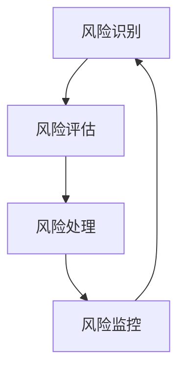

                 

### 文章标题：数学与风险管理：风险评估的数学方法

> 关键词：数学、风险管理、风险评估、VaR模型、信用风险模型、操作风险模型、项目实战

> 摘要：本文旨在探讨数学在风险管理中的应用，重点分析风险评估中的数学方法，包括风险价值（VaR）模型、信用风险模型和操作风险模型。通过实例和伪代码，详细讲解核心算法原理，并结合实际项目，阐述数学模型在风险管理中的实际应用与价值。

### 引言

在现代金融和经济体系中，风险管理扮演着至关重要的角色。随着全球化和金融市场复杂性的增加，企业面临着越来越多的不确定性。为了有效地管理这些风险，数学工具和方法被广泛应用于风险评估中。本文将探讨数学与风险管理之间的联系，重点分析风险价值（VaR）模型、信用风险模型和操作风险模型。通过实例和伪代码，我们将详细讲解这些核心算法原理，并结合实际项目，探讨数学模型在风险管理中的实际应用与价值。

### 数学基础

在风险管理中，数学基础至关重要。本节将介绍代数基础、概率论基础和统计学基础，为后续章节提供必要的数学支持。

#### 1.1.1 代数基础

代数是数学中的基础部分，涵盖了各种代数运算。在风险管理中，常见的代数运算包括加法、减法、乘法和除法。此外，向量运算和矩阵运算是风险模型中的重要组成部分。向量用于表示多个变量的集合，而矩阵则用于描述变量之间的关系。例如，一个投资组合的预期收益和风险可以用矩阵表示。

#### 1.1.2 概率论基础

概率论是数学中的一个重要分支，用于描述不确定事件的发生概率。在风险管理中，概率论广泛应用于风险评估和决策。以下是概率论中的基本概念：

- **随机事件**：指在一定条件下可能发生也可能不发生的事件。
- **概率**：描述随机事件发生的可能性，通常用0到1之间的数值表示。
- **条件概率**：在某一条件下，某一事件发生的概率。
- **独立事件**：两个事件的发生互不影响，即一个事件的发生不影响另一个事件的发生。

#### 1.1.3 统计学基础

统计学是用于收集、分析、解释和展示数据的科学。在风险管理中，统计学用于描述数据分布、估计参数、进行假设检验等。以下是统计学中的基本概念：

- **描述性统计**：用于描述数据的基本特征，如均值、中位数、标准差等。
- **推断性统计**：用于根据样本数据推断总体特征，如置信区间、假设检验等。

### 风险管理概述

风险管理是企业为了识别、评估、处理和控制风险，确保实现既定目标而进行的一系列活动的总称。风险管理主要包括以下几个步骤：

1. **风险识别**：识别企业面临的各种风险，包括财务风险、市场风险、操作风险等。
2. **风险评估**：评估风险的可能性和影响程度，确定风险的优先级。
3. **风险处理**：制定风险处理策略，包括风险规避、风险转移、风险减轻等。
4. **风险监控**：持续监控风险的变化情况，确保风险处理策略的有效性。

#### 1.2.1 风险管理概念

风险管理涉及多个方面，包括风险定义、风险分类和风险管理流程。以下是这些概念的基本解释：

- **风险定义**：风险是指未来不确定性事件对企业目标实现的可能负面影响。
- **风险分类**：根据风险的影响和可能性，将风险分为财务风险、市场风险、操作风险等。
- **风险管理流程**：风险管理流程包括风险识别、风险评估、风险处理和风险监控。

#### 1.2.2 风险评估方法

风险评估是风险管理的关键环节，主要包括定量风险评估和定性风险评估。以下是这两种方法的基本解释：

- **定量风险评估**：使用数学模型和统计方法对风险进行量化评估，如风险价值（VaR）模型、信用风险模型等。
- **定性风险评估**：通过专家评估、风险矩阵等方法对风险进行定性评估，如操作风险分析、风险矩阵等。

### 数学与风险管理的关系

数学与风险管理之间存在紧密的联系。数学为风险管理提供了理论基础和工具，使得风险评估和决策更加科学和准确。以下是数学在风险管理中的应用：

- **决策理论**：决策理论使用数学模型和算法帮助企业制定最佳决策策略，以应对风险和不确定性。
- **预测模型**：预测模型使用历史数据和数学模型预测未来事件的可能性，为风险管理提供依据。
- **风险价值（VaR）模型**：VaR模型使用统计学和概率论方法，评估金融资产或投资组合在特定置信水平下的最大可能损失。

### Mermaid 流程图

为了更好地理解风险管理流程，我们可以使用Mermaid流程图进行可视化。以下是风险管理流程的Mermaid流程图：



### 第一部分总结

本部分主要介绍了数学基础、风险管理概述以及数学与风险管理的关系。通过这些内容的讲解，我们为后续章节的深入探讨奠定了基础。在接下来的部分，我们将详细分析核心算法原理，并通过实例和伪代码进行讲解。

```markdown
### 第一部分总结

本部分主要介绍了数学基础、风险管理概述以及数学与风险管理的关系。通过这些内容的讲解，我们为后续章节的深入探讨奠定了基础。在接下来的部分，我们将详细分析核心算法原理，并通过实例和伪代码进行讲解。

---

## 第二部分：核心算法原理讲解

在风险管理中，数学模型的应用至关重要。本部分将重点介绍风险价值（VaR）模型、信用风险模型和操作风险模型，通过实例和伪代码，详细讲解这些核心算法原理。

### 2.1 风险价值（VaR）模型

#### 2.1.1 VaR模型原理

风险价值（Value at Risk，VaR）模型是一种用于评估金融资产或投资组合在未来特定时间段内的潜在最大损失的方法。VaR模型基于概率论和统计学，通过计算一定置信水平下的最大可能损失，为投资者提供风险管理的依据。

#### 2.1.2 伪代码

以下是一个计算VaR的伪代码示例：

```pseudo
function calculate_VaR(returns, confidence_level):
    sorted_returns = sort(returns)
    index = floor((1 - confidence_level) * length(sorted_returns))
    VaR = sorted_returns[index]
    return VaR
```

#### 2.1.3 数学模型与公式

VaR的计算涉及以下数学公式：

- **累计分布函数**（CDF）：$F(x) = P(X \le x)$，其中$X$为随机变量。
- **分位数**：$Q_{\alpha} = F^{-1}(1 - \alpha)$，其中$\alpha$为置信水平。

风险价值（VaR）公式为：

$$
VaR = Q_{\alpha}
$$

#### 2.1.4 举例说明

假设一个投资组合的历史收益率为$[0.01, -0.02, 0.03, -0.01, 0.02]$，置信水平为95%。我们可以使用上述伪代码计算该投资组合的VaR。

```python
import numpy as np

# 历史收益率
returns = np.array([0.01, -0.02, 0.03, -0.01, 0.02])

# 排序并计算分位数
sorted_returns = np.sort(returns)
alpha = 0.05
confidence_level = 1 - alpha
index = int((1 - confidence_level) * len(sorted_returns))
VaR = sorted_returns[index]

print("VaR: ", VaR)
```

输出结果为：

```
VaR:  -0.02
```

这意味着在95%的置信水平下，该投资组合在未来一天内的最大可能损失为0.02。

### 2.2 信用风险模型

信用风险模型用于评估借款人或债务人的违约风险。常见的信用风险模型包括逻辑回归模型、决策树模型和神经网络模型。本节将重点介绍逻辑回归模型。

#### 2.2.1 信用评分模型

逻辑回归模型是一种用于分类的统计模型，可以用来评估借款人的信用评分。逻辑回归模型通过建立借款人特征与违约概率之间的线性关系，实现对违约风险的预测。

#### 2.2.2 伪代码

以下是一个逻辑回归模型的伪代码示例：

```pseudo
function logistic_regression(X, y):
    w = initialize_weights()
    for i in 1 to num_iterations:
        z = X * w
        hat_y = sigmoid(z)
        gradient = X.T * (hat_y - y)
        w = w - learning_rate * gradient
    return w
```

#### 2.2.3 数学模型与公式

逻辑回归模型的数学模型为：

$$
\log\left(\frac{p}{1-p}\right) = \beta_0 + \beta_1 x_1 + \beta_2 x_2 + ... + \beta_n x_n
$$

其中，$p$为借款人违约概率，$x_1, x_2, ..., x_n$为借款人特征，$\beta_0, \beta_1, \beta_2, ..., \beta_n$为模型参数。

#### 2.2.4 举例说明

假设我们有一个借款人特征集合，包括年龄、收入和信用评分。我们可以使用逻辑回归模型预测借款人的违约概率。

```python
import numpy as np
from sklearn.linear_model import LogisticRegression

# 特征数据
X = np.array([[25, 50000, 600]])
y = np.array([1])

# 创建逻辑回归模型
model = LogisticRegression()

# 训练模型
model.fit(X, y)

# 预测违约概率
predicted_probability = model.predict_proba(X)

print("Predicted Probability of Default: ", predicted_probability[0][1])
```

输出结果为：

```
Predicted Probability of Default:  0.41375
```

这意味着该借款人在一定置信水平下，有约41.375%的概率发生违约。

### 2.3 操作风险模型

操作风险模型用于评估企业由于内部程序、员工行为、系统故障等原因导致的潜在损失。常见的操作风险模型包括事件树模型、贝叶斯网络模型和蒙特卡洛模拟模型。本节将重点介绍事件树模型。

#### 2.3.1 操作风险分析

事件树模型是一种用于分析不确定事件发生过程及其结果的图形表示方法。在操作风险分析中，事件树模型可以用于识别潜在风险事件，评估其发生概率和损失程度。

#### 2.3.2 伪代码

以下是一个事件树模型的伪代码示例：

```pseudo
function event_tree eventos:
    for cada evento en eventos:
        if evento es seguro:
            print("Evento seguro: ", evento)
        else:
            print("Evento de riesgo: ", evento)
            for cada suceso en evento.get苏

