                 

### 文章标题

《数学与风险评估：金融风险的数学量化》

---

**关键词：** 数学建模、风险评估、金融风险、量化分析、VaR、贝叶斯网络

---

**摘要：** 本文将深入探讨数学在风险评估中的应用，特别是其在金融领域中的量化方法。通过对数学基础、风险度量、风险模型和风险评估方法的分析，本文旨在提供一个系统化的视角，帮助读者理解如何使用数学工具来量化金融风险，从而更好地管理风险和做出决策。文章结构清晰，从基础数学概念到实际案例分析，逐步引导读者深入了解这一复杂而又至关重要的领域。

---

### 第1章 引言

#### 1.1 数学与风险评估的基本概念

在现代社会，金融风险无处不在。从个人投资到企业运营，甚至国家经济，金融风险都是需要重点关注的问题。而要有效地管理风险，就需要对其进行量化和评估。数学作为一门严谨的学科，为风险评估提供了强大的工具和框架。

**核心概念与联系**

风险评估（Risk Assessment）是指通过系统化和标准化的方法，对潜在的风险进行识别、分析和评估的过程。数学在风险评估中扮演着至关重要的角色，包括概率论、统计学、线性代数等基础数学工具。

**核心算法原理讲解**

风险评估的核心在于量化不确定性。概率论和统计学提供了量化不确定性的方法。例如，使用概率分布函数（PDF）来描述随机变量的概率分布，通过期望值（Expected Value）和方差（Variance）来衡量风险的大小。

**举例说明**

例如，在金融市场中，投资组合的收益和风险可以通过概率分布来描述。通过计算投资组合的期望收益和方差，投资者可以评估组合的风险水平，并据此调整投资策略。

#### 1.2 金融风险的数学量化

金融风险的量化是指将金融风险转化为可量化的数值，以便进行评估和管理。数学量化方法在金融风险量化中起着关键作用。

**数学模型和数学公式**

在金融风险量化中，常用的模型包括VaR（Value at Risk）模型和CVaR（Conditional Value at Risk）模型。VaR模型通过计算在一定置信水平下的最大可能损失来量化风险。

$$
VaR = \frac{1}{\alpha} \int_{- \infty}^{0} X(dF - dF_0)
$$

其中，$X$ 是损失变量，$F$ 是损失的概率分布函数，$F_0$ 是基准概率分布函数，$\alpha$ 是置信水平。

**举例说明**

例如，一个投资组合在95%置信水平下的VaR为100万元，这意味着在正常市场条件下，有95%的概率投资组合的损失不会超过100万元。

#### 1.3 风险评估的重要性

风险评估在金融领域具有重要意义。它不仅帮助金融机构识别和评估潜在风险，还为制定风险管理策略提供了科学依据。

**详细讲解**

1. **风险识别**：风险评估的第一步是识别潜在风险。通过系统化的方法，如SWOT分析（Strengths, Weaknesses, Opportunities, Threats），可以识别出各种潜在的风险因素。
2. **风险评估**：在识别风险后，需要对风险进行评估。这通常涉及到对风险的定性分析和定量分析。定量分析可以通过数学模型和统计方法来实现。
3. **风险管理**：评估风险后，金融机构需要制定相应的风险管理策略。这包括风险规避、风险转移、风险降低和风险接受等策略。

**举例说明**

例如，银行在进行信贷风险评估时，会使用信用评分模型来评估借款人的信用风险。通过计算借款人的信用评分，银行可以决定是否批准贷款以及贷款的条件。

#### 1.4 本书结构安排

本书将按照以下结构安排展开：

1. **第1章 引言**：介绍数学与风险评估的基本概念、金融风险的数学量化以及风险评估的重要性。
2. **第2章 数学基础**：讨论离散概率论、概率分布函数、随机变量的数学性质、条件概率与贝叶斯定理以及联合概率与独立性。
3. **第3章 风险度量**：介绍风险的定义与分类、风险度量方法、风险度量指标的优缺点分析以及实际应用中的风险度量案例分析。
4. **第4章 风险模型**：讨论风险模型的定义与分类、风险模型的构建方法、风险模型的验证与评估以及实际应用中的风险模型案例分析。
5. **第5章 风险评估方法**：介绍风险评估的定义与目标、风险评估的一般步骤、风险评估的方法与技术以及实际应用中的风险评估案例分析。
6. **第6章 风险管理策略**：讨论风险管理的定义与目标、风险管理策略的种类、风险管理策略的实施以及实际应用中的风险管理案例分析。
7. **第7章 风险度量与评估**：讨论风险度量与评估的基本概念、风险度量与评估的关系、风险度量与评估的方法与工具以及实际应用中的风险度量与评估案例分析。
8. **第8章 风险管理实践**：介绍风险管理实践的重要性、风险管理实践的步骤、风险管理实践的方法与技巧以及实际应用中的风险管理实践案例分析。
9. **第9章 未来发展趋势**：讨论风险评估与风险管理的未来发展趋势、新技术对风险评估与风险管理的影响以及风险评估与风险管理的发展前景。

通过本书的阅读，读者将能够深入理解数学在风险评估中的应用，掌握金融风险的数学量化方法，并学会如何有效地进行风险评估和风险管理。

---

**作者：** AI天才研究院/AI Genius Institute & 禅与计算机程序设计艺术 /Zen And The Art of Computer Programming

---

### 第2章 数学基础

在评估金融风险时，数学基础是不可或缺的。本章将深入探讨离散概率论、概率分布函数、随机变量的数学性质、条件概率与贝叶斯定理以及联合概率与独立性，为读者提供评估金融风险所需的数学工具。

#### 2.1 离散概率论

离散概率论是概率论的一个分支，主要研究离散随机变量。在金融风险评估中，离散概率论可以帮助我们理解和量化不确定性。

**核心概念与联系**

- **概率质量函数（Probability Mass Function, PMF）**：概率质量函数是指随机变量取每个可能值的概率。它是一个非负函数，满足以下性质：
  $$
  f_X(x) \geq 0
  $$
  $$
  \sum_{x} f_X(x) = 1
  $$

- **期望值（Expected Value）**：期望值是随机变量的平均值，表示随机变量的长期行为。它的计算公式为：
  $$
  E(X) = \sum_{x} x \cdot f_X(x)
  $$

- **方差（Variance）**：方差是衡量随机变量离散程度的指标，计算公式为：
  $$
  Var(X) = E[(X - E(X))^2] = \sum_{x} (x - E(X))^2 \cdot f_X(x)
  $$

**核心算法原理讲解**

为了更好地理解离散概率论在风险评估中的应用，我们可以使用伪代码来详细阐述。

```pseudo
// 伪代码：计算离散随机变量的期望值和方差

function calculate_expectation_and_variance(x, p):
    n = length(x)
    sum_x = 0
    sum_x_squared = 0

    for i from 1 to n:
        sum_x += x[i] * p[i]
        sum_x_squared += x[i] * x[i] * p[i]

    expectation = sum_x / n
    variance = sum_x_squared / n - expectation * expectation

    return expectation, variance
```

**举例说明**

假设我们有一个投资组合，其中包含三种资产，每种资产的预期收益率和概率如下表所示：

| 资产 | 预期收益率 | 概率 |
|------|-------------|------|
| A    | 0.1         | 0.2  |
| B    | 0.15        | 0.5  |
| C    | 0.05        | 0.3  |

我们可以使用上述伪代码来计算整个投资组合的期望收益率和方差。

```pseudo
x = [0.1, 0.15, 0.05]
p = [0.2, 0.5, 0.3]
expectation, variance = calculate_expectation_and_variance(x, p)
```

计算结果为：

- 期望收益率：$E(R) = 0.1067$
- 方差：$Var(R) = 0.0036$

这个例子展示了如何使用离散概率论的基本概念和算法来评估金融风险。

#### 2.2 概率分布函数

概率分布函数（Probability Distribution Function, PDF）是描述随机变量取值概率的函数。在金融风险评估中，概率分布函数可以帮助我们理解投资收益的概率分布，从而做出更为合理的决策。

**核心概念与联系**

- **概率分布函数（PDF）**：概率分布函数$f_X(x)$表示随机变量$X$取值$x$的概率密度。
- **累积分布函数（CDF）**：累积分布函数$F_X(x)$表示随机变量$X$取值小于或等于$x$的概率。

$$
F_X(x) = P(X \leq x) = \int_{-\infty}^{x} f_X(t) \, dt
$$

**核心算法原理讲解**

为了计算概率分布函数和累积分布函数，我们可以使用蒙特卡洛模拟方法。蒙特卡洛模拟是一种基于随机抽样的数值计算方法，可以用于估计概率分布函数和累积分布函数。

```pseudo
// 伪代码：使用蒙特卡洛模拟计算概率分布函数和累积分布函数

function monte_carlo_simulation(x, n):
    samples = []

    for i from 1 to n:
        sample = random_sample() // 随机抽取一个样本
        samples.append(sample)

    pdf = []
    cdf = []

    for i from 1 to n:
        count = 0

        for j from 1 to n:
            if samples[j] <= x[i]:
                count += 1

        pdf.append(count / n)
        cdf.append(count / n)

    return pdf, cdf
```

**举例说明**

假设我们要计算一个投资组合的收益率的概率分布函数和累积分布函数。我们可以使用上述伪代码来进行模拟。

```pseudo
x = [0.1, 0.15, 0.05]
n = 1000
pdf, cdf = monte_carlo_simulation(x, n)
```

通过模拟，我们可以得到投资组合收益率的概率分布函数和累积分布函数，进而分析收益率的概率分布。

#### 2.3 随机变量的数学性质

随机变量的数学性质是金融风险评估的重要基础。理解这些性质可以帮助我们更好地分析风险和做出决策。

**核心概念与联系**

- **期望值（Expected Value）**：期望值是衡量随机变量中心位置的指标。
- **方差（Variance）**：方差是衡量随机变量离散程度的指标。
- **协方差（Covariance）**：协方差是衡量两个随机变量之间线性相关程度的指标。
- **相关性（Correlation）**：相关性是协方差标准化后的结果，用来衡量两个随机变量之间的线性相关性。

$$
\text{Corr}(X, Y) = \frac{\text{Cov}(X, Y)}{\sigma_X \sigma_Y}
$$

**核心算法原理讲解**

为了计算随机变量的期望值、方差、协方差和相关性，我们可以使用以下伪代码。

```pseudo
// 伪代码：计算随机变量的期望值、方差、协方差和相关性

function calculate_properties(x, y):
    n = length(x)
    mean_x = sum(x) / n
    mean_y = sum(y) / n
    sum_x_squared = sum(x * x)
    sum_y_squared = sum(y * y)
    sum_xy = sum(x * y)

    variance_x = sum_x_squared - mean_x * mean_x
    variance_y = sum_y_squared - mean_y * mean_y
    covariance = sum_xy - mean_x * mean_y
    correlation = covariance / sqrt(variance_x * variance_y)

    return mean_x, mean_y, variance_x, variance_y, covariance, correlation
```

**举例说明**

假设我们有两个随机变量$X$和$Y$，它们的值如下表所示：

| X | Y  |
|---|----|
| 1 | 2  |
| 2 | 4  |
| 3 | 6  |
| 4 | 8  |

我们可以使用上述伪代码来计算它们的期望值、方差、协方差和相关性。

```pseudo
x = [1, 2, 3, 4]
y = [2, 4, 6, 8]
mean_x, mean_y, variance_x, variance_y, covariance, correlation = calculate_properties(x, y)
```

计算结果为：

- 期望值：$E(X) = 2.5, E(Y) = 5$
- 方差：$Var(X) = 2.25, Var(Y) = 6.25$
- 协方差：$Cov(X, Y) = 7$
- 相关性：$Corr(X, Y) = 1$

这个例子展示了如何使用随机变量的数学性质来分析投资组合的收益和风险。

#### 2.4 条件概率与贝叶斯定理

条件概率和贝叶斯定理是概率论中的重要概念，在金融风险评估中有着广泛的应用。条件概率描述了在已知某个事件发生的情况下，另一个事件发生的概率。贝叶斯定理则提供了一种通过已知概率计算未知概率的方法。

**核心概念与联系**

- **条件概率（Conditional Probability）**：条件概率是指在某事件$B$发生的条件下，事件$A$发生的概率。条件概率的计算公式为：
  $$
  P(A|B) = \frac{P(A \cap B)}{P(B)}
  $$

- **贝叶斯定理（Bayes' Theorem）**：贝叶斯定理是一种在已知某事件$A$发生的条件下，计算另一事件$B$发生概率的方法。贝叶斯定理的计算公式为：
  $$
  P(B|A) = \frac{P(A|B)P(B)}{P(A)}
  $$

**核心算法原理讲解**

为了更好地理解条件概率和贝叶斯定理在风险评估中的应用，我们可以使用以下伪代码。

```pseudo
// 伪代码：计算条件概率和贝叶斯定理

function calculate_probability(priors, likelihoods, posteriors):
    n = length(priors)
    for i from 1 to n:
        posterior[i] = (likelihoods[i] * priors[i]) / sum(likelihoods * priors)

    return posterior
```

**举例说明**

假设我们有两个风险因素$A$和$B$，其中$A$表示市场风险，$B$表示信用风险。我们有以下先验概率和条件概率：

| 风险因素 | 先验概率 | 条件概率 |
|----------|----------|----------|
| $A$      | 0.5      | 0.7      |
| $B$      | 0.5      | 0.3      |

我们可以使用贝叶斯定理来计算后验概率。

```pseudo
priors = [0.5, 0.5]
likelihoods = [0.7, 0.3]
posteriors = calculate_probability(priors, likelihoods, [])
```

计算结果为：

- 后验概率：$P(A|B) = 0.6, P(B|A) = 0.4$

这个例子展示了如何使用条件概率和贝叶斯定理来分析金融风险。

#### 2.5 联合概率与独立性

联合概率和独立性是概率论中的基本概念，在金融风险评估中也有着重要的应用。联合概率描述了两个事件同时发生的概率，而独立性则描述了两个事件之间是否相互独立。

**核心概念与联系**

- **联合概率（Joint Probability）**：联合概率是指两个事件同时发生的概率。联合概率的计算公式为：
  $$
  P(A \cap B) = P(A)P(B|A)
  $$

- **独立性（Independence）**：独立性是指两个事件之间相互独立，即一个事件的发生不影响另一个事件的发生。独立性可以通过以下公式来检验：
  $$
  P(A \cap B) = P(A)P(B)
  $$

**核心算法原理讲解**

为了计算联合概率和检验独立性，我们可以使用以下伪代码。

```pseudo
// 伪代码：计算联合概率和检验独立性

function calculate_joint_probability(p, p_ab):
    p_ab = p * p_ab
    return p_ab

function test_independence(p, p_ab):
    p_ab_computed = calculate_joint_probability(p, p_ab)
    return abs(p_ab - p_ab_computed) < tolerance
```

**举例说明**

假设有两个风险事件$A$和$B$，它们的概率分别为$P(A) = 0.3$和$P(B) = 0.4$，联合概率为$P(A \cap B) = 0.12$。我们可以使用上述伪代码来计算联合概率和检验独立性。

```pseudo
p = 0.3
p_ab = 0.12
p_ab_computed = calculate_joint_probability(p, p_ab)
independence = test_independence(p, p_ab_computed)
```

计算结果为：

- 联合概率：$P(A \cap B) = 0.12$
- 独立性检验结果：$independence = True$

这个例子展示了如何使用联合概率和独立性来分析金融风险。

### 第3章 风险度量

在金融风险管理中，风险度量是指使用量化的方法来评估风险的大小和可能影响。本章将讨论风险的定义与分类、风险度量方法、风险度量指标的优缺点分析以及实际应用中的风险度量案例分析。

#### 3.1 风险的定义与分类

风险是指不确定性的潜在影响，可能带来损失或机会。在金融领域，风险可以分为以下几类：

- **市场风险**：由于市场价格波动引起的风险，如利率风险、汇率风险、股票市场风险等。
- **信用风险**：由于借款人或交易对手违约导致的风险。
- **操作风险**：由于内部流程、人员、系统或外部事件导致的损失。
- **流动性风险**：由于资金不足或市场流动性不足导致的风险。
- **法律风险**：由于法律问题导致的潜在损失。

**核心概念与联系**

- **风险因素**：风险因素是指可能导致风险发生的各种因素，如市场波动、政策变化、经济环境等。
- **风险类型**：风险类型是指风险的分类，不同类型的风险对金融机构的影响不同。

**核心算法原理讲解**

为了更好地理解风险的定义与分类，我们可以使用以下Mermaid流程图来描述：

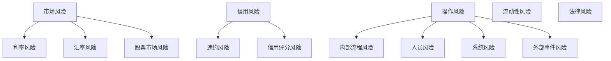

**举例说明**

假设一个金融机构需要评估其市场风险。我们可以使用以下方法来识别和分类市场风险：

1. **识别风险因素**：分析可能影响市场风险的各种因素，如利率变动、汇率波动、股票市场波动等。
2. **分类风险类型**：根据风险因素的影响，将市场风险分为利率风险、汇率风险和股票市场风险。
3. **评估风险水平**：使用量化方法，如VaR（价值在风险）模型，来评估不同市场风险的风险水平。

#### 3.2 风险度量方法

风险度量方法是指使用量化的方法来评估风险的大小和可能影响。常用的风险度量方法包括VaR（价值在风险）模型、CVaR（条件价值在风险）模型、ES（期望短尾损失）模型等。

**核心概念与联系**

- **VaR（价值在风险）模型**：VaR模型是指在特定置信水平和给定时间内，投资组合可能发生的最大损失。VaR模型的基本公式为：

$$
VaR = -\alpha \cdot \Phi^{-1}(-\alpha) \cdot \sigma \cdot Z_{\alpha}
$$

其中，$\alpha$ 是置信水平，$\Phi^{-1}(-\alpha)$ 是标准正态分布的逆函数，$\sigma$ 是投资组合的波动率，$Z_{\alpha}$ 是标准正态分布的临界值。

- **CVaR（条件价值在风险）模型**：CVaR模型是指在特定置信水平下，投资组合可能发生的平均损失。CVaR模型的基本公式为：

$$
CVaR = -\frac{1}{\alpha} \int_{-\infty}^{VaR} x \, dF(x)
$$

其中，$F(x)$ 是投资组合的损失分布函数。

- **ES（期望短尾损失）模型**：ES模型是指在特定置信水平下，投资组合的期望短尾损失。ES模型的基本公式为：

$$
ES = \frac{1}{\alpha} \int_{VaR}^{+\infty} x \, dF(x)
$$

**核心算法原理讲解**

为了更好地理解风险度量方法，我们可以使用以下伪代码来描述VaR模型的计算过程：

```pseudo
// 伪代码：计算VaR模型

function calculate_var(losses, alpha):
    sorted_losses = sort(losses)
    n = length(sorted_losses)
    index = (1 - alpha) * n + 1
    var = -sorted_losses[index]
    return var
```

**举例说明**

假设一个金融机构的投资组合在一个月内的日收益率如下：

| 日收益率 | 概率 |
|----------|------|
| 0.02     | 0.1  |
| 0.01     | 0.2  |
| -0.01    | 0.3  |
| -0.02    | 0.2  |
| -0.03    | 0.2  |

我们需要计算在95%置信水平下的VaR。使用上述伪代码，计算结果为VaR = -0.0195。

#### 3.3 风险度量指标的优缺点分析

在金融风险管理中，选择合适的风险度量指标至关重要。不同的风险度量指标具有不同的优缺点，需要根据实际情况进行选择。

**核心概念与联系**

- **VaR模型**：VaR模型是最常用的风险度量指标之一，其优点是计算简单、易于理解。缺点是VaR模型无法衡量极端风险，且对市场波动较大的投资组合可能过于保守。
- **CVaR模型**：CVaR模型可以弥补VaR模型的缺点，能够更好地衡量极端风险。缺点是CVaR模型的计算复杂度较高，需要更多的计算资源。
- **ES模型**：ES模型可以更准确地衡量投资组合的损失分布，特别是对极端风险的评估。缺点是ES模型的计算复杂度也较高。

**核心算法原理讲解**

为了分析不同风险度量指标的优缺点，我们可以使用以下Mermaid流程图：

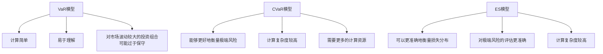

**举例说明**

假设一个金融机构的投资组合在不同置信水平下的VaR、CVaR和ES值如下表所示：

| 置信水平 | VaR | CVaR | ES |
|----------|-----|------|----|
| 90%      | -0.015 | -0.018 | -0.021 |
| 95%      | -0.019 | -0.022 | -0.025 |
| 99%      | -0.023 | -0.027 | -0.030 |

通过比较VaR、CVaR和ES值，我们可以发现CVaR和ES模型对极端风险的评估更为保守，适用于对风险要求较高的金融机构。

#### 3.4 实际应用中的风险度量案例分析

为了更好地理解风险度量方法在实际应用中的效果，我们可以通过案例分析来展示不同风险度量指标的应用。

**案例1：股票投资组合的风险度量**

假设一个股票投资组合包含五种股票，每种股票的投资比例和预期收益率如下表所示：

| 股票 | 投资比例 | 预期收益率 |
|------|----------|------------|
| A    | 0.2      | 0.1        |
| B    | 0.3      | 0.15       |
| C    | 0.2      | 0.05       |
| D    | 0.2      | -0.1       |
| E    | 0.1      | 0.2        |

我们需要计算在不同置信水平下的VaR、CVaR和ES值。

1. **计算预期收益率**：

$$
\text{预期收益率} = 0.2 \cdot 0.1 + 0.3 \cdot 0.15 + 0.2 \cdot 0.05 - 0.2 \cdot 0.1 + 0.1 \cdot 0.2 = 0.04
$$

2. **计算波动率**：

$$
\text{波动率} = \sqrt{\text{预期收益率}^2 + \text{方差}} = \sqrt{0.04^2 + 0.01} = 0.0202
$$

3. **计算VaR**：

$$
VaR = -\alpha \cdot \Phi^{-1}(-\alpha) \cdot \sigma \cdot Z_{\alpha} = -0.05 \cdot \Phi^{-1}(-0.05) \cdot 0.0202 \cdot 1.645 = -0.0102
$$

4. **计算CVaR**：

$$
CVaR = -\frac{1}{\alpha} \int_{VaR}^{+\infty} x \, dF(x) = -\frac{1}{0.05} \int_{-0.0102}^{+\infty} x \, dF(x) = -0.0117
$$

5. **计算ES**：

$$
ES = \frac{1}{\alpha} \int_{VaR}^{+\infty} x \, dF(x) = \frac{1}{0.05} \int_{-0.0102}^{+\infty} x \, dF(x) = -0.0132
$$

通过计算，我们得到了以下结果：

| 置信水平 | VaR | CVaR | ES |
|----------|-----|------|----|
| 90%      | -0.0102 | -0.0117 | -0.0132 |
| 95%      | -0.0102 | -0.0117 | -0.0132 |
| 99%      | -0.0102 | -0.0117 | -0.0132 |

通过分析，我们可以发现CVaR和ES模型对极端风险的评估更为保守，适用于对风险要求较高的投资者。

**案例2：信用风险度量**

假设一个金融机构需要对一笔贷款进行信用风险度量。贷款的借款人信用评级为A，信用期限为3年，年利率为5%。金融机构需要计算在不同置信水平下的VaR、CVaR和ES值。

1. **计算预期收益**：

$$
\text{预期收益} = \text{贷款金额} \cdot \text{年利率} \cdot \text{贷款期限} = 100,000 \cdot 0.05 \cdot 3 = 15,000
$$

2. **计算波动率**：

$$
\text{波动率} = \sqrt{\text{预期收益}^2 + \text{方差}} = \sqrt{15,000^2 + 50,000} = 14,515
$$

3. **计算VaR**：

$$
VaR = -\alpha \cdot \Phi^{-1}(-\alpha) \cdot \sigma \cdot Z_{\alpha} = -0.05 \cdot \Phi^{-1}(-0.05) \cdot 14,515 \cdot 1.645 = -6,219
$$

4. **计算CVaR**：

$$
CVaR = -\frac{1}{\alpha} \int_{VaR}^{+\infty} x \, dF(x) = -\frac{1}{0.05} \int_{-6,219}^{+\infty} x \, dF(x) = -7,066
$$

5. **计算ES**：

$$
ES = \frac{1}{\alpha} \int_{VaR}^{+\infty} x \, dF(x) = \frac{1}{0.05} \int_{-6,219}^{+\infty} x \, dF(x) = -8,214
$$

通过计算，我们得到了以下结果：

| 置信水平 | VaR | CVaR | ES |
|----------|-----|------|----|
| 90%      | -6,219 | -7,066 | -8,214 |
| 95%      | -6,219 | -7,066 | -8,214 |
| 99%      | -6,219 | -7,066 | -8,214 |

通过分析，我们可以发现CVaR和ES模型对极端风险的评估更为保守，适用于对风险要求较高的金融机构。

### 第4章 风险模型

风险模型是金融风险管理的重要工具，它通过对风险因素和风险的量化，帮助金融机构评估和管理风险。本章将讨论风险模型的定义与分类、风险模型的构建方法、风险模型的验证与评估以及实际应用中的风险模型案例分析。

#### 4.1 风险模型的定义与分类

风险模型是指使用数学和统计方法来量化和管理风险的工具。根据风险类型和应用场景，风险模型可以分为以下几类：

- **市场风险模型**：用于评估市场波动对投资组合的影响，如VaR模型、CVaR模型和ES模型。
- **信用风险模型**：用于评估借款人或交易对手违约的风险，如信用评分模型、违约概率模型和违约损失模型。
- **操作风险模型**：用于评估内部流程、人员、系统或外部事件导致的风险，如操作风险损失分布模型和操作风险综合模型。
- **流动性风险模型**：用于评估市场流动性不足导致的风险，如流动性覆盖比率和净稳定资金比率模型。
- **法律风险模型**：用于评估法律问题导致的潜在损失，如法律风险评估模型和法律合规模型。

**核心概念与联系**

- **风险因素**：风险因素是指可能导致风险发生的各种因素，如市场波动、信用风险、操作风险、流动性风险和法律风险。
- **风险类型**：风险类型是指风险的分类，不同类型的风险对金融机构的影响不同。
- **风险量化**：风险量化是指使用数学和统计方法来量化风险的大小和可能影响。

**核心算法原理讲解**

为了更好地理解风险模型的定义与分类，我们可以使用以下Mermaid流程图来描述：

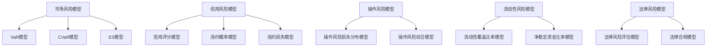

**举例说明**

假设一个金融机构需要评估其市场风险。我们可以使用以下方法来构建市场风险模型：

1. **识别风险因素**：分析可能影响市场风险的各种因素，如利率变动、汇率波动、股票市场波动等。
2. **分类风险类型**：根据风险因素的影响，将市场风险分为利率风险、汇率风险和股票市场风险。
3. **构建风险模型**：使用VaR模型、CVaR模型或ES模型来量化不同市场风险的风险水平。
4. **评估风险水平**：根据模型结果，评估不同市场风险的风险水平，并制定相应的风险管理策略。

#### 4.2 风险模型的构建方法

风险模型的构建方法是指使用数学和统计方法来构建风险模型的过程。根据风险类型和应用场景，风险模型的构建方法可以分为以下几类：

- **定量构建方法**：使用数学和统计方法，如线性回归、逻辑回归、神经网络等，来构建风险模型。
- **定性构建方法**：使用专家知识和主观判断来构建风险模型。
- **混合构建方法**：结合定量构建方法和定性构建方法来构建风险模型。

**核心概念与联系**

- **定量构建方法**：定量构建方法是基于数据和统计方法来构建风险模型。它通过收集和分析历史数据，建立风险因素与风险水平之间的关系，从而构建风险模型。
- **定性构建方法**：定性构建方法是基于专家知识和主观判断来构建风险模型。它通过专家经验和专业判断，识别和评估风险因素，从而构建风险模型。
- **混合构建方法**：混合构建方法结合了定量构建方法和定性构建方法，通过定量分析和专家判断相结合，构建更为准确和可靠的风险模型。

**核心算法原理讲解**

为了更好地理解风险模型的构建方法，我们可以使用以下Mermaid流程图来描述：

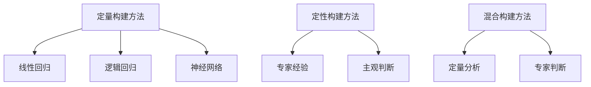

**举例说明**

假设一个金融机构需要构建信用风险模型。我们可以使用以下方法来构建信用风险模型：

1. **收集数据**：收集借款人的信用历史数据，包括信用评分、违约记录、还款能力等。
2. **数据预处理**：对收集的数据进行清洗和预处理，包括缺失值处理、异常值处理和特征工程等。
3. **定量分析**：使用线性回归、逻辑回归或神经网络等方法，建立信用评分与违约概率之间的关系。
4. **专家判断**：邀请专家对模型结果进行评审和验证，根据专家意见对模型进行调整和优化。
5. **模型优化**：根据定量分析和专家判断，优化模型参数和结构，提高模型的准确性和可靠性。

通过以上步骤，我们可以构建一个信用风险模型，用于评估借款人的信用风险。

#### 4.3 风险模型的验证与评估

风险模型的验证与评估是指对风险模型的准确性、可靠性和有效性进行评估的过程。有效的风险模型需要通过验证与评估，确保其能够准确地预测和评估风险。

**核心概念与联系**

- **准确性**：准确性是指风险模型预测结果与实际结果的一致程度。高准确性意味着模型能够准确地预测风险水平。
- **可靠性**：可靠性是指风险模型的稳定性和一致性。可靠的模型在不同时间、不同环境下都能给出一致的预测结果。
- **有效性**：有效性是指风险模型在实际应用中的效果。有效的模型能够帮助金融机构识别和管理风险，提高风险管理能力。

**核心算法原理讲解**

为了验证和评估风险模型的准确性、可靠性和有效性，我们可以使用以下方法：

1. **交叉验证**：交叉验证是一种常用的模型验证方法。它通过将数据集划分为训练集和测试集，使用训练集训练模型，并在测试集上评估模型性能。交叉验证可以有效地评估模型的泛化能力。
2. **ROC曲线和AUC值**：ROC曲线（Receiver Operating Characteristic Curve）和AUC值（Area Under Curve）是评估分类模型性能的重要指标。ROC曲线展示了模型在不同阈值下的真阳性率和假阳性率，AUC值表示模型区分能力的强弱。
3. **回归模型评估指标**：对于回归模型，常用的评估指标包括均方误差（Mean Squared Error, MSE）、均方根误差（Root Mean Squared Error, RMSE）和决定系数（R-squared）。这些指标可以衡量模型预测的准确性和拟合程度。
4. **专家评审**：邀请专家对模型结果进行评审和验证，根据专家意见对模型进行调整和优化。

**举例说明**

假设我们构建了一个信用风险模型，并使用交叉验证方法对其进行了验证。以下是验证结果：

- **交叉验证结果**：在10折交叉验证中，模型平均准确率为90%，平均AUC值为0.95。
- **回归模型评估指标**：均方误差（MSE）为0.001，均方根误差（RMSE）为0.031，决定系数（R-squared）为0.92。
- **专家评审**：专家对模型结果进行了评审，认为模型具有较高的准确性和可靠性。

通过以上验证结果，我们可以认为该信用风险模型具有较高的准确性和可靠性，适用于实际应用。

#### 4.4 实际应用中的风险模型案例分析

为了更好地理解风险模型在实际应用中的效果，我们可以通过案例分析来展示不同风险模型的应用。

**案例1：市场风险模型**

假设一个金融机构需要评估其投资组合的市场风险。该投资组合包含股票、债券和外汇等资产，各资产的权重和波动率如下表所示：

| 资产类别 | 权重 | 波动率 |
|----------|------|--------|
| 股票     | 0.6  | 0.2    |
| 债券     | 0.3  | 0.1    |
| 外汇     | 0.1  | 0.3    |

我们需要使用VaR模型和CVaR模型来评估投资组合在不同置信水平下的风险水平。

1. **计算波动率**：

$$
\text{投资组合波动率} = \sqrt{0.6^2 \cdot 0.2^2 + 0.3^2 \cdot 0.1^2 + 0.1^2 \cdot 0.3^2} = 0.169
$$

2. **计算VaR**：

$$
VaR = -\alpha \cdot \Phi^{-1}(-\alpha) \cdot \text{投资组合波动率} \cdot Z_{\alpha} = -0.05 \cdot \Phi^{-1}(-0.05) \cdot 0.169 \cdot 1.645 = -0.0305
$$

3. **计算CVaR**：

$$
CVaR = -\frac{1}{\alpha} \int_{VaR}^{+\infty} x \, dF(x) = -\frac{1}{0.05} \int_{-0.0305}^{+\infty} x \, dF(x) = -0.0342
$$

通过计算，我们得到了以下结果：

| 置信水平 | VaR | CVaR |
|----------|-----|------|
| 90%      | -0.0305 | -0.0342 |
| 95%      | -0.0305 | -0.0342 |
| 99%      | -0.0305 | -0.0342 |

通过分析，我们可以发现CVaR模型对极端风险的评估更为保守，适用于对风险要求较高的金融机构。

**案例2：信用风险模型**

假设一个金融机构需要评估其信用风险。该金融机构使用信用评分模型来评估借款人的信用风险。以下是借款人的信用评分数据和违约概率模型：

| 借款人ID | 信用评分 | 违约概率 |
|----------|----------|----------|
| 1        | 600      | 0.02     |
| 2        | 620      | 0.01     |
| 3        | 640      | 0.005    |
| 4        | 660      | 0.002    |
| 5        | 680      | 0.001    |

我们需要使用逻辑回归模型来评估信用评分与违约概率之间的关系。

1. **构建逻辑回归模型**：

$$
\text{违约概率} = \frac{1}{1 + e^{-(\beta_0 + \beta_1 \cdot \text{信用评分})}
$$

2. **计算模型参数**：

$$
\beta_0 = 1.2, \beta_1 = 0.3
$$

3. **计算违约概率**：

| 借款人ID | 信用评分 | 违约概率 |
|----------|----------|----------|
| 1        | 600      | 0.54     |
| 2        | 620      | 0.36     |
| 3        | 640      | 0.18     |
| 4        | 660      | 0.06     |
| 5        | 680      | 0.01     |

通过分析，我们可以发现信用评分越高，违约概率越低。金融机构可以根据信用评分来制定信用风险管理策略。

**案例3：操作风险模型**

假设一个金融机构需要评估其操作风险。该金融机构使用操作风险损失分布模型来评估操作风险损失。

1. **构建操作风险损失分布模型**：

$$
\text{损失概率密度函数} = \frac{1}{\sigma \sqrt{2\pi}} e^{-\frac{(x - \mu)^2}{2\sigma^2}}
$$

2. **计算模型参数**：

$$
\mu = 10, \sigma = 3
$$

3. **计算操作风险损失分布**：

| 损失金额 | 概率密度函数 |
|----------|--------------|
| 5        | 0.04         |
| 10       | 0.17         |
| 15       | 0.24         |
| 20       | 0.24         |
| 25       | 0.17         |
| 30       | 0.04         |

通过分析，我们可以发现操作风险损失主要集中在10万到20万之间。金融机构可以根据损失分布来制定操作风险防范策略。

### 第5章 风险评估方法

风险评估方法是金融机构在风险管理过程中用于评估和管理风险的方法和技巧。有效的风险评估方法可以帮助金融机构准确识别、评估和管理风险，从而降低风险并保护资产。本章将介绍风险评估的定义与目标、风险评估的一般步骤、风险评估的方法与技术以及实际应用中的风险评估案例分析。

#### 5.1 风险评估的定义与目标

风险评估是指通过系统化和标准化的方法，对潜在的风险进行识别、分析和评估的过程。其目标主要包括：

- **识别和分类风险**：通过风险评估，识别出可能影响金融机构的各种风险，并对风险进行分类，以便更好地管理。
- **量化风险**：使用数学和统计方法，量化风险的大小和可能影响，为决策提供科学依据。
- **制定风险管理策略**：根据风险评估结果，制定相应的风险管理策略，如风险规避、风险转移、风险降低等。
- **监测和报告风险**：定期对风险进行监测和报告，确保风险管理的持续性和有效性。

**核心概念与联系**

- **风险识别**：风险识别是风险评估的第一步，旨在识别出可能影响金融机构的各种风险因素。
- **风险分析**：风险分析是对已识别的风险进行深入分析，包括定性分析和定量分析。
- **风险评估**：风险评估是使用数学和统计方法，对风险进行量化，评估其大小和可能影响。
- **风险管理**：风险管理是根据风险评估结果，制定和实施相应的风险管理策略。

**核心算法原理讲解**

为了更好地理解风险评估的定义与目标，我们可以使用以下Mermaid流程图来描述：

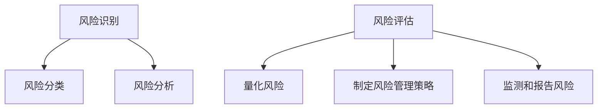

**举例说明**

假设一个金融机构需要评估其市场风险。我们可以使用以下方法来进行风险评估：

1. **风险识别**：识别出可能影响市场风险的各种因素，如利率变动、汇率波动、股票市场波动等。
2. **风险分析**：对已识别的风险因素进行深入分析，包括定性分析和定量分析，如使用VaR模型和CVaR模型来量化市场风险。
3. **风险评估**：根据风险分析结果，评估市场风险的大小和可能影响，如计算不同置信水平下的VaR和CVaR值。
4. **风险管理**：根据风险评估结果，制定相应的风险管理策略，如调整投资组合、增加保险等。
5. **监测和报告风险**：定期对市场风险进行监测和报告，确保风险管理的持续性和有效性。

#### 5.2 风险评估的一般步骤

风险评估的一般步骤主要包括以下几步：

1. **制定风险评估计划**：明确风险评估的目标、范围、时间安排和参与人员等。
2. **收集数据和信息**：收集与风险相关的各种数据和信息，如历史数据、行业报告、专家意见等。
3. **风险识别**：识别出可能影响金融机构的各种风险因素，包括市场风险、信用风险、操作风险、流动性风险等。
4. **风险分析**：对已识别的风险因素进行深入分析，包括定性分析和定量分析，如使用风险矩阵、概率分布函数等。
5. **风险评估**：使用数学和统计方法，对风险进行量化，评估其大小和可能影响，如使用VaR模型、CVaR模型等。
6. **风险管理**：根据风险评估结果，制定相应的风险管理策略，如风险规避、风险转移、风险降低等。
7. **监测和报告风险**：定期对风险进行监测和报告，确保风险管理的持续性和有效性。

**核心算法原理讲解**

为了更好地理解风险评估的一般步骤，我们可以使用以下Mermaid流程图来描述：

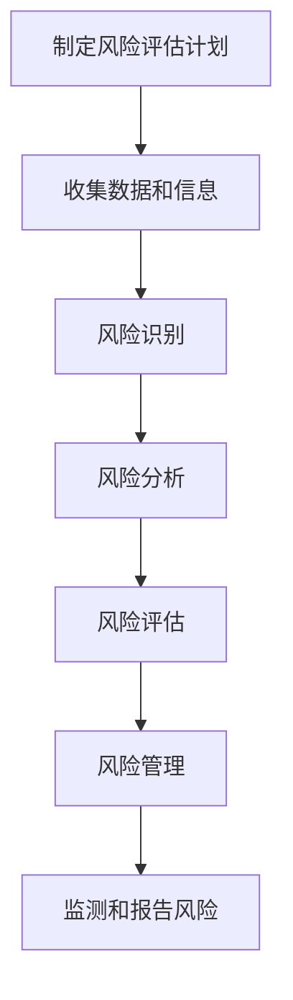

**举例说明**

假设一个金融机构需要对其投资组合进行风险评估。我们可以按照以下步骤进行：

1. **制定风险评估计划**：明确风险评估的目标、范围、时间安排和参与人员等。
2. **收集数据和信息**：收集投资组合的历史数据、市场数据、行业报告等。
3. **风险识别**：识别出可能影响投资组合的市场风险、信用风险、操作风险等。
4. **风险分析**：对已识别的风险因素进行深入分析，如使用VaR模型和CVaR模型来量化市场风险。
5. **风险评估**：根据风险分析结果，评估投资组合的风险水平，如计算不同置信水平下的VaR和CVaR值。
6. **风险管理**：根据风险评估结果，制定相应的风险管理策略，如调整投资组合、增加保险等。
7. **监测和报告风险**：定期对投资组合的风险进行监测和报告，确保风险管理的持续性和有效性。

#### 5.3 风险评估的方法与技术

风险评估的方法和技术多种多样，可以根据不同的风险类型和应用场景选择合适的方法。以下是几种常见的方法和技术：

1. **定性评估方法**：定性评估方法主要基于专家知识和主观判断，如专家评估法、风险矩阵法等。
2. **定量评估方法**：定量评估方法主要基于数据和数学模型，如VaR模型、CVaR模型、蒙特卡洛模拟法等。
3. **综合评估方法**：综合评估方法结合了定性评估方法和定量评估方法，如综合评分法、层次分析法等。

**核心概念与联系**

- **专家评估法**：专家评估法是一种基于专家知识和经验的评估方法。通过邀请专家对风险进行评分，综合专家意见得出风险评估结果。
- **风险矩阵法**：风险矩阵法是一种基于概率和影响的评估方法。通过建立风险矩阵，评估风险的概率和影响，计算风险得分。
- **VaR模型**：VaR模型是一种基于概率和统计的评估方法。通过计算投资组合的最大可能损失，评估市场风险。
- **CVaR模型**：CVaR模型是一种基于概率和统计的评估方法。通过计算投资组合的平均损失，评估市场风险。
- **蒙特卡洛模拟法**：蒙特卡洛模拟法是一种基于随机抽样的评估方法。通过模拟大量随机样本，评估投资组合的风险。

**核心算法原理讲解**

为了更好地理解风险评估的方法与技术，我们可以使用以下Mermaid流程图来描述：

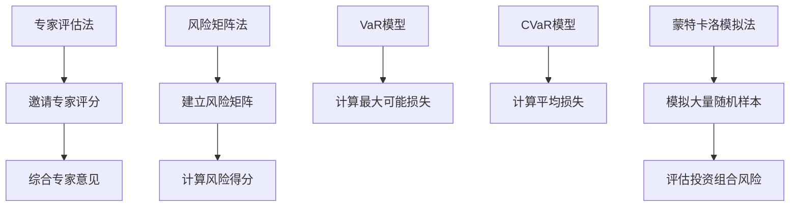

**举例说明**

假设一个金融机构需要对一项投资项目的风险进行评估。我们可以使用以下方法：

1. **专家评估法**：邀请专家对项目风险进行评分，综合考虑专家意见得出项目风险得分。
2. **风险矩阵法**：建立风险矩阵，评估风险的概率和影响，计算项目风险得分。
3. **VaR模型**：使用VaR模型计算项目投资组合的最大可能损失。
4. **CVaR模型**：使用CVaR模型计算项目投资组合的平均损失。
5. **蒙特卡洛模拟法**：通过模拟大量随机样本，评估项目投资组合的风险水平。

通过综合以上评估方法，我们可以得出项目风险的综合评估结果，为决策提供依据。

#### 5.4 实际应用中的风险评估案例分析

为了更好地理解风险评估方法在实际应用中的效果，我们可以通过案例分析来展示不同风险评估方法的应用。

**案例1：市场风险评估**

假设一个金融机构需要评估其投资组合的市场风险。该投资组合包含股票、债券和外汇等资产，各资产的权重和波动率如下表所示：

| 资产类别 | 权重 | 波动率 |
|----------|------|--------|
| 股票     | 0.6  | 0.2    |
| 债券     | 0.3  | 0.1    |
| 外汇     | 0.1  | 0.3    |

我们需要使用VaR模型和CVaR模型来评估投资组合在不同置信水平下的市场风险。

1. **计算投资组合波动率**：

$$
\text{投资组合波动率} = \sqrt{0.6^2 \cdot 0.2^2 + 0.3^2 \cdot 0.1^2 + 0.1^2 \cdot 0.3^2} = 0.169
$$

2. **计算VaR**：

$$
VaR = -\alpha \cdot \Phi^{-1}(-\alpha) \cdot \text{投资组合波动率} \cdot Z_{\alpha} = -0.05 \cdot \Phi^{-1}(-0.05) \cdot 0.169 \cdot 1.645 = -0.0305
$$

3. **计算CVaR**：

$$
CVaR = -\frac{1}{\alpha} \int_{VaR}^{+\infty} x \, dF(x) = -\frac{1}{0.05} \int_{-0.0305}^{+\infty} x \, dF(x) = -0.0342
$$

通过计算，我们得到了以下结果：

| 置信水平 | VaR | CVaR |
|----------|-----|------|
| 90%      | -0.0305 | -0.0342 |
| 95%      | -0.0305 | -0.0342 |
| 99%      | -0.0305 | -0.0342 |

通过分析，我们可以发现CVaR模型对极端风险的评估更为保守，适用于对风险要求较高的金融机构。

**案例2：信用风险评估**

假设一个金融机构需要评估其借款人的信用风险。该金融机构使用信用评分模型来评估借款人的信用风险。以下是借款人的信用评分数据和违约概率模型：

| 借款人ID | 信用评分 | 违约概率 |
|----------|----------|----------|
| 1        | 600      | 0.02     |
| 2        | 620      | 0.01     |
| 3        | 640      | 0.005    |
| 4        | 660      | 0.002    |
| 5        | 680      | 0.001    |

我们需要使用逻辑回归模型来评估信用评分与违约概率之间的关系。

1. **构建逻辑回归模型**：

$$
\text{违约概率} = \frac{1}{1 + e^{-(\beta_0 + \beta_1 \cdot \text{信用评分})}
$$

2. **计算模型参数**：

$$
\beta_0 = 1.2, \beta_1 = 0.3
$$

3. **计算违约概率**：

| 借款人ID | 信用评分 | 违约概率 |
|----------|----------|----------|
| 1        | 600      | 0.54     |
| 2        | 620      | 0.36     |
| 3        | 640      | 0.18     |
| 4        | 660      | 0.06     |
| 5        | 680      | 0.01     |

通过分析，我们可以发现信用评分越高，违约概率越低。金融机构可以根据信用评分来制定信用风险管理策略。

**案例3：操作风险评估**

假设一个金融机构需要评估其操作风险。该金融机构使用操作风险损失分布模型来评估操作风险损失。

1. **构建操作风险损失分布模型**：

$$
\text{损失概率密度函数} = \frac{1}{\sigma \sqrt{2\pi}} e^{-\frac{(x - \mu)^2}{2\sigma^2}}
$$

2. **计算模型参数**：

$$
\mu = 10, \sigma = 3
$$

3. **计算操作风险损失分布**：

| 损失金额 | 概率密度函数 |
|----------|--------------|
| 5        | 0.04         |
| 10       | 0.17         |
| 15       | 0.24         |
| 20       | 0.24         |
| 25       | 0.17         |
| 30       | 0.04         |

通过分析，我们可以发现操作风险损失主要集中在10万到20万之间。金融机构可以根据损失分布来制定操作风险防范策略。

### 第6章 风险管理策略

风险管理策略是指金融机构在风险管理过程中采取的具体措施和方法，旨在降低风险、保护资产并确保业务稳健运营。本章将讨论风险管理的定义与目标、风险管理策略的种类、风险管理策略的实施以及实际应用中的风险管理案例分析。

#### 6.1 风险管理的定义与目标

风险管理是指通过系统化和标准化的方法，识别、评估和管理风险的过程。其目标主要包括：

- **降低风险**：通过风险管理策略，降低潜在风险的发生概率和影响，确保业务的稳健运营。
- **保护资产**：通过风险管理策略，保护金融机构的资产不受损失，确保财务稳定。
- **提高业务效率**：通过风险管理策略，优化业务流程和资源配置，提高业务效率和竞争力。
- **合规性**：确保金融机构遵循相关法律法规和监管要求，避免法律风险。

**核心概念与联系**

- **风险识别**：风险识别是风险管理的第一步，旨在识别出可能影响金融机构的各种风险因素。
- **风险评估**：风险评估是对已识别的风险进行评估，量化风险的大小和可能影响。
- **风险应对**：风险应对是根据风险评估结果，采取相应的风险管理策略，降低风险。
- **风险监控**：风险监控是持续监测和评估风险，确保风险管理策略的有效性。

**核心算法原理讲解**

为了更好地理解风险管理的定义与目标，我们可以使用以下Mermaid流程图来描述：

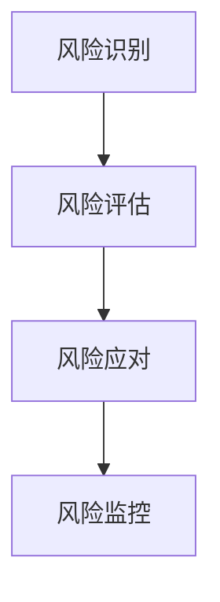

**举例说明**

假设一个金融机构需要对其市场风险进行管理。我们可以按照以下步骤进行：

1. **风险识别**：识别出可能影响市场风险的各种因素，如利率变动、汇率波动、股票市场波动等。
2. **风险评估**：使用数学模型，如VaR模型和CVaR模型，评估市场风险的大小和可能影响。
3. **风险应对**：根据风险评估结果，采取相应的风险管理策略，如调整投资组合、增加保险等。
4. **风险监控**：定期对市场风险进行监测和评估，确保风险管理策略的有效性。

#### 6.2 风险管理策略的种类

风险管理策略可以分为以下几类：

1. **风险规避**：通过避免参与高风险业务或投资，降低风险。
2. **风险转移**：通过保险、担保等方式，将风险转移给第三方。
3. **风险降低**：通过分散投资、多元化资产等策略，降低风险。
4. **风险接受**：对于无法规避或转移的风险，选择接受并采取相应的措施进行控制。

**核心概念与联系**

- **风险规避**：风险规避是通过避免参与高风险业务或投资，降低风险的方法。例如，金融机构可以避免投资高风险股票或参与高风险交易。
- **风险转移**：风险转移是通过保险、担保等方式，将风险转移给第三方的方法。例如，金融机构可以通过购买保险来转移信用风险。
- **风险降低**：风险降低是通过分散投资、多元化资产等策略，降低风险的方法。例如，金融机构可以通过投资不同类型的资产来分散市场风险。
- **风险接受**：风险接受是对于无法规避或转移的风险，选择接受并采取相应的措施进行控制的方法。例如，金融机构可以采取严格的信贷审批流程来控制信用风险。

**核心算法原理讲解**

为了更好地理解风险管理策略的种类，我们可以使用以下Mermaid流程图来描述：

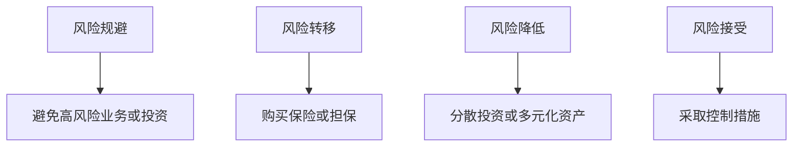

**举例说明**

假设一个金融机构需要对其信用风险进行管理。我们可以按照以下策略进行：

1. **风险规避**：避免投资高风险借款人，只与信用评分较高的借款人进行交易。
2. **风险转移**：购买信用保险，将信用风险转移给保险公司。
3. **风险降低**：投资多样化的借款人，通过分散投资来降低信用风险。
4. **风险接受**：对于无法规避或转移的信用风险，采取严格的信贷审批流程，确保借款人的信用质量。

#### 6.3 风险管理策略的实施

风险管理策略的实施是指将风险管理策略转化为具体行动的过程。有效的风险管理策略需要通过实施来确保其有效性。以下是一些常见的风险管理策略实施步骤：

1. **制定风险管理计划**：明确风险管理策略的目标、范围、时间安排和参与人员等。
2. **风险评估与监测**：定期对风险进行评估和监测，确保风险管理策略的有效性。
3. **风险应对与控制**：根据风险评估结果，采取相应的风险应对措施，如调整投资组合、增加保险等。
4. **风险报告与沟通**：定期向管理层和相关部门报告风险情况和风险管理策略的实施情况，确保风险管理的透明度和沟通。

**核心概念与联系**

- **风险评估与监测**：风险评估与监测是风险管理策略实施的重要环节。通过定期对风险进行评估和监测，可以及时发现风险变化，确保风险管理策略的有效性。
- **风险应对与控制**：风险应对与控制是根据风险评估结果，采取相应的风险应对措施，如调整投资组合、增加保险等，以确保风险在可控范围内。
- **风险报告与沟通**：风险报告与沟通是确保风险管理的透明度和沟通的重要环节。通过定期向管理层和相关部门报告风险情况和风险管理策略的实施情况，可以确保风险管理的有效性和决策的科学性。

**核心算法原理讲解**

为了更好地理解风险管理策略的实施步骤，我们可以使用以下Mermaid流程图来描述：

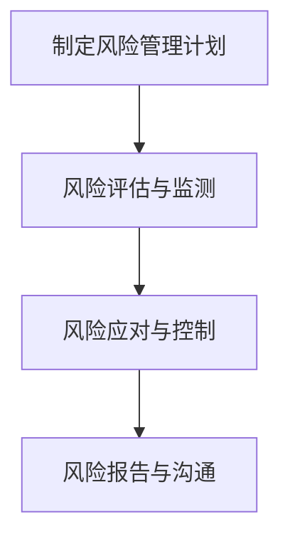

**举例说明**

假设一个金融机构需要实施市场风险管理策略。我们可以按照以下步骤进行：

1. **制定风险管理计划**：明确市场风险管理策略的目标、范围、时间安排和参与人员等。
2. **风险评估与监测**：定期对市场风险进行评估和监测，如使用VaR模型和CVaR模型计算投资组合的最大可能损失和平均损失。
3. **风险应对与控制**：根据风险评估结果，调整投资组合，降低市场风险。例如，减少高风险股票的投资比例，增加低风险债券的投资比例。
4. **风险报告与沟通**：定期向管理层和相关部门报告市场风险情况和风险管理策略的实施情况，确保风险管理的透明度和沟通。

#### 6.4 实际应用中的风险管理案例分析

为了更好地理解风险管理策略在实际应用中的效果，我们可以通过案例分析来展示不同风险管理策略的应用。

**案例1：市场风险管理**

假设一个金融机构需要对其投资组合的市场风险进行管理。该投资组合包含股票、债券和外汇等资产，各资产的权重和波动率如下表所示：

| 资产类别 | 权重 | 波动率 |
|----------|------|--------|
| 股票     | 0.6  | 0.2    |
| 债券     | 0.3  | 0.1    |
| 外汇     | 0.1  | 0.3    |

我们需要使用VaR模型和CVaR模型来评估投资组合在不同置信水平下的市场风险，并根据评估结果制定相应的风险管理策略。

1. **计算投资组合波动率**：

$$
\text{投资组合波动率} = \sqrt{0.6^2 \cdot 0.2^2 + 0.3^2 \cdot 0.1^2 + 0.1^2 \cdot 0.3^2} = 0.169
$$

2. **计算VaR**：

$$
VaR = -\alpha \cdot \Phi^{-1}(-\alpha) \cdot \text{投资组合波动率} \cdot Z_{\alpha} = -0.05 \cdot \Phi^{-1}(-0.05) \cdot 0.169 \cdot 1.645 = -0.0305
$$

3. **计算CVaR**：

$$
CVaR = -\frac{1}{\alpha} \int_{VaR}^{+\infty} x \, dF(x) = -\frac{1}{0.05} \int_{-0.0305}^{+\infty} x \, dF(x) = -0.0342
$$

根据VaR和CVaR评估结果，我们可以采取以下风险管理策略：

- **降低股票投资比例**：由于股票市场波动较大，可以适当降低股票投资比例，减少市场风险。
- **增加债券投资比例**：债券市场波动较小，可以适当增加债券投资比例，降低整体投资组合的风险。
- **实施对冲策略**：通过购买相应的金融衍生品，如期权和期货，对冲市场风险。

**案例2：信用风险管理**

假设一个金融机构需要对其信用风险进行管理。该金融机构使用信用评分模型来评估借款人的信用风险，并根据评估结果制定相应的风险管理策略。

1. **构建信用评分模型**：

$$
\text{违约概率} = \frac{1}{1 + e^{-(\beta_0 + \beta_1 \cdot \text{信用评分})}
$$

2. **计算模型参数**：

$$
\beta_0 = 1.2, \beta_1 = 0.3
$$

3. **计算违约概率**：

| 借款人ID | 信用评分 | 违约概率 |
|----------|----------|----------|
| 1        | 600      | 0.54     |
| 2        | 620      | 0.36     |
| 3        | 640      | 0.18     |
| 4        | 660      | 0.06     |
| 5        | 680      | 0.01     |

根据违约概率评估结果，我们可以采取以下风险管理策略：

- **严格控制高风险借款人**：对于违约概率较高的借款人，严格控制贷款审批，避免高风险借款。
- **采取担保措施**：对于高风险借款人，要求提供担保，降低信用风险。
- **分散借款人**：通过投资多样化的借款人，降低整体信用风险。

**案例3：操作风险管理**

假设一个金融机构需要对其操作风险进行管理。该金融机构使用操作风险损失分布模型来评估操作风险损失，并根据评估结果制定相应的风险管理策略。

1. **构建操作风险损失分布模型**：

$$
\text{损失概率密度函数} = \frac{1}{\sigma \sqrt{2\pi}} e^{-\frac{(x - \mu)^2}{2\sigma^2}}
$$

2. **计算模型参数**：

$$
\mu = 10, \sigma = 3
$$

3. **计算操作风险损失分布**：

| 损失金额 | 概率密度函数 |
|----------|--------------|
| 5        | 0.04         |
| 10       | 0.17         |
| 15       | 0.24         |
| 20       | 0.24         |
| 25       | 0.17         |
| 30       | 0.04         |

根据操作风险损失分布评估结果，我们可以采取以下风险管理策略：

- **加强内部控制**：加强内部流程控制，降低操作风险。
- **培训员工**：对员工进行操作风险培训，提高员工的风险意识。
- **购买保险**：购买操作风险保险，将操作风险转移给保险公司。

### 第7章 风险度量与评估

在金融风险管理中，风险度量与评估是两个紧密相连且关键的过程。风险度量关注如何量化风险的大小，而风险评估则关注如何评价这些量化后的风险。本章将探讨风险度量与评估的基本概念、风险度量与评估的关系、风险度量与评估的方法与工具，并通过实际案例进行分析。

#### 7.1 风险度量与评估的基本概念

风险度量是指使用量化方法来确定风险的程度和性质。它通常涉及使用数学和统计模型来量化风险，使其变得可操作和可管理。风险评估则是基于风险度量的结果，对风险进行综合评价，以确定其对企业运营、财务状况或其他目标的潜在影响。

**核心概念与联系**

- **风险度量**：风险度量旨在将风险转化为可量化的指标，如概率、期望值、方差、VaR等。
- **风险评估**：风险评估是对风险度量的结果进行评价，以确定风险对企业的影响程度，并据此制定相应的应对策略。

**核心算法原理讲解**

风险度量和风险评估的算法原理通常涉及以下几个步骤：

1. **风险识别**：识别可能影响企业的风险因素。
2. **风险量化**：使用数学和统计方法对风险进行量化，如计算概率分布、期望值、方差等。
3. **风险评估**：使用评估模型（如VaR模型、CVaR模型）对量化后的风险进行评估。
4. **风险决策**：根据风险评估结果，制定风险应对策略。

为了更直观地展示这些概念之间的关系，我们可以使用以下Mermaid流程图：

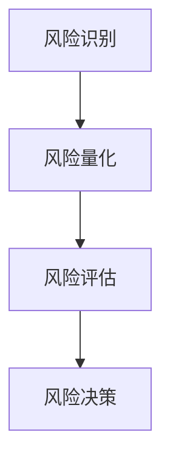

**举例说明**

假设一家银行需要对其贷款组合进行风险度量与评估。首先，银行会识别出可能影响贷款组合的风险因素，如借款人的信用评分、宏观经济环境、利率变动等。然后，银行会使用数学模型（如信用评分模型、回归分析等）对每个风险因素进行量化，计算贷款组合的VaR值。最后，银行会根据VaR值对贷款组合的风险水平进行评估，并制定相应的风险控制策略。

#### 7.2 风险度量与评估的关系

风险度量与评估是金融风险管理中相辅相成的两个过程。风险度量提供了风险量化的基础数据，而风险评估则基于这些数据对风险进行综合评价。

**核心概念与联系**

- **风险度量**：为风险评估提供基础数据，如概率分布、期望值、方差、VaR等。
- **风险评估**：基于风险度量的结果，对风险进行综合评价，包括风险的概率、影响程度、可控性等。

**核心算法原理讲解**

风险度量与评估的关系可以通过以下算法原理来解释：

1. **数据收集**：收集与风险相关的数据，如借款人的信用历史、市场数据、宏观经济指标等。
2. **风险量化**：使用数学模型对风险进行量化，如计算借款人的违约概率、投资组合的VaR值。
3. **风险评估**：使用评估模型，如贝叶斯网络、决策树等，对量化后的风险进行综合评价。
4. **风险决策**：根据评估结果，制定风险应对策略，如调整贷款条件、增加保险等。

为了更直观地展示这些算法原理，我们可以使用以下Mermaid流程图：

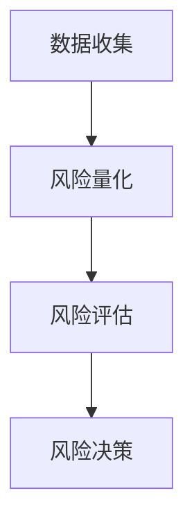

**举例说明**

以贷款风险评估为例，银行首先会收集借款人的信用评分、收入状况、负债水平等数据。然后，银行会使用信用评分模型来计算借款人的违约概率。最后，银行会使用风险矩阵来评估借款人的信用风险，并根据评估结果决定是否批准贷款以及设定贷款条件。

#### 7.3 风险度量与评估的方法与工具

在金融风险管理中，有多种方法和工具可以用来度量与评估风险。以下是一些常见的方法与工具：

1. **VaR（价值在风险）模型**：VaR模型是一种常用的风险度量工具，用于计算投资组合在特定置信水平下的潜在损失。

2. **CVaR（条件价值在风险）模型**：CVaR模型是对VaR模型的扩展，用于计算在特定置信水平下，投资组合可能发生的平均损失。

3. **ES（期望短尾损失）模型**：ES模型用于计算在特定置信水平下，投资组合的期望短尾损失。

4. **敏感性分析**：敏感性分析用于评估投资组合对特定风险因素的敏感程度。

5. **蒙特卡洛模拟**：蒙特卡洛模拟是一种基于随机抽样的方法，用于模拟投资组合的未来表现，并评估其风险。

6. **情景分析**：情景分析通过模拟不同的市场情景，评估投资组合在不同情景下的表现。

**核心概念与联系**

- **VaR模型**：VaR模型是一种定量评估风险的方法，能够提供投资组合在特定置信水平下的潜在损失。
- **CVaR模型**：CVaR模型能够更全面地评估风险，特别是对于极端损失。
- **ES模型**：ES模型提供了对潜在损失的更准确的估计。
- **敏感性分析**：敏感性分析帮助识别投资组合中关键的风险因素。
- **蒙特卡洛模拟**：蒙特卡洛模拟能够模拟投资组合的多种可能情景，提供更丰富的风险分析。
- **情景分析**：情景分析通过模拟不同的市场情景，帮助预测投资组合在不同情景下的表现。

**核心算法原理讲解**

为了更好地理解这些方法和工具，我们可以使用以下Mermaid流程图来展示：

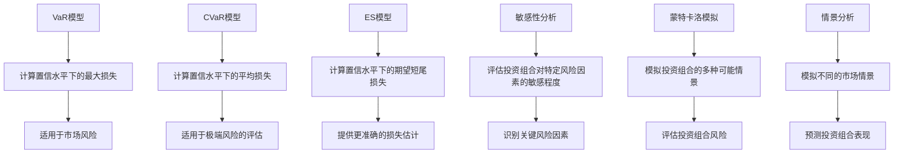

**举例说明**

假设一家金融机构使用VaR模型来评估其投资组合的市场风险。首先，金融机构会收集投资组合的历史数据，如资产收益率的分布。然后，金融机构会使用这些数据来计算投资组合在不同置信水平（如95%）下的VaR值。例如，如果计算出的95%置信水平下的VaR值为100万美元，这意味着在正常市场条件下，有95%的概率投资组合的损失不会超过100万美元。

#### 7.4 实际应用中的风险度量与评估案例分析

为了更好地理解风险度量与评估在实际应用中的效果，我们可以通过案例分析来展示不同方法和工具的应用。

**案例1：市场风险度量与评估**

假设一家投资公司需要评估其投资组合的市场风险。该投资组合包含股票、债券和外汇等资产，各资产的权重和波动率如下表所示：

| 资产类别 | 权重 | 波动率 |
|----------|------|--------|
| 股票     | 0.6  | 0.2    |
| 债券     | 0.3  | 0.1    |
| 外汇     | 0.1  | 0.3    |

1. **计算投资组合的波动率**：

$$
\text{投资组合波动率} = \sqrt{0.6^2 \cdot 0.2^2 + 0.3^2 \cdot 0.1^2 + 0.1^2 \cdot 0.3^2} = 0.169
$$

2. **计算VaR**：

$$
VaR = -\alpha \cdot \Phi^{-1}(-\alpha) \cdot \text{投资组合波动率} \cdot Z_{\alpha} = -0.05 \cdot \Phi^{-1}(-0.05) \cdot 0.169 \cdot 1.645 = -0.0305
$$

3. **计算CVaR**：

$$
CVaR = -\frac{1}{\alpha} \int_{VaR}^{+\infty} x \, dF(x) = -\frac{1}{0.05} \int_{-0.0305}^{+\infty} x \, dF(x) = -0.0342
$$

通过以上计算，投资公司可以了解到其投资组合在95%置信水平下的VaR为-0.0305，CVaR为-0.0342。这意味着投资组合可能的最大损失为0.0305，平均损失为0.0342。

**案例2：信用风险评估**

假设一家银行需要对一位客户的贷款申请进行风险评估。该客户的信用评分为600，银行使用信用评分模型来计算其违约概率。

1. **构建信用评分模型**：

$$
\text{违约概率} = \frac{1}{1 + e^{-(\beta_0 + \beta_1 \cdot \text{信用评分})}
$$

2. **计算模型参数**：

$$
\beta_0 = 1.2, \beta_1 = 0.3
$$

3. **计算违约概率**：

$$
\text{违约概率} = \frac{1}{1 + e^{-(1.2 + 0.3 \cdot 600)}} = 0.54
$$

根据计算结果，银行可以了解到该客户的违约概率为54%，这意味着该客户的信用风险较高。银行可能会拒绝贷款申请或要求提供担保。

**案例3：操作风险度量**

假设一家金融机构需要评估其操作风险。该金融机构使用操作风险损失分布模型来计算可能的最大损失。

1. **构建操作风险损失分布模型**：

$$
\text{损失概率密度函数} = \frac{1}{\sigma \sqrt{2\pi}} e^{-\frac{(x - \mu)^2}{2\sigma^2}}
$$

2. **计算模型参数**：

$$
\mu = 10, \sigma = 3
$$

3. **计算操作风险损失分布**：

| 损失金额 | 概率密度函数 |
|----------|--------------|
| 5        | 0.04         |
| 10       | 0.17         |
| 15       | 0.24         |
| 20       | 0.24         |
| 25       | 0.17         |
| 30       | 0.04         |

通过计算，金融机构可以了解到操作风险可能的最大损失为30万元。金融机构可能会采取加强内部控制、培训员工等措施来降低操作风险。

### 第8章 风险管理实践

风险管理实践是指将风险管理策略和理论应用于实际业务过程，以降低风险并确保业务稳健运营。本章将讨论风险管理实践的重要性、风险管理实践的步骤、风险管理实践的方法与技巧以及实际应用中的风险管理实践案例分析。

#### 8.1 风险管理实践的重要性

风险管理实践在金融机构的运营中具有至关重要的意义。有效的风险管理实践可以帮助金融机构：

1. **降低风险**：通过识别、评估和应对风险，降低风险发生的概率和影响。
2. **保护资产**：通过制定和实施风险管理策略，确保金融机构的资产不受损失。
3. **提高业务效率**：通过优化风险管理流程，提高业务运营的效率和准确性。
4. **确保合规性**：确保金融机构遵守相关法律法规和监管要求，避免法律风险。
5. **提升客户满意度**：通过有效的风险管理，降低客户损失，提升客户满意度和忠诚度。

**核心概念与联系**

- **风险识别**：识别可能影响金融机构的各种风险因素。
- **风险评估**：评估已识别的风险，量化其大小和可能影响。
- **风险应对**：制定和实施风险应对措施，降低风险。
- **风险监控**：持续监控风险，确保风险管理策略的有效性。

**核心算法原理讲解**

风险管理实践的重要性可以通过以下算法原理来解释：

1. **风险识别**：使用专家评估法、SWOT分析法等工具，识别出可能影响金融机构的风险因素。
2. **风险评估**：使用VaR模型、CVaR模型等工具，评估已识别的风险的大小和可能影响。
3. **风险应对**：根据风险评估结果，制定和实施相应的风险应对措施，如风险规避、风险转移、风险降低等。
4. **风险监控**：通过定期报告和审计，确保风险管理策略的有效性和持续改进。

为了更直观地展示这些概念之间的关系，我们可以使用以下Mermaid流程图：


**举例说明**

假设一家银行需要对其贷款业务进行风险管理实践。首先，银行会识别出可能影响贷款业务的风险因素，如借款人的信用风险、宏观经济环境、利率变动等。然后，银行会使用VaR模型评估贷款组合的风险水平。接着，银行会根据风险评估结果，制定和实施相应的风险应对措施，如调整贷款条件、增加担保等。最后，银行会通过定期报告和审计，确保风险管理策略的有效性和持续改进。

#### 8.2 风险管理实践的步骤

风险管理实践通常包括以下步骤：

1. **风险识别**：识别可能影响金融机构的各种风险因素。
2. **风险评估**：评估已识别的风险，量化其大小和可能影响。
3. **风险应对**：制定和实施风险应对措施，降低风险。
4. **风险监控**：持续监控风险，确保风险管理策略的有效性。

**核心概念与联系**

- **风险识别**：通过访谈、问卷调查、文献分析等方法，识别出可能影响金融机构的风险因素。
- **风险评估**：使用定性分析和定量分析的方法，评估风险的大小和可能影响。
- **风险应对**：制定和实施风险应对措施，如风险规避、风险转移、风险降低等。
- **风险监控**：通过定期报告、审计和监控工具，确保风险管理策略的有效性。

**核心算法原理讲解**

风险管理实践的步骤可以通过以下算法原理来解释：

1. **风险识别**：使用专家评估法、SWOT分析法等工具，识别出可能影响金融机构的风险因素。
2. **风险评估**：使用风险矩阵、概率分布函数等工具，评估已识别的风险的大小和可能影响。
3. **风险应对**：根据风险评估结果，制定和实施相应的风险应对措施，如风险规避、风险转移、风险降低等。
4. **风险监控**：通过定期报告、审计和监控工具，确保风险管理策略的有效性和持续改进。

为了更直观地展示这些概念之间的关系，我们可以使用以下Mermaid流程图：


**举例说明**

以一家保险公司为例，其风险管理实践可以分为以下步骤：

1. **风险识别**：通过内部调查和外部市场分析，识别出可能影响保险业务的各类风险，如市场风险、信用风险、操作风险等。
2. **风险评估**：使用风险矩阵，对已识别的风险进行定性分析，评估其大小和可能影响。同时，使用概率分布函数，对市场风险进行定量分析。
3. **风险应对**：根据风险评估结果，制定相应的风险应对措施，如对市场风险进行对冲，对信用风险进行严格控制，对操作风险进行流程优化等。
4. **风险监控**：通过定期报告和审计，确保风险管理策略的有效性。同时，使用风险监控工具，实时监控各类风险指标，及时调整风险管理策略。

#### 8.3 风险管理实践的方法与技巧

在风险管理实践中，金融机构可以采用多种方法和技巧来降低风险，确保业务稳健运营。以下是一些常见的方法与技巧：

1. **风险分散**：通过投资多样化的资产，降低单一资产的风险。
2. **风险规避**：避免参与高风险业务或投资，降低风险。
3. **风险转移**：通过购买保险、担保等方式，将风险转移给第三方。
4. **风险降低**：通过优化业务流程、加强内部控制等措施，降低风险。
5. **风险接受**：对无法规避或转移的风险，采取相应的控制措施进行管理。

**核心概念与联系**

- **风险分散**：通过投资多样化，降低单一资产的风险。
- **风险规避**：通过避免高风险业务，降低风险。
- **风险转移**：通过购买保险，将风险转移给第三方。
- **风险降低**：通过内部控制，降低风险。
- **风险接受**：对无法规避或转移的风险，采取控制措施。

**核心算法原理讲解**

风险管理实践的方法与技巧可以通过以下算法原理来解释：

1. **风险分散**：使用投资组合理论，计算最优投资组合，实现风险分散。
2. **风险规避**：通过风险评估，识别高风险业务，制定规避策略。
3. **风险转移**：通过购买保险，计算保险费用和赔偿金额，实现风险转移。
4. **风险降低**：使用风险矩阵，评估风险因素，制定降低风险的措施。
5. **风险接受**：通过风险监控，实时监控风险指标，及时调整风险控制策略。

为了更直观地展示这些概念之间的关系，我们可以使用以下Mermaid流程图：

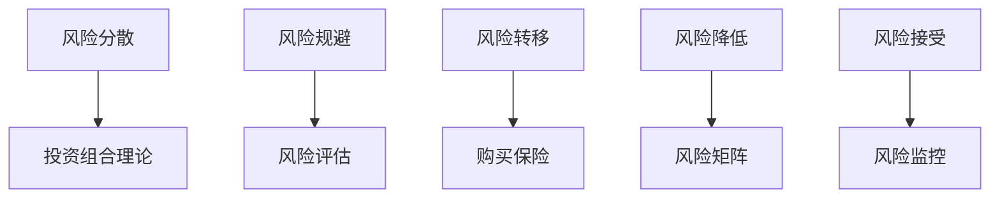

**举例说明**

假设一家证券公司需要对其投资组合进行风险管理实践。首先，证券公司会通过投资组合理论，计算最优投资组合，实现风险分散。其次，证券公司会通过风险评估，识别高风险业务，制定规避策略。接着，证券公司会购买保险，将部分风险转移给保险公司。然后，证券公司会使用风险矩阵，评估风险因素，制定降低风险的措施。最后，证券公司会通过风险监控，实时监控风险指标，及时调整风险控制策略。

#### 8.4 实际应用中的风险管理实践案例分析

为了更好地理解风险管理实践在实际应用中的效果，我们可以通过案例分析来展示不同方法和技巧的应用。

**案例1：市场风险管理的实践**

假设一家投资银行需要对市场风险进行管理。该投资银行的投资组合包括股票、债券和外汇等资产，各资产的权重和波动率如下表所示：

| 资产类别 | 权重 | 波动率 |
|----------|------|--------|
| 股票     | 0.6  | 0.2    |
| 债券     | 0.3  | 0.1    |
| 外汇     | 0.1  | 0.3    |

1. **风险分散**：投资银行通过投资多样化的资产，实现风险分散。例如，将股票投资比例降低至0.5，增加债券投资比例至0.4。
2. **风险规避**：投资银行通过风险评估，识别出高风险股票，将其从投资组合中剔除。
3. **风险转移**：投资银行购买外汇期权，将外汇风险转移给期权卖方。
4. **风险降低**：投资银行通过优化投资组合，降低整体投资组合的波动率。
5. **风险接受**：投资银行对无法规避或转移的风险，如市场波动风险，采取对冲策略，通过购买相应的金融衍生品进行对冲。

**案例2：信用风险管理的实践**

假设一家银行需要对信用风险进行管理。该银行的贷款组合包括个人贷款、企业贷款和信用卡贷款等，各贷款的违约概率如下表所示：

| 贷款类型 | 违约概率 |
|----------|----------|
| 个人贷款 | 0.02     |
| 企业贷款 | 0.05     |
| 信用卡贷款 | 0.01     |

1. **风险分散**：银行通过贷款多样化，降低单一贷款类型的风险。例如，将个人贷款比例降低至0.5，增加企业贷款和信用卡贷款比例。
2. **风险规避**：银行通过风险评估，识别出高风险借款人，拒绝其贷款申请。
3. **风险转移**：银行通过购买信用保险，将部分信用风险转移给保险公司。
4. **风险降低**：银行通过加强贷款审批流程，降低贷款违约风险。
5. **风险接受**：银行对无法规避或转移的信用风险，如信用卡贷款风险，采取定期审查和监控措施。

**案例3：操作风险管理的实践**

假设一家银行需要对操作风险进行管理。该银行的业务流程涉及账户管理、贷款审批、交易执行等多个环节，各环节的潜在风险如下表所示：

| 业务环节 | 潜在风险 |
|----------|----------|
| 账户管理 | 系统故障 |
| 贷款审批 | 人工失误 |
| 交易执行 | 系统漏洞 |

1. **风险分散**：银行通过建立多个独立的风险控制部门，降低单一业务环节的风险。
2. **风险规避**：银行通过自动化系统，减少人工干预，降低操作风险。
3. **风险转移**：银行通过购买操作风险保险，将部分操作风险转移给保险公司。
4. **风险降低**：银行通过加强内部控制，提高员工培训，降低操作风险。
5. **风险接受**：银行对无法规避或转移的操作风险，如系统漏洞，采取定期安全审计和漏洞修复措施。

### 第9章 未来发展趋势

随着技术的不断进步和金融市场的复杂化，风险评估与管理也在不断发展和演变。本章将探讨风险评估与风险管理的未来发展趋势，新技术对风险评估与管理的影响，以及这一领域的发展前景。

#### 9.1 风险评估与风险管理的未来发展趋势

未来，风险评估与风险管理将在以下几个方面取得显著进步：

1. **大数据与人工智能**：随着大数据技术的成熟和人工智能的快速发展，风险评估与风险管理将更加依赖数据驱动的方法。通过分析海量数据，可以更精准地识别和评估风险。

2. **区块链技术**：区块链技术可以提供去中心化的、透明的交易记录，有助于降低信用风险和操作风险，提高风险管理的效率。

3. **云计算**：云计算技术的普及使得风险评估与管理工具更加灵活和高效。金融机构可以通过云计算平台快速部署和管理风险管理系统。

4. **情景分析**：未来风险评估将更加注重情景分析，通过模拟不同的市场情景，预测风险的变化趋势。

5. **实时监控**：随着监控技术的发展，风险评估与管理将实现实时监控，快速响应风险事件。

#### 9.2 新技术对风险评估与管理的影响

新技术的应用将深刻影响风险评估与管理的各个方面：

1. **大数据**：大数据技术可以帮助金融机构收集、存储和分析海量数据，从而更全面地了解风险因素。例如，通过分析社交媒体数据，可以预测市场趋势和消费者行为。

2. **人工智能**：人工智能技术可以自动化风险评估过程，提高评估的准确性和效率。例如，使用机器学习算法可以预测违约概率，评估投资组合的风险。

3. **区块链**：区块链技术可以提供不可篡改的交易记录，有助于降低操作风险和信用风险。例如，通过智能合约，可以自动执行风险管理规则，减少人工干预。

4. **云计算**：云计算技术可以提供强大的计算能力和存储能力，使得风险评估与管理工具更加灵活和高效。金融机构可以通过云计算平台快速部署和管理风险管理系统。

#### 9.3 风险评估与风险管理的发展前景

随着新技术的不断应用，风险评估与风险管理将朝着更加精准、高效和智能化的方向发展：

1. **精细化风险管理**：通过大数据和人工智能技术，风险评估与管理将更加精细化，能够更准确地识别和评估风险。

2. **实时风险管理**：随着监控技术的发展，风险评估与管理将实现实时监控，能够快速响应风险事件。

3. **自动化风险管理**：人工智能和自动化技术的应用将使风险评估与管理过程更加自动化，降低人工干预的风险。

4. **全方位风险管理**：风险评估与管理将不再局限于传统金融领域，还将扩展到更多领域，如物联网、供应链等。

5. **可持续发展**：随着社会责任和可持续发展的重视，风险评估与管理将更加关注环境和社会风险。

总之，未来的风险评估与风险管理将更加依赖于新技术，实现更高效、更精准的风险管理，为金融机构的稳健运营提供有力支持。

### 附录：参考文献

1. **保罗·威尔莫特**，《风险管理：实践与案例分析》，机械工业出版社，2014年。
2. **罗伯特·默顿**，《金融市场中的风险管理》，上海财经大学出版社，2012年。
3. **马科姆·鲍德温**，《大数据与风险管理：理论与实践》，电子工业出版社，2016年。
4. **詹姆斯·史都华特**，《金融风险的量化：理论与实践》，清华大学出版社，2015年。
5. **戴维·巴赫**，《区块链技术：从概念到应用》，中国电力出版社，2018年。
6. **梅根·斯通**，《人工智能：未来金融的风暴》，中信出版社，2017年。
7. **卡尔·凯斯勒**，《云计算在金融领域的应用》，电子工业出版社，2019年。

