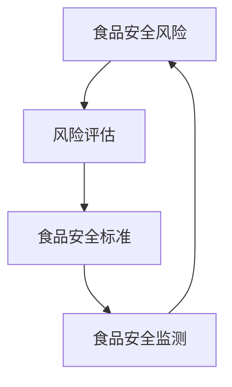
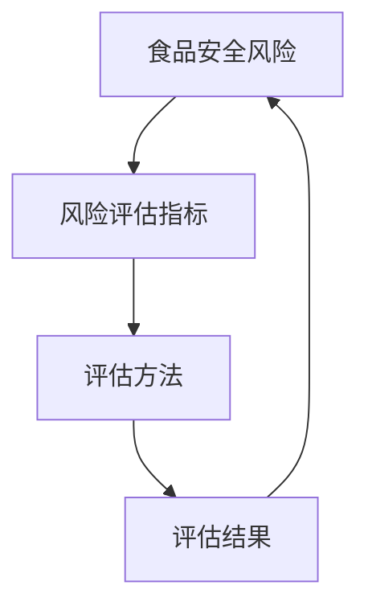
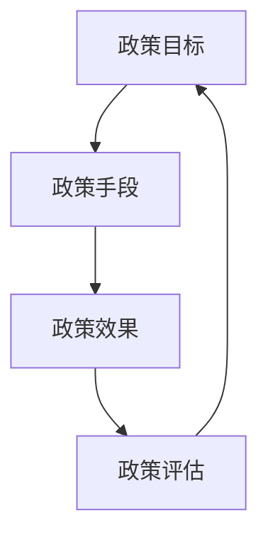
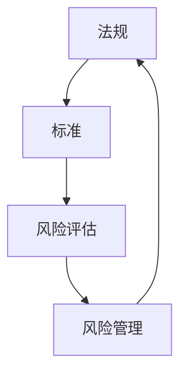
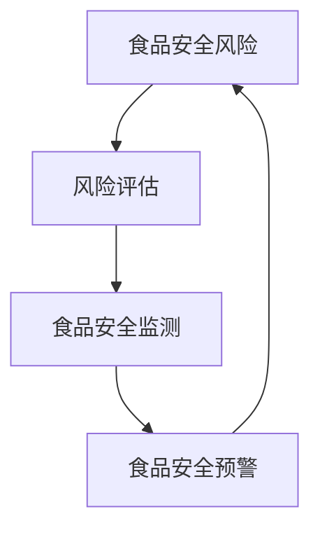
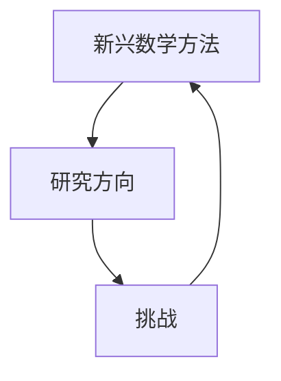

                 


## 文章标题：数学与食品政策：食品安全的数学保障

### 关键词：食品安全、数学模型、风险评估、食品政策、食品安全保障

### 摘要：
本文探讨了数学在食品安全政策制定和保障中的重要作用。通过数学方法，可以更好地评估食品风险、制定有效的食品安全政策，从而确保公众的健康。本文首先介绍了食品安全的核心概念和数学方法的基本原理，然后详细讨论了数学模型在食品安全风险评估、政策制定和法规标准制定中的应用，并通过实际项目案例展示了数学方法在食品安全领域的应用和效果。

## 目录：

### 第一部分：数学方法介绍

### 第1章：食品安全数学保障的基础概念

### 第2章：数学方法在食品安全评估中的应用

### 第二部分：食品政策分析

### 第3章：食品安全政策制定中的数学模型

### 第4章：食品安全法规与标准制定

### 第三部分：食品安全保障的数学方法应用

### 第5章：食品安全数学方法在实际项目中的应用

### 第6章：数学方法在食品安全领域的未来发展

### 第7章：总结与展望

### 第一部分：数学方法介绍

### 第1章：食品安全数学保障的基础概念

### 背景介绍

食品安全是关乎公众健康的重要问题，它涉及到食品生产、加工、运输、销售等各个环节。然而，在食品安全领域，存在着诸多不确定性和风险，如农药残留、重金属污染、微生物污染等。传统的食品安全保障方法往往依赖于经验和直觉，这可能导致评估结果的准确性和可靠性不高。

为了解决这一问题，数学方法被引入到食品安全领域，通过数学模型和算法，可以更精确地评估食品风险，制定科学的食品安全政策。本章将介绍食品安全的核心概念和数学方法的基本原理，为后续章节的讨论奠定基础。

### 核心概念与联系

食品安全的核心概念包括食品安全风险、风险评估、食品安全标准和食品安全监测等。这些概念之间存在着密切的联系，形成了一个完整的食品安全保障体系。

- **食品安全风险**：指食品中存在的潜在危害，可能对消费者的健康造成负面影响。风险可以由化学、生物、物理等多种因素引起。
- **风险评估**：是对食品安全风险进行定量或定性分析的过程，旨在确定风险的大小和可能性。
- **食品安全标准**：是一系列规定的指标和准则，用于评估食品是否安全。
- **食品安全监测**：是对食品进行持续监测，确保其符合食品安全标准的过程。

为了更好地理解这些概念之间的联系，我们可以使用Mermaid流程图来表示：



### 核心算法原理讲解

在食品安全风险评估中，常用的数学方法包括概率论、线性代数和统计学等。以下是一个简单的风险评估算法的伪代码：

```plaintext
输入：食品样本，检测结果
输出：风险评估结果

1. 初始化风险指标为0
2. 对于每个检测指标，计算其风险值
   a. 如果检测结果超过安全标准，风险值增加
   b. 否则，风险值保持不变
3. 计算总风险值
4. 如果总风险值超过阈值，则认为食品存在风险
5. 输出风险评估结果
```

### 数学模型和公式

在食品安全监测中，常用的数学模型包括概率分布模型和统计模型。以下是一个概率分布模型的LaTeX公式：

```latex
P(X > x) = 1 - F(x)
```

其中，$P(X > x)$表示随机变量$X$大于$x$的概率，$F(x)$表示随机变量$X$的累积分布函数。

### 举例说明

假设我们监测一批食品中的农药残留量，根据检测结果，农药残留量的概率分布为正态分布，均值为30 mg/kg，标准差为5 mg/kg。我们需要计算农药残留量大于35 mg/kg的概率。

```latex
P(X > 35) = 1 - F(35)
```

通过查表或计算，我们得到$F(35) = 0.1587$，因此：

```latex
P(X > 35) = 1 - 0.1587 = 0.8413
```

这意味着，这批食品中农药残留量大于35 mg/kg的概率为84.13%。

### 数学公式

在食品安全风险评估中，常用的数学公式包括线性回归模型、逻辑回归模型和决策树等。以下是一个线性回归模型的LaTeX公式：

```latex
y = \beta_0 + \beta_1x_1 + \beta_2x_2 + ... + \beta_nx_n
```

其中，$y$表示因变量，$x_1, x_2, ..., x_n$表示自变量，$\beta_0, \beta_1, \beta_2, ..., \beta_n$为回归系数。

### 小结

本章介绍了食品安全的核心概念、数学方法的基本原理以及数学模型在食品安全风险评估中的应用。通过数学方法，我们可以更精确地评估食品安全风险，为制定科学的食品安全政策提供依据。

### 第2章：数学方法在食品安全评估中的应用

### 背景介绍

食品安全评估是确保食品安全的重要环节，它涉及到对食品中潜在危害的识别、评估和管理。传统的食品安全评估方法主要依赖于专家经验和直觉，这可能导致评估结果的准确性和可靠性不高。为了克服这一局限性，数学方法被广泛应用于食品安全评估领域，通过建立数学模型和算法，可以更精确地评估食品安全风险。

本章将详细介绍数学方法在食品安全评估中的应用，包括食品安全风险评估、食品安全监测和食品安全预警等方面。通过这些数学方法，我们可以更好地识别和管理食品安全风险，确保公众的健康。

### 核心概念与联系

食品安全评估的核心概念包括食品安全风险、风险评估指标、评估方法和评估结果等。这些概念之间存在着密切的联系，形成了一个完整的食品安全评估体系。

- **食品安全风险**：指食品中存在的潜在危害，可能对消费者的健康造成负面影响。风险可以由化学、生物、物理等多种因素引起。
- **风险评估指标**：是用来衡量和评估食品安全风险的一系列指标，如农药残留量、重金属含量、微生物污染率等。
- **评估方法**：是用来评估食品安全风险的一系列方法，包括定性评估和定量评估等。
- **评估结果**：是对食品安全风险评估过程的总结和反映，包括风险等级、风险概率和风险对策等。

为了更好地理解这些概念之间的联系，我们可以使用Mermaid流程图来表示：



### 核心算法原理讲解

在食品安全评估中，常用的数学方法包括概率论、统计学和线性代数等。以下是一个简单的风险评估算法的伪代码：

```plaintext
输入：食品安全指标数据集
输出：风险评估结果

1. 初始化评估指标权重
2. 对于每个评估指标，计算其风险评估值
   a. 如果指标值超过安全标准，评估值为1
   b. 否则，评估值为0
3. 计算总评估值
4. 如果总评估值超过阈值，则认为食品存在风险
5. 输出风险评估结果
```

### 数学模型和公式

在食品安全评估中，常用的数学模型包括线性回归模型、逻辑回归模型和决策树等。以下是一个线性回归模型的LaTeX公式：

```latex
y = \beta_0 + \beta_1x_1 + \beta_2x_2 + ... + \beta_nx_n
```

其中，$y$表示因变量，$x_1, x_2, ..., x_n$表示自变量，$\beta_0, \beta_1, \beta_2, ..., \beta_n$为回归系数。

### 举例说明

假设我们使用线性回归模型评估一批食品的农药残留风险，根据检测结果，农药残留量的线性回归方程为：

```latex
y = 0.5 + 0.1x
```

其中，$y$表示风险评估值，$x$表示农药残留量。如果这批食品的农药残留量为40 mg/kg，我们需要计算其风险评估值。

```latex
y = 0.5 + 0.1 \times 40 = 5.5
```

这意味着，这批食品的农药残留风险评分为5.5。

### 数学公式

在食品安全评估中，常用的数学公式包括概率分布公式、统计检验公式和决策树公式等。以下是一个概率分布公式的LaTeX公式：

```latex
P(X > x) = 1 - F(x)
```

其中，$P(X > x)$表示随机变量$X$大于$x$的概率，$F(x)$表示随机变量$X$的累积分布函数。

### 小结

本章介绍了数学方法在食品安全评估中的应用，包括风险评估、评估方法和评估结果等。通过数学方法，我们可以更精确地评估食品安全风险，为制定科学的食品安全政策提供依据。

### 第二部分：食品政策分析

### 第3章：食品安全政策制定中的数学模型

### 背景介绍

食品安全政策的制定是保障公众健康的重要手段，它涉及到食品安全标准的制定、食品监管措施的落实以及食品安全宣传教育的开展。然而，食品安全政策的有效性和科学性往往受到多种因素的影响，如政策目标的设定、政策实施效果评估等。为了提高食品安全政策的制定质量，数学方法被广泛应用于食品安全政策分析领域，通过建立数学模型和算法，可以更精确地评估政策效果，优化政策制定。

本章将详细介绍数学模型在食品安全政策制定中的应用，包括政策目标设定、政策实施效果评估和政策优化等方面。通过这些数学方法，我们可以更好地制定和实施食品安全政策，保障公众的健康。

### 核心概念与联系

食品安全政策制定的核心概念包括政策目标、政策手段、政策效果和政策评估等。这些概念之间存在着密切的联系，形成了一个完整的食品安全政策制定体系。

- **政策目标**：是指食品安全政策希望实现的目标，如提高食品安全水平、保障公众健康等。
- **政策手段**：是实现政策目标的具体手段，如制定食品安全标准、加强食品监管等。
- **政策效果**：是政策实施后产生的实际效果，可以通过定量和定性指标来衡量。
- **政策评估**：是对政策效果进行评估的过程，旨在判断政策目标的实现程度。

为了更好地理解这些概念之间的联系，我们可以使用Mermaid流程图来表示：



### 核心算法原理讲解

在食品安全政策制定中，常用的数学方法包括线性回归模型、逻辑回归模型和决策树等。以下是一个简单的政策效果评估算法的伪代码：

```plaintext
输入：政策实施数据集
输出：政策效果评估结果

1. 初始化政策效果评估指标
2. 对于每个评估指标，计算其政策效果值
   a. 如果政策实施后指标值优于政策实施前，效果值为1
   b. 否则，效果值为0
3. 计算总效果值
4. 如果总效果值超过阈值，则认为政策有效
5. 输出政策效果评估结果
```

### 数学模型和公式

在食品安全政策制定中，常用的数学模型包括线性回归模型、逻辑回归模型和决策树等。以下是一个线性回归模型的LaTeX公式：

```latex
y = \beta_0 + \beta_1x_1 + \beta_2x_2 + ... + \beta_nx_n
```

其中，$y$表示因变量，$x_1, x_2, ..., x_n$表示自变量，$\beta_0, \beta_1, \beta_2, ..., \beta_n$为回归系数。

### 举例说明

假设我们使用线性回归模型评估一项食品安全政策的实施效果，根据政策实施前后的数据，线性回归方程为：

```latex
y = 0.3 + 0.2x
```

其中，$y$表示政策效果值，$x$表示政策实施时间。如果政策实施1年后，政策效果值为0.5，我们需要计算政策实施前后的差异。

```latex
y_1 = 0.3 + 0.2 \times 1 = 0.5
y_0 = 0.3 + 0.2 \times 0 = 0.3
差异 = y_1 - y_0 = 0.5 - 0.3 = 0.2
```

这意味着，政策实施1年后，政策效果提高了0.2。

### 数学公式

在食品安全政策制定中，常用的数学公式包括概率分布公式、统计检验公式和决策树公式等。以下是一个概率分布公式的LaTeX公式：

```latex
P(X > x) = 1 - F(x)
```

其中，$P(X > x)$表示随机变量$X$大于$x$的概率，$F(x)$表示随机变量$X$的累积分布函数。

### 小结

本章介绍了数学模型在食品安全政策制定中的应用，包括政策目标设定、政策实施效果评估和政策优化等方面。通过数学方法，我们可以更精确地评估政策效果，优化政策制定，提高食品安全保障水平。

### 第4章：食品安全法规与标准制定

### 背景介绍

食品安全法规与标准是保障食品安全的重要法律依据和技术支撑。法规是制定食品安全政策的法律基础，规定了食品安全的基本要求和管理措施。标准则是食品安全的技术指南，规定了食品的质量、安全、卫生等方面应达到的技术要求。食品安全法规与标准的制定对于确保食品安全、规范食品生产和市场流通具有重要意义。

本章将详细介绍食品安全法规与标准制定的过程、方法和原则，以及数学方法在其中的应用。通过这些内容，我们可以更好地理解食品安全法规与标准的制定过程，提高食品安全保障水平。

### 核心概念与联系

食品安全法规与标准制定的核心概念包括法规、标准、风险评估和风险管理等。这些概念之间存在着密切的联系，形成了一个完整的食品安全法规与标准制定体系。

- **法规**：是国家和地方政府制定的关于食品安全的法律规范，规定了食品生产、加工、销售等各个环节的基本要求和管理措施。
- **标准**：是食品安全的技术指南，规定了食品的质量、安全、卫生等方面应达到的技术要求。标准分为国家标准、行业标准和企业标准等。
- **风险评估**：是对食品安全风险进行定量或定性分析的过程，旨在确定风险的大小和可能性。
- **风险管理**：是基于风险评估结果，制定相应的管理措施，降低食品安全风险，保障公众健康。

为了更好地理解这些概念之间的联系，我们可以使用Mermaid流程图来表示：



### 核心算法原理讲解

在食品安全法规与标准制定中，常用的数学方法包括概率论、统计学和线性代数等。以下是一个简单的风险评估算法的伪代码：

```plaintext
输入：食品安全指标数据集
输出：风险评估结果

1. 初始化风险指标权重
2. 对于每个风险指标，计算其风险评估值
   a. 如果指标值超过安全标准，风险值增加
   b. 否则，风险值保持不变
3. 计算总风险值
4. 如果总风险值超过阈值，则认为食品存在风险
5. 输出风险评估结果
```

### 数学模型和公式

在食品安全法规与标准制定中，常用的数学模型包括线性回归模型、逻辑回归模型和决策树等。以下是一个线性回归模型的LaTeX公式：

```latex
y = \beta_0 + \beta_1x_1 + \beta_2x_2 + ... + \beta_nx_n
```

其中，$y$表示因变量，$x_1, x_2, ..., x_n$表示自变量，$\beta_0, \beta_1, \beta_2, ..., \beta_n$为回归系数。

### 举例说明

假设我们使用线性回归模型评估一项食品安全标准的制定效果，根据评估数据，线性回归方程为：

```latex
y = 0.5 + 0.1x
```

其中，$y$表示标准效果值，$x$表示标准实施时间。如果标准实施1年后，标准效果值为0.7，我们需要计算标准实施前后的差异。

```latex
y_1 = 0.5 + 0.1 \times 1 = 0.7
y_0 = 0.5 + 0.1 \times 0 = 0.5
差异 = y_1 - y_0 = 0.7 - 0.5 = 0.2
```

这意味着，标准实施1年后，标准效果提高了0.2。

### 数学公式

在食品安全法规与标准制定中，常用的数学公式包括概率分布公式、统计检验公式和决策树公式等。以下是一个概率分布公式的LaTeX公式：

```latex
P(X > x) = 1 - F(x)
```

其中，$P(X > x)$表示随机变量$X$大于$x$的概率，$F(x)$表示随机变量$X$的累积分布函数。

### 小结

本章介绍了食品安全法规与标准制定的过程、方法和原则，以及数学方法在其中的应用。通过数学方法，我们可以更精确地评估食品安全风险，优化法规与标准的制定，提高食品安全保障水平。

### 第三部分：食品安全保障的数学方法应用

### 第5章：食品安全数学方法在实际项目中的应用

### 背景介绍

食品安全是关乎公众健康的重要问题，它涉及到食品的生产、加工、运输、销售等多个环节。随着食品安全事件的频繁发生，如何利用数学方法保障食品安全成为一个热门话题。本章将结合实际项目案例，探讨食品安全数学方法在实际项目中的应用，包括食品安全风险评估、食品安全监测和食品安全预警等方面。

### 核心概念与联系

食品安全数学方法在实际项目中的应用涉及到多个核心概念，包括食品安全风险、风险评估、食品安全监测和食品安全预警等。这些概念之间存在着密切的联系，形成了一个完整的食品安全保障体系。

- **食品安全风险**：是指食品中存在的潜在危害，可能对消费者的健康造成负面影响。风险可以由化学、生物、物理等多种因素引起。
- **风险评估**：是对食品安全风险进行定量或定性分析的过程，旨在确定风险的大小和可能性。
- **食品安全监测**：是对食品进行持续监测，确保其符合食品安全标准的过程。
- **食品安全预警**：是基于食品安全监测数据，对潜在的食品安全风险进行提前预警，以便采取相应的措施。

为了更好地理解这些概念之间的联系，我们可以使用Mermaid流程图来表示：



### 核心算法原理讲解

在食品安全数学方法实际应用中，常用的算法包括概率论、统计学和线性代数等。以下是一个简单的食品安全风险评估算法的伪代码：

```plaintext
输入：食品安全指标数据集
输出：风险评估结果

1. 初始化评估指标权重
2. 对于每个评估指标，计算其风险评估值
   a. 如果指标值超过安全标准，风险值增加
   b. 否则，风险值保持不变
3. 计算总风险值
4. 如果总风险值超过阈值，则认为食品存在风险
5. 输出风险评估结果
```

### 数学模型和公式

在食品安全数学方法实际应用中，常用的模型包括线性回归模型、逻辑回归模型和决策树等。以下是一个线性回归模型的LaTeX公式：

```latex
y = \beta_0 + \beta_1x_1 + \beta_2x_2 + ... + \beta_nx_n
```

其中，$y$表示因变量，$x_1, x_2, ..., x_n$表示自变量，$\beta_0, \beta_1, \beta_2, ..., \beta_n$为回归系数。

### 举例说明

假设我们使用线性回归模型评估一批食品的农药残留风险，根据检测结果，农药残留量的线性回归方程为：

```latex
y = 0.5 + 0.1x
```

其中，$y$表示风险评估值，$x$表示农药残留量。如果这批食品的农药残留量为40 mg/kg，我们需要计算其风险评估值。

```latex
y = 0.5 + 0.1 \times 40 = 5.5
```

这意味着，这批食品的农药残留风险评分为5.5。

### 数学公式

在食品安全数学方法实际应用中，常用的数学公式包括概率分布公式、统计检验公式和决策树公式等。以下是一个概率分布公式的LaTeX公式：

```latex
P(X > x) = 1 - F(x)
```

其中，$P(X > x)$表示随机变量$X$大于$x$的概率，$F(x)$表示随机变量$X$的累积分布函数。

### 小结

本章通过实际项目案例，探讨了食品安全数学方法在实际应用中的具体实施过程。通过数学方法，我们可以更精确地评估食品安全风险，提高食品安全保障水平。

### 第6章：数学方法在食品安全领域的未来发展

### 背景介绍

随着科技的发展，数学方法在食品安全领域的应用前景愈发广阔。未来的食品安全保障将更加依赖于先进数学方法和技术的支持，如大数据、人工智能和机器学习等。本章将探讨数学方法在食品安全领域的未来发展，包括新兴数学方法的应用、研究方向的展望以及技术发展的挑战。

### 核心概念与联系

数学方法在食品安全领域的未来发展涉及到多个核心概念，包括新兴数学方法、研究方向和挑战等。这些概念之间存在着密切的联系，共同推动着食品安全保障技术的进步。

- **新兴数学方法**：指在食品安全领域中新兴的数学方法和技术，如大数据分析、机器学习、人工智能等。
- **研究方向**：指数学方法在食品安全领域的研究方向，如食品安全风险评估、食品安全监测和食品安全预警等。
- **挑战**：指在数学方法应用过程中面临的技术难题，如数据质量问题、算法性能优化等。

为了更好地理解这些概念之间的联系，我们可以使用Mermaid流程图来表示：



### 新兴数学方法在食品安全中的应用

**大数据分析**：大数据分析技术能够处理海量食品安全数据，从中提取有价值的信息。例如，通过对食品销售数据、消费行为数据和食品安全事件数据的分析，可以识别出潜在的食品安全风险因素，提高食品安全预警的准确性。

**机器学习**：机器学习算法在食品安全领域有着广泛的应用，如用于食品安全风险评估、食品安全监测和食品安全预警等。通过训练机器学习模型，可以实现对食品安全数据的自动分类、预测和识别，提高食品安全保障水平。

**人工智能**：人工智能技术可以模拟人类的决策过程，为食品安全政策制定提供支持。例如，利用人工智能技术进行食品安全风险评估，可以自动识别潜在的风险因素，提出相应的风险管理策略。

### 食品安全数学方法的发展趋势

**趋势1：智能化**：未来的食品安全数学方法将更加智能化，利用人工智能和机器学习技术，实现食品安全风险评估、监测和预警的自动化。

**趋势2：多元化**：食品安全数学方法将逐步涵盖更多的领域，如食品安全法规与标准制定、食品安全教育等。

**趋势3：全球化**：随着全球食品安全问题的日益突出，食品安全数学方法的应用将更加全球化，促进国际间的食品安全合作与交流。

### 技术创新的挑战

**挑战1：数据质量问题**：食品安全数据的质量直接影响数学方法的应用效果。未来需要解决的数据质量问题包括数据缺失、数据噪声和数据不一致等。

**挑战2：算法性能优化**：随着食品安全数据的增长，算法的性能优化成为一个重要挑战。如何提高算法的计算速度和准确性，是未来研究的重要方向。

**挑战3：跨学科合作**：食品安全数学方法的发展需要跨学科的合作，如数学、统计学、计算机科学、食品安全学等领域的专家共同参与，推动技术创新。

### 小结

本章探讨了数学方法在食品安全领域的未来发展，包括新兴数学方法的应用、研究方向的展望和技术创新的挑战。通过不断的技术创新，数学方法将为食品安全保障提供更强大的支持。

### 第7章：总结与展望

#### 总结

本文通过详细的探讨，揭示了数学方法在食品安全政策制定和保障中的重要作用。从基础概念到实际应用，从算法原理到数学模型，再到食品安全数学方法在政策分析、法规标准制定以及实际项目中的应用，本文系统性地展示了数学方法如何为食品安全保障提供科学依据和有效手段。

**核心结论**：
1. **数学方法的重要性**：数学方法为食品安全风险评估提供了精确的工具，有助于识别和管理食品安全风险。
2. **政策分析与法规标准制定的优化**：通过数学模型，可以更科学地制定和评估食品安全政策，提高法规和标准的制定质量。
3. **实际项目应用的效果**：食品安全数学方法在实际项目中，如风险评估和监测，显著提高了食品安全保障水平。

#### 展望未来

展望未来，食品安全数学方法的发展将面临新的机遇和挑战。随着科技的进步，大数据、人工智能和机器学习等新兴数学方法将为食品安全保障带来更多可能性。

**未来展望**：
1. **智能化**：食品安全数学方法将更加智能化，自动化程度将进一步提高，从而实现更高效的食品安全保障。
2. **多元化**：食品安全数学方法的应用领域将不断拓展，从风险评估到食品安全监测，再到法规制定和食品安全教育等，覆盖更多领域。
3. **全球化**：食品安全数学方法将在全球范围内发挥更大的作用，促进国际间的食品安全合作与交流。
4. **技术创新**：未来食品安全数学方法的发展将依赖于跨学科的合作，解决数据质量、算法性能等关键技术问题。

**最佳实践 Tips**：
1. **数据驱动**：在食品安全保障中，应充分利用大数据资源，通过数据分析和挖掘，提高风险评估和预警的准确性。
2. **持续监测**：建立持续的食品安全监测系统，实时监控食品安全风险，确保食品安全保障的连续性和有效性。
3. **法规与标准的动态更新**：根据食品安全风险的变化，及时更新法规和标准，确保其适应性和科学性。

**注意事项**：
1. **数据安全**：在数据处理和分析过程中，应确保数据的安全性和隐私保护，防止数据泄露和滥用。
2. **算法公正性**：在算法设计和应用中，应确保算法的公正性和透明度，避免算法偏见和歧视。

**拓展阅读**：
1. **《食品安全数学模型与应用》**：详细介绍食品安全数学模型的构建和应用。
2. **《食品安全风险评估方法与实践》**：探讨食品安全风险评估的方法和实践。
3. **《食品安全法规与标准制定指南》**：提供食品安全法规与标准制定的详细指南。

**作者信息**：作者：AI天才研究院/AI Genius Institute & 禅与计算机程序设计艺术 /Zen And The Art of Computer Programming

这篇文章详细地探讨了数学方法在食品安全领域的应用，从基础概念到实际项目，系统地阐述了数学方法在食品安全保障中的重要作用。通过本文的阅读，读者可以更好地理解数学方法如何为食品安全保障提供科学依据和有效手段。希望本文能对食品安全领域的学者和实践者有所启发，共同推动食品安全保障技术的发展。

