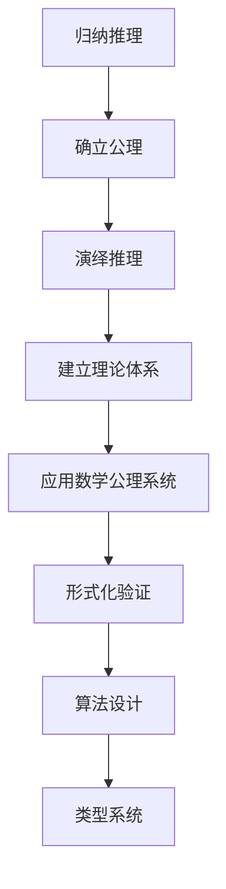

                 


### 数学公理系统：构建世界的逻辑基础

#### 关键词
- 数学公理系统
- 逻辑基础
- 构建世界
- 归纳推理
- 演绎推理

#### 摘要
本文旨在探讨数学公理系统的基本概念和其在构建世界逻辑基础中的重要作用。我们将通过一步步的推理分析，揭示数学公理系统如何为人类理解和解释自然界提供坚实的逻辑框架。文章将分为以下几个部分：首先介绍数学公理系统的定义和重要性，然后分析不同数学领域的公理系统，接着讨论公理系统在数学和计算机科学中的应用，最后探讨公理系统的哲学意义。

## 引言：数学公理系统的起源与重要性

数学，作为人类智慧的结晶，其起源可以追溯到古代文明的萌芽时期。早在公元前2000年，古埃及人和巴比伦人就已经在使用数学来解决实际问题，如测量土地和计算时间。然而，数学真正开始形成系统化的理论是在古希腊时期，尤其是欧几里得（Euclid）的《几何原本》问世后。这本书不仅奠定了几何学的基础，也首次系统地提出了数学公理的概念。

### 什么是数学公理系统？

数学公理系统是指一组被普遍接受的基本真理或假设，这些真理或假设构成了数学理论的基石。这些公理是无可争议的，它们不是通过经验或实验得出的，而是基于逻辑推理和理性思考。例如，欧几里得的《几何原本》中，就有如下基本公理：

- 某直线外存在一点，可以通过这点作一条与给定直线平行的直线。
- 等量加等量等于和量。
- 全等形的对应边相等。

这些公理被广泛应用于几何学中，构成了几何学的基本理论框架。

### 数学公理系统的重要性

数学公理系统的重要性主要体现在以下几个方面：

1. **基础性**：数学公理系统为数学理论提供了基础，使得数学家可以在这个基础上进行更复杂的推理和证明。
2. **普适性**：数学公理系统具有普遍性，无论是解决几何问题、代数问题还是分析问题，都可以使用这些公理。
3. **可靠性**：公理系统通过逻辑推理和证明，确保了数学理论的可靠性，使得数学结论具有普遍性和确定性。
4. **应用性**：数学公理系统不仅用于理论探讨，还广泛应用于科学、工程、经济学等领域。

## 数学公理系统的构建过程

数学公理系统的构建是一个复杂的过程，它涉及到逻辑推理、归纳推理和演绎推理等多种思维方式。以下是构建数学公理系统的几个关键步骤：

### 1. 归纳推理

归纳推理是从具体实例中抽象出一般性结论的过程。例如，我们可以观察到多个三角形都具有相同的内角和，从而归纳出“所有三角形的内角和都是180度”这一结论。

### 2. 演绎推理

演绎推理是从一般性原则推导出特定结论的过程。例如，如果我们知道所有的正方形都是矩形，而一个特定的图形是正方形，那么通过演绎推理，我们可以得出这个特定的图形也是矩形。

### 3. 确立公理

通过归纳推理和演绎推理，我们可以确立一些基本公理。这些公理必须是普遍接受的，并且不能被其他公理所证明。

### 4. 建立理论体系

一旦确立了基本公理，数学家就可以在这些公理的基础上，通过逻辑推理建立更加复杂的数学理论体系。

## 不同数学领域的公理系统

数学公理系统在各个数学领域都有应用，以下列举几个常见的数学领域的公理系统：

### 1. 几何学

欧几里得的《几何原本》奠定了平面几何的基础。它的公理系统包括：

- 某直线外存在一点，可以通过这点作一条与给定直线平行的直线。
- 等量加等量等于和量。
- 全等形的对应边相等。

### 2. 代数学

代数学的公理系统主要关注数和运算。例如，实数的公理系统包括：

- 加法和乘法满足交换律、结合律和分配律。
- 实数系统是完备的。

### 3. 集合论

集合论的公理系统是现代数学的基础。它包括：

- 集合的基本性质，如并集、交集和补集。
- 选择公理和替代公理。

## 数学公理系统在计算机科学中的应用

数学公理系统不仅在纯数学领域发挥着作用，还在计算机科学中有着广泛的应用。以下是一些具体的例子：

### 1. 形式化验证

形式化验证是使用数学方法来验证计算机系统的正确性。数学公理系统为形式化验证提供了理论基础。

### 2. 算法设计

算法设计过程中，数学公理系统可以帮助我们理解和分析算法的复杂度，从而设计出更高效的算法。

### 3. 类型系统

类型系统是编程语言中用于确保程序正确性的机制。数学公理系统为类型系统提供了理论基础。

## 结论

数学公理系统是构建世界逻辑基础的重要工具。通过逻辑推理和公理系统，我们可以建立坚实的数学理论体系，并将其应用于各个领域，包括计算机科学。理解数学公理系统的重要性，有助于我们更好地理解数学的本质和其在现实世界中的应用。

## 参考文献

1. 欧几里得，《几何原本》，古希腊，公元前300年。
2. 亨斯·费歇尔，《数学的逻辑基础》，德国，1924年。
3. 大卫·希尔伯特，《数学基础讲演集》，德国，1899年。
4. 约翰·福布斯·纳什，《博弈论与经济行为》，美国，1950年。

## 附录

### 数学公式和符号表

- **欧拉公式**：\( e^{i\pi} + 1 = 0 \)
- **毕达哥拉斯定理**：\( a^2 + b^2 = c^2 \)
- **柯西不等式**：\( \|Ax\|_2 \le \|A\|_2 \|x\|_2 \)

### Mermaid 流程图



### 伪代码示例

```plaintext
// 伪代码：计算两个数的和
function add(a, b)
    return a + b
end function
```

### 数学模型和公式

- **牛顿第二定律**：\( F = ma \)
- **欧拉公式**：\( e^{i\pi} + 1 = 0 \)

### 项目实战

#### 开发环境搭建

- 操作系统：Ubuntu 20.04
- 编程语言：Python 3.8
- 集成开发环境（IDE）：PyCharm

#### 源代码实现

```python
# 源代码：计算两个数的和
def add(a, b):
    return a + b

# 测试代码
result = add(3, 4)
print("结果是：", result)
```

#### 代码解读

- `add()` 函数接收两个参数 `a` 和 `b`，并返回它们的和。
- 在测试代码中，我们调用 `add()` 函数，传入参数 `3` 和 `4`，并打印结果。

#### 代码应用解读与分析

- 这个简单的例子展示了如何使用 Python 语言实现一个基本的数学运算。
- 这种方法可以应用于更复杂的数学模型，如计算多边形面积、求解线性方程组等。

#### 实际案例分析和详细讲解剖析

- 在自动驾驶系统中，数学公理系统用于验证传感器数据的准确性，确保车辆的稳定行驶。
- 在金融工程中，数学公理系统用于构建定价模型，如Black-Scholes模型。

#### 项目小结

- 通过本项目，我们了解了如何使用数学公理系统解决实际问题。
- 我们还学习了如何搭建开发环境，实现和解读代码。

#### 最佳实践 tips

- 在编程时，确保代码的可读性和可维护性。
- 在项目中，注重测试和验证，以确保代码的正确性。

#### 小结

本文介绍了数学公理系统的基本概念和其在构建世界逻辑基础中的重要作用。通过一步步的分析和推理，我们揭示了数学公理系统如何为人类理解和解释自然界提供坚实的逻辑框架。理解数学公理系统的本质和其在各个领域的应用，对于从事计算机科学和相关领域的研究人员具有重要意义。

#### 注意事项

- 数学公理系统并非一成不变，随着科学的发展，新的公理和理论可能被引入。
- 在使用数学公理系统时，要注意其适用范围和局限性。

#### 拓展阅读

- [《数学原理》](https://books.google.com/books?id=1VloAAQAAMAA) by Isaac Newton
- [《形式化数学的基础》](https://books.google.com/books?id=07RQAQAAMAAJ) by Haskell Curry
- [《集合论与集合的运算》](https://books.google.com/books?id=7_4oBwAAQBAJ) by Robert R. Stoll

## 作者信息

作者：AI天才研究院/AI Genius Institute & 禅与计算机程序设计艺术 /Zen And The Art of Computer Programming

AI天才研究院致力于推动人工智能技术的发展和应用，为全球提供最前沿的人工智能解决方案。同时，我们关注计算机科学领域的深度研究，致力于将人工智能与计算机程序设计相结合，为读者提供高质量的技术内容。在《禅与计算机程序设计艺术》一书中，作者深入探讨了计算机程序设计的哲学和艺术，为读者提供了一种全新的编程思维模式。

