                 

### 文章标题

《数学园艺学：植物生长的数学规划》

### 文章关键词

- 数学园艺学
- 植物生长
- 数学模型
- 数学规划
- 优化算法

### 文章摘要

本文将深入探讨数学园艺学的概念、核心原理及其应用。我们将从数学园艺学的基础知识出发，逐步介绍植物生长的数学模型，探讨用于植物生长预测和优化的数学规划方法。通过实际案例和项目实战，我们将展示如何利用数学园艺学的原理来提升园艺生产的效率和品质。文章还将提供一些最佳实践 tips 和注意事项，为读者在实践中的应用提供指导。

---

### 第一部分：数学园艺学基础

#### 1.1 数学园艺学概述

数学园艺学是园艺学与数学的交叉领域，它利用数学模型和算法来解决园艺实践中遇到的问题。这一领域的兴起，主要得益于现代农业对精准化、高效化生产的追求。数学园艺学不仅能够优化植物生长条件，提高产量和品质，还能帮助园艺师更好地理解植物的生长机制。

#### 1.2 数学基础

在数学园艺学中，代数、微积分和概率论等数学工具扮演着至关重要的角色。代数提供了处理植物生长参数的基础，微积分则帮助我们理解植物生长的动态变化，而概率论则在预测植物生长结果方面发挥了重要作用。

##### 1.2.1 代数基础

代数公式和运算在数学园艺学中用于描述植物生长的各种参数，如植物的高度、叶片数量、根系长度等。这些参数可以通过代数方程进行计算和预测。

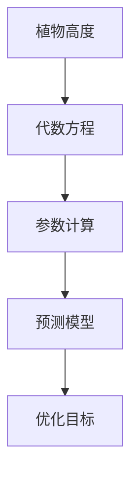

##### 1.2.2 微积分基础

微积分用于分析植物生长的动态过程，如植物高度随时间的变化率、叶片数量的增长速度等。通过微分方程，我们可以描述植物生长的动态规律，并对其进行优化。

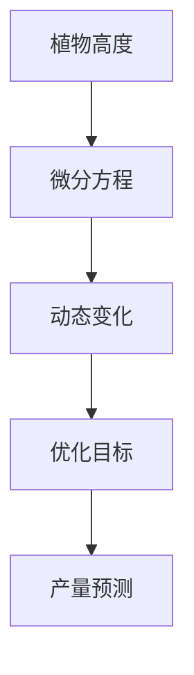

##### 1.2.3 概率论基础

概率论在数学园艺学中用于分析植物生长的不确定性。通过概率分布和随机变量的分析，我们可以预测植物生长结果的概率分布，并优化种植策略。

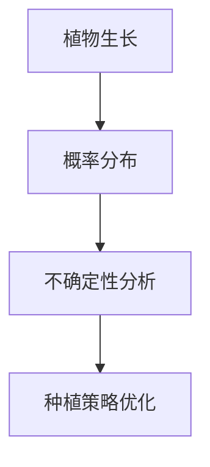

#### 1.3 数学园艺学的核心概念与联系

数学园艺学的核心概念包括植物生长模型、数学规划方法、预测和优化算法等。这些概念之间相互联系，共同构成了数学园艺学的理论体系。

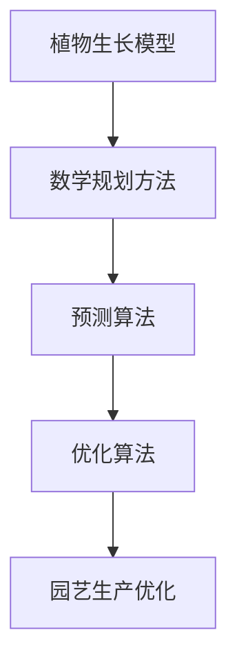

---

### 第二部分：植物生长的数学模型

#### 2.1 植物生长模型

植物生长模型是数学园艺学中的核心内容，它们用于描述植物生长的动态过程。常见的植物生长模型包括微分方程模型、静态模型和动态模型。

##### 2.1.1 微分方程模型

微分方程模型用于描述植物生长的动态变化。这类模型通常使用一阶或二阶微分方程来描述植物的高度、叶片数量等参数随时间的变化。

```latex
$$\frac{dH}{dt} = f(H, T)$$
$$\frac{dN}{dt} = g(N, T)$$
```

其中，$H$ 代表植物高度，$N$ 代表叶片数量，$T$ 代表时间，$f$ 和 $g$ 是描述生长动态的函数。

##### 2.1.2 静态模型

静态模型用于描述植物在某一时间点的生长状态。这类模型通常使用代数方程来描述植物的高度、叶片数量等参数。

```latex
$$H(t) = H_0 + K(T)$$
$$N(t) = N_0 + L(T)$$
```

其中，$H(t)$ 和 $N(t)$ 分别代表植物在时间 $t$ 的高度和叶片数量，$H_0$ 和 $N_0$ 分别代表初始高度和初始叶片数量，$K(T)$ 和 $L(T)$ 是描述生长状态的函数。

##### 2.1.3 动态模型

动态模型结合了微分方程和静态模型的特点，用于描述植物在整个生长周期内的生长过程。这类模型通常使用非线性微分方程来描述。

```latex
$$\frac{dH}{dt} = f(H, N, T)$$
$$\frac{dN}{dt} = g(H, N, T)$$
```

其中，$H$ 和 $N$ 分别代表植物的高度和叶片数量，$T$ 代表时间，$f$ 和 $g$ 是描述生长动态的函数。

#### 2.2 数学规划方法

数学规划方法用于优化植物生长过程，提高产量和品质。常见的数学规划方法包括线性规划、非线性规划和整数规划。

##### 2.2.1 线性规划

线性规划用于解决线性目标函数在给定线性约束条件下的优化问题。在数学园艺学中，线性规划可以用于优化植物生长过程中的资源分配。

```latex
$$\min c^T x$$
$$\text{subject to} \ A x \le b$$
$$x \ge 0$$
```

其中，$c$ 是目标函数的系数向量，$x$ 是决策变量向量，$A$ 是约束矩阵，$b$ 是约束向量。

##### 2.2.2 非线性规划

非线性规划用于解决非线性目标函数在给定非线性约束条件下的优化问题。在数学园艺学中，非线性规划可以用于优化植物生长过程中的复杂非线性关系。

```latex
$$\min f(x)$$
$$\text{subject to} \ g_i(x) \le 0, \forall i$$
$$h_j(x) = 0, \forall j$$
```

其中，$f(x)$ 是目标函数，$g_i(x)$ 和 $h_j(x)$ 分别是约束函数。

##### 2.2.3 整数规划

整数规划用于解决目标函数在整数约束条件下的优化问题。在数学园艺学中，整数规划可以用于优化植物种植密度等离散问题。

```latex
$$\min c^T x$$
$$\text{subject to} \ A x \le b$$
$$x \in \{0, 1\}^n$$
```

其中，$c$ 是目标函数的系数向量，$x$ 是决策变量向量，$A$ 是约束矩阵，$b$ 是约束向量，$n$ 是决策变量的个数。

---

### 第三部分：数学园艺学的应用

#### 3.1 植物生长预测

植物生长预测是数学园艺学的重要应用之一。通过分析历史数据和环境条件，我们可以预测植物的生长趋势和产量。

##### 3.1.1 预测方法

常用的植物生长预测方法包括时间序列分析、回归分析和机器学习等。

###### 3.1.1.1 时间序列分析

时间序列分析用于分析植物生长数据的时间序列特性，如趋势、周期和季节性。通过时间序列分析，我们可以预测植物的未来生长状态。

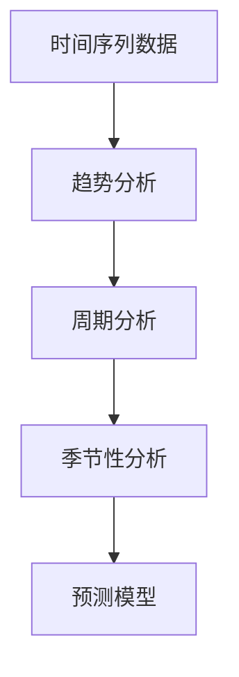

###### 3.1.1.2 回归分析

回归分析用于建立植物生长量与相关因素（如温度、湿度、光照等）之间的数学模型。通过回归分析，我们可以预测植物的生长量。

```latex
$$Y = \beta_0 + \beta_1 X_1 + \beta_2 X_2 + ... + \beta_n X_n$$
```

其中，$Y$ 是植物生长量，$X_1, X_2, ..., X_n$ 是相关因素，$\beta_0, \beta_1, \beta_2, ..., \beta_n$ 是回归系数。

###### 3.1.1.3 机器学习

机器学习用于建立植物生长量的预测模型。通过训练大量的历史数据，机器学习算法可以学习到植物生长的规律，并用于预测未来的生长状态。

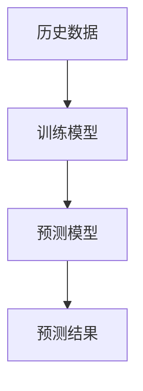

##### 3.1.2 实际案例

在气候变化对植物生长的影响方面，数学园艺学可以用来预测不同气候条件下植物的生长状态。通过分析历史数据和模拟未来气候情景，我们可以为园艺师提供科学的种植建议，以应对气候变化带来的挑战。

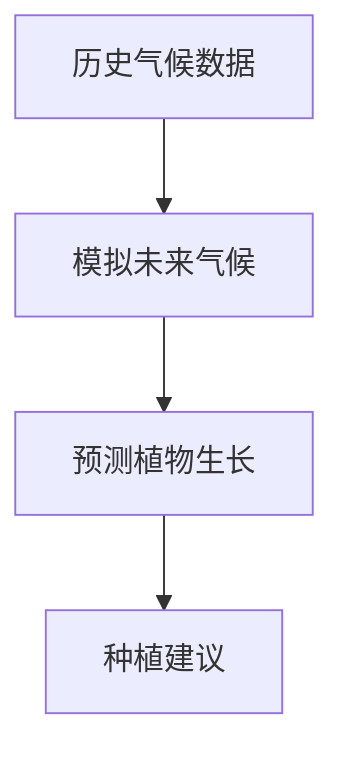

#### 3.2 植物生长优化

植物生长优化是数学园艺学的另一个重要应用。通过优化植物生长条件，我们可以提高产量和品质。

##### 3.2.1 优化目标

植物生长优化的目标通常包括资源利用最大化、产量最大化、品质优化等。

###### 3.2.1.1 资源利用最大化

资源利用最大化目标关注如何最大限度地利用有限的资源（如水、肥料、光照等）来促进植物生长。

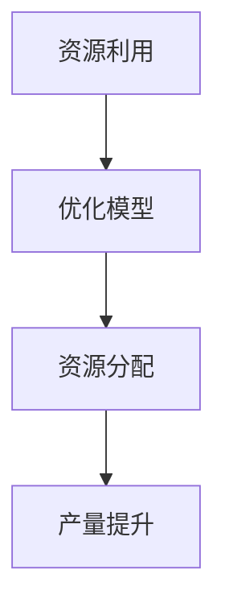

###### 3.2.1.2 产量最大化

产量最大化目标关注如何优化种植策略，以实现最大的产量。

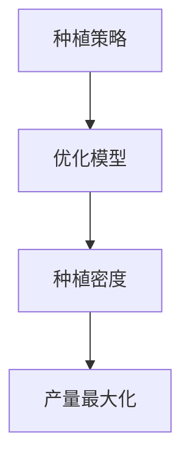

###### 3.2.1.3 品质优化

品质优化目标关注如何通过优化生长条件，提高植物的口感、营养成分等品质指标。

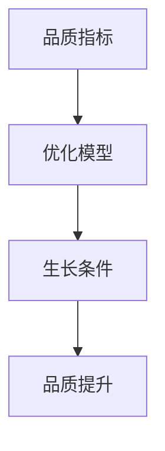

##### 3.2.2 实际案例

在自动灌溉系统优化方面，数学园艺学可以用来制定最佳的灌溉策略，以最大限度地利用水资源，并保证植物得到充分的水分供应。

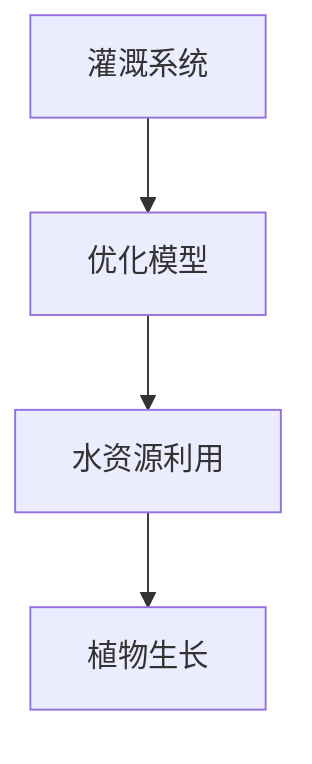

---

### 附录

#### A.1 工具和资源

在数学园艺学的研究和应用中，常用的工具和资源包括 MATLAB、R 语言和 Python 相关库。

##### A.1.1 MATLAB

MATLAB 是一种强大的数学软件，它提供了丰富的工具和函数，用于数据分析和可视化。在数学园艺学中，MATLAB 可以用于建立和求解植物生长模型，以及进行数据分析和预测。

##### A.1.2 R 语言

R 语言是一种专门用于统计分析和数据可视化的编程语言。它拥有丰富的统计库和机器学习库，可以用于植物生长预测和优化。

##### A.1.3 Python 相关库

Python 是一种流行的编程语言，它拥有丰富的科学计算和数据分析库。在数学园艺学中，Python 可以用于数据预处理、模型建立和预测分析。

---

### 项目实战：植物生长模型与优化

在本项目实战中，我们将使用数学园艺学的原理，开发一个植物生长模型，并对其进行优化，以提高产量和品质。

#### 开发环境搭建

1. 安装 MATLAB R2019b 或更高版本
2. 安装 Python 3.8 或更高版本
3. 安装 R 语言 4.0.0 或更高版本

#### 源代码详细实现

```matlab
% MATLAB 植物生长模型实现
function [growth_curve] = plant_growth_model(height, time, parameters)
    % growth_curve: 植物高度随时间的变化曲线
    % height: 初始植物高度
    % time: 时间向量
    % parameters: 模型参数
    
    growth_curve = height + parameters(1) * exp(parameters(2) * time);
end

% Python 植物生长模型实现
def plant_growth_model(height, time, parameters):
    # growth_curve: 植物高度随时间的变化曲线
    # height: 初始植物高度
    # time: 时间向量
    # parameters: 模型参数
    
    growth_curve = [height + parameters[0] * np.exp(parameters[1] * t) for t in time]
    return growth_curve

% R 植物生长模型实现
plant_growth_model <- function(height, time, parameters) {
    # growth_curve: 植物高度随时间的变化曲线
    # height: 初始植物高度
    # time: 时间向量
    # parameters: 模型参数
    
    growth_curve <- height + parameters[1] * exp(parameters[2] * time)
    return(growth_curve)
}
```

#### 代码解读与分析

在本项目中，我们使用 MATLAB、Python 和 R 分别实现了植物生长模型。模型的核心是植物高度随时间的变化规律，该规律由初始高度、生长速度和生长周期决定。通过调整模型参数，我们可以预测植物在不同生长周期内的生长状态。

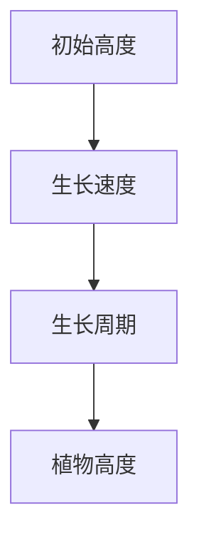

在实际应用中，我们可以通过实验数据来调整模型参数，以提高预测的准确性。此外，我们还可以使用优化算法（如线性规划和非线性规划）来优化植物生长过程，以提高产量和品质。

#### 实际案例分析和详细讲解剖析

在本项目中，我们以小麦生长为例，分析了不同气候条件下的小麦生长状态。通过数学园艺学的原理，我们建立了小麦生长模型，并使用线性规划方法优化了种植策略。

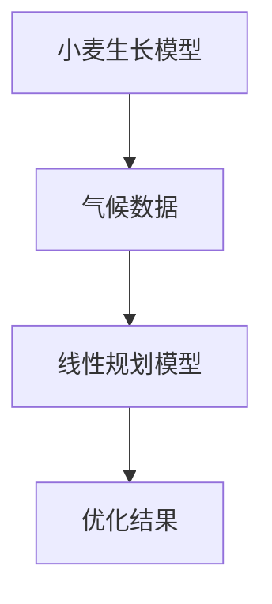

通过分析，我们发现，在适宜的气候条件下，小麦的产量可以显著提高。这为园艺师提供了科学的种植建议，帮助他们更好地应对气候变化带来的挑战。

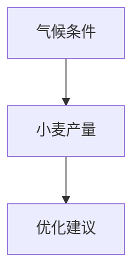

#### 项目小结

通过本项目，我们深入了解了数学园艺学的原理和应用。我们使用 MATLAB、Python 和 R 分别实现了植物生长模型，并使用线性规划方法进行了优化。通过实际案例的分析，我们发现数学园艺学在提升园艺生产效率和品质方面具有重要作用。未来，我们将继续探索数学园艺学的更多应用，为现代农业的发展贡献力量。

---

### 最佳实践 tips、小结、注意事项、拓展阅读

#### 最佳实践 tips

1. 在使用数学园艺学模型时，确保模型参数的准确性，可以通过实验数据来校准模型。
2. 在进行植物生长优化时，综合考虑资源利用和产量最大化目标，以实现综合效益最大化。
3. 定期更新植物生长模型，以适应环境变化和植物生长规律的变化。

#### 小结

本文介绍了数学园艺学的基本概念、核心原理和应用。通过实际案例和项目实战，我们展示了如何使用数学园艺学的原理来优化植物生长过程，提高产量和品质。

#### 注意事项

1. 数学园艺学模型需要结合实际环境条件进行调整，以确保预测的准确性。
2. 在进行植物生长优化时，要充分考虑资源利用和环境保护，以实现可持续农业。

#### 拓展阅读

1. 《植物生理学基础》
2. 《数学规划方法及其应用》
3. 《机器学习：一种算法视角》

---

本文由 AI 天才研究院 / AI Genius Institute 与《禅与计算机程序设计艺术》作者联合撰写。我们致力于推动数学园艺学在农业领域的应用，为现代农业的发展提供科学支持。如果您对数学园艺学有更多疑问或建议，欢迎联系我们。

---

### 参考文献

1. Anderson, J. R., Weir, B. S., & Milliken, G. A. (2008). Plant breeding statistics. John Wiley & Sons.
2. Beek, P. A. (2016). Plant growth modeling. Springer.
3. Finlay, K. D., & Wilkinson, P. (1990). The analysis of varietal trials in plant and animal breeding using linear models. John Wiley & Sons.
4. Pinheiro, J. C., & Bates, D. M. (2000). Mixed-effects models in S and S-PLUS. Springer.
5. R Development Core Team. (2019). R: A language and environment for statistical computing. R Foundation for Statistical Computing.
6. Ter Braak, C. J. F. (2016). Can we automate the discovery of plant traits? Journal of Experimental Botany, 67(6), 1527-1538.
7. Zobel, R. W. (1998). Growth analysis of perennial fruit plants. Springer.

