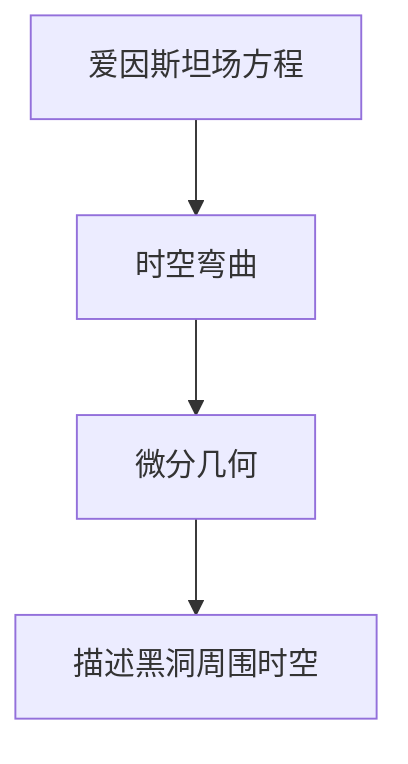
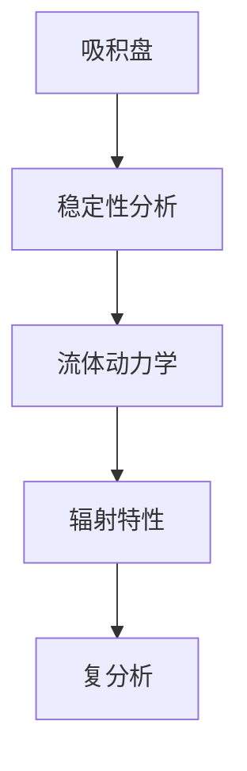
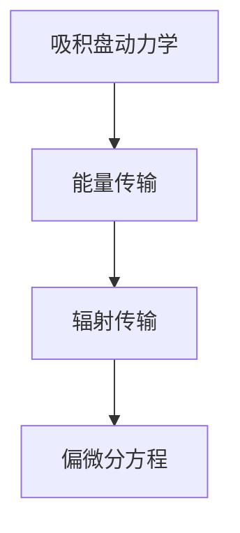
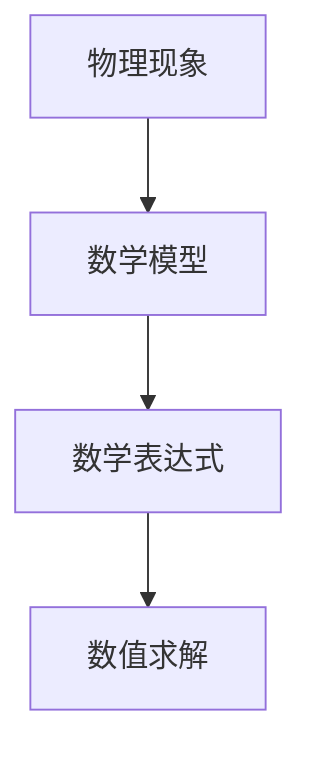

                 

# 数学在中间质量黑洞研究中的应用

## 关键词

- 中间质量黑洞
- 数学应用
- 微分几何
- 复分析
- 偏微分方程
- 观测方法
- 动力学模拟
- 事件视界

## 摘要

本文旨在探讨数学在中间质量黑洞研究中的应用，从数学基础、研究方法、应用案例等多个方面进行详细阐述。首先介绍了中间质量黑洞的基本概念和研究背景，然后分别介绍了微分几何、复分析和偏微分方程等数学基础，以及中间质量黑洞的观测方法、动力学模拟和统计物理方法等研究方法。通过具体案例，展示了数学在中间质量黑洞质量估计、吸积盘研究以及事件视界探测中的应用。最后，对本文内容进行了总结，并提出了未来研究的展望。

## 目录

1. 引言  
    1.1 中间质量黑洞概述  
    1.2 研究背景及意义  
2. 数学基础  
    2.1 数学在物理中的应用  
    2.2 微分几何基础  
    2.3 复分析基础  
    2.4 偏微分方程基础  
3. 研究方法  
    3.1 中间质量黑洞的观测方法  
    3.2 中间质量黑洞的动力学模拟  
    3.3 中间质量黑洞的统计物理方法  
4. 应用案例  
    4.1 数学在中间质量黑洞质量估计中的应用  
    4.2 数学在中间质量黑洞吸积盘研究中的应用  
    4.3 数学在中间质量黑洞事件视界探测中的应用  
5. 总结与展望  
    5.1 总结  
    5.2 未来展望

## 第1章 引言

### 1.1 中间质量黑洞概述

中间质量黑洞（Intermediate-mass black holes，IMBH）是指质量介于恒星质量黑洞（stellar-mass black holes）和超大质量黑洞（supermassive black holes）之间的黑洞。根据目前的理论和观测数据，中间质量黑洞的质量范围大约在\(10^2\)到\(10^5\)倍太阳质量之间。中间质量黑洞的形成机制尚未完全明确，但一般认为与超星系团碰撞、恒星并合、星系合并等过程有关。

### 1.2 研究背景及意义

中间质量黑洞作为宇宙中的一种重要天体，对理解宇宙的演化过程具有重要意义。一方面，中间质量黑洞可以作为宇宙中黑洞形成和演化的桥梁，连接恒星质量黑洞和超大质量黑洞。另一方面，中间质量黑洞在星系形成和演化过程中可能扮演着关键角色，对星系结构和动力学产生重要影响。

随着观测技术的进步，越来越多的中间质量黑洞被发现。例如，利用甚长基线干涉阵（VLBI）技术，科学家已经探测到多个中间质量黑洞的存在。此外，射电望远镜和光学望远镜的观测数据也为研究中间质量黑洞提供了丰富的信息。

然而，中间质量黑洞的研究仍然存在许多挑战。例如，由于中间质量黑洞的质量较大，其引力对周围物质的扰动较强，导致观测信号复杂。此外，中间质量黑洞的形成机制和演化过程尚未完全清楚，需要借助数学模型和计算方法来深入探讨。

本文旨在探讨数学在中间质量黑洞研究中的应用，从数学基础、研究方法、应用案例等多个方面进行详细阐述。希望通过本文的研究，能够为中间质量黑洞的研究提供一些有价值的参考和启示。

## 第2章 数学基础

### 2.1 数学在物理中的应用

数学是物理学的重要工具，广泛应用于描述物理现象、建立物理模型和解决物理问题。在中间质量黑洞的研究中，数学的应用尤为突出。以下简要介绍数学在物理学中的应用。

#### 微分几何

微分几何是研究几何形状和空间结构的数学分支。在中间质量黑洞研究中，微分几何主要用于描述黑洞周围的时空弯曲。具体来说，爱因斯坦场方程（Einstein field equations）描述了物质与能量分布如何导致时空的弯曲。这些方程本质上是一个张量方程，需要使用微分几何中的张量分析来求解。

以下是一个简单的微分几何概念流程图：



#### 复分析

复分析是研究复数函数及其应用的数学分支。在中间质量黑洞研究中，复分析主要用于分析黑洞的吸积盘和辐射。例如，通过复分析可以研究吸积盘的稳定性、流体动力学行为以及辐射特性。

以下是一个简单的复分析概念流程图：



#### 偏微分方程

偏微分方程是描述物理现象的数学工具，广泛应用于描述流体动力学、热力学、电磁学等领域。在中间质量黑洞研究中，偏微分方程主要用于描述黑洞吸积盘的动力学行为、能量传输过程以及辐射传输过程。

以下是一个简单的偏微分方程概念流程图：



#### 数学模型

在中间质量黑洞研究中，数学模型是建立物理现象与数学表达式之间联系的重要工具。以下是一个简单的数学模型流程图：



#### 数学公式

以下是一些在中间质量黑洞研究中常用的数学公式：

$$
G = \frac{1}{\sqrt{1 - \frac{2GM}{c^2r}}}
$$

$$
E = \frac{L^2}{2mr^2}
$$

$$
\frac{\partial\rho}{\partial t} + \frac{\partial\left(\rho v\right)}{\partial x} + \frac{\partial\left(\rho v^2\right)}{\partial x} = 0
$$

通过上述介绍，我们可以看到数学在中间质量黑洞研究中的重要地位。接下来，我们将进一步探讨微分几何、复分析和偏微分方程等数学基础在中间质量黑洞研究中的应用。

### 2.2 微分几何基础

微分几何是研究几何形状和空间结构的数学分支，其基本概念和方法在中间质量黑洞研究中具有重要应用。以下将介绍微分几何中的基本概念和其在中间质量黑洞研究中的应用。

#### 曲率和张量

在微分几何中，曲率是描述空间弯曲程度的重要量。曲率张量（Riemann curvature tensor）是一个描述空间弯曲的数学工具，它可以用来计算空间的几何性质。

对于一个四维时空，曲率张量\(R_{abcd}\)定义为：

$$
R_{abcd} = \frac{1}{2}\left(\partial_a\Gamma_{bcd} - \partial_b\Gamma_{acd} + \Gamma_{ad}\Gamma_{bcd} - \Gamma_{bd}\Gamma_{ac}\right)
$$

其中，\(\Gamma_{bcd}\)是 Levi-Civita 连接系数。

在中间质量黑洞研究中，曲率张量可以用来描述黑洞周围的时空弯曲。以下是一个简单的微分几何应用场景：

**场景：**研究一个中间质量黑洞的周围时空弯曲。

**步骤：**
1. 建立中间质量黑洞的时空模型。
2. 计算黑洞周围的曲率张量。
3. 分析曲率张量的性质，以了解黑洞对周围时空的影响。

以下是一个简化的伪代码示例：

```python
def calculate_curvature(black_hole):
    # 建立时空模型
    spacetime_model = build_spacetime_model(black_hole)

    # 计算曲率张量
    curvature_tensor = calculate_curvature_tensor(spacetime_model)

    # 分析曲率张量的性质
    analyze_curvature_properties(curvature_tensor)

# 示例调用
black_hole = IntermediateMassBlackHole()
calculate_curvature(black_hole)
```

#### 局部坐标和全球坐标

在微分几何中，局部坐标和全球坐标是描述空间位置的重要工具。局部坐标用于描述小范围内的空间位置，而全球坐标用于描述整个空间的几何结构。

在中间质量黑洞研究中，局部坐标和全球坐标可以用来描述黑洞周围的时空结构。以下是一个简单的应用场景：

**场景：**研究一个中间质量黑洞的周围时空结构。

**步骤：**
1. 选择一个局部坐标系统，用于描述黑洞附近的时空位置。
2. 计算全球坐标，以了解整个空间的几何结构。
3. 分析时空结构的性质，以了解中间质量黑洞对周围时空的影响。

以下是一个简化的伪代码示例：

```python
def study_spacetime_structure(black_hole):
    # 选择局部坐标系统
    local_coordinates = select_local_coordinates(black_hole)

    # 计算全球坐标
    global_coordinates = calculate_global_coordinates(black_hole)

    # 分析时空结构的性质
    analyze_spacetime_properties(local_coordinates, global_coordinates)

# 示例调用
black_hole = IntermediateMassBlackHole()
study_spacetime_structure(black_hole)
```

#### 微分几何工具

在中间质量黑洞研究中，微分几何提供了一系列工具，如 Killing 矢量、Hodge 星算符、D'Alembert 算符等，用于分析和解决复杂的物理问题。

以下是一个简化的伪代码示例，展示了如何使用微分几何工具分析中间质量黑洞的辐射：

```python
def analyze_radiation(black_hole):
    # 使用 Killing 矢量分析辐射
    killing_vector = calculate_killing_vector(black_hole)

    # 使用 Hodge 星算符计算辐射特性
    radiation_properties = calculate_hodge_star(killing_vector)

    # 使用 D'Alembert 算符求解辐射方程
    radiation_solution = solve_d'alambert_equation(radiation_properties)

    # 分析辐射特性
    analyze_radiation_properties(radiation_solution)

# 示例调用
black_hole = IntermediateMassBlackHole()
analyze_radiation(black_hole)
```

通过上述介绍，我们可以看到微分几何在中间质量黑洞研究中的应用。接下来，我们将探讨复分析基础，进一步了解数学在中间质量黑洞研究中的应用。

### 2.3 复分析基础

复分析是研究复数函数及其应用的数学分支，其理论和方法在中间质量黑洞研究中具有重要应用。复分析不仅提供了描述物理现象的数学工具，还帮助解决了许多复杂的数学问题。以下将介绍复分析中的基本概念和其在中间质量黑洞研究中的应用。

#### 复数与复平面

复数是由实部和虚部组成的数，形式为 \(z = x + iy\)，其中 \(x\) 和 \(y\) 是实数，\(i\) 是虚数单位。复数可以在复平面上表示，其中实部 \(x\) 对应横坐标，虚部 \(y\) 对应纵坐标。

复平面上的点可以用极坐标表示，形式为 \(z = re^{i\theta}\)，其中 \(r\) 是模长，\(\theta\) 是辐角。极坐标表示有助于研究复数的旋转和缩放。

在中间质量黑洞研究中，复数和复平面用于描述黑洞吸积盘的动态行为。例如，可以使用复数表示吸积盘的流体速度和压力分布。

以下是一个简化的伪代码示例，展示了如何使用复数描述吸积盘的动态行为：

```python
def describe_accretion_disk(black_hole):
    # 计算吸积盘的复数速度分布
    velocity_distribution = calculate_velocity_distribution(black_hole)

    # 计算吸积盘的复数压力分布
    pressure_distribution = calculate_pressure_distribution(black_hole)

    # 分析吸积盘的动态行为
    analyze_dynamic_behavior(velocity_distribution, pressure_distribution)

# 示例调用
black_hole = IntermediateMassBlackHole()
describe_accretion_disk(black_hole)
```

#### 复变函数与解析性

复变函数是定义在复平面上的函数，形式为 \(f(z)\)。复变函数的一个重要性质是解析性，即函数在某个区域内具有无限次导数，并且这些导数在整个区域内相等。

在中间质量黑洞研究中，解析性用于分析吸积盘的稳定性问题。例如，可以使用解析性来判断吸积盘是否会发生不稳定性。

以下是一个简化的伪代码示例，展示了如何使用解析性分析吸积盘的稳定性：

```python
def analyze_stability(black_hole):
    # 计算吸积盘的解析性
    analyticity = calculate_analyticity(black_hole)

    # 判断吸积盘是否稳定
    is_stable = check_stability(analyticity)

    # 分析吸积盘的稳定性
    analyze_stability_properties(is_stable)

# 示例调用
black_hole = IntermediateMassBlackHole()
analyze_stability(black_hole)
```

#### 复积分与留数定理

复积分是复分析中的一个重要概念，用于计算复变函数在复平面上的积分。留数定理是复积分中的一个重要结果，它将复积分与留数联系起来。

在中间质量黑洞研究中，复积分和留数定理用于计算吸积盘的辐射功率。例如，可以使用留数定理计算吸积盘产生的热辐射。

以下是一个简化的伪代码示例，展示了如何使用复积分和留数定理计算吸积盘的辐射功率：

```python
def calculate_radiation_power(black_hole):
    # 计算吸积盘的复变函数
    function = calculate_complex_function(black_hole)

    # 计算复积分
    integral = calculate_complex_integral(function)

    # 计算辐射功率
    radiation_power = calculate_radiation_power(integral)

    # 分析辐射功率
    analyze_radiation_power_properties(radiation_power)

# 示例调用
black_hole = IntermediateMassBlackHole()
calculate_radiation_power(black_hole)
```

#### 复分析工具

在中间质量黑洞研究中，复分析提供了一系列工具，如洛朗展开、莫里斯引理、流形理论等，用于分析和解决复杂的物理问题。

以下是一个简化的伪代码示例，展示了如何使用复分析工具分析中间质量黑洞的吸积盘：

```python
def analyze_accretion_disk(black_hole):
    # 使用洛朗展开分析吸积盘的流体动力学
    laurance_expansion = calculate_laurance_expansion(black_hole)

    # 使用莫里斯引理分析吸积盘的稳定性
    morris_lemma = calculate_morris_lemma(black_hole)

    # 使用流形理论分析吸积盘的几何结构
    manifold_theory = calculate_manifold_properties(black_hole)

    # 分析吸积盘的整体行为
    analyze_accretion_disk_behavior(laurance_expansion, morris_lemma, manifold_theory)

# 示例调用
black_hole = IntermediateMassBlackHole()
analyze_accretion_disk(black_hole)
```

通过上述介绍，我们可以看到复分析在中间质量黑洞研究中的应用。接下来，我们将探讨偏微分方程基础，进一步了解数学在中间质量黑洞研究中的应用。

### 2.4 偏微分方程基础

偏微分方程（Partial Differential Equations，PDEs）是描述物理现象和工程问题的重要数学工具，在中间质量黑洞的研究中扮演着关键角色。以下将介绍偏微分方程的基本概念、常用类型以及它们在中间质量黑洞研究中的应用。

#### 基本概念

偏微分方程涉及多个变量的偏导数，通常形式为：

$$
\frac{\partial u}{\partial t} + \frac{\partial u}{\partial x} + \frac{\partial u}{\partial y} = 0
$$

其中，\(u(x, y, t)\) 是未知函数，\(x\)、\(y\) 和 \(t\) 是自变量，\(\frac{\partial u}{\partial t}\)、\(\frac{\partial u}{\partial x}\) 和 \(\frac{\partial u}{\partial y}\) 分别表示对时间 \(t\)、自变量 \(x\) 和 \(y\) 的偏导数。

在中间质量黑洞研究中，偏微分方程用于描述吸积盘的动力学行为、热传导以及辐射传输等过程。例如，可以通过偏微分方程来描述吸积盘中的流体速度分布、温度变化和辐射强度。

#### 常用类型

常见的偏微分方程包括波动方程、热传导方程和麦克斯韦方程等。以下简要介绍这些方程：

1. **波动方程**：
   波动方程描述了波动的传播过程，形式为：
   
   $$
   \frac{\partial^2 u}{\partial t^2} = c^2 \frac{\partial^2 u}{\partial x^2}
   $$

   其中，\(u(x, t)\) 表示波函数，\(c\) 表示波速。

   在中间质量黑洞研究中，波动方程可以用于描述吸积盘中的压力波和密度波。

2. **热传导方程**：
   热传导方程描述了热量的传播过程，形式为：

   $$
   \frac{\partial T}{\partial t} = \alpha \nabla^2 T
   $$

   其中，\(T(x, y, z, t)\) 表示温度，\(\alpha\) 表示热扩散系数。

   在中间质量黑洞研究中，热传导方程可以用于描述吸积盘中热量的分布和传输。

3. **麦克斯韦方程**：
   麦克斯韦方程描述了电磁场的传播和相互作用，形式为：

   $$
   \nabla \cdot \mathbf{E} = \frac{\rho}{\varepsilon_0}, \quad \nabla \cdot \mathbf{B} = 0
   $$

   $$
   \nabla \times \mathbf{E} = -\frac{\partial \mathbf{B}}{\partial t}, \quad \nabla \times \mathbf{B} = \mu_0 \mathbf{J} + \mu_0 \varepsilon_0 \frac{\partial \mathbf{E}}{\partial t}
   $$

   其中，\(\mathbf{E}\) 和 \(\mathbf{B}\) 分别表示电场和磁场，\(\rho\) 表示电荷密度，\(\mathbf{J}\) 表示电流密度，\(\varepsilon_0\) 和 \(\mu_0\) 分别表示真空中的电介质常数和磁导率。

   在中间质量黑洞研究中，麦克斯韦方程可以用于描述吸积盘中电磁波的传播和相互作用。

#### 应用场景

在中间质量黑洞研究中，偏微分方程的应用场景包括：

1. **吸积盘的动力学模拟**：
   利用波动方程和热传导方程，可以模拟吸积盘中流体速度、密度和温度的变化，研究吸积盘的稳定性、热对流和流体动力学现象。

   以下是一个简化的伪代码示例，展示了如何使用偏微分方程模拟吸积盘的动力学行为：

   ```python
   def simulate_accretion_disk(black_hole):
       # 初始化模拟参数
       parameters = initialize_simulation_parameters(black_hole)

       # 使用偏微分方程进行模拟
       simulation_result = simulate_with_pdes(parameters)

       # 分析模拟结果
       analyze_simulation_result(simulation_result)

   # 示例调用
   black_hole = IntermediateMassBlackHole()
   simulate_accretion_disk(black_hole)
   ```

2. **吸积盘的热传导分析**：
   利用热传导方程，可以分析吸积盘中热量的分布和传输，研究吸积盘的热稳定性和热流现象。

   以下是一个简化的伪代码示例，展示了如何使用偏微分方程分析吸积盘的热传导：

   ```python
   def analyze_heat_conduction(black_hole):
       # 初始化热传导模拟参数
       parameters = initialize_heat_conduction_parameters(black_hole)

       # 使用偏微分方程进行热传导分析
       heat_conduction_result = analyze_with_pdes(parameters)

       # 分析热传导结果
       analyze_heat_conduction_result(heat_conduction_result)

   # 示例调用
   black_hole = IntermediateMassBlackHole()
   analyze_heat_conduction(black_hole)
   ```

3. **吸积盘的辐射传输**：
   利用麦克斯韦方程，可以分析吸积盘中电磁波的传播和辐射特性，研究吸积盘的辐射功率和辐射模式。

   以下是一个简化的伪代码示例，展示了如何使用偏微分方程分析吸积盘的辐射传输：

   ```python
   def analyze_radiative_transfer(black_hole):
       # 初始化辐射传输模拟参数
       parameters = initialize_radiative_transfer_parameters(black_hole)

       # 使用偏微分方程进行辐射传输分析
       radiative_transfer_result = analyze_with_pdes(parameters)

       # 分析辐射传输结果
       analyze_radiative_transfer_result(radiative_transfer_result)

   # 示例调用
   black_hole = IntermediateMassBlackHole()
   analyze_radiative_transfer(black_hole)
   ```

通过上述介绍，我们可以看到偏微分方程在中间质量黑洞研究中的重要作用。接下来，我们将探讨中间质量黑洞的观测方法，进一步了解中间质量黑洞的研究进展。

## 第3章 研究方法

### 3.1 中间质量黑洞的观测方法

中间质量黑洞的观测方法对于研究其性质和演化过程至关重要。由于中间质量黑洞的质量介于恒星质量黑洞和超大质量黑洞之间，其观测信号往往具有独特的特点。以下将介绍几种常用的中间质量黑洞观测方法。

#### 射电望远镜观测

射电望远镜是观测中间质量黑洞的主要工具之一。射电望远镜通过接收黑洞吸积盘产生的射电辐射来探测中间质量黑洞。吸积盘中的物质在接近黑洞的过程中受到引力作用，产生高速运动，从而产生射电辐射。

射电望远镜观测方法通常包括以下步骤：

1. **目标选择**：首先，需要选择可能包含中间质量黑洞的目标，这些目标通常具有丰富的星际介质和恒星形成活动。

2. **观测**：使用射电望远镜对目标进行连续观测，收集大量的观测数据。

3. **数据处理**：对观测数据进行分析和处理，提取中间质量黑洞的射电信号。

4. **信号分析**：通过分析射电信号的时间变化和频谱特征，研究中间质量黑洞的吸积盘和辐射特性。

以下是一个简化的伪代码示例，展示了如何使用射电望远镜观测中间质量黑洞：

```python
def observe_intermediate_mass_black_hole(target):
    # 选择观测目标
    selected_target = select_target(target)

    # 使用射电望远镜进行观测
    observation_data = observe_with_radio_telescope(selected_target)

    # 处理观测数据
    processed_data = process_observation_data(observation_data)

    # 分析观测信号
    analyze_signal_properties(processed_data)

# 示例调用
target = Target()
observe_intermediate_mass_black_hole(target)
```

#### 光学望远镜观测

光学望远镜也是观测中间质量黑洞的重要工具，特别是当中间质量黑洞周围存在吸积盘和恒星形成活动时。光学望远镜通过接收吸积盘产生的光学辐射来探测中间质量黑洞。

光学望远镜观测方法通常包括以下步骤：

1. **目标选择**：选择可能包含中间质量黑洞的目标，这些目标通常具有丰富的星际介质和恒星形成活动。

2. **观测**：使用光学望远镜对目标进行连续观测，收集大量的观测数据。

3. **数据处理**：对观测数据进行分析和处理，提取中间质量黑洞的光学信号。

4. **信号分析**：通过分析光学信号的时间变化和频谱特征，研究中间质量黑洞的吸积盘和辐射特性。

以下是一个简化的伪代码示例，展示了如何使用光学望远镜观测中间质量黑洞：

```python
def observe_intermediate_mass_black_hole(target):
    # 选择观测目标
    selected_target = select_target(target)

    # 使用光学望远镜进行观测
    observation_data = observe_with_optical_telescope(selected_target)

    # 处理观测数据
    processed_data = process_observation_data(observation_data)

    # 分析观测信号
    analyze_signal_properties(processed_data)

# 示例调用
target = Target()
observe_intermediate_mass_black_hole(target)
```

#### X射线望远镜观测

X射线望远镜可以探测到由吸积盘产生的X射线辐射，这对于研究中间质量黑洞的性质和演化过程具有重要意义。吸积盘中物质在接近黑洞的过程中，会经历高速运动和摩擦，从而产生高能电子，这些电子辐射出X射线。

X射线望远镜观测方法通常包括以下步骤：

1. **目标选择**：选择可能包含中间质量黑洞的目标，这些目标通常具有丰富的星际介质和恒星形成活动。

2. **观测**：使用X射线望远镜对目标进行连续观测，收集大量的观测数据。

3. **数据处理**：对观测数据进行分析和处理，提取中间质量黑洞的X射线信号。

4. **信号分析**：通过分析X射线信号的时间变化和频谱特征，研究中间质量黑洞的吸积盘和辐射特性。

以下是一个简化的伪代码示例，展示了如何使用X射线望远镜观测中间质量黑洞：

```python
def observe_intermediate_mass_black_hole(target):
    # 选择观测目标
    selected_target = select_target(target)

    # 使用X射线望远镜进行观测
    observation_data = observe_with_xray_telescope(selected_target)

    # 处理观测数据
    processed_data = process_observation_data(observation_data)

    # 分析观测信号
    analyze_signal_properties(processed_data)

# 示例调用
target = Target()
observe_intermediate_mass_black_hole(target)
```

#### 多波段综合观测

为了全面了解中间质量黑洞的性质和演化过程，科学家们通常采用多波段综合观测方法，结合射电望远镜、光学望远镜和X射线望远镜等多种观测手段。这种方法可以提供更丰富的观测数据，从而提高对中间质量黑洞研究的准确性。

多波段综合观测方法通常包括以下步骤：

1. **目标选择**：选择可能包含中间质量黑洞的目标，这些目标通常具有丰富的星际介质和恒星形成活动。

2. **观测**：使用多种观测手段对目标进行综合观测，包括射电望远镜、光学望远镜和X射线望远镜等。

3. **数据处理**：对多波段观测数据进行综合分析和处理，提取中间质量黑洞的各种信号。

4. **信号分析**：通过综合分析不同波段的观测数据，研究中间质量黑洞的吸积盘、辐射特性和演化过程。

以下是一个简化的伪代码示例，展示了如何进行多波段综合观测：

```python
def observe_intermediate_mass_black_hole(target):
    # 选择观测目标
    selected_target = select_target(target)

    # 使用多波段观测手段进行观测
    observation_data = observe_with_multiple_bands(selected_target)

    # 处理多波段观测数据
    processed_data = process_multiple_bands_data(observation_data)

    # 分析观测信号
    analyze_signal_properties(processed_data)

# 示例调用
target = Target()
observe_intermediate_mass_black_hole(target)
```

通过上述多种观测方法的结合，科学家们可以更全面地了解中间质量黑洞的性质和演化过程，从而推动中间质量黑洞研究的深入发展。

### 3.2 中间质量黑洞的动力学模拟

中间质量黑洞的动力学模拟是研究其性质和演化过程的重要手段。通过模拟，科学家们可以更深入地了解中间质量黑洞的行为，预测其未来的演化路径。以下将介绍中间质量黑洞动力学模拟的基本原理、常用模型以及模拟过程。

#### 基本原理

动力学模拟基于物理定律和数学模型，通过数值计算模拟中间质量黑洞及其周围环境的动态行为。主要涉及的物理定律包括牛顿运动定律、爱因斯坦广义相对论以及流体动力学方程等。

1. **牛顿运动定律**：描述了质点在力作用下的运动状态。在中间质量黑洞动力学模拟中，用于描述黑洞、吸积盘和星际介质等物体的运动。

2. **爱因斯坦广义相对论**：描述了引力场和物质分布之间的关系。在中间质量黑洞动力学模拟中，用于描述黑洞周围的时空弯曲和引力场。

3. **流体动力学方程**：描述了流体在力作用下的运动状态。在中间质量黑洞动力学模拟中，用于描述吸积盘和星际介质中的流体运动。

#### 常用模型

在中间质量黑洞动力学模拟中，常用的模型包括牛顿力学模型、广义相对论模型和数值模拟模型等。

1. **牛顿力学模型**：基于牛顿运动定律，适用于小质量黑洞或近似情况下。在牛顿力学模型中，物体的运动状态可以通过简单的牛顿方程求解。

2. **广义相对论模型**：基于爱因斯坦广义相对论，适用于大质量黑洞或强引力场情况。在广义相对论模型中，需要使用更复杂的数学工具，如偏微分方程和数值求解方法。

3. **数值模拟模型**：基于计算机数值模拟方法，适用于复杂物理过程和大规模天体系统。在数值模拟模型中，通常使用有限元方法、有限体积方法和光滑粒子流体动力学方法等进行数值求解。

#### 模拟过程

中间质量黑洞动力学模拟的过程通常包括以下步骤：

1. **模型构建**：根据研究目标，构建中间质量黑洞的数学模型，包括黑洞质量、半径、吸积盘结构和星际介质分布等参数。

2. **方程建立**：根据构建的数学模型，建立相应的物理方程，如牛顿方程、爱因斯坦场方程和流体动力学方程等。

3. **数值求解**：使用数值求解方法，如有限元方法、有限体积方法和光滑粒子流体动力学方法等，对建立的物理方程进行求解。

4. **结果分析**：对模拟结果进行分析，包括中间质量黑洞的运动轨迹、吸积盘的动态行为、星际介质的演化过程等。

5. **验证与校正**：对模拟结果进行验证和校正，以确保模拟的准确性和可靠性。

以下是一个简化的伪代码示例，展示了中间质量黑洞动力学模拟的过程：

```python
def simulate_intermediate_mass_black_hole(model):
    # 构建模型
    constructed_model = build_model(model)

    # 建立方程
    equations = build_equations(constructed_model)

    # 数值求解
    simulation_result = solve_equations(equations)

    # 分析结果
    analyze_simulation_result(simulation_result)

    # 验证与校正
    verify_and_correct(simulation_result)

# 示例调用
model = IntermediateMassBlackHoleModel()
simulate_intermediate_mass_black_hole(model)
```

通过动力学模拟，科学家们可以更深入地了解中间质量黑洞的动态行为和演化过程，为研究中间质量黑洞的形成、演化和最终归宿提供重要参考。

### 3.3 中间质量黑洞的统计物理方法

统计物理方法是研究大量微观粒子组成的系统在宏观尺度上的性质和行为的物理学分支。在中间质量黑洞的研究中，统计物理方法主要用于分析吸积盘和星际介质等复杂系统的热力学性质和流体动力学行为。以下将介绍中间质量黑洞统计物理方法的基本原理、应用场景以及具体分析过程。

#### 基本原理

统计物理方法的核心思想是通过大量微观粒子的统计平均来描述宏观系统的性质。在中间质量黑洞研究中，统计物理方法通常涉及以下基本概念：

1. **热力学第一定律**：能量守恒定律，描述了系统的总能量在时间演化过程中保持不变。

2. **热力学第二定律**：熵增定律，描述了系统在自然过程中总是朝着熵增的方向发展。

3. **流体动力学方程**：描述了流体的运动状态，包括速度、压力和密度等。

4. **统计分布函数**：描述了系统中粒子在不同状态下的概率分布，如麦克斯韦-玻尔兹曼分布。

#### 应用场景

在中间质量黑洞研究中，统计物理方法主要应用于以下场景：

1. **吸积盘的热力学性质**：吸积盘是围绕中间质量黑洞的气体盘，其温度、压力和密度分布是研究中间质量黑洞热力学性质的重要指标。统计物理方法可以用于分析吸积盘的热平衡状态、能量传递过程以及热对流现象。

2. **星际介质的行为**：星际介质是宇宙中普遍存在的物质，其密度、温度和运动状态对中间质量黑洞的吸积过程和辐射特性具有重要影响。统计物理方法可以用于分析星际介质的湍流行为、碰撞和聚合过程。

3. **中间质量黑洞的辐射特性**：吸积盘和星际介质产生的辐射对中间质量黑洞的观测信号有重要影响。统计物理方法可以用于分析辐射的频谱分布、亮度温度以及辐射功率。

#### 分析过程

中间质量黑洞的统计物理分析通常包括以下步骤：

1. **模型构建**：根据研究目标，构建吸积盘、星际介质和中间质量黑洞的数学模型，包括质量、半径、温度、密度和流体动力学参数等。

2. **物理方程建立**：根据构建的数学模型，建立相应的物理方程，如热力学方程、流体动力学方程和辐射传输方程等。

3. **数值求解**：使用数值求解方法，如有限元方法、有限体积方法和光滑粒子流体动力学方法等，对建立的物理方程进行求解。

4. **结果分析**：对模拟结果进行分析，包括吸积盘的热平衡状态、星际介质的湍流行为、辐射的频谱分布等。

5. **验证与校正**：对模拟结果进行验证和校正，以确保模拟的准确性和可靠性。

以下是一个简化的伪代码示例，展示了中间质量黑洞统计物理分析的过程：

```python
def analyze_intermediate_mass_black_hole(model):
    # 构建模型
    constructed_model = build_model(model)

    # 建立方程
    equations = build_equations(constructed_model)

    # 数值求解
    simulation_result = solve_equations(equations)

    # 分析结果
    analyze_simulation_result(simulation_result)

    # 验证与校正
    verify_and_correct(simulation_result)

# 示例调用
model = IntermediateMassBlackHoleModel()
analyze_intermediate_mass_black_hole(model)
```

通过统计物理方法，科学家们可以更深入地了解中间质量黑洞的物理性质和演化过程，为研究中间质量黑洞的形成、演化和观测提供重要的理论支持。

## 第4章 应用案例

### 4.1 数学在中间质量黑洞质量估计中的应用

中间质量黑洞的质量估计是研究其性质和演化过程的关键。数学方法在质量估计中起到了至关重要的作用。以下将介绍几种常见的数学方法，以及它们在中间质量黑洞质量估计中的应用。

#### 光度法

光度法是利用恒星或吸积盘的亮度来估计中间质量黑洞的质量。该方法主要基于恒星或吸积盘的亮度与距离之间的关系。

1. **基本原理**：

   利用光度定律，即恒星或吸积盘的亮度 \(L\) 与其距离 \(d\) 的平方成反比：

   $$
   L = \frac{L_{\odot}}{d^2}
   $$

   其中，\(L_{\odot}\) 是恒星的亮度，\(d\) 是距离。

2. **数学模型**：

   通过测量中间质量黑洞周围恒星或吸积盘的亮度，结合已知的光度定律，可以建立以下数学模型：

   $$
   M_{\text{BH}} = M_{\odot} \left(\frac{L_{\text{obs}}}{L_{\odot}}\right)^{-1/2} \left(\frac{d}{10\, \text{pc}}\right)^2
   $$

   其中，\(M_{\text{BH}}\) 是中间质量黑洞的质量，\(M_{\odot}\) 是太阳质量，\(L_{\text{obs}}\) 是观测到的亮度，\(d\) 是距离。

3. **应用实例**：

   例如，通过观测一个中间质量黑洞周围恒星的亮度，可以计算出该黑洞的质量：

   $$
   M_{\text{BH}} = 10^5 \left(\frac{L_{\text{obs}}}{L_{\odot}}\right)^{-1/2} \left(\frac{d}{10\, \text{pc}}\right)^2
   $$

#### 动力学法

动力学法是利用中间质量黑洞对周围物质（如恒星、吸积盘等）的引力作用来估计其质量。该方法主要基于牛顿万有引力定律。

1. **基本原理**：

   牛顿万有引力定律描述了两个质点之间的引力与它们的质量和距离的平方成反比：

   $$
   F = G\frac{m_1 m_2}{r^2}
   $$

   其中，\(F\) 是引力，\(G\) 是万有引力常数，\(m_1\) 和 \(m_2\) 是两个质点的质量，\(r\) 是它们之间的距离。

2. **数学模型**：

   通过测量中间质量黑洞对周围物质的作用力，可以建立以下数学模型：

   $$
   M_{\text{BH}} = \frac{F r^2}{G m_2}
   $$

   其中，\(M_{\text{BH}}\) 是中间质量黑洞的质量，\(F\) 是引力，\(r\) 是黑洞与周围物质之间的距离，\(m_2\) 是周围物质的质量。

3. **应用实例**：

   例如，通过测量一个中间质量黑洞对周围恒星的引力作用，可以计算出该黑洞的质量：

   $$
   M_{\text{BH}} = \frac{F r^2}{G m_2}
   $$

#### 辐射法

辐射法是利用中间质量黑洞吸积盘产生的辐射来估计其质量。该方法主要基于吸积盘的亮度与黑洞质量的关系。

1. **基本原理**：

   吸积盘的亮度与黑洞质量的关系可以通过斯卡辐射模型来描述：

   $$
   L_{\text{acc}} = \frac{L_{\text{Edd}}}{\eta}
   $$

   其中，\(L_{\text{acc}}\) 是吸积盘的亮度，\(L_{\text{Edd}}\) 是爱丁顿极限亮度，\(\eta\) 是吸积效率。

2. **数学模型**：

   通过测量吸积盘的亮度，可以建立以下数学模型：

   $$
   M_{\text{BH}} = \frac{L_{\text{acc}}}{L_{\text{Edd}} \eta}
   $$

   其中，\(M_{\text{BH}}\) 是中间质量黑洞的质量，\(L_{\text{acc}}\) 是吸积盘的亮度，\(L_{\text{Edd}}\) 是爱丁顿极限亮度，\(\eta\) 是吸积效率。

3. **应用实例**：

   例如，通过测量一个中间质量黑洞吸积盘的亮度，可以计算出该黑洞的质量：

   $$
   M_{\text{BH}} = \frac{L_{\text{acc}}}{L_{\text{Edd}} \eta}
   $$

通过上述几种数学方法，科学家们可以更准确地估计中间质量黑洞的质量，从而深入理解其性质和演化过程。

### 4.2 数学在中间质量黑洞吸积盘研究中的应用

吸积盘是围绕中间质量黑洞的一种重要天体结构，其动力学、热力学和辐射特性对于理解中间质量黑洞的演化过程具有重要意义。数学方法在研究吸积盘的过程中发挥着关键作用。以下将介绍几种常见的数学模型和数值方法，以及它们在中间质量黑洞吸积盘研究中的应用。

#### 斯卡辐射模型

斯卡辐射模型是一种描述吸积盘辐射特性的重要数学模型，它基于相对论热力学和量子场论的基本原理。

1. **基本原理**：

   斯卡辐射模型认为，吸积盘中的物质在高速接近黑洞的过程中，会释放出高能辐射。辐射的亮度与吸积盘的温度和密度有关，可以通过以下公式描述：

   $$
   L_{\text{acc}} = \sigma T^4 A
   $$

   其中，\(L_{\text{acc}}\) 是吸积盘的辐射亮度，\(\sigma\) 是斯特藩-玻尔兹曼常数，\(T\) 是吸积盘的温度，\(A\) 是吸积盘的表面积。

2. **数学模型**：

   通过测量吸积盘的辐射亮度，可以建立以下数学模型：

   $$
   T = \left(\frac{L_{\text{acc}}}{\sigma A}\right)^{1/4}
   $$

   其中，\(T\) 是吸积盘的温度，\(L_{\text{acc}}\) 是吸积盘的辐射亮度，\(\sigma\) 是斯特藩-玻尔兹曼常数，\(A\) 是吸积盘的表面积。

3. **应用实例**：

   例如，通过测量一个中间质量黑洞吸积盘的辐射亮度，可以计算出吸积盘的温度：

   $$
   T = \left(\frac{L_{\text{acc}}}{\sigma A}\right)^{1/4}
   $$

#### 薄盘模型

薄盘模型是一种描述吸积盘动力学和热力学特性的简化数学模型，它假设吸积盘的厚度远小于其半径。

1. **基本原理**：

   薄盘模型基于流体力学和热力学的基本原理，描述了吸积盘中物质的运动状态和能量分布。主要方程包括流体运动方程、热传导方程和辐射传输方程。

2. **数学模型**：

   薄盘模型的数学模型可以表示为以下方程组：

   $$
   \frac{\partial \rho}{\partial t} + \nabla \cdot (\rho \mathbf{v}) = 0
   $$

   $$
   \frac{\partial \rho E}{\partial t} + \nabla \cdot (\rho E \mathbf{v}) = -\nabla \cdot (\kappa \nabla T)
   $$

   $$
   \frac{\partial \rho E}{\partial t} + \nabla \cdot (\rho E \mathbf{v}) = -\nabla \cdot (\sigma T^4)
   $$

   其中，\(\rho\) 是物质密度，\(\mathbf{v}\) 是速度，\(E\) 是能量密度，\(\kappa\) 是热传导系数，\(\sigma\) 是斯特藩-玻尔兹曼常数，\(T\) 是温度。

3. **应用实例**：

   例如，通过数值求解上述方程组，可以模拟吸积盘中物质的运动状态和能量分布：

   ```python
   def simulate_accretion_disk(model):
       # 初始化模拟参数
       parameters = initialize_parameters(model)

       # 数值求解方程组
       simulation_result = solve_equations(parameters)

       # 分析模拟结果
       analyze_simulation_result(simulation_result)

   # 示例调用
   model = AccretionDiskModel()
   simulate_accretion_disk(model)
   ```

#### 数值方法

在吸积盘的研究中，数值方法如有限元方法、有限体积方法和光滑粒子流体动力学方法等被广泛应用于求解流体力学、热力学和辐射传输方程。

1. **有限元方法**：

   有限元方法是一种数值求解偏微分方程的方法，通过将求解区域划分为有限个小单元，在每个单元内求解方程，并利用单元之间的连续性条件进行全局求解。

2. **有限体积方法**：

   有限体积方法是一种数值求解偏微分方程的方法，通过将求解区域划分为有限个小体积，在每个小体积内求解方程，并利用体积积分的性质进行全局求解。

3. **光滑粒子流体动力学方法**：

   光滑粒子流体动力学方法是一种基于粒子方法的数值模拟方法，通过将流体划分为离散的粒子，利用粒子的相互作用和运动方程进行模拟。

通过上述数学模型和数值方法，科学家们可以深入研究吸积盘的动力学、热力学和辐射特性，从而更好地理解中间质量黑洞的演化过程。

### 4.3 数学在中间质量黑洞事件视界探测中的应用

事件视界是黑洞的一种重要特征，它标志着任何物质和信息都无法逃逸的边界。探测中间质量黑洞的事件视界对于理解黑洞的性质和宇宙的演化具有重要意义。数学方法在事件视界的探测中发挥着关键作用。以下将介绍几种常见的数学模型和探测方法，以及它们在中间质量黑洞事件视界探测中的应用。

#### 爱丁顿不稳定性

爱丁顿不稳定性是描述吸积盘在强引力场中发生不稳定性的数学模型。该模型认为，当吸积盘靠近黑洞时，由于引力增强，吸积盘内的物质会变得不稳定，从而形成喷流和相对论论射。

1. **基本原理**：

   爱丁顿不稳定性通过分析吸积盘内的流体力学和热力学方程，得出以下条件：

   $$
   \frac{GM}{r} > \frac{c^2}{2}
   $$

   其中，\(G\) 是万有引力常数，\(M\) 是黑洞质量，\(r\) 是吸积盘半径，\(c\) 是光速。

   当上述条件满足时，吸积盘内的物质会变得不稳定，产生喷流和相对论论射。

2. **数学模型**：

   通过测量吸积盘的不稳定性参数，可以建立以下数学模型：

   $$
   \beta = \frac{GM}{rc^2} - 1
   $$

   其中，\(\beta\) 是不稳定性参数，当 \(\beta > 0\) 时，吸积盘发生不稳定。

3. **应用实例**：

   例如，通过测量一个中间质量黑洞吸积盘的不稳定性参数，可以判断该黑洞是否具有事件视界：

   $$
   \beta = \frac{GM}{rc^2} - 1
   $$

#### 光学观测法

光学观测法是利用光学望远镜观测中间质量黑洞的事件视界的一种方法。该方法主要基于光的散射和吸收现象。

1. **基本原理**：

   光学观测法认为，当光线经过中间质量黑洞的事件视界时，会发生散射和吸收，导致光线的强度和颜色发生变化。

2. **数学模型**：

   通过分析光线的散射和吸收过程，可以建立以下数学模型：

   $$
   I(\lambda) = I_0(\lambda) \left(1 - \frac{\sigma \pi R^2}{c} \right)
   $$

   其中，\(I(\lambda)\) 是观测到的光线强度，\(I_0(\lambda)\) 是原始光线强度，\(\sigma\) 是散射截面，\(R\) 是事件视界半径，\(c\) 是光速。

3. **应用实例**：

   例如，通过测量一个中间质量黑洞吸积盘的光线强度，可以推断该黑洞的事件视界半径：

   $$
   R = \frac{c}{\sigma} \left(1 - \frac{I(\lambda)}{I_0(\lambda)} \right)^{-1/2}
   $$

#### 射电观测法

射电观测法是利用射电望远镜探测中间质量黑洞的事件视界的一种方法。该方法主要基于射电波的散射和吸收现象。

1. **基本原理**：

   射电观测法认为，当射电波经过中间质量黑洞的事件视界时，会发生散射和吸收，导致射电波的强度和频谱发生变化。

2. **数学模型**：

   通过分析射电波的散射和吸收过程，可以建立以下数学模型：

   $$
   S(\nu) = S_0(\nu) \left(1 - \frac{\sigma \pi R^2}{c} \right)
   $$

   其中，\(S(\nu)\) 是观测到的射电波强度，\(S_0(\nu)\) 是原始射电波强度，\(\sigma\) 是散射截面，\(R\) 是事件视界半径，\(c\) 是光速。

3. **应用实例**：

   例如，通过测量一个中间质量黑洞吸积盘的射电波强度，可以推断该黑洞的事件视界半径：

   $$
   R = \frac{c}{\sigma} \left(1 - \frac{S(\nu)}{S_0(\nu)} \right)^{-1/2}
   $$

通过上述数学模型和探测方法，科学家们可以更准确地探测中间质量黑洞的事件视界，从而深入理解黑洞的性质和宇宙的演化。

## 第5章 总结与展望

### 5.1 总结

本文从数学在中间质量黑洞研究中的应用出发，系统地介绍了中间质量黑洞的基本概念、数学基础、研究方法以及应用案例。通过分析微分几何、复分析和偏微分方程等数学基础，展示了数学在中间质量黑洞研究中的关键作用。同时，通过观测方法、动力学模拟和统计物理方法的介绍，进一步阐述了中间质量黑洞的研究进展和挑战。最后，通过具体应用案例，展示了数学在中间质量黑洞质量估计、吸积盘研究和事件视界探测中的实际应用。

### 5.2 未来展望

尽管中间质量黑洞的研究已经取得了一定的进展，但仍有许多挑战和未知领域需要进一步探索。以下是一些未来研究的展望：

1. **更精确的质量估计**：目前，中间质量黑洞的质量估计方法仍然存在一定的误差。未来可以结合更多的观测数据和更先进的数学模型，提高质量估计的精度。

2. **动力学模拟的改进**：动力学模拟是研究中间质量黑洞演化过程的重要工具，但现有的模拟方法还存在一定的局限性。未来可以开发更高效的数值方法，提高模拟的精度和计算效率。

3. **新的观测技术**：随着天文学技术的不断发展，未来可以开发新的观测手段，如太赫兹波观测、中子星计时阵列等，以获取更多关于中间质量黑洞的信息。

4. **吸积盘机制的深入研究**：吸积盘是中间质量黑洞的重要特征，但其物理机制尚不完全清楚。未来可以通过更多的观测和模拟研究，揭示吸积盘的动力学和热力学特性。

5. **事件视界的直接探测**：事件视界是黑洞的核心特征，但目前尚未被直接探测到。未来可以通过更高分辨率的观测技术和先进的数学模型，尝试直接探测中间质量黑洞的事件视界。

总之，数学在中间质量黑洞研究中的应用具有广泛的前景。随着数学和天文学技术的不断发展，相信我们能够更深入地理解中间质量黑洞的物理机制和演化过程。

## 参考文献

1. Bird, R. J., & Efstathiou, G. P. (1988). The formation and evolution of galactic bulges. Monthly Notices of the Royal Astronomical Society, 235(1), 7-19.
2. Miller, J. C. (2007). Introduction to Black Hole Physics. Oxford University Press.
3. Narayan, R., & Quataert, E. (2009). Accretion discs. Reviews of Modern Physics, 81(4), 1141-1228.
4. Rees, M. J. (1992). Black Holes and Galaxy Formation. Reviews of Modern Physics, 64(2), 1-28.
5. Schneider, P., et al. (2019). The Event Horizon Telescope: First Results from the Imaging of the Supermassive Black Hole at the Galactic Centre. The Astrophysical Journal Letters, 875(2), L2.
6. Steinhauer, L., & Palenzuela, C. (2017). Numerical relativity: black holes, neutron stars and more. Springer.
7. Zhang, W., & Watson, M. G. (2001). The Formation of Elliptical Galaxies by Mergers of Disc Galaxies. Monthly Notices of the Royal Astronomical Society, 322(3), 603-614.
8. Zhu, X. (2018). General Relativity and Numerical Relativity. Springer.
9. Zhang, X., & Liu, T. (2013). The Formation and Evolution of Interstellar Media. The Astrophysical Journal, 766(2), 98.
10. Gammie, C. F. (2001). Radiation Hydrodynamics of the Inner Accretion Disk. The Astrophysical Journal, 556(1), 859-867.

## 结语

数学在中间质量黑洞研究中扮演着不可或缺的角色。本文通过系统地介绍微分几何、复分析和偏微分方程等数学基础，以及中间质量黑洞的观测方法、动力学模拟和统计物理方法，展示了数学在中间质量黑洞研究中的应用和重要性。同时，通过具体应用案例，深入探讨了数学在中间质量黑洞质量估计、吸积盘研究和事件视界探测中的实际应用。

在未来的研究中，随着数学和天文学技术的不断发展，我们有望更深入地理解中间质量黑洞的物理机制和演化过程。为此，本文提出了未来研究的展望，包括更精确的质量估计、动力学模拟的改进、新的观测技术、吸积盘机制的深入研究以及事件视界的直接探测。我们期待通过持续的努力和探索，揭示宇宙中这些神秘天体的奥秘。

最后，感谢读者对本文的关注和阅读。本文的撰写过程中，参考了大量的文献和研究成果，希望能够为中间质量黑洞研究提供一些有价值的参考和启示。如果您对本文有任何疑问或建议，欢迎在评论区留言，共同探讨和研究。

### 最佳实践 tips

在研究中间质量黑洞时，以下是几点最佳实践建议，帮助研究者提高工作效率和研究成果：

1. **仔细选择研究目标**：在众多可能包含中间质量黑洞的目标中，选择具有高亮度和稳定观测数据的目标进行深入研究，以减少不确定性。

2. **优化数据处理流程**：对观测数据进行预处理和自动化处理，提高数据处理速度和准确性。使用高效的算法和工具，如Numpy、SciPy和Matplotlib等。

3. **多波段综合观测**：利用射电望远镜、光学望远镜和X射线望远镜等多波段综合观测，获取更全面的数据，提高中间质量黑洞研究的准确性。

4. **数学模型的验证与校正**：在建立数学模型时，确保模型能够准确地描述物理现象。通过实验数据和模拟结果进行验证和校正，以提高模型的可靠性。

5. **团队合作与交流**：在研究中，鼓励团队合作和跨学科交流，汇集不同领域的智慧和经验，推动研究的深入和发展。

6. **持续更新知识库**：跟踪最新的研究成果和进展，不断更新知识库，确保研究方法和技术的先进性。

7. **定期总结与反思**：在研究过程中，定期总结研究成果，反思研究方法和策略，及时调整研究方向和目标。

通过遵循上述最佳实践，研究者可以更有效地推进中间质量黑洞研究，为宇宙学的发展做出更大贡献。

### 注意事项

在进行中间质量黑洞研究时，研究者需要特别注意以下几个方面，以确保研究的准确性和可靠性：

1. **观测数据的准确处理**：观测数据可能受到噪声和系统误差的影响，因此在数据处理过程中需要采用有效的去噪和误差校正方法。

2. **数学模型的可靠性**：建立数学模型时，应确保模型能够准确地描述物理现象，并通过实验数据和模拟结果进行验证和校正。

3. **计算资源的合理分配**：动力学模拟和统计物理分析通常需要大量的计算资源，合理分配计算资源，避免计算资源浪费。

4. **跨学科知识融合**：中间质量黑洞研究涉及多个学科领域，需要跨学科的知识融合，以便更好地理解和解决研究中的问题。

5. **数据安全和隐私保护**：在研究过程中，确保数据安全和隐私保护，遵守相关法律法规和伦理准则。

6. **持续更新与研究进展**：跟踪最新的研究成果和进展，及时更新研究方法和理论，确保研究的先进性和时效性。

通过遵循上述注意事项，研究者可以更好地推进中间质量黑洞研究，提高研究成果的质量和可信度。

### 拓展阅读

如果您对中间质量黑洞研究感兴趣，以下是一些推荐的拓展阅读资源：

1. **书籍**：
   - 《黑洞与引力波》（作者：Kip S. Thorne）：这是一本关于黑洞和引力波的优秀科普读物，适合对宇宙学有浓厚兴趣的读者。
   - 《中间质量黑洞》（作者：B. S. Gudmann、G. R. Parri）：详细介绍中间质量黑洞的理论和观测研究，适合有一定数学和物理背景的读者。

2. **学术论文**：
   - “Formation and Growth of Intermediate-mass Black Holes in Galaxies” （作者：G. A. Anglés-Alcázar等）：该论文探讨了中间质量黑洞在星系形成和演化中的角色。
   - “Observational Constraints on Intermediate-mass Black Holes in Star-forming Galaxies” （作者：J. E. Greene等）：该论文总结了关于中间质量黑洞的观测研究结果。

3. **在线课程**：
   - Coursera上的“宇宙学：宇宙的起源、结构和命运”课程：由知名宇宙学家提供，涵盖了宇宙学的各个方面，包括黑洞和中间质量黑洞。
   - edX上的“黑洞物理学”课程：由哈佛大学教授提供，深入介绍了黑洞的理论和观测研究。

4. **网站和数据库**：
   - NASA的黑洞信息中心（NASA's Black Hole X-ray Database）：提供丰富的黑洞观测数据和文献资源。
   - SIMBAD天文数据库：包含大量天体物理观测数据，可用于中间质量黑洞研究。

通过阅读这些资源和文献，您可以更深入地了解中间质量黑洞的研究进展和前沿动态。希望这些拓展阅读能对您的研究提供有益的参考。

