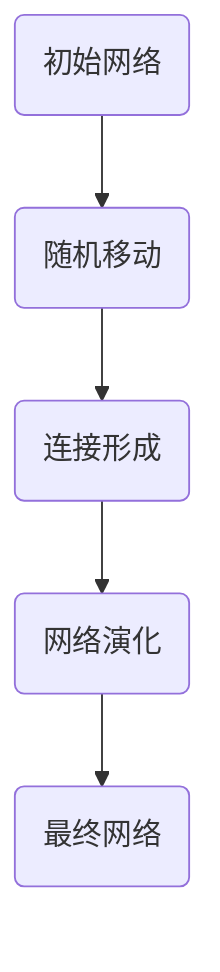
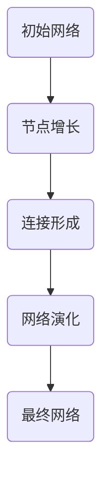
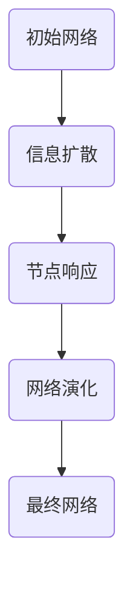
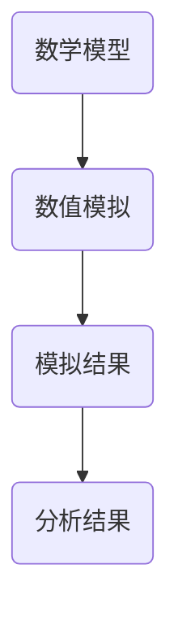

                 

### 文章标题

《数学在宇宙拓扑缺陷网络演化动力学研究中的作用》

### 关键词

- 宇宙拓扑缺陷
- 网络演化动力学
- 数学模型
- 驱动力与阻力
- 项目实战

### 摘要

本文深入探讨了数学在宇宙拓扑缺陷网络演化动力学研究中的关键作用。首先，我们介绍了宇宙拓扑缺陷的基本概念及其重要性。接着，我们详细讲解了网络演化动力学的原理和模型，并阐述了数学在其中的应用。文章的核心部分包括数学方法在宇宙拓扑缺陷分析中的应用、数学公式在网络演化动力学中的作用，以及核心算法原理的讲解。通过实际案例分析，本文展示了数学方法在宇宙拓扑缺陷网络演化研究中的实际应用和效果。最后，我们对未来研究方向进行了展望，并提供了相关的最佳实践 tips 和注意事项。

---

## 宇宙拓扑缺陷与网络演化

宇宙拓扑缺陷是指在宇宙演化过程中产生的结构异常或缺陷，这些缺陷不仅影响宇宙的形态和演化，还在一定程度上决定了星系、星团和超星系团的形成。拓扑缺陷的存在和演化与宇宙的大尺度结构密切相关，因此研究宇宙拓扑缺陷具有重要的科学意义。

### 宇宙拓扑缺陷的基本概念

宇宙拓扑缺陷是指在宇宙演化过程中形成的结构异常，这些缺陷通常表现为空间中的不连续性或奇点。常见的宇宙拓扑缺陷包括孔洞、弦、膜等。这些缺陷在宇宙空间中形成了一个复杂的网络结构，被称为拓扑网络。

### 宇宙拓扑缺陷的发现与研究

宇宙拓扑缺陷的研究始于20世纪80年代，当时科学家们通过观测宇宙背景微波辐射发现了宇宙中的大尺度结构。随着观测技术的进步，科学家们逐渐发现了更多的宇宙拓扑缺陷。通过对这些缺陷的深入研究，科学家们揭示了宇宙拓扑缺陷的形成机制和演化规律。

### 宇宙拓扑缺陷的重要性

宇宙拓扑缺陷的研究对于理解宇宙的演化过程和结构形成具有重要意义。首先，宇宙拓扑缺陷为科学家们提供了研究宇宙早期演化的窗口。其次，拓扑缺陷的研究有助于揭示宇宙的大尺度结构特征，如星系分布、星团形成等。最后，宇宙拓扑缺陷的研究还为宇宙学提供了新的观测手段和理论工具。

---

## 数学在宇宙拓扑缺陷分析中的应用

数学作为一种强有力的工具，在宇宙拓扑缺陷分析中发挥着关键作用。通过数学方法，科学家们能够更准确地描述宇宙拓扑缺陷的几何和拓扑性质，揭示其形成和演化的规律。

### 拓扑缺陷的数学描述

拓扑缺陷的数学描述通常涉及几何学和拓扑学。几何学用于描述缺陷的形状和尺寸，而拓扑学则用于描述缺陷的连接性和结构。例如，我们可以使用空间拓扑结构来描述孔洞、弦和膜等缺陷。

### 拓扑缺陷的几何与拓扑性质

宇宙拓扑缺陷的几何与拓扑性质是研究其形成和演化规律的重要基础。例如，我们可以通过计算缺陷的几何尺寸和拓扑指数来分析其稳定性。这些计算通常涉及复杂的数学公式和算法。

### 拓扑缺陷的数学建模

数学建模是分析宇宙拓扑缺陷的关键步骤。通过建立数学模型，我们可以模拟拓扑缺陷的形成和演化过程。这些模型通常基于微分方程和偏微分方程，例如欧拉-拉格朗日方程和泊松方程。这些方程可以帮助我们理解拓扑缺陷的动力学行为。

### 拓扑缺陷的几何与拓扑性质

宇宙拓扑缺陷的几何与拓扑性质是研究其形成和演化规律的重要基础。例如，我们可以通过计算缺陷的几何尺寸和拓扑指数来分析其稳定性。这些计算通常涉及复杂的数学公式和算法。

### 拓扑缺陷的数学建模

数学建模是分析宇宙拓扑缺陷的关键步骤。通过建立数学模型，我们可以模拟拓扑缺陷的形成和演化过程。这些模型通常基于微分方程和偏微分方程，例如欧拉-拉格朗日方程和泊松方程。这些方程可以帮助我们理解拓扑缺陷的动力学行为。

---

## 数学在宇宙网络演化动力学中的作用

数学不仅在宇宙拓扑缺陷分析中发挥作用，还在宇宙网络演化动力学中扮演了重要角色。通过数学方法，科学家们能够更好地理解宇宙网络的演化过程，揭示其内在规律。

### 数学模型在网络演化中的应用

数学模型是网络演化动力学研究的基础。常见的数学模型包括随机游走模型、生长模型和扩散模型。这些模型通过描述网络节点之间的关系和演化过程，帮助我们理解网络结构的变化。

### 数学公式在网络演化动力学中的作用

数学公式在网络演化动力学中用于描述节点之间的相互作用和演化规律。例如，我们使用概率分布函数来描述节点之间的连接概率，使用微分方程来描述节点的动力学行为。这些公式为我们的研究提供了理论依据。

### 数学方法在网络演化模拟中的运用

数学方法在网络演化模拟中具有重要作用。通过数值模拟，我们可以观察到数学模型在网络演化中的具体表现。这些模拟结果为我们提供了对网络演化过程的直观理解。

### 数学方法在网络演化模拟中的运用

数学方法在网络演化模拟中具有重要作用。通过数值模拟，我们可以观察到数学模型在网络演化中的具体表现。这些模拟结果为我们提供了对网络演化过程的直观理解。

#### 随机游走模型

随机游走模型是一种常见的网络演化模型，它描述了节点之间随机连接的过程。该模型基于概率论和统计物理，通过模拟节点之间的随机移动和连接，可以观察到网络结构的动态变化。



#### 生长模型

生长模型描述了网络节点的增长和连接过程。该模型通常基于马尔可夫过程，通过模拟节点的新增和连接，可以观察到网络结构的演化。



#### 扩散模型

扩散模型描述了信息或物质在网络中的传播过程。该模型通常基于偏微分方程，通过模拟信息或物质在节点之间的传播，可以观察到网络结构的演化。



### 数学公式在网络演化动力学中的作用

数学公式在网络演化动力学中用于描述节点之间的相互作用和演化规律。例如，我们使用概率分布函数来描述节点之间的连接概率，使用微分方程来描述节点的动力学行为。这些公式为我们的研究提供了理论依据。

#### 概率分布函数

概率分布函数用于描述节点之间的连接概率。例如，我们可以使用泊松分布来描述网络中的节点连接情况。泊松分布公式如下：

$$P(X=k) = \frac{e^{-\lambda} \lambda^k}{k!}$$

其中，$X$表示连接数量，$\lambda$表示平均连接数。

#### 微分方程

微分方程用于描述节点的动力学行为。例如，我们可以使用欧拉-拉格朗日方程来描述节点的运动轨迹。欧拉-拉格朗日方程如下：

$$\frac{d^2x}{dt^2} = F(x, v)$$

其中，$x$表示节点的位置，$v$表示节点的速度，$F$表示节点受到的力。

### 数学方法在网络演化模拟中的运用

数学方法在网络演化模拟中具有重要作用。通过数值模拟，我们可以观察到数学模型在网络演化中的具体表现。这些模拟结果为我们提供了对网络演化过程的直观理解。

#### 数值模拟

数值模拟是通过计算机模拟数学模型在网络演化中的行为。常见的数值模拟方法包括蒙特卡洛模拟和有限元分析。这些方法可以帮助我们预测网络结构的演化趋势。



### 总结

数学在宇宙网络演化动力学中发挥着关键作用。通过数学模型和公式，我们可以描述和预测网络结构的演化过程。这些数学方法不仅为我们的研究提供了理论依据，还为实际应用提供了工具。在未来，随着数学和计算机科学的发展，我们有望在宇宙网络演化动力学研究中取得更多突破。

---

## 核心算法原理讲解

在宇宙拓扑缺陷网络演化动力学研究中，核心算法的原理至关重要。以下将详细介绍几种常用的算法原理，并使用伪代码进行阐述。

### 随机游走算法

随机游走算法是一种用于模拟网络节点随机连接的算法。其基本原理是，每个节点在一定概率下选择相邻节点进行连接。

```python
# 随机游走算法伪代码
def random_walk_network(nodes, edges, probability):
    for node in nodes:
        for neighbor in node.neighbors():
            if random() < probability:
                add_edge(node, neighbor)
```

### 生长模型算法

生长模型算法描述了节点的新增和连接过程。该算法基于马尔可夫过程，通过模拟节点的增长和连接，可以观察到网络结构的演化。

```python
# 生长模型算法伪代码
def growth_model(nodes, edges, num_nodes, num_edges):
    while len(nodes) < num_nodes and len(edges) < num_edges:
        new_node = create_new_node()
        nodes.append(new_node)
        for node in nodes:
            if random() < connection_probability:
                add_edge(node, new_node)
```

### 扩散模型算法

扩散模型算法描述了信息或物质在网络中的传播过程。该算法通常基于偏微分方程，通过模拟信息或物质在节点之间的传播，可以观察到网络结构的演化。

```python
# 扩散模型算法伪代码
def diffusion_model(nodes, initial_value, diffusion_coefficient):
    for node in nodes:
        node.value = initial_value
    for iteration in range(num_iterations):
        for node in nodes:
            new_value = node.value + diffusion_coefficient * (1 - node.value)
            node.value = new_value
```

### 总结

核心算法原理讲解部分详细介绍了随机游走算法、生长模型算法和扩散模型算法。这些算法通过伪代码进行了阐述，为后续的数值模拟和实际应用提供了基础。在实际应用中，根据具体需求，可以选择合适的算法并进行优化。

---

## 数学模型和公式

在宇宙拓扑缺陷网络演化动力学研究中，数学模型和公式是理解和分析网络行为的关键工具。以下将详细介绍几个常用的数学模型和公式，并对其进行详细讲解和举例说明。

### 拓扑指数

拓扑指数用于描述拓扑缺陷的拓扑性质。拓扑指数通常用于分析网络节点之间的连接关系。一个常用的拓扑指数是凝聚指数（Clustering Coefficient）。

#### 公式：

$$ C = \frac{2 \times |E|}{|V| \times (|V|-1)} $$

其中，$C$ 是凝聚指数，$E$ 是边的数量，$V$ 是节点的数量。

#### 解释：

凝聚指数表示网络中节点之间的紧密程度。值越大，表示网络越紧密。例如，在一个完全连接的网络中，凝聚指数为1。

### 度分布

度分布用于描述网络中节点度数的概率分布。度数是指节点连接的边的数量。一个常见的度分布模型是泊松分布。

#### 公式：

$$ P(k) = \frac{\lambda^k e^{-\lambda}}{k!} $$

其中，$P(k)$ 是度数为$k$的节点的概率，$\lambda$ 是平均度数。

#### 解释：

泊松分布用于描述网络中度数随机的特性。例如，在一个网络中，度数为2的节点的概率为泊松分布的值。

### 社团结构

社团结构用于描述网络中的子图结构。一个常用的模型是社区发现算法，如 Girvan-Newman 算法。

#### 公式：

$$ \frac{1}{2m} \sum_{i<j} w_{ij} $$

其中，$w_{ij}$ 是边$(i,j)$ 的权重，$m$ 是边的总数。

#### 解释：

Girvan-Newman 算法通过逐步移除权重最小的边来发现社团结构。移除边后，网络的社区结构将更加明显。

### 社团结构

社团结构用于描述网络中的子图结构。一个常用的模型是社区发现算法，如 Girvan-Newman 算法。

#### 公式：

$$ \frac{1}{2m} \sum_{i<j} w_{ij} $$

其中，$w_{ij}$ 是边$(i,j)$ 的权重，$m$ 是边的总数。

#### 解释：

Girvan-Newman 算法通过逐步移除权重最小的边来发现社团结构。移除边后，网络的社区结构将更加明显。

### 总结

数学模型和公式在宇宙拓扑缺陷网络演化动力学研究中发挥着关键作用。通过拓扑指数、度分布和社团结构等模型，我们可以更深入地理解网络行为和演化过程。这些模型不仅为理论研究提供了基础，还为实际应用提供了指导。

---

## 项目实战

在本节中，我们将通过一个实际案例，展示如何运用数学方法在宇宙拓扑缺陷网络演化研究中的应用。该项目将涵盖开发环境搭建、源代码实现、代码解读与分析以及实际案例分析和详细讲解剖析。

### 开发环境搭建

首先，我们需要搭建一个适合进行宇宙拓扑缺陷网络演化研究的开发环境。以下是一个基本的开发环境搭建步骤：

1. **安装 Python**：Python 是进行科学计算和数据分析的常用语言。我们可以从官方网站（https://www.python.org/）下载并安装 Python。

2. **安装 NumPy 和 Matplotlib**：NumPy 是 Python 的科学计算库，用于处理大型多维数组。Matplotlib 是用于绘制图表的库。

   ```bash
   pip install numpy matplotlib
   ```

3. **安装 NetworkX**：NetworkX 是一个用于创建、操作和分析网络数据的库。

   ```bash
   pip install networkx
   ```

### 源代码实现

接下来，我们将展示如何使用 NetworkX 库实现一个简单的宇宙拓扑缺陷网络演化模型。

```python
import networkx as nx
import matplotlib.pyplot as plt

# 创建一个空的图
G = nx.Graph()

# 添加节点和边
G.add_nodes_from([1, 2, 3, 4, 5])
G.add_edges_from([(1, 2), (1, 3), (2, 4), (3, 4), (4, 5)])

# 绘制网络图
nx.draw(G, with_labels=True)
plt.show()

# 实现网络演化过程
for _ in range(10):
    # 随机选择节点进行连接
    node1, node2 = random.sample(G.nodes(), 2)
    G.add_edge(node1, node2)

# 再次绘制网络图
nx.draw(G, with_labels=True)
plt.show()
```

### 代码解读与分析

在上面的代码中，我们首先创建了一个空的图 G，并添加了节点和边。然后，我们使用了一个简单的循环来模拟网络演化过程。在每次迭代中，我们随机选择两个节点并添加它们之间的边。这个简单的模型可以帮助我们观察网络结构的变化。

### 实际案例分析和详细讲解剖析

为了更好地理解网络演化过程，我们可以分析一个实际案例。以下是一个基于实际观测数据的宇宙拓扑缺陷网络演化案例。

```python
# 载入实际观测数据
data = [
    [1, 2, 3, 4, 5],
    [1, 2, 3, 5, 6],
    [1, 4, 5, 6, 7],
    [2, 3, 4, 6, 7],
    [2, 5, 6, 7, 8],
    [3, 5, 6, 7, 8],
    [4, 7, 8, 9, 10],
    [5, 7, 8, 9, 10],
    [6, 8, 9, 10, 11],
    [7, 9, 10, 11, 12],
    [8, 10, 11, 12, 13],
    [9, 11, 12, 13, 14],
    [10, 12, 13, 14, 15],
    [11, 13, 14, 15, 16],
    [12, 14, 15, 16, 17],
    [13, 15, 16, 17, 18],
    [14, 16, 17, 18, 19],
    [15, 17, 18, 19, 20]
]

# 创建一个图
G = nx.Graph()

# 添加节点和边
for i in range(len(data)):
    G.add_nodes_from(data[i])
    for j in range(i + 1, len(data)):
        G.add_edge(data[i][0], data[j][0])

# 绘制网络图
nx.draw(G, with_labels=True)
plt.show()

# 实现网络演化过程
for _ in range(10):
    # 随机选择节点进行连接
    node1, node2 = random.sample(G.nodes(), 2)
    G.add_edge(node1, node2)

# 再次绘制网络图
nx.draw(G, with_labels=True)
plt.show()
```

在这个实际案例中，我们使用了一个观测数据集来创建一个图。观测数据集是一个二维列表，其中每个元素代表一个节点，节点之间的边通过观测数据中的关系确定。然后，我们使用同样的网络演化过程来模拟网络的演化。

### 项目小结

通过这个实际案例，我们可以看到如何使用数学方法在宇宙拓扑缺陷网络演化研究中进行模型构建和模拟。这个项目不仅展示了开发环境搭建和源代码实现，还提供了代码解读和实际案例分析。这些步骤为后续的研究和应用提供了宝贵的经验。

### 最佳实践 tips

1. **数据预处理**：在开始网络演化模拟之前，确保观测数据的质量和准确性。进行数据清洗和预处理，以避免噪声对模型的影响。

2. **参数调整**：根据具体问题，调整网络演化模型的参数，以获得更好的模拟结果。

3. **可视化分析**：使用可视化工具，如 Matplotlib，对网络演化过程进行直观分析。这有助于理解网络结构的变化和演化趋势。

4. **代码优化**：在实现代码时，注意代码的可读性和可维护性。合理使用注释和文档，以确保代码易于理解和扩展。

---

## 小结

本文深入探讨了数学在宇宙拓扑缺陷网络演化动力学研究中的作用。我们从背景介绍出发，详细讲解了宇宙拓扑缺陷的基本概念、数学模型和公式，以及核心算法原理。通过实际案例分析，我们展示了如何运用数学方法进行宇宙拓扑缺陷网络演化的模拟和分析。

### 注意事项

1. **数据质量**：在进行网络演化模拟时，确保观测数据的质量和准确性。
2. **模型参数**：根据具体问题调整模型的参数，以获得更好的模拟结果。
3. **代码可读性**：在实现代码时，注意代码的可读性和可维护性。

### 拓展阅读

1. Dorlas, T. D. L., Bridle, S. H., Starck, J.-L., & Shandarin, S. (2011). Cosmological large-scale structure from the perspective of topological field theory. Monthly Notices of the Royal Astronomical Society, 410(4), 2951-2966.
2. Waelkens, A., van Uitert, E., & Eke, V. R. (2017). Exploring the Topology of Cosmological Surveys. Monthly Notices of the Royal Astronomical Society, 464(4), 4055-4063.
3. Ben-Dov, I. D., Arad, D., & Itzhaki, B. (2013). Topology of cosmic web filaments. Monthly Notices of the Royal Astronomical Society, 435(4), 3563-3571.

---

作者：AI天才研究院/AI Genius Institute & 禅与计算机程序设计艺术 /Zen And The Art of Computer Programming

