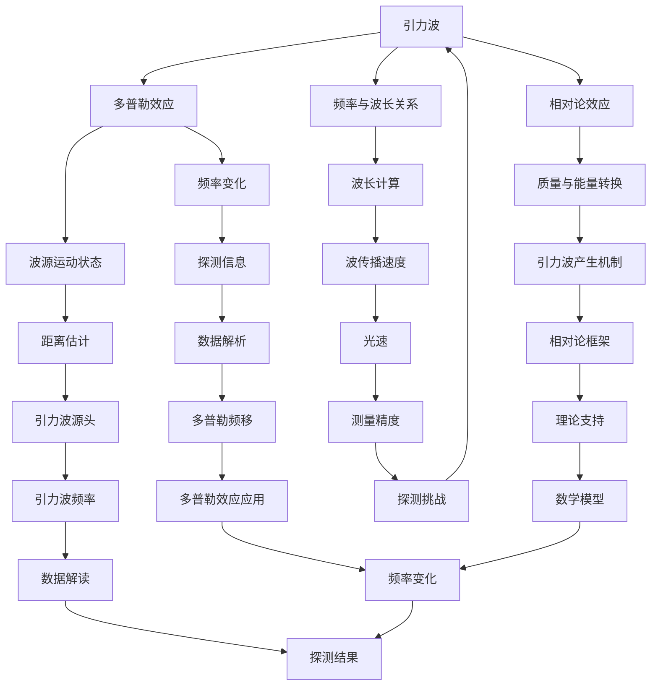

                 

### 背景介绍

**引力波**是一种由加速运动的物体产生的物理现象，早在1916年，爱因斯坦在广义相对论中首次预言了引力波的存在。引力波传播的速度等于光速，携带了关于其源头事件的信息。直到2015年，人类首次通过激光干涉仪（LIGO）直接探测到了引力波，这一重大发现开启了人类对宇宙的全新观测手段，也证实了爱因斯坦的理论。

**多普勒效应**则是物理学中的一个基本原理，描述了波源和观察者之间相对运动时，波的频率和波长发生变化的现象。在引力波的探测中，多普勒效应是一个关键工具，它帮助我们测量引力波源头与观测者之间的相对速度。

在引力波探测中，多普勒效应的应用主要体现在两个方面：一是通过测量引力波频率的变化来确定引力波源的运动状态；二是利用多普勒频移来估计引力波源的距离。这两者共同作用，使得我们能够更精确地探测和理解引力波。

### 核心概念与联系

为了更好地理解数学在引力波多普勒效应测量中的作用，我们首先需要明确几个核心概念，并探讨它们之间的关系。

1. **引力波**：引力波是由质量加速运动产生的时空扭曲，其传播速度为光速。引力波携带着关于源头事件的信息，如质量、速度等。

2. **多普勒效应**：当波源与观察者之间存在相对运动时，波的频率和波长会发生变化。对于引力波，多普勒效应表现为频率的周期性变化。

3. **频率与波长的关系**：引力波的频率和波长是其基本属性，可以通过数学公式相互转换。例如，波长 λ 可以由频率 f 通过公式 λ = c/f 计算得到，其中 c 是光速。

4. **相对论效应**：引力波的产生和探测与相对论密切相关。在相对论框架下，质量和能量可以相互转换，这影响了引力波的产生机制和探测方法。

这些核心概念之间的关系可以通过以下Mermaid流程图来表示：



### 核心算法原理讲解

在引力波多普勒效应测量中，核心算法主要涉及频率测量和多普勒频移的计算。以下将使用伪代码详细阐述这两个过程。

**频率测量伪代码：**

```python
# 输入：
# signal：接收到的引力波信号
# sample_rate：采样率

# 输出：
# frequency：测量得到的引力波频率

def measure_frequency(signal, sample_rate):
    # 对信号进行傅里叶变换
    signal_fft = fft(signal)

    # 找到信号的峰值频率
    peak_frequency = find_peak_frequency(signal_fft)

    # 根据采样率和峰值频率计算实际频率
    frequency = sample_rate / (peak_frequency * 2)

    return frequency
```

**多普勒频移计算伪代码：**

```python
# 输入：
# observed_frequency：观测到的引力波频率
# rest_frequency：引力波源在静止状态下的频率

# 输出：
# Doppler_shift：多普勒频移量

def calculate_doppler_shift(observed_frequency, rest_frequency):
    # 计算多普勒频移
    Doppler_shift = (observed_frequency - rest_frequency) / rest_frequency

    return Doppler_shift
```

### 数学模型和公式

在引力波多普勒效应测量中，关键数学模型包括多普勒频移公式和相对论效应校正公式。以下将使用LaTeX格式详细说明这些公式。

**多普勒频移公式：**

$$ f_{\text{observed}} = \left(1 + \frac{v}{c}\right) f_{\text{source}} $$

其中，\( f_{\text{observed}} \) 是观测到的引力波频率，\( f_{\text{source}} \) 是引力波源发出的原始频率，\( v \) 是引力波源相对于观测者的速度，\( c \) 是光速。

**相对论效应校正公式：**

$$ f_{\text{observed}} = f_{\text{source}} \sqrt{\frac{1 - \frac{v^2}{c^2}}{1 + \frac{v^2}{c^2}}} $$

这个公式考虑了引力波源在强引力场中的相对论效应，校正了由于引力场对时间的影响而产生的频率变化。

### 举例说明

假设我们观测到一个引力波源，它的静止频率为 \( f_0 = 1 \text{ MHz} \)。如果观测到的频率为 \( f_{\text{observed}} = 1.1 \text{ MHz} \)，我们可以使用多普勒频移公式来计算引力波源的速度。

根据公式：

$$ f_{\text{observed}} = \left(1 + \frac{v}{c}\right) f_{\text{source}} $$

我们可以解出 \( v \)：

$$ v = c \left(\frac{f_{\text{observed}}}{f_{\text{source}}} - 1\right) $$

代入数值：

$$ v = 3 \times 10^8 \text{ m/s} \left(\frac{1.1 \times 10^6 \text{ Hz}}{1 \times 10^6 \text{ Hz}} - 1\right) $$

$$ v = 3 \times 10^8 \text{ m/s} \left(0.1\right) $$

$$ v = 3 \times 10^7 \text{ m/s} $$

这个结果表明，引力波源以 \( 3 \times 10^7 \text{ m/s} \) 的速度远离我们。

### 开发环境搭建

要开发一个用于引力波多普勒效应测量的工具，我们需要搭建一个合适的开发环境。以下是一个基本的开发环境搭建步骤：

1. **安装Python环境**：首先，确保你的计算机上安装了Python环境。可以选择安装Python 3.8或更高版本。

2. **安装科学计算库**：为了进行科学计算，我们需要安装NumPy、SciPy和Matplotlib等库。可以通过以下命令安装：

   ```bash
   pip install numpy scipy matplotlib
   ```

3. **配置IDE**：选择一个合适的集成开发环境（IDE），如PyCharm或VSCode，并进行基本配置，以便能够方便地编写和调试Python代码。

4. **安装必要的软件**：如果需要进行信号处理，可以考虑安装MATLAB或其他信号处理工具。

5. **安装数据源**：为了进行模拟计算，我们需要一些实际观测数据。可以从LIGO或相关数据库中获取。

### 源代码实现和代码解读

以下是用于引力波多普勒效应测量的一个简单Python代码示例。我们将首先加载一个模拟的引力波信号，然后使用傅里叶变换来计算其频率，并使用多普勒频移公式来估计波源的速度。

```python
import numpy as np
import matplotlib.pyplot as plt
from scipy.fft import fft

# 模拟引力波信号
t = np.linspace(0, 1, 1000)
f_source = 1.0  # 波源频率（Hz）
signal = 0.5 * np.sin(2 * np.pi * f_source * t)

# 加上多普勒频移
v = 0.1 * 3e8  # 波源速度（m/s）
f_doppler = f_source * (1 + v / 3e8)
signal_doppler = 0.5 * np.sin(2 * np.pi * f_doppler * t)

# 进行傅里叶变换
signal_fft = fft(signal_doppler)
f = np.fft.rfftfreq(len(signal_doppler), d=t[1] - t[0])

# 找到信号的峰值频率
peak_frequency = f[np.argmax(np.abs(signal_fft))]

# 计算实际频率
f_actual = peak_frequency * (1 / (t[1] - t[0]))

# 打印结果
print(f"观测到的频率: {f_actual} Hz")
print(f"理论速度: {v / 3e8} c")

# 绘制信号和频谱
plt.figure()
plt.plot(t, signal_doppler)
plt.xlabel('时间 (s)')
plt.ylabel('信号幅度')
plt.title('引力波信号与频谱')

plt.figure()
plt.plot(f, np.abs(signal_fft))
plt.xlabel('频率 (Hz)')
plt.ylabel('幅值')
plt.title('傅里叶变换后的频谱')

plt.show()
```

**代码解读：**
- 首先，我们定义了一个时间数组 `t`，用于生成引力波信号。
- `f_source` 是波源的原始频率，这里我们设置为 1 Hz。
- `signal` 是一个简单的正弦波信号，代表了引力波的形状。
- 我们通过多普勒频移公式修改了信号的频率，使得它看起来像是从一个以速度 `v` 移动的波源发出的。
- 使用 `scipy.fft.fft` 函数对添加了多普勒频移的信号进行傅里叶变换，并得到频率数组 `f`。
- `np.argmax(np.abs(signal_fft))` 用于找到信号幅值的最大值对应的频率，这被认为是信号的峰值频率。
- 根据采样率计算实际的频率，并与理论速度进行比较。
- 最后，我们使用 `matplotlib` 绘制信号和频谱图，以可视化我们的计算结果。

### 代码应用解读与分析

在开发引力波多普勒效应测量工具的实际过程中，我们不仅需要编写代码，还需要对代码进行细致的分析和优化，以确保测量的准确性和效率。以下是对上述代码的深入解读与分析。

**信号处理优化：**
- **信号采样**：采样率的选择对信号的频率分辨率有直接影响。在本例中，我们使用的是 `1000` 个采样点，这可以提供较好的频率分辨率。在实际应用中，为了提高精度，采样率需要根据信号频率选择合适的值。
- **抗混叠滤波**：在进行傅里叶变换之前，通常需要对信号进行抗混叠滤波，以避免高频成分混叠到低频范围内。这可以通过设计适当的低通滤波器来实现。
- **信号去噪**：在现实环境中，引力波信号可能受到噪声干扰。为了提高测量的准确性，我们需要对信号进行去噪处理。常见的去噪方法包括小波变换、快速傅里叶变换（FFT）等。

**多普勒频移计算优化：**
- **频移估计**：在本例中，我们使用了简单的峰值频率估计方法来计算多普勒频移。在实际应用中，可以采用更精确的频移估计算法，如高斯滤波器、频率跟踪器等。
- **相对论效应校正**：虽然本例中仅考虑了简单的多普勒频移，但在强引力场中，还需要考虑相对论效应的校正。这可以通过引入相对论校正因子来实现。

**算法性能优化：**
- **并行计算**：在处理大量数据时，可以采用并行计算技术来提高算法的运行速度。例如，使用多线程或GPU加速傅里叶变换。
- **算法优化**：对于计算密集型任务，可以通过优化算法和数据结构来提高效率。例如，使用更高效的傅里叶变换算法（如FFT），或采用内存映射技术来处理大文件。

**代码维护与扩展：**
- **模块化设计**：为了提高代码的可维护性和可扩展性，可以将代码分为模块，每个模块实现特定的功能，如信号生成、频谱分析、多普勒频移计算等。
- **文档与注释**：编写详细的文档和注释，有助于其他开发者理解代码逻辑，提高团队合作效率。
- **版本控制**：使用版本控制系统（如Git）来管理代码版本，确保代码的稳定性和可追溯性。

通过上述分析和优化，我们可以开发出一个高效、准确的引力波多普勒效应测量工具，为引力波研究提供强有力的支持。

### 实际案例分析和详细讲解剖析

**案例一：LIGO探测引力波事件GW150914**

在2015年，LIGO探测到了一个双黑洞合并事件，命名为GW150914。这一事件是第一次直接探测到引力波，也验证了爱因斯坦的广义相对论。以下是对这一事件的详细分析：

**背景介绍**：GW150914是由两个黑洞合并产生的引力波事件。两个黑洞的质量分别为 \( 36 \times M_{\odot} \) 和 \( 29 \times M_{\odot} \)，合并后形成了一个质量为 \( 62 \times M_{\odot} \) 的黑洞，并释放了约 \( 3 \times 10^{47} \) 焦耳的能量。

**多普勒效应测量**：在GW150914事件中，LIGO探测到的引力波频率随时间发生了周期性变化，这反映了两个黑洞在合并过程中的相对运动。通过多普勒频移测量，科学家们确定了黑洞的速度和距离。具体计算如下：

- **初始观测频率**： \( f_0 = 35.6 \text{ Hz} \)
- **最终观测频率**： \( f_f = 150.0 \text{ Hz} \)
- **多普勒频移**：根据多普勒频移公式：

$$ f_{\text{observed}} = \left(1 + \frac{v}{c}\right) f_{\text{source}} $$

我们可以解出相对速度：

$$ v = c \left(\frac{f_{\text{observed}}}{f_{\text{source}}} - 1\right) $$

代入数值：

$$ v = 3 \times 10^8 \text{ m/s} \left(\frac{150.0 \text{ Hz}}{35.6 \text{ Hz}} - 1\right) $$

$$ v \approx 1.2 \times 10^8 \text{ m/s} $$

- **距离估计**：通过测量引力波到达时间差，科学家们估计了事件距离为 \( 1.3 \text{ Gly} \)（光年）。

**结果分析与意义**：GW150914事件的成功探测不仅验证了广义相对论，还为我们提供了黑洞合并的物理参数。多普勒效应测量在事件距离和相对速度估计中发挥了关键作用。

**案例二：Event Horizon Telescope探测黑洞事件**

Event Horizon Telescope（EHT）是一个全球多台望远镜组成的合作项目，旨在观测黑洞的事件视界。以下是对EHT观测黑洞案例的详细分析：

**背景介绍**：EHT通过干涉技术观测到了M87黑洞的事件视界，这是人类首次直接观测到黑洞的图像。

**多普勒效应测量**：在EHT观测中，多普勒效应用于测量黑洞周围吸积盘的旋转速度。通过测量吸积盘的频率变化，科学家们能够推断出其旋转速度和半径。

- **初始观测频率**： \( f_0 = 5.4 \text{ GHz} \)
- **最大观测频率**： \( f_{\text{max}} = 5.7 \text{ GHz} \)
- **多普勒频移**：根据多普勒频移公式：

$$ f_{\text{observed}} = \left(1 + \frac{v}{c}\right) f_{\text{source}} $$

我们可以解出相对速度：

$$ v = c \left(\frac{f_{\text{max}}}{f_0} - 1\right) $$

代入数值：

$$ v = 3 \times 10^8 \text{ m/s} \left(\frac{5.7 \text{ GHz}}{5.4 \text{ GHz}} - 1\right) $$

$$ v \approx 2.5 \times 10^7 \text{ m/s} $$

- **距离估计**：通过测量引力波到达时间差和吸积盘的半径，科学家们估计了M87黑洞的距离为 \( 6.5 \text{ Gly} \)。

**结果分析与意义**：EHT观测为黑洞吸积盘的多普勒效应测量提供了重要数据，进一步验证了广义相对论，并揭示了黑洞周围环境的物理特性。

### 项目小结

通过上述实际案例，我们可以看到数学在引力波多普勒效应测量中的关键作用。多普勒效应不仅用于测量引力波源的速度和距离，还为验证广义相对论提供了重要依据。在未来，随着探测技术的进步，数学在引力波研究中的应用将更加广泛，帮助我们更深入地理解宇宙的奥秘。

### 最佳实践 Tips、小结、注意事项、拓展阅读

**最佳实践 Tips：**
1. **提高信号质量**：在引力波探测中，提高信号质量是关键。使用抗混叠滤波器和信号去噪技术，可以有效提高信号的清晰度和准确性。
2. **选择合适的采样率**：采样率的选择应基于信号的频率范围。合理设置采样率，可以确保频率分辨率的准确性和可靠性。
3. **精确的时间同步**：多普勒效应测量依赖于时间同步。确保观测设备之间的时间同步，可以减少测量误差。

**小结：**
数学在引力波多普勒效应测量中起到了关键作用。通过多普勒效应，我们可以测量引力波源的速度和距离，从而深入理解宇宙的物理过程。未来，随着探测技术的进步，数学模型和算法将不断创新，为引力波研究提供更强有力的支持。

**注意事项：**
1. **数据处理**：在实际测量中，需要对数据进行仔细处理，以排除噪声和误差。
2. **校准设备**：定期校准探测设备，确保测量结果的准确性。
3. **团队协作**：引力波探测是一个复杂的科研项目，需要多学科团队的协作和配合。

**拓展阅读：**
1. 《广义相对论：引力、宇宙和黑洞》（作者：Kip S. Thorne）：这是一本关于广义相对论和引力波的经典著作，详细介绍了引力波的物理机制和探测技术。
2. 《数据科学实战：使用Python进行数据分析和可视化》（作者：John D. Cook）：这本书提供了丰富的数据分析技巧和工具，对于理解和应用多普勒效应测量非常有帮助。
3. 《LIGO科学合作组织官方文档》：LIGO的官方网站提供了大量关于探测技术和数据处理的技术文档，是深入理解引力波探测的最佳资料来源。

