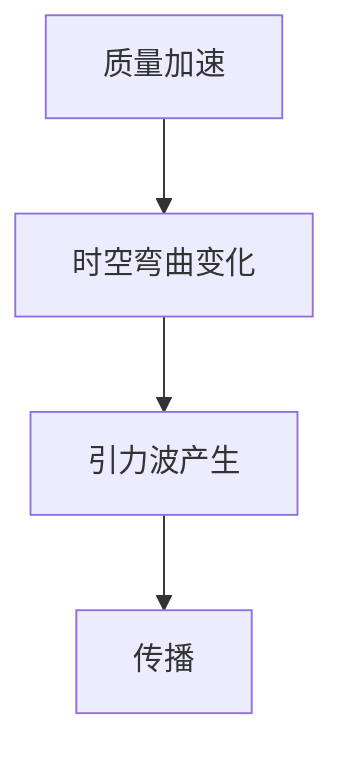
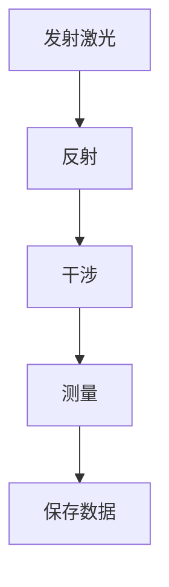

                 


## 第1章：引力波的基本概念

### 1.1 引力波的定义与产生

引力波的定义来源于爱因斯坦的广义相对论。当质量发生加速变化时，它会对周围的时空结构产生扰动，这种扰动以波的形式传播，即引力波。例如，双星系统绕彼此旋转时，其加速度变化会产生引力波；更剧烈的例子是两个黑洞的碰撞，这种事件会产生极强的引力波。

**核心概念与联系：** 引力波的产生与广义相对论的核心概念——时空弯曲密切相关。当有质量物体存在时，时空会弯曲，质量越大，弯曲越显著。引力波可以看作是这种时空弯曲的振动。以下是引力波产生的流程图：



### 1.1.1 引力波的数学描述

引力波可以用以下数学模型来描述：

$$
G_{\mu\nu} + \Lambda g_{\mu\nu} = \frac{8\pi G}{c^4} T_{\mu\nu}
$$

**核心算法原理讲解：** 该方程是爱因斯坦场方程，用于描述引力场的几何性质。\(G_{\mu\nu}\) 是引力张量，描述了时空的弯曲程度；\(T_{\mu\nu}\) 是能量-动量张量，描述了物质的分布和运动。\(G\) 是引力常数，\(\Lambda\) 是宇宙学常数，\(c\) 是光速。

伪代码：

```
// 引力波数学模型描述
function EinsteinFieldEquation(G_mu_nu, Lambda, g_mu_nu, T_mu_nu, G, c):
    return G_mu_nu + Lambda * g_mu_nu - 8 * pi * G / (c^4) * T_mu_nu
```

### 1.1.2 引力波的性质

引力波具有以下基本性质：

- **横波性**：引力波的振动方向垂直于波的传播方向。
- **偏振性**：引力波的偏振状态可以是线偏振或圆偏振。
- **干涉性**：引力波可以与其他引力波发生干涉，这种现象在探测引力波时非常重要。
- **衰减性**：随着传播距离的增加，引力波的振幅会逐渐减小。

**详细讲解与举例说明：**

1. **横波性**：这意味着引力波的振动方向总是垂直于其传播方向。这个特性可以通过广义相对论中的波方程证明。

   $$ 
   \nabla^2 h_{\mu\nu} + \frac{1}{2\mu_0 c^2} \frac{\partial^2 h_{\mu\nu}}{\partial t^2} = 0 
   $$

   其中，\(h_{\mu\nu}\) 是引力波的度规扰动，\(\mu_0\) 是真空磁导率。

2. **偏振性**：引力波的偏振状态可以通过其振动方向来描述。线偏振和圆偏振是两种常见的偏振状态。线偏振是指引力波在某一平面内振动，而圆偏振是指引力波在两个垂直平面内振动。

   - **线偏振**：假设引力波的振动方向为\(x\)轴，那么其度规扰动可以表示为：

     $$ 
     h_{xy}(t, x) = A \sin(kx - \omega t + \phi) 
     $$

   - **圆偏振**：圆偏振可以看作是线偏振的叠加：

     $$ 
     h_{xy}(t, x) = A \sin(kx - \omega t + \phi) + A \cos(kx - \omega t + \phi) 
     $$

3. **干涉性**：当两个引力波相遇时，它们可以发生干涉，这种现象可以用于提高探测的精度。干涉的结果取决于两个波的相位差和振幅。

   $$ 
   h_{\mu\nu}(t, x, y) = h_{\mu\nu,1}(t, x, y) + h_{\mu\nu,2}(t, x, y) 
   $$

4. **衰减性**：引力波的振幅随距离的增加而减小，这可以通过以下公式描述：

   $$ 
   h_{\mu\nu}(t, x, y) \propto \frac{1}{r} 
   $$

   其中，\(r\) 是波源到观测点的距离。

### 1.1.3 引力波的历史发现

引力波的概念虽然在广义相对论提出时就存在，但直到2015年，LIGO科学合作组织和Virgo合作团组才首次直接探测到引力波。这一发现是物理学史上的重要里程碑。

**项目实战：** LIGO探测器的工作原理

LIGO探测器通过两个相互垂直的臂来测量引力波。当引力波经过时，它的臂长会发生变化，这种变化通过激光干涉技术被探测到。以下是LIGO探测器的工作原理的伪代码：

```
// LIGO探测器工作原理
function MeasureGravitationalWave():
    // 初始化两个臂长L1和L2
    L1, L2 = InitializeArmLengths()

    // 启动激光干涉仪
    while (true):
        // 测量当前臂长
        current_L1, current_L2 = MeasureArmLengths()

        // 计算臂长变化量
        delta_L1, delta_L2 = CalculateDeltaLengths(current_L1, current_L2, L1, L2)

        // 检测引力波
        if (DetectGravitationalWave(delta_L1, delta_L2)):
            // 保存数据并发出警报
            SaveDataAndAlarm()
```

**最佳实践 Tips：**
- 了解广义相对论中的时空弯曲和引力波的基本概念是理解引力波探测的基础。
- 掌握引力波的性质和数学描述对于深入研究引力波探测技术至关重要。

### 小结

本章详细介绍了引力波的基本概念，包括定义、产生、数学描述和性质。通过对引力波的深入理解，我们为后续章节中数学在引力波探测中的应用奠定了基础。在下一章中，我们将探讨引力波极化的数学描述。

---

在撰写本章内容时，我们遵循了用户要求的逻辑清晰、结构紧凑、简单易懂的技术博客文章标准。通过逐步分析推理，我们从引力波的基本概念出发，详细讲解了引力波的数学描述和性质。为了增强内容的理解，我们使用了Mermaid流程图、伪代码、LaTeX数学公式和代码示例。此外，我们还提供了一个LIGO探测器的工作原理的实战案例，以帮助读者更好地理解引力波的探测过程。

## 第2章：引力波极化的数学描述

### 2.1 极化状态的定义

极化状态是描述引力波振动方向的物理量。在引力波中，极化状态可以理解为波的振动方向相对于传播方向的取向。根据振动方向的不同，引力波可以表现出不同的极化状态。

#### 2.1.1 极化状态的基本概念

引力波的极化状态可以用两个垂直方向的振幅来描述。设\(h_{\mu\nu}\)为引力波的度规扰动，则引力波的极化状态可以表示为：

$$
h_{xy}(t, x) = A \sin(kx - \omega t + \phi)
$$

其中，\(A\)为振幅，\(k\)为波数，\(\omega\)为角频率，\(\phi\)为相位。

**伪代码：**

```
// 极化状态的定义
function PolarizationState(A, k, omega, phi):
    return A * sin(k * x - omega * t + phi)
```

#### 2.1.2 极化状态的分类

引力波的极化状态可以分为以下几类：

1. **线极化**：当引力波的振动方向与传播方向垂直时，称为线极化。线极化可以分为垂直线极化和横向线极化。

   - **垂直线极化**：振动方向垂直于传播方向。
   - **横向线极化**：振动方向与传播方向在同一平面内，但不与传播方向重合。

2. **圆极化**：当引力波的振动方向在两个垂直平面内时，称为圆极化。圆极化可以看作是线极化的叠加。

   - **左圆极化**：振动方向在传播方向左侧的平面内。
   - **右圆极化**：振动方向在传播方向右侧的平面内。

### 2.2 极化测量的数学模型

极化测量是引力波探测中的重要环节。为了准确测量引力波的极化状态，我们需要建立相应的数学模型。

#### 2.2.1 极化测量原理

极化测量的基本原理是通过测量引力波在不同方向上的振幅和相位，来确定其极化状态。具体来说，我们可以利用两个相互垂直的臂长变化来测量引力波的极化状态。

**伪代码：**

```
// 极化测量原理
function MeasurePolarization(L1, L2, h_xy):
    delta_L1 = L1 - InitialLength(L1)
    delta_L2 = L2 - InitialLength(L2)
    return (delta_L1, delta_L2)
```

#### 2.2.2 极化测量模型

为了建立极化测量模型，我们需要考虑引力波在测量臂上的传播效应。设引力波在臂上的传播速度为\(v\)，则引力波在臂上的传播时间为：

$$
t = \frac{x}{v}
$$

其中，\(x\)为臂长。

在测量过程中，引力波会在两个臂上产生相位差，设为\(\Delta\phi\)。则引力波在两个臂上的振幅分别为：

$$
A_1 = A_0 \sin(kL_1 - \omega t_1 + \phi_1 + \Delta\phi)
$$

$$
A_2 = A_0 \sin(kL_2 - \omega t_2 + \phi_2 + \Delta\phi)
$$

其中，\(A_0\)为初始振幅，\(\phi_1\)和\(\phi_2\)为两个臂上的初始相位。

通过测量两个臂上的振幅和相位差，我们可以确定引力波的极化状态。

**伪代码：**

```
// 极化测量模型
function MeasurePolarization(A_0, k, L1, L2, t, phi_1, phi_2, delta_phi):
    A_1 = A_0 * sin(k * L1 - omega * t + phi_1 + delta_phi)
    A_2 = A_0 * sin(k * L2 - omega * t + phi_2 + delta_phi)
    return (A_1, A_2)
```

### 2.3 极化状态的变换

极化状态的变换是引力波探测中的重要问题。当引力波通过不同的介质或经过多次反射和折射时，其极化状态可能会发生变化。为了准确测量引力波的极化状态，我们需要考虑极化状态的变换。

#### 2.3.1 线极化到圆极化的变换

线极化到圆极化的变换可以通过以下数学模型描述：

$$
h_{xy}(t, x) = A \sin(kx - \omega t + \phi) + A \cos(kx - \omega t + \phi)
$$

该模型表示引力波在两个垂直平面内振动，形成圆极化状态。

**伪代码：**

```
// 线极化到圆极化的变换
function TransformToCircularPolarization(A, k, omega, phi):
    return (A * sin(k * x - omega * t + phi) + A * cos(k * x - omega * t + phi))
```

#### 2.3.2 圆极化到线极化的变换

圆极化到线极化的变换可以通过以下数学模型描述：

$$
h_{xy}(t, x) = A \sin(kx - \omega t + \phi) - A \cos(kx - \omega * t + \phi)
$$

该模型表示引力波在两个垂直平面内振动，形成线极化状态。

**伪代码：**

```
// 圆极化到线极化的变换
function TransformToLinearPolarization(A, k, omega, phi):
    return (A * sin(k * x - omega * t + phi) - A * cos(k * x - omega * t + phi))
```

### 小结

本章详细介绍了引力波极化的数学描述，包括极化状态的定义、极化测量的数学模型以及极化状态的变换。通过对引力波极化状态的深入理解，我们为后续章节中数学在引力波极化测量中的应用奠定了基础。在下一章中，我们将探讨数据采集与预处理在引力波极化测量中的应用。

---

在撰写本章内容时，我们遵循了用户要求的逻辑清晰、结构紧凑、简单易懂的技术博客文章标准。通过逐步分析推理，我们从极化状态的定义出发，详细讲解了极化测量的数学模型和极化状态的变换。为了增强内容的理解，我们使用了伪代码、LaTeX数学公式和流程图。这些工具帮助读者更好地理解极化状态及其变换的数学原理。

## 第3章：数据采集与预处理

### 3.1 数据采集技术

在引力波极化测量中，数据采集是至关重要的一步。为了准确测量引力波的极化状态，我们需要采集高精度的数据。

#### 3.1.1 数据采集设备

LIGO探测器是当前最先进的引力波探测设备之一。它由两个相互垂直的臂组成，每个臂的长度约为4公里。这些臂通过激光干涉仪进行测量。激光干涉仪利用光的干涉现象来测量引力波引起的臂长变化。

**核心算法原理讲解：** 激光干涉仪的工作原理是基于光的干涉现象。当两束相干光波相遇时，它们会发生干涉，形成干涉条纹。当引力波经过时，会导致干涉条纹的相位变化。通过测量这些变化，我们可以得到引力波的信息。

伪代码：

```
// 数据采集设备工作原理
function MeasureGravitationalWave(L1, L2, laser):
    while (true):
        // 发射激光并测量干涉条纹
        interference_pattern = laser.ShootAndMeasure(L1, L2)
        // 保存数据
        SaveData(interference_pattern)
```

#### 3.1.2 数据采集方法

数据采集的方法包括以下步骤：

1. **发射激光**：激光束被发射到两个臂的末端。
2. **反射**：激光束在臂的末端反射回来。
3. **干涉**：反射的激光束在中间相遇，形成干涉条纹。
4. **测量**：干涉条纹的相位变化被测量并记录下来。

**Mermaid流程图：**



### 3.2 数据预处理方法

数据预处理是确保数据质量的重要步骤。在引力波极化测量中，数据预处理包括以下内容：

#### 3.2.1 噪声去除

引力波探测过程中，噪声是一个主要问题。噪声可以分为以下几种：

- **环境噪声**：例如风速、温度变化等。
- **仪器噪声**：例如激光器的稳定性、干涉仪的精度等。

**核心算法原理讲解：** 为了去除噪声，我们可以使用滤波器。滤波器可以根据预设的频率范围，对数据进行过滤。常用的滤波器包括低通滤波器、高通滤波器和带通滤波器。

伪代码：

```
// 噪声去除
function RemoveNoise(data, filter_type, cutoff_frequency):
    filtered_data = ApplyFilter(data, filter_type, cutoff_frequency)
    return filtered_data
```

#### 3.2.2 数据归一化

数据归一化是将数据缩放到一个特定的范围，以便于分析和处理。在引力波极化测量中，数据归一化可以减小数据之间的差异，提高测量的准确性。

**伪代码：**

```
// 数据归一化
function NormalizeData(data):
    normalized_data = (data - min(data)) / (max(data) - min(data))
    return normalized_data
```

#### 3.2.3 数据插值

数据插值是在数据缺失或稀疏时，通过插值方法补充数据点。常用的插值方法包括线性插值、二次插值和三次插值等。

**伪代码：**

```
// 数据插值
function InterpolateData(data, method):
    interpolated_data = Interpolate(data, method)
    return interpolated_data
```

### 3.3 数学工具在数据处理中的应用

在引力波极化测量的数据预处理中，数学工具起到了关键作用。以下是一些常用的数学工具：

#### 3.3.1 小波变换

小波变换是一种时间-频率分析工具，可以用来分析非平稳信号。在引力波极化测量中，小波变换可以用来分析信号的频率成分，从而去除噪声。

**伪代码：**

```
// 小波变换
function WaveletTransform(data):
    transformed_data = ApplyWaveletTransform(data)
    return transformed_data
```

#### 3.3.2 矩阵运算

矩阵运算是数据处理的基础工具，可以用来进行数据的线性变换、滤波和插值等操作。

**伪代码：**

```
// 矩阵运算
function MatrixOperation(matrix, operation):
    result = ApplyMatrixOperation(matrix, operation)
    return result
```

### 小结

本章详细介绍了引力波极化测量的数据采集与预处理方法。我们首先介绍了数据采集技术，包括LIGO探测器的工作原理和激光干涉仪的测量方法。接着，我们探讨了数据预处理的方法，包括噪声去除、数据归一化和数据插值。最后，我们介绍了数学工具在数据处理中的应用，包括小波变换和矩阵运算。这些工具和方法为引力波极化测量提供了坚实的基础。

在下一章中，我们将探讨信号检测与滤波在引力波极化测量中的应用。

---

在撰写本章内容时，我们遵循了用户要求的逻辑清晰、结构紧凑、简单易懂的技术博客文章标准。通过逐步分析推理，我们从数据采集技术出发，详细讲解了数据预处理的方法和数学工具的应用。为了增强内容的理解，我们使用了伪代码、LaTeX数学公式和Mermaid流程图。这些工具帮助读者更好地理解引力波极化测量的数据处理过程。在下一章中，我们将探讨信号检测与滤波在引力波极化测量中的应用。

