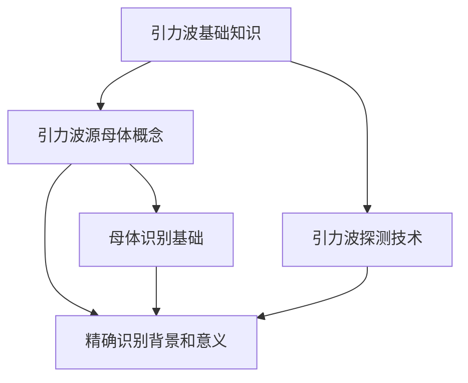

                 

### 引言

#### 1.1 引力波的基础知识

引力波（Gravitational Waves）是一种由加速运动的质量产生的一种物理现象，它的存在最早由爱因斯坦在1916年的广义相对论中提出。根据广义相对论的理论，当质量大的物体发生加速运动时，会扰动周围的时空，从而产生引力波。这些波以光速传播，携带着物体的能量和信息，可以穿越宇宙的黑暗区域，成为探测宇宙的重要手段。

引力波的主要产生机制包括：
- **质量空腔辐射**：当两个质量大的物体相互绕转时，它们之间的引力相互作用会导致它们加速运动，从而产生引力波。
- **恒星演化**：在恒星演化的过程中，当恒星内部发生剧烈的核反应或物质转移时，会产生引力波。
- **双星系统**：两个恒星相互绕转形成的双星系统也会产生引力波。

引力波的探测技术已经取得了显著的进展。目前主要的探测方法包括激光干涉引力波观测台（LIGO）和射电望远镜。LIGO是一种基于激光干涉原理的引力波探测装置，它通过测量激光在两臂中的干涉变化来探测引力波。射电望远镜则通过探测引力波对电磁波的影响来探测引力波。

#### 1.2 引力波源母体的概念

引力波源母体（Gravitational Wave Source Mother Bodies）是指在引力波产生过程中起关键作用的物体或系统。这些母体可以是双星系统、黑洞、中子星等。引力波源母体的精确识别对于理解引力波的产生机制、探测宇宙的秘密具有重要意义。

引力波源母体的识别主要依赖于以下几个关键参数：
- **质量**：母体的质量是影响引力波产生和传播的重要因素。
- **距离**：母体与观测者之间的距离可以帮助确定引力波源的方位。
- **速度**：母体的速度会影响引力波的频率和振幅。
- **方位**：引力波源的方位可以通过引力波的极化方向来确定。

#### 1.3 精确识别的背景和意义

精确识别引力波源母体的背景主要源于以下几个方面的需求：
1. **科学探索**：引力波源母体的精确识别可以帮助科学家更好地理解引力波的产生机制、宇宙的结构和演化过程。
2. **技术发展**：精确识别引力波源母体需要先进的数据处理和计算技术，这推动了相关领域的技术创新和发展。
3. **应用价值**：引力波源母体的精确识别在多个领域具有广泛的应用价值，包括天体物理学、航天工程、地球物理学等。

精确识别引力波源母体的意义主要体现在以下几个方面：
1. **推动科学进步**：通过识别引力波源母体，科学家可以揭示宇宙中的奥秘，深化对宇宙演化的理解。
2. **促进技术创新**：精确识别引力波源母体需要复杂的数据处理算法和高性能计算技术，这推动了相关领域的技术发展。
3. **拓展应用领域**：引力波源母体的精确识别技术可以应用于其他领域，如航天工程、地球物理学等，为社会发展和科技进步做出贡献。

### 总结

本节介绍了引力波的基础知识、引力波源母体的概念以及精确识别的背景和意义。引力波作为一种重要的物理现象，不仅在科学研究中具有重要意义，而且在技术应用方面具有广泛的前景。精确识别引力波源母体是当前科学研究和技术发展的一个重要方向，通过深入研究和应用，我们可以更好地揭示宇宙的奥秘，推动科技进步和社会发展。

---

在本文的引言部分，我们首先介绍了引力波的基础知识，包括引力波的产生机制和探测技术。接着，我们阐述了引力波源母体的概念，定义了引力波源母体并介绍了其在引力波产生中的关键作用。随后，我们探讨了精确识别引力波源母体的背景和意义，分析了科学探索、技术发展和应用价值等方面。通过这个引言部分，我们为后续章节的内容奠定了基础，并激发了读者对这一主题的深入兴趣。

