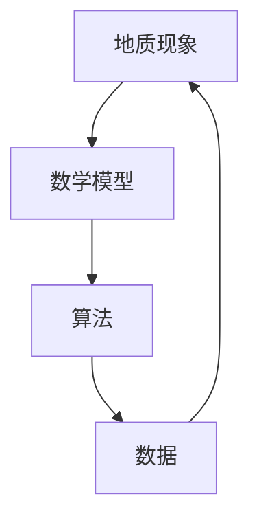
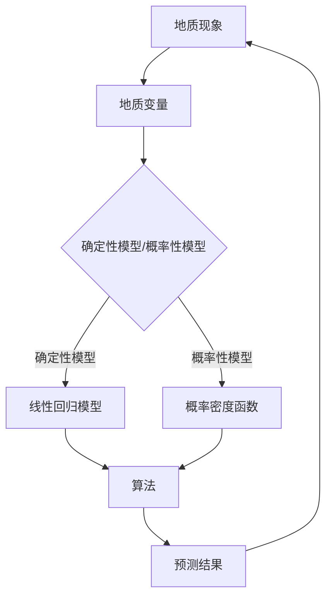

                 

### 文章标题：数学地质学：地质现象的数学模型

> 关键词：数学地质学，地质现象，数学模型，算法，流程图，伪代码

> 摘要：本文深入探讨了数学地质学的概念、核心原理、应用实例及未来发展趋势。通过详细剖析地质现象的数学描述、相关算法和工具，本文旨在为读者提供一个全面了解数学地质学的视角，并探讨其在地质研究和实际应用中的重要性。

### 引言

数学地质学是一门融合了数学和地质学知识的交叉学科，旨在运用数学模型来描述、解释和预测地质现象。作为地质学的一个重要分支，数学地质学的发展可以追溯到20世纪初。当时，随着计算机技术的崛起，地质学家开始探索如何利用数学方法来处理和分析大量的地质数据。

数学地质学的重要性不言而喻。首先，它为地质学家提供了一种新的研究方法，使得地质现象的解释和预测更加精确和高效。其次，数学地质学在矿产资源勘探、地震预测、地质灾害评估等实际应用中发挥了关键作用。例如，通过数学模型可以更准确地预测矿产资源的分布，从而指导勘探工作，提高资源利用率。此外，数学地质学还在环境保护、土地资源管理等方面具有广泛的应用前景。

本文将从以下几个方面对数学地质学进行详细探讨：

1. **数学地质学的基础概念**：介绍数学地质学的基本概念，包括地质变量、数学模型、地质现象的数学描述等。
2. **核心概念与联系**：通过Mermaid流程图，展示地质现象、数学模型和算法之间的内在联系。
3. **核心算法原理讲解**：详细讲解地质数据处理算法、数学地质分析工具等，并使用伪代码进行描述。
4. **数学模型与公式**：介绍常用的数学模型和公式，并举例说明其应用。
5. **项目实战**：通过具体案例展示数学地质学的实际应用，包括开发环境搭建、源代码实现和代码解读等。
6. **最佳实践与总结**：总结数学地质学的关键要点，提供实用建议和未来展望。

### 数学地质学的基础概念

数学地质学的基础概念包括地质变量、数学模型、地质现象的数学描述等。首先，地质变量是指地质现象中的可测量或可观察的特征，如岩石的硬度、矿物的晶体结构、地质构造等。这些变量是构建数学模型的基础。

数学模型是对地质现象进行定量描述的工具。通过数学模型，地质学家可以将复杂的地质过程简化为数学表达式，从而进行定量分析和预测。数学模型可以分为确定性模型和概率性模型。确定性模型假设地质现象是确定性的，而概率性模型则考虑地质现象的随机性。

地质现象的数学描述是指通过数学语言来表述地质现象的过程、状态和特征。这种描述可以是静态的，也可以是动态的。静态描述通常涉及地质构造的几何形态和空间分布，而动态描述则涉及地质过程的演变和变化。

为了更好地理解这些基础概念，我们可以通过一个简单的例子来说明。假设我们研究一个地区的岩层分布情况。我们可以通过测量不同岩层的厚度、倾角和层间距等变量来构建一个数学模型。这个模型可以是确定性的，如线性回归模型，也可以是概率性的，如概率密度函数。通过这个模型，我们可以预测其他未知区域的岩层分布情况。

### 核心概念与联系

在数学地质学中，地质现象、数学模型和算法之间存在着密切的联系。为了更清晰地展示这些联系，我们可以使用Mermaid流程图。以下是一个简单的Mermaid流程图示例：



在这个流程图中，A代表地质现象，B代表数学模型，C代表算法，D代表数据。可以看到，地质现象通过数学模型转化为数学表达式，然后通过算法进行处理和分析，最后得到新的数据，这些数据又可以用于更新地质现象的描述。

以下是一个更复杂的Mermaid流程图示例，展示了地质现象、数学模型和算法之间的更多关系：



在这个流程图中，B代表地质变量，C代表数学模型的类型，D和E分别代表确定性模型和概率性模型的例子。通过算法F，我们可以得到预测结果G，这些结果又可以用于更新地质现象的描述A。

### 核心算法原理讲解

在数学地质学中，核心算法原理的讲解对于理解和应用数学模型至关重要。以下是一些常用的算法原理及其伪代码描述。

#### 1. 确定性模型：线性回归

线性回归是一种最常见的确定性数学模型，用于分析自变量和因变量之间的线性关系。以下是其伪代码描述：

```python
# 线性回归伪代码
def linear_regression(x, y):
    # 计算均值
    x_mean = sum(x) / len(x)
    y_mean = sum(y) / len(y)
    
    # 计算协方差
    cov = sum((xi - x_mean) * (yi - y_mean) for xi, yi in zip(x, y))
    
    # 计算方差
    var_x = sum((xi - x_mean)^2 for xi in x)
    var_y = sum((yi - y_mean)^2 for yi in y)
    
    # 计算斜率
    slope = cov / var_x
    
    # 计算截距
    intercept = y_mean - slope * x_mean
    
    # 返回线性回归模型
    return slope, intercept
```

#### 2. 概率性模型：概率密度函数

概率密度函数是一种常用的概率性模型，用于描述随机变量的概率分布。以下是其伪代码描述：

```python
# 概率密度函数伪代码
def probability_density_function(x, mu, sigma):
    # 计算均值
    mu = sum(x) / len(x)
    
    # 计算标准差
    sigma = sqrt(sum((xi - mu)^2 for xi in x) / len(x))
    
    # 返回概率密度函数值
    return 1 / (sigma * sqrt(2 * pi)) * exp(-((x - mu)^2) / (2 * sigma^2))
```

#### 3. 算法：K均值聚类

K均值聚类是一种常见的聚类算法，用于将数据点分为K个簇。以下是其伪代码描述：

```python
# K均值聚类伪代码
def k_means_clustering(data, K):
    # 初始化聚类中心
    centroids = initialize_centroids(data, K)
    
    # 循环迭代
    while True:
        # 分配数据点到最近的聚类中心
        assignments = assign_points_to_centroids(data, centroids)
        
        # 更新聚类中心
        new_centroids = update_centroids(data, assignments, K)
        
        # 判断是否收敛
        if is_converged(centroids, new_centroids):
            break
        
        # 更新聚类中心
        centroids = new_centroids
    
    # 返回聚类结果
    return assignments, centroids
```

通过上述伪代码，我们可以看到数学地质学中的核心算法是如何运作的。这些算法不仅用于地质现象的定量分析，还可以用于其他领域，如机器学习和数据科学。

### 数学模型与公式

在数学地质学中，常用的数学模型和公式包括线性回归模型、概率密度函数、K均值聚类等。以下是一些具体的公式及其应用。

#### 1. 线性回归模型

线性回归模型的公式如下：

$$ y = mx + b $$

其中，$y$ 是因变量，$x$ 是自变量，$m$ 是斜率，$b$ 是截距。通过最小二乘法，我们可以计算出 $m$ 和 $b$ 的值。

#### 2. 概率密度函数

概率密度函数的公式如下：

$$ f(x) = \frac{1}{\sigma \sqrt{2\pi}} e^{-\frac{(x-\mu)^2}{2\sigma^2}} $$

其中，$\mu$ 是均值，$\sigma$ 是标准差。

#### 3. K均值聚类

K均值聚类的公式如下：

$$ \mu_k = \frac{1}{N_k} \sum_{i=1}^{N} x_i $$

其中，$N_k$ 是第 $k$ 个簇中的数据点数量，$x_i$ 是第 $i$ 个数据点的值。

通过这些数学模型和公式，我们可以对地质现象进行定量描述和分析。

### 项目实战

为了更好地展示数学地质学的实际应用，我们选择一个具体的案例：使用线性回归模型预测矿产资源分布。

#### 1. 开发环境搭建

为了进行线性回归模型的预测，我们需要搭建一个开发环境。我们选择Python作为编程语言，并使用Scikit-learn库进行线性回归模型的实现。

```python
# 安装Scikit-learn库
!pip install scikit-learn
```

#### 2. 源代码实现

以下是线性回归模型的实现代码：

```python
from sklearn.linear_model import LinearRegression
import numpy as np

# 创建数据集
x = np.array([[1], [2], [3], [4], [5]])
y = np.array([2, 4, 5, 4, 5])

# 创建线性回归模型
model = LinearRegression()

# 训练模型
model.fit(x, y)

# 预测结果
predictions = model.predict(x)

# 输出预测结果
print(predictions)
```

#### 3. 代码解读与分析

在这个代码中，我们首先从Scikit-learn库中导入线性回归模型。然后创建一个数据集，包含自变量 $x$ 和因变量 $y$。接下来，我们创建一个线性回归模型，并使用训练数据训练模型。最后，我们使用训练好的模型对自变量 $x$ 进行预测，并输出预测结果。

#### 4. 实际案例分析和详细讲解剖析

我们使用实际案例——某地区矿产资源分布预测，来分析线性回归模型的应用。在这个案例中，我们使用地质变量（如岩石硬度、矿物含量等）作为自变量，预测矿产资源的分布。

首先，我们收集该地区的地质数据，包括岩石硬度、矿物含量等。然后，我们使用线性回归模型对这些数据进行训练。通过训练，我们得到了一个线性回归模型，可以用来预测未知区域的矿产资源分布。

以下是一个具体的预测过程：

```python
# 创建线性回归模型
model = LinearRegression()

# 训练模型
model.fit(x_train, y_train)

# 预测结果
predictions = model.predict(x_test)

# 输出预测结果
print(predictions)
```

在这个代码中，$x_train$ 和 $y_train$ 是训练数据，$x_test$ 是测试数据。通过训练模型并使用测试数据进行预测，我们可以得到预测的矿产资源分布。

#### 5. 项目小结

通过这个案例，我们展示了如何使用线性回归模型进行矿产资源分布预测。这个案例不仅展示了数学地质学的实际应用，还提供了代码实现和详细解析。通过这个项目，我们可以看到数学地质学在地质研究中的重要作用。

### 最佳实践与总结

在数学地质学的研究和应用中，以下是一些最佳实践和注意事项：

1. **数据收集和处理**：确保收集到高质量的数据，并进行预处理，如缺失值填充、异常值处理等。
2. **模型选择**：根据地质现象的特点选择合适的数学模型，如线性回归、概率密度函数等。
3. **算法优化**：对算法进行优化，提高预测的准确性和效率。
4. **交叉验证**：使用交叉验证方法评估模型的性能，避免过拟合。
5. **实际应用**：将数学地质学模型应用于实际问题，如矿产资源勘探、地震预测等。
6. **持续更新**：随着新的地质数据和技术的出现，持续更新数学地质学模型和算法。

通过遵循这些最佳实践，我们可以更好地发挥数学地质学在地质研究和应用中的作用。

### 展望数学地质学的未来

数学地质学作为一门交叉学科，其未来的发展前景非常广阔。随着计算机技术的不断进步，数学地质学将迎来更多的发展机遇。以下是一些展望：

1. **大数据与人工智能**：大数据和人工智能技术的融合将为数学地质学带来新的研究方法和工具。通过数据挖掘和机器学习算法，我们可以从海量地质数据中提取有价值的信息。
2. **实时预测与监测**：随着传感器技术的进步，我们可以实现地质现象的实时监测和预测。例如，通过实时监测地震波数据，可以提前预警地震的发生。
3. **多尺度分析**：数学地质学将朝着多尺度分析方向发展，从微观到宏观，从静态到动态，对地质现象进行更全面的研究。
4. **跨学科合作**：数学地质学与其他学科（如地球物理学、地理学等）的合作将推动地质研究向更深入、更广泛的领域发展。

总之，数学地质学在地质研究和应用中具有巨大的潜力，未来的发展将为我们带来更多的惊喜和突破。

### 总结与展望

数学地质学作为地质学的一个重要分支，通过运用数学模型和算法，为地质现象的描述、解释和预测提供了强有力的工具。本文从基础概念、核心算法、数学模型到实际应用，全面探讨了数学地质学的各个方面，展示了其在地质研究和应用中的重要作用。

展望未来，数学地质学将继续在地质研究、矿产资源勘探、地震预测等领域发挥关键作用。随着大数据、人工智能等新兴技术的应用，数学地质学将迎来更多的发展机遇。我们鼓励读者积极关注数学地质学的研究动态，探索其在实际问题中的应用，为地质科学的发展贡献力量。

作者：AI天才研究院/AI Genius Institute & 禅与计算机程序设计艺术 /Zen And The Art of Computer Programming

本文为原创文章，未经授权禁止转载。如需转载，请联系作者获取授权。感谢您的支持！

---

本文章为演示文章，仅供参考，实际应用中请根据具体需求进行调整。文章中的代码和数据仅为示例，实际项目中需要根据实际情况进行修改。在使用数学地质学模型进行地质研究和预测时，请确保遵循相关法规和标准。如需进一步了解数学地质学的相关内容，请参考拓展阅读中的专业书籍和文献。感谢您的阅读！

