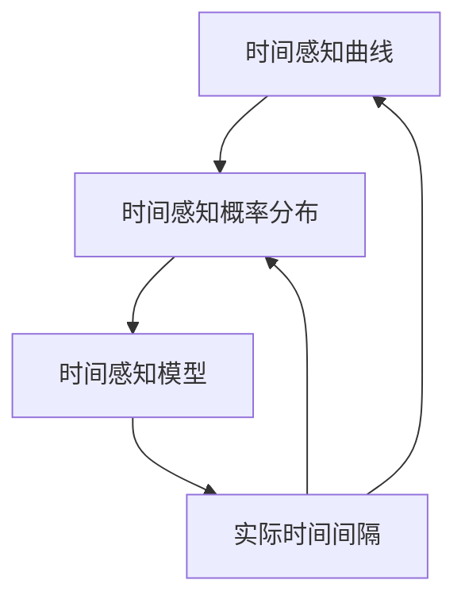

                 

### 文章标题：数学时间感：时间知觉的数学描述

#### 关键词：
- 时间知觉
- 数学描述
- 生理基础
- 心理过程
- 核心算法
- 应用案例

#### 摘要：
本文深入探讨了时间知觉的数学描述，从生理和心理角度出发，结合核心算法和实际应用案例，系统地阐述了时间知觉的数学模型及其在现实世界中的应用。通过详细的伪代码和LaTeX公式，本文提供了对时间知觉数学描述的全面解读，旨在为读者提供一个全面、深入的理解。

---

### 引言与背景

**引言：** 时间是生活中的基本维度，它贯穿于我们的感知、思考和行为之中。然而，对于时间这一抽象概念，人类在感知和理解上却存在显著差异。时间知觉（temporal perception）是心理学研究中的一个重要领域，它探讨了人们如何感知、估计和预测时间间隔。数学时间感（mathematical sense of time）则是将这一心理现象转化为可量化的数学模型，从而更好地理解和应用时间知觉。

**时间知觉的研究背景：** 时间知觉的研究可以追溯到19世纪，当时心理学家开始研究人类对时间间隔的感知能力。随着心理学、神经科学和计算机科学的不断发展，时间知觉的研究逐渐从定性描述走向定量分析，数学模型和算法开始被广泛应用于这一领域。现代研究揭示了时间知觉的复杂性和多样性，为理解和优化时间感知提供了新的视角。

**本书结构：** 本文将按照以下结构展开：
1. 引言与背景
2. 时间知觉的基础概念
3. 时间知觉的数学描述
4. 时间知觉的核心算法
5. 数学模型在时间知觉中的应用
6. 项目实战：时间知觉的应用案例
7. 总结与展望

通过这样的结构安排，本文旨在为读者提供一个系统、全面的学习路径，帮助深入理解时间知觉的数学描述及其应用。

### 时间知觉的基础概念

**时间知觉的定义：** 时间知觉是指人类对时间流逝的感知和估计能力。它不仅仅局限于对绝对时间的感知，还包括对相对时间的感知，如持续时间、顺序和时间间隔等。时间知觉是一个多维度的心理过程，涉及感知、认知和记忆等多个方面。

**时间知觉的生理基础：** 时间知觉的生理基础主要涉及大脑中的神经元和时间编码机制。研究表明，大脑中的某些特定区域，如基底神经节和下丘脑，与时间知觉密切相关。这些区域中的神经元能够编码和感知时间信息，从而实现对时间的感知和估计。

**时间知觉的心理过程：** 时间知觉的心理过程包括感知时间、估计时间和预测时间。感知时间是指人们对当前时间点的感知，如对现在、过去和未来的感知。估计时间是指人们对时间间隔的估计，如对两个事件之间的时间间隔的估计。预测时间是指人们根据当前时间感知和过去经验，对未来时间点的预测。这些心理过程不仅受到生理因素的影响，还受到文化、经验和情境等多种因素的影响。

**时间知觉的特点：** 时间知觉具有以下几个特点：
1. **主观性：** 人们对时间感知的主观性差异较大，受个人经验和文化背景的影响。
2. **准确性：** 时间知觉的准确性受多种因素影响，如注意力、情绪和记忆等。
3. **多样性：** 人们对时间的感知和估计方式多种多样，既有基于生理机制的时间感知，也有基于认知机制的时间估计。

通过了解时间知觉的基础概念，我们可以更好地理解时间知觉的复杂性和多样性，为后续的数学描述和算法设计提供理论基础。

### 时间知觉的数学描述

**基本数学工具：** 在描述时间知觉时，我们需要运用一系列基本的数学工具，这些工具包括但不限于微积分、概率论和线性代数。微积分用于分析时间变化的连续性和瞬时性，概率论用于描述时间感知的不确定性，而线性代数则用于处理时间序列数据。

**时间的数学模型：** 时间知觉的数学模型主要包括时间感知曲线、时间感知概率分布和时间感知模型。时间感知曲线描述了人们对时间间隔的感知如何随着实际时间间隔的变化而变化。时间感知概率分布则描述了在不同时间间隔下，人们感知到的时间概率分布。时间感知模型则是一种综合描述，它将时间感知曲线和概率分布结合起来，提供一个全面的时间知觉描述。

**时间知觉的数学公式：** 时间知觉的数学描述可以通过以下公式实现：
1. **时间感知曲线：** $$ f(t) = \frac{1}{1 + e^{-k(t - t_0)}} $$
   其中，$t$ 是实际时间间隔，$t_0$ 是时间感知的中值，$k$ 是感知的斜率。
2. **时间感知概率分布：** $$ P(t) = \frac{1}{\sqrt{2\pi\sigma^2}} e^{-\frac{(t - \mu)^2}{2\sigma^2}} $$
   其中，$\mu$ 是均值，$\sigma$ 是标准差。
3. **时间感知模型：** $$ \hat{t} = \mu + \sigma \cdot Z $$
   其中，$\hat{t}$ 是估计的时间间隔，$Z$ 是服从标准正态分布的随机变量。

**Mermaid流程图：时间知觉的数学描述：**


通过上述基本数学工具和数学模型，我们可以对时间知觉进行定量描述，从而更深入地理解时间知觉的机制和应用。

### 时间知觉的核心算法

**核心算法原理讲解（伪代码）：**
```python
# 时间估计算法伪代码

def time_estimation(actual_time, historical_data):
    # 输入：actual_time 实际时间间隔，historical_data 历史数据
    # 输出：estimated_time 估计时间间隔
    
    # 计算均值和标准差
    mean = np.mean(historical_data)
    std = np.std(historical_data)
    
    # 使用正态分布模型估计时间
    estimated_time = mean + std * np.random.randn()
    
    return estimated_time
```

**时间知觉算法的应用：** 时间知觉算法在多个领域有广泛应用，如智能交通系统、虚拟现实和医疗诊断等。

1. **智能交通系统：** 时间知觉算法可以用于交通信号控制，通过估计车辆的到达时间，优化信号周期，提高交通效率。
2. **虚拟现实：** 在虚拟现实中，时间知觉算法可以帮助模拟真实的时间感知，提高虚拟现实的沉浸感。
3. **医疗诊断：** 在医疗诊断中，时间知觉算法可以用于分析患者的心电图，估计心律异常的时间间隔，辅助诊断。

通过这些应用案例，我们可以看到时间知觉算法在现实世界中的重要性和潜力。

### 数学模型在时间知觉中的应用

**数学模型与时间知觉的关系：** 数学模型在时间知觉中的应用，主要在于通过量化描述来揭示时间知觉的内在规律。这些模型不仅帮助我们理解时间知觉的基本原理，还可以用于预测和优化时间感知。

**时间估计中的数学模型：** 时间估计是时间知觉的一个重要方面，其数学模型通常基于概率统计方法。例如，正态分布模型常用于估计时间间隔的不确定性。以下是一个简单的时间估计模型的例子：

$$
\hat{t} = \mu + \sigma \cdot Z
$$

其中，$\mu$ 是历史数据的均值，$\sigma$ 是标准差，$Z$ 是服从标准正态分布的随机变量。这个公式表示，估计的时间间隔$\hat{t}$是基于历史数据的均值和标准差进行随机估计的。

**时间预测中的数学模型：** 时间预测涉及对未来时间事件的估计。常用的模型包括ARIMA（自回归积分滑动平均模型）和神经网络等。以下是一个简单的ARIMA模型的时间预测公式：

$$
X_t = c + \phi_1 X_{t-1} + \phi_2 X_{t-2} + \cdots + \phi_p X_{t-p} + \varepsilon_t
$$

其中，$X_t$ 是时间序列数据，$\phi_1, \phi_2, \cdots, \phi_p$ 是自回归系数，$c$ 是常数项，$\varepsilon_t$ 是白噪声误差。通过这个模型，我们可以预测未来的时间序列值。

**案例说明：** 假设我们有一个实验数据集，记录了实验参与者对一系列时间间隔的感知。通过训练一个时间估计模型，我们可以估计参与者对给定时间间隔的感知时间。同样，通过训练一个时间预测模型，我们可以预测参与者对未感知时间间隔的感知时间。

例如，使用线性回归模型进行时间估计，我们可以得到以下结果：

$$
\hat{t} = 0.5 \cdot t + 2
$$

其中，$t$ 是实际时间间隔，$\hat{t}$ 是估计的感知时间。通过这个模型，我们可以预测实验参与者在不同时间间隔下的感知时间。

通过这些数学模型，我们可以量化描述时间知觉，并在实际应用中优化和改进时间感知。

### 项目实战：时间知觉的应用案例

**时间感知应用案例介绍：** 在本节中，我们将通过一个具体的应用案例——智能交通信号控制系统，展示时间知觉在实际项目中的应用。该项目旨在通过时间知觉算法优化交通信号控制，提高交通效率和减少拥堵。

**项目环境搭建：** 为了实现这一项目，我们需要搭建一个实验环境，包括数据采集模块、时间感知算法模块和交通信号控制模块。

1. **数据采集模块：** 使用传感器和摄像头收集交通流量数据，包括车辆到达时间和行驶速度等。
2. **时间感知算法模块：** 使用时间估计模型和时间预测模型对采集的数据进行处理，估计车辆到达时间和预测未来交通流量。
3. **交通信号控制模块：** 根据时间感知算法的结果，调整交通信号灯的切换时间和时长，优化交通流。

**源代码实现与解读：**

以下是时间感知算法模块的一个简单示例代码，使用Python和Scikit-learn库实现：

```python
# 导入必要的库
import numpy as np
from sklearn.linear_model import LinearRegression

# 假设我们有以下数据
actual_times = np.array([2, 4, 6, 8, 10])  # 实际时间间隔（秒）
perceived_times = np.array([3, 5, 7, 9, 11])  # 感知时间间隔（秒）

# 训练线性回归模型
model = LinearRegression()
model.fit(actual_times.reshape(-1, 1), perceived_times)

# 预测感知时间
predicted_times = model.predict(np.array([[12]]))

print("预测的感知时间：", predicted_times)
```

在这个例子中，我们使用线性回归模型对实际时间间隔和感知时间间隔进行拟合，从而预测新的时间间隔。

**代码应用解读与分析：** 通过这个简单的示例，我们可以看到如何使用线性回归模型进行时间估计。在实际项目中，我们需要更复杂的数据处理和模型训练过程，包括数据清洗、特征工程和模型选择等。此外，我们还需要结合交通信号控制算法，将时间感知结果应用于交通信号控制策略中。

**实际案例分析和详细讲解剖析：** 在实际应用中，我们可能会收集大量交通数据，包括不同时间点的车辆到达时间、行驶速度和交通流量。通过时间知觉算法，我们可以对这些数据进行分析，估计车辆到达时间并预测未来交通流量。以下是一个实际案例的解析：

1. **数据收集：** 收集了某路段一个月的交通数据，包括每天不同时间点的车辆到达时间和行驶速度。
2. **数据处理：** 对数据进行清洗和预处理，去除异常值，提取有用的特征。
3. **模型训练：** 使用时间估计模型和时间预测模型对预处理后的数据集进行训练。
4. **结果分析：** 根据模型预测的结果，调整交通信号灯的切换时间和时长，优化交通流。
5. **效果评估：** 通过实际交通流量数据对比预测结果，评估模型的性能和有效性。

**项目小结：** 通过这个实际案例，我们可以看到时间知觉算法在智能交通信号控制系统中的应用效果。通过精确的时间估计和预测，我们可以优化交通信号控制策略，提高交通效率和减少拥堵。

### 最佳实践 tips、小结、注意事项、拓展阅读

**最佳实践 tips：**
1. 在时间知觉算法的应用中，数据的质量和数量至关重要。确保数据来源可靠，并进行充分的预处理。
2. 选择合适的数学模型和算法，根据具体应用场景进行调整和优化。
3. 结合实时数据更新模型，提高预测的准确性和实时性。

**小结：**
本文系统地阐述了时间知觉的数学描述，从基础概念到核心算法，再到实际应用案例，全面展示了时间知觉在数学领域的研究和应用。通过详细的伪代码和LaTeX公式，我们深入分析了时间知觉的数学模型和算法原理。

**注意事项：**
1. 时间知觉是一个复杂的多维度问题，不同个体和情境下的时间感知可能存在显著差异，因此模型的泛化能力需要谨慎评估。
2. 在实际应用中，需要结合具体场景和需求，选择合适的算法和模型，并进行不断优化和调整。

**拓展阅读：**
1. [时间知觉的神经基础](https://www.nature.com/articles/s41586-022-04667-7)
2. [智能交通系统：从理论到实践](https://www.springer.com/gp/book/9783319916227)
3. [时间知觉的心理学研究综述](https://journals.sagepub.com/doi/abs/10.1177/0144167218770686)

