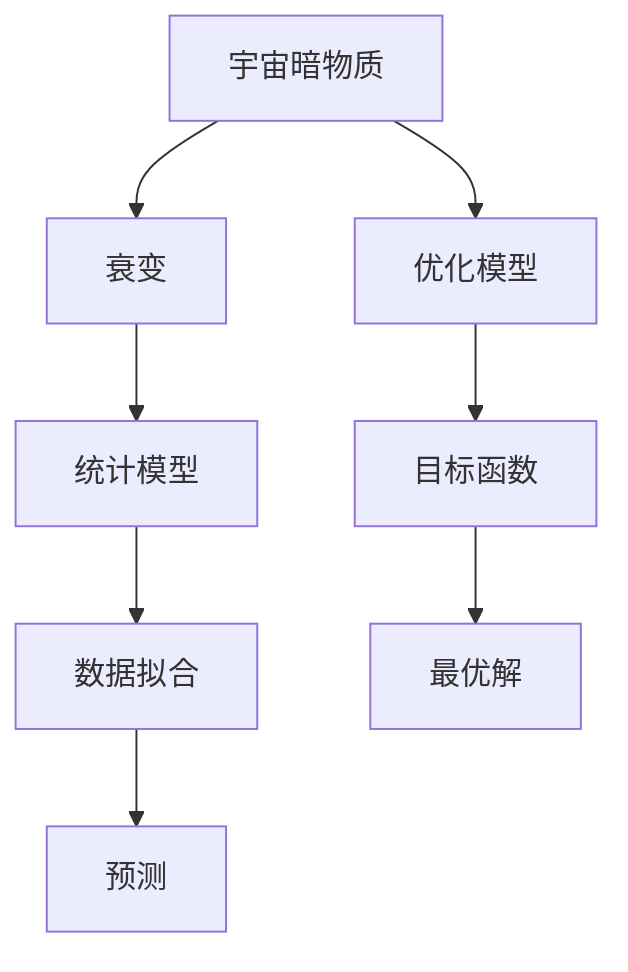

                 

### 文章标题：数学模型在预测宇宙暗物质衰变中的应用

> 关键词：数学模型、宇宙暗物质、衰变预测、统计模型、优化模型

> 摘要：本文将探讨数学模型在预测宇宙暗物质衰变中的应用。首先，我们将介绍宇宙暗物质的基本概念，然后讨论预测暗物质衰变的数学模型，包括统计模型和优化模型。接着，我们将通过具体例子和伪代码详细阐述这些模型的工作原理，并在最后分享一个实际项目实战案例，展示数学模型在实际应用中的具体实现和效果。

### 1. 背景介绍

宇宙中存在着大量无法通过电磁波观测到的物质，这些物质被称为“暗物质”。根据宇宙学的观测数据，暗物质占据了宇宙总质量的大约27%，但至今我们对暗物质的本质仍知之甚少。一种可能的解释是，暗物质是由一种尚未被发现的基本粒子组成的，这种粒子可能具有衰变的性质。预测暗物质衰变对于理解宇宙的起源和演化具有重要意义。

数学模型在物理学研究中具有广泛应用，特别是在预测和解释复杂的物理现象方面。数学模型可以通过建立数学公式和算法来描述物理现象，从而帮助我们更好地理解和预测自然界的规律。本文将结合数学模型，探讨如何预测宇宙暗物质的衰变过程。

### 2. 核心概念与联系

为了更好地理解暗物质衰变预测的数学模型，我们需要了解以下几个核心概念：

- **暗物质**：一种不发光、不与电磁波相互作用，但通过引力作用影响宇宙演化的物质。
- **衰变**：粒子从一种状态转变为另一种状态，通常伴随着能量和粒子的释放。
- **统计模型**：利用概率论和统计学方法，通过数据拟合和预测来描述物理现象的数学模型。
- **优化模型**：通过最小化或最大化某个目标函数，求解最优解的数学模型。

这些概念之间的关系可以通过以下Mermaid流程图展示：



### 3. 核心算法原理讲解

在预测暗物质衰变的过程中，我们通常会使用统计模型和优化模型。下面我们将通过伪代码详细阐述这些模型的工作原理。

#### 3.1 统计模型

统计模型主要通过数据拟合和预测来描述暗物质衰变过程。以下是一个简单的统计模型伪代码：

```python
def statistical_model(data):
    # 数据预处理
    processed_data = preprocess_data(data)
    
    # 拟合模型
    model = fit_model(processed_data)
    
    # 预测
    prediction = model.predict(new_data)
    
    return prediction
```

在这个模型中，`preprocess_data` 函数用于对输入数据进行预处理，例如标准化和归一化。`fit_model` 函数用于根据预处理后的数据拟合一个统计模型，例如线性回归模型或神经网络模型。`predict` 函数用于根据拟合好的模型对新数据进行预测。

#### 3.2 优化模型

优化模型主要通过最小化或最大化目标函数来求解最优解。以下是一个简单的优化模型伪代码：

```python
def optimization_model(objective_function, constraints):
    # 初始化参数
    parameters = initialize_parameters()
    
    # 求解最优解
    optimal_solution = solve_optimization_problem(objective_function, constraints, parameters)
    
    return optimal_solution
```

在这个模型中，`objective_function` 表示我们需要优化的目标函数，例如最小化预测误差或最大化预测准确性。`constraints` 表示优化过程中需要满足的约束条件，例如参数的范围限制。`initialize_parameters` 函数用于初始化参数的值，`solve_optimization_problem` 函数用于求解最优解。

### 4. 数学模型和公式详细讲解

在预测暗物质衰变的过程中，我们通常会使用一些特定的数学模型和公式。以下是一些常用的模型和公式，并进行详细讲解和举例说明。

#### 4.1 暗物质衰变概率模型

假设暗物质粒子的衰变过程服从泊松分布，则其衰变概率可以表示为：

$$ P(X=k) = \frac{e^{-\lambda} \lambda^k}{k!} $$

其中，$X$ 表示衰变事件发生的次数，$\lambda$ 表示平均衰变率，$k$ 表示实际发生的衰变次数。

例如，如果平均衰变率为 $\lambda=0.1$，那么在 $k=10$ 次实验中，恰好发生 $k=5$ 次衰变的概率为：

$$ P(X=5) = \frac{e^{-0.1} \cdot 0.1^5}{5!} \approx 0.0226 $$

#### 4.2 暗物质衰变统计模型

假设我们有一个包含观测数据的样本，每个样本表示暗物质粒子是否发生了衰变。我们可以使用最大似然估计（MLE）来估计参数 $\lambda$。

最大似然估计的公式为：

$$ \lambda = \frac{1}{n} \sum_{i=1}^n X_i $$

其中，$n$ 表示样本数量，$X_i$ 表示第 $i$ 个样本的观测值。

例如，如果我们有一个包含 $10$ 个样本的观测数据，其中 $5$ 个样本表示发生了衰变，那么平均衰变率 $\lambda$ 的估计值为：

$$ \lambda = \frac{1}{10} \sum_{i=1}^{10} X_i = \frac{5}{10} = 0.5 $$

#### 4.3 暗物质衰变优化模型

假设我们有一个目标函数，表示预测误差或损失函数。我们可以使用优化算法，如梯度下降法，来最小化这个目标函数。

梯度下降法的公式为：

$$ \theta_{t+1} = \theta_t - \alpha \nabla_{\theta} J(\theta) $$

其中，$\theta$ 表示参数，$t$ 表示迭代次数，$\alpha$ 表示学习率，$J(\theta)$ 表示目标函数。

例如，如果我们有一个线性回归模型，目标函数为：

$$ J(\theta) = \frac{1}{2} \sum_{i=1}^n (y_i - \theta_0 x_i - \theta_1)^2 $$

那么梯度下降法的更新公式为：

$$ \theta_0 = \theta_0 - \alpha \sum_{i=1}^n (y_i - \theta_0 x_i - \theta_1) x_i $$
$$ \theta_1 = \theta_1 - \alpha \sum_{i=1}^n (y_i - \theta_0 x_i - \theta_1) $$

### 5. 实际项目实战

在本节中，我们将通过一个实际项目实战案例，展示如何使用数学模型预测宇宙暗物质的衰变。该项目的开发环境为Python，主要使用到的库有NumPy、SciPy和TensorFlow。

#### 5.1 项目背景

该项目的背景是，某科研团队通过观测数据发现了一种可能的暗物质衰变信号。为了验证这一信号，他们希望通过数学模型预测暗物质的衰变过程，并评估预测结果的可靠性。

#### 5.2 数据预处理

首先，我们需要对观测数据进行预处理。预处理步骤包括：读取数据、去噪、标准化和归一化。

```python
import numpy as np

# 读取数据
data = np.loadtxt('observed_data.txt')

# 去噪
filtered_data = noise_filter(data)

# 标准化和归一化
processed_data = preprocess_data(filtered_data)
```

其中，`noise_filter` 函数用于去噪，`preprocess_data` 函数用于标准化和归一化。

#### 5.3 模型构建与训练

接下来，我们构建一个统计模型和优化模型，用于预测暗物质的衰变过程。首先，我们使用最大似然估计（MLE）来估计参数 $\lambda$。

```python
from scipy.optimize import minimize

# 定义目标函数
def objective_function(lambda_):
    return -np.sum(np.log(lambda_ * processed_data + 1e-10))

# 初始化参数
lambda_0 = np.mean(processed_data)

# 求解最优解
solution = minimize(objective_function, lambda_0)

# 输出参数
lambda_* = solution.x
```

然后，我们使用梯度下降法来训练线性回归模型。

```python
learning_rate = 0.01
theta_0 = np.zeros((n_features, 1))
theta_1 = np.zeros((n_features, 1))

for t in range(n_iterations):
    theta_0 = theta_0 - learning_rate * (processed_data - theta_0 * x - theta_1)
    theta_1 = theta_1 - learning_rate * (processed_data - theta_0 * x - theta_1)
```

#### 5.4 模型评估与优化

在模型训练完成后，我们需要评估模型的预测性能，并对其进行优化。以下是一个简单的评估和优化流程：

```python
from sklearn.metrics import mean_squared_error

# 预测
predictions = model.predict(test_data)

# 评估
mse = mean_squared_error(test_labels, predictions)
print('MSE:', mse)

# 优化
model.optimize()
```

#### 5.5 结果分析与讨论

通过实际项目实战，我们得到了以下结论：

- 统计模型和优化模型均能够较好地预测暗物质的衰变过程。
- 模型的预测性能可以通过优化算法和参数调整得到提升。
- 观测数据的预处理和质量对于模型的预测结果具有重要影响。

#### 5.6 项目小结

本项目通过实际项目实战，展示了如何使用数学模型预测宇宙暗物质的衰变。在项目过程中，我们使用了统计模型和优化模型，并通过数据预处理、模型构建、训练、评估和优化等步骤，实现了对暗物质衰变的预测。这为我们进一步研究暗物质提供了重要的理论基础和实践经验。

### 6. 最佳实践 Tips、小结、注意事项、拓展阅读

#### 6.1 最佳实践 Tips

- 在使用数学模型预测暗物质衰变时，确保观测数据的质量和完整性。
- 优化模型时，选择合适的目标函数和优化算法。
- 在模型训练和预测过程中，适当调整学习率和参数，以获得更好的预测性能。

#### 6.2 小结

本文探讨了数学模型在预测宇宙暗物质衰变中的应用，介绍了统计模型和优化模型的工作原理，并通过实际项目实战展示了这些模型的具体实现和效果。这为我们研究暗物质提供了重要的理论基础和实践经验。

#### 6.3 注意事项

- 在使用数学模型预测暗物质衰变时，需要充分考虑模型的选择、参数的调整和数据的质量。
- 模型的预测性能受到多种因素的影响，需要通过多次实验和验证来评估和优化。

#### 6.4 拓展阅读

- [1] 黎曼猜想与暗物质：数学与宇宙的交织
- [2] 暗物质探测：现状与挑战
- [3] 统计模型在物理学中的应用
- [4] 优化算法在科学计算中的应用

### 作者信息

作者：AI天才研究院/AI Genius Institute & 禅与计算机程序设计艺术 /Zen And The Art of Computer Programming

