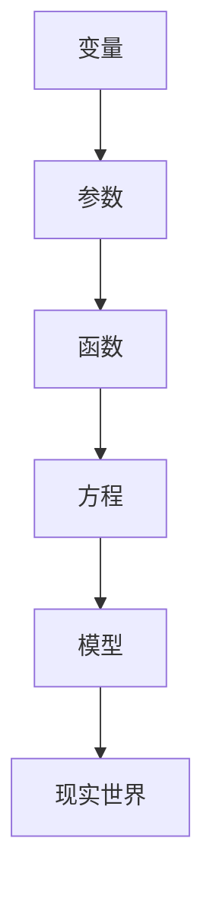
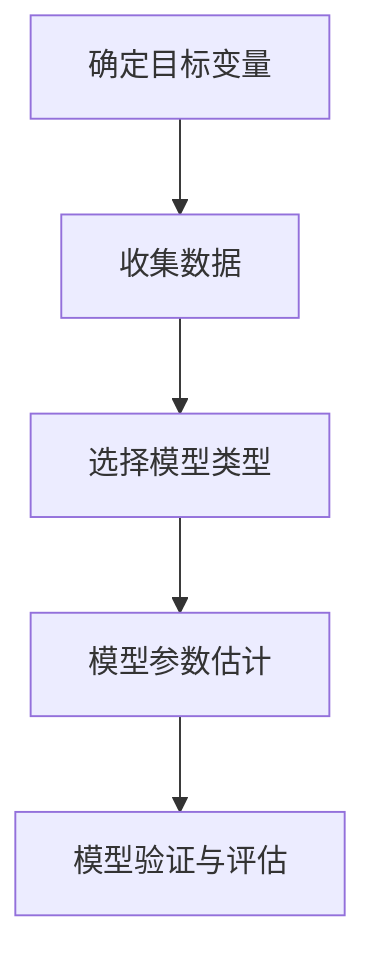
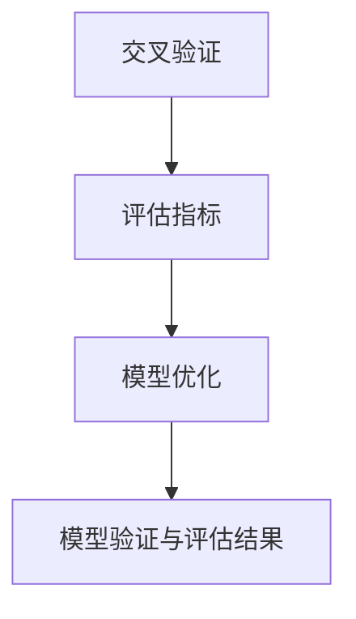
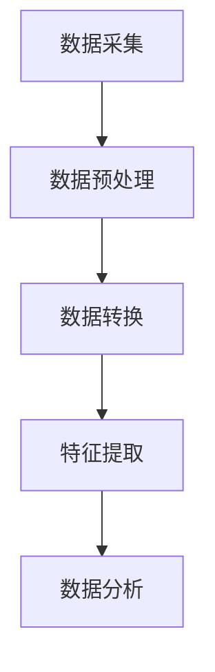
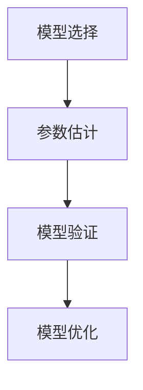
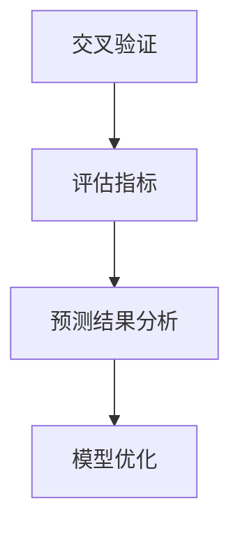

                 

### 文章标题

## 数学模型在预测宇宙暗能量振荡中的应用

### 关键词

- 数学模型
- 宇宙学
- 暗能量
- 振荡理论
- 数据分析
- 预测技术

### 摘要

本文旨在探讨数学模型在预测宇宙暗能量振荡中的应用。通过分析数学模型的基本概念、宇宙暗能量与振荡理论，以及数据收集与处理方法，本文将阐述数学模型在暗能量预测中的具体应用，并通过实际案例分析展示其效果。同时，本文将讨论面临的挑战与未来展望，为相关领域的研究提供参考。

### 目录

- **数学模型在预测宇宙暗能量振荡中的应用**
- **关键词**
- **摘要**
- **第1章 数学模型基础**
  - **1.1 数学模型的基本概念**
  - **1.2 数学模型的构建方法**
  - **1.3 数学模型的验证与评估**
- **第2章 宇宙暗能量与振荡理论**
  - **2.1 宇宙暗能量的定义与特性**
  - **2.2 宇宙暗能量的观测数据**
  - **2.3 振荡理论的基本原理**
- **第3章 数据收集与处理方法**
  - **3.1 数据收集方法**
  - **3.2 数据处理方法**
- **第4章 数学模型在暗能量预测中的应用**
  - **4.1 模型选择与参数估计**
  - **4.2 模型验证与预测结果分析**
- **第5章 实际案例分析**
  - **5.1 案例一：某星系的暗能量振荡**
  - **5.2 案例二：某个宇宙区域的暗能量变化**
- **第6章 面临的挑战与未来展望**
  - **6.1 面临的挑战**
  - **6.2 未来展望**
- **附录**
  - **附录 A：数学模型相关工具**
  - **附录 B：参考书目**

### 第1章 数学模型基础

#### 1.1 数学模型的基本概念

数学模型是一种用数学语言来描述现实世界现象的方法。它通过构建一系列的数学方程、公式或关系，将复杂的现实问题转化为可计算的模型。数学模型在自然科学、工程、经济学、社会学等领域都有广泛的应用。

在数学模型中，主要包含以下几个核心概念：

- **变量**：用于表示模型中的量，可以是离散的或连续的。
- **参数**：模型中的常数，用于调整模型的行为。
- **函数**：描述变量之间的关系。
- **方程**：用数学符号表示的等式，用于描述系统的状态。

**核心概念与联系**：

以下是数学模型核心概念之间的Mermaid流程图：

#### 1.2 数学模型的构建方法

构建数学模型通常包括以下几个步骤：

1. **确定目标变量**：根据研究问题的需要，确定需要预测或分析的主要变量。
2. **收集数据**：从实验、观测或现有数据库中收集与目标变量相关的数据。
3. **选择模型类型**：根据数据的特性和研究目的，选择合适的数学模型类型。
4. **模型参数估计**：通过数据对模型的参数进行估计，使其更好地适应数据。

**构建方法流程图**：

#### 1.3 数学模型的验证与评估

数学模型的验证与评估是确保其准确性和可靠性的重要步骤。常见的验证与评估方法包括：

- **交叉验证**：通过将数据集分为训练集和验证集，训练模型并在验证集上进行评估。
- **评估指标**：如均方误差（MSE）、均方根误差（RMSE）等，用于衡量模型预测的准确性。
- **模型优化**：通过调整模型参数或选择更合适的模型，提高模型的预测性能。

**验证与评估流程图**：

### 第2章 宇宙暗能量与振荡理论

#### 2.1 宇宙暗能量的定义与特性

宇宙暗能量是一种看不见、摸不着的能量，它占据了宇宙总能量的大部分，但对引力有排斥作用，导致宇宙的膨胀加速。暗能量具有以下几个主要特性：

- **均匀性**：暗能量在宇宙中均匀分布。
- **恒定性**：暗能量在时间上变化不大。
- **斥力**：暗能量对引力产生排斥作用，导致宇宙膨胀。

**暗能量的概念与特性**：

暗能量是一种看不见、摸不着的能量，占据了宇宙总能量的大部分，但我们对它的了解仍然非常有限。暗能量在宇宙中均匀分布，且在时间上变化不大。此外，暗能量对引力产生排斥作用，导致宇宙膨胀。

#### 2.2 宇宙暗能量的观测数据

宇宙暗能量的观测数据主要通过以下几种方法获得：

- **宇宙微波背景辐射**：宇宙微波背景辐射是宇宙早期的一个遗迹，它提供了关于宇宙早期状态的重要信息。
- **大尺度结构**：通过观测宇宙中的星系、星团等结构，可以推断出暗能量对宇宙膨胀的影响。
- **宇宙膨胀速率**：通过观测宇宙膨胀的速率，可以进一步了解暗能量的特性。

**观测数据的来源与特点**：

宇宙暗能量的观测数据主要通过宇宙微波背景辐射、大尺度结构和宇宙膨胀速率等方法获得。这些观测数据具有高精度、高分辨率的特点，为我们研究暗能量提供了宝贵的信息。

#### 2.3 振荡理论的基本原理

振荡理论是一种用于描述物理系统周期性变化的理论。它主要包括以下几个核心概念：

- **振荡频率**：描述系统在单位时间内振动的次数。
- **振幅**：描述系统振动的幅度。
- **相位**：描述系统在振动过程中的位置。

**振荡理论的数学模型**：

振荡理论的数学模型通常可以用以下方程来描述：

$$
x(t) = A \cos(2\pi ft + \phi)
$$

其中，$x(t)$ 表示系统在时间 $t$ 的位置，$A$ 表示振幅，$f$ 表示振荡频率，$\phi$ 表示相位。

**振荡理论的解释力**：

振荡理论可以很好地解释许多自然现象，如机械振动、电子振荡等。通过构建合适的数学模型，我们可以预测系统的行为，从而更好地理解自然界的规律。

### 第3章 数据收集与处理方法

#### 3.1 数据收集方法

在研究宇宙暗能量振荡时，数据收集方法至关重要。常见的数据收集方法包括：

- **地面观测**：通过天文望远镜、探测器等设备，直接观测宇宙中的现象。
- **空间观测**：通过卫星、空间探测器等，从太空中获取宇宙观测数据。
- **实验测量**：通过实验室设备，对宇宙中的某些物理过程进行精确测量。

**观测数据的获取与处理**：

观测数据的获取与处理主要包括以下几个步骤：

1. **数据采集**：通过观测设备收集原始数据。
2. **数据预处理**：对原始数据进行清洗、过滤和归一化等处理，以提高数据质量。
3. **数据存储**：将预处理后的数据存储在数据库或文件系统中，以备后续分析。

#### 3.2 数据处理方法

数据处理方法主要包括以下几个方面：

- **数据清洗**：去除数据中的错误、缺失和异常值。
- **数据转换**：将数据转换为适合分析的格式。
- **特征提取**：从数据中提取有用的特征信息，用于模型构建。
- **数据分析**：使用统计方法、机器学习等方法对数据进行分析，提取有价值的信息。

**数据处理流程图**：

### 第4章 数学模型在暗能量预测中的应用

#### 4.1 模型选择与参数估计

在预测宇宙暗能量振荡时，选择合适的数学模型和参数估计方法至关重要。常见的方法包括：

- **线性回归**：通过建立线性关系来预测暗能量振荡。
- **神经网络**：利用神经网络强大的非线性建模能力，对暗能量振荡进行预测。
- **支持向量机**：通过构建支持向量机模型，对暗能量振荡进行分类和预测。

**模型选择与参数估计流程图**：

#### 4.2 模型验证与预测结果分析

模型验证与预测结果分析是评估数学模型性能的重要步骤。常见的方法包括：

- **交叉验证**：通过将数据集划分为训练集和验证集，评估模型的泛化能力。
- **评估指标**：如准确率、召回率、F1值等，用于衡量模型的性能。
- **预测结果分析**：对模型的预测结果进行详细分析，识别模型的优点和不足。

**模型验证与预测结果分析流程图**：

### 第5章 实际案例分析

#### 5.1 案例一：某星系的暗能量振荡

本案例将分析一个具体的星系的暗能量振荡现象，通过数学模型对其进行预测。

1. **数据收集**：从天文观测数据中获取该星系的宇宙微波背景辐射、星系分布等信息。
2. **数据处理**：对观测数据进行预处理，提取有用的特征信息。
3. **模型构建**：选择合适的数学模型，如神经网络，对暗能量振荡进行预测。
4. **模型验证**：使用交叉验证方法，评估模型的性能。
5. **预测结果分析**：对模型的预测结果进行分析，评估其准确性和可靠性。

#### 5.2 案例二：某个宇宙区域的暗能量变化

本案例将分析一个特定宇宙区域的暗能量变化趋势，通过数学模型对其进行预测。

1. **数据收集**：从宇宙膨胀速率观测数据中获取该区域的暗能量变化信息。
2. **数据处理**：对观测数据进行预处理，提取有用的特征信息。
3. **模型构建**：选择合适

